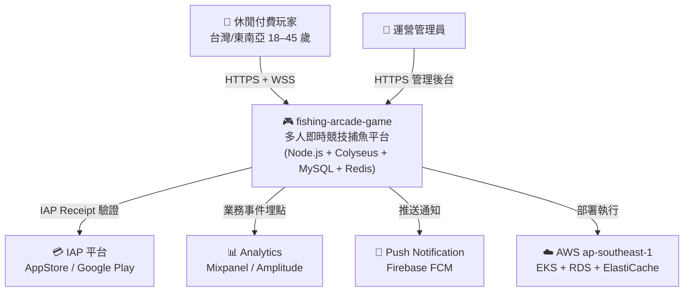
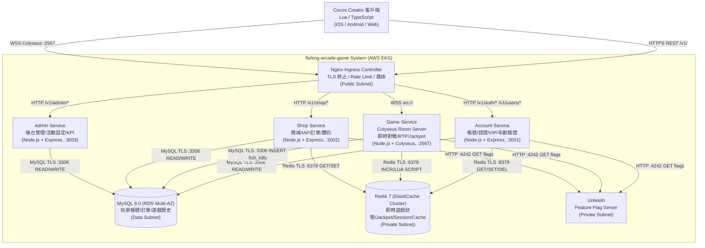
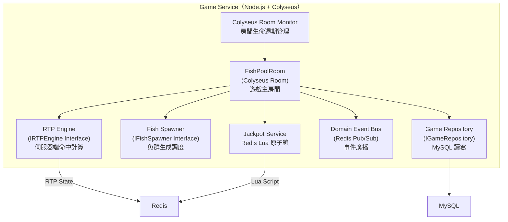
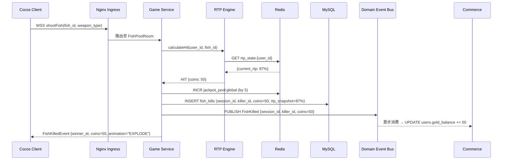
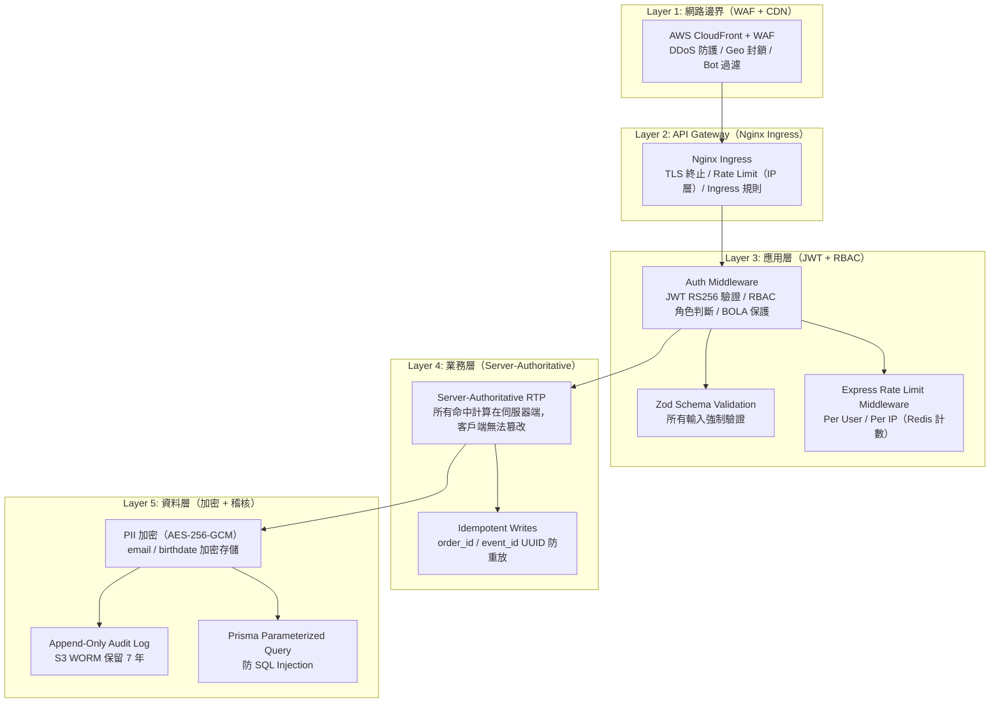
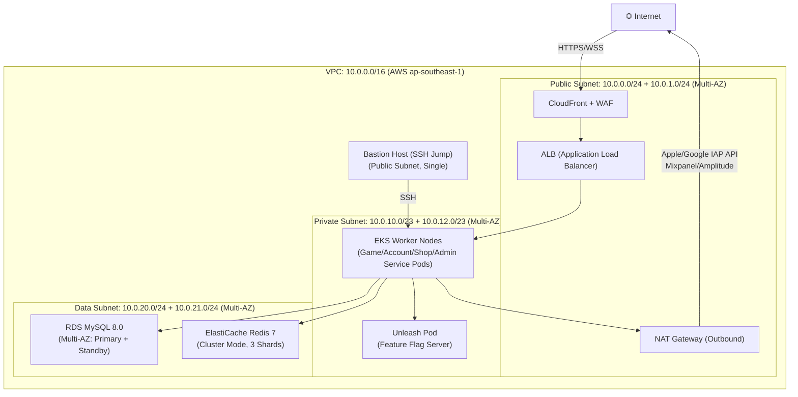

# ARCH — 架構設計文件（Architecture Design）
<!-- 上游 EDD 回答「怎麼實作」；本文件回答「系統整體架構如何組織、演進、保障品質」 -->

---

## Document Control

| 欄位 | 內容 |
|------|------|
| **DOC-ID** | ARCH-FISHGAME-20260424 |
| **專案名稱** | fishing-arcade-game（捕魚街機遊戲平台）|
| **Project Slug** | `fishing-arcade-game` |
| **文件版本** | v1.0 |
| **狀態** | DRAFT |
| **作者（Tech Lead / Architect）** | AI Generated (gendoc-gen-arch) |
| **日期** | 2026-04-24 |
| **上游 EDD** | [EDD.md](EDD.md)（EDD-FISHGAME-20260424）|
| **上游 PRD** | [PRD.md](PRD.md)（PRD-FISHGAME-20260424）|
| **上游 BRD** | [BRD.md](BRD.md) |
| **上游 IDEA** | [IDEA.md](IDEA.md) |
| **審閱者** | System Architect, DevOps/SRE Lead, Security Engineer |
| **核准者** | CTO / Engineering Lead |

---

## Change Log

| 版本 | 日期 | 作者 | 變更摘要 |
|------|------|------|---------|
| v1.0 | 2026-04-24 | AI Generated (gendoc-gen-arch) | 初稿 |

---

## 目錄

1. 架構目標
2. 架構模式選擇
3. 系統元件圖（C4 L1/L2/L3）
4. 服務邊界
5. 通訊模式
6. 資料分層
7. 高可用設計
8. 災難恢復（DR）
9. 安全架構
10. 擴展策略
11. 技術棧全覽
12. Observability 架構
13. 外部依賴地圖
14. Architecture Decision Records（完整）
15. 架構審查檢查清單
16. FinOps 成本優化
17. API Gateway & Service Mesh

---

## 1. 架構目標

### 1.1 品質屬性需求（Quality Attribute Requirements）

> 來源：BRD §5.4 NFR + EDD §10.5 SLO

| 屬性 | 目標值 | 測量方式 | 優先級 |
|------|--------|---------|--------|
| 可用性（Availability） | ≥ 99.5%（BRD NFR-AVAIL-001）| Prometheus Uptime Probe（30 天滾動）| P0 |
| WebSocket 延遲（Latency） | P99 ≤ 100ms（BRD NFR-PERF-001）| k6 WebSocket Session Duration histogram | P0 |
| REST 延遲（Latency） | P99 ≤ 500ms（BRD NFR-PERF-002）| APM Trace + Prometheus http_request_duration | P0 |
| 錯誤率（Error Rate） | ≤ 0.1%（BRD NFR-REL-001）| Prometheus `rate(http_requests_total{status=~"5.."}[1m])`  | P0 |
| 峰值吞吐量 | 6,000 WS events/s + 500 REST QPS | k6 Load Test（§7.2 門檻）| P0 |
| 峰值並發 | 1,000 concurrent players / 200 rooms | HPA 自動擴縮驗證 | P1 |
| 可擴展性 | 水平擴展至 Game Service 20 副本 | k8s HPA 觸發測試 | P1 |
| 可觀測性 | Tracing Coverage > 90%（關鍵路徑）| Jaeger Sampling Rate 配置驗證 | P1 |
| 安全性 | Zero-trust + OWASP A01–A10 覆蓋 | 滲透測試 + SAST（Snyk）| P0 |

**約束條件（Constraints）：**
- 預算：Phase 1–2 月費 USD 800–3,000（AWS ap-southeast-1）
- 法規遵循：東南亞博彩法規（RTP 稽核）、GDPR（PII 保護）、Apple/Google IAP 規範
- 既有限制：BRD §8.3 技術約束 — 客戶端 Cocos Creator 3.x（Lua/TypeScript）、伺服器 Colyseus 0.15
- 團隊：初期 3–5 人工程團隊；Phase 3 前維持 Modular Monolith

---

### 1.2 Architecture Decision Record（ADR）索引

| ADR-ID | 決策標題 | 狀態 | 決策日期 | 影響範圍 |
|--------|---------|------|---------|---------|
| ADR-001 | 選用 Colyseus 0.15 作為即時通訊框架 | Accepted | 2026-04-24 | Game BC / WebSocket 層 |
| ADR-002 | 選用 MySQL 8.0 作為主要持久化層 | Accepted | 2026-04-24 | 所有 BC 資料層 |
| ADR-003 | Server-Authoritative RTP（伺服器端命中計算）| Accepted | 2026-04-24 | Game BC / 防作弊 |
| ADR-004 | Modular Monolith（非 Microservices）架構模式 | Accepted | 2026-04-24 | 全系統部署策略 |
| ADR-005 | Unleash 自建 Feature Flag 系統 | Accepted | 2026-04-24 | 所有 Feature Release |
| ADR-006 | Prisma 5.x ORM（TypeScript-first）| Accepted | 2026-04-24 | 所有 Repository 層 |

詳細 ADR 見 §14。

---

## 2. 架構模式選擇

### 2.1 高層架構模式：Modular Monolith

**選型決策**：Modular Monolith（非 Microservices）

詳細選型理由見 EDD §3.1。此處摘要架構影響：

| 決策維度 | 說明 |
|---------|------|
| **部署單元** | 4 個獨立 k8s Deployment（Account/Game/Shop/Admin Service），共享 MySQL 和 Redis |
| **服務間通訊** | 同進程：直接函式呼叫；跨 Deployment：Redis Pub/Sub Domain Event |
| **擴展粒度** | 各 Deployment 可獨立 HPA（Game Service 可擴展至 20 副本，不影響 API Service）|
| **Phase 3 觸發** | Game Service 峰值 QPS > 10,000 events/s → 沿現有 Bounded Context 邊界拆出為獨立 Microservice |

### 2.2 分層架構模式

```
┌─────────────────────────────────────────────┐
│  Presentation Layer                          │
│  Express Controller / Colyseus Room Handler  │
│  → 輸入驗證（Zod）、路由、Auth Middleware     │
│  → 不含業務邏輯；呼叫 Application Layer      │
├─────────────────────────────────────────────┤
│  Application Layer                           │
│  Use Case / Service（AccountSvc/GameSvc/…）  │
│  → 業務流程協調、事務邊界、Domain Event 發布  │
│  → 依賴 Domain Layer Interface，不依賴 DB 具體實作 │
├─────────────────────────────────────────────┤
│  Domain Layer                                │
│  Entity + Domain Service + Interface         │
│  → 純業務語意（RTP 計算、Jackpot 規則）      │
│  → 不依賴任何 Infrastructure（零 DB import） │
├─────────────────────────────────────────────┤
│  Infrastructure Layer                        │
│  Repository（Prisma/MySQL）/ Cache（Redis）   │
│  / IAP Client / Analytics SDK               │
│  → 實作 Domain Interface                    │
└─────────────────────────────────────────────┘

依賴方向：Controller → Application → Domain → Infrastructure
禁止：Repository 呼叫 Service
禁止：Controller 直接存取 DB / Redis
禁止：Domain Entity import Prisma / ORM annotation
```

---

## 3. 系統元件圖

### 3.1 C4 Model — System Context（L1）



### 3.2 C4 Model — Container（L2）



### 3.3 C4 Model — Component（L3 — Game Service 內部）



### 3.4 Data Flow Diagram（Write Path — 捕魚結算）



**PII 敏感資料流向表**

| PII 資料類型 | 流經元件 | 儲存位置 | Masking 規則 | 加密措施 |
|------------|---------|---------|------------|---------|
| Email | Registration → AccountSvc → MySQL | MySQL users.email | Log 中遮罩：`t***@***.com` | AES-256-GCM（PII_AES_KEY）|
| Birthdate | Registration → AccountSvc → MySQL | MySQL users.birthdate | 不在 Log 中記錄 | AES-256-GCM（PII_AES_KEY）|
| IP Address | Nginx Ingress → All Services | Log（hash 後）| SHA256(ip_addr) → ip_hash | 不存明文 |
| IAP Receipt | Client → ShopSvc → IAP Platform | MySQL orders.iap_receipt_hash | 僅存 Hash | SHA256 Hash |

---

## 4. 服務邊界

### 4.1 Bounded Context 與 Context Map

> 依據 EDD §3.4 DDD Bounded Context。

```mermaid
graph LR
    subgraph BC_Account["Account BC\n帳號/認證/VIP/年齡驗證"]
        UserAgg["User Aggregate\nemail, password_hash, age_status, vip_tier, balances"]
        VipSub["VipSubscription Aggregate\nactivated_at, expires_at, status"]
    end

    subgraph BC_Game["Game BC\n遊戲邏輯/RTP/Jackpot/Fish"]
        RoomAgg["GameRoom Aggregate\nstatus, player_count, jackpot_pool"]
        FishAgg["Fish Aggregate\ntype, base_value, hit_points"]
        WeaponVO["Weapon Value Object\ntype, damage, cooldown"]
    end

    subgraph BC_Commerce["Commerce BC\n商城/IAP/訂單/鑽石"]
        OrderAgg["Order Aggregate\norder_id(UUID), status, amount_usd"]
        ProductVO["Product Value Object\nproduct_id, diamonds, price_usd"]
    end

    subgraph BC_IAP["IAP Platform（外部）\nAppStore / Google Play"]
        Receipt["Receipt Validation API"]
    end

    BC_Account -->|"Customer/Supplier\nGame 消費 Account JWT User ID\nAccount 保證 Token API 穩定"| BC_Game
    BC_Game -->|"Published Language\nDomain Event（FishKilled/JackpotTriggered）\n通知 Commerce 更新金幣餘額"| BC_Commerce
    BC_Commerce -->|"Conformist\n遵從 IAP Platform Receipt 格式\n無法修改外部 API 契約"| BC_IAP
```



### 4.2 Anti-Corruption Layer（ACL）設計

| 外部系統 | ACL 位置 | 轉換邏輯 |
|---------|---------|---------|
| Apple AppStore Receipt | `ShopSvc/infrastructure/iap/AppleIAPClient.ts` | 將 Apple 格式回應（`status: 0`）轉換為內部 `IAPVerifyResult` |
| Google Play Receipt | `ShopSvc/infrastructure/iap/GoogleIAPClient.ts` | 將 Google `purchaseState: 0` 轉換為 `IAPVerifyResult` |
| Mixpanel/Amplitude | `shared/infrastructure/analytics/AnalyticsClient.ts` | 將內部 DomainEvent 轉換為平台特定事件格式 |

---

## 5. 通訊模式

### 5.1 同步 / 非同步通訊矩陣

| 通訊方向 | 類型 | 實作方式 | 使用場景 |
|---------|------|---------|---------|
| Client → API Services | 同步 HTTP | REST JSON `/v1/` + Authorization: Bearer JWT | 帳號、商城、VIP 操作 |
| Client → Game Service | 同步 WebSocket | Colyseus Schema State Sync（WSS）| 即時遊戲對戰 |
| API Gateway → Service | 同步 HTTP | Nginx Proxy Pass（Pod Service）| 所有 REST API 路由 |
| Game BC → Commerce BC | 非同步 Event | Redis Pub/Sub（Domain Event）| FishKilled / JackpotTriggered 結算 |
| Game BC → Analytics | 非同步 Event | Redis Pub/Sub + Analytics Buffer | 遊戲事件埋點 |
| Account BC → Commerce BC | 非同步 Event | Redis Pub/Sub | VipActivated / IAPPurchaseCompleted 更新餘額 |
| Colyseus Room → Admin | 非同步 Event | Redis Pub/Sub | 管理後台實時 KPI 更新 |

### 5.2 Domain Event 清單

| 事件名稱 | Publisher BC | Subscriber BC | Redis Channel | 冪等保證 |
|---------|------------|-------------|--------------|---------|
| `user.registered` | Account BC | Analytics | `events:account` | UUID event_id |
| `game.fish_killed` | Game BC | Commerce BC, Analytics | `events:game` | UUID event_id |
| `game.jackpot_triggered` | Game BC | Commerce BC, Analytics, Push | `events:game` | Redis Lua 原子確保 |
| `game.session_ended` | Game BC | Commerce BC, Analytics | `events:game` | UUID event_id |
| `commerce.iap_purchase_completed` | Commerce BC | Account BC | `events:commerce` | order_id 冪等 |
| `commerce.vip_activated` | Commerce BC | Account BC, Analytics | `events:commerce` | UUID event_id |

### 5.3 WebSocket（Colyseus）通訊規範

```
連線建立：WSS → Nginx Ingress → Game Service（Colyseus :2567）
認證：Colyseus onAuth() 驗證 JWT（Bearer Token 作為 options 傳入）
State Sync：Colyseus Schema Delta Sync（只傳送變更欄位，減少 40–60% 帶寬）
心跳：Colyseus 內建 heartbeat（30s 超時 → 標記 DISCONNECTED）
重連：Colyseus reconnect() API + 30s 窗口（逾時 Bot 取代）
```

### 5.4 資料一致性策略

**一致性模型選擇**：Modular Monolith Phase 1–2 採用「跨 BC Eventual Consistency + BC 內 Strong Consistency（ACID）」的混合模型。

| 場景 | 一致性模型 | 實作方式 | 失敗補償 |
|------|----------|---------|---------|
| BC 內事務（單 Service DB 寫）| Strong（ACID）| Prisma Transaction + MySQL InnoDB | 自動 Rollback |
| 跨 BC 事件（Redis Pub/Sub）| Eventual | Domain Event + Consumer 冪等（UUID event_id）| 重試：Consumer 重啟時重消費（注意：Redis Pub/Sub 無持久化）|
| Jackpot 扣款（原子操作）| Strong（Redis Atomic）| Redis Lua Script（原子鎖 + INCR）| Lua Script 失敗 → 不扣款（fail-safe）|
| IAP 充值（外部 → 內部）| Eventual + 補償 | ShopSvc 驗證 Receipt → 發 IAPPurchaseCompleted Event | Circuit Breaker + 訂單 PENDING → 異步重試最多 3 次 |

**Redis Pub/Sub 消息丟失緩解方案**（Phase 1–2）：

> Redis Pub/Sub 是 Fire-and-Forget，Consumer 離線期間消息不存儲。緩解措施：
> 1. **雙寫策略**：GameSvc 在 `fish_kills` 表寫入結算記錄（Strong Consistency）；Commerce BC Consumer 消費事件更新 `users.gold_balance`
> 2. **對帳機制**：每日 03:00 UTC 執行 `fish_kills` 與 `users.gold_balance` 差異對帳 Job，發現不一致自動補帳並告警
> 3. **Phase 3 升級觸發**：若消息堆積 Consumer Lag > 1s（Prometheus 監控），評估遷移至 NATS JetStream（持久化 + 消費者組）

**跨 BC 事務邊界劃定（Trade-off 決策）**：

不引入 Saga Orchestration Pattern（Phase 1–2）。理由：3–5 人團隊，Saga Coordinator 引入複雜度過高；Pub/Sub + 冪等 + 對帳足以覆蓋當前業務規模。Phase 3 若引入 Microservices，重新評估 Saga Choreography 或 Transactional Outbox。

---

## 6. 資料分層

### 6.1 儲存技術選型

| 儲存層 | 技術 | 用途 | 一致性要求 |
|-------|------|------|----------|
| 主資料庫 | MySQL 8.0 (RDS Multi-AZ) | 玩家帳號/訂單/遊戲歷史 | 強一致性（ACID）|
| 快取 / 即時狀態 | Redis 7 (ElastiCache Cluster) | RTP 狀態/Jackpot 池/Session/排行榜 | 最終一致性（可容忍短暫丟失）|
| 靜態資產 | AWS S3 + CloudFront CDN | 遊戲素材/圖片（魚/武器貼圖）| 不適用（靜態）|
| 稽核日誌歸檔 | S3 Object Lock（WORM）| Append-only Audit Log（7 年保留）| 不可修改 |

### 6.2 資料訪問模式

| Entity | 主要讀模式 | 主要寫模式 | 快取策略 |
|-------|----------|----------|---------|
| `users` | 登入驗證（高頻）| 餘額更新（遊戲結算）| Redis Session Cache（TTL 1h）|
| `game_sessions` | 房間配對查詢 | 局內狀態更新（高頻）| Colyseus In-Memory Schema |
| `fish_kills` | 個人戰績查詢 | 每次命中 INSERT（最高頻）| 不快取（追加型數據）|
| `orders` | 訂單狀態查詢 | 購買/驗證（低頻）| 不快取 |
| Jackpot 池 | 每次命中貢獻（高頻讀）| 原子 INCR（高頻寫）| Redis 主存，MySQL 定期快照 |
| RTP 狀態 | 每次射擊（極高頻）| 每次命中更新 | Redis 主存（不落庫）|

### 6.3 讀寫分離策略（Phase 2+）

Phase 1–2 使用 RDS Multi-AZ 單一寫節點。Phase 3 觸發條件：MySQL CPU > 80% 持續 10 分鐘 → 啟用 RDS Read Replica + Prisma 讀寫分離中間件。

### 6.4 CDN 靜態資產架構

**架構**：Cocos Creator 客戶端在啟動時從 CloudFront CDN 拉取遊戲資產（魚貼圖、武器動畫、音效）。

```
Cocos Client ──HTTPS──> CloudFront Distribution
                              ↓ Cache Miss
                          S3 Origin Bucket
                          (game-assets-prod)
```

| 項目 | 設定值 | 說明 |
|------|--------|------|
| Origin | S3 Bucket: `game-assets-prod` (ap-southeast-1) | 靜態資產來源 |
| Default Cache TTL | 86,400s（1 天）→ Phase 2 優化為 604,800s（7 天）| 魚貼圖 / 武器動畫不常變動 |
| Cache-Control 標頭 | `max-age=86400, public` | 客戶端本地快取 |
| Invalidation 觸發條件 | 遊戲版本發布（CI/CD Pipeline 最後步驟）| `aws cloudfront create-invalidation --paths "/v{VERSION}/*"` |
| Versioning 策略 | 路徑前綴版本化（`/v1.0.0/fish/carp.png`）| 新版本上傳新路徑，舊 CDN 快取不影響 |
| HTTPS Only | ViewerProtocolPolicy: redirect-to-https | 強制 HTTPS |
| Geo 封鎖 | 無（東南亞 + 台灣全開放）| WAF 層處理合規地區封鎖 |

---

## 7. 高可用設計

### 7.1 HA 策略：Active-Active（多副本負載均衡）

所有服務採用 Active-Active 水平多副本部署（非 Active-Standby），配合 k8s HPA 自動擴縮：

| 服務 | 最小副本 | 最大副本 | HA 策略 | 備註 |
|-----|---------|---------|--------|------|
| Game Service（Colyseus）| 3 | 20 | Active-Active + PDB minAvailable:2 | 滾動更新時至少 2 副本在線 |
| Account Service | 2 | 10 | Active-Active + PDB maxUnavailable:1 | 無狀態 REST |
| Shop Service | 2 | 10 | Active-Active + PDB maxUnavailable:1 | 無狀態 REST |
| Admin Service | 1 | 3 | Active-Active | 低流量，可容忍短暫單副本 |
| MySQL | Multi-AZ（2 AZ）| — | Active-Standby（RDS 自動 Failover）| Failover < 60s |
| Redis | Cluster Mode（3 Shard × 2）| — | Active-Active Cluster | 分片+主從複製 |

### 7.2 健康檢查設計

```yaml
livenessProbe:
  httpGet: { path: /health, port: 3000 }
  initialDelaySeconds: 15
  periodSeconds: 10
  failureThreshold: 3

readinessProbe:
  httpGet: { path: /health/ready, port: 3000 }
  initialDelaySeconds: 10
  periodSeconds: 5
  failureThreshold: 3
```

`/health/ready` 回應需驗證 MySQL + Redis + Colyseus 連線均正常，任一失敗則回傳 503（Pod 從 Service Endpoint 摘除）。

### 7.3 Colyseus Room Cross-Pod 路由

Colyseus Rooms 綁定到特定 Pod（Stateful Connection）。跨 Pod 房間路由策略：
- Phase 1–2：使用 Colyseus Built-in Room Discovery（Single Cluster 共享 Redis）
- Phase 3：若 Game Service 獨立部署，評估 `@colyseus/loadbalancer` + Redis Pub/Sub Room Registry

---

## 8. 災難恢復（DR）

> 詳見 EDD §13.5。摘要如下：

| 指標 | 目標 | DR 策略 |
|------|------|---------|
| RTO（Recovery Time Objective）| ≤ 30 分鐘 | RDS Multi-AZ 自動 Failover + k8s Pod 重建 |
| RPO（Recovery Point Objective）| ≤ 5 分鐘 | RDS 每小時增量備份 + Redis AOF 持久化 |
| MTTR | ≤ 2 小時 | Runbook + PagerDuty On-Call |

**DR 演練計劃**：每季在 Staging 執行完整 Failover 演練（MySQL 主節點重啟 + Colyseus Pod Kill），記錄 RTO/RPO 達成率。

---

## 9. 安全架構

### 9.1 縱深防禦層次圖（Defense in Depth）



### 9.2 Zero-Trust 網路策略

**原則**：任何服務都不因位於同一 VPC 而天然信任。每個服務間通訊都需驗證。

| 通訊路徑 | 信任機制 | 加密方式 |
|---------|---------|---------|
| Client → Nginx Ingress | DNS + TLS 憑證 | TLS 1.3+ |
| Nginx → Service | k8s Service（Cluster-internal）+ JWT 轉發 | 明文（VPC Private Subnet 隔離）→ Phase 3 考慮 mTLS |
| Service → MySQL | VPC Security Group（SG-App → SG-DB:3306）| TLS（RDS 強制 SSL）|
| Service → Redis | VPC Security Group（SG-App → SG-Cache:6379）| TLS（ElastiCache In-Transit 加密）|
| Service → Unleash | VPC Internal | HTTP（同 Cluster）→ 考慮 mTLS |

**Phase 3 mTLS 計劃**：若拆分為 Microservices，引入 Istio Service Mesh 實施全面 mTLS。

### 9.3 Secret 輪換策略

> 詳見 EDD §4.2。

| Secret 類型 | 存放工具 | 輪替頻率 | 輪替方式 | 到期前告警 |
|------------|---------|---------|---------|----------|
| MySQL 密碼（MYSQL_PASSWORD）| k8s Secret + AWS Secrets Manager | 每 180 天 | 手動 + External Secrets Operator 同步 | 到期前 30 天 |
| Redis 密碼（REDIS_PASSWORD）| k8s Secret | 每 180 天 | 手動輪換 + Pod 滾動重啟 | 到期前 30 天 |
| JWT 私鑰（JWT_PRIVATE_KEY）| k8s Secret | 每 90 天 | 手動生成新 RSA Key Pair + 灰度驗證 | 到期前 14 天 |
| Apple IAP Key | AWS Secrets Manager | 依 Apple 要求（通常 1 年）| 自動 Rotation 配置 | 到期前 30 天 |
| Google IAP Service Account Key | AWS Secrets Manager | 每 90 天 | 自動 Rotation 配置 | 到期前 14 天 |
| PII AES 加密主金鑰 | AWS Secrets Manager | 每 365 天 | KMS Key Rotation | 到期前 60 天 |

### 9.4 Network Architecture（VPC 拓撲）



**Security Group 規則表**

| Security Group | 允許 Inbound | 允許 Outbound | 備註 |
|---------------|-------------|--------------|------|
| `SG-ALB` | 0.0.0.0/0 TCP:443 | `SG-EKS` TCP:80 | CloudFront WAF 前置 |
| `SG-EKS` | `SG-ALB` TCP:80 | `SG-RDS` TCP:3306, `SG-Redis` TCP:6379, 0.0.0.0/0 TCP:443（via NAT）| EKS Worker Node |
| `SG-RDS` | `SG-EKS` TCP:3306 | — | MySQL 8.0 RDS |
| `SG-Redis` | `SG-EKS` TCP:6379 | — | ElastiCache Redis |
| `SG-Bastion` | 管理員 IP/32 TCP:22 | `SG-EKS` TCP:22 | 跳板機 |

**AZ 配置**：ap-southeast-1a + ap-southeast-1b（雙 AZ 高可用）

### 9.5 Compliance Architecture Mapping

| 法規 / 合規要求 | 相關元件 | 資料類型 | 技術措施 | 稽核日誌 |
|--------------|---------|---------|---------|---------|
| GDPR（PII 保護）| AccountSvc, MySQL | email, birthdate, IP | AES-256-GCM 加密 + Log 遮罩 | Audit Log → S3 WORM |
| 東南亞博彩法規（RTP 稽核）| Game Service, RTP Engine | RTP 計算記錄 | Server-Authoritative + rtp_snapshot 儲存 | fish_kills 表 + 不可修改稽核 |
| Apple / Google IAP（收款合規）| ShopSvc, IAP ACL | Receipt, 交易金額 | HTTPS Receipt 驗證 + Hash 存儲 | orders 表 + Audit Log |
| Anti-Money Laundering（AML）| ShopSvc, OrderAgg | 充值金額 / 頻率 | 單日充值上限（設定可調）| orders 表 + Alert |

---

## 10. 擴展策略

### 10.1 水平擴展（HPA）配置

| 服務 | HPA Min | HPA Max | 觸發條件 | Cooldown |
|-----|---------|---------|---------|---------|
| Game Service | 3 | 20 | CPU > 70% 持續 3 分鐘 | Scale-up: 0s, Scale-down: 300s |
| Account Service | 2 | 10 | CPU > 70% 持續 3 分鐘 | Scale-up: 0s, Scale-down: 300s |
| Shop Service | 2 | 10 | CPU > 70% 持續 3 分鐘 | Scale-up: 0s, Scale-down: 300s |

**Scheduled HPA（預排）：** 每日 18:00–22:00 UTC+8（晚間高峰）預先擴展 Game Service 至 min:5，避免冷啟動延遲。

### 10.2 Scalability Ceiling Analysis（瓶頸上限表）

| 瓶頸點 | 當前預估上限 | 達到上限症狀 | 解決方案 | 觸發 Phase |
|--------|------------|-----------|---------|----------|
| MySQL 連線池（Prisma）| ~200 總連線（3×20 + 2×30 + 2×20）| 連線等待 > 100ms；Prisma timeout | PgBouncer 連線池 / RDS Proxy | Phase 3 |
| Colyseus Room 數（單 Pod）| ~100 rooms/pod（記憶體限 2Gi）| Memory OOM；P99 > 100ms | HPA Scale-Out（3→20 pods）| Phase 2（已配置）|
| Redis Pub/Sub 訊息堆積 | ~50,000 msg/s（單 Cluster）| Consumer Lag > 1s | 遷移至 NATS / Kafka | Phase 3 |
| fish_kills 表寫入 | ~2,000 rows/s（無分區時慢）| INSERT P99 > 10ms；Replication Lag | MySQL RANGE 分區（按月）+ Buffer + Batch | Phase 2（已設計）|
| API Gateway（Nginx）| ~10,000 RPS（單 Pod）| CPU 100%；Connection Drop | Nginx HPA + TCP/UDP Load Balancing | Phase 3 |

**架構演進 4 Phase 路線**

| Phase | 觸發條件 | 主要架構變更 | 預計時間 |
|-------|---------|-----------|---------|
| Phase 1（MVP）| DAU < 1,000 | Modular Monolith + MySQL Single AZ + Redis Standalone | M1–M4 |
| Phase 2（成長）| DAU 1,000–10,000 | MySQL Multi-AZ + Redis Cluster + fish_kills 分區 + HPA 配置 | M5–M6 |
| Phase 3（拆分）| Game Service QPS > 10,000 events/s | Game Service 獨立部署 + Redis Cluster 獨立分片 + NATS 替換 Pub/Sub | Phase 3+ |
| Phase 4（規模）| DAU > 100,000 | CQRS（fish_kills 獨立 Read DB）+ Event Sourcing（Jackpot 歷史）| Future |

---

## 11. 技術棧全覽

> 依據 EDD §3.3。

| 層次 | 技術 | 版本 | 架構角色 |
|------|------|------|---------|
| 客戶端 | Cocos Creator | 3.8 | 遊戲渲染（BRD 硬性約束）|
| 客戶端語言 | TypeScript / Lua | — | Cocos 腳本（依模組而異）|
| 後端 Runtime | Node.js | 20 LTS | 所有 Service 執行環境 |
| 後端語言 | TypeScript | 5.4 | 全棧 Type Safety |
| 即時框架 | Colyseus | 0.15 | Game Service WebSocket Room 管理 |
| REST Framework | Express.js | 4.x | Account / Shop / Admin Service |
| ORM | Prisma | 5.x | 所有 Service 資料庫訪問層 |
| 資料驗證 | Zod | 3.x | 所有 Controller 輸入驗證 |
| 認證 | jsonwebtoken (RS256) | 9.x | JWT 簽章與驗證 |
| 主資料庫 | MySQL | 8.0 | 持久化（PII / 訂單 / 遊戲歷史）|
| 快取 / 即時狀態 | Redis | 7.x | RTP 狀態 / Jackpot / Session / Event Bus |
| Feature Flag | Unleash | 5.x | 功能開關（自建，保留 RTP 敏感值控制權）|
| Circuit Breaker | opossum | 8.x | RTP / IAP 依賴降級 |
| 容器 | Docker（multi-stage）| 26.x | 標準化映像 |
| 容器編排 | Kubernetes（EKS）| 1.29 | 生產部署 |
| API Gateway | Nginx Ingress | 1.10 | TLS 終止 / Rate Limit / 路由 |
| CI/CD | GitHub Actions | — | 自動化 Build/Test/Deploy |
| 測試（單元）| Jest + ts-jest | 29.x | 業務邏輯單元測試 |
| 測試（整合）| Supertest + Testcontainers | — | 真實 DB/Redis 整合測試 |
| 負載測試 | k6 | — | WebSocket + REST 壓測 |
| 日誌 | Loki + Grafana | — | 結構化 JSON 日誌聚合 |
| 指標 | Prometheus + Grafana | — | SLO / HPA 指標 |
| 追蹤 | OpenTelemetry + Jaeger | — | 分散式追蹤 |
| Secret 管理 | k8s Secret + AWS Secrets Manager | — | 應用 Secret + 高敏感 Secret |
| IaC | Terraform / Helm | — | k8s Manifest + AWS 資源 |

---

## 12. Observability 架構

### 12.1 可觀測性三支柱

| 支柱 | 工具 | 覆蓋範圍 | 關鍵指標 |
|------|------|---------|---------|
| 日誌（Logging）| Loki + Grafana | 所有 Service JSON 日誌 | Error Rate / 異常模式 |
| 指標（Metrics）| Prometheus + Grafana | WebSocket P99 / RTP 延遲 / Jackpot 觸發率 / DAU | SLO Dashboard |
| 追蹤（Tracing）| OpenTelemetry + Jaeger | 跨 Service 請求鏈（Account→Game→Commerce）| P99 Latency Breakdown |

### 12.2 關鍵 Dashboard 指標

**SLO Dashboard（每 5 分鐘刷新）**

| 指標 | Prometheus Query | SLO 閾值 | 告警條件 |
|------|----------------|---------|---------|
| API Availability | `rate(http_requests_total{status!~"5.."}[5m]) / rate(http_requests_total[5m])` | ≥ 99.5% | < 99.75% 持續 30 分鐘 |
| WebSocket P99 | `histogram_quantile(0.99, colyseus_message_duration_seconds_bucket)` | ≤ 100ms | > 80ms 持續 5 分鐘 |
| REST P99 | `histogram_quantile(0.99, http_request_duration_seconds_bucket)` | ≤ 500ms | > 400ms 持續 5 分鐘 |
| Error Rate | `rate(http_requests_total{status=~"5.."}[1m])` | ≤ 0.1% | > 0.05% 持續 10 分鐘 |
| RTP Circuit Breaker | `circuit_breaker_state{service="rtp-engine"}` | state=closed | state=open 立即 P1 |
| Jackpot 觸發率 | `rate(jackpot_triggered_total[1h])` | 依設計值 | 異常高於基準 2x → P2 |

### 12.3 各服務 Metrics 埋點清單

| 服務 | Metrics 名稱 | 類型 | 標籤 | 說明 |
|------|------------|------|------|------|
| Game Service | `colyseus_message_duration_seconds` | Histogram | `room_type`, `operation` | WebSocket 訊息處理延遲（SLO P99 ≤ 100ms）|
| Game Service | `colyseus_room_count` | Gauge | `status` (active/waiting) | 活躍房間數 |
| Game Service | `rtp_hit_total` | Counter | `fish_type`, `weapon_type` | 命中次數（RTP 稽核）|
| Game Service | `jackpot_triggered_total` | Counter | — | Jackpot 觸發次數 |
| Game Service | `circuit_breaker_state` | Gauge | `service` (rtp-engine/iap) | Circuit Breaker 狀態（0=closed, 1=open）|
| Account Service | `http_request_duration_seconds` | Histogram | `path`, `method`, `status` | REST API 延遲（SLO P99 ≤ 500ms）|
| Account Service | `http_requests_total` | Counter | `path`, `status` | 請求總數（Error Rate 計算基礎）|
| Account Service | `active_sessions_total` | Gauge | — | 活躍 Session 數 |
| Shop Service | `iap_verification_duration_seconds` | Histogram | `provider` (apple/google) | IAP 驗證延遲 |
| Shop Service | `iap_verification_total` | Counter | `provider`, `result` (success/fail) | IAP 驗證成功 / 失敗計數 |
| Admin Service | `http_request_duration_seconds` | Histogram | `path`, `status` | 管理後台 API 延遲 |
| 所有服務 | `nodejs_heap_used_bytes` | Gauge | — | Node.js Heap 使用量（OOM 預警）|
| 所有服務 | `process_cpu_seconds_total` | Counter | — | CPU 使用率（HPA 觸發基礎）|

**埋點實作方式**：使用 `prom-client`（Node.js）暴露 `/metrics` endpoint；Prometheus Scrape Config 掃描所有 Pod 的 `:3000/metrics`。

### 12.4 Span 命名慣例（OpenTelemetry）

```
<service>.<domain>.<operation>

範例：
  game-service.rtp.calculate_hit
  game-service.jackpot.check_and_trigger
  account-service.auth.verify_jwt
  shop-service.iap.verify_receipt
  game-service.room.on_join
```

Sampling Rate：
- Production 一般路徑：10%（`parentbased_traceidratio=0.1`）
- Production 關鍵路徑（Jackpot/IAP）：100% 強制
- Staging/Dev：100%

---

## 13. 外部依賴地圖

| 外部服務 | 連線方式 | 依賴方 | SLA 要求 | 降級策略 |
|---------|---------|-------|---------|---------|
| Apple AppStore IAP | HTTPS POST sandbox.itunes.apple.com / buy.itunes.apple.com | Shop Service | 99.9%（Apple 保證）| Circuit Breaker → 訂單標記 PENDING 異步重試 |
| Google Play IAP | HTTPS POST googleapis.com/androidpublisher | Shop Service | 99.9%（Google 保證）| 同上 |
| Mixpanel / Amplitude | HTTPS POST api.mixpanel.com / api.amplitude.com | All Services（Analytics）| 99.5%（Best-effort）| Buffer 最多 10,000 事件後丟棄舊事件 |
| Firebase FCM（Push）| HTTPS POST fcm.googleapis.com | Admin Service | 99.5%（Google 保證）| 降級為無推送（不影響核心遊戲）|
| AWS S3（靜態資產）| HTTPS + CloudFront CDN | Cocos Client | 99.99%（AWS 保證）| CloudFront 快取（1 天 TTL）|
| Unleash Feature Flag | HTTP（VPC 內部）| All Services | 99.9%（自建 k8s）| Toggle 快取（本地副本，10 分鐘 TTL）|

---

## 14. Architecture Decision Records（完整）

### ADR-001：選用 Colyseus 0.15 作為即時通訊框架

**狀態**：已接受

**背景（Context）**：
系統需要支援 4–6 人同場即時 WebSocket 對戰，玩家狀態需要廣播同步（魚群位置、命中結果、Jackpot 動畫）。評估了 Colyseus 和 Socket.io 兩個選項。BRD §8.3 已將 Colyseus 列為技術約束。

**決策（Decision）**：
選用 Colyseus 0.15，理由：Delta State Sync 節省 40–60% WebSocket 帶寬；Room 生命週期管理（onCreate/onJoin/onLeave/onAuth）開箱即用；Matchmaking API 減少自建工時。

**後果（Consequences）**：
- 正面：節省 ~2 週 WebSocket 狀態同步開發工時；Room 管理健壯；schema-based state 易於測試
- 負面：Colyseus 生態較小（社群相對 Socket.io 小）；版本升級需人工追蹤；跨 Pod Room 路由需額外設計

---

### ADR-002：選用 MySQL 8.0 作為主要持久化層

**狀態**：已接受

**背景（Context）**：
PRD §1 明確指定 MySQL。評估選項：MySQL 8.0（成熟，亞洲遊戲業標準）vs PostgreSQL 16（更強 JSON/JSONB，地理索引）。

**決策（Decision）**：
選用 MySQL 8.0。理由：PRD 硬性約束；亞洲遊戲業 DBA 技術棧以 MySQL 為主，降低招聘成本；Row-level locking 對遊戲結算適合；亞洲遊戲公司（騰訊、網易）大量 MySQL 生產案例。

**後果（Consequences）**：
- 正面：符合 PRD 約束；DBA 社群豐富；AWS RDS Multi-AZ 成熟
- 負面：複雜 JSON 查詢需用 JSON_EXTRACT（比 JSONB 繁瑣）；未來如需高並發 OLAP 查詢需評估 TiDB 或 ClickHouse

---

### ADR-003：Server-Authoritative RTP（伺服器端命中計算）

**狀態**：已接受

**背景（Context）**：
RTP 85–95% 命中率必須在伺服器端控制，防止客戶端作弊（修改射擊成功率）。

**決策（Decision）**：
所有命中判定和 RTP 狀態計算 100% 在伺服器端執行，客戶端只接收結果。RTP 狀態存於 Redis，不在 WebSocket 封包中暴露。

**後果（Consequences）**：
- 正面：完全防作弊；RTP 合規稽核可行；Jackpot 公平性可保障
- 負面：每次射擊需 WebSocket round-trip；P99 < 100ms 目標依賴 Colyseus Room 與 Redis 在同一 AZ

---

### ADR-004：Modular Monolith（非 Microservices）

**狀態**：已接受

**背景（Context）**：
初期 3–5 人工程團隊，需要在 6 個月內交付 MVP。評估 Microservices 和 Modular Monolith 兩個選項。

**決策（Decision）**：
Phase 1–2 採用 Modular Monolith：4 個獨立 k8s Deployment（Account/Game/Shop/Admin），共享 MySQL/Redis，服務間透過 Redis Pub/Sub 傳遞 Domain Event。保留 DDD Bounded Context 邊界，Phase 3 可沿邊界拆分。

**後果（Consequences）**：
- 正面：開發效率高（無分散式事務、無 Network Hop 開銷）；部署簡單；測試方便
- 負面：共享 MySQL/Redis 可能成為瓶頸；服務間 Pub/Sub 有消息堆積風險；需嚴格維護模組邊界

---

### ADR-005：Unleash 自建 Feature Flag 系統

**狀態**：已接受

**背景（Context）**：
RTP 目標值和 Jackpot 觸發機率屬高敏感商業數值，不應上傳至第三方 SaaS（如 LaunchDarkly）。

**決策（Decision）**：
選用 Unleash（MIT 開源），自建部署於 k8s 同 Cluster。理由：完全控制 RTP/Jackpot 相關設定；TypeScript SDK；支援 A/B 實驗類型。

**後果（Consequences）**：
- 正面：敏感數值安全；無月費 SaaS 成本
- 負面：需自行維護 Unleash 服務；SRE 負擔略增

---

### ADR-006：Prisma 5.x ORM（TypeScript-first）

**狀態**：已接受

**背景（Context）**：
需要 TypeScript-first 的 ORM，支援 Migration 管理和 Type-safe 查詢。評估 Prisma vs TypeORM vs Drizzle ORM。

**決策（Decision）**：
選用 Prisma 5.x。理由：最佳 TypeScript 類型推導；Prisma Studio 方便 DBA 查詢；Migration 管理成熟；社群最大。

**後果（Consequences）**：
- 正面：強型別查詢杜絕 SQL 拼接；Migration 版本控制明確
- 負面：Prisma 生成層有輕微性能開銷（高並發批次寫入需考慮 raw query）；不支援某些複雜 MySQL 特性（需 `$queryRaw`）

---

## 15. 架構審查檢查清單

| # | Non-Functional Requirement | 目標值 | 驗證方式 | 對應章節 | 狀態 |
|---|--------------------------|--------|---------|---------|------|
| 1 | 可用性 ≥ 99.5% | 30 天滾動 ≥ 99.5% | SLO Dashboard（Prometheus）| §1.1 / §12.2 | ✅ 已設計 |
| 2 | WebSocket P99 ≤ 100ms | k6 Load Test + Prod Trace | Prometheus histogram_quantile | §1.1 / §7.1 | ✅ 已設計 |
| 3 | 水平擴展（HPA）| Game: 3–20 pods；API: 2–10 pods | k8s HPA 觸發壓測 | §10.1 | ✅ 已設計 |
| 4 | 零停機部署 | Canary 5%→25%→100%；Blue-Green 重大版本 | 部署驗證 + Error Budget | §2.1（Canary）| ✅ 已設計 |
| 5 | 資料加密（at-rest + in-transit）| PII AES-256-GCM；TLS 1.3+ | 稽核 + 自動掃描 | §9.1 / §9.3 | ✅ 已設計 |
| 6 | RBAC 存取控制 | 3 角色 × 21 Endpoint 矩陣 | 滲透測試 + BOLA 測試 | §9.1（Layer 3）| ✅ 已設計（EDD §4.1）|
| 7 | 稽核日誌完整性 | Append-only + S3 WORM 7 年 | Audit Log 驗證 + 不可修改測試 | §9.5 | ✅ 已設計 |
| 8 | RTO ≤ 30 分鐘 / RPO ≤ 5 分鐘 | DR 演練每季執行 | DR 測試報告 | §8 | ✅ 已設計 |
| 9 | 可觀測性（Metrics/Tracing/Logging）| Trace Coverage > 90% 關鍵路徑 | Jaeger Dashboard | §12 | ✅ 已設計 |
| 10 | 依賴服務降級（Circuit Breaker）| RTP/IAP 降級後服務可繼續 | Chaos Engineering Test | §13（降級矩陣）| ✅ 已設計（EDD §8.5）|
| 11 | API Rate Limiting | 登入 10/min/IP；購買 5/min/User | Load Test + 429 驗證 | §9.4（EDD）| ✅ 已設計 |
| 12 | Secret Rotation 自動化 | JWT 90d；DB 180d；IAP 90d | AWS Secrets Manager + Rotation 驗證 | §9.3 | ✅ 已設計 |

---

## 16. FinOps 成本優化

### 16.1 成本分配 Tag 策略

所有 AWS 資源必須包含以下 Tag（Terraform 強制）：

| Tag 鍵 | 範例值 | 用途 |
|--------|--------|------|
| `Environment` | dev / staging / prod | 環境成本隔離 |
| `Service` | game-service / account-service / mysql / redis | 服務成本追蹤 |
| `Team` | backend / devops | 團隊成本分配 |
| `CostCenter` | fishing-arcade-game-01 | 財務部門成本中心 |
| `ManagedBy` | terraform | IaC 來源標記 |

### 16.2 月度 FinOps Review 規則

| 預算消耗 | 自動動作 | 通知對象 |
|---------|---------|---------|
| 達 80% | 發送 Slack 通知至 #finops 頻道 | DevOps Lead |
| 達 100% | 自動凍結非 Critical Deployment + Slack 告警 | Engineering Manager |
| 達 120% | 立即通知 + 手動審查所有 AWS 資源 | Engineering Manager + CTO |

### 16.3 成本優化重點

| 優化項目 | 預計節省 | 實施時間 |
|---------|---------|---------|
| Game Service Spot Instance 比例（非高峰時段 70% Spot）| ~40% EC2 成本 | Phase 2 |
| Reserved Instance（MySQL RDS + ElastiCache，1 年合約）| ~30% RDS/Cache 成本 | Phase 2 月費穩定後 |
| fish_kills 舊分區 DROP（6 個月後清理）| MySQL RDS 儲存 -50% | Phase 2 起每月執行 |
| CloudFront 靜態資產快取 TTL 優化（1 天→7 天）| ~20% CDN 流量費 | Phase 1 |

---

## 17. API Gateway & Service Mesh

### 17.1 Nginx Ingress 配置標準

| 功能 | 配置 | 目的 |
|------|------|------|
| TLS 終止 | TLS 1.3+，cert-manager 自動更新 Let's Encrypt | HTTPS 強制 |
| Rate Limiting（IP 層）| `limit_req_zone $binary_remote_addr zone=api:10m rate=100r/s` | DDoS 初步防護 |
| WebSocket 路由 | `proxy_pass http://game-service:2567` + `proxy_set_header Upgrade $http_upgrade` | Colyseus WSS |
| Correlation ID 注入 | `proxy_set_header X-Correlation-ID $request_id` | 分散式追蹤 |
| 超時設定 | `proxy_connect_timeout 5s; proxy_read_timeout 60s`（WebSocket 保持 60s）| 防殭屍連線 |

### 17.2 Circuit Breaker 狀態機（opossum）

```
Closed（正常）
  ↓ 錯誤率 > 50%（連續 10 次請求內）
Open（熔斷）
  ↓ 等待 10 秒 resetTimeout
Half-Open（試探）
  ↓ 試探請求成功 3 次
Closed（恢復）

若 Half-Open 試探失敗 → 回到 Open 重計等待
```

**配置（各外部依賴）**

| 依賴服務 | timeout | errorThresholdPercentage | resetTimeout |
|---------|---------|--------------------------|--------------|
| RTP Engine（Redis）| 50ms | 50% | 10,000ms |
| IAP 平台（Apple/Google）| 5,000ms | 50% | 30,000ms |
| Analytics（Mixpanel/Amplitude）| 1,000ms | 70% | 60,000ms |
| Feature Flag（Unleash）| 200ms | 50% | 10,000ms |

### 17.3 Service Mesh 計劃

Phase 1–2：不引入 Service Mesh（Modular Monolith，服務間通訊量有限）。

Phase 3 Microservices 拆分後計劃引入 **Istio**：
- mTLS：所有 Pod 間通訊雙向 TLS 認證
- Traffic Management：細粒度 Canary 流量分配
- Observability：自動 L7 指標 + Distributed Tracing（無需修改業務代碼）

---

## 18. Open Questions（架構層級）

| # | 問題 | 優先級 | 負責人 | 截止 |
|---|------|--------|--------|------|
| AQ-01 | Colyseus Room 跨 Pod 路由（HPA Scale-Out 後）：@colyseus/loadbalancer vs 自建 Redis Room Registry？| HIGH | Backend Architect | Phase 2 |
| AQ-02 | MySQL fish_kills 表分區策略：MySQL RANGE 分區 vs TiDB 水平分片（DAU 超過 50,000 後）？| MEDIUM | DBA + SRE | Phase 3 |
| AQ-03 | Redis Pub/Sub 訊息堆積風險：何時遷移至 NATS JetStream（持久化 + 消費者組）？| MEDIUM | Backend Architect | Phase 3 |
| AQ-04 | Service Mesh 引入時機：Istio 的 Sidecar 開銷（~30% 額外 CPU）是否可接受？| LOW | SRE | Phase 3 |

---

## 19. Approval Sign-off

| 角色 | 姓名 | 審核日期 | 狀態 |
|------|------|---------|------|
| Tech Lead | TBD | — | ⬜ PENDING |
| System Architect | TBD | — | ⬜ PENDING |
| DevOps/SRE Lead | TBD | — | ⬜ PENDING |
| Security Engineer | TBD | — | ⬜ PENDING |
| PM（PRD Owner）| TBD | — | ⬜ PENDING |
