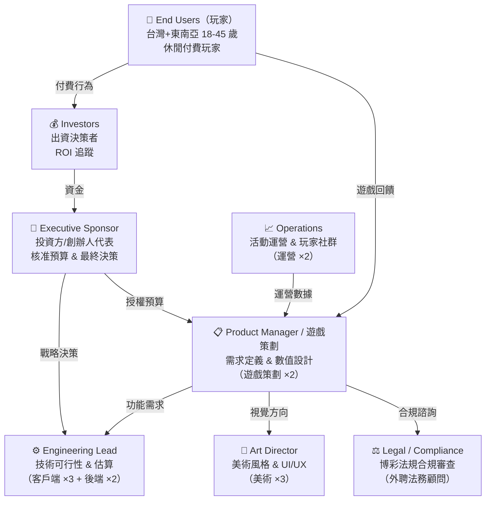
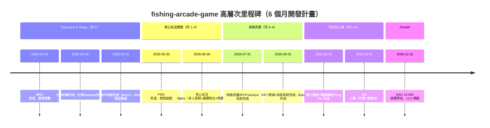

# BRD — Business Requirements Document
<!-- SDLC Requirements Engineering — Layer 1：Business Requirements -->
<!-- 上游文件：docs/IDEA.md（DOC-ID: IDEA-FISHING-ARCADE-GAME-20260424）-->
<!-- 回答：為什麼做？為誰做？成功長什麼樣？值不值得投資？ -->

---

## Document Control

| 欄位 | 內容 |
|------|------|
| **DOC-ID** | BRD-FISHING-ARCADE-GAME-20260424 |
| **專案名稱** | fishing-arcade-game（捕魚街機遊戲平台） |
| **文件版本** | v1.0 |
| **狀態** | DRAFT |
| **作者** | AI Generated (gendoc-gen-brd) |
| **日期** | 2026-04-24 |
| **上游 IDEA.md** | IDEA-FISHING-ARCADE-GAME-20260424 |
| **下游 PRD** | [PRD.md](PRD.md)（待建立） |
| **審閱者** | 投資方代表, Engineering Lead |
| **核准者** | Executive Sponsor（投資方/創辦人代表） |

---

## Change Log

| 版本 | 日期 | 作者 | 變更摘要 |
|------|------|------|---------|
| v1.0 | 2026-04-24 | /gendoc brd (AI Generated) | 初稿，依 IDEA.md + docs/req/ 素材自動生成 |

---

## §0 背景研究摘要

> 資料來源：`docs/req/魚機遊戲募資企劃書.md`、`docs/req/README.md`、`docs/IDEA.md §7`

### 競品現狀

- 市場主流捕魚遊戲（H5 魚機、App 捕魚）強調「爆金倍率刺激」，依賴 RTP 數值控制吸引玩家
- 社交層面薄弱：多人同屏僅為視覺效果，缺乏真實資源競爭機制
- 技能系統單一：大多遊戲只有倍率調整，無差異化武器或技能組合策略
- 主要競品：傳統 H5 魚機平台、東南亞主流 App 捕魚遊戲、開源商業授權平台（taishan6868/Fishing-game-source-code）

### 技術趨勢

- Node.js + Colyseus 框架已成為多人即時遊戲的成熟解決方案
- Cocos Creator 跨平台支援成熟，Lua 腳本生態完整
- 參考 Codebase（taishan6868）包含完整 FPond/Boss/技能/皮膚 UI 模組，品質精美
- WebSocket 技術普及，支援手機/網頁雙端低延遲即時同步

### 市場動態

- 亞洲（台灣、東南亞）休閒手機遊戲市場持續成長
- 捕魚遊戲品類在亞洲已驗證高付費轉化率與長生命週期
- 玩家對社交競爭與技能策略的需求尚未被現有產品充分滿足

### 已知風險

- 市場競爭激烈，競品可能快速複製競技搶魚機制（IDEA §8.4 F2）
- 法規風險：捕魚遊戲在部分亞洲市場涉及博彩合規，需提前法務審查
- 玩家對多人競爭搶魚的核心假設尚未由第一手用戶訪談驗證

---

## 1. Executive Summary（PR-FAQ 風格）

### 1.1 假設新聞稿（一頁備忘錄）

> **標題：** Fishing Arcade Game 推出多人即時競技捕魚平台，幫助亞洲休閒付費玩家（18–45 歲）解決傳統捕魚遊戲缺乏社交競爭與技能策略、玩家快速流失的問題
>
> **日期：** 2026 年第四季度（預計上線）
>
> **第一段（What & Who）：**
> Fishing Arcade Game 是一款多人即時競技捕魚街機遊戲平台，專為亞洲市場（台灣/東南亞）18–45 歲休閒付費玩家設計，讓他們能夠在 4–6 人同場競技中爭搶魚群資源、展示技術策略、觸發 Jackpot 大獎，不再需要在無聊的單人爆金循環中反覆點擊，或頻繁換遊戲尋找新鮮感。
>
> **第二段（Why Now）：**
> 亞洲手機娛樂市場持續高速成長，捕魚遊戲品類已在台灣與東南亞驗證極高的付費轉化率。然而，現有產品依賴「爆金倍率數值刺激」的同質化設計正在加速玩家流失——30 日留存率普遍低於 25%（IDEA §2.1 市場觀察）。市場窗口明確：在競品尚未深化社交競爭機制之際，具備真實多人競技、技能策略深度與精細化 RTP/Jackpot 數值體系的差異化產品可快速搶占心智。
>
> **第三段（How It Works）：**
> 玩家只需三步進入遊戲：（1）選擇房間（普通/競技），系統自動匹配 4–6 人同場；（2）選擇砲台（基礎/雷射/散射/鎖定）與技能（冰凍/炸彈/自動鎖定），策略性射擊魚群搶奪資源；（3）場均 10–15 分鐘後結算金幣收益、MVP 排名獎勵，累積鑽石兌換升級砲台或觸發 Jackpot 大獎池。
>
> **用戶引言：**
> 「以前玩捕魚就是一個人傻傻按，打到無聊就換遊戲。現在跟朋友搶 Boss 魚，大家都在搶，才有那種爽感——而且搶到還能拿 MVP 獎勵，根本停不下來。」— 林先生，27 歲，台灣上班族，休閒手遊重度玩家
>
> **Call to Action：**
> 投資者可查閱 §3.3 三情境 ROI 分析與 §11 商業模式畫布，了解 USD 200,000 資金的回報路徑與 6 個月上線計畫。

### 1.2 FAQ（預先回答最困難的問題）

| 問題 | 回答 |
|------|------|
| 為什麼現在做這個？ | 亞洲捕魚遊戲市場規模成熟，但社交競爭機制設計的空白在當前尚未被主要競品填補。先發優勢加上 6 個月快速上線時程，可在競品反應前建立玩家數據壁壘（RTP 行為模型）。延遲 12 個月則此窗口很可能關閉。 |
| 為什麼是我們做，而不是大型競品？ | 大型競品的路線依賴規模化爆金刺激，社交競技方向對其現有玩家結構存在內部衝突風險；本團隊具備完整 Cocos+Colyseus 技術棧能力，且有高品質參考 Codebase（taishan6868）降低初期開發成本。靈活的中小型團隊（12 人）可在大公司反應前完成 MVP 驗證。 |
| 最大的風險是什麼？ | 核心假設風險：玩家對「多人競爭搶魚」的需求強度可能不及預期，若玩家仍偏好獨自爆金刺激，競技機制不會帶來額外留存或付費提升（IDEA §5.3 Leap of Faith）。此假設需在 BRD 後 4 週內透過用戶訪談（N ≥ 10）+ MVP A/B 測試驗證。 |
| 競品差異在哪裡？ | 現有捕魚遊戲的「多人」只是視覺同屏，資源不爭搶、無真實競爭；本產品的差異化在於：（1）真實搶魚競技機制——資源有限、多人搶奪；（2）武器/技能策略深度；（3）精細化 RTP+Jackpot 數值系統。不是改良「更多魚更多倍率」，而是設計「更真實的競爭感」。 |
| 如果失敗，原因最可能是？ | 最可能的失敗路徑（IDEA §8.4 Pre-mortem）：核心競爭機制假設錯誤（F1）+ RTP 數值調校失誤導致玩家感覺不公平（F3）+ 法規問題阻擋上線（F4）。三者中任一成真都可能導致專案終止，需在 Discovery 階段同步啟動用戶訪談、數值 Sandbox 測試與法務審查。 |

---

## 2. Problem Statement

### 2.1 現狀描述（As-Is Narrative）

> 資料來源：`docs/IDEA.md §2.1`、`docs/req/魚機遊戲募資企劃書.md §二`

一個 28 歲台灣上班族玩家，每天午休 20 分鐘打開手機捕魚遊戲。他進入房間，看到畫面上有 4 個人，但其實大家各打各的——魚群不爭搶、金幣不相互影響、連鄰座的砲火都只是背景。他調高砲台倍率，連按射擊，等待爆金動畫觸發。3 天後，他刪掉這個遊戲，換了另一個——因為「玩起來都一樣」。

**現況工作流與問題行為：**

- 玩家使用單一砲台連續射擊固定路徑魚群，核心刺激來自「爆金倍率數值飆升」
- 雖有 4–6 人同屏，但玩家間缺乏真實競爭：資源不爭搶、無搶魚機制、無 MVP 獎勵
- 技能策略空間淺薄：大多遊戲只有倍率調整，缺乏差異化武器或技能組合
- 玩家行為趨同：長期重複相同操作，新鮮感快速消耗，30 日留存率通常低於 25%
- **現有玩家的 Workaround**：頻繁更換遊戲平台尋找新鮮感，或參與限時活動維持動力（屬於被動留存，非主動黏性）

### 2.2 根本原因（5 Whys）

```
問題現象：捕魚遊戲玩家留存率低，30 日流失超過 75%
  Why 1：遊戲單調，玩家重複操作缺乏新鮮感
    Why 2：遊戲系統深度不足，無真正的技能策略或社交競爭
      Why 3：多人同屏設計只是視覺呈現，缺乏真實競技機制（搶資源 / MVP / 排名）
        Why 4：現有產品以「爆金數值刺激」為核心，社交與技能設計被刻意省略以降低開發成本
          Why 5（根本原因）：市場開發商優先追求短期變現最大化（爆金刺激轉化率高、開發快），
                            未投資社交競爭深度與技能策略系統，導致同質化競爭加速用戶流失
                            ← 本產品解決的就是這個系統性缺口
```

### 2.3 問題規模（量化）

> 資料來源：`docs/IDEA.md §3.2`、`docs/req/魚機遊戲募資企劃書.md §二`

| 維度 | 估算值 | 估算依據 | 信心水準 |
|------|-------|---------|---------|
| TAM（亞洲休閒手機遊戲市場）| USD 數十億/年 | 行業報告估算（亞太區手機遊戲市場） | 低 |
| SAM（亞洲捕魚遊戲細分市場）| USD 數億/年 | 捕魚遊戲市佔估算（東南亞+台灣） | 低 |
| SOM（12 個月可獲取市場）| DAU 10,000，月營收 USD 10,000 | 企劃書財務預估：付費率 5%，ARPU USD 20/月 | 中 |
| 目標市場活躍手機遊戲用戶 | 台灣+東南亞約 5,000 萬 | 市場估算 | 低 |
| 每月主動搜尋捕魚遊戲用戶 | 約 300–500 萬 | 企劃書市場分析推斷 | 低 |

*SOM 拆解依據：台灣+東南亞目標市場 → 捕魚遊戲活躍用戶滲透率 0.02% → DAU 10,000 → 付費率 5%（500 付費玩家）× ARPU USD 20 = 月營收 USD 10,000。*

---

## 3. Business Objectives

### 3.1 商業目標（SMART）

| # | 目標 | KPI 指標 | 基準值（Baseline）| 目標值 | 時間框架 | 優先度 |
|---|------|---------|:--------------:|:-----:|---------|:-----:|
| O1 | 達到穩定日活規模 | DAU | 0（上線前） | 10,000 | 上線後 6 個月 | Must |
| O2 | 建立可持續月營收 | 月營收 | USD 0 | USD 10,000 | 上線後 6 個月 | Must |
| O3 | 達成付費用戶轉化 | 付費率 | 0% | 5%（付費 DAU / 總 DAU） | 上線後 3 個月 | Must |
| O4 | 驗證玩家留存健康度 | 次日留存率 / 7 日留存率 | 0（新產品，無歷史基準）| 次日 ≥ 35%，7 日 ≥ 25% | MVP 上線後 2 週 | Should |
| O5 | 完成投資回報路徑驗證 | 完成 USD 200,000 募資 | 0 | USD 200,000（已募得） | 開發啟動前 | Must |

### 3.2 與公司策略的對應

| 公司策略目標 | 本專案如何貢獻 | 對齊強度 |
|------------|-------------|:------:|
| 打造亞洲市場高變現休閒遊戲產品 | 捕魚遊戲為亞洲已驗證高付費品類，本專案 6 個月可完成可上線產品，直接實現高變現策略目標 | **強** |
| 建立長期可營運的遊戲平台 | 雙貨幣+VIP+活動體系設計支持持續運營，每週活動/節日活動/限時 Boss 驅動長期留存 | **中** |
| 完成 USD 200,000 募資目標 | 本 BRD 為投資人提供清晰的 ROI 路徑、市場分析與開發計畫，是募資說服材料的核心 | **強** |

### 3.3 投資報酬分析（ROI）— 三情境模型

> 折現率假設：10%/年（遊戲行業標準）
> 開發成本基準：USD 200,000（企劃書 §十 募資金額）

#### 悲觀情境（Pessimistic）
<!-- 假設：DAU 僅達 3,000，付費率 3%，ARPU USD 15，上線延誤 2 個月 -->

| 項目 | 估算 | 驅動假設 |
|------|------|---------|
| 開發成本 | USD 220,000 | 含 10% 超支緩衝，延誤 2 個月追加人力成本 |
| 維護成本（年） | USD 60,000 | 伺服器+維運+小規模活動運營 |
| 預期收益（年） | USD 54,000 | DAU 3,000，付費率 3%，ARPU USD 15（滲透率 30% of SOM） |
| Payback Period | 約 49 個月 | 累計收益覆蓋總投入時間 |
| 3 年 NPV | 約 -USD 58,000 | NPV < 0，悲觀情境不建議投資 |

#### 基準情境（Base）
<!-- 假設：DAU 10,000，付費率 5%，ARPU USD 20，按計畫 6 個月上線 -->

| 項目 | 估算 | 驅動假設 |
|------|------|---------|
| 開發成本 | USD 200,000 | 企劃書 §十 資金需求（產品 50%+行銷 30%+營運 20%） |
| 維護成本（年） | USD 72,000 | 伺服器+人力+活動運營（企劃書 §九 成本項） |
| 預期收益（年） | USD 120,000 | DAU 10,000，付費率 5%，ARPU USD 20 × 12 個月 |
| Payback Period | 約 20 個月 | 含上線後 6 個月爬坡期 |
| 3 年 NPV | 約 +USD 47,000 | 正值，基準情境具投資價值 |

#### 樂觀情境（Optimistic）
<!-- 假設：DAU 20,000，付費率 7%，ARPU USD 25，上線後病毒式傳播 -->

| 項目 | 估算 | 驅動假設 |
|------|------|---------|
| 開發成本 | USD 200,000 | 同基準情境，無超支 |
| 維護成本（年） | USD 90,000 | 規模擴大後伺服器+客服+更多活動運營 |
| 預期收益（年） | USD 210,000 | DAU 20,000，付費率 7%，ARPU USD 25 × 12 個月 |
| Payback Period | 約 12 個月 | 上線後 12 個月回收全部投資 |
| 3 年 NPV | 約 +USD 258,000 | 樂觀情境 IRR 顯著，強烈投資信號 |

#### 情境摘要比較

| 情境 | 3 年 NPV | Payback Period | 關鍵驅動假設 |
|------|---------|:--------------:|------------|
| 悲觀 | -USD 58,000 | 49 個月 | DAU 僅 3,000，付費率 3%，上線延誤 |
| 基準 | +USD 47,000 | 20 個月 | DAU 10,000，付費率 5%，ARPU USD 20（按計畫） |
| 樂觀 | +USD 258,000 | 12 個月 | DAU 20,000，付費率 7%，ARPU USD 25（病毒增長） |

**投資決策門檻：** 即使在悲觀情境下，若 Payback Period > 36 個月（3 年），視為不值得繼續投資；若基準情境 Payback Period < 24 個月且正 NPV，視為值得投資。基準情境（20 個月）符合門檻。

### 3.4 Requirements Traceability Matrix（RTM）

| 業務目標 | 成功指標 | 功能需求（PRD REQ-ID）| 測試覆蓋 | 狀態 |
|---------|---------|:-------------------:|---------|:----:|
| O1：DAU 10,000 | DAU ≥ 10,000（上線後 6M） | 待 PRD 生成 | BDD S-001（多人房間進入） | 🔲 待填 |
| O2：月營收 USD 10,000 | 月付費收入 ≥ USD 10,000 | 待 PRD 生成 | BDD S-002（付費購買流程） | 🔲 待填 |
| O3：付費率 5% | 付費 DAU / 總 DAU ≥ 5% | 待 PRD 生成 | BDD S-003（鑽石轉化） | 🔲 待填 |
| O4：留存健康度 | 次日留存 ≥ 35%，7 日留存 ≥ 25% | 待 PRD 生成 | BDD S-004（留存追蹤） | 🔲 待填 |

*RTM 在 BRD → PRD 過渡時由 PM 維護；PRD 確定後以 REQ-ID 填入並鎖定。*

### 3.5 Benefits Realization Plan（效益實現計畫）

| 效益 | 基準值（Pre-launch）| 目標值 | 測量時間點 | 測量方式 | 負責人 | 若未達標的行動 |
|------|:------------------:|:-----:|----------|---------|:------:|------------|
| DAU 達 10,000 | 0 | 10,000 | Launch + 6M | 後台 DAU 數據看板 | PM + 運營 | 啟動付費行銷活動追加預算，或調整獲客管道 |
| 月營收 USD 10,000 | USD 0 | USD 10,000 | Launch + 6M | 財務報表 + 支付平台數據 | PM + Finance | 審查付費點設計，調整定價策略 |
| 7 日留存率 ≥ 25% | 0（新產品，上線前無歷史基準；業界捕魚遊戲參考值通常 < 25%） | 25% | Launch + 2W | 分析後台（同期群分析） | PM + 數值策劃 | 緊急用戶訪談，調整 RTP 數值或首週引導流程 |
| 次日留存率 ≥ 35% | 0（新產品，上線前無歷史基準；業界捕魚遊戲參考值通常 < 35%） | 35% | Launch + 1W | 分析後台 | PM + 數值策劃 | 回顧新手引導與首局體驗，啟動快速迭代 |
| 付費率 ≥ 5% | 0% | 5% | Launch + 3M | 支付數據 / DAU 比例 | PM | 用戶訪談付費阻力，調整付費點觸發時機 |

*效益評審節點：Launch + 2W（留存初驗）/ +3M（付費初驗）/ +6M（規模驗證），每次由 Executive Sponsor 主持。*

---

## 4. Stakeholders & Users

### 4.1 Stakeholder Map



### 4.2 Target Users（業務層級描述）

> 資料來源：`docs/IDEA.md §3`、Q1 澄清結果

| 用戶群 | 規模估算 | 核心需求 | 目前解法 | 痛點 |
|--------|:-------:|---------|---------|------|
| 主要：台灣/東南亞 18–45 歲休閒付費玩家 | 約 5,000 萬活躍手機遊戲用戶（市場估算） | 碎片時間（10–30 分鐘）即時娛樂、金幣獎勵爽感、競爭勝利感 | 現有 H5 捕魚遊戲、App 捕魚類產品 | 社交競爭薄弱、技能單一、長期操作無新鮮感、30 日流失高 |
| 次要：VIP 核心付費玩家（重度消費者）| 目標約 500 人（DAU 5% 付費比例） | 彰顯地位（VIP 等級）、砲台/技能升級成長感、限定皮膚收藏 | 現有 VIP 制度（功能薄弱）或電商購買遊戲點數 | 缺乏真正的社群地位展示平台與有意義的成長曲線 |

### 4.3 Not Our Users（明確排除）

- ❌ **未成年用戶（18 歲以下）**（原因：法規合規要求，付費類娛樂遊戲在台灣及東南亞需年齡驗證）
- ❌ **重度 MMORPG 或策略遊戲玩家**（原因：本產品屬休閒街機品類，無深度角色扮演或長期策略養成，此類玩家留存動機不符）
- ❌ **歐美市場為主要目標的用戶**（原因：捕魚街機玩法高度集中亞洲文化圈，歐美市場未驗證，初期不投入資源獲取）
- ❌ **嚴格競技型遊戲玩家**（原因：本產品主打「爽感+競爭感」平衡，非電競對稱競技，對追求絕對公平排名的玩家不適合）

### 4.4 RACI Matrix

| 主要活動 | Executive Sponsor | Product Manager / 遊戲策劃 | Engineering Lead | Art Director | Legal / Compliance | Finance / 投資方 | 運營 |
|---------|:-----------------:|:--------------------------:|:----------------:|:------------:|:------------------:|:---------------:|:---:|
| 需求定義與範圍確認 | A | R | C | C | C | I | C |
| 技術可行性評估 | I | C | R/A | I | I | I | I |
| 數值設計審查（RTP/Jackpot）| A | R | C | I | C | I | C |
| 設計審查與 UX 驗收 | I | A | C | R | I | I | I |
| 預算核准 | A | C | C | I | I | R | I |
| 合規與法務初審 | I | C | I | I | R/A | I | I |
| 上線決策（Go/No-Go）| A | R | C | C | C | C | C |
| BRD→PRD Handoff | I | R/A | C | C | I | I | I |

---

## 5. Proposed Solution

### 5.1 解法概述

> 高層次方向，不涉及 UI 設計和技術細節（那是 PDD 和 EDD 的責任）

**解法方向**：打造「社交競爭搶魚」為核心差異化的多人即時競技捕魚平台，在亞洲已驗證的捕魚遊戲品類基礎上，通過三個核心升維點建立競爭壁壘：（1）**真實多人競爭機制**——4–6 人同場真實爭搶資源，不再是視覺同屏；（2）**技能策略深度**——多元武器（砲台/雷射/散射/鎖定）× 技能（冰凍/炸彈/自動鎖定）產生差異化遊玩風格；（3）**精細化經濟數值體系**——RTP 85–95% 精準控制 + Jackpot 大獎池 + 雙貨幣（金幣/鑽石）+ VIP 訂閱，延長玩家生命週期。

技術路線：Cocos Creator（客戶端，Lua 腳本）+ Node.js/Colyseus（即時伺服器）+ MySQL/Redis（資料庫），6 個月分 3 階段交付，以參考 Codebase（taishan6868）降低初期開發成本。

### 5.2 核心價值主張（Value Proposition Canvas）

**Customer Jobs（用戶要完成的任務）：**
- Functional：快速進入遊戲（< 30 秒），在碎片時間（10–30 分鐘）內獲得即時金幣獎勵反饋
- Functional：策略性選擇武器與技能，最大化每局收益與競爭優勢
- Emotional：搶先捕獲 Boss 魚的勝利爽感，Jackpot 觸發時的超強驚喜感
- Emotional：VIP 等級彰顯自我地位，砲台升級帶來的成長成就感
- Social：在多人同場中展示技術與運氣，成為 MVP 獲得排名認可
- Social：透過 VIP 等級與限定皮膚，在玩家社群中彰顯身份

**Pain Relievers（如何減輕痛點）：**
- 4–6 人搶魚競技機制 + MVP 排名獎勵，解決「多人同屏只是視覺裝飾、缺乏真實對抗感」的痛點
- 多元武器系統（基礎砲/雷射/散射/鎖定）+ 技能組合（冰凍/炸彈/自動鎖定），解決「技能策略單一、長期操作無新鮮感」的痛點
- 砲台升級成長線 + VIP 等級 + 限時 Boss 活動 + Jackpot 大獎池，解決「爆金刺激短暫、缺乏長期留存動力」的痛點

**Gain Creators（如何創造收益）：**
- RTP 85–95% 確保穩定回報感，命中率動態調整維持爽感，玩家不會感覺「被系統操控」
- VIP 等級制度 + 砲台/技能升級 + 限定皮膚，創造長期成長感與地位彰顯收益
- 每週活動 + 節日活動 + 限時 Boss，創造定期返回動機（FOMO 效應）

### 5.3 解法邊界

**In Scope（本版本 v1.0）：**
- ✅ 4–6 人即時多人競技房間（Colyseus WebSocket）
- ✅ 魚群系統：普通魚 / 精英魚 / Boss 魚（含高倍率）
- ✅ 武器系統：基礎砲台 / 雷射炮 / 散射炮 / 鎖定炮（倍率調整）
- ✅ 技能系統：冰凍（控場）/ 全屏炸彈 / 自動鎖定
- ✅ 雙貨幣系統：金幣（遊戲內）+ 鑽石（付費）
- ✅ RTP 控制（85–95%）+ 命中率動態調整 + Jackpot 大獎池
- ✅ 搶魚機制 + MVP 排名獎勵
- ✅ 砲台升級 + 技能升級成長系統
- ✅ 基礎商城（鑽石購買、禮包、抽獎）
- ✅ VIP 等級系統（月費訂閱）
- ✅ 任務系統（日常 / 週常任務引導留存）
- ✅ 每週活動 + 節日活動 + 限時 Boss 活動框架

**Out of Scope（明確排除，含理由）：**
- ❌ 寵物技能系統 FPetSkillHelp（原因：增加開發複雜度，MVP 聚焦核心玩法驗證，列 P2 延後）
- ❌ 換裝皮膚系統 FChangeSkinUI（原因：MVP 階段聚焦競技機制驗證，皮膚作為留存道具列 P1 系統完善期）
- ❌ 社群好友系統 FFriendApply（原因：MVP 先驗證陌生人競技體驗，社交功能作為 P1 後續疊加）
- ❌ 跨平台 App Store / Google Play 上架（原因：初期以 H5 / 網頁端優先驗證，移動端分發列 v2.0）
- ❌ 歐美市場本地化（原因：初期聚焦亞洲市場，歐美市場無驗證，不投入資源）

**Future Scope（v2.0 候選）：**
- 🔮 好友系統 + 私人房間 + 邀請碼功能
- 🔮 換裝皮膚系統與限定皮膚活動
- 🔮 寵物技能輔助系統
- 🔮 公會 / 工會社群功能
- 🔮 移動端（iOS / Android）原生 App 上架

### 5.4 MoSCoW 優先度對應表

| 功能 / 能力 | MoSCoW 分類 | 對應 BRD 目標 | 業務理由 |
|------------|:----------:|-------------|---------|
| 4–6 人即時多人競技房間 | **Must Have** | O1, O4 | 核心差異化，無此功能則無法與競品區分，留存假設無法驗證 |
| 魚群系統（普通/精英/Boss）| **Must Have** | O1, O4 | 遊戲基礎內容，無此則無法遊玩 |
| 武器系統（4 種砲台）| **Must Have** | O1, O4 | 技能策略差異化的基礎，MVP 必需 |
| 技能系統（3 種技能）| **Must Have** | O1, O4 | 配合武器系統構成策略深度，MVP 必需 |
| RTP 控制系統（85–95%）+ Jackpot | **Must Have** | O2, O3 | 數值體系核心，影響玩家爽感與留存，無此商業模式不成立 |
| 雙貨幣系統（金幣+鑽石）+ 基礎商城 | **Must Have** | O2, O3 | 付費轉化核心，無此無法產生營收 |
| 搶魚機制 + MVP 排名獎勵 | **Must Have** | O1, O4 | 核心競爭差異化機制，驗證留存假設的關鍵 |
| VIP 訂閱系統 | **Should Have** | O2, O3 | 重要收入來源，但需先驗證基礎付費意願後再上線 |
| 砲台 / 技能升級成長系統 | **Should Have** | O4 | 長期留存核心，但 MVP 可以簡化版本先上 |
| 任務系統（日常/週常） | **Should Have** | O4 | 引導留存的重要機制，P1 系統完善期完成 |
| 每週/節日/限時 Boss 活動框架 | **Should Have** | O1, O4 | 活動運營驅動返回率，P1 完成期上線 |
| 換裝皮膚系統 | **Could Have** | O4 | 留存與付費加強道具，P2 視開發容量決定 |
| 好友系統 + 私人房間 | **Could Have** | O1 | 社交功能增強留存，但不阻擋核心驗證 |
| 寵物技能系統 | **Won't Have（本版）** | — | 開發複雜度高，核心假設驗證前不做 |
| 歐美市場本地化 | **Won't Have（本版）** | — | 初期聚焦亞洲市場，無資源分散投入 |

> Must Have 功能估算佔開發容量約 55%，符合「不超過 60%」原則，保留緩衝。

---

## 6. Market & Competitive Analysis

> 資料來源：`docs/IDEA.md §7`、`docs/req/魚機遊戲募資企劃書.md §二`、`docs/req/README.md`

### 6.1 競品分析

| 維度 | 本產品 | 競品 A：傳統 H5 魚機 | 競品 B：東南亞主流 App 捕魚 | 競品 C：開源授權平台（taishan6868 類）|
|------|-------|-------------------|--------------------------|------------------------------------|
| 核心定位 | 多人競技搶魚+技能策略 | 爆金倍率刺激、快速付費轉化 | 輕量化休閒，分發廣泛 | 商業授權可部署捕魚系統 |
| 多人競爭機制 | 真實搶魚+MVP 排名 | 視覺同屏，無真實競爭 | 輕度同屏 | 視設定而定 |
| 技能策略深度 | 4 種武器 × 3 技能組合 | 僅倍率調整 | 基礎技能 | 含基礎技能系統 |
| RTP 精細度 | 85–95%，動態命中率+Jackpot | 標準 RTP 控制 | 簡單 RTP | 含 RTP 系統 |
| 商業模式 | IAP + VIP 訂閱 + 活動付費 | IAP 為主 | IAP + 廣告 | 授權銷售（非SaaS） |
| 目標市場 | 台灣+東南亞，手機/網頁雙端 | 主要中國大陸/H5 | 東南亞 App Store | 開發者（B2B） |
| 優勢 | 社交競爭深度、技能策略、精細數值體系 | 玩法成熟、用戶認知度高、低門檻 | 分發管道廣（App Store/Google Play） | 完整模組、代碼穩定、可快速部署 |
| 劣勢 | 品牌知名度待建立、市場進入初期 | 社交設計薄弱、技能單一、留存率低 | 功能趨同，品質參差 | B2B 模式，非直接 C 端競品 |
| 我們的差異化 | — | 真實多人競爭+技能策略深度 | 更完整活動運營體系+VIP 社群 | 在其基礎上強化社交競爭與商業變現 |

> 資料來源：`docs/req/魚機遊戲募資企劃書.md §二競品分析`（靜態推斷，需 PM 確認最新市場動態）

### 6.2 市場定位

```
              高社交競爭深度
                   ↑
                   │
                   │         ● 本產品（競技搶魚+技能策略）
                   │
低技能策略 ────────┼──────────────────── 高技能策略
                   │
   傳統 H5 魚機 ●  │  ● 東南亞 App 捕魚
                   │
                   ↓
              低社交競爭深度
```

---

## 7. Success Metrics

### 7.1 北極星指標（North Star Metric）

**North Star：** `月活躍付費用戶的人均遊玩時長（MAU 付費玩家場均時長 × 月均場次）`

**定義：** 衡量「付費玩家在遊戲中創造的真實價值消耗時長」——此指標同時反映留存（玩家持續回來）和付費意願（付費玩家的深度參與），是本商業模式健康度的最佳單一代理指標。

**選擇理由：** 相比純 DAU（不反映付費質量）或純月營收（不反映玩家體驗），「付費玩家月遊玩時長」能最早預示留存和付費的協同惡化。

### 7.2 業務指標階層（Outcome → Output → Input）

```
Outcome（最終業務成果）
  └── 月營收 ≥ USD 10,000（Launch + 6M）
  └── DAU 穩定達 10,000（Launch + 6M）

Output（可交付成果）
  ├── 次日留存率 ≥ 35%（Launch 後第 1 週持續）
  ├── 7 日留存率 ≥ 25%（Launch 後持續）
  ├── 付費率（DAU 中付費比例）≥ 5%（Launch + 3M）
  ├── ARPU ≥ USD 20/月（付費玩家平均）
  └── 場均時長 ≥ 10 分鐘（MAU 全玩家）

Input（我們可控的行動）
  ├── 每週活動上線頻率（目標：每週至少 1 個活動）
  ├── 新魚種 / 武器 / 技能每月更新數量
  ├── 行銷獲客投放量（每月 USD 5,000 行銷預算）
  └── 數值調校迭代頻率（每 2 週一次 RTP 參數複查）
```

### 7.3 投資門檻（何時算值得繼續投資）

| 條件 | 量化目標 | 評估時間點 |
|------|---------|:--------:|
| MVP 留存健康確認 | 次日留存 ≥ 30%，7 日留存 ≥ 20% | MVP 上線後 2 週 |
| 付費初步驗證 | 付費率 ≥ 2%（MVP 過渡目標）| MVP 上線後 4 週 |
| 競技假設驗證 | 競技房間場均時長 ≥ 非競技房間 20%（A/B 測試）| MVP A/B 測試 4 週 |
| 月營收規模驗證 | 月營收 ≥ USD 5,000（達成一半目標）| Launch + 3M |

---

## 8. Constraints & Assumptions

### 8.1 業務限制

| 限制 | 類型 | 硬性/軟性 | 影響 |
|------|------|:--------:|------|
| 預算上限：USD 200,000（企劃書 §十）| 財務 | 硬性 | 決定開發資源規模（12 人 × 6 個月）與功能範圍上限 |
| 上線期限：開發啟動後 6 個月（企劃書 §七）| 時程 | 硬性 | 影響 Must Have 功能範圍，超期將影響現金流與投資信心 |
| 合規要求：台灣+東南亞博彩 / 娛樂遊戲法規 | 法規 | 硬性 | 若部分市場認定核心功能涉及博彩，需調整付費機制或取得授權 |
| 年齡限制：18 歲以上（合規要求）| 法規 | 硬性 | 需實作年齡驗證機制（不得允許未成年用戶付費）|
| 目標市場：亞洲（台灣 + 東南亞）| 商業 | 硬性（初期）| 歐美市場為 Out of Scope，不投入行銷/本地化資源 |
| 品牌規範：無（startup 初期）| 品牌 | 軟性 | 視覺風格由 Art Director 定義，無既有限制 |

### 8.2 關鍵假設（需驗證）

| # | 假設 | 重要性 | 驗證方式 | 驗證時間點 | 若假設錯誤的影響 |
|---|------|:-----:|---------|:---------:|----------------|
| A1 | 亞洲休閒付費玩家對「多人競爭搶魚」的需求足夠強烈，願意為此付費並長期留存（最高風險 Leap of Faith） | 🔴 關鍵 | 用戶訪談（N ≥ 10）+ MVP A/B 測試（競技 vs 非競技房間留存對比）| BRD 後 4 週 | 根本性 Pivot：砍除競技機制，轉向純單人爆金倍率路線 |
| A2 | DAU 10,000 在 6 個月內可透過 USD 60,000 行銷預算達成（CAC 假設：USD 6/用戶，達成 10,000 用戶）| 🟡 重要 | 行銷 CAC/LTV 模型分析 + 先導市場測試 | BRD 審查前 | 若 CAC > USD 12，行銷預算不足，需調整獲客策略或降低 DAU 目標 |
| A3 | Cocos Creator + Node.js/Colyseus 架構能支撐 1,000 人並發不崩潰 | 🟡 重要 | PoC 壓力測試（並發 200 人先驗，再外推至 1,000 人）| EDD 完成前 | 若無法支撐，需評估水平擴展方案或更換伺服器架構 |
| A4 | RTP 85–95% 設計能維持玩家「爽感」且不觸發合規問題 | 🟡 重要 | 數值 Sandbox 測試 + 法務審查 | BRD 確認前 | 調整 RTP 區間或付費機制，需額外法務諮詢成本 |
| A5 | 參考 Codebase（taishan6868）授權允許商業衍生使用，且代碼品質達到生產標準 | 🟡 重要 | Engineering + Legal 評估（法務確認 + 代碼審查）| 開發啟動前 | 若不可商用，客戶端開發成本大幅增加，6 個月週期可能不足 |

### 8.3 技術約束

> 提取來源：IDEA.md §6 Q3（使用者原始輸入）、IDEA.md §8.3（技術依賴）

| 約束項目 | 約束內容 | 類型 | 來源 |
|---------|---------|:----:|------|
| 客戶端框架 | Cocos Creator + Lua 腳本 | 硬性 | IDEA §6 Q3：「Cocos Creator + Node.js/Colyseus + Lua，需支援高併發多人即時」 |
| 即時伺服器框架 | Node.js + Colyseus | 硬性 | IDEA §6 Q3：同上；企劃書 §六 技術架構指定 |
| 遊戲腳本語言 | Lua（客戶端遊戲邏輯）| 硬性 | IDEA §6 Q3；參考 Codebase（taishan6868）全 Lua 實作 |
| 資料庫 | MySQL（玩家數據/交易）+ Redis（即時狀態/排行榜）| 軟性 | IDEA §7.2 技術生態建議，推斷；可在 EDD ADR 中調整 |
| 基礎設施 | 雲端伺服器（AWS/GCP 東南亞區域）| 軟性 | IDEA §7.2 推斷；低延遲優先（目標市場），可在 ARCH 中選擇具體供應商 |
| 開源授權 | 需確認 taishan6868 Codebase 商業授權條款；優先採用 MIT/Apache 授權套件 | 硬性 | IDEA §13 OQ2；法務評估前不得直接商業使用 |

> **注意：** 硬性約束（Cocos Creator + Lua + Node.js/Colyseus）在 EDD 中不得無故覆蓋；軟性約束（MySQL/Redis/AWS）在 EDD ADR 中可書面說明覆蓋理由。

---

## 9. Regulatory & Compliance Requirements

> ⚠️ 以下為依產品類型（付費休閒遊戲，含金幣/鑽石虛擬貨幣系統）與目標市場（台灣/東南亞）推斷的適用法規，**需 Legal 確認**（標注「需 Legal 確認」者為推斷，非已確認合規狀態）。

### 9.1 適用法規清單

| 法規 / 標準名稱 | 適用範圍 | 關鍵義務摘要 | 合規截止日 | 負責人 |
|--------------|---------|------------|:---------:|:------:|
| 台灣遊戲軟體分級管理辦法 | 台灣市場所有遊戲 | 依內容申請適當分級（18+ 需申請限制級或輔導級）；年齡驗證機制必須實作 | 上線前 | Legal + PM |
| 台灣電子遊戲場業管理條例 / 相關法規 | 若含付費抽獎/Jackpot 機制 | **需 Legal 確認**：付費觸發 Jackpot 是否構成「電子遊戲場業」需申請許可；虛擬幣可否兌換現金（必須明確禁止）| BRD 前 | Legal（**優先審查**）|
| 東南亞各國線上遊戲法規（泰國/越南/菲律賓/馬來西亞）| 東南亞目標市場 | **需 Legal 確認**：各國對「遊戲化付費機制」/「虛擬貨幣」的監管規定不同；需逐國評估合規授權需求 | BRD 後 4 週 | Legal |
| 台灣個人資料保護法（個資法）| 台灣用戶個資收集/處理 | 取得用戶明示同意；告知收集目的；用戶有查詢/更正/刪除權；洩漏 72 小時通報 | 上線前 | Legal + Engineering |
| GDPR（若服務觸及歐盟用戶）| 如產品允許歐盟用戶註冊 | **建議**：若不主動進入歐盟市場，可在 ToS 明確限制歐盟用戶使用，降低 GDPR 適用風險 | 上線前 | Legal |
| 未成年保護相關規定 | 所有市場 | 年齡驗證機制（18+）；禁止未成年付費；家長控制選項 | 上線前 | PM + Engineering |

### 9.2 合規影響評估

| 合規要求 | 對產品設計的影響 | 對工程架構的影響 | 額外成本估算 |
|---------|--------------|--------------|:----------:|
| 年齡驗證（18+）| 需設計年齡確認流程（生日輸入 + 法律聲明）| 用戶註冊流程需加入年齡門控邏輯 | 低（工程成本）|
| 虛擬幣不可兌現聲明 | 遊戲內明確標注「金幣/鑽石不可兌換為現金」| ToS 條款 + 商城 UI 提示 | 低 |
| 個資收集告知 | 隱私政策頁面 + 首次使用彈窗說明 | Cookie / 資料收集記錄機制 | 低 |
| 台灣付費抽獎合規 | **若 Jackpot 觸發與付費直接掛鉤**，需重新設計機制確保不違反博彩法規 | 鑽石消費邏輯需與 Jackpot 分離或加入免費進入管道 | 中（需 Legal 指導重新設計）|
| 東南亞各國差異 | 可能需要針對特定市場關閉付費功能或調整機制 | 地理位置偵測 + 市場分級功能開關 | 中 |

### 9.3 合規時程里程碑

| 里程碑 | 預計完成日 | 負責人 | 狀態 |
|--------|:---------:|:------:|:----:|
| 法務初審：台灣付費抽獎/Jackpot 合規評估（**最高優先**）| 2026-05-08 | Legal | PENDING |
| 法務初審：東南亞各目標市場遊戲法規逐國評估 | 2026-05-15 | Legal | PENDING |
| 隱私政策 + ToS 文件草稿完成 | 2026-05-22 | Legal + PM | PENDING |
| 年齡驗證機制設計審查 | 2026-06-01 | Engineering + Legal | PENDING |
| 合規架構設計審查 | 2026-06-15 | Engineering + Legal | PENDING |

### 9.4 合規責任矩陣

| 合規領域 | 負責人 | 支援方 | 完成時間 |
|---------|:------:|:-----:|:-------:|
| 台灣遊戲分級申請 | Legal + PM | Engineering | 上線前 |
| 博彩/Jackpot 機制合規評估 | Legal | PM | 2026-05-08 |
| 東南亞各市場逐國法規評估 | Legal | PM + 運營 | 2026-05-15 |
| 個人資料保護（台灣個資法）| Legal + Engineering | PM | 上線前 |
| 未成年保護機制實作 | Engineering | PM + Legal | 2026-06-01 |
| 隱私政策 + ToS 撰寫與上線 | Legal + PM | — | 上線前 |

### 9.5 Data Governance & Lifecycle Management（資料治理）

| 資料類型 | 資料擁有人 | 保留期限 | 存取控制政策 | 刪除程序 | 稽核需求 |
|---------|:--------:|:-------:|------------|:-------:|:-------:|
| 用戶帳號資料（PII：Email/手機/生日）| PM / Data Officer | 帳號活躍期間 + 停用後 1 年 | 最小權限（僅後台管理員）；HTTPS 加密傳輸 | 用戶申請刪除 7 日內完成 | 個資法 Article 11 |
| 遊戲行為日誌（非 PII）| Engineering Lead | 90 日（熱）/ 1 年（冷存檔）| Engineering Lead 核准才可存取原始日誌 | 自動歸檔後刪除 | 系統稽核 |
| 付費交易紀錄 | Finance | 7 年（法定財務記帳要求）| Finance + 稽核師；支付平台 PCI-DSS 標準 | 法定期限後銷毀 | 財政部稅務規範 |
| 玩家鑽石/金幣餘額（虛擬貨幣）| Engineering / Finance | 帳號存續期間 | 後台管理員；異常交易自動告警 | 帳號刪除時同步清零 | 虛擬貨幣交易完整性審計 |

**資料主權聲明：**
- 用戶數據所有權：用戶對自身個人資料享有查詢、更正、刪除權利；虛擬貨幣/遊戲內道具不構成財產，不可兌換現金
- 跨境傳輸：若資料存放雲端（AWS/GCP 東南亞），需確認資料中心所在地法規；台灣個資法對跨境傳輸有限制，需 Legal 確認

### 9.6 Intellectual Property & Licensing（智慧財產權）

| 項目 | 內容 |
|------|------|
| **專利風景分析** | 捕魚遊戲核心機制（多人射擊+RTP 控制）屬成熟業界實踐，無已知直接相關專利需迴避（靜態推斷，需 Legal 確認）|
| **OSS License 合規** | 參考 Codebase（taishan6868）商業授權條款**待確認**（IDEA §13 OQ2，最高優先法務事項）；Cocos Creator 商業授權已明確；Colyseus 為 MIT 授權（商業使用無限制）|
| **第三方資料授權** | 無已知第三方資料依賴；美術資源若使用外購素材需確認商業授權範圍 |
| **客戶資料所有權** | 客戶（玩家）個人資料屬玩家所有；遊戲內虛擬道具/貨幣為遊戲平台財產，不構成用戶財產 |
| **IP 歸屬** | 所有產品 IP 歸開發公司（創辦人/投資方合約約定）；外包美術素材需取得書面授權或全買斷授權；參考 Codebase 若有授權問題則自行開發客戶端，IP 完全自有 |

---

## 10. Risk Assessment

### 10.1 業務風險矩陣

> 資料來源：`docs/IDEA.md §8.1 風險矩陣`、`§8.4 Pre-mortem`

| # | 風險 | 類型 | 可能性（1–5）| 影響度（1–5）| 風險等級 | 緩解策略 | 負責人 |
|---|------|------|:-----------:|:-----------:|:-------:|---------|:------:|
| R1 | 核心假設失敗：玩家對「競爭搶魚」需求不強烈，競技機制不提升留存（IDEA A1）| 市場/用戶 | 3 | 5 | 🔴 HIGH | BRD 後 4 週完成用戶訪談（N ≥ 10）+ MVP A/B 測試；若失敗 Pivot 至純爆金路線 | PM |
| R2 | 市場競爭激烈，競品快速複製競技機制（IDEA R1）| 競爭 | 4 | 4 | 🔴 HIGH | 速度優先（6 個月上線）；加速建立玩家行為數值模型壁壘；每月版本迭代 | PM + Eng |
| R3 | RTP/Jackpot 數值調校失誤，玩家感覺不公平大量流失（IDEA R3）| 技術/數值 | 3 | 4 | 🔴 HIGH | 引入數值策劃專家；建立 Sandbox 測試環境；上線前數值模擬 10,000 場局 | 遊戲策劃 |
| R4 | 法規風險：Jackpot 付費機制在台灣或東南亞被認定博彩（IDEA R4）| 法規 | 3 | 4 | 🔴 HIGH | BRD 前提早法務審查；設計免費進入 Jackpot 管道（降低博彩認定風險）| Legal + PM |
| R5 | 開發速度低估，6 個月周期超期，USD 200,000 燒盡未上線（IDEA R5）| 執行 | 4 | 3 | 🟡 MEDIUM | 嚴格 MVP 邊界定義（P1/P2 延後）；每 2 週里程碑 Review；若第 3 個月進度 < 40% 立即裁量 | Engineering Lead |
| R6 | 參考 Codebase 授權問題，需從頭開發客戶端（IDEA OQ2）| 技術/法律 | 3 | 3 | 🟡 MEDIUM | 開發啟動前完成法務評估；以 Codebase 為設計參考而非直接複用，降低依賴 | Legal + Eng |
| R7 | DAU 目標過樂觀，行銷預算（USD 60,000）不足以達成 DAU 10,000（IDEA F6）| 商業 | 3 | 3 | 🟡 MEDIUM | BRD 階段明確 CAC/LTV 模型；先導市場小規模投放測試 CAC；若 CAC > USD 12 則調整目標 | PM + 運營 |
| R8 | Colyseus 高併發上限不足，1,000 並發時伺服器崩潰 | 技術 | 2 | 4 | 🟡 MEDIUM | EDD 前完成 PoC 壓力測試；水平擴展方案設計預留；監控告警機制 | Engineering Lead |

### 10.2 Kill Criteria（何時應該停止）

> 資料來源：`docs/IDEA.md §8.2 Kill Conditions`

以下任一條件發生，重新評估是否繼續：

- **用戶驗證失敗**：用戶訪談中 ≥ 70% 目標用戶表示「不會為競爭機制付費或對其無感」→ Pivot 或 Kill（Discovery 完成後 Week 3）
- **技術不可行**：RTP 控制系統 PoC 無法在 4 週內完成，或 Colyseus 並發測試無法支撐 200 人同時在線 → 技術方案重構或 Kill（PoC 完成後）
- **法規阻礙**：法務評估後，台灣或東南亞 2 個以上主要目標市場認定核心付費功能涉及非法博彩 → 產品機制重大重設計或 Kill（BRD 審查後）
- **競品搶先且大獲成功**：直接競品以「競技搶魚」定位已獲 ≥ 50,000 DAU 並完成融資 → 評估差異化策略是否仍有效（BRD 審查後持續監控）

---

## 11. Business Model

### 11.1 商業模式畫布

> 資料來源：`docs/req/魚機遊戲募資企劃書.md §五、§九、§十`

| 要素 | 內容 |
|------|------|
| **收入來源（Revenue Streams）** | 1. **道具內購（IAP）**：鑽石充值包（小額 USD 0.99–USD 4.99 / 中額 USD 9.99–USD 19.99 / 大額 USD 49.99+）、高倍率砲台購買、技能道具、禮包、抽獎系統<br>2. **VIP 訂閱**：月費制（USD 9.99/月），享有每日鑽石補貼、VIP 等級加成、限定外觀<br>3. **活動付費**：限時 Boss 挑戰入場費、節慶限定禮包、賽事報名費 |
| **定價策略** | 鑽石付費貨幣分級（小/中/大充值包），首充折扣（首次 50% off）；VIP 月費制訂閱；高倍率砲台定期推出限時優惠 |
| **成本結構（Cost Structure）** | 人力成本（12 人 × 6 個月，約 50% = USD 100,000）、行銷推廣（30% = USD 60,000）、伺服器與營運（20% = USD 40,000）；固定成本 vs 變動成本比估算：60% vs 40% |
| **核心資源（Key Resources）** | 數值策劃能力（RTP/Jackpot 設計）、技術團隊（Cocos+Colyseus）、美術資源（魚類/場景/特效）、玩家行為數據（上線後積累） |
| **關鍵活動（Key Activities）** | 遊戲開發迭代（功能+數值）、活動運營（每週活動設計）、玩家社群維護、行銷獲客（LINE/Facebook/App Store）、數值持續調校 |
| **關鍵合作夥伴（Key Partners）** | 雲端服務商（AWS/GCP 東南亞）、支付平台（AppStore IAP / Google Play / 第三方支付）、法務顧問（博彩法規）、美術外包（如需） |
| **獲客管道（Channels）** | 亞洲社群媒體廣告（LINE / Facebook / Instagram）、遊戲平台 / 應用商店 SEO + ASO、口碑推薦（邀請好友回饋機制）、KOL 直播推廣（東南亞遊戲 KOL）、限時活動病毒傳播 |
| **單位經濟（Unit Economics）** | **CAC（全用戶口徑）**：≤ USD 6/用戶（USD 60,000 行銷預算 / 10,000 DAU）<br>**LTV（付費用戶口徑）**：≥ USD 240/付費用戶（ARPU USD 20/月 × 12 個月）<br>**LTV/CAC（同口徑，付費用戶）**：有效 CAC = USD 6 / 5%（付費率）= USD 120/付費用戶；LTV/CAC = USD 240 / USD 120 = **2.0**（低於業界健康值 3x，需監控）<br>**⚠️ 風險提示**：LTV/CAC = 2.0 偏低，需在 Launch + 3M 確認 ARPU 達 USD 20 且付費率 ≥ 5%；若付費率提升至 8%，有效 CAC = USD 75，LTV/CAC = 3.2，達健康值。|

### 11.2 商業模式假設與驗證計畫

| 假設 | 重要性 | 驗證方式 | 驗證時間點 |
|------|:-----:|---------|:---------:|
| 玩家願意為「進階武器/技能道具」付費（不只是免費遊玩）| 關鍵 | MVP 付費率監控（目標 ≥ 2% MVP 過渡）+ 用戶訪談付費意願調查 | BRD 後 4 週 / MVP 上線後 2 週 |
| VIP 訂閱月費（USD 9.99）能吸引活躍玩家訂閱 | 重要 | VIP 上線後第 1 個月訂閱率監控（目標 ≥ 1% of DAU）| Launch + 1M |
| 行銷 CAC ≤ USD 6/用戶（LINE/Facebook 廣告）| 重要 | 小規模先導投放測試 3 個市場（台灣/泰國/越南），測量各管道 CAC | BRD 後 2 個月 |
| Jackpot 機制能顯著提升付費轉化率（相較無 Jackpot 對照）| 關鍵 | A/B 測試（含 Jackpot vs 不含 Jackpot 房間的付費率對比）| MVP 上線後 3 週 |

---

## 12. High-Level Roadmap



---

## 13. Dependencies

| 依賴項 | 類型 | 負責方 | 預計就緒日 | 若延誤的影響 |
|--------|------|:------:|:---------:|------------|
| 法務合規評估（台灣+東南亞博彩法規）| 外部顧問 | Legal | 2026-05-15 | 上線計畫可能需重構，最壞情況停止特定市場進入 |
| 參考 Codebase 授權確認（taishan6868）| 外部法律/技術 | Engineering + Legal | 2026-05-30 | 若不可用，客戶端開發成本增加，6 個月周期面臨超期 |
| 遊戲策劃人員招募（×2）| 人員 | HR/創辦人 | 2026-05-30（開發啟動前）| 數值設計能力缺失，RTP/Jackpot 設計風險大增 |
| 美術資源（魚類/場景/特效）| 內部/外包 | Art Director | 2026-06-30（Alpha 前）| 延誤影響客戶端開發節奏，可能以 Placeholder 先行 |
| 雲端伺服器環境（AWS/GCP 東南亞）| 外部服務 | Engineering | 2026-06-01 | 影響開發測試環境，可先用本地環境替代 |
| 支付平台整合（IAP）| 外部服務 | Engineering | 2026-08-31（Beta 前）| 延誤影響付費功能上線，商城功能需降級 |
| Colyseus 並發 PoC 測試 | 技術驗證 | Engineering | 2026-06-15 | 若失敗，架構方案需重新評估 |

### 13.1 Vendor & Third-Party Dependency Risk Assessment

| 供應商 / 服務 | 關鍵性 | 替代方案 | SLA 假設 | 若失敗的影響 | 退出計畫 |
|-------------|:-----:|---------|:-------:|------------|---------|
| Node.js + Colyseus（即時伺服器）| Tier 1（核心，無可替代）| Socket.io + 自建房間管理（開發成本高）| 社群維護穩定（MIT）| 即時同步核心功能受阻，上線延遲 | 評估 Socket.io 替代，估計額外 4–6 週開發 |
| Cocos Creator（客戶端引擎）| Tier 1（核心，無可替代）| Unity（遷移成本極高）| 商業授權穩定 | 客戶端開發中斷，幾乎無法快速替代 | 不可退出；確保 Cocos 授權有效 |
| AWS / GCP（東南亞雲端）| Tier 1（核心）| 另一供應商（可切換但需遷移）| 99.9% | 伺服器中斷影響所有玩家 | 多雲冷備援；或評估本地 IDC（東南亞） |
| 支付平台（AppStore/Google Play IAP）| Tier 2（重要但有替代）| 第三方支付（Stripe/本地 e-wallet）| 99.5% | 付費功能降級，影響 IAP 收入 | 切換至第三方支付，約 2–4 週整合 |
| taishan6868 參考 Codebase（授權確認中）| Tier 2（重要但可自行開發）| 完全自行開發客戶端 | — | 若授權問題，開發成本大增（+4–8 週）| 以 Codebase 為設計參考；自行開發作為退路 |
| 法務顧問（博彩法規）| Tier 3（非核心但影響方向）| 另聘法務顧問 | — | 法務延誤影響市場策略決策 | 立即切換，評估時間 1–2 週 |

---

## 14. Open Questions

| # | 問題 | 影響層級 | 負責人 | 需在何時前解決 | 狀態 |
|---|------|:-------:|:------:|:-----------:|:----:|
| Q1 | 台灣/東南亞各目標市場（泰國/越南/菲律賓/馬來西亞）的博彩遊戲法規狀態各為何？本產品的 Jackpot+付費鑽石機制是否需要特別合規授權？（IDEA OQ1） | 🔴 策略 | Legal | 2026-05-15 | OPEN |
| Q2 | 參考 Codebase（taishan6868）的授權條款是否允許商業衍生使用？代碼品質是否達到生產標準？（IDEA OQ2） | 🟡 範圍/技術 | Engineering + Legal | 2026-05-30（開發啟動前）| OPEN |
| Q3 | DAU 10,000 的行銷獲客路徑（管道組合、CAC 估算）是否具體可行？LINE/Facebook 廣告 CAC 是否 ≤ USD 6？（IDEA OQ3）| 🟡 商業 | PM + 運營 | 2026-05-30 | OPEN |
| Q4 | 玩家是否真的願意為「競爭搶魚機制」付費並長期留存？（核心 Leap of Faith，IDEA §5.3）| 🔴 策略 | PM（用戶訪談主導）| 2026-05-15（用戶訪談完成）| OPEN |
| Q5 | 遊戲策劃（×2）何時可以招募到位？數值設計能力是否滿足 RTP/Jackpot 複雜度要求？ | 🟡 執行 | HR / 創辦人 | 2026-05-30（開發啟動前）| OPEN |

---

## 15. Decision Log

| # | 決策日期 | 議題 | 決策內容 | 決策依據 | 決策者 | 影響範圍 |
|---|---------|------|---------|---------|:------:|---------|
| D1 | 2026-04-24 | 是否採用參考 Codebase（taishan6868）作為開發基礎 | 以 Codebase 為設計參考與模組參考，法務確認授權前不直接複用代碼 | 降低技術風險，但授權問題需優先解決；若法務評估通過則考慮直接採用部分模組 | Engineering Lead + Legal | §8.3 技術約束、§13 依賴項 Q2 |
| D2 | 2026-04-24 | MVP 是否包含 VIP 訂閱系統 | VIP 系統列 Should Have（P1），不進 MVP | 需先驗證基礎付費意願（§5.4 MoSCoW）；VIP 設計依賴核心付費轉化數據 | PM | §5.3 MoSCoW、§12 Roadmap |
| D3 | 2026-04-24 | 初期上線市場範圍 | 台灣 + 東南亞（泰國/越南/菲律賓/馬來西亞）；歐美市場列 Out of Scope | 捕魚遊戲品類在亞洲文化圈已驗證；資源有限，先集中亞洲市場建立優勢 | Executive Sponsor + PM | §4.3 Not Our Users、§8.1 限制、§9.1 法規 |
| D4 | 2026-04-24 | 技術棧選擇 | 確認使用 Cocos Creator + Lua（客戶端）+ Node.js/Colyseus（伺服器）| 使用者原始指定（IDEA §6 Q3）；有完整參考 Codebase 降低風險；Colyseus MIT 授權無商業限制 | PM（遵循 IDEA 原始輸入）| §8.3 技術約束、EDD 選型上界 |

---

## 16. Glossary

| 術語 | 業務定義 |
|------|---------|
| RTP（Return to Player）| 回報玩家率，指玩家長期投入資金後平均可獲回的比例；本遊戲設計範圍為 85–95%，表示玩家平均每投入 100 金幣可獲回 85–95 金幣（長期統計值）|
| Jackpot | 大獎池機制，玩家在遊戲中每次付費消費時有一定概率觸發超大倍率獎勵；Jackpot 獎池隨玩家付費消費累積 |
| DAU（Daily Active Users）| 日活躍用戶數，衡量每天登入並進行遊玩的獨立用戶數量 |
| MAU（Monthly Active Users）| 月活躍用戶數，衡量每月至少登入一次的獨立用戶數量 |
| ARPU（Average Revenue Per User）| 每用戶平均收益，通常以月為單位計算（月付費用戶總收益 / 付費用戶數）|
| CAC（Customer Acquisition Cost）| 用戶獲取成本，指為獲取一名新用戶所花費的行銷/推廣費用 |
| LTV（Lifetime Value）| 用戶生命週期價值，指一名用戶在其遊戲生命週期內貢獻的總收益 |
| IAP（In-App Purchase）| 應用程式內付費，玩家在遊戲內直接購買鑽石/道具等付費內容 |
| MVP（Most Valuable Player）| 本遊戲中指每局結束後評出的最高貢獻玩家，獲得額外獎勵；（注：與「Minimum Viable Product」需依上下文區分）|
| VIP 等級 | 玩家透過累積付費金額達到不同 VIP 等級，享有每日鑽石補貼、加成等特權 |
| Cocos Creator | 由 Cocos 公司開發的跨平台遊戲開發引擎，支援手機（iOS/Android）與網頁（H5）端，使用 Lua/JavaScript 腳本 |
| Colyseus | 開源 Node.js 多人即時遊戲伺服器框架，專為多人即時同步設計，採用 MIT 授權 |
| 金幣（Gold Coins）| 遊戲內基礎貨幣，玩家透過捕魚遊戲獲得，用於調整砲台倍率消耗；可透過鑽石兌換購買 |
| 鑽石（Diamonds）| 遊戲內付費貨幣，玩家使用現實貨幣購買（IAP），用於購買高倍率砲台、技能道具、禮包等 |
| SOM（Serviceable Obtainable Market）| 可實際獲取的市場份額，是在給定資源和策略下我們合理預期可爭取的市場部分 |
| RACI | 責任分配矩陣：R（執行者）/ A（最終負責）/ C（被諮詢）/ I（被通知）|

---

## 17. References

| 類型 | 資料來源 | 路徑 |
|------|---------|------|
| 上游 IDEA 文件 | IDEA.md（需求鏈 Layer 0，DOC-ID: IDEA-FISHING-ARCADE-GAME-20260424）| `docs/IDEA.md` |
| 商業企劃書（核心素材）| 魚機遊戲募資企劃書（市場分析/產品設計/財務預估/募資需求）| `docs/req/魚機遊戲募資企劃書.md` |
| 參考 Codebase 介紹 | 捕魚遊戲商業平台 README（功能/技術/商業定位）| `docs/req/README.md` |
| 原始需求輸入 | 使用者原始需求描述 | `docs/req/idea-input.md` |
| 參考 Codebase（技術評估）| GitHub taishan6868/Fishing-game-source-code（授權待確認）| `docs/req/codebase-tree.txt`、`docs/req/lua-files.txt` |
| 競品資料來源 | 企劃書 §二競品分析（靜態推斷，需 PM 確認最新市場動態）| `docs/req/魚機遊戲募資企劃書.md §二` |
| 技術架構參考 | Colyseus 官方文件（MIT 授權，多人即時遊戲框架）| https://colyseus.io |
| 技術架構參考 | Cocos Creator 官方文件 | https://docs.cocos.com |

---

## 18. BRD→PRD Handoff Checklist

### 18.1 Handoff 前置條件確認

| # | 檢查項目 | 負責確認人 | 完成日期 | 狀態 |
|---|---------|:--------:|:-------:|:----:|
| H1 | BRD 已取得所有利害關係人核准（§20 Approval Sign-off 完整簽核）| PM | 待定 | 🔲 PENDING |
| H2 | 北極星指標（North Star Metric）已明確定義且量化（§7.1）| PM + Data | 2026-04-24 | ✅ 已完成（「月活躍付費用戶人均遊玩時長」）|
| H3 | 用戶研究已完成，核心 Persona 及痛點有一手數據支撐 | PM / UX Research | 2026-05-15 | 🔲 PENDING（用戶訪談 N ≥ 10 計畫中）|
| H4 | 技術可行性評估已完成（Engineering Lead 確認無重大障礙）| Engineering Lead | 2026-06-15 | 🔲 PENDING（PoC 壓力測試計畫中）|
| H5 | 成功指標（§7.2）已完整量化，含基準值與目標值 | PM + Data | 2026-04-24 | ✅ 已完成（見 §3.5 Benefits Realization）|
| H6 | 法務/合規初審已完成，無阻擋性合規問題（§9）| Legal | 2026-05-15 | 🔲 PENDING（優先進行）|
| H7 | PRD Owner 已指定且確認接手 | PM | 待定 | 🔲 PENDING |
| H8 | PRD Kick-off 會議已排程 | PM | 待定 | 🔲 PENDING |

### 18.2 Handoff 時移交的文件

| 文件 / 產出 | 說明 | 存放位置 |
|-----------|------|---------|
| 本 BRD（已核准版）| 含所有章節、RACI、Decision Log | `docs/BRD.md` |
| 用戶研究摘要報告 | 訪談 / 問卷 / 可用性測試結果 | 待建立（目標：2026-05-15 前）|
| 技術可行性評估備忘錄 | Engineering Lead 簽核的技術評估 + PoC 結果 | 待建立（目標：2026-06-15 前）|
| 市場與競品分析詳細版 | §6 的完整支撐資料 | `docs/req/魚機遊戲募資企劃書.md`（現有）|
| 財務模型試算表 | §3.3 三情境 ROI 的底層試算表 | 待建立（Excel/Google Sheets）|
| 合規初審意見書 | Legal 出具的書面意見（台灣+東南亞）| 待建立（目標：2026-05-15 前）|

### 18.3 PRD Owner 接受確認

| 欄位 | 內容 |
|------|------|
| **PRD Owner** | 遊戲策劃 Lead（待確認人員）|
| **接受日期** | 待 BRD 核准後確認 |
| **確認聲明** | 本人已審閱上述 BRD 及所有移交文件，確認 PRD 撰寫所需資訊完整，同意正式啟動 PRD 撰寫工作。|
| **預計 PRD 初稿完成日** | BRD 核准後 2 週內（目標：2026-05-30）|

---

## 19. Organizational Change Management（組織變革管理）

### 19.1 變革影響評估

> 本專案為新產品建立（非改造現有系統），變革影響主要集中於團隊建構與外部市場進入。

| 受影響部門 / 團隊 | 變革程度 | 主要影響 | Change Champion |
|----------------|:-------:|---------|:--------------:|
| 遊戲策劃團隊（×2，新招募）| 高 | 需在短時間內建立 RTP 數值設計能力，與工程團隊協作數值測試 Sandbox | 遊戲策劃 Lead |
| 客戶端工程團隊（×3）| 中 | 需適應 Cocos Creator + Lua 架構，參考既有 Codebase 風格開發 | Engineering Lead |
| 後端工程團隊（×2）| 中 | 需精通 Node.js + Colyseus 多人即時同步架構，處理高併發場景 | Engineering Lead |
| 運營團隊（×2）| 中 | 新產品上線後需建立活動運營節奏（每週活動）、玩家客服流程 | 運營 Lead |
| 投資方 / Executive Sponsor | 低 | 需定期接收里程碑進度報告與財務數據 | PM |

### 19.2 訓練與溝通計畫

| 目標群體 | 訓練內容 | 溝通形式 | 時程 | 負責人 |
|---------|---------|---------|:----:|:------:|
| 遊戲策劃 × 2 | RTP 數值設計、Sandbox 測試方法、Jackpot 觸發率設計 | 工作坊 + 參考資料（競品數值分析）| 開發啟動前 1 週 | 遊戲策劃 Lead |
| 客戶端工程師 × 3 | Cocos Creator + Lua 架構深度、參考 Codebase 走讀 | 代碼 Review + 技術分享 | 開發啟動第 1 週 | Engineering Lead |
| 後端工程師 × 2 | Colyseus 多人同步機制、高併發設計模式 | 技術文件 + PoC 演示 | 開發啟動第 1 週 | Engineering Lead |
| 運營 × 2 | 遊戲玩法與活動設計、玩家社群管理工具 | 產品演示 + 操作手冊 | GA 上線前 2 週 | PM + 運營 Lead |
| 所有利害關係人 | 里程碑進度、KPI 數據 | 雙週進度報告 + 月度 Review | 開發期間每雙週 | PM |

### 19.3 抗拒緩解策略

| 可能的抗拒 | 原因 | 緩解策略 | 早期偵測訊號 |
|-----------|------|---------|------------|
| 工程團隊對 RTP 數值系統複雜度有疑慮 | Jackpot + 動態命中率系統對後端壓力較大 | 早期 PoC 驗證，提前識別技術障礙；數值策劃配合工程設計邊界 | 第 2 個月時工程估算超出原計畫 20% 以上 |
| 投資方對 6 個月進度產生疑慮 | 開發延誤或 KPI 未達預期 | 每雙週里程碑報告；第 3 個月完成度 < 40% 時即時升級討論 | 第 3 個月里程碑完成度 < 40% |
| 法規問題導致部分市場遲疑 | 東南亞各國法規不確定性 | 提前法務介入；設計地理分區功能開關，可快速在問題市場下線付費功能 | 法務初審發現 2+ 個市場有重大合規疑慮 |

### 19.4 成功衡量（Internal Adoption）

| 指標 | 基準 | 目標（Launch + 3M）|
|------|------|:------------------:|
| 工程里程碑準時交付率 | N/A（新專案）| ≥ 80%（每月里程碑）|
| 數值測試覆蓋率（Sandbox）| 0 | ≥ 1,000 模擬場局/次 RTP 調整 |
| 運營活動準時上線率 | N/A | ≥ 90%（每週活動計畫）|
| 投資方月報準時發送率 | N/A | 100%（每月 10 日前）|

---

## 20. Approval Sign-off

| 角色 | 姓名 | 簽核狀態 | 日期 | 備注 |
|------|------|:-------:|:----:|------|
| Executive Sponsor（投資方/創辦人）| TBD — 投資方/創辦人代表（BRD 核准會議前確認）| 🔲 待簽核 | — | 核准後方可啟動 PRD 撰寫 |
| Product Lead / PM | TBD — 遊戲策劃 Lead（BRD 核准會議前確認）| 🔲 待簽核 | — | |
| Engineering Lead | TBD — 客戶端/後端技術負責人（BRD 核准會議前確認）| 🔲 待簽核 | — | 簽核前需完成 PoC 評估意見 |
| Finance（投資方財務代表）| TBD — 投資方財務代表（BRD 核准會議前確認）| 🔲 待簽核 | — | 三情境 ROI 審查確認 |
| Legal / Compliance | TBD — 外聘法務顧問（博彩法規專業）| 🔲 待簽核 | — | **阻擋性條件**：台灣+東南亞法規初審結果出爐前不可核准 |

---

*此 BRD.md 由 /gendoc brd 自動生成（上游：docs/IDEA.md DOC-ID: IDEA-FISHING-ARCADE-GAME-20260424）。*
*它回答了「為什麼做？為誰做？成功是什麼樣子？值不值得投資？」——這是需求鏈 Layer 1 的業務基礎。*
*下游：執行 `/gendoc prd` 生成產品需求文件（PRD.md）。*
