# EDD — Engineering Design Document (Tech Spec)
<!-- 對應學術標準：IEEE 1016 (SDD)；對應業界：Google Design Doc / Amazon Tech Spec -->
<!-- 上游 PRD 回答「做什麼」；本文件回答「怎麼實作」 -->

---

## Document Control

| 欄位 | 內容 |
|------|------|
| **DOC-ID** | EDD-FISHGAME-20260424 |
| **專案名稱** | fishing-arcade-game（捕魚街機遊戲平台）|
| **Project Slug** | `fishing-arcade-game` |
| **GitHub Org** | `tbd-org` |
| **GitHub Repo** | `fishing-arcade-game` |
| **文件版本** | v1.0 |
| **狀態** | DRAFT |
| **作者（Tech Lead）** | AI Generated (gendoc-gen-edd) |
| **日期** | 2026-04-24 |
| **上游 PRD** | [PRD.md](PRD.md)（PRD-FISHGAME-20260424）|
| **上游 BRD** | [BRD.md](BRD.md) |
| **上游 IDEA** | [IDEA.md](IDEA.md) |
| **審閱者** | Engineering Lead, Backend Architect, Security Engineer |
| **核准者** | CTO / Engineering Lead |

---

## Change Log

| 版本 | 日期 | 作者 | 變更摘要 |
|------|------|------|---------|
| v1.0 | 2026-04-24 | AI Generated (gendoc-gen-edd) | 初稿 |

---

## 1. Overview & Design Goals

### 1.1 技術摘要

本文件定義「多人即時競技捕魚街機平台（fishing-arcade-game）」的完整技術架構。核心技術決策為：採用 **Node.js 20 LTS + TypeScript + Colyseus 0.15**（伺服器端即時遊戲框架）處理 4–6 人同場 WebSocket 實時對戰，搭配 **Cocos Creator 3.x（Lua/TypeScript 客戶端）** 負責渲染，以 **MySQL 8.0 + Redis 7** 分別處理持久化資料與即時狀態。RTP 引擎（85–95% 回報率）全部在伺服器端計算（Anti-cheat），Jackpot 大獎池採用 Redis Atomic Increment 保證一致性。主要 trade-off：選擇 Colyseus 而非 Socket.io 自建，換取開箱即用的 Room 管理與 State Sync，代價是 Colyseus 生態較小、版本更新頻率低。

### 1.2 設計原則

1. **Server-Authoritative（伺服器權威）**：所有遊戲邏輯（命中判定、RTP、Jackpot）100% 在伺服器端執行，客戶端只負責渲染結果，防止作弊。
2. **Idempotent Writes（冪等寫入）**：所有寫入操作（購買、結算）必須支援攜帶 `order_id`/`event_id` 重試，不產生副作用。
3. **Fail-Fast Startup**：啟動時驗證所有必要環境變數（DB_URL, REDIS_URL, JWT_SECRET 等），缺失則立即退出，防止帶著錯誤設定上線。
4. **Graceful Degradation**：RTP 引擎、IAP 驗證等非核心依賴故障時，系統降級為保守模式繼續提供服務（詳見 §8.5）。
5. **Observable by Default**：所有服務輸出結構化 JSON 日誌（含 trace_id），關鍵業務事件有 Analytics 埋點，P1 告警有對應 Runbook。

### 1.3 PRD 需求追溯

| PRD User Story | 技術實現章節 | 備註 |
|---------------|------------|------|
| US-ACCT-001（帳號系統）| §5.5 Entity: User / §4 JWT Auth | bcrypt 密碼雜湊 |
| US-ROOM-001（多人競技房間）| §3 Colyseus Room / §5.5 GameRoom | Colyseus Schema State Sync |
| US-FISH-001（魚群系統）| §5.5 Entity: Fish / §4.5 FishSpawned | FishPool Service |
| US-WPSK-001（武器技能）| §5.5 Weapon/Skill / §4.5 WeaponFired | 伺服器端計算 |
| US-RTP-001（RTP+Jackpot）| §7 RTP Engine / §5.5 Jackpot | Redis Atomic |
| US-SHOP-001（商城 IAP）| §5.5 Order / §4 OWASP A08 | 冪等 order_id |
| US-AGE-001（年齡驗證）| §4 A01 RBAC / §5.5 User.age_status | 狀態機控制 |
| US-VIP-001（VIP 訂閱）| §5.5 VipSubscription / §4.5 VipActivated | 訂閱狀態同步 |

---

## 2. System Context

### 2.1 系統上下文圖（C4 Level 1）

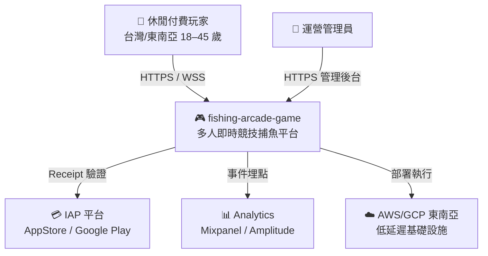

### 2.2 Container 圖（C4 Level 2）

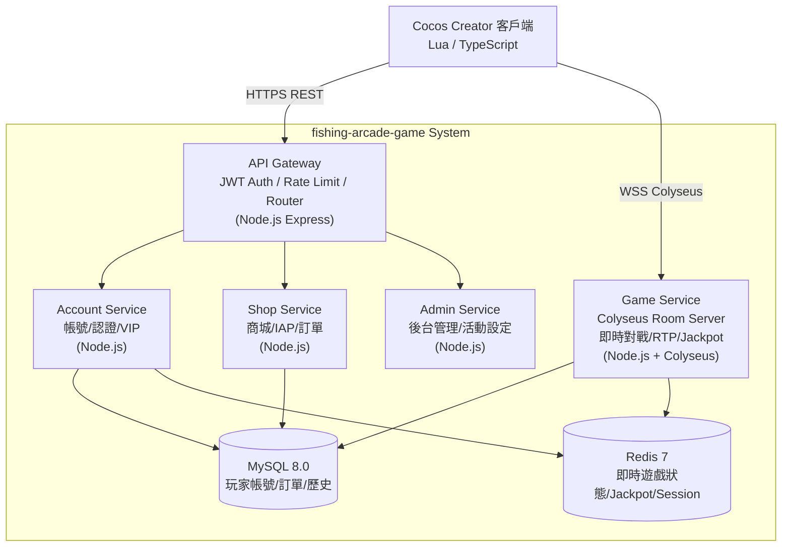

---

## 3. Architecture Design

### 3.1 架構模式

**選用模式：** Layered + Event-Driven（遊戲事件層）

```
Presentation Layer  — Express Controller / Colyseus Room Handler（輸入驗證）
       ↓
Application Layer   — Use Case / Game Service（業務流程協調）
       ↓
Domain Layer        — Entity + Domain Service（RTP 計算、Jackpot 規則）
       ↓
Infrastructure      — Repository（MySQL）/ Cache（Redis）/ IAP Client
```

**SOLID 原則對應表**

| 原則 | 本系統實作方式 |
|------|--------------|
| SRP | 每個 Service 只負責一個業務領域（Account/Game/Shop 互不侵犯）|
| OCP | RTP 引擎透過 `IRTPStrategy` Interface 擴展（不修改核心引擎）|
| LSP | `FishPoolService` 的所有 Fish 子型別（NormalFish/EliteFish/BossFish）可互換 |
| ISP | `IGameRoom`, `IFishSpawner`, `IRTPEngine` 細粒度 Interface，不強制實作不需要的方法 |
| DIP | `GameService` 依賴 `IRTPEngine` Interface，不依賴 `DefaultRTPEngine` 具體實作 |

### 3.2 技術選型決策（ADR）

#### ADR-001：即時通訊框架選型

| 欄位 | 內容 |
|------|------|
| **狀態** | ACCEPTED |
| **背景** | 需要支援 4–6 人同場即時 WebSocket，狀態需廣播同步 |
| **選項比較** | Option A：**Colyseus 0.15**（遊戲專用，Schema Delta Sync，開箱即用 Room 管理，MIT 授權）優：低延遲 P99 < 100ms；劣：社群較小<br>Option B：**Socket.io 自建**（更靈活，社群大）優：生態成熟；劣：需自行實作狀態管理，開發工時 ×2 |
| **決策** | 選用 Colyseus 0.15 |
| **理由** | 遊戲專用框架的 Delta State Sync 可節省 40–60% 帶寬；BRD §8.3 已標示 Colyseus 為技術約束 |
| **後果** | 未來若需更換框架，遷移成本較高；Colyseus 版本升級需追蹤 |

#### ADR-002：資料庫選型

| 欄位 | 內容 |
|------|------|
| **狀態** | ACCEPTED |
| **背景** | 需儲存玩家帳號、交易記錄、遊戲歷史；即時狀態需高速讀寫 |
| **選項比較** | Option A：**MySQL 8.0**（PRD §1 明確指定，亞洲遊戲業標準棧）優：文件完善，DBA 熟悉；劣：JSON 功能相對 PostgreSQL 略弱<br>Option B：**PostgreSQL 16**（更強的 JSON/JSONB，地理索引）優：功能更豐富；劣：PRD 已指定 MySQL |
| **決策** | 選用 MySQL 8.0（遵從 PRD §1 硬性約束）|
| **理由** | PRD 已指定 MySQL；亞洲遊戲業 DBA 生態以 MySQL 為主；避免團隊學習成本 |
| **後果** | 複雜 JSON 查詢需用 JSON_EXTRACT；未來如需 JSONB 則需評估遷移 |

#### ADR-003：RTP 引擎架構

| 欄位 | 內容 |
|------|------|
| **狀態** | ACCEPTED |
| **背景** | RTP 85–95% 需伺服器端控制，防止作弊；每局需要動態調整命中率 |
| **選項比較** | Option A：**純伺服器端計算**（Server-Authoritative）優：防作弊；劣：計算壓力在伺服器<br>Option B：**客戶端計算**優：延遲低；劣：易被破解，完全不可接受 |
| **決策** | 選用純伺服器端計算 |
| **理由** | 博弈類遊戲的反作弊是核心要求；服務器計算壓力可透過水平擴展解決 |
| **後果** | 每次射擊需 WebSocket round-trip；P99 < 100ms 的目標依賴 Colyseus Room 在同一 AZ |

### 3.3 技術棧總覽

| 層次 | 技術 | 版本 | 選型理由 |
|------|------|------|---------|
| 後端語言 | TypeScript | 5.4 | 類型安全，Colyseus 官方支援 |
| 後端 Runtime | Node.js | 20 LTS | Colyseus 官方推薦，LTS 穩定支援 |
| 即時框架 | Colyseus | 0.15 | BRD 硬性約束，遊戲專用 Delta Sync |
| REST Framework | Express.js | 4.x | 輕量，Node.js 生態標準 |
| ORM | Prisma | 5.x | TypeScript-first，Migration 管理完善 |
| 資料庫 | MySQL | 8.0 | PRD 指定；亞洲遊戲業標準 |
| 快取 | Redis | 7.x | 即時狀態、Jackpot 原子操作、Session |
| 認證 | jsonwebtoken (RS256) | 9.x | RS256 非對稱簽章，防偽造 |
| 容器 | Docker (multi-stage) | 26.x | 標準化部署 |
| 容器編排 | Kubernetes | 1.29 | Rancher Desktop 本地 + 雲端同一套設定 |
| CI/CD | GitHub Actions | — | 免費額度充足，與 GitHub 整合 |
| 單元測試 | Jest + ts-jest | 29.x | TypeScript 生態標準 |
| 整合測試 | Supertest + Testcontainers | — | 真實 DB，不 mock |
| 負載測試 | k6 | — | JavaScript DSL，CI 整合友好 |
| 前端語言（客戶端）| TypeScript / Lua | — | Cocos Creator 3.x 支援 |
| 前端框架 | Cocos Creator | 3.8 | BRD 硬性約束 |
| 訊息佇列 | Redis Pub/Sub | 7.x | 輕量，遊戲事件廣播；Phase 2 可遷移至 NATS |

### 3.4 Bounded Context & Context Map（DDD）

```mermaid
graph LR
    subgraph BC_Account["Account BC\n帳號/認證/VIP"]
        User["User Aggregate"]
        VipSubscription["VipSubscription Aggregate"]
    end
    subgraph BC_Game["Game BC\n遊戲邏輯/RTP/Jackpot"]
        GameRoom["GameRoom Aggregate"]
        Fish["Fish Aggregate"]
        Weapon["Weapon Value Object"]
    end
    subgraph BC_Commerce["Commerce BC\n商城/IAP/訂單"]
        Order["Order Aggregate"]
        Product["Product Value Object"]
    end
    subgraph BC_IAP["IAP Platform\n外部"]
        IAPReceipt["Receipt Validation"]
    end

    BC_Account -->|"Customer/Supplier\nGame 消費 Account 的用戶 Token"| BC_Game
    BC_Commerce -->|"Conformist\n遵從 IAP Platform 的回條格式"| BC_IAP
    BC_Game -->|"Published Language\nDomain Event 通知 Commerce 結算"| BC_Commerce
```

**Context Map 關係說明**

| 上游 BC | 下游 BC | 整合模式 | 說明 |
|--------|--------|---------|------|
| Account BC | Game BC | Customer/Supplier | Game 消費 Account 的 JWT User ID，Account 保證 API 穩定 |
| Game BC | Commerce BC | Published Language | 遊戲結算透過 Domain Event（GameSessionEnded）通知 Commerce 更新金幣餘額 |
| IAP Platform | Commerce BC | Conformist | Commerce 遵從 App Store / Google Play 的 Receipt 格式，無法修改 |

---

## 4. Security 設計

### 4.1 OWASP Top 10 對應

| # | 風險 | 本系統對策 |
|---|------|----------|
| A01 | Broken Access Control | JWT RS256 + RBAC（玩家/管理員/超管三級）；每個 API endpoint 透過 middleware 驗證 `user.role`；Colyseus Room 進入時驗證 JWT |
| A02 | Cryptographic Failures | 密碼 bcrypt cost=12；PII（email/phone/birthdate）AES-256-GCM 加密存儲；HTTPS TLS 1.3+ 全程加密；WebSocket 使用 WSS |
| A03 | Injection | 全部使用 Prisma Parameterized Query；用戶輸入透過 Zod Schema Validation；禁止 raw SQL 拼接 |
| A04 | Insecure Design | 伺服器端 RTP 計算（Server-Authoritative）；Threat Model 已設計（見 §9.5）；Fail-fast startup |
| A05 | Security Misconfiguration | 環境變數白名單驗證（啟動時）；Production 禁止 DEBUG mode；k8s Secret 管理敏感值 |
| A06 | Vulnerable Components | Dependabot 自動掃描 npm 依賴；每月執行 `npm audit`；CI 整合 Snyk 掃描 |
| A07 | Auth Failures | 登入失敗 5 次鎖定 15 分鐘（Redis TTL）；JWT Access 15 分鐘 + Refresh 7 天 Rotation；WebSocket 連線須帶有效 JWT |
| A08 | Data Integrity | 訂單 `order_id`（UUID v4）冪等設計；Jackpot 獎勵透過 Redis Lua Script 原子更新；HMAC 簽署 IAP Receipt |
| A09 | Logging Failures | 結構化 JSON 日誌（詳見 §21）；email/phone/password 欄位強制遮罩；Log Level 由環境變數控制 |
| A10 | SSRF | IAP Receipt 驗證 URL allowlist（僅允許 sandbox.itunes.apple.com / buy.itunes.apple.com / googleapis.com）；禁止服務端 fetch 任意 URL |

### 4.2 Secret 管理

- 所有 Secret（DB 密碼、JWT 私鑰、IAP API Key）存於 k8s Secret / OS Keystore
- 啟動時 Fail-fast 驗證所有必要環境變數（缺失立即 exit(1)）
- Log 遮罩規則：`email → t***@***.com`；`password → [REDACTED]`；`jwt_token → [TOKEN:前4位]`
- Secret Rotation Policy：JWT 私鑰每 90 天輪換；DB 密碼每 180 天輪換

### 4.5 Domain Events

| 事件名稱 | 觸發時機 | Payload 主要欄位 | 訂閱者 | 冪等保證 |
|---------|---------|---------------|--------|---------|
| `UserRegistered` | 帳號創建成功後 | `{user_id, email_hash, created_at}` | Analytics | 是（event_id UUID dedup）|
| `UserLoggedIn` | 登入成功後 | `{user_id, ip_hash, timestamp}` | Analytics, AuditLog | 是 |
| `GameSessionStarted` | Colyseus Room 滿員啟動 | `{session_id, room_id, player_ids[], started_at}` | Analytics | 是 |
| `FishKilled` | 伺服器端命中判定通過 | `{session_id, killer_id, fish_type, coins_awarded, rtp_at_kill}` | Commerce BC, Analytics | 是 |
| `BossKillCompleted` | Boss 魚被擊殺（贏者通吃）| `{session_id, winner_id, boss_type, jackpot_contributed, consolation_paid}` | Commerce BC, Analytics | 是 |
| `JackpotTriggered` | Jackpot 大獎觸發 | `{session_id, winner_id, jackpot_amount, triggered_at}` | Commerce BC, Analytics, Push Notification | 是（Redis Lua Script 原子確保一次）|
| `GameSessionEnded` | 所有玩家結算完成 | `{session_id, results[], mvp_id, ended_at}` | Commerce BC, Analytics | 是 |
| `IAPPurchaseCompleted` | IAP Receipt 驗證通過 | `{order_id, user_id, product_id, diamonds_granted}` | Account BC（更新鑽石）| 是（order_id 冪等）|
| `VipActivated` | VIP 訂閱生效 | `{user_id, vip_tier, activated_at, expires_at}` | Account BC, Analytics | 是 |
| `AgeVerified` | 年齡驗證通過 | `{user_id, declared_age, verified_at}` | Account BC（更新 age_status）| 是 |

---

## 5. BDD 設計

### 5.1 預計 Feature Files 清單（BDD-server 輸出）

| Feature File | 對應 PRD US | 主要 Scenario |
|-------------|-----------|-------------|
| `account.feature` | US-ACCT-001 | 註冊成功、Email 衝突、登入鎖定、密碼強度 |
| `game_room.feature` | US-ROOM-001 | 房間配對、Bot 補位、斷線重連、MVP 獎勵 |
| `fish_pool.feature` | US-FISH-001 | 魚群生成、普通/精英/Boss 魚捕獲、服務降級 |
| `weapon_skill.feature` | US-WPSK-001 | 武器切換、技能冷卻、冰凍/炸彈/鎖定效果 |
| `rtp_engine.feature` | US-RTP-001 | RTP 範圍驗證、Jackpot 觸發、連敗補償、降級模式 |
| `shop_iap.feature` | US-SHOP-001 | 鑽石購買、IAP Receipt 驗證、幂等重試、退款 |
| `age_verification.feature` | US-AGE-001 | 年齡聲明、演示模式啟動、RESTRICTED 路徑 |
| `vip_subscription.feature` | US-VIP-001 | VIP 訂閱生效、到期降級、特權驗證 |

### 5.2 範例 Gherkin Scenario

```gherkin
Feature: RTP Engine — Server-Authoritative Hit Detection

  Background:
    Given 遊戲伺服器 RTP 引擎已啟動
    And 目標 RTP 設定為 90%

  Scenario: 正常命中計算
    Given 玩家 player-001 在 session-abc 中射擊 fish-normal-001（面值 10 金幣）
    When RTP 引擎計算命中（本局玩家 RTP 累積為 88%，低於目標）
    Then 系統判定命中，player-001 獲得 10 金幣
    And 記錄 FishKilled 事件（rtp_at_kill=88%）

  Scenario: RTP 服務降級
    Given RTP 引擎服務異常（連接失敗）
    When 玩家射擊觸發命中計算
    Then 系統降級使用固定命中率 80%
    And 後台觸發 RTPServiceDegraded 告警
    And 玩家側無感知（遊戲正常進行）

  Scenario Outline: Jackpot 觸發條件驗證
    Given 全局 Jackpot 池累積為 <pool_amount> 金幣
    And 玩家 player-001 射擊觸發 Jackpot 判定（概率 0.01%）
    When Redis Lua Script 執行原子 Jackpot 鎖定
    Then <result>

    Examples:
      | pool_amount | result |
      | 50000       | Jackpot 觸發，player-001 獲得 50000 金幣，Jackpot 池重置為 1000 |
      | 999         | Jackpot 未觸發（未達最低觸發閾值 1000 金幣）|
```

### 5.5 資料模型

**主要 Entity 清單**

| Entity 名稱 | 主要欄位 | 說明 |
|------------|---------|------|
| `users` | id(PK), email(UNIQUE), password_hash, age_status(ENUM), vip_tier, gold_balance, diamond_balance, created_at, deleted_at | 玩家帳號（PII 欄位加密）|
| `game_sessions` | id(PK), room_id, status(ENUM), started_at, ended_at, player_count | 遊戲局記錄 |
| `session_players` | id(PK), session_id(FK), user_id(FK), final_gold, is_mvp, joined_at | 局-玩家關聯表 |
| `fish_kills` | id(PK), session_id(FK), killer_id(FK), fish_type, coins_awarded, rtp_snapshot, killed_at | 魚群捕獲記錄 |
| `jackpot_events` | id(PK), session_id(FK), winner_id(FK), amount, triggered_at | Jackpot 觸發記錄 |
| `orders` | id(PK,UUID), user_id(FK), product_id, order_type(ENUM), amount_usd, status(ENUM), iap_receipt_hash, created_at | 訂單（含冪等 UUID）|
| `vip_subscriptions` | id(PK), user_id(FK,UNIQUE), vip_tier, activated_at, expires_at, status | VIP 訂閱狀態 |
| `audit_logs` | id(PK), event_type, actor_user_id, resource_type, resource_id, before_json, after_json, outcome, ip_hash, created_at | 稽核日誌（Append-only）|

**Entity 關聯**

| 來源 Entity | 關聯類型 | 目標 Entity | 說明 |
|------------|---------|------------|------|
| `users` | 1:N | `game_sessions`（透過 session_players）| 一個玩家參與多個遊戲局 |
| `game_sessions` | 1:N | `session_players` | 一局有 4–6 個玩家參與記錄 |
| `game_sessions` | 1:N | `fish_kills` | 一局有多條捕獲記錄 |
| `users` | 1:N | `orders` | 一個玩家有多筆訂單 |
| `users` | 1:1 | `vip_subscriptions` | 一個玩家最多一筆活躍 VIP 訂閱 |

**初步 ER 圖（Mermaid erDiagram）**

```mermaid
erDiagram
    users {
        BIGINT id PK
        VARCHAR email UK
        VARCHAR password_hash NOT_NULL
        ENUM age_status NOT_NULL
        TINYINT vip_tier DEFAULT_0
        BIGINT gold_balance DEFAULT_0
        INT diamond_balance DEFAULT_0
        DATETIME created_at NOT_NULL
        DATETIME deleted_at
    }
    game_sessions {
        BIGINT id PK
        VARCHAR room_id NOT_NULL
        ENUM status NOT_NULL
        DATETIME started_at NOT_NULL
        DATETIME ended_at
        TINYINT player_count
    }
    session_players {
        BIGINT id PK
        BIGINT session_id FK
        BIGINT user_id FK
        BIGINT final_gold DEFAULT_0
        BOOL is_mvp DEFAULT_0
        DATETIME joined_at NOT_NULL
    }
    fish_kills {
        BIGINT id PK
        BIGINT session_id FK
        BIGINT killer_id FK
        VARCHAR fish_type NOT_NULL
        BIGINT coins_awarded NOT_NULL
        DECIMAL rtp_snapshot
        DATETIME killed_at NOT_NULL
    }
    orders {
        CHAR order_id PK
        BIGINT user_id FK
        VARCHAR product_id NOT_NULL
        ENUM order_type NOT_NULL
        DECIMAL amount_usd
        ENUM status NOT_NULL
        VARCHAR iap_receipt_hash
        DATETIME created_at NOT_NULL
    }
    vip_subscriptions {
        BIGINT id PK
        BIGINT user_id FK
        TINYINT vip_tier NOT_NULL
        DATETIME activated_at NOT_NULL
        DATETIME expires_at NOT_NULL
        ENUM status NOT_NULL
    }
    audit_logs {
        BIGINT id PK
        VARCHAR event_type NOT_NULL
        BIGINT actor_user_id
        VARCHAR resource_type NOT_NULL
        VARCHAR resource_id NOT_NULL
        JSON before_json
        JSON after_json
        ENUM outcome NOT_NULL
        VARCHAR ip_hash
        DATETIME created_at NOT_NULL
    }

    users ||--o{ session_players : "參與"
    game_sessions ||--o{ session_players : "包含"
    game_sessions ||--o{ fish_kills : "記錄"
    users ||--o{ orders : "產生"
    users ||--o| vip_subscriptions : "擁有"
    users ||--o{ audit_logs : "觸發"
```

---

## 6. TDD 設計

**測試金字塔**

| 層次 | 比例 | 工具 | 策略 |
|------|------|------|------|
| Unit | 60% | Jest + ts-jest | mock 外部 I/O（Redis/MySQL/IAP）；測 RTP 引擎、Jackpot 計算、冪等邏輯 |
| Integration | 30% | Supertest + Testcontainers（MySQL + Redis）| 真實 DB/Redis；不 mock；測 API endpoint + Colyseus Room 生命週期 |
| E2E | 10% | Playwright（UI Flow）+ k6（Load）| 關鍵 User Flow：登入→進房→捕魚→結算→購買 |

**Mock 邊界規則：**
- ✅ 允許 mock：IAP 平台 API、Analytics SDK、Push Notification
- ❌ 禁止 mock：MySQL、Redis、RTP 邏輯、Jackpot 計算

**Coverage 目標：**
- Unit：≥ 85%（核心業務邏輯）
- Integration：≥ 70%（API endpoints）
- Overall：≥ 80%

---

## 7. SCALE 設計

### 7.1 規格推算

| 指標 | 估算值 | 推算依據 |
|------|--------|---------|
| 峰值 DAU | 10,000 | BRD O1 目標 |
| 峰值並發玩家 | 1,000 | DAU × 10%（午休 + 晚間高峰）|
| 峰值並發房間 | 200 | 1,000 玩家 ÷ 5 人/房間 |
| Colyseus 峰值 QPS（遊戲事件）| 6,000 event/s | 200 房間 × 5 人 × 6 事件/秒（射擊頻率）|
| REST API 峰值 QPS | 500 req/s | 1,000 並發 × 0.5 req/s（購買/帳號查詢）|
| 資料量/日 | 2M rows | fish_kills 估算（200 房間 × 100 局/日 × 100 擊殺/局）|
| MySQL 儲存增長/年 | ~50 GB | 2M rows/日 × 365 × 平均 70 bytes/row |
| Redis 峰值記憶體 | ~2 GB | 200 房間狀態 × ~1MB/房間 + Session Cache |

### 7.2 Load Test 門檻（k6）

```javascript
export const options = {
  vus: 1000,
  duration: '5m',
  thresholds: {
    http_req_duration: ['p(99)<500'],     // REST API P99 < 500ms
    http_req_failed: ['rate<0.001'],      // Error rate < 0.1%
    http_reqs: ['rate>500'],             // 達到 500 REST QPS
    ws_session_duration: ['p(99)<100'],  // WebSocket P99 < 100ms（遊戲事件）
  },
};
```

### 7.3 k8s 資源規格

**Game Service（Colyseus）— 資源最密集**
```yaml
resources:
  requests: { cpu: "500m", memory: "512Mi" }
  limits:   { cpu: "2000m", memory: "2Gi" }
hpa:
  minReplicas: 3
  maxReplicas: 20
  targetCPUUtilizationPercentage: 70
```

**Account / Shop Service — 無狀態 REST**
```yaml
resources:
  requests: { cpu: "100m", memory: "128Mi" }
  limits:   { cpu: "500m", memory: "512Mi" }
hpa:
  minReplicas: 2
  maxReplicas: 10
  targetCPUUtilizationPercentage: 70
```

---

## 8. 可觀測性設計

| 類型 | 工具 | 監控內容 |
|------|------|---------|
| Logging | Loki + 結構化 JSON | 請求/回應、遊戲事件、錯誤（不含 secret/PII）|
| Metrics | Prometheus + Grafana | WebSocket P99、RTP 計算延遲、Jackpot 觸發率、DAU |
| Tracing | OpenTelemetry + Jaeger | 跨服務請求追蹤（Account → Game → Commerce）|
| Alerting | Grafana Alerting | P1：錯誤率 > 1%；P1：WebSocket P99 > 150ms；P2：RTP 計算 > 50ms |

### 8.5 Graceful Degradation Strategy

**降級矩陣**

| 依賴服務 | 降級觸發條件 | 降級行為 | 恢復條件 |
|---------|-----------|---------|---------|
| RTP 引擎（Redis RTP State）| Redis 連線失敗持續 5s | 降級為固定命中率 80%；觸發 RTPServiceDegraded P1 告警 | Redis 連線恢復 + 自動切回 |
| IAP 平台（AppStore/Google Play）| HTTP 5xx 連續 3 次 | 延遲驗證（訂單標記 PENDING，異步重試）；用戶提示「支付處理中」| Circuit Breaker Half-Open 測試通過 |
| Analytics 平台 | HTTP 超時 > 1000ms | 事件寫入本地 Buffer（最多 10,000 事件）；批量重傳 | Analytics 恢復後自動重傳 |

**Circuit Breaker 配置（以 opossum 為例）**

```typescript
const rtpCircuitBreaker = new CircuitBreaker(rtpCalculate, {
  timeout: 50,           // 50ms 超時
  errorThresholdPercentage: 50,  // 50% 錯誤率打開
  resetTimeout: 10000,   // 10s 後嘗試 Half-Open
  volumeThreshold: 10,   // 至少 10 次請求後才評估
});
```

**Bulkhead Pattern**

| 服務 | Redis Pool Size | MySQL Pool Size |
|------|----------------|----------------|
| Game Service | 50 connections/replica | 20 connections/replica |
| Account Service | 10 connections/replica | 30 connections/replica |
| Shop Service | 10 connections/replica | 20 connections/replica |

---

## 9. CI/CD 設計

```
GitHub Actions Pipeline（main 分支 / PR）：

Push/PR → main:
  ① lint（ESLint + Prettier）→ 失敗則 Block
  ② type-check（tsc --noEmit）→ 失敗則 Block
  ③ unit tests（Jest）+ coverage report（≥ 80% 或 Block）
  ④ integration tests（Testcontainers: MySQL + Redis）
  ⑤ build Docker image（multi-stage, node:20-alpine）
  ⑥ push image to ghcr.io（tag: sha + latest）
  ⑦ deploy to Rancher Desktop k8s（local staging）
  ⑧ k6 load test（通過 §7.2 門檻 或 Block）
  ⑨ Snyk 安全掃描（高危漏洞則 Block）
  ⑩ deploy GitHub Pages（HTML docs）

Release Tag（v*）:
  ① 以上全部 → ② canary deploy（5% 流量）→ ③ 等待 15 分鐘 metrics
  → ④ 自動擴展至 100%（若 error_rate < 0.1% 且 P99 < 100ms）
  → ⑤ 若失敗自動 Rollback 至前一版本
```

### 9.5 Threat Model（STRIDE 分析）

| 威脅類型 | 具體威脅 | 緩解控制 | 殘餘風險 |
|---------|---------|---------|---------|
| Spoofing（身份偽造）| JWT Token 偽造 / WebSocket 身份冒用 | RS256 非對稱簽章；WebSocket 連線必須帶有效 JWT；Token Rotation | LOW |
| Tampering（竄改）| 遊戲封包篡改（修改射擊結果）| Server-Authoritative：所有命中計算在伺服器端；TLS 1.3+ 加密傳輸 | LOW |
| Repudiation（否認）| 玩家否認曾充值/操作 | 完整 Audit Log（Append-only S3 WORM）；IAP Receipt Hash 儲存 | LOW |
| Information Disclosure（資訊洩漏）| RTP 演算法外洩（玩家推算必中規律）| RTP 演算法完全在伺服器端；不對外暴露 RTP 參數；Log 遮罩 | MEDIUM |
| Denial of Service（阻斷服務）| DDoS WebSocket 連線耗盡；暴力登入 | Rate Limiting（登入 10 req/min/IP）；WebSocket 連線限制；WAF | MEDIUM |
| Elevation of Privilege（權限提升）| BOLA（水平越權：查看他人金幣）| 每次 API 驗證 `resource.user_id === jwt.user_id`；RBAC middleware | LOW |

**P1 高風險威脅詳細說明：**

**威脅：RTP 演算法逆向工程**
- 攻擊向量：玩家截取大量遊戲封包，統計命中率分佈，推算 RTP 調整規律，實施「高 RTP 時機命中」利用
- 緩解：（1）RTP 狀態存於 Redis，不在封包中暴露；（2）每局 RTP 基礎值加入隨機偏移（±2%）；（3）監控異常高 RTP 玩家（連續 100 局命中率 > 95% 則觸發人工審查）
- 測試：設計 Chaos Monkey 腳本，模擬玩家封包分析，驗證無法從封包推算 RTP 狀態

---

## 10. Mermaid 架構圖（9 種 UML）

### 10.1 Component Diagram（系統元件依賴）

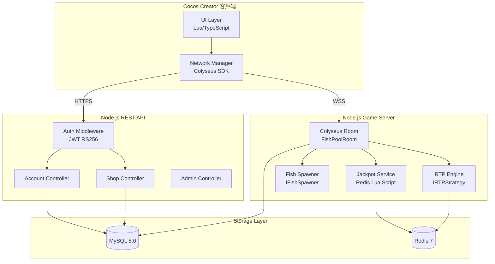

### 10.2 Sequence Diagram（Happy Path：玩家捕魚流程）

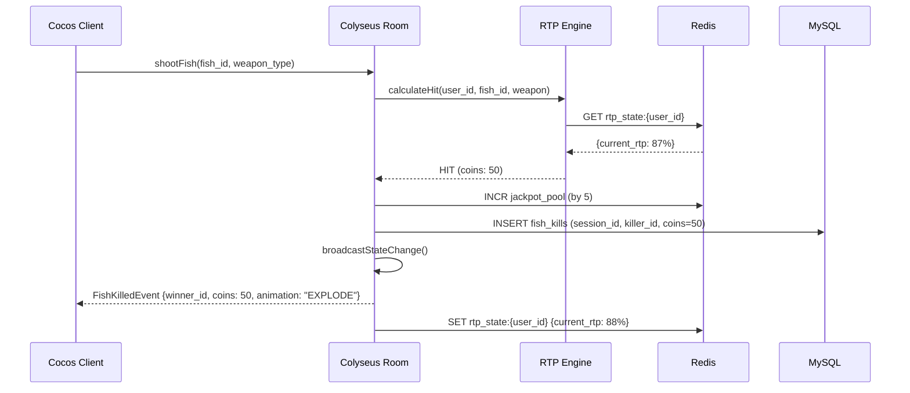

### 10.2b Sequence Diagram（Error Path：RTP 服務降級）

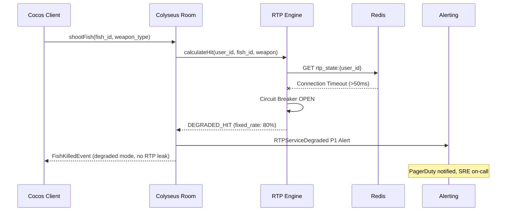

### 10.3 Deployment Diagram（k8s 部署拓撲）

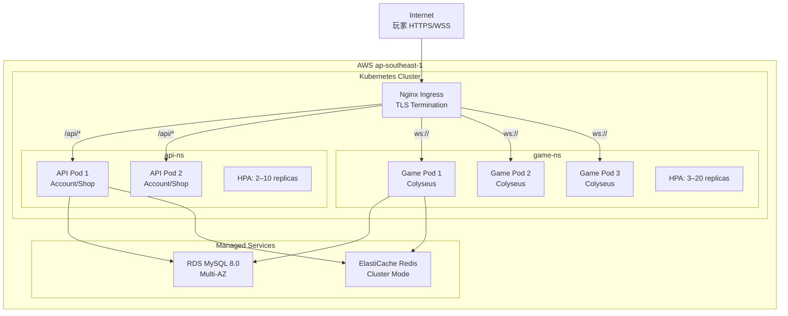

### 10.4 State Machine Diagram（GameSession 狀態機）

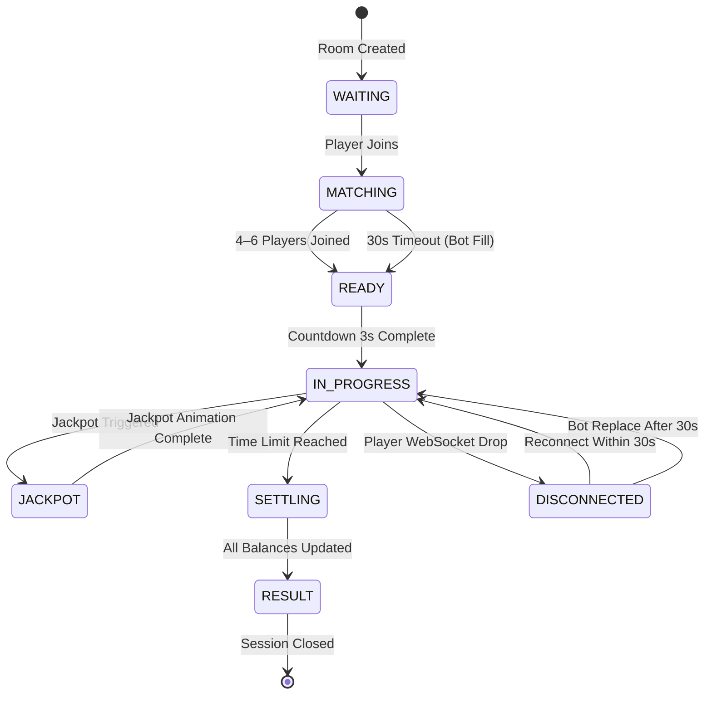

### 10.5b Use Case Diagram

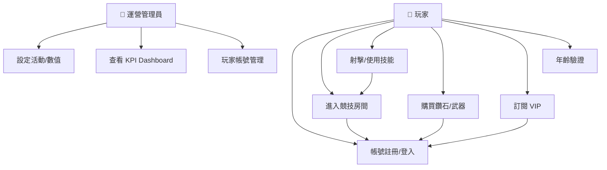

### 10.6 Class Diagram（Domain Layer — Game BC）

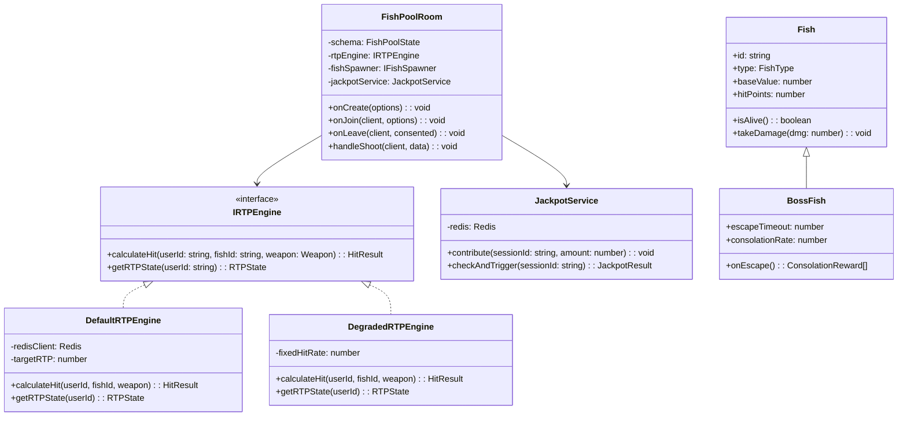

### 10.7 Object Diagram（具體物件實例 — 一局遊戲）

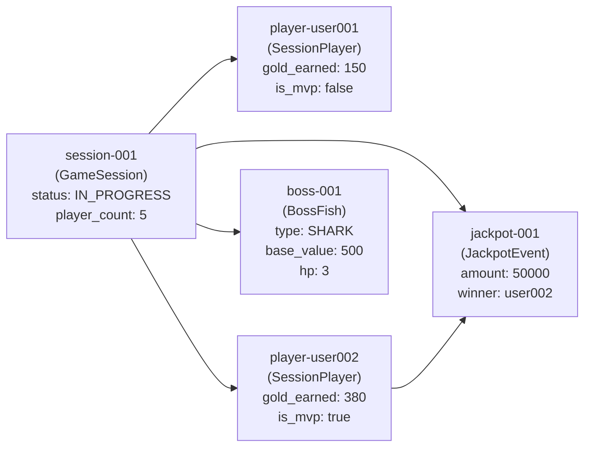

### 10.8 Communication Diagram（Jackpot 觸發訊息序列）

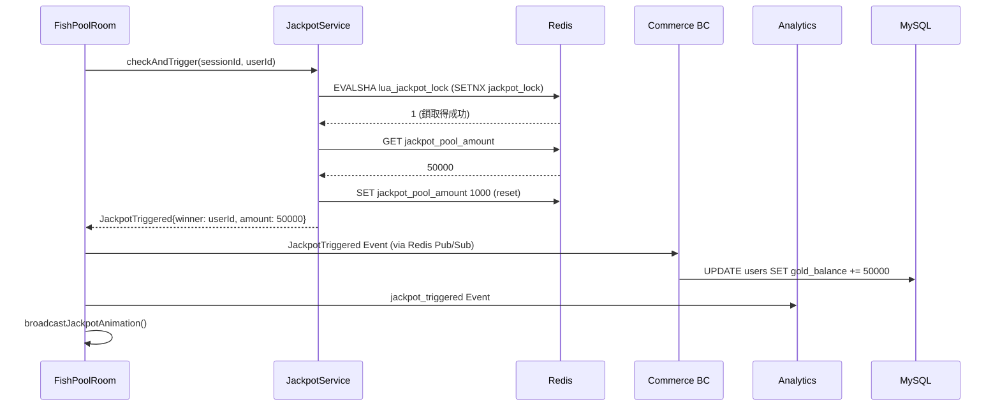

### 10.9 Activity Diagram（IAP 購買流程）

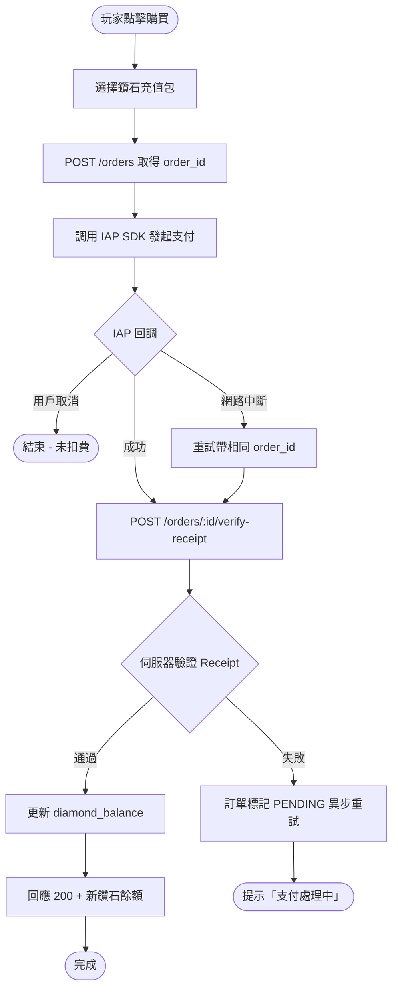

### 10.5 SLO / SLI / Error Budget

**SLI（量測指標）**
- `availability_sli` = 成功請求（2xx/3xx）/ 總請求 × 100%
- `websocket_latency_p99` = WebSocket 遊戲事件 99th percentile 延遲
- `rest_latency_p99` = REST API 回應時間 99th percentile
- `error_rate` = 5xx 錯誤 / 總請求 × 100%

**SLO（目標）**

| SLO | 目標 | 量測窗口 | 告警（消耗 50% Error Budget 時）|
|-----|------|---------|-------------------------------|
| API Availability | ≥ 99.5% | 30 天滾動 | < 99.75%（30 分鐘 Burn Rate）|
| WebSocket P99 | ≤ 100ms | 7 天 | > 80ms（持續 5 分鐘）|
| REST P99 | ≤ 500ms | 7 天 | > 400ms（持續 5 分鐘）|
| Error Rate | ≤ 0.1% | 1 小時 | > 0.05%（持續 10 分鐘）|

**Error Budget Policy**
- 0–50% 消耗：正常開發節奏
- 50–75% 消耗：限制高風險 Deploy（需 Tech Lead Approval）
- 75–100% 消耗：僅 Hotfix
- >100% 消耗：凍結所有非 SLO 相關部署；緊急事故審查

### 10.6 Audit Log Design

**必須記錄的事件：**
- 所有認證事件（登入成功/失敗/Token Refresh）
- 所有寫入操作（金幣/鑽石變更、訂單建立、VIP 狀態變更）
- PII 欄位讀取（email/phone/birthdate）
- 管理員操作（帳號封禁/數值調整）
- Jackpot 觸發事件

**Audit Log 格式（JSON Lines）**
```json
{
  "event_id": "01HY9X...（ULID）",
  "timestamp": "2026-04-24T12:00:00.000Z",
  "event_type": "user.login_completed",
  "actor": {
    "user_id": "uuid",
    "ip_hash": "sha256(ip_addr)",
    "user_agent_hash": "sha256(ua)"
  },
  "resource": {
    "type": "user",
    "id": "uuid",
    "before": {},
    "after": { "gold_balance": 1050 }
  },
  "outcome": "SUCCESS"
}
```

**不可篡改性：** Append-only（MySQL INSERT ONLY，禁止 UPDATE/DELETE）；每日批量串流至 S3 Object Lock（COMPLIANCE mode，保留 7 年）；Audit Log 表不允許任何應用程式帳號執行 UPDATE/DELETE。

### 10.7 Synthetic Monitoring & Health Check

**Health Check Endpoints**
```
GET /health          → Liveness  → {"status":"ok","ts":"ISO8601"}
GET /health/ready    → Readiness → {"status":"ok","checks":{"mysql":"ok","redis":"ok","colyseus":"ok"}}
```

**Synthetic Monitoring Scripts（每 5 分鐘執行）**
1. `syn_account_flow`：登入 → 取得 JWT → 查詢個人資料 → 登出
2. `syn_game_entry`：登入 → WebSocket 連線 → 加入匹配隊列 → 確認配對成功 → 離開房間
3. `syn_shop_browse`：登入 → 查詢商城商品清單 → 確認回應 200

---

## 11.2 Capacity Planning Math

**峰值 QPS 計算公式**
```
REST QPS_peak = DAU × sessions_per_day × requests_per_session / 86400 × peak_factor
             = 10,000 × 5 × 10 / 86400 × 3 ≈ 17 req/s (average) × 3 = 51 req/s

WebSocket QPS_peak = concurrent_players × events_per_second_per_player
                   = 1,000 × 6 = 6,000 events/s
```

**Pod 數計算公式**
```
pods_game = concurrent_connections × avg_rtt_s / connections_per_colyseus_room / rooms_per_pod
          = 1,000 × 0.1s / 5 / 200 ≈ 1 pod（最小 3 replicas 高可用）

pods_api  = qps × p99_latency_s / rps_per_pod
          = 500 × 0.5 / 250 = 1 pod（最小 2 replicas）
```

**DB 連線池計算**
```
pool_per_game_pod = replicas × connections_per_replica = 3 × 20 = 60 connections
pool_per_api_pod  = 2 × 30 = 60 connections
Total MySQL max_connections >= 200（含 20% 緩衝）
```

**環境成本估算表（月費 USD）**

| 環境 | Game Pods | API Pods | MySQL RDS | Redis | 估算月費 |
|------|---------|---------|---------|-------|---------|
| Dev (Rancher Desktop) | Local | Local | Local | Local | ~$0 |
| Staging | 2×t3.medium | 2×t3.small | db.t3.small | cache.t3.micro | ~$150 |
| Prod | 3-20×t3.large | 2-10×t3.medium | db.r6g.large Multi-AZ | cache.r6g.large | ~$800–3,000 |

**擴展觸發條件**
- CPU > 70% 持續 3 分鐘 → HPA Scale Up
- WebSocket P99 > 80ms 持續 3 分鐘 → Pre-scale trigger（Scheduled HPA 在高峰前）

---

## 12.3 Chaos Engineering

> **前提：** 僅在 Staging 環境執行；Production 需 SRE Approval + Change Freeze 窗口外。

| 實驗名稱 | 目標 | 注入故障 | 假設（Hypothesis）|
|---------|------|---------|-----------------|
| Redis RTP 連線池耗盡 | 驗證 RTP Circuit Breaker + Degraded Mode | Redis 最大連線數設為 1，模擬池耗盡 | 玩家遊戲繼續進行（降級 80% 命中率）；P1 告警觸發；5 分鐘內 Circuit Breaker 自動恢復 |
| IAP 平台 HTTP 500 | 驗證訂單 PENDING 異步重試 | Mock IAP Server 回 500 10 分鐘 | 所有新購買訂單標記 PENDING；IAP 恢復後 5 分鐘內自動重試驗證成功；用戶收到推送通知 |
| Colyseus Pod 隨機重啟 | 驗證 k8s 自愈 + 玩家斷線重連 | Kill 1 of 3 Colyseus Pod | 同 Pod 玩家收到斷線通知；30s 內 k8s 重啟新 Pod；玩家 30s 重連成功（Bot 暫替）|
| MySQL 主節點 Failover | 驗證 RDS Multi-AZ 切換 + 服務恢復 | 手動 Reboot RDS Primary | Failover < 60s；API 服務短暫 503（< 30s）後自動恢復；無資料遺失 |

---

## 13.2 Deployment Strategy

| 策略 | 切換方式 | Rollback 速度 | 適用場景 |
|------|---------|-------------|---------|
| Blue-Green | DNS/LB 瞬間切換 | < 30s | 重大版本（RTP 演算法更換、DB Schema 破壞性變更）|
| Canary | 流量 5%→25%→100% | 數分鐘 | 一般功能（新武器、UI 更新、非 Schema 變更）|
| Rolling | 逐步替換 Pod | 數分鐘 | Hotfix、設定變更、依賴版本升級 |

**Canary 閘門條件（每階段觀察 15 分鐘）**
- Error Rate < 0.1%（持續 15 分鐘）→ 通過則擴展下一階段
- WebSocket P99 < 100ms（持續 15 分鐘）→ 通過則擴展
- 任一條件失敗 → 自動 Rollback 至前一版本 + PagerDuty 通知

### 13.5 Disaster Recovery（DR）

| 指標 | 目標 | 量測方式 |
|------|------|---------|
| RTO（Recovery Time Objective）| ≤ 30 分鐘 | DR 演練計時（每季）|
| RPO（Recovery Point Objective）| ≤ 5 分鐘 | 備份頻率驗證（每小時增量）|
| MTTR（Mean Time To Recovery）| ≤ 2 小時 | Incident 歷史分析 |

**備份策略：**
- MySQL：RDS 自動每小時增量備份 + 每日全量快照（保留 30 天）；Cross-Region 複製至 ap-east-1
- Redis：AOF 持久化（`appendonly yes`）+ 每 5 分鐘 RDB 快照；Game 狀態可從 MySQL 重建（容忍 5 分鐘損失）
- Audit Log：即時串流至 S3（ap-southeast-1）+ 跨區域複製至 ap-east-1 WORM（保留 7 年）
- 應用設定：GitHub 版本控制 + k8s ConfigMap/Secret

**DR 演練計劃：** 每季在 Staging 執行完整 Failover 演練，記錄 RTO/RPO 達成率，輸出 DR 測試報告。

### 13.6 Runbook Framework

**P1 告警 Runbook 範例：RTPServiceDegraded**

```
告警名稱：RTPServiceDegraded
嚴重度：P1
首次回應 SLA：15 分鐘

診斷步驟：
1. 確認範圍：kubectl get pods -n game-ns | grep -v Running
2. 檢查 Redis 連線：redis-cli -h $REDIS_HOST PING
3. 檢查 Circuit Breaker 狀態：GET /metrics | grep circuit_breaker_state
4. 查看錯誤日誌：kubectl logs -n game-ns -l app=game-service | grep RTPServiceDegraded

常見原因與解法：
| 症狀 | 原因 | 解法 |
|------|------|------|
| Redis PING 失敗 | ElastiCache Failover 中 | 等待 Failover 完成（< 60s）；驗證 /health/ready |
| Redis PING 成功但 Circuit Open | 連線池耗盡 | 重啟 Game Pod（Circuit 重置）；檢查連線池大小設定 |
| Pod CrashLoopBackOff | OOM | 增加 Memory Limit；kubectl top pods 確認 |

Escalation：15 分鐘未解 → 通知 Engineering Manager（PagerDuty）
```

---

## 14. Risk Assessment

| 風險 | 可能性 | 影響 | 緩解策略 |
|------|--------|------|---------|
| Colyseus 版本停止維護 | MEDIUM | HIGH | 已選 MIT 授權版本可 Fork；Phase 2 評估 Socket.io 遷移可行性 |
| MySQL 在高並發 fish_kills 寫入瓶頸 | MEDIUM | MEDIUM | 分區表（按 session_id RANGE）；寫入前 Redis Buffer + Batch INSERT |
| RTP 演算法被逆向工程 | LOW | HIGH | 詳見 §9.5 威脅緩解；Phase 2 評估 Server-side Encryption of RTP State |
| IAP 平台規則變更（Apple/Google）| HIGH | MEDIUM | 訂閱層與平台解耦；Receipt 驗證邏輯抽象為 Interface |
| 東南亞各國博彩法規變化 | MEDIUM | HIGH | Legal 定期審查（每季）；Age Verification 設計為可設定（不同地區不同規則）|
| Cocos Creator 版本升級破壞 Lua 腳本 | LOW | MEDIUM | 鎖定 Cocos 3.8 版本；升級前完整 E2E 測試 |

---

## 16. Implementation Plan

**6 個月分 3 階段（對應 BRD §12 Roadmap）**

| 里程碑 | 月份 | 主要交付 | 成功標準 |
|--------|------|---------|---------|
| Phase 1：核心玩法（MVP）| M1–M2 | US-ACCT-001 + US-ROOM-001 + US-FISH-001（3 種魚）+ US-WPSK-001（基礎砲）+ US-RTP-001（基礎 RTP）| 4 人即時對戰可完整進行；P99 WebSocket < 100ms |
| Phase 2：系統完善 | M3–M4 | US-SHOP-001 + US-RTP-001（Jackpot）+ US-AGE-001 + 砲台升級/任務系統 | IAP 購買完整；Jackpot 觸發；次日留存 ≥ 35% |
| Phase 3：測試上線 | M5–M6 | US-VIP-001 + 完整活動框架 + Beta 測試 + 正式上線 | DAU 10,000；付費率 5%；月營收 USD 10,000 |

**Sprint 計劃（M1–M2 Phase 1 細節）**

| Sprint | 週期 | 主要任務 |
|--------|------|---------|
| S1 | W1–W2 | k8s 環境搭建；帳號服務（US-ACCT-001）；JWT 認證 |
| S2 | W3–W4 | Colyseus Room 基礎；魚群生成；普通魚捕獲 |
| S3 | W5–W6 | 精英魚 + Boss 魚；基礎 RTP 引擎；WebSocket P99 驗證 |
| S4 | W7–W8 | 武器系統；技能系統；多人搶魚機制；Alpha 測試 |

---

## 17. Open Questions

| # | 問題 | 優先級 | 負責人 | 截止日期 |
|---|------|--------|--------|---------|
| OQ-01 | 訂單 ID（order_id）生成端：客戶端 vs 伺服器端？（PRD §5.5 AC-3 標注 EDD 決策）| HIGH | Tech Lead | M1 S1 |
| OQ-02 | Colyseus Room 跨 Pod 狀態同步方案（HPA Scale-Out 後 Room 如何路由）？| HIGH | Backend Architect | M1 S2 |
| OQ-03 | Jackpot 觸發機率的合規性（台灣/泰國/越南博彩法）是否需要固定種子亂數可稽核？| HIGH | Legal + Tech Lead | M2 |
| OQ-04 | Redis AOF 持久化 vs 純 RDB 快照：I/O 影響評估（游戲狀態寫入頻率 ~6,000 events/s）？| MEDIUM | SRE | M1 S2 |
| OQ-05 | 技術負債管理：Lua 客戶端腳本與 TypeScript 伺服器端之間的資料型別如何保持同步？| MEDIUM | Tech Lead | M2 |

---

## 19. Approval Sign-off

| 角色 | 姓名 | 審核日期 | 狀態 |
|------|------|---------|------|
| Tech Lead | TBD | — | ⬜ PENDING |
| System Architect | TBD | — | ⬜ PENDING |
| PM（PRD Owner）| TBD | — | ⬜ PENDING |
| Security Engineer | TBD | — | ⬜ PENDING |

---

## 20. Feature Flag Engineering

### 20.1 Flag 清單（5 種類型）

| Flag 名稱 | 類型 | 用途 | 初始狀態 |
|---------|------|------|---------|
| `feature.game.boss_fish_enabled` | Release | 控制 Boss 魚功能可見性（Phase 1 可先關閉）| OFF |
| `feature.commerce.vip_subscription` | Release | VIP 訂閱功能上線開關 | OFF（Phase 2 開啟）|
| `exp.rtp.conservative_mode_ab` | Experiment | A/B 測試保守 RTP（88%）vs 標準 RTP（90%）| A/B 50%/50% |
| `ops.game.disable_jackpot` | Ops | 緊急關閉 Jackpot（法規風險緊急預案）| OFF |
| `perm.admin.rtp_override` | Permission | 允許管理員即時調整 RTP 目標值 | ON（限管理員）|
| `infra.game.use_redis_pub_sub_v2` | Infrastructure | 切換至 Redis Pub/Sub v2 實作 | OFF |

### 20.2 工具選型

**選用：Unleash（開源自建）**
- 理由：自建保留 RTP/Jackpot 設定完全控制權（敏感數值不外洩至 SaaS）；MIT 授權；支援 TypeScript SDK
- 部署：k8s 同 Cluster，獨立 Namespace `feature-flags-ns`

### 20.3 Canary Release 流程

```
0.1% → 1% → 10% → 50% → 100%
每階段等待 30 分鐘，確認：
  - Error Rate < 0.1%（統計顯著性 p < 0.05，樣本 ≥ 200 請求）
  - WebSocket P99 < 100ms（持續 15 分鐘）
  - 用戶投訴率無異常上升
```

### 20.4 Flag 技術債管理

- **90 天 Zombie Flag 強制清理政策**：超過 90 天未使用的 Flag 自動進入清理 Queue；SRE 每月執行一次 Zombie Flag 審查
- **Flag 生命週期 Checklist：**
  1. 創建：填入 owner、purpose、expected_cleanup_date
  2. 啟用：記錄 A/B 測試計劃（若 Experiment 類型）
  3. 全量：更新狀態為 FULL_ROLLOUT，設定 cleanup_deadline（+30 天）
  4. 清除：從 Codebase + Unleash 雙向刪除；Update Changelog

---

## 21. Cross-Cutting Concerns

### 21.1 可觀測性三支柱

| 支柱 | 工具 | 覆蓋範圍 |
|------|------|---------|
| 日誌（Logging）| Loki + Grafana | 所有服務 JSON 日誌；遊戲事件；錯誤追蹤 |
| 指標（Metrics）| Prometheus + Grafana | WebSocket P99、RTP 計算延遲、Jackpot 觸發率、DAU、錯誤率 |
| 追蹤（Tracing）| OpenTelemetry + Jaeger | Account → Game → Commerce 跨服務請求鏈 |

### 21.2 結構化日誌（JSON Lines）

```json
{
  "timestamp": "2026-04-24T12:00:00.000Z",
  "level": "INFO",
  "service": "game-service",
  "version": "1.0.0",
  "trace_id": "01HY9X2K3M4N...",
  "span_id": "7a8b9c...",
  "event": "fish.killed",
  "context": {
    "session_id": "uuid",
    "killer_id": "uuid",
    "fish_type": "NORMAL",
    "coins_awarded": 50
  }
}
```

**PII 禁止記錄規則（強制執行）：**
- ❌ 禁止：`email`、`phone`、`password`、`birthday`、`ip_address`（明文）
- ✅ 允許：`email_hash`（SHA256 後 4 字元前綴）、`ip_hash`（SHA256）、`user_id`（UUID）
- 實施方式：ESLint 自訂規則（`no-pii-in-logs`）阻止直接記錄 PII 欄位

### 21.3 OpenTelemetry 分散式追蹤

```typescript
// span 命名慣例：<service>.<operation>
const span = tracer.startSpan('game-service.rtp_calculate');
span.setAttributes({
  'session.id': sessionId,
  'user.id': userId,
  'fish.type': fish.type,
  'rtp.target': targetRTP,
});
// W3C Trace Context 傳播（跨服務自動注入）
```

**業務屬性標注規範：**
- `session.id`、`user.id`、`room.id`：遊戲上下文
- `payment.amount_usd`、`payment.product_id`：商城上下文
- `rtp.snapshot`：RTP 狀態（數值，非演算法細節）

---

*此文件由 gendoc 自動生成。版本：v1.0 | DOC-ID: EDD-FISHGAME-20260424*
