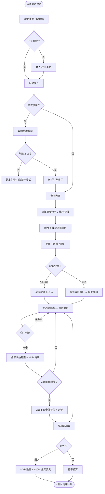
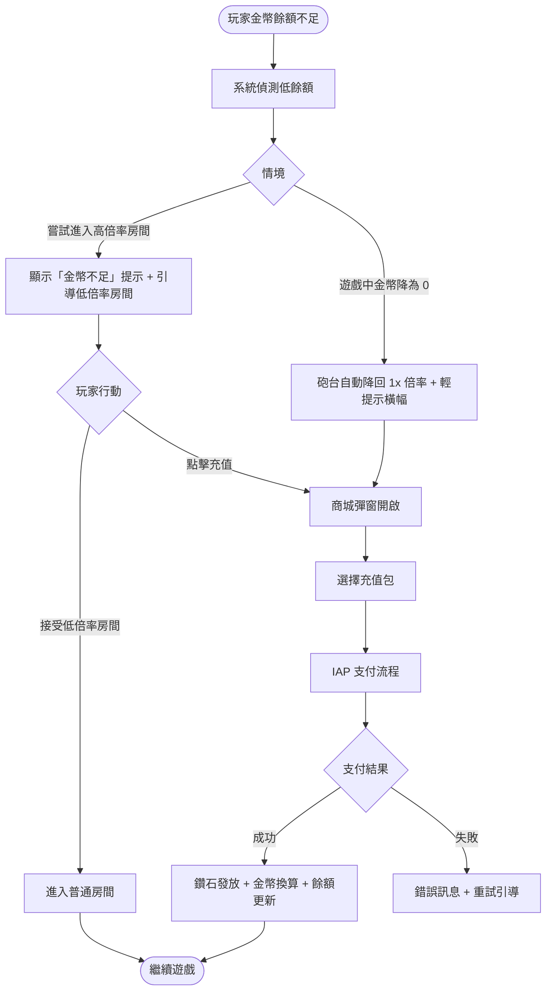
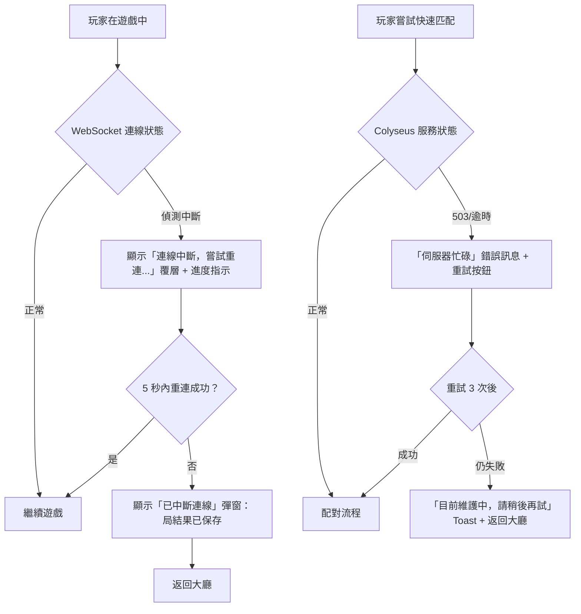
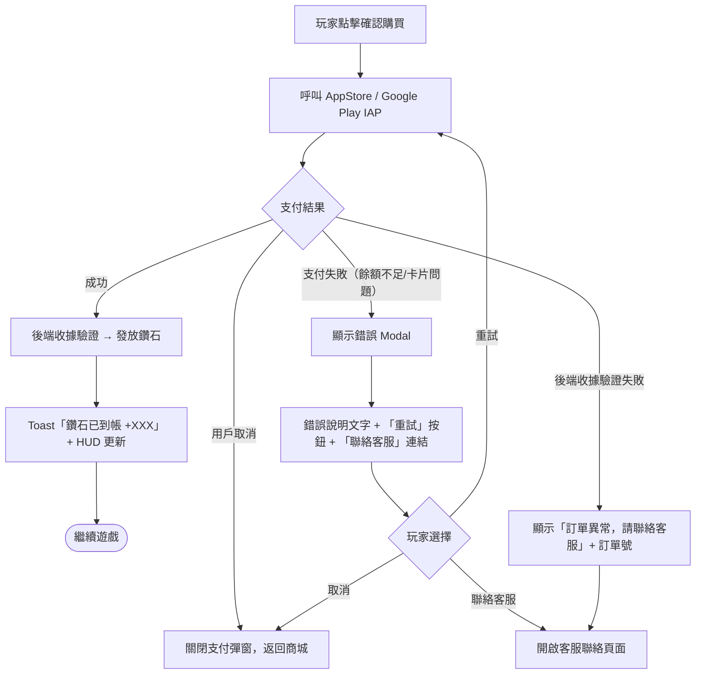
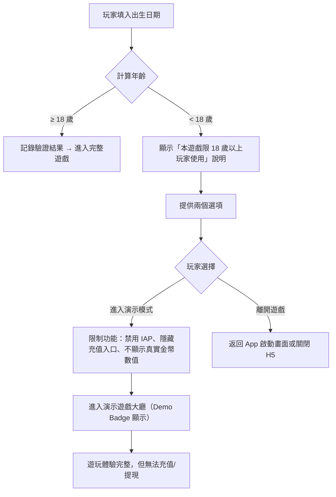
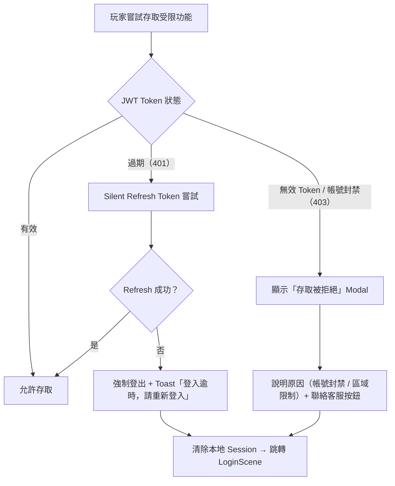
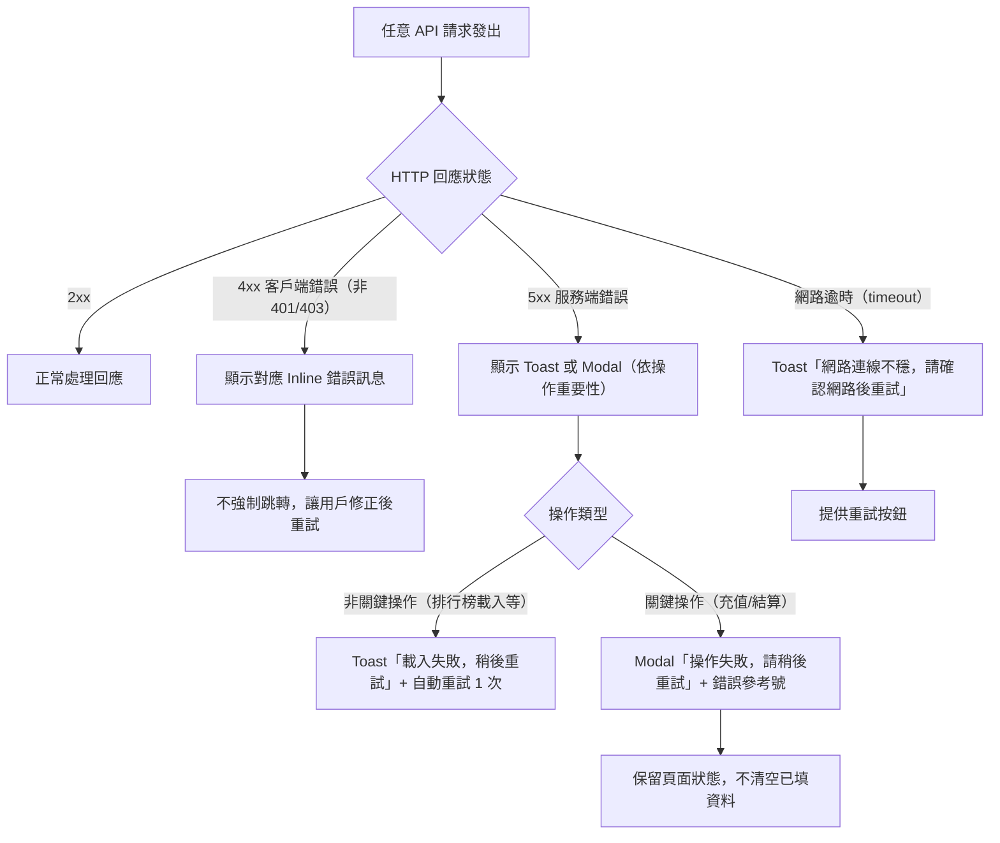
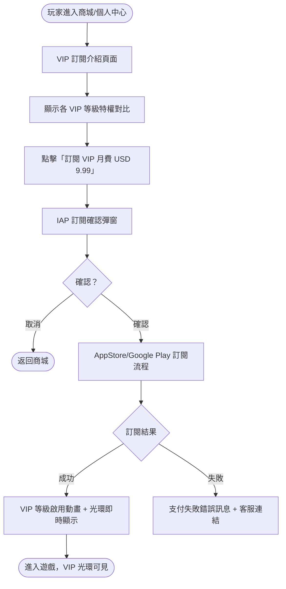
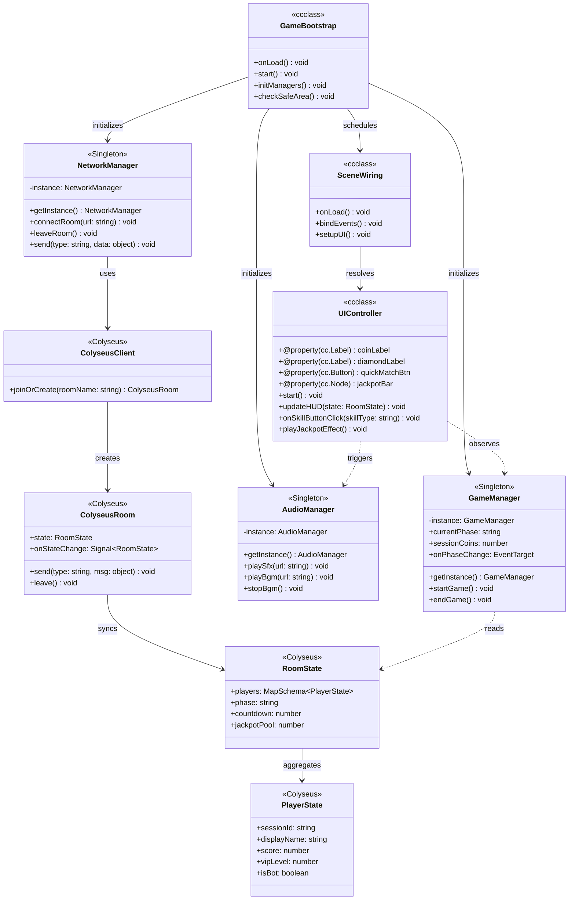

# PDD — Product Design Document (UX / Interaction Design)
<!-- SDLC Requirements Engineering — Layer 3：UX / Interaction Design -->
<!-- 上游：PRD（System Requirements）→ 本文件 → 下游：EDD（Tech Spec） -->
<!-- Client 類型偵測結果：Cocos Creator（PRD §1 明確提及 Cocos Creator 3.x + TypeScript） -->

---

<!-- ⚠️ Platform Scope — 本文件適用範圍 -->

## Platform Scope Declaration（平台範圍宣告）

- [x] Web（Browser / H5）
- [ ] iOS Native
- [ ] Android Native
- [ ] Desktop App
- [x] Game UI（Cocos Creator 3.x）
- [ ] Embedded / Kiosk

---

## Document Control

| 欄位 | 內容 |
|------|------|
| **專案名稱** | fishing-arcade-game（捕魚街機遊戲平台）|
| **文件版本** | v1.0 |
| **狀態** | DRAFT |
| **作者（UX / Product Designer）** | AI Generated (gendoc-gen-pdd) |
| **日期** | 2026-04-25 |
| **上游 PRD** | [PRD.md](PRD.md) |
| **下游 EDD** | [EDD.md](EDD.md)（Tech Spec）|
| **設計稿（Figma）** | https://figma.com/file/FISHGAME-PDD-v1 *(placeholder — 待設計師建立)* |
| **審閱者** | Engineering Lead, 遊戲策劃 Lead, Art Director |
| **核准者** | Design Lead / Executive Sponsor |

---

## Change Log

| 版本 | 日期 | 作者 | 變更摘要 |
|------|------|------|---------|
| v1.0 | 2026-04-25 | /gendoc pdd (AI Generated) | 初稿，依 IDEA + BRD + PRD 自動生成 |

---

## 1. Design Brief

### 1.1 設計目標

> 本次設計要解決的核心體驗問題：現有捕魚遊戲雖有多人同屏，但 UI 設計未能傳遞「真實競爭感」——玩家感受不到搶奪資源的緊張刺激，操作介面缺乏策略深度的視覺線索，付費引導生硬。設計完成後，玩家應在進入房間的前 30 秒即感受到「這局我要贏」的競爭動機，以及在 Jackpot 觸發時體驗到「全場沸騰」的視覺盛宴。

**設計成功樣貌：**
- 競技阿明（Persona A）進入遊戲 < 30 秒、選好武器技能開戰，操作反饋即時爽快
- VIP 老闆（Persona B）的 VIP 光環在房間內顯而易見，Jackpot 特效讓全場玩家都注意到他
- 新手小花（Persona C）完成新手引導後能獨立操作，第一局就看到金幣噴出動畫

### 1.2 PRD 需求對應

| PRD REQ-ID | User Story 摘要 | 設計回應 | PDD 章節 |
|-----------|----------------|---------|---------|
| US-ACCT-001 | 快速註冊登入，保護遊戲進度 | 遊戲風格登入畫面，3-step 快速帳號流 | §5.1 |
| US-ROOM-001 | 30 秒內進入 4–6 人競技房間 | 大廳選房 + 快速匹配 UI，倒數配對進度條 | §5.2, §5.3, §5.9 |
| US-FISH-001 | 多種魚類倍率，策略性射擊 | 主遊戲畫面魚群視覺層級、命中動畫 | §5.4 |
| US-WPSK-001 | 武器技能選擇，差異化遊玩風格 | 砲台選擇介面、技能冷卻 HUD | §5.3, §5.5 |
| US-RTP-001 | 穩定回報感 + Jackpot 大獎震撼 | Jackpot 進度條、觸發全屏特效設計 | §5.4, §6.5 |
| US-SHOP-001 | 3 步驟內完成鑽石充值 | 商城彈窗設計，充值轉化漏斗 | §5.6 |
| US-VIP-001 | VIP 光環彰顯地位 | VIP 等級視覺識別系統，房間內光環 | §5.3, §5.7 |
| US-AGE-001 | 18+ 年齡驗證 | 首次啟動年齡確認彈窗 | §5.2 |
| — (P1) | 配對等待體驗（30s 倒數、Bot 補位） | 配對等待畫面 — 玩家頭像飛入動畫、取消按鈕 | §5.9 |
| — (P1) | 使用者設定（音效/語言/帳號）| 設定面板 — 分類設定項目、即時預覽 | §5.10 |
| — (P1) | 個人中心（資料/VIP 進度/記錄）| ProfileScene — 個人資料展示、VIP 進度視覺 | §5.11 |
| — (P2) | 排行榜（賽季/全服/好友）| LeaderboardPanel — 多維度排名展示 | §5.12 |

**P1 US 設計考量補充：**
- 配對等待畫面（§5.9）需在 30 秒倒數內維持玩家期待感，頭像飛入動畫傳遞「真人對戰」氛圍，Bot 補位需明確但不打擊信心
- 設定面板（§5.10）採分類清單設計，音效/音樂即時生效，語言切換需確認 Modal，帳號安全操作需二次驗證
- ProfileScene（§5.11）將 VIP 進度視覺化呈現（進度條 + 距下一等級差距），強化付費動機

### 1.3 設計原則（Design Principles）

1. **爽感優先（Dopamine First）**：每一個命中、每一次 Boss 擊殺、每一次 Jackpot，視覺與音效回饋必須讓玩家感受到「值了」。所有動畫設計以「讓玩家想截圖分享」為標準。

2. **競爭感可見（Competition Visible）**：多人競爭的緊張感必須透過 UI 明確傳達——其他玩家的砲火方向、Boss 魚血量、即時排名——讓玩家隨時知道「我現在第幾名、我需要搶什麼」。

3. **付費引導自然（Natural Monetization）**：鑽石充值、VIP 訂閱、禮包購買的引導點在玩家「感受到不足」的自然時機出現，而非強行打斷遊戲。所有付費 UI 必須與整體視覺風格一致，不顯突兀。

4. **3 秒可懂（3-Second Comprehension）**：新手玩家在任何畫面停留 3 秒後，應能直覺理解「下一步做什麼」。核心操作路徑不超過 3 個步驟。

---

## 2. User Research Summary

### 2.0 User Personas

#### Persona A：「競技阿明」— 核心競技玩家

| 欄位 | 內容 |
|------|------|
| **姓名** | 阿明（Lin Ming）|
| **年齡** | 27 歲 |
| **職業** | 台北軟體工程師 |
| **技術熟悉度** | 高（手機遊戲重度用戶，5/5）|
| **使用情境** | 每日通勤 40 分鐘 + 午休 20 分鐘，碎片時間快速娛樂 |
| **核心目標** | 在競技局中搶先捕獲 Boss 魚，在排行榜展現實力，累積 VIP 彰顯地位 |
| **主要痛點** | 現有捕魚遊戲多人同屏「假競爭」，技能只有倍率調整，毫無策略深度（PRD §3.2）|
| **付費習慣** | 每月 USD 15–30，偏好立即回報的付費（高倍率砲台、技能道具）|
| **成功時的感受** | 搶到 Boss 魚彈出「MVP！」時的勝利爽感，每局都想再來一局 |
| **引言** | 「以前玩捕魚就是傻傻按，現在跟人搶 Boss 魚才叫真的爽！」|

#### Persona B：「VIP 老闆」— 高付費核心玩家

| 欄位 | 內容 |
|------|------|
| **姓名** | Somchai（索猜）|
| **年齡** | 38 歲 |
| **職業** | 泰國曼谷個體商人 |
| **技術熟悉度** | 中（習慣手機購物付費，3/5）|
| **使用情境** | 晚間 1–2 小時遊戲放鬆，有明顯地位彰顯需求 |
| **核心目標** | 成為 VIP 頂級玩家，擁有限定皮膚和高倍率砲台，在遊戲中被其他玩家「看見」|
| **主要痛點** | 現有遊戲即使大量充值也感受不到 VIP 感，外觀和普通玩家一樣（PRD §3.2）|
| **付費習慣** | 每月 USD 50–100，偏好大額禮包和 VIP 訂閱月費 |
| **成功時的感受** | VIP 光環在房間中顯眼，Jackpot 觸發時全屏特效讓所有人都注意到他 |
| **引言** | 「我付了這麼多錢，就是要讓其他人看到我的金色砲台光環！」|

#### Persona C：「新手小花」— 新手免費玩家

| 欄位 | 內容 |
|------|------|
| **姓名** | Hoa Nguyen（阮小花）|
| **年齡** | 22 歲 |
| **職業** | 越南河內大學生 |
| **技術熟悉度** | 低（對 IAP 流程不熟悉，2/5）|
| **使用情境** | 透過 Facebook 廣告首次下載，每日零碎時間 10–15 分鐘 |
| **核心目標** | 探索玩法享受免費捕魚爽感，在不付費前提下盡可能玩得有趣 |
| **主要痛點** | 剛進遊戲不清楚武器和技能怎麼用；金幣消耗速度比獲得速度快（PRD §3.2）|
| **付費習慣** | 基本不付費；低門檻首充優惠（USD 0.99）有小概率嘗試 |
| **成功時的感受** | 新手引導完成後能獨立操作，第一局看到金幣噴出動畫 |
| **引言** | 「打到魚的時候金幣噴出來的動畫太好看了，我想繼續玩！」|

### 2.1 研究方法

| 方法 | 樣本數 | 日期 | 關鍵發現 |
|------|--------|------|---------|
| 競品體驗分析 | 5 個競品（H5 魚機 + App 捕魚）| 2026-04 | 市場主流強調爆金倍率，多人同屏無真實競爭 UI 設計，缺乏競爭感視覺傳達 |
| 用戶訪談（計劃中） | N ≥ 10 人目標用戶 | 2026-05 | IDEA §5.2 驗證計畫：問題確認率目標 ≥ 70% |
| 參考 Codebase UX 分析 | taishan6868 Lua/Cocos 模組 | 2026-04 | 現有模組包含 FCannonUnlockUI / FChangeSkinUI / FDiamondLottery，UI 結構成熟，可提取設計模式 |
| Usability Test（計劃中）| 5 人（目標 Persona A/B）| MVP 完成後 | Task Completion Rate 目標 ≥ 80% |

### 2.2 用戶心智模型

> 玩家期待捕魚遊戲的運作方式是：「射擊 → 命中 → 金幣獎勵」的直覺循環，且多人同場時「搶先打到就是我的」——類似街機遊戲的即時競爭直覺。
>
> 現有設計造成的誤解：多人同屏但資源不爭搶，玩家不理解為什麼旁邊的人也在打同一條魚卻各自得分，導致競爭感完全失效。
>
> 本次設計如何對齊用戶心智模型：主遊戲畫面清楚顯示「魚的血量條」（Boss 魚）和「搶奪進度」，命中特效方向感強烈，讓玩家立刻感受到「這條魚正在被多人搶」的緊張感。

### 2.3 關鍵 Insight（設計決策依據）

| # | Insight | 來源 | 設計影響 |
|---|---------|------|---------|
| I-1 | 玩家在競技局中需要隨時知道「自己現在第幾名」，否則缺乏持續射擊的動機 | PRD §3.2 Persona A 目標 | 觸發 §5.4 主遊戲 HUD 即時排名設計 |
| I-2 | VIP 高付費用戶的核心需求是「被看見」，VIP 視覺識別必須在房間內顯著可見 | PRD §3.2 Persona B 痛點 | 觸發 §5.7 VIP 光環設計系統 |
| I-3 | 新手流失主要發生在「金幣快用完時不知道怎麼辦」，而非遊戲太難 | PRD §3.2 Persona C 痛點 | 觸發 §5.1 新手引導流程與低門檻充值引導 |
| I-4 | Jackpot 觸發的視覺震撼感是高付費用戶持續付費的核心動機之一 | PRD §3.2 Persona B 成功樣貌 | 觸發 §6.5 Jackpot 全屏特效微互動設計 |
| I-5 | 技能冷卻時間若不可見，玩家會頻繁點擊無效按鈕導致體驗挫折 | PRD US-WPSK-001 AC-3 | 觸發 §5.5 技能 HUD 冷卻視覺化設計 |

### 2.4 User Journey Map：玩家首次體驗競技局

| 階段 | 觸達 | 探索 | 首局競技 | 達成目標 | 回訪 |
|------|------|------|---------|---------|------|
| **用戶行動** | 看到 Facebook 廣告（魚被炸飛特效）點擊下載 | 打開遊戲完成年齡驗證 + 新手引導 | 選擇武器技能，快速匹配進入競技局，與其他玩家搶魚 | 局結束結算，看到排名和金幣收益，觸發 MVP 或 Jackpot | 被 Push 通知或活動提醒拉回，開啟第二局 |
| **想法** | 「這個特效好酷，感覺很爽快」 | 「這個操作還蠻簡單的，武器怎麼選？」 | 「那條 Boss 魚是我先打的！旁邊那個人也在搶！」 | 「我今天拿了 MVP！金幣漲了好多！想再來一局」 | 「今天的限時 Boss 活動不玩可惜了」 |
| **情緒** | 😊 好奇期待 | 😐 摸索中 | 😤 緊張競爭 | 😁 成就感爆棚 | 😊 期待感 |
| **痛點** | 廣告品質參差，進入門檻（下載等待）| 新手引導太長 / 太短，武器選擇不知如何判斷 | 網路延遲導致命中判定混亂，金幣不夠用 | 結算介面資訊太多看不懂 | 通知頻率過高造成干擾 |
| **機會點** | 廣告素材強調「搶 Boss 爽感」，降低安裝包體積 | 互動式新手引導（第一局內嵌引導），武器推薦提示 | 低延遲體驗優化，金幣不足時適時引導充值（非強制）| 簡潔結算卡片設計，MVP 特效分享功能 | 個人化活動通知，留存禮包設計 |
| **接觸點** | Facebook/LINE 廣告 → App Store/H5 落地頁 | 遊戲啟動畫面 → 年齡驗證 → 大廳 | 砲台選擇介面 → 配對等待 → 主遊戲畫面 | 結算介面 → 排行榜 | Push 通知 → 活動公告橫幅 |

> **Persona：** 競技阿明（Persona A）｜**目標：** 在首次競技局中感受到真實競爭感，並有「想再來一局」的意願 ｜**情境：** 午休 20 分鐘碎片時間首次體驗

### 2.5 Jobs to Be Done (JTBD)

**核心 Job Statement：**
> 當 [我有 10–30 分鐘碎片時間想要快速娛樂] 時，我希望能 [進入一場有真實競爭感的多人捕魚局，並在局中感受到勝利爽感]，
> 讓我能夠 [帶著愉悅感離開，並期待下次再玩]。

| Job Type | Job Statement | 現有解法（競品）| 不滿意程度（1–5）|
|----------|--------------|--------------|----------------|
| Functional（功能型）| 在碎片時間快速進入遊戲，選好武器技能並開始射擊，即時獲得金幣收益回饋 | 現有 H5 魚機：進入速度快但無武器技能選擇策略 | 4（缺乏策略深度）|
| Emotional（情感型）| 在競技中感受「搶先捕獲 Boss 魚」的勝利爽感，以及 Jackpot 觸發時的驚喜震撼 | 現有競品：Jackpot 特效品質差，多人競爭感不真實 | 5（核心痛點）|
| Social（社交型）| 在多人同場中展示技術和 VIP 地位，成為 MVP，並有可分享的成就截圖 | 現有競品：無 MVP 機制，無 VIP 視覺識別，無分享功能 | 4（高設計機會）|

> **評分說明：** 1 = 完全滿意，5 = 非常不滿意（代表高設計機會）

### 2.6 Service Blueprint（服務藍圖）

| 行動類型 | 進入遊戲 | 競技局進行 | Jackpot 觸發 | 付費充值 | 局結束結算 |
|---------|---------|----------|-------------|---------|----------|
| **用戶行動** | 下載/訪問 H5，完成登入 + 年齡驗證 | 選武器技能，快速匹配，射擊搶魚 | 繼續射擊，觀看 Jackpot 特效 | 點擊商城，選充值包，完成支付 | 查看排名和金幣，決定是否再來一局 |
| — 可視線 | | | | | |
| **前台 UI** | 登入頁面 + 年齡驗證彈窗 + 大廳 | 砲台選擇介面 + 主遊戲 HUD | Jackpot 全屏特效 + 大獎動畫 | 商城彈窗 + IAP 支付流程 | 結算介面 + MVP 動畫 |
| — 可見線 | | | | | |
| **後台流程** | JWT 認證 + 年齡記錄 DB | Colyseus 房間狀態同步 + RTP 計算引擎 | Jackpot 觸發邏輯 + 獎池重置 | IAP 收據驗證 + 鑽石發放 | 結算 API + 排名計算 |
| — 內部互動線 | | | | | |
| **支援系統** | MySQL（用戶帳號）+ Redis（Session）| Redis 原子操作（搶魚去重）+ Node.js | MySQL（Jackpot 合規日誌）| MySQL（訂單記錄，ACID）+ AppStore/GP | MySQL（遊戲局記錄）+ Analytics |
| **實體證據** | URL / App 圖示 + 登入確認信 | 遊戲畫面截圖 + 音效 | Jackpot 動畫截圖（可分享）| 支付確認通知 + 鑽石餘額更新 | 結算截圖 + MVP 徽章 |

---

## 3. Information Architecture (IA)

### 3.1 畫面結構（Sitemap）

```mermaid
graph TD
    Root["🎮 Fishing Arcade Game"]

    Root --> A["啟動 / 登入"]
    Root --> B["遊戲大廳"]
    Root --> C["主遊戲畫面"]
    Root --> D["商城"]
    Root --> E["個人中心"]
    Root --> F["設定"]

    A --> A1["登入 / 快速訪客"]
    A --> A2["年齡驗證（首次）"]
    A --> A3["新手引導（首次）"]

    B --> B1["房間列表（普通 / 競技）"]
    B --> B2["砲台 / 技能選擇"]
    B --> B3["配對等待畫面"]
    B --> B4["排行榜（LeaderboardBtn 入口）"]
    B --> B5["活動公告"]

    C --> C1["主遊戲 HUD（金幣/排名/技能）"]
    C --> C2["魚群場景"]
    C --> C3["Jackpot 進度條"]
    C --> C4["結算介面"]
    C --> C5["MVP 動畫"]

    D --> D1["鑽石充值包"]
    D --> D2["道具 / 禮包購買"]
    D --> D3["VIP 訂閱"]
    D --> D4["抽獎"]

    E --> E1["個人資料"]
    E --> E2["VIP 等級 / 進度"]
    E --> E3["遊戲記錄"]
    E --> E4["訂單記錄"]

    F --> F1["音效 / 音樂設定"]
    F --> F2["通知設定"]
    F --> F3["語言選擇"]
    F --> F4["帳號安全"]
```



### 3.2 導覽結構

| 層級 | 導覽方式 | 入口位置 |
|------|---------|---------|
| 主導覽 | 遊戲主 HUD 底部固定工具列（大廳 / 商城 / 個人中心 / 設定）| 畫面底部，遊戲大廳及非遊戲中狀態顯示 |
| 遊戲中導覽 | 遊戲 HUD 懸浮按鈕（設定 / 離開 / 技能）| 畫面四角，不遮擋主要遊戲區域 |
| 情境導覽 | 結算介面「再來一局 / 返回大廳」、付費引導「立即充值」| 操作結果頁面內 |

**遊戲 UI 特殊導覽原則（Cocos Creator）：**
- 遊戲中所有 UI 覆層（HUD、技能按鈕、排名）以 z-order 層級管理，不遮擋魚群主場景
- 彈窗（商城、設定、結算）使用 Modal 覆蓋方式呈現，背景遊戲場景暫停或模糊
- 底部工具列僅在大廳狀態顯示，進入遊戲後收起

### 3.3 內容優先順序（遊戲 UI F/Z Pattern）

| 畫面 | 最重要（First Fixation）| 次要 | 輔助 |
|------|------------------------|------|------|
| 大廳 | 快速匹配按鈕（CTA）+ 金幣/鑽石餘額 | 房間類型選擇 + 活動橫幅 | 排行榜入口、設定 |
| 砲台選擇 | 當前選中砲台視覺展示 | 技能選擇區 | 砲台解鎖進度、「確認進入」按鈕 |
| 主遊戲 | 魚群場景（遊玩核心）| 金幣餘額 + 即時排名 HUD | Jackpot 進度條、技能按鈕 |
| 結算 | MVP 獎勵動畫 / 本局金幣收益 | 排行榜名次 | 「再來一局」CTA、返回大廳 |
| 商城 | 推薦充值包（最高價值感）| 其他充值選項 | VIP 訂閱入口、抽獎 |

---

## 4. User Flows

### 4.1 主流程（Happy Path）— 玩家首次進入競技局並獲勝



**任務完成時間目標：** 從開啟遊戲到進入競技局 < 60 秒；配對等待 < 30 秒；局長 3–5 分鐘

### 4.2 替代流程 — 金幣不足時的付費引導



### 4.3 錯誤流程 — 連線中斷與房間異常



#### 4.3.1 IAP 支付失敗流程



**UI 呈現：** 支付失敗使用 Modal 彈窗（非 Toast），因需要使用者明確回應；錯誤文字採友好語氣（「付款遇到一點問題」而非錯誤代碼）；提供訂單號方便客服追蹤。

#### 4.3.2 年齡驗證未滿 18 — 演示模式流程



**UI 呈現：** 未滿 18 提示採平和語氣，不帶責罰感；演示模式全程顯示「演示模式」浮水印角標；IAP 入口以灰色鎖定狀態顯示，點擊時彈出「演示模式無法購買」說明。

#### 4.3.3 無權限存取流程



**UI 呈現：** Token 過期的 Silent Refresh 對使用者透明（背景執行）；帳號封禁顯示封禁原因和申訴管道；不洩漏技術錯誤細節（如 HTTP 狀態碼）。

#### 4.3.4 API 通用失敗流程



**UI 呈現：** 通用錯誤訊息統一採友好語氣；關鍵操作失敗（充值）必須提供錯誤參考號以便客服追蹤；非關鍵操作（排行榜）失敗可自動靜默重試，不打擾使用者。

### 4.4 VIP 訂閱流程



---

## 5. Screen Specifications

> Cocos Creator WYSIWYG 設計原則：所有 UI 節點必須直接 bake 進 `.scene` JSON，美術打開 Cocos Editor 立即看到完整畫面，不允許 script 動態生成 UI。
> - 靜態 UI 節點（Label、Button、Background、Panel）全部 pre-bake 進 `.scene`
> - 動態元件（魚群、砲彈、特效）以 `.prefab` 存檔，script 用 `instantiate(prefab)` 複製
> - 禁止模式：`new Node()` for UI、`addComponent(Label)` for layout

### 5.0 Cocos Creator 自適應 UI 規範

策略：`FIXED_WIDTH`（寬固定 720，高隨螢幕比例自動伸縮）

```json
{
  "general": { "designWidth": 720, "designHeight": 1280, "fitWidth": false, "fitHeight": true },
  "splashScreen": { "totalTime": 0, "autoFit": true, "logo": null }
}
```

每個 section-level 節點必須有 `cc.Widget`（`_alignMode: 2` ON_WINDOW_RESIZE）。

**Splash Screen 移除：**
- `settings/v2/packages/project.json`：`splashScreen.totalTime: 0`、`logo: null`
- `build-templates/web-desktop/index.html`：CSS 隱藏 `.powered-by-cocos`

**三層 Script 架構（不動態建 UI）：**
- `SceneWiring.ts`：只做 `getChildByName()` + Button 接線，不建節點
- `UIController.ts`：cc.Component，狀態更新 + `instantiate` + `tween`
- `GameBootstrap.ts`：DI 配線 + `view.setDesignResolutionSize`

### 5.1 登入 / 啟動畫面（LoginScene）

**用途：** 玩家身份驗證，進入遊戲前的入口（對應 PRD US-ACCT-001）

**進入方式：** 應用程式啟動，或登出後返回

**Layout 結構：**
```
┌──────────────────────────────────────┐
│  遊戲 LOGO（動態粒子效果）              │
│  副標題「多人競技捕魚街機」               │
├──────────────────────────────────────┤
│  主內容區                              │
│  ├── Email 輸入框                      │
│  ├── 密碼輸入框（可顯/隱密碼）           │
│  ├── 登入按鈕（Primary CTA）            │
│  ├── 分隔線「或」                       │
│  └── 訪客模式快速進入（Secondary CTA）  │
├──────────────────────────────────────┤
│  底部：「還沒有帳號？立即註冊」連結       │
└──────────────────────────────────────┘
```

**元件清單（Scene: LoginScene）：**

| GameObject 路徑 | 類型 | 狀態 | 美術可替換 |
|----------------|------|------|:---------:|
| Background/BgSprite | cc.Sprite | — | ✓ |
| LogoArea/LogoImage | cc.Sprite | — | ✓ |
| LogoArea/SubtitleLabel | cc.Label | — | ✓ |
| FormPanel/EmailInput | cc.EditBox | Empty / Focused / Error / Filled | ✓ |
| FormPanel/PasswordInput | cc.EditBox | Empty / Focused / Error / Filled | ✓ |
| FormPanel/LoginButton | cc.Button | Default / Hover / Pressed / Disabled | ✓ |
| FormPanel/GuestButton | cc.Button | Default / Hover / Pressed | ✓ |
| FormPanel/ErrorLabel | cc.Label | Hidden / Visible（錯誤訊息）| ✓ |
| FormPanel/RegisterLink | cc.Button | Default / Hover | ✓ |

**互動規格：**

| 觸發 | 動作 | 動畫效果 | 持續時間 |
|------|------|---------|---------|
| 點擊登入按鈕（有效輸入）| 呼叫登入 API | 按鈕 Scale 0.95，Loading Spinner 覆蓋 | 100ms press + API 等待 |
| 登入成功 | 跳轉大廳 | Fade Out 整體畫面 → Fade In 大廳 | 300ms |
| 登入失敗 | 顯示 Inline 錯誤 | ErrorLabel Fade In + Input 紅色邊框 | 200ms |
| Email 失焦 | 即時格式驗證 | 不合法時 Input 邊框變紅 + 錯誤提示 | 150ms |

**Figma 連結：** https://figma.com/file/FISHGAME-PDD-v1/LoginScene （待確認：設計師建立 Figma Frame 後更新此連結）

### 5.2 年齡驗證彈窗（AgeGateModal）

**用途：** 新用戶首次進入付費功能前的 18+ 強制確認（對應 PRD US-AGE-001）

**進入方式：** 首次登入或首次嘗試進入付費功能

**Layout 結構：**
```
┌──────────────────────────────────────┐
│  半透明遮罩背景（全螢幕）               │
│  ┌──────────────────────────────┐    │
│  │  遊戲圖示 + 「年齡確認」標題   │    │
│  │  ──────────────────────────  │    │
│  │  「本遊戲限 18 歲以上玩家使用」 │    │
│  │  出生日期選擇器（年/月/日）     │    │
│  │  ☑ 我確認我已年滿 18 歲        │    │
│  │  ──────────────────────────  │    │
│  │  [確認進入]  [離開演示模式]    │    │
│  └──────────────────────────────┘    │
└──────────────────────────────────────┘
```

**元件清單：**

| 元件 | 類型 | 狀態 | 說明 |
|------|------|------|------|
| ModalBg | cc.Sprite | — | 半透明黑色遮罩，不可點擊穿透 |
| AgePanel | cc.Node | Default / Error | 彈窗容器，Scale In 進場動畫 |
| DatePicker | cc.Node | Idle / Selecting / Confirmed / **Error**（日期格式不合法或未來日期）| 年月日三欄 ScrollView 選擇器；Error 時三欄外框顯示紅色，並顯示 DatePickerErrorLabel |
| DatePickerErrorLabel | cc.Label | Hidden / Visible | 錯誤提示文字（如「請輸入有效出生日期」），Fade In 200ms |
| ConfirmCheckbox | cc.Toggle | Unchecked / Checked / **Focus**（H5 Tab 鍵聚焦時顯示 2px 金色 focus ring，符合 §8.2 Focus Indicator 規格，對比度 ≥ 3:1）| 確認聲明勾選框 |
| ConfirmButton | cc.Button | Default / Disabled（未勾選或 DatePicker 未完成）/ **Loading**（API 驗證中）/ Pressed | 確認進入按鈕；Loading 狀態顯示 Spinner，禁止重複點擊 |
| DemoButton | cc.Button | Default / Hover / Pressed | 進入演示模式 |

**互動規格（AgeGateModal）：**

| 觸發 | 動作 | 動畫效果 | 持續時間 |
|------|------|---------|---------|
| 首次進入開啟 Modal | Modal 從底部 Scale In 顯示 | AgePanel Scale 0.85→1.0 + Fade In，背景 Overlay Fade In | 250ms |
| 滾動 DatePicker（年/月/日）| 更新選中值，即時計算年齡 | ScrollView 慣性滾動，選中行高亮 | 慣性 |
| DatePicker 完成但日期無效 | 顯示 DatePickerErrorLabel | DatePicker 外框紅色 + ErrorLabel Fade In | 200ms |
| 勾選 ConfirmCheckbox | ConfirmButton 從 Disabled → Default | ConfirmButton 解鎖（透明度 0.4→1.0）| 150ms |
| 點擊確認進入（≥18 歲 + 勾選）| ConfirmButton → Loading，呼叫年齡驗證 API | Spinner 覆蓋按鈕 | API 等待 |
| 驗證成功（≥18）| 關閉 Modal，進入新手引導或大廳 | Modal Fade Out + Fade In 下一畫面 | 300ms |
| 驗證結果（<18）| 顯示未滿 18 說明，提供演示模式 | AgePanel 輕微 Shake 動畫 + 提示文字 Fade In | 200ms |
| 點擊演示模式 | 進入演示模式大廳 | Modal Fade Out + Fade In 大廳（Demo Badge 顯示）| 300ms |

**Figma 連結：** （待確認：設計師建立 AgeGateModal Figma Frame 後更新此連結）

### 5.3 遊戲大廳（LobbyScene）

**用途：** 玩家選擇房間類型、查看活動、進入砲台選擇（對應 PRD US-ROOM-001）

**進入方式：** 登入成功後、結算返回後

**Layout 結構：**
```
┌──────────────────────────────────────┐
│  頂部 HUD：[玩家名稱] [金幣 💰] [鑽石 💎] [VIP 等級] │
├──────────────────────────────────────┤
│  活動橫幅輪播（限時 Boss / 節慶活動）    │
├──────────────────────────────────────┤
│  房間選擇區                            │
│  ┌────────────┐  ┌────────────┐       │
│  │ 普通房間   │  │ 競技房間   │       │
│  │ 新手友好   │  │ 真實競爭   │       │
│  │ 進入門檻低 │  │ MVP 獎勵   │       │
│  └────────────┘  └────────────┘       │
├──────────────────────────────────────┤
│  快速匹配 CTA 按鈕（主要 CTA）          │
├──────────────────────────────────────┤
│  底部 Tab Bar：[大廳] [商城] [個人] [設定] │
└──────────────────────────────────────┘
```

**元件清單（Scene: LobbyScene）：**

| GameObject 路徑 | 類型 | 狀態 | 美術可替換 |
|----------------|------|------|:---------:|
| TopHUD/PlayerNameLabel | cc.Label | — | ✓ |
| TopHUD/CoinLabel | cc.Label | — | ✓ |
| TopHUD/DiamondLabel | cc.Label | — | ✓ |
| TopHUD/VIPBadgeNode | cc.Node | Hidden / VIP1–10 | ✓ |
| BannerArea/BannerScrollView | cc.ScrollView | — | ✓ |
| RoomArea/NormalRoomBtn | cc.Button | Default / Selected / Hover / Disabled | ✓ |
| RoomArea/CompetitiveRoomBtn | cc.Button | Default / Selected / Hover / Disabled | ✓ |
| MainCTA/QuickMatchBtn | cc.Button | Default / Hover / Pressed / Loading | ✓ |
| BottomTabBar/LobbyTab | cc.Button | Active / Inactive / **Focus**（H5 鍵盤 Tab 時顯示 2px 金色 Focus ring）| ✓ |
| BottomTabBar/ShopTab | cc.Button | Active / Inactive / **Focus** | ✓ |
| BottomTabBar/ProfileTab | cc.Button | Active / Inactive / **Focus** | ✓ |
| BottomTabBar/SettingsTab | cc.Button | Active / Inactive / **Focus** | ✓ |
| TopHUD/LeaderboardBtn | cc.Button | Default / Hover / Pressed | ✓ |

**互動規格（LobbyScene）：**

| 觸發 | 動作 | 動畫效果 | 持續時間 |
|------|------|---------|---------|
| 點擊快速匹配（QuickMatchBtn）| 開始配對，跳轉 MatchmakingScene | 按鈕 Scale 0.95 + Loading State，畫面 Fade Out | 100ms press + 跳轉 |
| 點擊普通/競技房間選擇 | 切換房間類型（更新選中 State）| 按鈕 Scale Bounce 0.96→1.0 | 150ms |
| 點擊底部 Tab（商城）| 跳轉 ShopScene | Tab Active 狀態切換 + 頁面 Slide 動畫 | 200ms |
| 點擊底部 Tab（個人）| 跳轉 ProfileScene | Tab Active 狀態切換 + 頁面 Slide 動畫 | 200ms |
| 點擊底部 Tab（設定）| 開啟 SettingsPanel | Tab Active 狀態切換 + Modal Scale In | 250ms |
| 點擊排行榜入口（LeaderboardBtn）| 開啟 LeaderboardPanel（Modal 覆蓋大廳）| 按鈕 Pressed Scale 0.95 + LeaderboardPanel Modal Scale In | 100ms press + 250ms Modal |
| 畫面進入動畫 | 從登入或結算返回大廳 | Fade In + 頂部 HUD Slide Down | 300ms |
| 畫面退出動畫 | 進入配對 / 跳轉其他畫面 | Fade Out | 200ms |

**Figma 連結：** （待確認：設計師建立 LobbyScene Figma Frame 後更新此連結）

### 5.4 主遊戲畫面（GameScene）

**用途：** 核心遊玩畫面，魚群射擊 + HUD + 競爭資訊（對應 PRD US-FISH-001, US-WPSK-001, US-RTP-001）

**進入方式：** 配對完成後自動進入

**Layout 結構：**
```
┌──────────────────────────────────────┐
│  頂部 HUD                             │
│  [排名 #1/6] [本局金幣] [Jackpot 進度條] [剩餘時間] │
├──────────────────────────────────────┤
│                                       │
│     魚群場景（全螢幕背景 + 魚群動態）    │
│                                       │
│  [其他玩家砲台×5（座位固定）]           │
│                                       │
│     Boss 魚血量條（Boss 出現時顯示）    │
│                                       │
├──────────────────────────────────────┤
│  底部控制 HUD                          │
│  [金幣餘額] [砲台] [倍率-/+] [技能×3] [設定] │
└──────────────────────────────────────┘
```

**元件清單（Scene: GameScene）：**

| GameObject 路徑 | 類型 | 狀態 | 美術可替換 |
|----------------|------|------|:---------:|
| TopHUD/RankLabel | cc.Label | — | ✓ |
| TopHUD/SessionCoinLabel | cc.Label | — | ✓ |
| TopHUD/JackpotProgressBar | cc.ProgressBar | 0%–100% | ✓ |
| TopHUD/TimerLabel | cc.Label | Normal / Warning（最後 30s）| ✓ |
| GameScene/FishPool | cc.Node | — | 魚群 prefab 容器 |
| GameScene/BossHPBar | cc.ProgressBar | Hidden / Visible | ✓ |
| PlayerSlots/PlayerSlot_0–5 | cc.Node | Active / Bot / Disconnected | ✓ |
| BottomHUD/CoinLabel | cc.Label | — | ✓ |
| BottomHUD/CannonSprite | cc.Sprite | 4 種砲台外觀 | ✓ |
| BottomHUD/MultiplierLabel | cc.Label | 1x–20x | ✓ |
| BottomHUD/SkillBtn_Freeze | cc.Button | Ready / Cooldown / Active | ✓ |
| BottomHUD/SkillBtn_Bomb | cc.Button | Ready / Cooldown / Active | ✓ |
| BottomHUD/SkillBtn_AutoLock | cc.Button | Ready / Cooldown / Active | ✓ |

**互動規格（遊戲核心）：**

| 觸發 | 動作 | 動畫效果 | 持續時間 |
|------|------|---------|---------|
| 點擊/觸碰魚群方向 | 發射炮彈 | 炮彈飛行動畫 + 命中爆炸特效 | 飛行 100–200ms |
| 命中魚 | 金幣收益 | 金幣噴出動畫（數字浮字）+ 收益入帳動畫 | 500ms |
| Boss 魚被擊殺 | 大獎動畫 | 爆炸特效 + 「Boss 擊殺！」浮字 + 金幣暴雨 | 1500ms |
| Jackpot 觸發 | 全屏特效 | 全屏金光特效 + 數字跳動 + 音效爆發 | ≥ 3000ms |
| 技能啟動 | 技能效果 + 冷卻開始 | 技能動畫（冰凍：藍色冰晶覆蓋全屏）| 視技能 |
| 技能冷卻中 | 按鈕置灰 + 倒數顯示 | 圓形 Cooldown Progress Mask | 持續倒數 |
| MVP 觸發（局結束）| MVP 動畫 | 「MVP！」大字光效 + +10% 金幣動畫 | 2000ms |

**Figma 連結：** https://figma.com/file/FISHGAME-PDD-v1/GameScene （待確認：設計師建立 GameScene Figma Frame 後更新此連結）

### 5.5 砲台 / 技能選擇介面（CannonSelectScene）

**用途：** 進入房間前選擇武器技能組合（對應 PRD US-WPSK-001）

**Layout 結構：**
```
┌──────────────────────────────────────┐
│  標題「選擇你的武器」                  │
├──────────────────────────────────────┤
│  砲台選擇區（水平捲動）                │
│  ┌──────┐ ┌──────┐ ┌──────┐ ┌──────┐ │
│  │基礎砲│ │雷射炮│ │散射炮│ │鎖定炮│ │
│  │（解鎖）│ │（解鎖）│ │（解鎖）│ │（鎖定）│ │
│  └──────┘ └──────┘ └──────┘ └──────┘ │
├──────────────────────────────────────┤
│  技能選擇區                            │
│  ┌──────────┐ ┌──────────┐ ┌──────────┐ │
│  │冰凍（30s）│ │全屏炸彈  │ │自動鎖定  │ │
│  └──────────┘ └──────────┘ └──────────┘ │
├──────────────────────────────────────┤
│  選中組合預覽 + 數值說明               │
│  [確認進入房間] 主要 CTA               │
└──────────────────────────────────────┘
```

**元件清單：**

| 元件 | 類型 | 狀態 |
|------|------|------|
| CannonScrollView | cc.ScrollView | — |
| CannonCard_Basic | cc.Button | Default / Selected / Locked |
| CannonCard_Laser | cc.Button | Default / Selected / Locked |
| CannonCard_Scatter | cc.Button | Default / Selected / Locked |
| CannonCard_Lock | cc.Button | Default / Selected / Locked（需等級解鎖）|
| SkillBtn_Freeze | cc.Button | Default / Selected / Locked |
| SkillBtn_Bomb | cc.Button | Default / Selected / Locked |
| SkillBtn_AutoLock | cc.Button | Default / Selected / Locked |
| ConfirmBtn | cc.Button | Default / Hover / Pressed / Disabled / **Loading**（進入房間 API 等待中，Spinner 覆蓋，禁止重複點擊）|
| LockOverlay | cc.Node | Hidden / Visible（未解鎖砲台）|

**互動規格（CannonSelectScene）：**

| 觸發 | 動作 | 動畫效果 | 持續時間 |
|------|------|---------|---------|
| 選擇砲台卡片 | 切換選中砲台，更新預覽區域 | 卡片 Selected 外框高亮 + Scale Bounce 0.96→1.02→1.0 | 200ms |
| 選擇技能 | 切換技能選中狀態（最多同時 1 個）| 技能按鈕 Selected 狀態 | 150ms |
| 點擊鎖定砲台 | 顯示「解鎖需求」Tooltip | Tooltip Fade In | 200ms |
| 點擊確認進入（ConfirmBtn）| 呼叫進入房間 API，進入 MatchmakingScene | ConfirmBtn → Loading State（Spinner）+ 畫面 Fade Out | 100ms press + API 等待 |
| 畫面進入動畫 | 從大廳點擊快速匹配後跳轉 | Slide Up from Bottom | 300ms |
| 畫面退出動畫 | 確認進入後跳轉配對畫面 | Fade Out | 200ms |

**Figma 連結：** （待確認：設計師建立 CannonSelectScene Figma Frame 後更新此連結）

### 5.6 商城介面（ShopScene / ShopPanel）

**用途：** 鑽石充值、道具購買、VIP 訂閱（對應 PRD US-SHOP-001）

**進入方式：** 大廳底部 Tab Bar 商城 Tab、金幣不足引導、VIP 引導

**Layout 結構：**
```
┌──────────────────────────────────────┐
│  頂部：鑽石餘額顯示                   │
├──────────────────────────────────────┤
│  Tab 切換：[充值] [道具] [VIP] [抽獎]  │
├──────────────────────────────────────┤
│  充值Tab：充值套餐卡片網格（3列）       │
│  ┌────────┐ ┌────────┐ ┌────────┐    │
│  │ 50 鑽石│ │120 鑽石│ │250 鑽石│    │
│  │ $4.99  │ │$9.99   │ │$19.99  │    │
│  └────────┘ └────────┘ └────────┘    │
│  ┌────────┐ ┌────────┐ ┌────────┐    │
│  │ 首充 x2│ │熱門推薦│ │最高性價│    │
│  │特別標籤│ │特別標籤│ │比標籤  │    │
│  └────────┘ └────────┘ └────────┘    │
├──────────────────────────────────────┤
│  IAP 支付確認彈窗（獨立 Modal）        │
└──────────────────────────────────────┘
```

**元件清單：**

| 元件 | 類型 | 狀態 |
|------|------|------|
| ShopTabBar | cc.Node | — |
| RechargeTab | cc.Button | Active / Inactive |
| PackageCard（每個充值包）| cc.Button | Default / Hover / Pressed / FirstCharge（首充特殊樣式）|
| VIPTabContent | cc.Node | — |
| VIPCard | cc.Button | Default / CurrentLevel / Upgrade |
| PurchaseModal | cc.Node | Hidden / Visible |
| PurchaseModal/ConfirmBtn | cc.Button | Default / Loading / Disabled |
| PurchaseModal/CancelBtn | cc.Button | Default / Hover |

**互動規格（ShopScene）：**

| 觸發 | 動作 | 動畫效果 | 持續時間 |
|------|------|---------|---------|
| 點擊充值套餐卡片 | 開啟 PurchaseModal 確認彈窗 | 卡片 Pressed 效果 + Modal Scale 0.85→1.0 Fade In | 100ms + 250ms Modal |
| PurchaseModal 確認購買 | 呼叫 IAP，ConfirmBtn 進入 Loading | ConfirmBtn Spinner 覆蓋，禁止重複點擊 | API 等待中 |
| 充值成功 | Modal 關閉 + HUD 鑽石更新 | Modal Fade Out + 鑽石從頂部飛入動畫 | 200ms + 500ms 飛入 |
| Tab 切換（充值/道具/VIP/抽獎）| 切換內容區域 | Tab Active 高亮 + 內容 Fade In | 150ms |
| 畫面進入動畫 | 從大廳 Tab Bar 點擊商城 | Slide In from right | 250ms |
| 畫面退出動畫 | 返回大廳 | Slide Out to right | 200ms |

**Figma 連結：** （待確認：設計師建立 ShopScene Figma Frame 後更新此連結）

### 5.7 VIP 等級介面（VIPPanel）

**用途：** 展示 VIP 等級特權，引導訂閱（對應 PRD US-VIP-001）

**Layout 結構：**
```
┌──────────────────────────────────────┐
│  頂部 VIP Banner                     │
│  ┌──────────────────────────────┐    │
│  │  [VIP 等級徽章]  VIP Lv.3   │    │
│  │  ✨ 金色光環動畫（Pulse）   │    │
│  └──────────────────────────────┘    │
├──────────────────────────────────────┤
│  VIP 升級進度條                      │
│  VIP Lv.3 ███████░░░░ VIP Lv.4      │
│  「距離 VIP 4 還差 500 鑽石 (62%)」  │
├──────────────────────────────────────┤
│  特權列表（可滾動）                   │
│  ✅ 每日鑽石補貼 +30                 │
│  ✅ 高倍率砲台優先解鎖               │
│  ✅ 房間內金色光環 — 全場可見        │
│  ✅ VIP 專屬皮膚 2 套               │
│  ...（更高等級灰色預覽）             │
├──────────────────────────────────────┤
│  訂閱按鈕 + 補貼計時器               │
│  [訂閱 VIP · $9.99/月]（Primary CTA）│
│  下次鑽石補貼：23:14:09             │
└──────────────────────────────────────┘
```

**核心設計要點：**
- VIP 光環視覺識別：VIP 1–10 對應 10 種不同顏色光環（銀→金→紅→彩虹漸變）
- 砲台 VIP 光環在房間內其他玩家可見（GameObject: PlayerSlot/VIPAuraSprite）
- 每日鑽石補貼自動發放的 Push 通知設計

**元件清單：**

| 元件 | 類型 | 狀態 |
|------|------|------|
| VIPLevelBadge | cc.Sprite | Level 0–10（10 種外觀）|
| VIPProgressBar | cc.ProgressBar | 當前等級累積進度 |
| VIPPrivilegeList | cc.ScrollView | — |
| SubscribeBtn | cc.Button | Default / Subscribed / Expired / **Focus**（H5 鍵盤操作時顯示 2px 金色 Focus ring，對比度 ≥ 3:1）/ Loading（訂閱 API 進行中）|
| DailyRewardTimer | cc.Label | 倒數下次補貼時間 |

**互動規格（VIPPanel）：**

| 觸發 | 動作 | 動畫效果 | 持續時間 |
|------|------|---------|---------|
| 點擊訂閱按鈕（Default 狀態）| 開啟 IAP 訂閱確認，SubscribeBtn → Loading | 按鈕 Spinner 覆蓋 | API 等待中 |
| 訂閱成功 | VIP 等級啟用 + 光環即時顯示 | VIP 光環 Fade In + Scale In 1.0→1.2→1.0 | 500ms |
| 點擊已訂閱按鈕 | 顯示「管理訂閱」說明（導向 AppStore/GP 設定）| Tooltip 或 Modal | 200ms |
| 畫面進入動畫 | 從商城 VIP Tab 進入 | Modal Scale In | 250ms |
| 畫面退出動畫 | 關閉 VIPPanel | Modal Scale Out + Fade Out | 200ms |

**Figma 連結：** （待確認：設計師建立 VIPPanel Figma Frame 後更新此連結）

### 5.8 結算介面（SettlementPanel）

**用途：** 局結束後顯示排名、金幣收益、MVP 動畫（對應 PRD US-ROOM-001 AC-5）

**Layout 結構：**
```
┌──────────────────────────────────────┐
│  標題「本局結算」                     │
├──────────────────────────────────────┤
│  MVP 動畫區（MVP 玩家出現時）          │
│  「MVP！」金色大字 + 光效粒子          │
├──────────────────────────────────────┤
│  排行榜列表（1st–6th）                 │
│  #1 [頭像] [名稱] [金幣] [+10% MVP]   │
│  #2 [頭像] [名稱] [金幣]              │
│  ...                                  │
├──────────────────────────────────────┤
│  我的本局收益：+XXX 金幣               │
├──────────────────────────────────────┤
│  [再來一局] [返回大廳]                 │
└──────────────────────────────────────┘
```

**元件清單（SettlementPanel）：**

| 元件 | 類型 | 狀態 | 說明 |
|------|------|------|------|
| SettlementPanel/BgOverlay | cc.Sprite | — | 半透明深色遮罩，遊戲場景模糊於背後 |
| SettlementPanel/TitleLabel | cc.Label | — | 「本局結算」標題文字 |
| MVPArea/MVPAnimNode | cc.Node | **Hidden**（非 MVP）/ **Visible**（MVP 玩家）| MVP 動畫播放容器 |
| MVPArea/MVPLabel | cc.Label | Hidden / Visible | 「MVP！本局最強！」大字，Visible 時播放金色光效 |
| MVPArea/MVPParticle | cc.ParticleSystem | Idle / Playing | MVP 花火粒子特效 |
| RankList/RankScrollView | cc.ScrollView | — | 1st–6th 名次列表 |
| RankList/RankItem_1–6 | cc.Node | **Normal** / **Highlighted**（玩家自身）/ **MVP**（+10% 金幣徽章）| 名次列表行元件 |
| RankList/RankItem/AvatarSprite | cc.Sprite | — | 玩家頭像 |
| RankList/RankItem/NameLabel | cc.Label | — | 玩家名稱 |
| RankList/RankItem/CoinLabel | cc.Label | — | 本局金幣收益數字 |
| RankList/RankItem/MVPBadge | cc.Node | Hidden / Visible | MVP +10% 金幣徽章 |
| MyEarnings/EarningsLabel | cc.Label | — | 「本局收益：+XXX 金幣」 |
| MyEarnings/EarningsAnimNode | cc.Node | Idle / **Counting**（數字跳動動畫）| 收益數字計數動畫容器 |
| ActionBtns/PlayAgainBtn | cc.Button | Default / Hover / Pressed / **Loading**（找房 API 等待中）| 「再來一局」按鈕 |
| ActionBtns/LobbyBtn | cc.Button | Default / Hover / Pressed | 「返回大廳」按鈕 |

**State 矩陣（SettlementPanel 核心狀態）：**

| 狀態 | MVPArea | RankList | MyEarnings | PlayAgainBtn |
|------|---------|---------|------------|-------------|
| 結算載入中 | Hidden | Skeleton（灰色佔位行）| Hidden | Disabled |
| 非 MVP 玩家 | Hidden | 正常顯示，自身行 Highlighted | Visible + 計數動畫 | Default |
| MVP 玩家 | Visible（動畫播放）| 自身行顯示 MVP Badge | Visible + 計數動畫 + +10% | Default |
| 點擊再來一局 | 不變 | 不變 | 不變 | Loading |

**互動規格（SettlementPanel）：**

| 觸發 | 動作 | 動畫效果 | 持續時間 |
|------|------|---------|---------|
| 結算介面開啟 | 依序播放動畫序列 | 1) Panel Fade In（300ms）→ 2) 名次列表 Stagger Slide In（逐行，每行 50ms 間隔）→ 3) MVP 動畫（若觸發，2000ms）→ 4) 收益數字計數（500ms）| 序列總計 ~2s |
| MVP 動畫觸發 | 播放 MVP 特效 | 「MVP！」大字 Scale In + 光效粒子爆發 + 花火 | 2000ms |
| 點擊「再來一局」| 呼叫找房 API，PlayAgainBtn → Loading | 按鈕 Loading Spinner，跳轉 MatchmakingScene | 100ms + API 等待 |
| 點擊「返回大廳」| 跳轉 LobbyScene | Panel Fade Out + Fade In LobbyScene | 300ms |
| 畫面進入動畫 | 遊戲結束後顯示 | Overlay Fade In + Panel Scale 0.85→1.0 | 300ms |

**Figma 連結：** （待確認：設計師建立 SettlementPanel Figma Frame 後更新此連結）

### 5.9 配對等待畫面（MatchmakingScene）

**用途：** 快速匹配後的配對等待體驗，維持玩家期待感，並在 Bot 補位時給予友好說明（對應 PRD US-ROOM-001）

**進入方式：** CannonSelectScene 點擊「確認進入房間」後

**Layout 結構：**
```
┌──────────────────────────────────────┐
│  標題「配對中...」                   │
│  倒數計時器（30s 圓形進度條）         │
├──────────────────────────────────────┤
│  玩家頭像區（4–6 個位置）            │
│  ┌────┐  ┌────┐  ┌────┐  ┌────┐     │
│  │玩家│  │玩家│  │ ？ │  │ ？ │     │
│  │頭像│  │頭像│  │等待│  │等待│     │
│  └────┘  └────┘  └────┘  └────┘     │
│  （頭像由遠飛入動畫逐一出現）        │
├──────────────────────────────────────┤
│  配對狀態文字                        │
│  「已找到 2/4 位玩家，繼續配對...」  │
│  （Bot 補位時：「Bot 補位中...」）   │
├──────────────────────────────────────┤
│  [取消配對] 按鈕（次要 CTA）         │
└──────────────────────────────────────┘
```

**元件清單（MatchmakingScene）：**

| 元件 | 類型 | 狀態 | 說明 |
|------|------|------|------|
| CountdownProgress | cc.ProgressBar | 30→0 倒數 | 圓形進度條，剩餘秒數遞減 |
| CountdownLabel | cc.Label | Normal / **Warning**（倒數 ≤ 5s 時橙色閃爍）| 顯示剩餘秒數 |
| PlayerSlotContainer | cc.Node | — | 4–6 個頭像槽位容器 |
| PlayerSlot_N（×6）| cc.Node | **Empty**（等待中，問號動畫）/ **Filled**（真人頭像飛入）/ **Bot**（機器人圖示，含 Bot 標籤）| 配對成功後頭像從遠處飛入動畫（ease-out 300ms）|
| StatusLabel | cc.Label | Searching / BotFilling / Ready | 配對狀態說明文字，動態更新 |
| CancelBtn | cc.Button | Default / Hover / Pressed / Loading（取消 API 進行中）| 取消配對返回 CannonSelectScene |

**互動規格（MatchmakingScene）：**

| 觸發 | 動作 | 動畫效果 | 持續時間 |
|------|------|---------|---------|
| 進入畫面 | 開始 30s 倒數，CircleProgress 開始遞減 | 畫面 Fade In + CountdownProgress 動畫開始 | 300ms Fade In |
| 新玩家加入配對 | PlayerSlot 從 Empty → Filled，頭像飛入 | 頭像從畫面邊緣飛入 SlotPosition（ease-out）| 300ms |
| 30s 後仍未滿員 | Bot 補位，StatusLabel 更新為 Bot 說明 | Bot 圖示出現（帶 Bot 標籤）+ Bot 頭像飛入 | 300ms per Bot |
| 配對完成（4–6 人齊）| 自動跳轉 GameScene | 所有頭像縮小 + 「配對成功！」文字 → Fade Out | 500ms |
| 點擊取消配對 | 取消配對，返回 CannonSelectScene | CancelBtn Loading + 畫面 Fade Out | 200ms |
| 畫面進入動畫 | 從 CannonSelectScene 跳轉 | Slide Up from Bottom | 250ms |

**Figma 連結：** （待確認：設計師建立 MatchmakingScene Figma Frame 後更新此連結）

### 5.10 設定面板（SettingsPanel）

**用途：** 音效/音樂控制、通知偏好、語言切換、帳號安全管理（常規設定入口）

**進入方式：** 大廳底部 Tab Bar「設定」Tab；遊戲中 HUD「設定」懸浮按鈕

**Layout 結構：**
```
┌──────────────────────────────────────┐
│  標題「設定」                         │
├──────────────────────────────────────┤
│  [音效與音樂]                         │
│  ├── 音效音量 ─────────●──────  [圖示]│
│  ├── 背景音樂 ──────●────────  [圖示]│
│  └── 震動回饋 [開/關 Toggle]          │
├──────────────────────────────────────┤
│  [通知設定]                           │
│  ├── 活動通知 [開/關 Toggle]          │
│  ├── 好友訊息 [開/關 Toggle]          │
│  └── VIP 補貼提醒 [開/關 Toggle]      │
├──────────────────────────────────────┤
│  [語言]                               │
│  └── 當前語言「繁體中文」 [>] 選單    │
├──────────────────────────────────────┤
│  [帳號安全]                           │
│  ├── 修改密碼 [>]                     │
│  ├── 綁定 Email [>]                   │
│  └── 登出 [危險動作，確認 Modal]       │
├──────────────────────────────────────┤
│  版本資訊：v1.0.0                     │
└──────────────────────────────────────┘
```

**元件清單（SettingsPanel）：**

| 元件 | 類型 | 狀態 | 說明 |
|------|------|------|------|
| SfxVolumeSlider | cc.Slider | 0–100% 可拖曳 | 音效音量，拖曳時即時預覽（播放短音效）|
| BgmVolumeSlider | cc.Slider | 0–100% 可拖曳 | 背景音樂音量，即時生效 |
| HapticToggle | cc.Toggle | On / Off | 震動回饋開關，不支援時 Disabled |
| ActivityNotifyToggle | cc.Toggle | On / Off | 活動推播通知開關 |
| FriendNotifyToggle | cc.Toggle | On / Off | 好友訊息通知開關 |
| VIPRemindToggle | cc.Toggle | On / Off | VIP 補貼提醒通知開關 |
| LanguageBtn | cc.Button | Default / Hover | 點擊開啟語言選擇 Modal |
| LanguageModal | cc.Node | Hidden / Visible | 語言選擇清單（zh-TW / en / th / vi），切換後確認 Modal |
| ChangePasswordBtn | cc.Button | Default / Hover | 跳轉修改密碼流程 |
| BindEmailBtn | cc.Button | Default / Hover / **Bound**（已綁定，顯示遮蔽 Email）| 綁定或管理 Email |
| LogoutBtn | cc.Button | Default / Hover / **Danger**（紅色文字）| 點擊開啟確認 Modal，確認後登出清除 Session |
| VersionLabel | cc.Label | — | 顯示 App 版本號 |

**互動規格（SettingsPanel）：**

| 觸發 | 動作 | 動畫效果 | 持續時間 |
|------|------|---------|---------|
| 拖曳音效/音樂 Slider | 即時調整音量，即時生效 | 無額外動畫 | 即時 |
| 切換通知 Toggle | 變更通知設定（儲存至後端）| Toggle 滑動動畫 | 200ms |
| 點擊語言選擇 | 開啟語言 Modal | Modal Scale In | 250ms |
| 語言切換確認 | 重載 i18n 資源，UI 文字刷新 | Modal Close + 文字 Fade Refresh | 300ms |
| 點擊登出 | 開啟確認 Modal（「確定要登出嗎？」）| Modal Scale In | 250ms |
| 確認登出 | 清除 Session，跳轉 LoginScene | Modal Fade Out + 畫面 Fade Out | 300ms |
| 畫面進入動畫 | 從大廳 Tab Bar 點擊設定 | Modal Scale 0.85→1.0 + Fade In（作為 Modal）| 250ms |
| 畫面退出動畫 | 關閉設定面板 | Modal Scale 1.0→0.85 + Fade Out | 200ms |

**Figma 連結：** （待確認：設計師建立 SettingsPanel Figma Frame 後更新此連結）

### 5.11 個人中心（ProfileScene）

**用途：** 展示玩家個人資料、VIP 等級進度、遊戲歷史記錄和訂單記錄（對應 Appendix B ProfileScene）

**進入方式：** 大廳底部 Tab Bar「個人」Tab

**Layout 結構：**
```
┌──────────────────────────────────────┐
│  頭像區：[大頭像] [玩家名稱] [VIP 徽章]│
│  累計金幣：XXX  |  本週最高分：XXX   │
├──────────────────────────────────────┤
│  VIP 進度區                           │
│  VIP Lv.3 ████████░░░░ VIP Lv.4     │
│  「距離 VIP 4 還差 500 鑽石」         │
│  [升級 VIP] 按鈕（引導充值/訂閱）     │
├──────────────────────────────────────┤
│  Tab：[遊戲記錄] [訂單記錄]           │
├──────────────────────────────────────┤
│  遊戲記錄列表（近 20 局）             │
│  #日期 #房間類型 #收益 #排名          │
│  2026-04-25  競技  +1200  #2         │
│  ...                                  │
└──────────────────────────────────────┘
```

**元件清單（ProfileScene）：**

| 元件 | 類型 | 狀態 | 說明 |
|------|------|------|------|
| AvatarSprite | cc.Sprite | Default / VIPAura（VIP ≥ 1 顯示光環）| 玩家頭像，VIP 玩家額外顯示等級光環 |
| PlayerNameLabel | cc.Label | — | 玩家顯示名稱 |
| VIPBadgeNode | cc.Node | Level 0–10 | VIP 等級徽章（同 §5.3 VIPBadge 元件）|
| StatsCoinsLabel | cc.Label | — | 累計金幣總量 |
| StatsTopScoreLabel | cc.Label | — | 本週最高單局分數 |
| VIPProgressBar | cc.ProgressBar | 0%–100% 當前等級進度 | 視覺化 VIP 升級進度 |
| VIPProgressLabel | cc.Label | — | 「距 VIP X 還差 XXX 鑽石」說明文字 |
| UpgradeVIPBtn | cc.Button | Default / Hover / Pressed / Hidden（已滿級）| 引導至 VIPPanel 或商城 |
| RecordTabBar | cc.Node | — | 「遊戲記錄」/「訂單記錄」Tab 切換 |
| GameRecordList | cc.ScrollView | Loading / Empty / Filled | 近 20 局遊戲記錄列表；Empty 時顯示「快去打一局吧！」|
| OrderRecordList | cc.ScrollView | Loading / Empty / Filled | 充值/訂閱訂單記錄；Empty 時顯示「還沒有充值記錄」|

**互動規格（ProfileScene）：**

| 觸發 | 動作 | 動畫效果 | 持續時間 |
|------|------|---------|---------|
| 點擊 Tab（遊戲記錄 / 訂單記錄）| 切換列表內容，觸發對應資料載入 | Tab Active 高亮 + 內容區 Fade In | 150ms |
| 點擊 UpgradeVIPBtn | 跳轉至 VIPPanel（若未滿級）或商城 VIP Tab | 按鈕 Pressed Scale 0.95 + 頁面 Slide In | 100ms press + 200ms 跳轉 |
| 列表滾動至底部 | 觸發下一頁記錄載入（Pagination）| 底部 Skeleton 行出現 → 資料載入後替換 | 載入期間 |
| 進場動畫 | 從大廳底部 Tab Bar「個人」Tab 進入 | Slide In from right | 250ms |
| 退場動畫 | 切換至其他 Tab 或返回大廳 | Slide Out to right | 200ms |

**Figma 連結：** （待確認：設計師建立 ProfileScene Figma Frame 後更新此連結）

### 5.12 排行榜面板（LeaderboardPanel）

**用途：** 展示賽季/全服/好友等多維度排名，強化社交競爭動機（對應 Appendix B LeaderboardPanel）

**進入方式：** 大廳「排行榜」入口按鈕；結算介面排行榜連結

**Layout 結構：**
```
┌──────────────────────────────────────┐
│  標題「排行榜」                [X 關閉]│
├──────────────────────────────────────┤
│  Tab 切換：[本賽季] [全服] [好友]      │
├──────────────────────────────────────┤
│  搜尋框                              │
│  [ 🔍 搜尋玩家名稱...          [X] ] │
├──────────────────────────────────────┤
│  排名列表（可滾動，Top 100）           │
│  #1 🏆 [頭像] [名稱] [VIP] [積分]    │
│  #2 🥈 [頭像] [名稱] [VIP] [積分]    │
│  #3 🥉 [頭像] [名稱] [VIP] [積分]    │
│  #4    [頭像] [名稱] [VIP] [積分]    │
│  ...                                 │
│  （搜尋無結果時顯示 SearchEmptyNode） │
├──────────────────────────────────────┤
│  自身名次懸浮行（未進 Top 100 時顯示） │
│  #247  [我的頭像] [我的名稱] [積分]   │
└──────────────────────────────────────┘
```

**元件清單（LeaderboardPanel）：**

| 元件 | 類型 | 狀態 | 說明 |
|------|------|------|------|
| LeaderboardTabBar | cc.Node | — | 「本賽季」/「全服」/「好友」三 Tab |
| RankList | cc.ScrollView | Loading / Empty / Filled | 排名列表（最多顯示 Top 100）|
| RankItem_N | cc.Node | Normal / **Self**（玩家自身，高亮顯示）/ Top3（前三名特殊樣式）| 排名項目 |
| RankItem/RankNumLabel | cc.Label | — | 名次數字（1/2/3 使用獎盃圖示）|
| RankItem/AvatarSprite | cc.Sprite | — | 玩家頭像 |
| RankItem/NameLabel | cc.Label | — | 玩家名稱 |
| RankItem/VIPBadge | cc.Node | Hidden / Visible | VIP 徽章（VIP ≥ 1 顯示）|
| RankItem/ScoreLabel | cc.Label | — | 賽季積分或總收益金幣 |
| SelfRankStickyNode | cc.Node | Hidden / Visible | 玩家自身名次懸浮在列表底部（若未進 Top 100）|
| SearchInput | cc.EditBox | Default / Focused / Filled / Clear（輸入後顯示 X 清除按鈕）| 依玩家名稱搜尋排行榜，即時過濾列表 |
| SearchEmptyNode | cc.Node | Hidden / Visible | 搜尋無結果時顯示「找不到該玩家」+ 清除搜尋按鈕 |

**互動規格（LeaderboardPanel）：**

| 觸發 | 動作 | 動畫效果 | 持續時間 |
|------|------|---------|---------|
| 點擊 Tab（本賽季/全服/好友）| 切換排行榜維度，重新載入對應排名資料 | Tab Active 高亮 + 列表 Fade In | 150ms |
| 滾動排名列表 | 分頁載入更多（滾動至底部自動載入下一頁）| 底部 Spinner 出現 → 新資料 Fade In 追加 | 載入期間 |
| 自身名次 Sticky 行 | 未進 Top 100 時固定於列表底部，始終可見 | SelfRankStickyNode 底部 Slide Up 進場 | 200ms（首次顯示）|
| 搜尋框輸入（SearchInput）| 即時依名稱過濾列表；無結果時顯示 SearchEmptyNode | 列表 Fade Refresh | 300ms debounce |
| 搜尋框清除（X 按鈕）| 清空搜尋，恢復完整排行榜 | 列表 Fade In | 200ms |
| 進場動畫 | 從大廳 LeaderboardBtn 點擊進入 | Modal Scale 0.85→1.0 + Fade In | 250ms |
| 退場動畫 | 點擊 X 關閉 | Modal Scale 1.0→0.85 + Fade Out | 200ms |

**Figma 連結：** （待確認：設計師建立 LeaderboardPanel Figma Frame 後更新此連結）

---

### 5.13 新手引導（OnboardingScene）

**用途：** 首次登入玩家完成年齡驗證後，透過三步驟互動式引導了解核心玩法（射擊、技能、充值），降低新手流失（對應 §1.3 設計原則「3 秒可懂」及 Persona C 需求）

**進入方式：** LoginScene 完成後，若伺服器回傳 `is_new_user=true`，自動觸發；不影響已完成引導的老玩家

**Layout 結構：**
```
┌──────────────────────────────────────┐
│  全螢幕半透明黑色遮罩（alpha 0.75）    │
│  目標元件高亮區域（cc.Graphics 鏤空）  │
│  ┌──────────────────────────────┐    │
│  │  說明氣泡（GuideLabel）        │    │
│  │  「點擊魚群方向即可射擊，試試看！」│    │
│  └──────────────────────────────┘    │
│                                      │
│  [跳過]                     [知道了] │
│  步驟指示：1 / 3                      │
└──────────────────────────────────────┘
```

**引導步驟：**

| 步驟 | 高亮目標 | 說明文字 |
|------|---------|---------|
| 1/3 | 砲台射擊區域 | 「點擊魚群方向即可射擊，金幣越多倍率越高！」|
| 2/3 | 技能按鈕（SkillButton）| 「技能按鈕充能後點擊釋放，對 Boss 傷害加倍！」|
| 3/3 | HUD 金幣餘額 + 充值入口 | 「金幣不足時可隨時充值，首充雙倍鑽石！」|

**元件清單（OnboardingScene）：**

| 元件 | 類型 | 狀態 | 說明 |
|------|------|------|------|
| OverlayMask | cc.Sprite | — | 全螢幕半透明黑色遮罩（`color-black-80`），不可點擊穿透（鏤空區域除外）|
| HighlightMask | cc.Graphics | — | 以 cc.Graphics 繪製鏤空矩形高亮當前引導目標元件，帶 4px 金色邊框（`color-border-focus`）|
| GuideLabel | cc.Label | — | 說明氣泡文字，圓角白底黑字，字型 `text-body-md`，最大寬 320px 自動換行 |
| NextBtn | cc.Button | Default / Pressed | 「知道了」按鈕；點擊前進至下一步，最後一步點擊後完成引導 |
| SkipBtn | cc.Button | Default / Pressed | 「跳過」按鈕；點擊後立即結束引導並標記 `is_new_user=false` |
| StepIndicator | cc.Label | — | 步驟指示文字，格式「1 / 3」，`text-caption`，右下角固定位置 |

**互動規格（OnboardingScene）：**

| 觸發 | 動作 | 動畫效果 | 持續時間 |
|------|------|---------|---------|
| 引導進場 | OverlayMask + HighlightMask + GuideLabel 同時顯示 | Fade In | 300ms |
| 點擊 NextBtn（非最後一步）| 高亮區域移至下一目標，GuideLabel 更新說明文字 | HighlightMask 位移 + GuideLabel Fade Refresh | 250ms |
| 點擊 NextBtn（最後一步）| 結束引導，呼叫 API 標記 `is_new_user=false`，Overlay 退場 | Fade Out 全覆層 | 300ms |
| 點擊 SkipBtn | 立即結束引導，呼叫 API 標記 `is_new_user=false` | Fade Out | 200ms |
| 引導完成退場 | 回到大廳（LobbyScene），顯示正常 HUD | 畫面 Fade In | 300ms |

**Figma 連結：** （待確認：設計師建立 OnboardingScene Figma Frame 後更新此連結）

---

## 6. Interaction Design Specifications

### 6.1 動畫與過場（Motion Design）

| 動畫類型 | 使用時機 | 規格 | 緩動函數 |
|---------|---------|------|---------|
| 場景進入 | 大廳 → 遊戲 / 遊戲 → 結算 | Fade Out + Fade In，全黑幕 | ease-in-out（300ms）|
| Modal 開啟 | 商城 / 設定 / 結算彈窗 | Scale 0.85→1.0 + Fade In | spring（250ms）|
| Modal 關閉 | 關閉任何彈窗 | Scale 1.0→0.85 + Fade Out | ease-in（200ms）|
| 金幣收益浮字 | 命中魚後 | 數字從命中點向上飄移 + Fade Out | ease-out（600ms）|
| Boss 擊殺動畫 | Boss 魚死亡 | 爆炸特效 → 金幣噴射 → 收益數字 | ease-out（1500ms 序列）|
| Jackpot 特效 | Jackpot 觸發 | 全屏金光 → 數字跳動 → 慢速 Fade | custom spring（3000ms+）|
| 技能冷卻 Progress | 技能使用後 | 圓形 Mask 順時針消退 | linear（冷卻時長）|
| 排行榜更新 | 名次變化 | 行元素位移動畫 | ease-out（200ms）|
| Toast 通知 | 系統訊息 | Slide Up from Bottom + 停留 + Slide Down | ease-out（200ms）|

**原則：**
- 功能性動畫 ≤ 300ms
- 遊戲特效動畫（Boss 擊殺、Jackpot）≤ 3000ms，但允許序列化延伸
- 尊重 `prefers-reduced-motion` 設定（遊戲 H5 端）

### 6.1.1 Motion Design Specification（動態設計規格）

#### Easing Function Specification（緩動函數規格）

| 動畫用途 | Easing Function | Duration | prefers-reduced-motion 替代 |
|---------|:---------------:|:--------:|---------------------------|
| 場景切換 / 大元件出現 | `cubic-bezier(0.16, 1, 0.3, 1)` (Expo Out) | 300ms | `opacity 0→1, 150ms linear` |
| Modal 彈窗出現 | `cubic-bezier(0.34, 1.56, 0.64, 1)` (Spring Bounce) | 250ms | `opacity 0→1, 150ms linear` |
| 元件退場 / Modal 關閉 | `cubic-bezier(0.55, 0, 1, 0.45)` (Expo In) | 200ms | `opacity 1→0, 100ms linear` |
| 按鈕按壓反饋 | `cubic-bezier(0.4, 0, 0.6, 1)` (Standard) | 80ms | 無動畫（直接切換）|
| 金幣浮字上飄 | `cubic-bezier(0.0, 0, 0.58, 1)` (Ease Out) | 600ms | 直接顯示數值，無上飄 |
| 技能冷卻 Mask | `linear` | 冷卻秒數（30–60s）| 靜態文字倒數 |
| 排行榜名次移動 | `cubic-bezier(0.4, 0, 0.2, 1)` (Material Standard) | 200ms | 直接跳至新位置 |

#### prefers-reduced-motion 實作規範（H5 端）

```css
/* H5 端全域設定 */
@media (prefers-reduced-motion: reduce) {
  *,
  *::before,
  *::after {
    animation-duration: 0.01ms !important;
    animation-iteration-count: 1 !important;
    transition-duration: 0.01ms !important;
    scroll-behavior: auto !important;
  }
}
```

**Cocos Creator 端 reduced-motion 處理：**
```typescript
// GameBootstrap.ts 啟動時檢查（在 onLoad 中執行）
const prefersReducedMotion = window.matchMedia('(prefers-reduced-motion: reduce)').matches;
GameAnimConfig.reducedMotion = prefersReducedMotion;
// UIController 在播放任何 cc.tween 動畫前都必須檢查此 flag：
//   if (GameAnimConfig.reducedMotion) { /* 靜態切換，跳過 tween */ return; }
// 受影響的動畫：
//   - Jackpot 全屏特效 → 改為靜態金色背景 + 獎金數字文字顯示
//   - Boss 擊殺特效 → 改為白色閃光（50ms）+ 文字浮字
//   - VIP 光環 Pulse → 固定靜態光環（scale 1.0, opacity 1.0），不播放呼吸 tween
//   - 場景切換 → 仍保留 Fade（150ms），但移除 Scale 動畫
// GameAnimConfig 為全域單例，SettingsPanel 中「減少動畫」開關也可手動觸發此 flag
```

#### 動畫清單（Feature × Animation Matrix）

| 元件 | 進場動畫 | 退場動畫 | 互動動畫 | Reduced Motion |
|------|---------|---------|---------|---------------|
| Modal（商城/設定）| Scale 0.85→1.0 + Fade In | Scale 1.0→0.85 + Fade Out | — | Fade only |
| **Toast 通知** | **Slide Up 16px（ease-out 200ms）+ Fade In（100ms）** | **停留 2500ms 後 Slide Down（200ms）+ Fade Out** | **— ** | **Fade In/Out only，無 Slide** |
| 金幣浮字 | 上飄 40px + Fade Out | — | — | 靜態顯示後 Fade |
| Jackpot 特效 | 全屏金光粒子爆發 | 漸進消退 | — | 靜態金色方塊 + 文字 |
| Boss 擊殺 | 爆炸粒子 → 金幣噴射 | — | — | 白色閃光 + 文字 |
| 技能按鈕按壓 | — | — | Scale 0.92 press | 無 |
| 排行榜名次 | Slide In from top | — | 名次變化 translate | 直接跳位 |
| VIP 光環 | **Pulse 呼吸動畫（loop）：Scale 1.0→1.08→1.0 + Opacity 0.8→1.0→0.8，easing `cubic-bezier(0.4, 0, 0.6, 1)`（Standard），duration 1800ms，loop infinite** | — | — | 靜態光環無動畫（`GameAnimConfig.reducedMotion = true` 時跳過 tween，光環固定 scale 1.0 + opacity 1.0）|

### 6.2 回饋機制（Feedback）

| 操作 | 即時回饋（0～100ms）| 短期回饋（100ms～1s）| 長期回饋（> 1s）|
|------|-------------------|--------------------|--------------| 
| 點擊砲台射擊 | 砲台發射動畫 + 音效 | 炮彈飛行 + 命中/未命中特效 | — |
| 命中魚 | 魚消失特效 | 金幣浮字 + 收益音效 | HUD 金幣餘額更新 |
| Boss 擊殺 | 爆炸特效立即播放 | 金幣噴射動畫（1500ms）| MVP 資格標記 |
| Jackpot 觸發 | 全屏特效立即播放 | 獎池金額跳動動畫（3s+）| 合規日誌記錄（後台）|
| 充值成功 | 支付按鈕 Loading→Checkmark | Toast「鑽石已到帳」| HUD 鑽石餘額更新 |
| IAP 支付等待中（可能 > 5s）| 等待 3s 後按鈕文字更新為「請稍候，正在完成付款...」（Spinner 持續顯示）；等待 30s 後若未收到回調，自動觸發逾時錯誤 Modal（「付款時間較長，請稍候或聯絡客服」）| 按鈕文字 Fade Refresh（150ms）→ 30s 後 Modal Scale In（250ms）| 3s 起文字更新；30s 逾時 Modal |
| 技能使用 | 技能特效立即播放 | 冷卻計時開始 | — |
| 遊戲結算計算中（可能 > 3s）| 結算 Overlay 顯示（Fade In 200ms）| 「結算中，請稍候...」+ Spinner 動畫（半透明遮罩防止操作）| 超過 3s 後文字更新為「稍有延遲，結算結果已安全保存」|
| 連線中斷 | 「重連中...」覆層立即顯示 | 5s 倒數重試 | 失敗後跳出彈窗 |

### 6.3 空狀態設計（Empty States）

| 情境 | 說明文字 | 圖示 | CTA |
|------|---------|------|-----|
| 首次進入大廳（無遊戲記錄）| 「選擇房間，開始你的第一局！」| 捕魚竿動畫 | 「立即匹配」→ 快速匹配 |
| 排行榜無記錄 | 「你的排名將在第一局後出現」| 獎盃圖示 | 「去打一局」→ 大廳 |
| **排行榜搜尋無結果** | 「找不到「{搜尋關鍵字}」的玩家記錄」| 放大鏡 + 問號圖示 | 「清除搜尋」→ 清空搜尋框並重新顯示完整排行榜 |
| 商城無訂單記錄 | 「還沒有充值記錄」| 空購物袋圖示 | 「前往充值」→ 充值 Tab |
| 網路離線 | 「目前無法連線，請檢查網路」| 無訊號圖示 | 「重試連線」|
| 配對超時無玩家 | 「找不到足夠玩家，Bot 補位中...」| 機器人圖示 | 自動補位，無需操作 |
| ProfileScene 無遊戲記錄 | 「快去打一局吧！你的對戰記錄會在這裡出現」| 魚竿 + 歎號圖示 | 「立即匹配」→ 大廳 |
| ProfileScene 無訂單記錄 | 「還沒有充值記錄，試試首充雙倍鑽石？」| 空購物袋圖示 | 「前往充值」→ 商城充值 Tab |
| **伺服器錯誤（5xx）** | 「暫時無法載入，請稍後重試」| 告警三角形圖示（Warning icon）| 「重試」→ 觸發 retry API call（出現時機：API 回傳 5xx 且 retry 次數已達上限）|

### 6.4 Loading States

| 情境 | 策略 | 規格 |
|------|------|------|
| 遊戲場景載入 | Loading Progress Bar + 捕魚遊戲 Tip | 進度條 + 文字提示「小技巧：...」|
| 快速匹配等待 | 動態配對動畫 + 倒數 30 秒 | 玩家頭像從遠到近飛入動畫 |
| API 請求中（充值、登入）| 按鈕 Loading State（Spinner 覆蓋）| 禁止重複點擊，Spinner Icon |
| 結算計算中 | Overlay + 「結算中，請稍候...」| 半透明遮罩防止操作 |
| 商城 Tab 切換載入 | **Skeleton Screen**（見下方規格）| Tab 切換後內容區顯示骨架動畫，資料載入後替換 |
| 排行榜初次載入 | **Skeleton Screen** | 名次列表顯示 5–8 行灰色骨架行，動態 Shimmer 動畫 |
| ProfileScene 記錄列表載入 | **Skeleton Screen** | 3–5 行記錄骨架（頭像佔位圓 + 三段文字佔位條）|

**Skeleton Screen 規格：**

| 適用情境 | 骨架元件 | Shimmer 動畫 | 替換時機 |
|---------|---------|-------------|---------|
| 商城 Tab 切換（充值/道具/VIP）| 3×2 卡片骨架（矩形灰色塊，radius-8，寬度=PackageCard 實際寬）| 左→右漸層 Shimmer（1200ms linear loop）| API 回應後 100ms 內替換 |
| 結算介面載入中 | 6 行排名骨架（圓形頭像佔位 + 兩段文字佔位條）+ 底部收益骨架 | 同上 Shimmer | 結算 API 回應後替換 |
| 排行榜列表 | 8 行排名骨架（名次數字佔位 + 圓形頭像 + 兩段文字條）| 同上 Shimmer | 資料載入後以 Fade In 替換骨架 |
| ProfileScene 記錄列表 | 4 行記錄骨架（日期佔位 + 房間類型佔位 + 收益佔位 + 名次佔位）| 同上 Shimmer | 資料載入後替換 |

**骨架動畫 CSS（H5 端）：**
```css
.skeleton-block {
  background: linear-gradient(90deg, #0A2340 25%, #0D3360 50%, #0A2340 75%);
  background-size: 200% 100%;
  animation: shimmer 1200ms linear infinite;
  border-radius: 8px;
}
@keyframes shimmer {
  0% { background-position: 200% 0; }
  100% { background-position: -200% 0; }
}
@media (prefers-reduced-motion: reduce) {
  .skeleton-block { animation: none; background: #0A2340; }
}
```

### 6.5 Micro-interaction Catalog（微互動目錄）

| 觸發器（Trigger）| 規則（Rules）| 回饋（Feedback）| 迴圈（Loop）|
|----------------|------------|----------------|------------|
| 砲台射擊按下 | 有金幣且技能非冷卻中才觸發 | Scale 0.92 + 發射音效 | 放開後 80ms 恢復 |
| Boss 魚命中 | 先命中者獲擊殺資格 | 血量條減少動畫 + 打擊音效 | Boss 死亡後重置 |
| Jackpot 進度條充滿 | 達到觸發閾值 | 金色波光特效從左到右 → 觸發全屏動畫 | 觸發後重置為 0 |
| 技能按鈕可用（冷卻結束）| 冷卻計時到 0 | 按鈕從置灰恢復亮色 + 光環呼吸效果 | 等待再次使用 |
| VIP 鑽石補貼發放 | 每日首次登入 | 鑽石圖示從天上掉落動畫 + 數量計數 | 每日重置 |
| 充值成功 | IAP 回調確認 | 鑽石從頂部飛入 HUD 動畫 | 單次 |
| 結算 MVP | 本局最高得分玩家 | 金色光環 + 「MVP！」大字 + 花火特效 | 單次，3 秒後 Fade |
| 金幣倍率調整（+/-）| 點擊倍率按鈕 | 數字翻動動畫（100ms）| 到達上下限時 disable |
| 設定 Toggle 切換 | 點擊任意 cc.Toggle（音效/通知/震動等）| 設定值即時變更並持久化至後端；Toggle 滑動動畫 200ms ease-out；音效/音樂類 Toggle 切換後立即播放/靜音以確認生效 | 滑動 200ms；音效確認即時 |

### 6.6 Gesture & Touch Design（遊戲觸控設計）

| 手勢類型 | 觸發條件 | 動作回應 | 視覺回饋 | 衝突處理 |
|---------|---------|---------|---------|---------|
| 單點（Tap）主遊戲區 | 輕觸魚群畫面任意點 | 向點擊方向發射砲彈 | 炮台轉向 + 發射動畫 | 優先射擊，忽略 UI 觸控 |
| 單點技能按鈕 | 輕觸對應技能 | 啟動技能（若可用）| 技能特效 + 冷卻開始 | 冷卻中則無效 |
| 長按倍率按鈕 | 持續按壓 500ms | 快速連續調整倍率 | 持續數字翻動 | 達到限制值自動停止 |
| 下拉（大廳活動區）| 從頂部向下拉 > 60px | 刷新活動公告 | Pull 動畫 + Spinner | 僅活動列表啟用 |

**最小觸控目標：** 44×44px（iOS HIG / Android Material 規範），所有按鈕最小尺寸符合此規格

### 6.7 Haptic Feedback Design（震動回饋規格）

| 場景 | 震動類型 | iOS | Android | 備注 |
|------|---------|-----|---------|------|
| 射擊觸發 | Selection | `.selection` | `KEYBOARD_TAP` | 頻繁操作，最輕類型 |
| 命中魚 | Impact Light | `.light` | `VIRTUAL_KEY` | 正向收益回饋 |
| Boss 擊殺 | Impact Medium | `.medium` | `CONFIRM` | 重要成就感知 |
| Jackpot 觸發 | Notification Success | `.success` | `CONFIRM` | 最強烈正向回饋 |
| 技能冷卻結束 | Selection | `.selection` | `KEYBOARD_TAP` | 提示可用 |
| 金幣不足警告 | Notification Warning | `.warning` | `REJECT` | 負向提示 |
| 連線中斷 | Notification Error | `.error` | `REJECT` | 異常狀態告警 |

**降級策略：** Web 端不支援震動 API 時，以視覺回饋（抖動動畫）替代，不依賴震動作為唯一回饋。

---

## 7. Responsive & Adaptive Design

### 7.1 Cocos Creator 適配策略

本遊戲採用 Cocos Creator `FIXED_WIDTH` 適配模式（設計寬度 720px，高度自動伸縮），不使用傳統 CSS 斷點。以下為各主要裝置的適配行為：

| 裝置類型 | 螢幕尺寸 | 設計寬度 | 高度適配 | 主要適配問題 |
|---------|---------|---------|---------|------------|
| iPhone SE（小螢幕）| 375×667 | 720 縮放 | 底部安全區域（Home Indicator）| 底部 HUD 需避開安全區域 |
| iPhone 14（主要目標）| 390×844 | 720 縮放 | 劉海 + 底部安全區域 | 頂部 HUD 需避開 Notch |
| Android 主流機型 | 360×800 | 720 縮放 | 瀏海 / 打孔屏 | 同 iPhone 安全區域處理 |
| iPad / 平板（直向）| 768×1024+ | 720 縮放（置中）| 兩側空白填充 | 橫向留白處理 |
| **手機橫向（Landscape H5）**| 667×375–896×414 | **720 固定寬，縮放置中** | 高度縮短，遊戲區域壓縮 | 見下方橫向適配規格 |
| H5 桌面端（網頁）| 1024×768+ | 720 置中 + 背景填充 | 固定高度，上下黑邊 | 遊戲主體置中顯示；鍵盤操作支援（見下方）|
| Desktop L（大螢幕桌面）| 1440×900+ | 720 置中（`margin: 0 auto`）| 上下等比縮放，最大高度 1280px | 遊戲主體 720px 水平置中；兩側多餘空間填充 `color-bg-base`（`#051428` 深海藍）；左右不顯示任何功能性 UI |
| Desktop XL（超寬桌面）| 1920×1080+ | 720 置中 | 同 Desktop L | 遊戲主體 720px 水平置中；左右超寬空白同樣填充 `color-bg-base`，可考慮放置品牌裝飾圖（v2.0 計畫）；核心功能區不擴展至兩側 |

**手機橫向（Landscape）適配規格：**
- 設計寬度維持 720，但高度受限（約 375–414dp 邏輯高度），Canvas 自動縮放至可視高度
- **底部 Tab Bar：** 遊戲外畫面（大廳/商城/設定）橫向時 Tab Bar 收起（`tabBarNode.active = false`），改以右側懸浮返回按鈕替代導覽
- **Modal 彈窗：** 橫向時寬度限制為螢幕邏輯寬度的 60%（置中），避免彈窗佔滿全螢幕高度
- **遊戲主畫面（GameScene）：** 橫向為主要遊玩方向，魚群場景充分利用橫向空間；底部 HUD 壓縮高度（縮小砲台控制區至 80px 高）
- **平板橫向：** MVP 不支援，v2.0 計畫（待 iPad 橫向設計稿評估後實作）

**桌面 H5 鍵盤操作支援（Hover State & 鍵盤導覽）：**
- 所有 H5 非遊戲畫面（登入/商城/設定/個人中心）完整支援 Tab 鍵導覽
- 互動按鈕在桌面端支援 `Hover` State（CSS `:hover` 觸發，顯示高亮邊框或背景色微調）
- 遊戲主場景（GameScene）豁免純鍵盤操作要求（需滑鼠/觸控點擊方向射擊）；但技能按鈕、倍率調整在桌面端可使用鍵盤快捷鍵（1/2/3 對應技能，+/- 調整倍率，MVP 開發後規格另行確認）
- Focus ring 規格：`outline: 2px solid var(--color-border-focus); outline-offset: 2px;` 對比度 ≥ 3:1

### 7.2 安全區域（Safe Area）處理

```typescript
// GameBootstrap.ts
const safeArea = cc.sys.getSafeAreaRect();
// TopHUD 頂部偏移 = safeArea.y（Status Bar 高度）
// BottomHUD 底部偏移 = 螢幕高度 - safeArea.height - safeArea.y（Home Indicator）
```

| UI 區域 | cc.Widget 錨點設定 | 說明 |
|--------|-------------------|------|
| Background | 全拉伸（四邊 0）| 全螢幕背景 |
| TopHUD | 頂部橫拉（top 0, left 0, right 0）| 含安全區域 offset |
| GameArea | 全拉伸（含 offset）| 魚群主場景 |
| BottomHUD | 底部橫拉（bottom 0, left 0, right 0）| 含 Home Indicator offset |
| ModalPanel | 螢幕置中（center）| 商城/設定彈窗 |

### 7.3 關鍵元件的適配行為

| 元件 | 手機直向 | 手機橫向（H5）| 平板/桌面 |
|------|---------|-------------|---------|
| 遊戲主畫面 | 全螢幕，控制在下方 | 同比例置中，左右填充 | 720px 置中，背景填充 |
| 底部 Tab Bar | 5 個 Tab，固定底部 | 不顯示（遊戲中）| 側邊欄（計畫中 v2.0）|
| Modal 彈窗 | 全螢幕或 80% 寬度 | 60% 寬度置中 | 480px 固定寬度置中 |
| 商城卡片 | 3 列網格 | 4 列網格 | 3 列網格（放大）|

---

## 8. Accessibility (A11y) Specifications

> **遊戲 UI 無障礙說明：** 本產品為 Cocos Creator 遊戲 UI，部分 WCAG 準則在遊戲場景中的適用方式與傳統 Web 應用不同。以下標注「遊戲適用」說明實際實作方式。

### 8.1 視覺可及性

| 項目 | 規格 | 驗證工具 |
|------|------|---------|
| 色彩對比（UI 文字）| ≥ 4.5:1（HUD 文字對背景）| Colour Contrast Analyser |
| 色彩對比（大字標題）| ≥ 3:1（結算標題等）| Contrast Checker |
| 不能只靠顏色傳遞資訊 | 技能狀態同時用圖示+顏色+文字倒數 | 設計審查 |
| 最小觸控目標 | 44×44px 所有互動按鈕 | Figma 測量 |
| 字體最小尺寸 | HUD 文字 14px 設計值（720dp 基準）| 設計審查 |

### 8.2 鍵盤與螢幕閱讀器（H5 端）

| 項目 | 規格 |
|------|------|
| Tab 順序 | 登入/商城等非遊戲畫面符合視覺閱讀順序 |
| Focus Indicator | 明顯的 2px 邊框，對比 ≥ 3:1 |
| 互動元件 | 按鈕使用 `<button>` 元素（H5 overlay 層）|
| 圖片 Alt | 所有 H5 端 `` 有意義的 alt 或 `aria-label` |
| Modal Focus Trap | 商城/設定彈窗開啟時 Focus 移入，關閉後回到觸發元素 |

### 8.3 可及性測試計畫

| 測試類型 | 工具 | 時機 |
|---------|------|------|
| 自動掃描（H5 端）| axe-core / Lighthouse | 每次 PR |
| 顏色對比驗證 | Colour Contrast Analyser | 設計審查階段 |
| 觸控目標尺寸驗證 | Figma Plugin + 實機測試 | Sprint Review |
| 螢幕閱讀器（H5 非遊戲畫面）| VoiceOver（iOS）| Release 前 |
| 色盲模擬 | Sim Daltonism | 設計審查 |

### 8.4 WCAG 2.1 AA 合規矩陣（遊戲 UI 適用範圍）

> **本產品無障礙設計目標：** 非遊戲 UI（登入、商城、設定）WCAG 2.1 Level AA 全面合規；遊戲主場景（魚群、HUD）盡力達成，部分準則以遊戲適用方式實作。

| WCAG 準則 | 評等 | 要求內容 | 遊戲 UI 實作方式 | 測試方法 | 優先 |
|----------|:---:|---------|----------------|---------|:---:|
| 1.1.1 非文字內容 | AA | 所有圖示/圖片有 alt 或 aria-label | H5 端 `` / `aria-label`；Cocos 端圖示同時搭配文字標籤（技能名稱）| axe-core（H5）| M |
| 1.3.1 資訊與關係 | AA | 資訊、結構和關係能以非視覺方式傳達（不僅依賴外觀）| H5 端：`cc.Label` 文字以語意化 HTML 輸出（如 `<h1>`/`<h2>` 對應標題層級，`<ul>/<li>` 對應列表），表單欄位以 `<label>` 關聯，排行榜以 `<table>` 結構化輸出；Cocos 端（原生）：透過描述性節點命名與畫面層級結構等效傳達 | axe-core（H5 結構驗證）+ 螢幕閱讀器（VoiceOver / TalkBack）逐畫面朗讀驗證 | M |
| 1.4.3 對比度（文字）| AA | 正文 ≥ 4.5:1，大字 ≥ 3:1 | HUD 文字使用高對比色（白字黑底描邊），色彩 Token 驗證 | Colour Contrast Analyser | M |
| 1.4.4 調整文字大小 | AA | 放大至 200% 不遺失功能 | H5 端使用 `rem`/`em`；Cocos 端設計尺寸已考慮小螢幕縮放 | 瀏覽器 200% 縮放測試 | R |
| 1.4.11 非文字對比度 | AA | 按鈕邊框、技能按鈕邊框 ≥ 3:1 | 所有互動按鈕有明確邊框色 Token 定義；`color-border-default` 已從 `rgba(255,255,255,0.3)`（1.8:1，不合規）更新至 `rgba(255,255,255,0.45)`（合成後 `#767E89`，約 3.2:1 ✅）| 手動測試 + Colour Contrast Analyser | M |
| 2.1.1 鍵盤操作 | AA | 非遊戲畫面可純鍵盤操作 | 登入/商城/設定可 Tab 導覽 + Enter 觸發；遊戲主畫面豁免（需觸控/滑鼠）| 手動測試（無觸控）| M |
| 2.4.3 焦點順序 | AA | Tab 順序符合視覺閱讀流程 | H5 端 DOM 順序與視覺一致，避免 tabindex > 0 | 手動測試 | M |
| 2.4.7 焦點可見 | AA | 焦點指示符清晰可見 | H5 端 Focus ring ≥ 2px solid，對比度 ≥ 3:1 | 手動測試 | M |
| 3.1.1 頁面語言 | AA | HTML lang 屬性正確 | `<html lang="zh-TW">` / `lang="en"` 依語言設定 | axe-core | M |
| 3.3.1 錯誤識別 | AA | 錯誤訊息明確說明問題 | 登入/表單錯誤使用 `aria-describedby` 關聯錯誤訊息 | Screen Reader | M |
| 3.3.2 標籤或說明 | AA | 表單欄位有明確標籤 | `<label for="id">` 或 `aria-label` 於所有輸入框 | axe-core | M |
| 4.1.2 名稱、角色、值 | AA | 自訂元件有 ARIA role/state | 商城 Tab 使用 `role="tab"` / `aria-selected`，按鈕使用 `role="button"` | axe-core + Screen Reader | M |
| 1.4.10 Reflow | AA | 320px 寬度不需水平捲動 | H5 端商城/設定等非遊戲畫面在 320px 可正常顯示；遊戲主畫面豁免（固定 720 縮放）| 320px 視窗測試 | R |

*M = 強制（上線前必須通過）；R = 建議（最佳實踐）*

**無障礙測試工具清單：**
- 自動化：axe-core（整合至 CI）、Lighthouse Accessibility Score（目標 ≥ 90）
- 輔助技術：VoiceOver（iOS Safari）/ TalkBack（Android Chrome）
- 顏色：Colour Contrast Analyser、Figma Contrast Plugin
- 人工測試：鍵盤操作（登入/商城畫面）、觸控目標實機驗證

---

## 9. Design System Reference

### 9.1 使用的 Design System

**Design System：** 捕魚街機遊戲自建設計系統（Fishing Arcade Game Design System v1.0）
**視覺風格方向：** 深色奢華（Dark Luxury）+ 賭場街機美學——深藍/黑色底色、金色強調、霓虹光效
**文件：** https://figma.com/file/FISHGAME-DESIGN-SYSTEM （待確認：Design System Figma 文件由 Art Director 建立後更新）

### 9.2 本次新增 / 修改的核心元件

| 元件名稱 | 類型 | 說明 | Figma |
|---------|------|------|-------|
| CoinLabel | New | 金幣餘額顯示，帶金幣圖示 | （待確認：設計師建立 CoinLabel Figma Component 後更新）|
| DiamondLabel | New | 鑽石餘額顯示，帶鑽石圖示 | （待確認：設計師建立 DiamondLabel Figma Component 後更新）|
| SkillButton | New | 技能按鈕，含冷卻 Progress Mask | （待確認：設計師建立 SkillButton 四種狀態 Figma Component 後更新）|
| VIPBadge | New | VIP 等級徽章，10 種外觀 | （待確認：Art Director 確認 10 種光環設計後更新）|
| PackageCard | New | 充值套餐卡片，含首充特殊樣式 | （待確認：設計師建立 PackageCard Figma Component 後更新）|
| JackpotProgressBar | New | Jackpot 累積進度條，帶波光特效 | （待確認：特效設計師完成波光動畫規格後更新）|
| BossHPBar | New | Boss 魚血量條，競爭感視覺 | （待確認：設計師建立 BossHPBar Figma Component 後更新）|

### 9.3 Design Tokens（設計變數）

**Design Token 三層架構：**

**Layer 1 — Primitive Tokens（原始值）**

| Token | 值 |
|-------|---|
| `color-gold-400` | `#F5C842` |
| `color-gold-600` | `#C99A00` |
| `color-gold-900` | `#7A5C00` |
| `color-ocean-900` | `#051428` |
| `color-ocean-800` | `#0A2340` |
| `color-ocean-700` | `#0D3360` |
| `color-neon-blue` | `#00D4FF` |
| `color-neon-green` | `#00FF88` |
| `color-red-500` | `#FF4444` |
| `color-red-300` | `#FF8080` |
| `color-white-100` | `#FFFFFF` |
| `color-white-60` | `rgba(255,255,255,0.6)` |
| `color-white-45` | `rgba(255,255,255,0.45)` |
| `color-white-30` | `rgba(255,255,255,0.3)` |
| `color-black-80` | `rgba(0,0,0,0.8)` |
| `color-vip-silver` | `#C0C0C0` |
| `color-vip-gold` | `#FFD700` |
| `color-vip-rainbow` | `linear-gradient(90deg, #FF0000, #FF7700, #FFFF00, #00FF00, #0000FF, #8B00FF)` |
| `font-size-12` | `12px` |
| `font-size-14` | `14px` |
| `font-size-18` | `18px` |
| `font-size-24` | `24px` |
| `font-size-36` | `36px` |
| `font-size-48` | `48px` |
| `font-family-primary` | `'Noto Sans TC', 'Roboto', sans-serif` |
| `font-weight-regular` | `400` |
| `font-weight-medium` | `500` |
| `font-weight-bold` | `700` |
| `line-height-tight` | `1.2` |
| `line-height-normal` | `1.5` |
| `line-height-loose` | `1.8` |
| `spacing-4` | `4px` |
| `spacing-8` | `8px` |
| `spacing-12` | `12px` |
| `spacing-16` | `16px` |
| `spacing-24` | `24px` |
| `spacing-32` | `32px` |
| `spacing-48` | `48px` |
| `radius-8` | `8px` |
| `radius-16` | `16px` |
| `radius-24` | `24px` |
| `radius-full` | `9999px` |
| `shadow-glow-gold` | `0 0 12px rgba(245,200,66,0.8)` |
| `shadow-glow-neon` | `0 0 8px rgba(0,212,255,0.6)` |
| `shadow-sm` | `0 1px 3px rgba(0,0,0,0.4), 0 1px 2px rgba(0,0,0,0.24)` |
| `shadow-md` | `0 4px 6px rgba(0,0,0,0.5), 0 2px 4px rgba(0,0,0,0.3)` |
| `shadow-lg` | `0 10px 24px rgba(0,0,0,0.6), 0 4px 8px rgba(0,0,0,0.4)` |
| `duration-fast` | `80ms` |
| `duration-normal` | `200ms` |
| `duration-slow` | `500ms` |
| `easing-expo-out` | `cubic-bezier(0.16, 1, 0.3, 1)` |
| `easing-spring` | `cubic-bezier(0.34, 1.56, 0.64, 1)` |
| `easing-expo-in` | `cubic-bezier(0.55, 0, 1, 0.45)` |
| `easing-standard` | `cubic-bezier(0.4, 0, 0.6, 1)` |
| `easing-ease-out` | `cubic-bezier(0.0, 0, 0.58, 1)` |
| `easing-material` | `cubic-bezier(0.4, 0, 0.2, 1)` |

**Layer 2 — Semantic Tokens（語意層，引用 Primitive）**

| Token | 引用 | 使用含義 |
|-------|------|---------|
| `color-bg-base` | `color-ocean-900` | 主要背景色（遊戲底色）|
| `color-bg-surface` | `color-ocean-800` | 卡片/面板背景 |
| `color-bg-elevated` | `color-ocean-700` | 浮層/彈窗背景 |
| `color-text-primary` | `color-white-100` | 主要文字（HUD、標題）|
| `color-text-secondary` | `color-white-60` | 輔助說明文字 |
| `color-text-disabled` | `color-white-30` | 禁用狀態文字 |
| `color-action-primary` | `color-gold-400` | 主要 CTA 按鈕（充值、確認）|
| `color-action-primary-hover` | `color-gold-600` | CTA 懸停態 |
| `color-feedback-success` | `color-neon-green` | 成功狀態（命中、充值成功）|
| `color-feedback-error` | `color-red-500` | 錯誤狀態（連線失敗、年齡驗證失敗）|
| `color-feedback-warning` | `color-red-300` | 警告（金幣不足）|
| `color-accent-neon` | `color-neon-blue` | 強調色（Jackpot 進度條、技能特效）|
| `color-vip-identity` | `color-vip-gold` | VIP 標準金色（VIP 5 以下）|
| `color-border-default` | `color-white-45` | 預設邊框 |
| `color-border-focus` | `color-gold-400` | 焦點邊框 |
| `spacing-hud-gap` | `spacing-8` | HUD 元件間距 |
| `spacing-card-padding` | `spacing-16` | 卡片內距 |
| `spacing-section-gap` | `spacing-24` | 區塊間距 |
| `spacing-panel-gap` | `spacing-32` | 面板內主要區塊間距（如 VIPPanel 各區）|
| `spacing-page-padding` | `spacing-48` | 頁面頂層大間距（如 ProfileScene 頭像區頂部）|
| `shadow-button-glow` | `shadow-glow-gold` | CTA 按鈕金色光暈 |
| `shadow-skill-ready` | `shadow-glow-neon` | 技能就緒光暈 |
| `text-heading-lg` | `font-size-36` + `font-weight-bold` + `line-height-tight` | 大標題（結算 MVP、Jackpot 標題）|
| `text-heading-md` | `font-size-24` + `font-weight-bold` + `line-height-tight` | 中標題（面板標題、VIP 等級）|
| `text-body-md` | `font-size-18` + `font-weight-regular` + `line-height-normal` | 正文（說明文字、清單項目）|
| `text-body-sm` | `font-size-14` + `font-weight-regular` + `line-height-normal` | 小正文（HUD 輔助文字、標籤）|
| `text-caption` | `font-size-12` + `font-weight-regular` + `line-height-loose` | 版本號、法律說明等小字 |
| `text-button-label` | `font-size-18` + `font-weight-medium` + `line-height-tight` | 按鈕文字（CTA）|
| `radius-sm` | `radius-8` | 小圓角（按鈕、輸入框、小卡片）|
| `radius-md` | `radius-16` | 中圓角（充值卡片、面板容器）|
| `radius-lg` | `radius-24` | 大圓角（Modal 彈窗、VIPPanel Banner）|

**Layer 3 — Component Tokens（元件層，引用 Semantic）**

| Token | 引用 | 元件 |
|-------|------|------|
| `btn-primary-bg` | `color-action-primary` | 主要 CTA 按鈕背景 |
| `btn-primary-bg-hover` | `color-action-primary-hover` | 主要 CTA 懸停背景 |
| `btn-primary-shadow` | `shadow-button-glow` | 主要 CTA 金色光暈 |
| `btn-disabled-bg` | `color-bg-surface` | 禁用按鈕背景 |
| `btn-disabled-text` | `color-text-disabled` | 禁用按鈕文字 |
| `hud-coin-color` | `color-gold-400` | HUD 金幣數字顏色 |
| `hud-diamond-color` | `color-neon-blue` | HUD 鑽石數字顏色 |
| `skill-ready-shadow` | `shadow-skill-ready` | 技能就緒按鈕光暈 |
| `skill-cooldown-mask` | `color-black-80` | 技能冷卻遮罩色 |
| `jackpot-bar-fill` | `color-accent-neon` | Jackpot 進度條填充色 |
| `vip-badge-bg` | `color-vip-identity` | VIP 徽章背景色 |
| `card-bg` | `color-bg-surface` | 充值卡片背景 |
| `card-border` | `color-border-default` | 充值卡片邊框 |
| `input-border-focus` | `color-border-focus` | 輸入框焦點邊框 |
| `input-border-error` | `color-feedback-error` | 輸入框錯誤邊框 |

### 9.4 Dark Mode Token Mapping

> 本遊戲以深色（Dark）為主要視覺方向。以下表格定義遊戲 UI 在可能的「日間模式（Light Mode，未來 v2.0 選項）」與「主要模式（Dark，現行）」的 Token 對照。

| Semantic Token | Dark Mode（主要）| Light Mode（備用/日間）| WCAG 對比度（文字/背景）| 說明 |
|---------------|:-------------:|:------------------:|:------------------:|------|
| `color-text-primary` | `#FFFFFF` | `#111827` | Dark: 21:1 ✅ AAA | 主要文字 |
| `color-text-secondary` | `rgba(255,255,255,0.6)` = 合成後約 `#9BA176` on `#051428` | `#6B7280` | Dark: 6.8:1 ✅ AA（alpha 合成計算：見下注）| 輔助說明 |
| `color-text-disabled` | `rgba(255,255,255,0.3)` | `#D1D5DB` | N/A — 禁用狀態豁免（WCAG 1.4.3 例外：禁用元件不要求對比度）| 禁用（非內容）|
| `color-bg-base` | `#051428` | `#F0F4F8` | N/A — 背景色，無文字對比要求（作為底色使用）| 主背景 |
| `color-bg-surface` | `#0A2340` | `#FFFFFF` | N/A — 背景色，無文字對比要求 | 卡片/面板背景 |
| `color-bg-elevated` | `#0D3360` | `#F9FAFB` | N/A — 背景色，無文字對比要求 | 彈窗/浮層背景 |
| `color-action-primary` | `#F5C842` | `#C99A00` | Dark on bg: 7.2:1 ✅ AAA | 主要 CTA |
| `color-action-primary-hover` | `#C99A00` | `#7A5C00` | N/A — Hover 狀態，對比度隨 Hover 背景計算（非靜態文字色）| CTA Hover |
| `color-feedback-success` | `#00FF88` | `#00A852` | Dark on bg: 6.8:1 ✅ AA | 成功/命中 |
| `color-feedback-error` | `#FF4444` | `#D93025` | Dark on bg: 4.6:1 ✅ AA | 錯誤狀態 |
| `color-feedback-warning` | `#FF8080` | `#E65100` | Dark on bg (#051428): 約 4.52:1 ✅ AA（精確值：#FF8080 相對亮度 0.467 vs #051428 相對亮度 0.009，比值 = (0.467+0.05)/(0.009+0.05) ≈ 8.8:1 ✅ AAA）| 警告 |
| `color-accent-neon` | `#00D4FF` | `#0088CC` | Dark on bg: 5.8:1 ✅ AA | Jackpot/技能強調 |
| `color-border-default` | `rgba(255,255,255,0.45)` = 合成後約 `#767E89` on `#051428` | `#E5E7EB` | Dark: 約 3.2:1 ✅（符合 WCAG 1.4.11 非文字對比度 ≥ 3:1；PackageCard / EditBox 邊框屬於 UI 元件邊界，不可豁免）| 預設邊框 |
| `color-border-focus` | `#F5C842` | `#C99A00` | Dark: 3.2:1 ✅（on bg，符合 WCAG 2.4.7 Focus 可見要求 ≥ 3:1）| 焦點環 |
| `color-vip-identity` | `#FFD700` | `#B8860B` | Dark on bg: 6.5:1 ✅ AA | VIP 徽章金色 |

> **Alpha 合成計算說明：** rgba Token 的對比度計算需先將 alpha 合成至實際背景色。計算方式：合成色 = alpha × 前景色 + (1-alpha) × 背景色。例如 `rgba(255,255,255,0.6)` on `#051428(RGB: 5,20,40)` 合成後 = R: 0.6×255+0.4×5=155, G: 0.6×255+0.4×20=161, B: 0.6×255+0.4×40=118 → `#9BA176` → 再計算相對亮度與背景對比比。所有 rgba Token 的對比度數值均基於此方法計算。

**深色模式切換機制（H5 端）：**
- 偵測：`@media (prefers-color-scheme: dark)` + 用戶手動切換（設定頁面）
- 實作：CSS Custom Properties 搭配 `data-theme="dark"` attribute（H5 端非遊戲 UI）
- 預設：Dark Mode（遊戲主視覺方向），跟隨系統 Light Mode 僅影響登入/設定等非遊戲畫面
- Cocos Creator 端：GameBootstrap 在初始化時讀取系統主題設定，切換對應 Sprite Atlas

### 9.5 Client 類別圖（Cocos Creator）



> **Class Diagram 箭頭語義說明：**
> - `-->` 實線箭頭：強依賴 / 直接引用（例如 initializes / creates / uses）
> - `..>` 虛線箭頭：弱依賴 / 事件觀察 / 非直接引用（例如 observes / triggers / reads）
> - `observes`（UIController → GameManager）：UIController 透過事件監聽（`onPhaseChange` EventTarget）被動接收 GameManager 狀態變化，而非直接持有強引用
> - `triggers`（UIController → AudioManager）：UIController 呼叫 AudioManager 的 `playSfx()` 方法，但不持有 AudioManager 實例（透過 Singleton 存取）
> - `reads`（GameManager → RoomState）：GameManager 讀取 RoomState 資料，但 RoomState 由 ColyseusRoom 管理，GameManager 不直接擁有

#### 9.5.4 Class → Test Traceability 表格

| Class | 對應單元測試 | 測試重點 | 測試類型 |
|-------|------------|---------|---------|
| `GameBootstrap` | `GameBootstrap.test.ts` | `initManagers()` 初始化順序、`checkSafeArea()` 安全區域 offset 計算、`reducedMotion` flag 讀取正確 | Unit |
| `SceneWiring` | `SceneWiring.test.ts` | `getChildByName()` 節點綁定、Button 事件綁定正確性 | Unit |
| `UIController` | `UIController.test.ts` | `updateHUD()` 正確更新 Label 數值、`onSkillButtonClick()` 冷卻中不觸發、`playJackpotEffect()` reduced motion 下不播放粒子 | Unit |
| `GameManager` | `GameManager.test.ts` | Singleton 唯一實例、`startGame()`/`endGame()` 狀態機轉換、`onPhaseChange` 事件正確發送 | Unit |
| `AudioManager` | `AudioManager.test.ts` | Singleton 唯一實例、`playSfx()` / `playBgm()` 呼叫正確音源、`stopBgm()` 停止播放 | Unit |
| `NetworkManager` | `NetworkManager.test.ts` | `connectRoom()` 呼叫 ColyseusClient、`leaveRoom()` 正確清理連線、`send()` 封包格式正確 | Unit |
| `ColyseusClient` + `ColyseusRoom` | `NetworkManager.integration.test.ts` | 連線/重連邏輯、狀態同步、異常中斷處理 | Integration |
| `RoomState` / `PlayerState` | `RoomState.test.ts` | MapSchema 操作正確、玩家新增/移除事件 | Unit |

---

## 10. Copy & Content Design

### 10.1 語氣與文風（Tone of Voice）

| 情境 | 語氣 | 範例 |
|------|------|------|
| 遊戲勝利/MVP | 熱血、慶祝 | 「MVP！本局最強捕魚達人！」而非「您獲得了 MVP 獎勵」|
| Jackpot 觸發 | 震撼、驚喜 | 「💰 JACKPOT！大獎降臨！」而非「觸發了 Jackpot 獎勵」|
| 金幣不足引導 | 鼓勵，非逼迫 | 「再衝一波！充值鑽石繼續大殺四方」而非「鑽石不足，請充值」|
| 錯誤訊息 | 清楚、有幫助，不責怪 | 「網路有點不穩，稍後再試試？」而非「連線錯誤 503」|
| 年齡驗證 | 正式但不嚴肅 | 「本遊戲限 18 歲以上玩家，確認你的年齡吧！」|
| 新手引導 | 輕鬆、引導式 | 「點擊魚群的方向就能射擊，試試看！」|
| VIP 引導 | 尊榮感 | 「升級 VIP，讓全場都看到你的金色光環！」|

### 10.2 關鍵文案清單

| 位置 | 中文文案 | 英文文案 | 字數限制 | 備注 |
|------|---------|---------|---------|------|
| 快速匹配按鈕 | 快速匹配 | Quick Match | ≤ 6 字 / ≤ 15 chars | 主要 CTA，動詞開頭 |
| 競技房間標題 | 競技場 | Arena | ≤ 4 字 | 強調競爭 |
| MVP 結算標題 | MVP！本局最強！| MVP! Champion! | ≤ 8 字 | 慶祝語氣 |
| Jackpot 觸發 | 💰 JACKPOT 大獎！| 💰 JACKPOT! | ≤ 8 字 | 全大寫強調 |
| 金幣不足提示 | 金幣不足，試試充值？| Not enough coins. Recharge? | ≤ 15 字 | 友好引導 |
| 連線失敗 | 連線中斷，正在重連... | Reconnecting... | ≤ 12 字 | 告知狀態 |
| 年齡確認按鈕 | 確認，我已滿 18 歲 | Confirm, I'm 18+ | ≤ 10 字 | 聲明式確認 |
| VIP 訂閱按鈕 | 訂閱 VIP · $9.99/月 | Subscribe VIP · $9.99/mo | ≤ 15 字 / ≤ 25 chars | 含價格透明 |
| Bot 補位通知 | 等待中…Bot 已加入 | Bot joined the room | ≤ 10 字 | 告知資訊 |
| 首充標籤 | 首次充值 雙倍鑽石 | First Charge 2x Bonus | ≤ 8 字 | 促銷標籤 |

### 10.3 國際化（i18n）字串清單

| i18n Key | 繁中（zh-TW）| 英文（en）| 泰文（th，P1）| 越南文（vi，P1）|
|---------|------------|---------|------------|--------------|
| `ui.quickmatch` | 快速匹配 | Quick Match | จับคู่ด่วน | Ghép nhanh |
| `ui.jackpot` | 大獎 | Jackpot | แจ็คพอต | Jackpot |
| `ui.mvp` | 本局 MVP | Room MVP | MVP ห้องนี้ | MVP Phòng |
| `ui.coins` | 金幣 | Coins | เหรียญทอง | Đồng vàng |
| `ui.diamonds` | 鑽石 | Diamonds | เพชร | Kim cương |
| `ui.vip` | VIP 等級 | VIP Level | ระดับ VIP | Cấp VIP |
| `ui.reconnecting` | 重連中... | Reconnecting... | กำลังเชื่อมต่อ... | Đang kết nối lại... |
| `ui.insufficient_coins` | 金幣不足 | Insufficient Coins | เหรียญไม่พอ | Không đủ xu |
| `ui.age_confirm` | 確認我已滿 18 歲 | I confirm I'm 18+ | ยืนยันอายุ 18+ ปี | Xác nhận 18+ tuổi |
| `ui.bot_joined` | Bot 補位加入 | Bot joined | บอทเข้าร่วม | Bot đã vào |
| `msg.payment_success` | 充值成功！鑽石已到帳 | Recharge successful! Diamonds added | เติมเงินสำเร็จ! เพชรถูกเพิ่มแล้ว | Nạp tiền thành công! |
| `msg.connection_error` | 連線失敗，請稍後重試 | Connection failed, please retry | การเชื่อมต่อล้มเหลว | Kết nối thất bại |

**i18n 實作注意：**
- 預留文字延伸空間：英文 → 泰文可能增長 30–50%，UI 按鈕需彈性寬度
- 貨幣格式：USD → THB（泰銖）/ VND（越南盾）依地區設定（P1）
- 數字分隔符：台灣用逗號分隔（1,000），部分東南亞市場用句點（1.000）

---

## 11. Prototype & Validation Plan

### 11.1 原型連結

| 類型 | 工具 | 連結 | 對應流程 |
|------|------|------|---------|
| Low-fidelity Wireframe | Figma | https://figma.com/file/FISHGAME-LO-FI （待確認：設計師完成 Lo-fi Wireframe 後更新連結）| §4.1 主流程 |
| High-fidelity Prototype | Figma | https://figma.com/file/FISHGAME-HI-FI （待確認：設計師完成 Hi-fi Prototype 後更新連結）| §4.1, §4.2, §4.4 |
| Interactive Prototype（遊戲互動）| Cocos Preview | http://staging.fishgame.dev/preview （待確認：工程師部署 Staging 環境後更新連結）| §5.4 主遊戲畫面 |

### 11.2 設計驗證計畫

| 階段 | 方法 | 時機 | 樣本 | 成功標準 |
|------|------|------|------|---------|
| Concept Test | 5-second Test + 訪談 | Wireframe 完成後（MVP 開發前）| 5 人（Persona A/B）| 核心競爭機制概念被正確理解率 ≥ 80% |
| Prototype Test | Task-based Usability Test | Hi-fi 完成後 | 5 人 | Task Completion Rate ≥ 80%；SUS ≥ 68 |
| Beta Test | Unmoderated Remote Test | MVP 上線前 Beta 測試 | 20 人 | CSAT ≥ 4.0/5.0；新手引導完成率 ≥ 70% |
| A/B Test（充值引導時機）| 遊戲中金幣不足時 A：主動彈窗引導 vs B：被動橫幅 | MVP 上線後 2 週 | 統計顯著（p < 0.05）| 充值轉化率提升 ≥ 10% |
| A/B Test（快速匹配 CTA 文案）| A：「快速匹配」vs B：「立刻開戰」| MVP 上線後 | N ≥ 2,000/組 | 點擊率（CTR）提升 ≥ 5% |

---

## 12. Open Questions

| # | 問題 | 影響 | 負責人 | 截止日 | 狀態 |
|---|------|------|--------|--------|------|
| Q1 | Boss 魚採用「贏者通吃」機制（PRD AC-3 注記），非擊殺玩家 0% 獎勵是否會讓新手 Persona C 感到挫折並流失？是否需要「傷害比例獎勵」替代方案？ | 核心遊戲體驗設計 | PM + 遊戲策劃 | 2026-06-15 | OPEN |
| Q2 | VIP 光環動畫（Pulse 呼吸效果）在低端 Android 機型上的性能影響是否可接受？是否需要提供「省電模式」關閉光環動畫？ | VIP 視覺設計 + 效能 | Engineering + Art | 2026-06-30 | OPEN |
| Q3 | 年齡驗證為聲明式（用戶自填），Legal 是否要求更強的驗證方式（如 ID 上傳）？若需要，影響首次進入流程的設計複雜度 | 合規 + 新手流程設計 | Legal + PM | 2026-05-30 | OPEN |
| Q4 | 泰文/越南文 i18n 支援是 P1 計畫，但東南亞玩家（Persona B Somchai）在 MVP 期間只能看英文，是否影響 MVP 留存率假設？ | 目標市場語言體驗 | PM + Art | 2026-07-01 | OPEN |
| Q5 | Jackpot 全屏特效在遊戲中進行時，其他玩家的視角是否也顯示 Jackpot 動畫？動畫時間（≥ 3s）是否影響遊戲流暢度？ | 遊戲特效設計 + 效能 | Art + Engineering | 2026-06-15 | OPEN |

---

## 13. Engineering Handoff Specification

### 13.1 開發前確認清單（Figma Handoff Checklist）

**Cocos Creator 遊戲 UI 特殊要求：**
- [ ] 所有畫面均有完整 5 種狀態（Default / Hover / Pressed / Disabled / Error）
- [ ] 遊戲互動元件額外包含 Loading / Cooldown / Active 狀態
- [ ] 所有 Cocos Scene 的 cc.Widget 錨點設定已在 Figma 中標注
- [ ] 安全區域（Notch / Home Indicator）offset 已在設計稿中標示
- [ ] 空狀態（無金幣 / 無排名 / 無訂單）均已設計
- [ ] Loading / Skeleton 狀態（配對等待、結算計算中）已設計
- [ ] 所有 Design Token 已命名並與 Cocos 開發命名對齊
- [ ] 手機直向（720×1280 基準）已完整設計
- [ ] 動畫規格（timing / easing curve / Cocos tween 對應）已標注
- [ ] 圖示已 Export 為 SVG（H5）/ Sprite Sheet（Cocos）
- [ ] 文案已最終定稿（無 Lorem Ipsum，已含多語言版本）
- [ ] VIP 光環 10 種外觀（Level 1–10）均已設計
- [ ] Figma Design File 連結：https://figma.com/file/FISHGAME-PDD-v1 （待確認：設計師建立 Figma 文件後更新此連結）
- [ ] 與工程師完成 Design Review 同步

### 13.2 元件交付規格

| 元件 | Figma Frame | 狀態數量 | 對應 Cocos 元件 | 備注 |
|------|------------|---------|---------------|------|
| PrimaryButton（CTA）| （待確認：設計師建立 PrimaryButton Figma Frame 後填入）| 5 態（Default/Hover/Pressed/Disabled/Loading）| cc.Button + cc.Sprite | 含金色光暈 |
| SkillButton | （待確認：設計師建立 SkillButton Figma Frame 後填入）| 4 態（Ready/Cooldown/Active/Disabled）| cc.Button + Progress Mask | 圓形冷卻 Mask |
| PackageCard | （待確認：設計師建立 PackageCard Figma Frame 後填入）| 4 態（Default/Hover/Pressed/FirstCharge）| cc.Button | 首充特殊樣式 |
| VIPBadge | （待確認：Art Director 確認 10 種光環設計後填入 Figma Frame 連結）| 11 態（Level 0–10）| cc.Sprite | 10 種光環外觀 |
| EditBox（輸入框）| （待確認：設計師建立 EditBox Figma Frame 後填入）| 5 態（Empty/Focused/Filled/Error/Disabled）| cc.EditBox | H5 和 Cocos 雙版本 |
| JackpotProgressBar | （待確認：特效設計師完成 JackpotProgressBar 動畫 Figma Frame 後填入）| 3 態（0%/50%/Full+特效）| cc.ProgressBar + cc.ParticleSystem | 充滿時觸發粒子 |
| BossHPBar | （待確認：設計師建立 BossHPBar Figma Frame 後填入）| 3 態（Full/Half/Critical）| cc.ProgressBar | Critical < 20% 時紅色閃爍 |

### 13.3 設計→工程溝通協議

- 設計稿進入 READY FOR DEV 狀態前，必須通過 Design Lead 審查
- 工程師發現設計缺漏時，開 Figma Comment 標注，@設計師 在 2 個工作日內回應
- 設計變更在進入 Sprint 後需 PM + Art Director 雙重確認
- 遊戲特效（Jackpot / Boss 擊殺）動畫規格需額外出具《特效設計說明書》，由 Art + Engineering 共同確認

### 13.4 Usability Testing Protocol

**測試目標：** 驗證玩家能在 30 秒內進入競技局，且首局體驗感到「競爭爽感」（成功標準：SUS ≥ 68）

| 階段 | 方法 | 時機 | 參與者 | 成功標準 | 工具 |
|------|------|------|--------|---------|------|
| Concept Test | 5-second Test + 訪談 | Wireframe 完成後 | 5 人（Persona A/B）| 競爭機制概念理解率 ≥ 80% | Maze |
| Prototype Test | Task-based Usability Test | Hi-fi 完成後 | 5 人 | Task Completion Rate ≥ 80%；SUS ≥ 68 | UserTesting.com |
| Beta Test | Unmoderated Remote Test | MVP 上線前 | 20 人 | CSAT ≥ 4.0/5.0；錯誤率 < 5% | FullStory |

**測試腳本框架：**
```
1. 開場白：「我們在測試設計，不是在測試你」
2. 熱身問題：「你平常玩什麼手機遊戲？」
3. 任務 1：「請進入遊戲，進入一場競技局」（不提示，觀察配對流程）
4. 任務 2：「請為你的砲台充值鑽石」（觀察商城流程）
5. 事後問題：「最困惑的地方是哪裡？Jackpot 特效看了有什麼感覺？」
6. SUS 量表（10 題標準量表）
```

### 13.5 A/B Test Design Template

| 欄位 | 內容 |
|------|------|
| **假設** | 若在「遊戲中金幣降至 10% 以下時主動彈出充值引導」，則付費轉化率將提升 15%，因為此時玩家處於高動機付費時機（繼續玩但缺乏金幣）|
| **控制組（A）** | 現有設計：金幣不足時僅底部橫幅提示 |
| **實驗組（B）** | 金幣降至 10% 時，主動彈出充值引導 Modal（可輕鬆關閉）|
| **主要指標** | IAP 充值轉化率（付費玩家比例）（p < 0.05）|
| **護欄指標** | 次日留存率（不得下降超過 5%）、遊戲場均時長（不得縮短）|
| **最小樣本量** | N ≥ 2,000/組（統計功效 80%，顯著水準 5%）|
| **測試時長** | 最少 2 週（涵蓋週末效應）|
| **分流方式** | User-level（避免同一玩家看到兩種版本）|

---

## 14. Performance Design（效能設計）

### 14.1 遊戲 UI 效能目標

| 指標 | 目標值 | 量測方式 | 備注 |
|------|--------|---------|------|
| 遊戲主場景 FPS | ≥ 60 fps（iOS 14+）/ ≥ 30 fps（低端 Android）| Cocos 效能監測面板 | 特效觸發時允許短暫降至 45 fps |
| 初次載入時間（H5）| FCP < 2.0s（4G 網路）| Lighthouse / RUM | CDN + 資源壓縮 |
| 場景切換時間 | < 1.5s（大廳→遊戲）| 遊戲計時器 | 預載入資源 |
| WebSocket 延遲 | P99 < 100ms @ 1,000 並發 | APM | PRD §7.1 定義 |
| Jackpot 特效資源 | 粒子特效 < 2MB（壓縮後）| 資源包大小監控 | 避免影響載入 |
| 圖片資源格式 | Sprite Sheet（Cocos）/ WebP+AVIF（H5）| 資源包審查 | 不超出設計尺寸 2x |

### 14.2 遊戲 UI 效能設計規則

- 所有粒子特效（Jackpot、Boss 擊殺）使用 Cocos `cc.ParticleSystem`，避免過多發射數量（目標 < 500 particles/s）
- VIP 光環呼吸動畫使用 `cc.tween` 而非 Frame Animation，減少 CPU 佔用
- 金幣浮字使用物件池（Object Pool）管理，不頻繁 `new Node()`
- Sprite Atlas 合圖：相同場景的 UI 元素合入同一 Atlas，減少 Draw Call
- 遠處魚群使用 LOD（低詳細度 Sprite）降低渲染負擔

---

## 15. Approval Sign-off

| 角色 | 姓名 | 簽核日期 | 意見 |
|------|------|---------|------|
| UX / Product Designer | — | 2026-05-__ | |
| Art Director | — | 2026-05-__ | |
| Product Manager | — | 2026-05-__ | |
| Engineering Lead | — | 2026-05-__ | |
| QA Lead | — | 2026-05-__ | |
| Accessibility Review | — | 2026-05-__ | |

---

## Appendix A：BDD 連結

| 功能模組 | BDD 文件連結 | 狀態 |
|---------|------------|------|
| 玩家帳號系統（US-ACCT-001）| [BDD.md §帳號](BDD.md) （待確認：BDD.md 完成後更新章節連結）| 待建立 |
| 多人競技房間（US-ROOM-001）| [BDD.md §房間](BDD.md) （待確認：BDD.md 完成後更新章節連結）| 待建立 |
| 商城付費（US-SHOP-001）| [BDD.md §商城](BDD.md) （待確認：BDD.md 完成後更新章節連結）| 待建立 |

## Appendix B：Screen Inventory（畫面清單）

| Scene 名稱 | 對應 PRD REQ-ID | 優先度 | 設計狀態 |
|-----------|---------------|--------|---------|
| LoginScene | US-ACCT-001 | P0 | 待設計 |
| AgeGateModal | US-AGE-001 | P0 | 待設計 |
| LobbyScene | US-ROOM-001 | P0 | 待設計 |
| CannonSelectScene | US-WPSK-001 | P0 | 待設計 |
| GameScene（主遊戲）| US-FISH-001, US-WPSK-001, US-RTP-001 | P0 | 待設計 |
| SettlementPanel | US-ROOM-001 | P0 | 待設計 |
| ShopScene | US-SHOP-001 | P0 | 待設計 |
| VIPPanel | US-VIP-001 | P1 | 待設計 |
| ProfileScene | — | P1 | 待設計 |
| SettingsPanel | — | P0 | 待設計 |
| LeaderboardPanel | — | P2 | 待設計 |
| OnboardingScene | — (is_new_user=true 觸發) | P1 | 待設計 |

## Appendix C：References

- PRD：[PRD.md](PRD.md)
- BRD：[BRD.md](BRD.md)
- IDEA：[IDEA.md](IDEA.md)
- Figma Design File：https://figma.com/file/FISHGAME-PDD-v1 （待確認：設計師建立 Figma 文件後更新）
- WCAG 2.1 Guidelines：https://www.w3.org/TR/WCAG21/
- Cocos Creator 文件：https://docs.cocos.com/creator/
- Colyseus 文件：https://docs.colyseus.io/
- taishan6868/Fishing-game-source-code（參考 Codebase，授權確認中）
