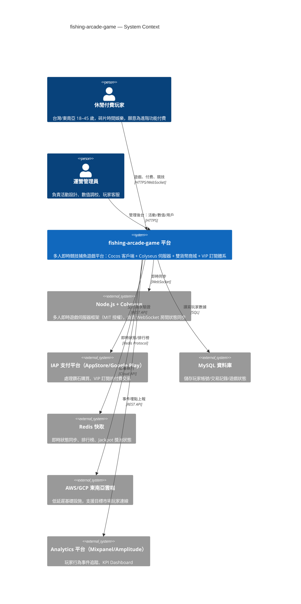
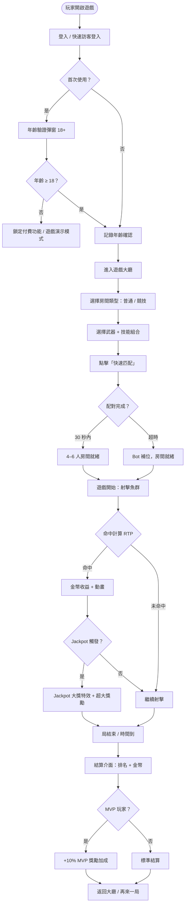
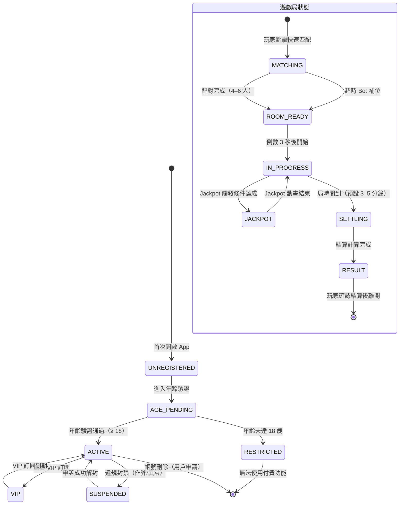

# PRD — Product Requirements Document
<!-- 對應學術標準：IEEE 830 (SRS)，對應業界：Google PRD / Amazon PRFAQ -->

---

## Document Control

| 欄位 | 內容 |
|------|------|
| **DOC-ID** | PRD-FISHGAME-20260424 |
| **產品名稱** | fishing-arcade-game（捕魚街機遊戲平台）|
| **文件版本** | v0.1 |
| **狀態** | DRAFT |
| **作者（PM）** | AI Generated (gendoc-gen-prd) |
| **日期** | 2026-04-24 |
| **上游 BRD** | [BRD.md](BRD.md) §3.1, §4.1, §5.3, §7.1, §7.2, §8.1, §8.2, §9.5, §10, §11, §13 |
| **審閱者** | Engineering Lead, 遊戲策劃 Lead, Art Director |
| **核准者** | Executive Sponsor（投資方/創辦人代表）|

---

## Change Log

| 版本 | 日期 | 作者 | 變更摘要 |
|------|------|------|---------|
| v0.1 | 20260424 | AI Generated (gendoc-gen-prd) | 初始生成 |

---

## 1. Executive Summary

**Elevator Pitch（來自 IDEA.md §1.1）：**

fishing-arcade-game 幫助亞洲市場休閒付費玩家（台灣/東南亞，18–45 歲）解決傳統捕魚遊戲缺乏社交競爭深度與技能策略空間、玩家快速流失的問題，方式是打造多人即時競技捕魚平台，結合精密 RTP 控制（85–95%）、Jackpot 大獎池與 VIP 訂閱體系，提供高爽感、高留存、高變現的完整街機遊戲體驗。

**產品定位：** 本產品在亞洲已驗證的捕魚遊戲品類基礎上，以「真實多人競爭搶魚機制」為核心差異化：4–6 人同場真實爭搶有限魚群資源，搭配多元武器系統（基礎砲/雷射/散射/鎖定）× 技能組合（冰凍/炸彈/自動鎖定），打造有別於市場主流「純爆金倍率刺激」的深度競技體驗。

**核心問題：** 現有捕魚遊戲 30 日留存率通常低於 25%，根本原因是多人同屏僅為視覺裝飾、技能策略空間淺薄，玩家重複相同操作後快速流失。

**解決方案：** 三個核心升維點——（1）真實多人競爭機制；（2）技能策略深度；（3）精細化 RTP + Jackpot + 雙貨幣經濟數值體系——形成差異化競爭壁壘，支撐 DAU 10,000、付費率 5%、月營收 USD 10,000 的商業目標。

**技術路線：** Cocos Creator（客戶端，Lua 腳本）+ Node.js/Colyseus（即時伺服器）+ MySQL/Redis（資料庫），6 個月分 3 階段交付。

---

## 2. Problem Statement

### 2.1 現狀痛點

一個 28 歲台灣上班族玩家，每天午休 20 分鐘打開手機捕魚遊戲。他進入房間，看到畫面上有 4 個人，但其實大家各打各的——魚群不爭搶、金幣不相互影響、連鄰座的砲火都只是背景。他調高砲台倍率，連按射擊，等待爆金動畫觸發。3 天後，他刪掉這個遊戲，換了另一個——因為「玩起來都一樣」。

**現有工作流與問題行為（來自 BRD §2.1）：**

- 玩家使用單一砲台連續射擊固定路徑魚群，核心刺激來自「爆金倍率數值飆升」
- 雖有 4–6 人同屏，但玩家間缺乏真實競爭：資源不爭搶、無搶魚機制、無 MVP 獎勵
- 技能策略空間淺薄：大多遊戲只有倍率調整，缺乏差異化武器或技能組合
- 玩家行為趨同：長期重複相同操作，新鮮感快速消耗，**30 日留存率通常低於 25%**
- 現有玩家 Workaround：頻繁更換遊戲平台尋找新鮮感（被動留存，非主動黏性）

### 2.2 根本原因分析

**5 Whys（來自 BRD §2.2）：**

```
問題現象：捕魚遊戲玩家留存率低，30 日流失超過 75%
  Why 1：遊戲單調，玩家重複操作缺乏新鮮感
    Why 2：遊戲系統深度不足，無真正的技能策略或社交競爭
      Why 3：多人同屏設計只是視覺呈現，缺乏真實競技機制（搶資源/MVP/排名）
        Why 4：現有產品以「爆金數值刺激」為核心，社交與技能設計被刻意省略
          Why 5（根本原因）：市場開發商優先追求短期變現最大化，未投資社交競爭深度
                            與技能策略系統，導致同質化競爭加速用戶流失
```

### 2.3 機會假設

- 假設 1：若建立「真實多人競爭搶魚機制」，則競技房間場均時長將比非競技房間高出 ≥ 20%，次日留存率將提升至 ≥ 35%
- 假設 2：若精細化 RTP 控制（85–95%）+ Jackpot 大獎池設計維持玩家爽感，則 7 日留存率將達到 ≥ 25%，超越現有競品
- 假設 3：若提供鑽石付費貨幣 + 高倍率砲台 + VIP 訂閱等付費點，則上線後 3 個月付費率將達到 5%，ARPU USD 20/月

### 2.4 System Context Diagram



---

## 3. Stakeholders & Users

### 3.1 Stakeholder Map

| 角色 | 關係 | 主要關切 | 溝通頻率 |
|------|------|---------|---------|
| Executive Sponsor（投資方/創辦人代表）| 出資 / 核准 | ROI 時程（20 個月回本）、市場進入成功率 | 月 |
| 遊戲策劃 Lead（PM 兼任）| 需求定義 + 數值設計 | 功能範圍、RTP 數值精度、留存驗證 | 每日 |
| Engineering Lead | 技術實作 | 技術可行性、Colyseus 並發上限、開發周期 | 每日 |
| Art Director | 體驗設計 + 美術 | 視覺風格一致性、UI/UX 爽感設計 | 每週 |
| Legal / Compliance（外聘）| 法規合規 | 台灣/東南亞博彩法規、Jackpot 合規 | 里程碑節點 |
| 運營 Lead | 活動運營 | 每週活動設計、玩家社群維護 | 每週 |
| 投資方 | 出資決策 | KPI 達成率、月營收、DAU 增長 | 月 |
| 玩家（End User）| 使用者 | 爽感、競爭感、付費回報感 | — |

### 3.2 User Personas

#### Persona A：「競技阿明」— 核心競技玩家

| 欄位 | 內容 |
|------|------|
| **背景** | 27 歲，台灣台北上班族，軟體業工程師，每天通勤 40 分鐘 + 午休 20 分鐘的碎片時間重度使用者 |
| **目標** | 在碎片時間快速進入競技局獲得爽感，透過技巧與策略搶先捕獲 Boss 魚，在排行榜展現實力，累積 VIP 等級彰顯地位 |
| **痛點** | 現有捕魚遊戲多人同屏「假競爭」——看起來有 4 個人但根本不互相影響，玩久了毫無新鮮感；技能只有倍率調整，毫無策略深度 |
| **技術熟悉度** | 高（手機遊戲重度用戶，熟悉 IAP 付費流程） |
| **使用頻率** | 每日 3–4 局（通勤 + 午休），週末可達 8–10 局 |
| **付費習慣** | 每月 USD 15–30，偏好「能看到立即回報」的付費（高倍率砲台、技能道具），訂閱制需看到明顯 VIP 特權才願意 |
| **成功樣貌** | 進入遊戲 < 30 秒、每局能感受到「搶到了！」的競爭勝利感、月均 ARPU USD 20 是他願意花的上限 |

**典型使用場景：** 午休 12:00，阿明打開 App，選擇「競技房間」，3 秒配對到 5 名對手。他選擇雷射砲台 + 冰凍技能，瞄準 Boss 魚前先放冰凍控場。另一名玩家也在搶——他加快射擊節奏，先一步擊殺 Boss 魚，畫面跳出「MVP！」獎勵動畫，金幣噴出。12:15 他存檔退出，下午繼續工作，心情好了。

---

#### Persona B：「VIP 老闆」— 高付費核心玩家

| 欄位 | 內容 |
|------|------|
| **背景** | 38 歲，東南亞（泰國曼谷）個體商人，休閒娛樂預算充裕，習慣在晚間 1–2 小時玩遊戲放鬆，有明顯的地位彰顯需求 |
| **目標** | 透過遊戲獲得放鬆與地位感，成為 VIP 頂級玩家，擁有限定皮膚和高倍率砲台，在遊戲中被其他玩家「看見」 |
| **痛點** | 現有捕魚遊戲即使充值大量金幣也感覺不到「VIP 感」——外觀和普通玩家一樣，沒有特別展示地位的系統；Jackpot 觸發太少，大額付費感覺沒有回報感 |
| **技術熟悉度** | 中（習慣手機購物/付費，對 IAP 流程熟悉，不會深究技術） |
| **使用頻率** | 每日晚間 1–2 小時，週末更長 |
| **付費習慣** | 每月 USD 50–100，偏好大額禮包（性價比感知）和 VIP 訂閱月費，Jackpot 觸發率敏感 |
| **成功樣貌** | VIP 光環在房間中顯眼可見、Jackpot 觸發時有大量視覺特效（存在感爆棚）、每月消費有「贏回來了」的感覺 |

**典型使用場景：** 晚上 10:00，老闆打開遊戲，選擇 VIP 專屬豪華房間。他的 VIP5 金色砲台光環在房間裡顯眼。他購買了 100 鑽石的限時禮包，拿到高倍率砲台強化。全屏炸彈技能觸發，畫面特效爆炸，獲得本局最高金幣。Jackpot 大獎池進度條跳動，他繼續射擊——今晚感覺是觸發 Jackpot 的好日子。

---

---

#### Persona C：「新手小花」— 新手免費玩家

| 欄位 | 內容 |
|------|------|
| **背景** | 22 歲，越南河內大學生，透過 Facebook 廣告或朋友推薦首次下載捕魚遊戲，每天零碎時間 10–15 分鐘，消費能力有限，傾向免費體驗 |
| **目標** | 探索遊戲玩法，享受免費捕魚的爽感，在不付費的前提下盡可能玩得有趣；若真正喜歡，可能轉化為輕付費用戶 |
| **痛點（≥ 2）** | ① 剛進遊戲不清楚武器和技能怎麼用，缺乏新手引導導致快速流失；② 金幣消耗速度比獲得速度快，很快「破產」卻不理解原因（RTP 機制不透明）|
| **技術熟悉度** | 低（對 IAP 流程不熟悉，習慣免費 App，對「付費道具」存有疑慮）|
| **使用頻率** | 每日 1–2 局，主要在通勤或午休碎片時間 |
| **付費習慣** | 基本不付費；若有低門檻首充優惠（如 USD 0.99 → 100 鑽石），有小概率嘗試 |
| **成功樣貌** | 新手引導完成後能獨立操作，第一局能捕到魚並看到金幣收益動畫，感受到「會玩了」的掌控感 |

**典型使用場景：** 下午 3:00，小花看到 Facebook 廣告中魚被炸飛的特效感到好奇，下載遊戲。進入後看到新手教學，點擊砲台打到第一條魚，金幣噴出動畫讓她興奮。系統提示「再打 3 條魚可以獲得新手禮包」，她繼續遊玩。5 分鐘後她因金幣快用完看到「充值鑽石」的引導，猶豫了一下，選擇先繼續免費玩。

> **Persona A ARPU 上限說明：** Persona A（競技阿明）的 ARPU 上限為 USD 20/月，Persona B（VIP 老闆）為 USD 50–100/月，兩者共同構成月營收 ≥ USD 10,000 目標的付費基礎——並非矛盾，而是不同付費層次的疊加。Persona C（新手小花）主要貢獻 DAU 規模（達成 DAU 10,000 目標），並作為付費漏斗的頂部流量，部分轉化為 Persona A。

---

### 3.3 Non-Target Users（明確排除，來自 BRD §4.3）

- ❌ **未成年用戶（18 歲以下）**：法規合規要求，付費類娛樂遊戲需年齡驗證
- ❌ **重度 MMORPG / 策略遊戲玩家**：本產品屬休閒街機品類，無深度養成
- ❌ **歐美市場為主要目標的用戶**：初期聚焦亞洲市場，歐美未驗證
- ❌ **嚴格競技電競玩家**：本產品主打「爽感 + 競爭感」平衡，非絕對公平對稱競技

---

## 4. Scope

### 4.1 In Scope（P0，Must Have — MVP 必交付）

- [ ] **4–6 人即時多人競技房間**：Colyseus WebSocket 房間管理，搶魚機制 + MVP 排名獎勵
- [ ] **魚群系統**：普通魚（低倍率）/ 精英魚（中倍率）/ Boss 魚（高倍率 + 特殊技能）
- [ ] **武器系統**：基礎砲台 / 雷射炮 / 散射炮 / 鎖定炮（含倍率調整）
- [ ] **技能系統**：冰凍（控場）/ 全屏炸彈 / 自動鎖定
- [ ] **RTP 控制系統**：回報率 85–95%，命中率動態調整引擎
- [ ] **Jackpot 大獎池**：累積式大獎池，觸發率符合數值設計目標
- [ ] **雙貨幣系統**：金幣（遊戲內）+ 鑽石（付費）
- [ ] **基礎商城**：鑽石充值包（小/中/大額）/ 道具購買 / 禮包 / 抽獎
- [ ] **年齡驗證機制**：18+ 強制確認，合規要求
- [ ] **玩家帳號系統**：註冊 / 登入 / 個人資料

### 4.2 In Scope（P1，Should Have — Phase 2）

- [ ] **VIP 訂閱系統**：月費 USD 9.99，VIP 等級 1–10，每日鑽石補貼 + 加成
- [ ] **砲台 / 技能升級成長系統**：成長線 + 升級消耗設計
- [ ] **任務系統**：日常任務 / 週常任務，引導留存
- [ ] **每週活動 / 節日活動框架**：活動運營基礎設施（限時 Boss / 節慶禮包）
- [ ] **管理後台**：數值調校工具 / 活動管理 / 玩家數據 Dashboard

### 4.3 In Scope（P2，Could Have — 未來版本視容量決定）

- [ ] **換裝皮膚系統**（FChangeSkinUI 模組參考）：留存與付費加強道具
- [ ] **好友系統 + 私人房間**：社交功能增強留存
- [ ] **排行榜系統**：週榜 / 月榜，競爭感強化

> **BRD → PRD 優先級降級說明（BRD Should Have → PRD Phase 2）：**
> BRD §5.3 將「砲台/技能升級成長系統」、「任務系統（日常/週常）」、「每週活動/節日活動框架」列為 Should Have。基於以下考量，本 PRD 將上述三項調整至 P1（Phase 2，上線後 6 個月內迭代）：
> 1. **6 個月交付周期限制**：核心多人競技玩法驗證為首要里程碑，成長系統與任務設計需在核心 RTP/Jackpot 數值穩定後方能設計（設計依賴關係）。
> 2. **USD 200,000 預算限制**：P0 功能（房間/魚群/武器/RTP/商城/年齡驗證/帳號）已占據 12 人 × 6 個月開發資源的主要份額，無充裕容量在 MVP 版本同時交付成長系統與活動框架。
> 3. **假設驗證優先**：核心競技機制（A1 假設）需先驗證，才能為任務設計和活動策略提供數據依據；若 A1 假設不成立，成長系統設計方向將根本性改變。
>
> Phase 2 啟動條件：MVP 上線後，次日留存率達到 ≥ 35%、付費率 ≥ 2%，確認核心玩法假設成立後，正式排入 P1 開發計畫。

### 4.4 Out of Scope（明確排除，來自 BRD §5.3）

- ❌ **寵物技能系統 FPetSkillHelp**（原因：開發複雜度高，核心假設驗證前不做，列 P2 延後）
- ❌ **跨平台 App Store / Google Play 上架**（原因：初期以 H5 / 網頁端優先驗證，移動端分發列 v2.0）
- ❌ **歐美市場本地化**（原因：初期聚焦亞洲市場，歐美市場無驗證，不投入資源）
- ❌ **公會 / 工會社群功能**（原因：v2.0 候選，MVP 聚焦核心玩法）

### 4.5 Future Scope（v2.0 候選，非承諾）

- 好友系統 + 私人房間 + 邀請碼
- 換裝皮膚系統與限定皮膚活動
- 寵物技能輔助系統
- 公會 / 工會社群功能
- 移動端（iOS / Android）原生 App 上架

### 4.6 MoSCoW 對照表

| 功能 / 能力 | MoSCoW | 對應 BRD 目標 | 業務理由 |
|------------|:------:|-------------|---------|
| 4–6 人即時多人競技房間 | **Must** | O1, O4 | 核心差異化，無此無法與競品區分 |
| 魚群系統（普通/精英/Boss）| **Must** | O1, O4 | 遊戲基礎內容，缺此無法遊玩 |
| 武器系統（4 種砲台）| **Must** | O1, O4 | 技能策略差異化的基礎 |
| 技能系統（3 種技能）| **Must** | O1, O4 | 配合武器構成策略深度 |
| RTP 控制系統 + Jackpot | **Must** | O2, O3 | 數值體系核心，影響爽感與留存 |
| 雙貨幣系統 + 基礎商城 | **Must** | O2, O3 | 付費轉化核心，無此無法產生營收 |
| 搶魚機制 + MVP 排名獎勵 | **Must** | O1, O4 | 核心競爭差異化機制 |
| VIP 訂閱系統 | **Should** | O2, O3 | 重要收入來源，需先驗證基礎付費意願 |
| 砲台 / 技能升級成長系統 | **Should** | O4 | 長期留存核心 |
| 任務系統 | **Should** | O4 | 引導留存的重要機制 |
| 每週 / 節日 / 限時 Boss 活動 | **Should** | O1, O4 | 活動運營驅動返回率 |
| 換裝皮膚系統 | **Could** | O4 | 留存與付費加強道具 |
| 好友系統 + 私人房間 | **Could** | O1 | 社交功能增強留存 |
| 寵物技能系統 | **Won't**（本版）| — | 開發複雜度高，核心假設驗證前不做 |
| 歐美市場本地化 | **Won't**（本版）| — | 初期聚焦亞洲市場 |

---

## 5. User Stories & Acceptance Criteria

### 5.0 玩家帳號系統（P0）

**REQ-ID：** US-ACCT-001（對應 BRD §5.3 Must Have：玩家帳號系統，BRD O1, O2, O3）

**優先度：** P0（Must Have）｜**T-Shirt Size：M**

**User Story：**
> 作為 **競技阿明（Persona A）**，
> 我希望能 **用電子郵件快速註冊並登入帳號，安全地保存我的遊戲進度與鑽石餘額**，
> 以便 **在任何裝置上繼續我的遊戲，不因重新安裝而失去付費道具**。

**Acceptance Criteria（可測試、無歧義）：**

| REQ-ID / AC# | Given（前提）| When（行動）| Then（結果）| 測試類型 |
|--------------|-------------|------------|------------|---------|
| US-ACCT-001 / AC-1（Happy Path：註冊成功）| 用戶尚未有帳號，輸入有效 email（符合 RFC 5322）及符合強度規則的密碼 | 點擊「註冊」按鈕 | 系統在 3 秒內建立帳號，自動登入，跳轉至遊戲大廳；email 以 AES-256-GCM 加密存入 `users` 資料表；用戶 ID 以 UUID v4 格式生成 | E2E |
| US-ACCT-001 / AC-2（Happy Path：登入成功）| 用戶已有帳號，輸入正確 email 和密碼 | 點擊「登入」按鈕 | 系統在 2 秒內驗證憑證，簽發 JWT Access Token（15 分鐘有效）+ Refresh Token（7 天有效）；跳轉至遊戲大廳，顯示正確的金幣和鑽石餘額 | E2E |
| US-ACCT-001 / AC-3（Error Path：Email 已存在）| 用戶嘗試以已被使用的 email 註冊 | 提交註冊表單 | 系統回傳 HTTP 409，顯示 Inline 錯誤訊息「此 Email 已被使用，請登入或使用其他 Email」於 email 輸入框下方；不建立重複帳號；錯誤訊息不洩露現有帳號的任何其他資訊 | Unit + Integration |
| US-ACCT-001 / AC-4（Error Path：登入失敗鎖定）| 用戶連續輸入錯誤密碼 | 第 5 次輸入錯誤密碼後點擊「登入」| 帳號進入 15 分鐘鎖定期；顯示「登入嘗試次數過多，帳號已暫時鎖定，請 15 分鐘後重試」；鎖定期間所有登入嘗試均被拒絕（不重置失敗計數）；鎖定事件記錄至後台安全日誌（包含 IP、時間戳） | Unit + Integration |
| US-ACCT-001 / AC-5（Boundary Case：密碼強度規則）| 用戶在註冊時輸入密碼 | 輸入密碼並離開欄位（onBlur）| 密碼不符合強度規則時，即時顯示 Inline 提示（不等待提交）：「密碼需至少 8 個字元，且包含大寫字母、小寫字母和數字」；符合規則後提示消失；密碼以 bcrypt（cost factor ≥ 12）雜湊後儲存，不以明文記錄 | Unit |

**邊界條件：**
- 密碼強度規則：≥ 8 字元，且包含至少 1 個大寫字母（A–Z）、1 個小寫字母（a–z）、1 個數字（0–9）
- 登入失敗鎖定：連續失敗 ≤ 5 次前顯示剩餘嘗試次數（「還有 N 次機會」）；第 5 次失敗後鎖定 15 分鐘
- Email 唯一性：`users.email` 欄位設置唯一索引（應用層 + 資料庫層雙重保障）
- 遊客模式：首次開啟可以「遊客模式」進入（僅限免費功能），遊客模式不允許購買鑽石或 VIP

---

### 5.1 多人競技房間（P0）

**REQ-ID：** US-ROOM-001（對應 BRD §5.3 Must Have：4–6 人即時多人競技房間，BRD O1, O4）

**優先度：** P0（Must Have）｜**T-Shirt Size：L**（WebSocket 房間管理 + Bot 補位 + 結算邏輯複雜度高）

**User Story：**
> 作為 **競技阿明（Persona A）**，
> 我希望能 **在 30 秒內進入一個有 4–6 名真實玩家的競技房間，與他們爭搶同一批魚群資源**，
> 以便 **感受到真實的競爭爽感，而不是看著其他玩家各打各的假同屏**。

**Acceptance Criteria（可測試、無歧義）：**

| REQ-ID / AC# | Given（前提）| When（行動）| Then（結果）| 測試類型 |
|--------------|-------------|------------|------------|---------|
| US-ROOM-001 / AC-1 | 玩家已登入帳號並有足夠金幣 | 點擊「快速匹配」按鈕 | 系統在 30 秒內完成配對，進入 4–6 人同場競技房間，房間 WebSocket 連線建立成功，延遲 P99 < 200ms | E2E |
| US-ROOM-001 / AC-2 | 房間內有 4–6 名玩家 | 玩家 A 成功捕捉一條魚 | 該魚從房間魚群中消失，其他玩家無法再打同一條魚；房間狀態同步延遲 < 100ms | Integration |
| US-ROOM-001 / AC-3 | 房間配對等待超過 30 秒（玩家不足）| 系統嘗試自動匹配 | 系統以 AI 補位（2–3 個 Bot）填滿房間，確保遊戲可以繼續，並向玩家顯示「Bot 補位」提示 | E2E |
| US-ROOM-001 / AC-4 | 玩家中途斷線 | WebSocket 連線中斷 | 系統在 5 秒內嘗試重連；重連失敗後該玩家座位由 Bot 接替，房間繼續正常運行 | Integration |
| US-ROOM-001 / AC-5 | 一局結束（時間到）| 結算觸發 | 顯示每位玩家金幣排名，MVP 玩家（最高得分）獲得 MVP 獎勵加成（+10% 金幣），結算介面在 3 秒內顯示 | E2E |
| US-ROOM-001 / AC-6 | 玩家點擊「快速匹配」時，Colyseus 房間服務回傳 503 / 連線逾時 | 房間創建失敗 | 系統顯示「目前遊戲伺服器忙碌，請稍後重試」錯誤訊息，提供「重試」按鈕；不建立空房間；玩家金幣不扣除 | Integration |
| US-ROOM-001 / AC-7 | 玩家金幣餘額低於該房間進入門檻 | 嘗試進入高倍率付費房間 | 顯示「金幣不足，需要 XXX 金幣才能進入此房間，目前餘額 YYY 金幣」提示；不允許進入房間；引導至充值 / 低倍率免費房間 | Unit |

**邊界條件：**
- 最大玩家數：6 人；若超過 6 人請求加入同一房間，後加入者進入等待隊列
- 最小玩家數：1 人（Bot 補位至 4 人）；不允許空房間佔用伺服器資源
- 並發：1,000 人同時在線 → Colyseus 伺服器需支撐 ≥ 167 個活躍房間（1,000 / 6）
- 超時：結算 API > 5,000ms → 顯示「結算中，請稍候」提示，不阻塞玩家退出

---

### 5.2 魚群系統（P0）

**REQ-ID：** US-FISH-001（對應 BRD §5.3 Must Have：魚群系統，BRD O1, O4）

**優先度：** P0（Must Have）｜**T-Shirt Size：L**（魚群生成引擎 + RTP 原子操作 + 多人同步並發邏輯）

**User Story：**
> 作為 **競技阿明（Persona A）**，
> 我希望能 **在房間中看到多種不同倍率與行為的魚類，包括高倍率 Boss 魚**，
> 以便 **根據魚類價值策略性分配射擊資源，產生有意義的決策感**。

**Acceptance Criteria：**

| REQ-ID / AC# | Given（前提）| When（行動）| Then（結果）| 測試類型 |
|--------------|-------------|------------|------------|---------|
| US-FISH-001 / AC-1 | 玩家進入競技房間 | 系統初始化魚群 | 畫面顯示至少 3 種魚類：普通魚（倍率 1–5x）/ 精英魚（倍率 6–20x）/ Boss 魚（倍率 50–200x），魚群數量符合設計規格（每批次 ≥ 20 條） | Integration |
| US-FISH-001 / AC-2 | 玩家射擊一條普通魚 | 炮彈命中魚 | 命中率根據 RTP 動態調整引擎計算（目標 RTP 85–95%）；命中後魚消失，金幣動畫顯示收益倍率，3 秒內更新玩家金幣餘額 | Unit + E2E |
| US-FISH-001 / AC-3 | Boss 魚出現（每局至少 1 次）| 多名玩家同時射擊同一 Boss 魚 | 各玩家的炮彈消耗各自計算，Boss 魚有獨立血量；擊殺者獲得全額 Boss 倍率獎勵，其他玩家獲得參與獎勵（0%）；Boss 消失後同步至所有房間玩家。**設計說明：Boss 魚採用贏者通吃機制（Winner-Takes-All），非擊殺玩家獲得 0% 獎勵，目的是強化競爭爽感與稀缺性，製造高價值目標的搶奪張力。邊界條件補充：若 Boss 魚逃跑（滿足逃跑條件），則參與射擊的所有玩家各獲 Boss 魚面值 × 5% 的安慰獎勵。Phase 2 考慮：可在數值迭代中評估「傷害比例獎勵」機制以改善新手參與感。** | Integration |
| US-FISH-001 / AC-4 | Boss 魚血量降至 0 | 擊殺觸發 | 擊殺動畫播放（2 秒內），擊殺者顯示「Boss 擊殺！」浮字，金幣收益即時更新 | E2E |
| US-FISH-001 / AC-5 | 魚群生成服務（波次排程）發生異常（服務崩潰或回應逾時 > 3s）| 魚群無法正常刷新 | 系統降級為預設靜態魚群波次（3 種固定魚群路徑輪播），遊戲繼續正常運行，不崩潰；後台觸發告警通知 Engineering On-Call | Integration |
| US-FISH-001 / AC-6 | 6 名玩家在同一毫秒內同時射擊同一條魚（最高並發命中情境）| 多人同時命中觸發 | 伺服器使用 Redis 原子操作（SETNX / Lua 腳本）確保僅第一名命中者計算擊殺收益；其他 5 名玩家消耗砲彈但無金幣收益；所有玩家客戶端在 200ms 內收到統一結果通知，無重複計算 | Integration |

**邊界條件：**
- 空值：若魚群全部被捕捉，系統在 2 秒內生成下一批新魚群，不允許空場景
- 最大倍率：Boss 魚最高 200x；Jackpot 觸發可達 999x（需數值策劃確認）
- 並發：6 名玩家同時射擊同一魚 → 僅最先命中者計算擊殺；需原子操作防止重複計算

---

### 5.3 武器與技能系統（P0）

**REQ-ID：** US-WPSK-001（對應 BRD §5.3 Must Have：武器系統 + 技能系統，BRD O1, O4）

**優先度：** P0（Must Have）｜**T-Shirt Size：M**（武器/技能選擇 UI + 伺服器端效果同步；冷卻計時邏輯中等複雜）

**User Story：**
> 作為 **競技阿明（Persona A）**，
> 我希望能 **在開局時選擇不同武器和技能組合，形成差異化遊玩風格**，
> 以便 **每局遊戲都有策略思考空間，而不是重複相同操作**。

**Acceptance Criteria：**

| REQ-ID / AC# | Given（前提）| When（行動）| Then（結果）| 測試類型 |
|--------------|-------------|------------|------------|---------|
| US-WPSK-001 / AC-1 | 玩家進入房間前的砲台選擇介面 | 選擇「雷射炮」武器 | 進入房間後，玩家砲台顯示雷射炮外觀，炮彈命中範圍為直線穿透（與散射炮的範圍攻擊不同），數值計算符合雷射炮設計規格 | E2E |
| US-WPSK-001 / AC-2 | 玩家在房間中有足夠技能能量（冷卻時間結束）| 點擊「冰凍技能」按鈕 | 當前屏幕所有魚類停止移動 3 秒，冰凍動畫播放；技能冷卻計時器開始倒數（設計值：30 秒）；同一房間其他玩家可見冰凍效果（狀態同步） | E2E |
| US-WPSK-001 / AC-3 | 技能冷卻中 | 玩家嘗試再次點擊技能 | 技能按鈕置灰（不可點擊），顯示剩餘冷卻時間（秒），點擊無效且無錯誤聲音 | Unit |
| US-WPSK-001 / AC-4 | 玩家尚未解鎖高級砲台 | 嘗試選擇「鎖定炮」| 顯示「需達到砲台等級 5 才可解鎖」提示，引導玩家升級路徑；不允許使用未解鎖武器 | Unit |

**邊界條件：**
- 武器數量：4 種（基礎砲台 / 雷射炮 / 散射炮 / 鎖定炮），不允許同時裝備超過 1 種主武器
- 技能數量：3 種，冷卻時間設計（冰凍 30s / 全屏炸彈 60s / 自動鎖定 45s，需數值策劃確認）
- 並發：若 6 名玩家同時使用全屏炸彈，伺服器需在 200ms 內同步所有客戶端狀態

---

### 5.4 RTP 控制與 Jackpot 系統（P0）

**REQ-ID：** US-RTP-001（對應 BRD §5.3 Must Have：RTP 控制系統 + Jackpot，BRD O2, O3）

**優先度：** P0（Must Have）｜**T-Shirt Size：XL**（RTP 動態引擎為核心數值系統，需大量模擬驗證；Jackpot 觸發機制涉及伺服器端安全計算，拆分為子任務建議：RTP 引擎 = L，Jackpot 機制 = M）

**User Story：**
> 作為 **VIP 老闆（Persona B）**，
> 我希望能 **感受到遊戲回報率穩定可靠，且有機會觸發震撼的 Jackpot 大獎**，
> 以便 **維持長期遊玩意願並驅動付費行為**。

**Acceptance Criteria：**

| REQ-ID / AC# | Given（前提）| When（行動）| Then（結果）| 測試類型 |
|--------------|-------------|------------|------------|---------|
| US-RTP-001 / AC-1 | 模擬 10,000 場遊戲局（壓力測試）| 執行 RTP 統計 | 統計 RTP 值落在 85–95% 區間，標準差 < 2%（數值策劃設計目標） | Unit（數值模擬）|
| US-RTP-001 / AC-2 | 玩家連續失敗次數超過設計閾值 | RTP 補償機制觸發 | 系統動態提高命中率，確保玩家不會連續 20 局無收益，補償邏輯不洩露給玩家客戶端（伺服器端計算） | Integration |
| US-RTP-001 / AC-3 | Jackpot 大獎池觸發條件達成（觸發率由數值策劃設定）| Jackpot 觸發 | 大獎金幣數字跳動動畫播放（≥ 3 秒），全屏特效爆發，觸發玩家獲得 Jackpot 累積獎池金額；Jackpot 獎池在觸發後重置為起始值 | E2E |
| US-RTP-001 / AC-4 | Jackpot 觸發事件發生 | 事件記錄 | 後台 Jackpot 觸發日誌在 1 秒內記錄：觸發時間 / 玩家 ID / 房間 ID / 獎池金額；用於合規審計 | Integration |
| US-RTP-001 / AC-5 | 伺服器 RTP 計算服務異常（服務無回應或 Health Check 失敗持續 3 次）| 玩家正常射擊 | 系統自動降級為固定命中率模式（80%），所有房間繼續正常遊玩，不中斷；後台觸發 P1 告警通知 On-Call + 數值策劃；降級模式下，固定命中率 80% 作為 P99 目標的保底值，不保證 RTP 區間精度，告警解除後自動恢復動態 RTP | Integration |

**邊界條件：**
- RTP 計算必須在伺服器端進行（客戶端不得持有 RTP 算法，防止作弊）
- Jackpot 獎池最大累積金額由數值策劃設定上限，超過上限強制觸發
- 若伺服器 RTP 計算服務異常 → 降級為固定命中率（80%），並告警觸發

---

### 5.5 雙貨幣系統與商城（P0）

**REQ-ID：** US-SHOP-001（對應 BRD §5.3 Must Have：雙貨幣系統 + 基礎商城，BRD O2, O3）

**優先度：** P0（Must Have）｜**T-Shirt Size：L**（IAP 整合 + 幂等設計 + 退款處理 + 雙貨幣原子事務）

**User Story：**
> 作為 **VIP 老闆（Persona B）**，
> 我希望能 **在 3 步驟內完成鑽石充值包的購買並兌換成遊戲內高倍率砲台或禮包**（3 步驟：選包 → 確認 → 支付），
> 以便 **在遊戲中獲得更強的競爭優勢並感受到付費回報感**。

**Acceptance Criteria：**

| REQ-ID / AC# | Given（前提）| When（行動）| Then（結果）| 測試類型 |
|--------------|-------------|------------|------------|---------|
| US-SHOP-001 / AC-1 | 玩家點擊「充值鑽石」按鈕 | 選擇充值套餐（USD 4.99 = 50 鑽石）並確認付款 | 呼叫 IAP 平台（AppStore/Google Play）支付流程；支付成功後 5 秒內鑽石餘額更新；支付失敗顯示具體錯誤訊息（非「未知錯誤」）| E2E |
| US-SHOP-001 / AC-2 | 玩家鑽石餘額不足 | 嘗試購買需要 100 鑽石的道具 | 顯示「鑽石不足，需 100 鑽石，目前餘額 XX 鑽石」提示，提供「立即充值」按鈕引導；購買失敗，金幣和鑽石餘額不變 | Unit |
| US-SHOP-001 / AC-3 | 支付過程中網路中斷 | 支付請求發出後 30 秒無回應 | 顯示「網路連線不穩，請稍後重試」；鑽石不重複發放（幂等設計，以訂單 ID 去重）；玩家可在訂單記錄中查詢狀態。**幂等 ID 生成時機補充：伺服器在接收首次購買請求時立即生成 order_id（UUID v4）並返回給客戶端；客戶端在重試時攜帶相同 order_id；伺服器以 order_id 去重，若 order_id 狀態為 PENDING/COMPLETED 則直接返回現有結果，不重複扣款。邊界條件：若客戶端未收到首次回應即重試（order_id 尚未建立），伺服器應能識別並正確創建訂單（需要幂等鍵預先在客戶端生成，詳見 EDD §IAP 模組）。EDD 決策：訂單 ID 的生成端（客戶端 vs 伺服器）由 EDD 決定；此 AC 定義預期行為，不論生成端為何，必須保證同一購買動作只被執行一次。** | Integration |
| US-SHOP-001 / AC-4 | 玩家使用金幣調整砲台倍率 | 選擇 10x 倍率砲台 | 每次射擊消耗 10 枚金幣（倍率 × 基礎消耗），金幣餘額即時扣減並顯示；金幣餘額降為 0 時，砲台自動降回 1x 基礎倍率 | Unit |
| US-SHOP-001 / AC-5 | AppStore / Google Play IAP 服務完全不可用（IAP 平台下線或 API 連線失敗）| 玩家嘗試發起鑽石充值 | 系統偵測 IAP 不可用後，顯示「目前充值服務暫時無法使用，請稍後再試」提示；不顯示付款介面，避免玩家輸入付款資訊後失敗；降級啟用備援支付通道（若已設定 Stripe 等備援）或禁止充值（記錄事件供後續補償）；後台觸發 PaymentFailureSpike 告警 | Integration |
| US-SHOP-001 / AC-6 | 玩家成功充值鑽石後，透過 IAP 平台申請退款成功（平台回調退款通知）| 退款確認回調收到 | 系統在 5 秒內扣除對應鑽石數量（若餘額充足）；若鑽石已消費（餘額不足），記錄負債狀態並標記帳號待人工審查；顯示「退款已處理」通知，VIP 訂閱因退款降級則即時生效；退款事件寫入 iap_orders（payment_status = REFUNDED）| Integration |

**邊界條件：**
- 金幣不可兌換為鑽石（單向兌換：鑽石 → 金幣）；金幣/鑽石均不可兌換現金（合規要求）
- 鑽石餘額上限：9,999,999（防止整數溢出）
- 付費訂單需在 MySQL 中以 ACID 事務保存，防止雙重付費

---

### 5.6 年齡驗證與合規（P0）

**REQ-ID：** US-AGE-001（對應 BRD §8.1 合規要求：18 歲以上年齡限制）

**優先度：** P0（Must Have，合規強制）｜**T-Shirt Size：S**（前端彈窗 + DB 記錄；無複雜業務邏輯）

> **角色說明（Stakeholder，非 End-User Persona）：** 「平台合規負責人」並非最終使用者，而是代表 §3.1 Stakeholder Map 中「Legal / Compliance（外聘）」的需求視角——此功能的目的是滿足法規義務，而非直接服務玩家的使用情境。工程師實作時，主要 Trigger 點是「新用戶首次進入付費功能前」，執行者是系統，受益者是平台合規安全。

**User Story：**
> 作為 **平台合規負責人（代表 Legal/Compliance 利害關係人）**，
> 我希望能 **確保所有付費功能僅對 18 歲以上用戶開放**，
> 以便 **符合台灣及東南亞各市場的未成年保護法規，避免法律風險**。

**Acceptance Criteria：**

| REQ-ID / AC# | Given（前提）| When（行動）| Then（結果）| 測試類型 |
|--------------|-------------|------------|------------|---------|
| US-AGE-001 / AC-1 | 新用戶首次開啟遊戲 | 到達帳號設定步驟 | 強制顯示年齡確認彈窗：要求輸入出生年月日；同意「18 歲以上」聲明；拒絕同意 → 無法進入付費功能，遊戲降級為觀看演示模式 | E2E |
| US-AGE-001 / AC-2 | 用戶輸入出生年份 < 18 歲前 | 嘗試確認年齡 | 系統拒絕，顯示「本遊戲僅限 18 歲以上玩家使用」，付費功能鎖定；此用戶標記為「未成年驗證失敗」，記錄至後台 | Unit |
| US-AGE-001 / AC-3 | 合法成年用戶（≥ 18 歲）| 完成年齡確認 | 年齡確認記錄存入資料庫（user_id / confirm_date / declared_birthdate / ip_address），付費功能正常啟用 | Integration |

**邊界條件：**
- 年齡驗證為聲明式（用戶自填），非政府 ID 實名認證（合規下限）；若 Legal 要求更強驗證，此 AC 需更新
- 年齡驗證通過記錄屬 PII，需加密存儲

---

### 5.7 VIP 訂閱系統（P1）

**REQ-ID：** US-VIP-001（對應 BRD §5.3 Should Have：VIP 訂閱，BRD O2, O3）

**優先度：** P1（Should Have）｜**T-Shirt Size：M**（鑽石扣款訂閱流 + 等級管理 + 每日補貼發放；依賴 US-SHOP-001 鑽石購買基礎設施）

**User Story：**
> 作為 **VIP 老闆（Persona B）**，
> 我希望能 **訂閱月費 VIP 方案，獲得每日鑽石補貼和 VIP 等級光環**，
> 以便 **彰顯遊戲中的地位，並獲得持續的回報感維持訂閱動機**。

> **設計決策（align-fix 授權）：** VIP 訂閱付費管道由 IAP 外部訂閱（USD 9.99/月）改為平台內鑽石扣款（30 鑽石/月）。
> 原因：v1 階段鑽石購買已整合 IAP，VIP 以鑽石計費可統一貨幣體系、降低 AppStore/Google Play 訂閱審核複雜度；
> IAP 直接訂閱管道列 P2 Future Scope（對應 EDD §5.5 vip_subscriptions 及 API.md POST /v1/vip/subscriptions 實作）。

**Acceptance Criteria：**

| REQ-ID / AC# | Given（前提）| When（行動）| Then（結果）| 測試類型 |
|--------------|-------------|------------|------------|---------|
| US-VIP-001 / AC-1 | 玩家打開 VIP 訂閱頁面，鑽石餘額 ≥ 30 | 選擇「VIP 月費方案（30 鑽石/月）」並確認訂閱 | 系統扣除 30 鑽石，訂閱成功後 VIP 等級即時顯示（最低 VIP 1），房間內砲台顯示 VIP 光環外觀，當日鑽石補貼 5 顆立即發放；資料庫 vip_subscriptions 寫入 diamonds_deducted=30 | E2E |
| US-VIP-001 / AC-2 | VIP 玩家每日第一次登入 | 進入遊戲大廳 | 自動發放當日 VIP 鑽石補貼（VIP 1：5 顆/天；依等級遞增），發放紀錄存入資料庫，當天不重複發放 | Integration |
| US-VIP-001 / AC-3 | VIP 訂閱到期未續訂 | 訂閱結束後第二天 | VIP 等級自動降為 0，VIP 光環消失，鑽石補貼停止；顯示「VIP 已到期，點此續訂保持特權」 | Integration |

**邊界條件：**
- VIP 等級上限：10 級；升級條件由數值策劃設計（累積付費金額 × 訂閱月數）
- 鑽石不足時訂閱被拒，返回 INSUFFICIENT_DIAMONDS 錯誤（HTTP 402）
- IAP 直接訂閱管道（USD 9.99/月）列 P2 Future Scope，v1 不實作

---

## 6. User Flows

### 6.1 主流程（Happy Path）— 玩家首次進入競技局並收益



### 6.2 錯誤流程 — 付費失敗與房間異常

```mermaid
flowchart TD
    A[玩家嘗試購買鑽石] --> B{IAP 支付請求}
    B -->|支付成功| C[鑽石發放 + 餘額更新]
    B -->|支付失敗：餘額不足| D[顯示「付款方式餘額不足，請確認支付帳號」]
    B -->|支付失敗：網路中斷| E[顯示「網路連線不穩，訂單保留 24 小時，請稍後重試」]
    B -->|支付超時 30s| F[訂單標記 PENDING，鑽石暫不發放，提示「訂單確認中」]
    D --> G[引導至重試 / 更換支付方式]
    E --> G
    F --> H[後台異步確認訂單狀態]
    H -->|確認成功| I[補發鑽石並通知玩家]
    H -->|確認失敗 / 超時 24h| J[自動取消訂單，發送退款申請提示]
    
    subgraph 房間異常流程
        K[玩家在房間中] --> L{WebSocket 連線狀態}
        L -->|正常| M[繼續遊戲]
        L -->|斷線| N[顯示「連線中斷，嘗試重連...」]
        N --> O{5 秒內重連成功？}
        O -->|是| M
        O -->|否| P[伺服器將玩家標記離線，Bot 接替位置]
        P --> Q[玩家返回後顯示「您已離開上一局，損失金幣不補償」]
    end

    subgraph RTP 服務降級流程
        R1[玩家射擊觸發命中計算] --> R2{RTP 服務健康？}
        R2 -->|正常| R3[動態 RTP 引擎計算命中率]
        R2 -->|異常：Health Check 失敗 3 次| R4[自動切換至固定命中率模式 80%]
        R4 --> R5[遊戲繼續正常運行，不中斷]
        R4 --> R6[後台觸發 P1 告警：RTPServiceDegraded]
        R5 --> R7{RTP 服務恢復？}
        R7 -->|是| R3
        R7 -->|持續異常| R5
    end

    subgraph 結算超時流程
        S1[局時間到，結算觸發] --> S2{結算 API 回應時間}
        S2 -->|< 3000ms| S3[正常顯示結算介面]
        S2 -->|3000ms–5000ms| S4[顯示「結算計算中，請稍候...」Loading 介面]
        S2 -->|> 5000ms 或 API 失敗| S5[顯示「結算服務暫時異常，您的金幣已安全保存」]
        S5 --> S6[後台非同步重試結算計算，完成後推播通知玩家]
        S5 --> S7[玩家可自由退出，不被強制等待]
    end

    subgraph 配對網路失敗流程
        M1[玩家點擊快速匹配] --> M2{Colyseus 房間服務連線}
        M2 -->|連線正常| M3[進行配對流程]
        M2 -->|連線失敗：503 / 逾時| M4[顯示「遊戲伺服器連線失敗，請檢查網路後重試」]
        M4 --> M5[提供「重試」按鈕]
        M5 --> M6{重試後連線正常？}
        M6 -->|是| M3
        M6 -->|仍失敗（連續 3 次）| M7[顯示「目前伺服器維護中，請稍後再試」並回到大廳]
    end
```



### 6.3 狀態機 — 玩家帳號狀態 & 遊戲局狀態



---

## 7. Non-Functional Requirements（NFR）

### 7.1 性能（Performance）

| 指標 | 目標值 | 量測方式 | 降級策略 |
|------|--------|---------|---------|
| WebSocket 延遲（遊戲狀態同步）P99 | < 100ms @ 1,000 並發玩家 | APM + Colyseus 指標 | 降低狀態同步頻率（30fps → 10fps），保持基礎遊玩；降級模式（10fps）下 P99 目標放寬至 < 300ms |
| API 回應時間（商城/帳號）P99 | < 500ms @ 500 RPS | APM（Datadog/New Relic）| Circuit Breaker + Cache |
| API 回應時間（商城/帳號）P50 | < 150ms | APM | Cache L1/L2 |
| 頁面初始載入（FCP） | < 2.0s（4G 網路）| Lighthouse / RUM | CDN + 資源壓縮 |
| 頁面最大內容渲染（LCP） | < 3.0s（業務依據見下注）| Lighthouse / RUM | SSR / 預載關鍵資源 |
| 房間狀態同步頻率 | 30 fps（理想）/ 10 fps（降級）| 遊戲客戶端計數器 | 自動降頻 |
| 批次 RTP 計算（模擬）| ≥ 10,000 場/秒 | 壓力測試 | 分批非同步計算 |
| WebSocket 告警觸發閾值 | P99 > 150ms 持續 3 分鐘（告警）；> 200ms 持續 3 分鐘（升級 P1）| §7.7.4 Alert 定義 | 雙層告警門檻，150ms 為早期預警，200ms 為緊急響應 |

*參考值，需 Engineering 確認，基於 BRD §3.1 SMART KPI：DAU 10,000、付費率 5%。*

> **LCP 3.0s 業務依據說明：** 本產品目標市場為台灣/東南亞（泰國/越南/菲律賓），4G 網路品質不均，尤其東南亞農村地區平均 RTT 偏高（150–250ms）。採用 3.0s LCP 目標（較 Google 建議的 2.5s 寬鬆 0.5s）是基於目標市場網路現實的業務判斷，而非技術妥協；若行銷數據顯示主要玩家集中於都市高速網路環境，Engineering 可在 EDD 中收緊至 2.5s。

### 7.2 可用性（Availability）

| 環境 | SLA | RTO（恢復時間）| RPO（資料回復點）|
|------|-----|:----------:|:----------:|
| Production | 99.5%（年停機 < 43.8h）| 30 分鐘 | 5 分鐘 |
| Staging | 95.0% | 4 小時 | 1 小時 |

*99.5% 為參考值（新創遊戲平台行業標準），需 Engineering 在 EDD 中確認架構設計。若 SLA 需提升至 99.9%，架構成本顯著提升，需 PM 與 Engineering Lead 確認預算影響。*

### 7.3 擴展性（Scalability）

- **短期（Launch）**：支援 1,000 人並發，167 個活躍房間，不需重構核心架構
- **中期（Launch + 6M，DAU 10,000）**：峰值並發預估 2,000–3,000 人（日活 10,000 × 峰值係數 0.3），水平擴展 Colyseus 伺服器實例支撐
- **長期（v2.0 樂觀情境，DAU 20,000）**：支援 3x 流量增長至 3,000–6,000 並發，無需重構核心架構（水平擴展 + 資料庫讀寫分離）
- **資料量**：1 年預計 10 萬用戶帳號 + 日均 50 萬場遊戲記錄，MySQL 查詢性能不退化（分表 + 索引優化）

### 7.4 安全性（Security）

- **認證**：JWT（Access Token 15 分鐘 / Refresh Token 7 天）+ HTTPS 強制（TLS 1.3+）
- **授權**：RBAC（玩家 / 管理員 / 超級管理員 三級）
- **資料加密**：傳輸中 TLS 1.3+；靜態 AES-256（PII 欄位）
- **PII 處理**：email / phone / birthdate / ip_address 在 Log 中遮罩，資料庫加密存儲
- **合規要求**：台灣個資法（必須）+ 東南亞各市場法規（由 Legal 確認）；GDPR 若歐盟用戶存取則適用
- **遊戲防作弊**：RTP 計算必須在伺服器端執行，客戶端不得持有命中率算法；異常金幣增長自動告警
- **支付安全**：IAP 收據在伺服器端與 AppStore/Google Play 驗證（不信任客戶端的支付結果）

### 7.5 可用性（Usability）

- **無障礙標準**：WCAG 2.1 Level A（MVP 上線前），Level AA（上線後 3 個月）
- **支援語言**：繁體中文（台灣，主要）、英文（東南亞通用）；泰文 / 越南文（P1 Phase 2）
- **支援裝置**：手機（iOS 14+ / Android 8+）+ 網頁（H5，Chrome 90+ / Safari 14+）
- **網路要求**：最低 4G 網路可流暢遊玩（WebSocket 延遲 < 100ms @ 4G 台灣/東南亞）

### 7.6 可維護性（Maintainability）

- 測試覆蓋率：≥ 80%（unit + integration，核心業務邏輯 100%）
- 程式碼複雜度：Cyclomatic Complexity ≤ 10
- 所有公開 API 有 OpenAPI spec（v3.0+）
- RTP 數值參數可透過後台動態調整，不需程式碼部署
- 部署頻率目標：每 2 週一個版本，CI/CD Pipeline 自動化測試通過後方可部署

### 7.7 可觀測性（Observability）

#### 7.7.1 Logging 規格

| 欄位 | 要求 |
|------|------|
| 格式 | 結構化 JSON（含 timestamp、level、service、trace_id、span_id、message）|
| 等級 | ERROR / WARN / INFO / DEBUG（Production 預設 INFO）|
| 必含欄位 | `request_id`、`user_id`（遮罩後四碼）、`duration_ms`、`http_status`、`room_id`（遊戲事件）|
| 禁止記錄 | 明文密碼、完整鑽石餘額、未遮罩的 email/phone/birthdate |
| 保留期 | Production：90 天；Staging：14 天 |
| 收集工具 | 待 Engineering 確認（Datadog / ELK Stack / CloudWatch，依 AWS/GCP 選型）|

#### 7.7.2 Metrics 必須項目

| 指標名稱 | 類型 | 說明 | 告警觸發條件 |
|---------|------|------|------------|
| `fishgame_active_rooms` | Gauge | 當前活躍遊戲房間數 | < 1（服務異常）|
| `fishgame_websocket_latency_ms` | Histogram | WebSocket 延遲分佈（P50/P95/P99）| P99 > 150ms 持續 3 分鐘（預警）；P99 > 200ms 持續 3 分鐘（緊急）|
| `fishgame_api_request_duration_seconds` | Histogram | API 請求延遲分佈 | P99 > 1s 持續 5 分鐘 |
| `fishgame_api_error_rate` | Gauge | 5xx 錯誤比率 | > 1% 持續 5 分鐘 |
| `fishgame_rtp_actual` | Gauge | 實際 RTP 滾動計算（1 小時窗口）| < 80% 或 > 97%（數值異常）|
| `fishgame_jackpot_trigger_count` | Counter | Jackpot 觸發次數（每日）| 異常高頻觸發（> 設計值 3x）|
| `fishgame_iap_payment_success_rate` | Gauge | IAP 支付成功率 | < 90% 持續 10 分鐘 |
| `fishgame_dau` | Gauge | 日活躍用戶（每日計算）| 較前 7 日均值下跌 > 30% |
| `fishgame_concurrent_players` | Gauge | 即時並發玩家數 | > 容量上限 × 80%（提前告警）|

#### 7.7.3 Distributed Tracing 需求

- 所有跨服務呼叫（遊戲伺服器 → API Server → MySQL/Redis）必須傳遞 `trace_id` / `span_id`（W3C TraceContext 格式）
- 採樣率：Production 10%（錯誤請求 100% 採樣）；Staging 100%
- 工具：待 Engineering 確認（Jaeger / AWS X-Ray，依雲端供應商）
- Trace 保留期：7 天

#### 7.7.4 Alert 閾值定義

| 告警名稱 | 觸發條件 | 嚴重度 | 通知管道 | 處置 SLA |
|---------|---------|--------|---------|---------|
| ServiceDown | Health Check 連續失敗 3 次 | P0 | PagerDuty（電話）| 回應 5 分鐘 |
| HighErrorRate | API error_rate > 1% 持續 5 分鐘 | P1 | PagerDuty + Slack | 回應 15 分鐘 |
| HighLatencyWarn | WebSocket P99 > 150ms 持續 3 分鐘 | P2 | Slack | 回應 30 分鐘（早期預警）|
| HighLatency | WebSocket P99 > 200ms 持續 3 分鐘 | P1 | PagerDuty + Slack | 回應 15 分鐘（緊急升級）|
| RTPAnomaly | 實際 RTP < 80% 或 > 97% | P1 | PagerDuty + 數值策劃 | 回應 15 分鐘 |
| JackpotAnomaly | Jackpot 觸發頻率 > 設計值 3x | P1 | PagerDuty + PM | 回應 15 分鐘 |
| DiskSpaceWarning | 磁碟使用率 > 80% | P3 | Slack | 回應 4 小時 |
| PaymentFailureSpike | IAP 成功率 < 90% 持續 10 分鐘 | P2 | Slack + PM | 回應 30 分鐘 |

#### 7.7.5 Dashboard 要求

| Dashboard 名稱 | 受眾 | 必含面板 |
|--------------|------|---------|
| Game Health | On-Call 工程師 | 並發玩家數、活躍房間數、WebSocket P99 延遲、Error Rate |
| Business KPI | PM + 運營 | DAU/MAU、付費率、ARPU、Jackpot 觸發次數、VIP 訂閱數 |
| RTP Monitor | 數值策劃 + Engineering | 實際 RTP 滾動值、Jackpot 觸發率、金幣流通量 |
| Security | 安全 / Legal | 異常登入嘗試、Age Gate 失敗次數、大額交易異常 |

### 7.8 Analytics Event Instrumentation Map

| 功能 | Event Name | 觸發動作 | 必要 Payload 欄位 | 關聯 KPI | 實作狀態 |
|------|-----------|---------|-----------------|---------|:-------:|
| 帳號註冊完成 | `user_registered` | 玩家成功完成 Email 註冊，帳號建立 | `{user_id, registration_method, platform, country_code}` | 新用戶轉化率、DAU 成長 | 🔲 |
| 登入完成 | `user_logged_in` | 玩家成功登入帳號 | `{user_id, login_method, platform, session_id}` | DAU 量測基礎事件 | 🔲 |
| 登入失敗 | `user_login_rejected` | 玩家登入失敗（密碼錯誤 / 帳號鎖定）| `{email_hash, failure_reason, attempt_count, platform}` | 安全監控、登入成功率（注意：payload 中 email 需雜湊處理，不記錄明文）| 🔲 |
| 快速匹配 | `room_match_initiated` | 玩家點擊快速匹配 | `{user_id, room_type, weapon_selected, skill_selected}` | DAU 活躍度 | 🔲 |
| 房間就緒 | `room_match_completed` | 房間配對成功，遊戲開始 | `{room_id, player_count, bot_count, match_duration_ms}` | 匹配成功率 | 🔲 |
| 魚被擊殺 | `fish_killed` | 玩家成功捕捉一條魚 | `{user_id, room_id, fish_type, fish_multiplier, coins_earned, weapon_used}` | 場均收益、武器使用分佈 | 🔲 |
| Boss 魚被擊殺 | `boss_fish_killed` | 玩家擊殺 Boss 魚 | `{user_id, room_id, boss_type, coins_earned, kill_rank_in_room}` | Boss 競爭強度 | 🔲 |
| Jackpot 觸發 | `jackpot_triggered` | Jackpot 大獎觸發 | `{user_id, room_id, jackpot_amount, trigger_timestamp}` | Jackpot 觸發率（合規審計）| 🔲 |
| 技能使用 | `skill_activated` | 玩家啟動技能 | `{user_id, room_id, skill_type, cooldown_remaining_before}` | 技能使用率 | 🔲 |
| 武器選擇 | `weapon_selected` | 玩家在進入房間前選定武器（確認選擇）| `{user_id, weapon_type, weapon_level, session_id}` | 武器使用偏好分佈、武器平衡性分析 | 🔲 |
| 局結束 | `game_session_ended` | 遊戲局結算 | `{room_id, user_id, final_rank, coins_earned_net, session_duration_seconds, is_mvp}` | 場均時長（North Star 代理）| 🔲 |
| 商城打開 | `shop_opened` | 玩家進入商城 | `{user_id, entry_point, current_diamond_balance}` | 商城轉化漏斗 | 🔲 |
| 充值完成 | `iap_purchase_completed` | 鑽石充值成功 | `{user_id, product_id, amount_usd, diamonds_granted, payment_method}` | 付費率、ARPU | 🔲 |
| 充值失敗 | `iap_purchase_failed` | 支付失敗 | `{user_id, product_id, error_code, payment_method}` | 支付失敗率 | 🔲 |
| VIP 訂閱 | `vip_subscription_started` | VIP 訂閱成功 | `{user_id, vip_tier, amount_usd, subscription_platform}` | VIP 訂閱率 | 🔲 |
| 年齡驗證 | `age_gate_completed` | 年齡驗證完成 | `{user_id, result, declared_age_bracket}` | 合規指標 | 🔲 |

**Event 命名規範：** `{object}_{action}` 全小寫底線，動詞一律使用**過去式**（表示事件已發生），例如：`user_registered`（非 `user_register`）、`fish_killed`（非 `fish_kill`）、`session_ended`（非 `session_end`）。命名結構：`{名詞對象}_{過去式動詞}`，必要時加 `_{結果}` 後綴（如 `iap_purchase_completed` / `iap_purchase_failed`）。**命名一致性說明：`completed`/`failed` 後綴形式（如 `user_login_completed`）與純過去式動詞形式（如 `user_logged_in`）在語義上等效，均符合規範；但本文件統一採用純過去式動詞形式以保持命名風格一致**（即 `user_logged_in` 優於 `user_login_completed`，`user_login_rejected` 優於 `user_login_failed`）。
**Analytics 工具鏈：** 待 Engineering 確認（Mixpanel / Amplitude / Segment）
**驗收條件：** 功能進入 Staging 前，需在 Analytics Dashboard 確認 Event 成功觸發 ≥ 5 次測試。

---

## 8. Constraints & Dependencies

### 8.1 Constraints（限制）

**硬性限制（來自 BRD §8.1、§8.3）：**

| 限制 | 類型 | 影響 |
|------|------|------|
| 預算上限：USD 200,000（企劃書 §十）| 財務 | 決定開發資源規模（12 人 × 6 個月）與功能範圍上限 |
| 上線期限：開發啟動後 6 個月（2026 年底）| 時程 | 影響 Must Have 功能範圍，超期將影響現金流與投資信心 |
| 合規要求：台灣 + 東南亞博彩 / 娛樂遊戲法規 | 法規 | 若部分市場認定核心功能涉及博彩，需調整付費機制或取得授權 |
| 年齡限制：18 歲以上（合規要求）| 法規 | 需實作年齡驗證機制（不得允許未成年用戶付費） |
| 目標市場：亞洲（台灣 + 東南亞）| 商業 | 歐美市場為 Out of Scope，不投入行銷 / 本地化資源 |
| 客戶端框架：Cocos Creator + Lua | 技術 | IDEA §6 Q3 使用者原始指定，EDD 中不得無故覆蓋 |
| 即時伺服器：Node.js + Colyseus | 技術 | 同上，企劃書 §六 技術架構指定 |
| 開源授權：taishan6868 Codebase 商業授權待確認 | 法律/技術 | 確認前不得直接商業使用；若不可商用，客戶端開發成本增加 |

**軟性限制：**

| 限制 | 類型 | 說明 |
|------|------|------|
| 資料庫：MySQL + Redis（推薦）| 技術 | IDEA §7.2 推斷，可在 EDD ADR 中書面說明覆蓋理由 |
| 基礎設施：AWS/GCP 東南亞區域（推薦）| 技術 | 低延遲優先，可在 ARCH 中選擇具體供應商 |

### 8.2 技術依賴

| 依賴項 | 版本要求 | 授權 | 備注 |
|--------|---------|------|------|
| Cocos Creator | 最新穩定版（3.x 系列）| 商業授權（需確認有效）| 客戶端核心，無法替代 |
| Node.js | ≥ 18 LTS | MIT | 伺服器執行環境 |
| Colyseus | ≥ 0.15 | MIT | 多人即時遊戲框架，核心依賴 |
| MySQL | ≥ 8.0 | GPL / 商業 | 玩家數據存儲 |
| Redis | ≥ 7.0 | BSD-3-Clause | 即時狀態快取 |
| Lua（客戶端腳本）| 5.3+ | MIT | Cocos Creator Lua 腳本 |

### 8.3 外部依賴（來自 BRD §13）

| 依賴項 | 類型 | 負責方 | 預計就緒日 | 風險等級 | 備援方案 |
|--------|------|:------:|:---------:|:-------:|---------|
| 法務合規評估（台灣 + 東南亞博彩法規）| 外部顧問 | Legal | 2026-05-15 | HIGH | 若延誤，調整上線計畫 |
| 參考 Codebase 授權確認（taishan6868）| 外部法律/技術 | Engineering + Legal | 2026-05-30 | MEDIUM | 以 Codebase 為設計參考；自行開發作為退路 |
| 遊戲策劃招募（×2）| 人員 | HR / 創辦人 | 2026-05-30 | HIGH | 無法替代，若未到位則延期 |
| 美術資源（魚類/場景/特效）| 內部/外包 | Art Director | 2026-06-30 | MEDIUM | Placeholder 先行，Alpha 可接受 |
| 雲端伺服器環境（AWS/GCP 東南亞）| 外部服務 | Engineering | 2026-06-01 | LOW | 開發期間可用本地環境替代 |
| 支付平台整合（IAP）| 外部服務 | Engineering | 2026-08-31 | MEDIUM | 第三方支付（Stripe / 本地 e-wallet）備援，約 2–4 週整合 |
| Colyseus 並發 PoC 測試 | 技術驗證 | Engineering | 2026-06-15 | MEDIUM | 若失敗，評估 Socket.io 替代（+4–6 週）|

### 8.4 關鍵假設（Assumptions）

> 假設是「我們相信為真但尚未驗證的事項」；Constraints 是「已知的硬性限制」。兩者必須嚴格區分。

| # | 假設 | 若假設錯誤的風險 | 驗證方式 | 驗證截止日 | 負責人 |
|---|------|----------------|---------|-----------|--------|
| A1 | 亞洲休閒付費玩家對「多人競爭搶魚」的需求足夠強烈，願意為此付費並長期留存（來自 BRD §8.2 A1，最高風險 Leap of Faith）| HIGH（若錯誤：根本性 Pivot，砍除競技機制）| 用戶訪談（N ≥ 10）+ MVP A/B 測試（競技 vs 非競技房間留存對比）| 開發啟動前（2026-05-15）| PM |
| A2 | DAU 10,000 在 6 個月內可透過 USD 60,000 行銷預算達成（CAC ≤ USD 6/用戶，LINE/Facebook 廣告）（來自 BRD §8.2 A2）| HIGH（若 CAC > USD 12：行銷預算不足，需調整獲客策略或降低 DAU 目標）| 行銷 CAC/LTV 模型分析 + 先導市場小規模投放（台灣/泰國/越南各 1,000 USD）| 2026-05-30 | PM + 運營 |
| A3 | Cocos Creator + Node.js/Colyseus 架構能支撐 1,000 人並發不崩潰（來自 BRD §8.2 A3）| HIGH（若無法支撐：需評估水平擴展方案或更換架構）| PoC 壓力測試（先 200 人並發驗證，再外推至 1,000 人）| EDD 完成前（2026-06-15）| Engineering |
| A4 | RTP 85–95% 設計能維持玩家爽感且不觸發合規問題（來自 BRD §8.2 A4）| HIGH（若觸發合規：調整 RTP 區間或付費機制，需額外法務成本）| 數值 Sandbox 測試（模擬 10,000 場局）+ 法務審查 | BRD 確認前（2026-05-15）| 數值策劃 + Legal |
| A5 | 玩家願意為鑽石道具付費（不只是免費遊玩），MVP 付費率能達到 ≥ 2% 過渡目標 | MEDIUM（若付費率 < 2%：調整付費點設計和定價策略）| MVP 上線後付費率監控（前 2 週）| MVP 上線後 2 週 | PM |

**風險等級定義：**
- **HIGH**：若假設錯誤，將導致交付延遲 > 2 週或需重大架構調整
- **MEDIUM**：若假設錯誤，需調整實作細節但不影響核心架構
- **LOW**：若假設錯誤，僅需微幅調整 UI 或文案

### 8.5 向後相容性宣告（Backward Compatibility）

| 欄位 | 內容 |
|------|------|
| **本版本是否有 Breaking Change** | 否 |
| **受影響的 API 版本** | N/A（全新產品，無既有版本）|
| **Breaking Change 清單** | N/A |
| **Deprecation Timeline** | N/A |
| **Migration Guide 責任** | N/A |
| **向下相容保障期** | N/A（全新產品）|

---

## 9. Success Metrics & Launch Criteria

### 9.1 北極星指標（North Star Metric）

**North Star：月活躍付費用戶的人均遊玩時長**（MAU 付費玩家場均時長 × 月均場次）

**定義：** 衡量「付費玩家在遊戲中創造的真實價值消耗時長」——此指標同時反映留存（玩家持續回來）和付費意願（付費玩家的深度參與），是本商業模式健康度的最佳單一代理指標。

**初始目標值：** 場均時長 ≥ 10 分鐘 × 月均場次 ≥ 30 局 = 月均遊玩時長 ≥ 300 分鐘/月（來自 BRD §7.1）

### 9.2 Guardrail Metrics（護欄指標）

| 指標 | 當前值（Launch 前）| 可接受下限 | 若跌破的處置 |
|------|:-----------------:|:---------:|------------|
| API 錯誤率（5xx）| 0%（新產品）| < 1% | 立即啟動 Rollback 或 Kill Switch |
| WebSocket P99 延遲 | N/A | < 200ms | 降級同步頻率（30fps → 10fps），緊急調查 |
| 實際 RTP | N/A | 80%–97% | 緊急暫停 RTP 引擎，啟動數值策劃審查 |
| 次日留存率 | N/A（新產品）| ≥ 25%（MVP 警戒線）| 緊急用戶訪談，調整首局體驗 |
| IAP 支付成功率 | N/A | ≥ 90% | 聯繫支付平台，啟動備用支付管道 |

### 9.3 Success KPIs（成功指標，來自 BRD §3.1 SMART）

| 指標 | Baseline（Launch 前）| 目標（Launch + 6M）| 業界競品參考值 | 量測工具 |
|------|:-------------------:|:-----------------:|:------------:|---------|
| DAU | 0 | ≥ 10,000 | 亞洲中型休閒遊戲 D30：DAU 5,000–50,000（市場中位）| 後台 DAU 看板 |
| 月營收 | USD 0 | ≥ USD 10,000 | 同類捕魚遊戲 DAU 10,000 規模月均 USD 8,000–20,000（BRD §7.1 財務模型）| 財務報表 + 支付平台數據 |
| 付費率（付費 DAU / 總 DAU）| 0% | ≥ 5%（Launch + 3M）| 亞洲休閒遊戲付費率行業中位：3–8%；本目標 5% 為合理中段值 | 支付數據 |
| 次日留存率 | 0% | ≥ 35%（Launch + 1W）| 業界優秀休閒遊戲 D1 留存：35–45%；現有捕魚遊戲競品 D1 約 20–30%（超越競品目標）| 分析後台（同期群分析）|
| 7 日留存率 | 0% | ≥ 25%（Launch + 2W）| 業界休閒遊戲 D7 留存中位：15–25%；本目標 25% 為同類遊戲上段 | 分析後台 |
| ARPU（付費玩家）| USD 0 | ≥ USD 20/月 | 東南亞手遊付費玩家 ARPU：USD 10–30/月；VIP 玩家（Persona B）預估 USD 50–100/月 | 財務數據 |
| 場均時長 | 0 分鐘 | ≥ 10 分鐘（MAU 全玩家）| 亞洲休閒遊戲場均時長：8–15 分鐘；競技類遊戲偏高；本目標基於 §2.3 機會假設 H1（競技房間場均時長比非競技高 ≥ 20%）| Analytics |
| VIP 訂閱率（訂閱 DAU / 付費 DAU）| 0% | ≥ 1% DAU（Launch + 1M）| 手遊訂閱制轉化率：0.5–3%；以 DAU 10,000 計，目標 ≥ 100 活躍 VIP 訂閱者 | 財務數據 + VIP 看板 |

### 9.4 A/B Test Plan

| 實驗名稱 | 假說 | 對照組 | 實驗組 | 主要指標 | Guardrail Metrics | 最小樣本量 | 持續時間 |
|---------|------|-------|-------|---------|-----------------|-----------|---------|
| 競技搶魚 vs 非競技 | 若真實搶魚競爭機制，則競技房間場均時長比非競技房間高 ≥ 20%，次日留存率提升 ≥ 5pp | 非競技房間（資源不共享，視覺同屏）| 競技房間（真實搶魚 + MVP 獎勵）| 場均時長、次日留存率 | API 錯誤率 < 1%，WebSocket P99 < 200ms | N ≥ 1,000 玩家（各組 500）| 4 週（MVP 上線後）|
| Jackpot 付費轉化 | 若 Jackpot 進度條可見，則付費率比不顯示進度條提升 ≥ 10% | 無 Jackpot 進度條顯示 | 顯示 Jackpot 進度條（累積值可見）| 付費率、ARPU | 次日留存率不下跌 > 5% | N ≥ 2,000 玩家 | 3 週 |
| 首充折扣效果 | 首次充值提供 50% 折扣，則付費轉化率比無折扣提升 ≥ 15% | 標準定價（無首充折扣）| 首充 50% 折扣 | 付費轉化率（訪客 → 付費）| 人均 ARPU 不下跌 > 20% | N ≥ 3,000 新玩家 | 2 週 |

**統計顯著性：** α = 0.05，檢定力 1-β = 0.80，MDE = 10%
**Guardrail 原則：** 以下指標任一惡化 > 5%，立即暫停實驗：系統錯誤率、WebSocket P95 延遲、次日留存率 Day 1

### 9.5 Definition of Done（DoD）

#### Product DoD（PM 確認）

| # | 條件 | 負責方 |
|---|------|--------|
| 1 | 所有 P0 Acceptance Criteria 均已驗證通過（每條 AC 有對應測試記錄）| PM |
| 2 | Analytics Events 已在 Analytics Dashboard 確認觸發（§7.8 所有事件 ≥ 5 次測試觸發）| PM + Engineering |
| 3 | 所有已知 Edge Case 和 Error State 已測試，有對應 UX 設計（錯誤訊息文案已確認）| PM + Design |
| 4 | 法規合規確認：年齡驗證機制通過 Legal 審查，虛擬幣不可兌現聲明已顯示 | PM + Legal |
| 5 | RTP 數值：Sandbox 模擬 10,000 場局確認 RTP 落在 85–95% 區間 | 數值策劃 + Engineering |
| 6 | 所有文案已提取為 i18n key，繁中 / 英文兩版文案審核通過 | PM + 運營 |
| 7 | KPI Baseline 已記錄（Launch 前數據基準，供效益評估比較）| PM + Data |

#### Engineering DoD（Engineering Lead 確認）

| # | 條件 | 負責方 |
|---|------|--------|
| 1 | 單元測試覆蓋率 ≥ 80%（核心業務邏輯：RTP 引擎 / 支付邏輯 / 帳號系統 100%）| Engineering |
| 2 | 所有 API endpoint 有 Integration Test | Engineering |
| 3 | P0 Happy Path 有 E2E 自動化測試通過（快速匹配 → 遊戲 → 結算 → 充值 完整流程）| QA |
| 4 | PR 已通過 2 名 Reviewer 核准，無 CRITICAL 代碼問題 | Engineering |
| 5 | SAST 無 HIGH/CRITICAL 漏洞，dependencies 無 CVE > 7.0 | Security |
| 6 | WebSocket P99 延遲 ≤ 100ms，API P99 ≤ 500ms（壓測 1,000 並發驗證）| Engineering |
| 7 | Feature Flag 已設置，所有 P0 功能有 Kill Switch | Engineering |
| 8 | Runbook（操作手冊）已加入 docs/runbooks/，包含常見故障處置步驟 | Engineering |

---

## 10. Rollout Plan

### 10.1 分階段上線計畫（來自 BRD §12 Roadmap）

| 階段 | 名稱 | 目標用戶 | 持續時間 | 成功指標 | 退出條件（Go Next）|
|------|------|---------|---------|---------|------------------|
| Alpha | 核心玩法內測 | 內部員工 + 遊戲策劃（20 人）| 2 週（2026-09 初）| 無 P0 Bug；RTP Sandbox 驗證通過；場均時長 ≥ 8 分鐘 | 所有 P0 Bug 修復完畢 |
| Beta | 封閉測試 | 5% 真實玩家（500 人）| 2 週（2026-09 中）| 次日留存率 ≥ 25%；API Error Rate < 1%；IAP 支付成功率 ≥ 90% | 所有指標達標且無 P0 Bug |
| GA | 全面上線 | 台灣 + 東南亞所有用戶 | 持續（2026-10）| DAU 成長軌跡達標；月營收 ≥ USD 2,000（Launch + 1M）| — |

### 10.2 Feature Flag 規格

| Flag 名稱 | 預設值 | 目標群組 | 啟用條件 | Kill Switch | 管理工具 | 預計移除日 |
|-----------|--------|---------|---------|------------|---------|-----------|
| `competitive_room_enabled` | OFF | Beta 用戶（5%）| 內部測試通過 + Beta 留存指標達標 | 是（立即關閉，5 分鐘內生效）| 待 Engineering 確認 | GA + 2 週 |
| `jackpot_system_enabled` | OFF | Beta 用戶 | 數值策劃 + Legal 雙重確認合規 | 是（立即關閉）| 待 Engineering 確認 | GA + 2 週 |
| `iap_purchase_enabled` | OFF | Beta 用戶 | IAP 整合測試通過 + Legal 合規確認 | 是（立即關閉）| 待 Engineering 確認 | GA + 2 週 |
| `vip_subscription_enabled` | OFF | GA 全用戶 | P1 開發完成 + 基礎付費率 ≥ 2% 驗證 | 是（立即關閉）| 待 Engineering 確認 | Phase 2 GA + 2 週 |
| `rtp_compensation_enabled` | ON | 全用戶 | 上線即啟用（連敗補償保底機制）| 是（立即關閉，回退為固定命中率）| 待 Engineering 確認 | 永久保留（數值設計核心）|

**Flag 管理原則：**
1. 每個 Flag 必須指定移除截止日（避免 Flag 技術債堆積）
2. Flag 啟用 / 關閉的操作記錄必須寫入 Audit Log
3. Flag 變更需通知相關 On-Call 工程師
4. GA 完成後 2 週內必須清除相關 Flag 程式碼

---

## 11. Data Requirements

### 11.1 新增資料需求

| 資料表 / 欄位 | 操作 | 理由 | 關聯 PRD 功能 |
|-------------|------|------|--------------|
| `users` | CREATE | 玩家帳號基本資料 | §5.1 帳號系統 |
| `user_age_verifications` | CREATE | 年齡驗證合規記錄 | §5.6 年齡驗證 |
| `game_rooms` | CREATE | 競技房間狀態管理 | §5.1 多人競技房間 |
| `game_sessions` | CREATE | 每局遊戲記錄（RTP 稽核）| §5.4 RTP + Jackpot |
| `player_wallets` | CREATE | 玩家金幣/鑽石餘額 | §5.5 雙貨幣商城 |
| `iap_orders` | CREATE | IAP 付費訂單（財務稽核）| §5.5 商城 |
| `jackpot_pool` | CREATE | Jackpot 獎池狀態 + 觸發記錄 | §5.4 Jackpot |
| `vip_subscriptions` | CREATE | VIP 訂閱記錄 | §5.7 VIP |
| `user_consents` | CREATE | 同意記錄（個資法/GDPR）| §17 Privacy |

### 11.2 Data Dictionary

| 欄位名稱 | 資料表 | 型別 | 長度/精度 | 必填 | 說明 | 範例值 | PII |
|---------|--------|------|---------|------|------|--------|-----|
| `user_id` | `users` | UUID | — | 是 | 玩家唯一識別碼 | `550e8400-e29b-41d4-a716-446655440000` | 否 |
| `email` | `users` | VARCHAR | 255 | 是 | 玩家 Email，登入用 | `player@example.com` | 是（加密）|
| `phone` | `users` | VARCHAR | 20 | 否 | 手機號碼（可選，雙因素驗證）| `+886912345678` | 是（加密）|
| `declared_birthdate` | `user_age_verifications` | DATE | — | 是 | 玩家聲明的出生日期 | `1995-01-15` | 是（加密）|
| `age_verified_at` | `user_age_verifications` | TIMESTAMPTZ | — | 是 | 年齡驗證時間戳 | `2026-10-01T12:00:00Z` | 否 |
| `ip_address` | `user_age_verifications` | INET | — | 是 | 年齡驗證時的 IP（合規）| `123.456.789.0`（Log 中遮罩）| 是（匿名化）|
| `gold_coins` | `player_wallets` | BIGINT | — | 是 | 金幣餘額（遊戲內貨幣）| `12500` | 否 |
| `diamonds` | `player_wallets` | INTEGER | — | 是 | 鑽石餘額（付費貨幣）| `350` | 否 |
| `rtp_actual` | `game_sessions` | DECIMAL | 5,2 | 是 | 本局實際 RTP 值（稽核用）| `88.50` | 否 |
| `jackpot_amount` | `jackpot_pool` | BIGINT | — | 是 | 當前 Jackpot 獎池金額 | `1500000` | 否 |
| `order_id` | `iap_orders` | UUID | — | 是 | IAP 訂單唯一識別（幂等用）| `order-uuid-xxxx` | 否 |
| `amount_usd` | `iap_orders` | DECIMAL | 10,2 | 是 | 付費金額（美元）| `4.99` | 否 |
| `payment_status` | `iap_orders` | ENUM | — | 是 | `PENDING/SUCCESS/FAILED/REFUNDED` | `SUCCESS` | 否 |

### 11.3 資料品質要求

| 要求項目 | 規格 |
|---------|------|
| 完整性 | 必填欄位空值率 < 0.1%（user_id / email / gold_coins / payment_status）|
| 準確性 | IAP 訂單金額與支付平台記錄一致性 ≥ 99.99%（財務稽核要求）|
| 時效性 | 支付結果更新延遲 ≤ 5 秒（IAP 回調 → 鑽石發放）；遊戲狀態同步延遲 ≤ 100ms |
| 唯一性 | `user_id`、`order_id` 不允許重複；`email` 不允許重複（唯一索引）|
| 格式驗證 | `email` 符合 RFC 5322；`phone` 符合 E.164；`declared_birthdate` ISO 8601 格式 |

### 11.4 PII 欄位清單

| 欄位 | 資料表 | PII 類型 | 處理方式 | 保留期限 |
|------|--------|---------|---------|---------|
| `email` | `users` | 聯絡資料 | AES-256-GCM 加密存儲 + Log 遮罩 | 帳號活躍期 + 停用後 1 年 |
| `phone` | `users` | 聯絡資料 | AES-256-GCM 加密存儲 + Log 遮罩 | 同上 |
| `declared_birthdate` | `user_age_verifications` | 個人識別 | AES-256-GCM 加密存儲 | 同上（合規要求保留）|
| `ip_address` | `user_age_verifications` | 網路識別碼 | Log 中最後 2 段匿名化 | 90 天（安全分析用）|
| `ip_address` | `iap_orders` | 網路識別碼 | 同上 | 7 年（財務稽核要求）|

*注意：PII 欄位異動必須知會 Legal / 合規負責人，並更新隱私政策說明。*

---

## 12. Open Questions

| # | 問題 | 影響範圍 | 影響層級 | 負責人 | 解決截止日 |
|---|------|---------|:-------:|--------|-----------|
| Q1 | 台灣/東南亞各目標市場（泰國/越南/菲律賓/馬來西亞）的博彩遊戲法規狀態各為何？本產品的 Jackpot + 付費鑽石機制是否需要特別合規授權？（BRD Q1）| 整體上線計畫、Jackpot 功能設計 | 高 | Legal | 2026-05-15 |
| Q2 | 參考 Codebase（taishan6868）的授權條款是否允許商業衍生使用？代碼品質是否達到生產標準？（BRD Q2）| 客戶端開發成本、6 個月周期可行性 | 高 | Engineering + Legal | 2026-05-30 |
| Q3 | DAU 10,000 的行銷獲客路徑（管道組合、CAC 估算）是否具體可行？LINE/Facebook 廣告 CAC 是否 ≤ USD 6？（BRD Q3）| ROI 模型、行銷預算分配 | 中 | PM + 運營 | 2026-05-30 |
| Q4 | 競技搶魚機制的「搶魚」具體規則如何設計才不讓玩家感到「不公平」？（例如：同時擊中同一條魚時，以什麼標準決定擊殺者？）| §5.2 魚群系統、玩家體驗 | 中 | 數值策劃 + PM | 開發啟動前（2026-05-30）|
| Q5 | 遊戲策劃（×2）何時可以招募到位？若無法在開發啟動前就位，RTP/Jackpot 數值設計風險如何應對？ | §5.4 RTP 系統、數值設計品質 | 高 | HR / 創辦人 | 2026-05-30 |

---

## 13. Glossary

| 術語 | 定義 |
|------|------|
| RTP（Return to Player）| 回報玩家率，指玩家長期投入資金後平均可獲回的比例；本遊戲設計範圍 85–95%，代表每投入 100 金幣平均可獲回 85–95 金幣（長期統計值）|
| Jackpot | 大獎池機制，玩家付費消費時有概率觸發超大倍率獎勵；Jackpot 獎池隨玩家付費消費累積，觸發後重置 |
| 搶魚機制 | 多人房間中，魚群資源為有限且共享的——某玩家擊殺的魚，其他玩家無法再次擊殺，形成真實競爭 |
| MVP（Most Valuable Player）| 本遊戲每局結束後評出最高金幣收益的玩家，獲得 +10% 加成獎勵。注意：本文件中「MVP」出現在遊戲情境（§5.x、§6.x）時，一律指「Most Valuable Player」；出現在產品規劃情境（§4.x、§10.x）時，指「Minimum Viable Product（最小可行產品）」，須依章節上下文區分 |
| MVP 玩家 | 每局結算時金幣收益最高的玩家（Most Valuable Player），獲得 +10% 金幣加成獎勵 |
| MVP 版本 | Minimum Viable Product，本產品第一個可驗證核心假設的上線版本（含所有 P0 功能） |
| 房間（game room）| 由 Colyseus 管理的一個即時遊戲實例，容納 4–6 名玩家，每個房間有唯一 room_id；「競技房間」特指啟用搶魚機制和 MVP 排名獎勵的房間類型 |
| 遊戲局（game session）| 一個房間從開始到結算的完整遊玩週期，通常持續 3–5 分鐘；一個房間可連續進行多個遊戲局。注意：「場局」為「遊戲局」的口語同義詞，本文件統一使用「遊戲局」|
| 金幣 | 遊戲內基礎貨幣，透過捕魚獲得，用於調整砲台倍率消耗；可用鑽石購買補充 |
| 鑽石 | 遊戲內付費貨幣，用現實貨幣（IAP）購買，用於高倍率砲台、技能道具、禮包等；不可兌換現金 |
| DAU（Daily Active Users）| 日活躍用戶數，每天登入並進行遊玩的獨立用戶數量 |
| MAU（Monthly Active Users）| 月活躍用戶數，每月至少登入一次的獨立用戶數量 |
| ARPU | 每用戶平均收益（月）= 月付費用戶總收益 / 付費用戶數 |
| CAC | 用戶獲取成本，為獲取一名新用戶所花費的行銷費用 |
| LTV | 用戶生命週期價值，一名用戶在遊戲生命週期內貢獻的總收益 |
| IAP | In-App Purchase，應用程式內付費（購買鑽石等付費內容）|
| VIP 等級 | 玩家透過累積付費金額達到不同等級（1–10），享有每日鑽石補貼、砲台加成、VIP 光環特權 |
| Colyseus | 開源 Node.js 多人即時遊戲伺服器框架，MIT 授權，專為多人即時同步設計 |
| Cocos Creator | 跨平台遊戲開發引擎，支援手機（iOS/Android）與網頁（H5），使用 Lua/JavaScript 腳本 |
| RTO | Recovery Time Objective，系統故障後恢復服務的最大允許時間 |
| RPO | Recovery Point Objective，資料備份的最大允許間隔（最多丟失多少資料）|
| Bot | AI 填充玩家，在真實玩家不足時自動填補房間，保證遊戲可以進行 |
| PII | Personally Identifiable Information，個人識別資訊（如 Email、電話、生日等）|
| RACI | 責任分配矩陣：R（Responsible 執行者）/ A（Accountable 負責人）/ C（Consulted 被諮詢）/ I（Informed 被通知）|
| Kill Switch | Feature Flag 的緊急關閉功能，可在 5 分鐘內將特定功能下線 |
| Feature Flag | 功能開關，允許在不部署新代碼的情況下動態啟用/停用特定功能 |
| 玩家（Player）/ 用戶（User）| 本文件中兩詞為同義詞，均指遊戲終端使用者。使用慣例：帳號/認證/技術語境使用「用戶」；遊戲玩法/競技/數值語境使用「玩家」。API/資料庫欄位一律使用 user_id（技術標準命名）。|

---

## 14. References

- 上游 BRD：[docs/BRD.md](BRD.md)（DOC-ID：BRD-FISHING-ARCADE-GAME-20260424）
- 上游 IDEA：[docs/IDEA.md](IDEA.md)（DOC-ID：IDEA-FISHING-ARCADE-GAME-20260424）
- 商業企劃書：[docs/req/魚機遊戲募資企劃書.md](req/魚機遊戲募資企劃書.md)（市場分析/產品設計/財務預估/募資需求）
- 參考 Codebase 介紹：[docs/req/README.md](req/README.md)（功能/技術/商業定位）
- 原始需求輸入：[docs/req/idea-input.md](req/idea-input.md)
- Colyseus 官方文件：https://colyseus.io（MIT 授權，多人即時遊戲框架）
- Cocos Creator 官方文件：https://docs.cocos.com

---

## 15. Requirements Traceability Matrix（RTM）

| REQ-ID | BRD 目標 | User Story 章節 | AC# | PDD 設計章節 | EDD 技術方案章節 | 測試案例 ID | 狀態 |
|--------|---------|---------------|-----|------------|---------------|-----------|------|
| US-ACCT-001 | O1, O2, O3（BRD §3.1）；BRD §5.3 帳號系統 | §5.0 | AC-1, AC-2, AC-3, AC-4, AC-5 | 待 PDD §帳號設計後補填 | 待 EDD §帳號服務（Auth Service）後補填 | TC-001 ~ TC-005 | DRAFT |
| US-ROOM-001 | O1, O4（BRD §3.1）| §5.1 | AC-1~AC-7 | 待 PDD §房間設計後補填 | 待 EDD §Colyseus 房間服務後補填 | TC-006 ~ TC-012 | DRAFT |
| US-FISH-001 | O1, O4（BRD §3.1）| §5.2 | AC-1~AC-6 | 待 PDD §魚群設計後補填 | 待 EDD §魚群生成服務後補填 | TC-013 ~ TC-018 | DRAFT |
| US-WPSK-001 | O1, O4（BRD §3.1）| §5.3 | AC-1, AC-2, AC-3, AC-4 | 待 PDD §武器技能設計後補填 | 待 EDD §遊戲狀態服務後補填 | TC-019 ~ TC-022 | DRAFT |
| US-RTP-001 | O2, O3（BRD §3.1）| §5.4 | AC-1~AC-5 | 待 PDD §數值設計後補填 | 待 EDD §RTP 引擎服務後補填 | TC-023 ~ TC-027 | DRAFT |
| US-SHOP-001 | O2, O3（BRD §3.1）| §5.5 | AC-1~AC-6 | 待 PDD §商城設計後補填 | 待 EDD §支付服務（IAP Gateway）後補填 | TC-028 ~ TC-033 | DRAFT |
| US-AGE-001 | BRD §8.1 合規要求（台灣個資法 + 東南亞未成年保護法規）| §5.6 | AC-1, AC-2, AC-3 | 待 PDD §合規 UI 設計後補填 | 待 EDD §年齡驗證服務後補填 | TC-034 ~ TC-036 | DRAFT |
| US-VIP-001 | O2, O3（BRD §3.1）| §5.7 | AC-1, AC-2, AC-3 | 待 PDD §VIP 設計後補填 | 待 EDD §VIP 訂閱服務後補填 | TC-037 ~ TC-039 | DRAFT |

**狀態說明：**
- `DRAFT`：需求已識別，尚未設計
- `IN_REVIEW`：正在設計/審查
- `APPROVED`：已核准，可以開發
- `VERIFIED`：開發完成，測試通過

---

## 16. Approval Sign-off

| 角色 | 姓名 | 簽核狀態 | 日期 | 備注 |
|------|------|---------|------|------|
| PM / 遊戲策劃 Lead | | 🔲 待簽核 | | |
| Engineering Lead | | 🔲 待簽核 | | |
| Design Lead / Art Director | | 🔲 待簽核 | | |
| Legal / Compliance | | 🔲 待簽核 | | 法規確認後方可簽核 |
| Executive Sponsor | | 🔲 待簽核 | | 最終核准人 |

---

## 17. Privacy by Design & Data Protection

### 17.1 Privacy by Design 七大原則合規確認

| # | 原則 | 本產品實作方式 | 狀態 |
|---|------|------------|------|
| 1 | Proactive, not reactive（預防而非補救）| 威脅建模在設計階段執行：PII 欄位從設計初期即規劃加密方案；年齡驗證為強制前置流程，非上線後補救 | 🔲 待確認 |
| 2 | Privacy as the default（預設隱私保護）| 資料蒐集預設最小化：僅收集遊戲功能必要的 PII（email + 選填 phone）；行銷追蹤預設關閉（需用戶明示同意） | 🔲 待確認 |
| 3 | Privacy embedded into design（嵌入設計中）| PII 欄位在資料模型層加密（AES-256-GCM）；存取需明確授權（RBAC）；Log 系統從設計起即遮罩 PII | 🔲 待確認 |
| 4 | Full functionality（無需取捨隱私）| 隱私保護不以降低遊戲功能為代價：年齡驗證不影響遊戲體驗流程；資料加密對遊戲功能透明 | 🔲 待確認 |
| 5 | End-to-end security（端到端保護）| 傳輸加密 TLS 1.3+；靜態加密 AES-256-GCM；JWT 金鑰定期輪換；IAP 收據伺服器端驗證 | 🔲 待確認 |
| 6 | Visibility and transparency（可見與透明）| 隱私政策公開（上線前完成）；資料使用目的明確告知（首次登入彈窗）；年齡驗證和同意記錄可查詢 | 🔲 待確認 |
| 7 | Respect for user privacy（以用戶為中心）| 提供帳號資料查詢下載（台灣個資法 Art.15）+ 刪除申請（7 日內處理）界面；VIP 訂閱退訂一鍵操作 | 🔲 待確認 |

### 17.2 PII Inventory（個人資料盤點）

| 欄位名稱 | 資料表 | PII 類別 | 蒐集目的 | 法律依據 | 保留期限 | 加密方式 |
|---------|--------|---------|---------|---------|---------|---------|
| `email` | `users` | 聯絡資料 | 帳號識別、登入通知 | 合約必要（台灣個資法§18）| 帳號活躍期 + 停用後 1 年 | AES-256-GCM |
| `phone` | `users` | 聯絡資料 | 雙因素驗證（選填）| 同意（用戶自願提供）| 同上 | AES-256-GCM |
| `declared_birthdate` | `user_age_verifications` | 個人識別 | 年齡驗證（18+ 合規）| 法律義務（台灣遊戲法規）| 帳號活躍期 + 停用後 1 年（法規要求）| AES-256-GCM |
| `ip_address` | `user_age_verifications`, `iap_orders` | 網路識別碼 | 安全分析、合規稽核 | 合法利益（防詐騙/合規）| 年齡驗證：90 天；訂單：7 年（財務法規）| Log 中末段匿名化 |

*注意：需 Legal 確認法律依據的適用性（標注 `需 Legal 確認` 的欄位為保守推斷）。*

### 17.3 使用者隱私權實作矩陣

| GDPR 權利 | 適用說明 | 功能需求 | 實作期限 | 負責人 |
|----------|---------|---------|---------|--------|
| 存取權（Art. 15）| 台灣個資法 Art.15 等效：用戶可查詢自身個資 | 後台提供「個人資料查詢下載」按鈕（JSON 格式）| Phase 2（VIP 後）| Engineering |
| 更正權（Art. 16）| 用戶可修正個人資料 | 設定頁「修改 Email / 手機」功能 | GA 上線前 | Engineering |
| 刪除權（Art. 17）| 台灣個資法 Art.11：用戶可要求刪除 | 帳號刪除申請（7 日內完成，保留財務記錄至法定期限）| GA 上線前 | Engineering |
| 限制處理權（Art. 18）| 帳號暫停（不刪除但停止處理）| 「帳號暫停」功能（停止活躍但保留資料）| Phase 2 | Engineering |
| 資料可攜性（Art. 20）| 台灣個資法精神對齊 | JSON/CSV 格式個資匯出 | Phase 2 | Engineering |
| 反對權（Art. 21）| 行銷通知退訂 | 通知設定 + 行銷 Email 退訂連結 | GA 上線前 | Engineering |
| 撤回同意（Art. 7(3)）| 非必要同意可撤回 | 隱私設定頁「管理同意」：行銷追蹤、分析 Cookie 各自可控 | GA 上線前 | Engineering |

*GDPR 適用性：若初期不主動進入歐盟市場，可在 ToS 明確限制歐盟用戶使用，降低 GDPR 適用風險。最終需 Legal 確認。*

### 17.4 同意管理（Consent Management）

**同意收集規範：**
- 同意必須為自願、具體、知情且明確（不得使用預先勾選）
- 首次登入彈窗：明確說明資料蒐集目的（年齡驗證 / 遊戲功能 / 可選分析追蹤）
- 必須記錄同意時間戳、IP、隱私政策版本

**同意記錄 Schema：**
```sql
CREATE TABLE user_consents (
    id              UUID         PRIMARY KEY DEFAULT gen_random_uuid(),
    user_id         UUID         NOT NULL REFERENCES users(id),
    consent_type    VARCHAR(100) NOT NULL,  -- 'age_verification', 'marketing_email', 'analytics_tracking'
    granted         BOOLEAN      NOT NULL,
    granted_at      TIMESTAMPTZ,
    revoked_at      TIMESTAMPTZ,
    policy_version  VARCHAR(20)  NOT NULL,  -- 隱私政策版本號，如 'v1.0'
    ip_address      INET,                   -- 匿名化存儲
    user_agent      TEXT,
    created_at      TIMESTAMPTZ  NOT NULL DEFAULT NOW()
);
```

---

## 18. Accessibility Requirements（無障礙需求）

### 18.1 WCAG 2.1 合規目標

| 等級 | 目標 | 時程 |
|------|------|------|
| WCAG 2.1 Level A | MVP 上線前達標 | GA（2026-10）|
| WCAG 2.1 Level AA | 上線後 3 個月 | 2027-01 |
| WCAG 2.1 Level AAA（核心功能）| 上線後 12 個月（視情況）| 2027-10 |

### 18.2 無障礙需求清單

| 編號 | 需求 | WCAG 基準 | 優先度 |
|------|------|---------|-------|
| A11y-01 | 所有遊戲 UI 圖片（魚類圖示、武器圖示、按鈕）提供 alt text | 1.1.1 | P0 |
| A11y-02 | 文字對比度 ≥ 4.5:1（一般文字）/ 3:1（大文字 18pt+）| 1.4.3 | P0 |
| A11y-03 | 商城、設定頁等非遊戲功能界面可完全鍵盤操作（遊戲內射擊操作豁免）| 2.1.1 | P0 |
| A11y-04 | 焦點可見（Focus visible）— 所有可點擊元素在鍵盤焦點時有明顯視覺指示 | 2.4.7 | P0 |
| A11y-05 | 表單欄位（帳號設定、年齡驗證、充值）有明確 Label | 1.3.1 | P0 |
| A11y-06 | 錯誤訊息有文字描述（非僅顏色或圖示）：支付失敗、年齡驗證失敗等 | 1.4.1 | P0 |
| A11y-07 | 頁面有語意化標題結構（H1–H6）：大廳 / 商城 / 設定等靜態頁面 | 1.3.1 | P0 |
| A11y-08 | 遊戲動畫效果提供暫停 / 停止選項，支援 `prefers-reduced-motion` | 2.3.3 | P1 |
| A11y-09 | 避免使用閃爍元素（> 3Hz）— Jackpot 特效需確認不觸發癲癇風險 | 2.3.1 | P0 |
| A11y-10 | 螢幕閱讀器測試通過（NVDA / VoiceOver）— 至少涵蓋商城和設定頁 | 4.1.3 | P1 |
