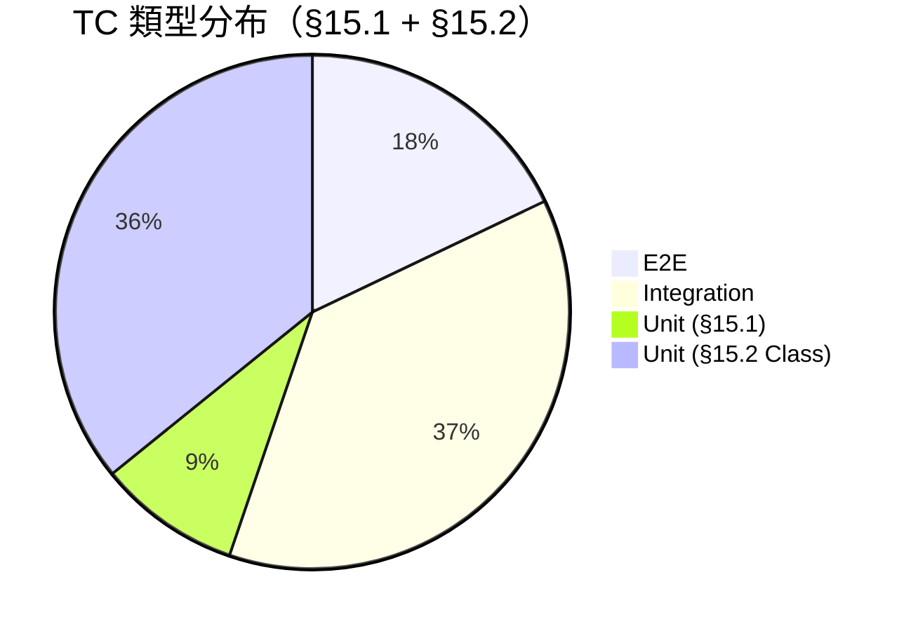

# 需求追蹤矩陣（Requirements Traceability Matrix）

<!-- DOC-ID: RTM-FISHGAME-20260424 -->
<!-- Version: 1.0 | Date: 2026-04-24 | Status: Draft -->
<!-- Source: PRD (8 US / 39 ACs) → test-plan §15.1/§15.2 → features/*.feature -->

---

## 文件控制

| 欄位 | 值 |
|------|-----|
| DOC-ID | RTM-FISHGAME-20260424 |
| Version | 1.0 |
| Date | 2026-04-24 |
| Status | Draft |
| 上游文件 | PRD, EDD, ARCH, API, SCHEMA, test-plan.md, features/*.feature |
| 維護者 | QA Lead |

---

## §1 統計摘要

### §1.1 整體覆蓋率

| 指標 | 數量 | 說明 |
|------|------|------|
| PRD User Stories | 8（P0: 7 / P1: 1）| US-ACCT/ROOM/FISH/WPSK/RTP/SHOP/AGE + VIP |
| PRD Acceptance Criteria | 39（P0: 36 / P1: 3）| 每條 AC 至少一個 TC |
| §15.1 E2E / Integration TCs | 43 | test-plan RTM 正式映射表 |
| §15.2 Unit Test TCs | 24 | 核心模組 Class-level 覆蓋 |
| BDD 補充場景（features/）| 50 | §15.1 未涵蓋的邊界/錯誤路徑 |
| **Total TC（含 BDD 補充）** | **~83** | 詳見 §3–§5 |
| AC 覆蓋率 | **100%**（39/39）| 所有 P0 AC 均有對應 TC |
| 初始執行狀態 | 0 / 83 PASS | 全部 TODO（尚未執行）|

### §1.2 測試類型分布



### §1.3 模組覆蓋分布

```mermaid
bar
  title TC 數量 by 模組（§15.1 基準）
  x-axis [ACCT, ROOM, FISH, WPSK, RTP, SHOP, AGE, VIP]
  y-axis "TC 數量" 0 --> 10
  bar [7, 8, 6, 4, 6, 7, 4, 3]
```

### §1.4 P0 AC 覆蓋狀態（36 條）

| US | AC 數 | TC 數（§15.1）| 覆蓋 % |
|----|-------|--------------|--------|
| US-ACCT-001 | 5 | 7 | 100% |
| US-ROOM-001 | 7 | 8 | 100% |
| US-FISH-001 | 6 | 6 | 100% |
| US-WPSK-001 | 4 | 4 | 100% |
| US-RTP-001 | 5 | 6 | 100% |
| US-SHOP-001 | 6 | 7 | 100% |
| US-AGE-001 | 3 | 4 | 100% |
| **P0 小計** | **36** | **42** | **100%** |
| US-VIP-001（P1）| 3 | 3 | 100% |
| **Total** | **39** | **45** | **100%** |

---

## §2 狀態代碼說明

| 代碼 | 含義 |
|------|------|
| TODO | 尚未執行 |
| PASS | 執行通過 |
| FAIL | 執行失敗（需建 Bug Ticket）|
| SKIP | 已知跳過（需說明原因）|
| BLOCK | 前置條件未滿足，無法執行 |
| WIP | 測試腳本撰寫中 |

---

## §3 Unit Test RTM

### §3.1 核心模組 Unit Test（test-plan §15.2 Class-Level）

| TC-ID | Class / Module | 測試場景摘要 | PRD AC | 測試路徑（推斷）| 狀態 |
|-------|----------------|-------------|--------|----------------|------|
| TC-UNIT-RTP-001-S | RtpEngine | 10,000 次模擬 RTP 落在 85–95% | US-RTP-001/AC-1 | `tests/unit/rtp/RtpEngine.test.ts` | TODO |
| TC-UNIT-RTP-001-E | RtpEngine | 統計異常（RTP < 80%）→ 告警觸發 | US-RTP-001/AC-5 | `tests/unit/rtp/RtpEngine.test.ts` | TODO |
| TC-UNIT-RTP-001-B | RtpEngine | 連敗閾值邊界（N-1 不補償，第 N 補償）| US-RTP-001/AC-2 | `tests/unit/rtp/RtpEngine.test.ts` | TODO |
| TC-UNIT-JACKPOT-001-S | JackpotService | Jackpot 觸發率符合設計規格（≤0.1%）| US-RTP-001/AC-3 | `tests/unit/jackpot/JackpotService.test.ts` | TODO |
| TC-UNIT-JACKPOT-001-E | JackpotService | Redis 寫入失敗 → Jackpot 不觸發，狀態回滾 | US-RTP-001/AC-4 | `tests/unit/jackpot/JackpotService.test.ts` | TODO |
| TC-UNIT-JACKPOT-001-B | JackpotService | 觸發率邊界（剛好達到 / 差 1 未達）| US-RTP-001/AC-3 | `tests/unit/jackpot/JackpotService.test.ts` | TODO |
| TC-UNIT-AUTH-001-S | AuthService | 正確密碼 bcrypt compare → JWT 簽發 | US-ACCT-001/AC-2 | `tests/unit/auth/AuthService.test.ts` | TODO |
| TC-UNIT-AUTH-001-E | AuthService | 第 5 次密碼錯誤 → lockAccount，Redis TTL 900s | US-ACCT-001/AC-4 | `tests/unit/auth/AuthService.test.ts` | TODO |
| TC-UNIT-AUTH-001-B | AuthService | 第 4 次失敗不鎖 / 第 5 次鎖（邊界）| US-ACCT-001/AC-4 | `tests/unit/auth/AuthService.test.ts` | TODO |
| TC-UNIT-AGE-001-S | AgeVerificationService | 出生 18 年前 → 通過驗證 → age_verified=true | US-AGE-001/AC-3 | `tests/unit/compliance/AgeVerification.test.ts` | TODO |
| TC-UNIT-AGE-001-E | AgeVerificationService | 出生 < 18 年 → 拒絕 → RESTRICTED 模式 | US-AGE-001/AC-2 | `tests/unit/compliance/AgeVerification.test.ts` | TODO |
| TC-UNIT-AGE-001-B | AgeVerificationService | 今日滿 18 歲（邊界日期）| US-AGE-001/AC-1 | `tests/unit/compliance/AgeVerification.test.ts` | TODO |
| TC-UNIT-FISH-001-S | FishKillResolver | 第一名命中者獲金幣，其餘 0% | US-FISH-001/AC-3 | `tests/unit/fish/FishKillResolver.test.ts` | TODO |
| TC-UNIT-FISH-001-E | FishKillResolver | Redis SETNX 失敗（競爭條件）→ 第二名不計算 | US-FISH-001/AC-6 | `tests/unit/fish/FishKillResolver.test.ts` | TODO |
| TC-UNIT-FISH-001-B | FishKillResolver | Boss 逃跑（血量未歸零）→ 全員 5% 安慰獎勵 | US-FISH-001/AC-3 | `tests/unit/fish/FishKillResolver.test.ts` | TODO |
| TC-UNIT-PAY-001-S | PaymentService | 幂等 order_id → 第二次提交回傳原始訂單 | US-SHOP-001/AC-3 | `tests/unit/payment/PaymentService.test.ts` | TODO |
| TC-UNIT-PAY-001-E | PaymentService | IAP verifyReceipt 失敗 → 訂單 status=failed | US-SHOP-001/AC-5 | `tests/unit/payment/PaymentService.test.ts` | TODO |
| TC-UNIT-PAY-001-B | PaymentService | 退款 + 鑽石剛好用完（負債標記邊界）| US-SHOP-001/AC-6 | `tests/unit/payment/PaymentService.test.ts` | TODO |
| TC-UNIT-CURR-001-S | CurrencyService | 扣減 10 金幣倍率 → 餘額正確更新 | US-SHOP-001/AC-4 | `tests/unit/currency/CurrencyService.test.ts` | TODO |
| TC-UNIT-CURR-001-E | CurrencyService | 鑽石餘額 0 → 購買失敗 → 餘額不變 | US-SHOP-001/AC-2 | `tests/unit/currency/CurrencyService.test.ts` | TODO |
| TC-UNIT-CURR-001-B | CurrencyService | 金幣剛好足夠（餘額 = 消耗量）/ 差 1 不足 | US-SHOP-001/AC-4 | `tests/unit/currency/CurrencyService.test.ts` | TODO |
| TC-UNIT-WPSK-001-S | SkillCooldownManager | 冷卻結束後可激活技能 | US-WPSK-001/AC-2 | `tests/unit/weapon/SkillCooldownManager.test.ts` | TODO |
| TC-UNIT-WPSK-001-E | SkillCooldownManager | 冷卻中點擊 → 技能不觸發 | US-WPSK-001/AC-3 | `tests/unit/weapon/SkillCooldownManager.test.ts` | TODO |
| TC-UNIT-WPSK-001-B | SkillCooldownManager | 冷卻計時器剛好到 0（邊界觸發）| US-WPSK-001/AC-2 | `tests/unit/weapon/SkillCooldownManager.test.ts` | TODO |

> [WARNING] class-inventory.md 未找到，路徑為從 EDD §4.5.2 classDiagram 推斷值。執行 `/gendoc-gen-diagrams` 後更新。

### §3.2 PRD-Linked Unit Test（test-plan §15.1 UNIT TCs）

| TC-ID | PRD REQ-ID | 場景摘要 | BDD Feature | 測試類型 | 狀態 |
|-------|-----------|---------|-------------|---------|------|
| TC-UNIT-ACCT-005-B | US-ACCT-001/AC-5 | 密碼強度 onBlur 驗證 + bcrypt cost=12 邊界 | `features/auth/user_registration.feature` | Unit | TODO |
| TC-UNIT-ROOM-007-E | US-ROOM-001/AC-7 | 金幣不足 → 拒絕進入高倍率房間 | — | Unit | TODO |
| TC-UNIT-WPSK-003-E | US-WPSK-001/AC-3 | 冷卻中點擊技能 → 按鈕置灰 → 無效點擊 | `features/game/weapon_skill.feature` | Unit | TODO |
| TC-UNIT-WPSK-004-E | US-WPSK-001/AC-4 | 未解鎖鎖定炮 → 提示等級要求 → 不允許使用 | `features/game/weapon_skill.feature` | Unit | TODO |
| TC-UNIT-SHOP-002-E | US-SHOP-001/AC-2 | 鑽石不足 → 拒絕購買 → 餘額不變 → 引導充值 | — | Unit | TODO |
| TC-UNIT-SHOP-004-B | US-SHOP-001/AC-4 | 金幣倍率扣減 → 即時更新 → 歸零降 1x | — | Unit | TODO |
| TC-UNIT-AGE-002-E | US-AGE-001/AC-2 | 輸入未滿 18 歲 → 拒絕 → 付費功能鎖定 | `features/auth/user_registration.feature` | Unit | TODO |

---

## §4 Integration Test RTM

### §4.1 ACCT — 帳號認證（US-ACCT-001）

| TC-ID | PRD REQ-ID | AC / 場景摘要 | BDD Feature | 狀態 |
|-------|-----------|-------------|-------------|------|
| TC-INT-ACCT-002-S | US-ACCT-001/AC-2 | 登入成功 → JWT + Refresh Token 簽發 | `features/auth/user_registration.feature` | TODO |
| TC-INT-ACCT-003-E | US-ACCT-001/AC-3 | Email 已存在 → 409 EMAIL_ALREADY_EXISTS | `features/auth/user_registration.feature` | TODO |
| TC-INT-ACCT-004-E | US-ACCT-001/AC-4 | 24h 內同一 IP 超過 100 次登入 → 429 RATE_LIMITED | `features/auth/user_login.feature` | TODO |
| TC-INT-ACCT-006-E | — | POST /v1/auth/login 帶過期 JWT → 401 TOKEN_EXPIRED | `features/auth/user_registration.feature` | TODO |
| TC-INT-ACCT-007-E | — | GET /v1/users/:id 帶他人 JWT → 403 FORBIDDEN | `features/auth/user_registration.feature` | TODO |
| TC-INT-ACCT-008-S | — | 有效憑證登入 → access_token + refresh_token | `features/auth/user_login.feature` | TODO |
| TC-INT-ACCT-009-S | — | Refresh Token → 新 access_token，舊 token 作廢 | `features/auth/user_login.feature` | TODO |
| TC-INT-ACCT-010-S | — | 登出 → refresh_token 作廢，重用返回 401 | `features/auth/user_login.feature` | TODO |
| TC-INT-ACCT-011-E | — | 錯誤密碼 → 401 INVALID_CREDENTIALS（不洩漏帳號存在）| `features/auth/user_login.feature` | TODO |
| TC-INT-ACCT-012-E | — | 不存在 email 登入 → 401（回應與密碼錯誤相同，防枚舉）| `features/auth/user_login.feature` | TODO |
| TC-INT-ACCT-013-E | — | 已撤銷 refresh_token 刷新 → 401 TOKEN_REVOKED | `features/auth/user_login.feature` | TODO |
| TC-INT-ACCT-014-E | — | 無 Authorization header → 401 UNAUTHORIZED | `features/auth/user_login.feature` | TODO |
| TC-INT-ACCT-015-B | — | JWT Token 有效期邊界（access: 14/16 min，refresh: 29/31 day）| `features/auth/user_login.feature` | TODO |
| TC-INT-ACCT-016-E | — | 同一 IP 1 分鐘超過 5 次註冊 → 429 + Retry-After | `features/auth/user_registration.feature` | TODO |
| TC-INT-ACCT-017-E | — | agree_terms=false → 400 VALIDATION_ERROR | `features/auth/user_registration.feature` | TODO |

### §4.2 ROOM — 多人競技房間（US-ROOM-001）

| TC-ID | PRD REQ-ID | AC / 場景摘要 | BDD Feature | 狀態 |
|-------|-----------|-------------|-------------|------|
| TC-INT-ROOM-002-S | US-ROOM-001/AC-2 | 玩家 A 捕魚 → 魚從公共池消失 → 同步 < 100ms | `features/game/room_matchmaking.feature` | TODO |
| TC-INT-ROOM-003-S | — | 玩家斷線 → 10s 內 Bot 補位（is_bot=true）| `features/game/room_matchmaking.feature` | TODO |
| TC-INT-ROOM-004-S | — | WS 事件往返延遲 P99 ≤ 100ms（同 AZ，連續 100 次）| `features/game/room_matchmaking.feature` | TODO |
| TC-INT-ROOM-004-E | US-ROOM-001/AC-4 | WS 中斷 → 5s 重連失敗 → Bot 接替 | — | TODO |
| TC-INT-ROOM-005-E | — | 房間已滿 6 人 → 422 ROOM_FULL | `features/game/room_matchmaking.feature` | TODO |
| TC-INT-ROOM-006-E | US-ROOM-001/AC-6 | Colyseus 503 → Circuit Breaker → 提示重試 | — | TODO |
| TC-INT-ROOM-007-E | — | 無 JWT Token → WS 握手 401 UNAUTHORIZED | `features/game/room_matchmaking.feature` | TODO |
| TC-INT-ROOM-008-E | — | 過期/偽造 JWT → WS 握手 401 INVALID_TOKEN | `features/game/room_matchmaking.feature` | TODO |
| TC-INT-ROOM-009-B | — | 房間人數邊界（3→waiting / 4+→game_started）| `features/game/room_matchmaking.feature` | TODO |
| TC-INT-ROOM-010-S | — | 30s 匹配超時 → 機器人補位 4 人 → 遊戲啟動 | `features/game/room_matchmaking.feature` | TODO |

### §4.3 FISH — 捕魚遊戲核心（US-FISH-001）

| TC-ID | PRD REQ-ID | AC / 場景摘要 | BDD Feature | 狀態 |
|-------|-----------|-------------|-------------|------|
| TC-INT-FISH-001-S | US-FISH-001/AC-1 | 射擊命中普通魚（3x）→ 金幣即時到帳 | `features/game/fishing_gameplay.feature` | TODO |
| TC-INT-FISH-003-B | US-FISH-001/AC-3 | 命中/未命中/Boss 逃跑獎勵分配規則 | — | TODO |
| TC-INT-FISH-005-E | US-FISH-001/AC-5 | 魚群服務崩潰 → 降級靜態波次 → 不中斷遊戲 | — | TODO |
| TC-INT-FISH-006-B | US-FISH-001/AC-6 | 6 玩家同時命中同一魚 → Redis SETNX → 唯一計算 | — | TODO |
| TC-INT-FISH-002-S | — | 未命中不扣金幣，彈藥數量 -1 | `features/game/fishing_gameplay.feature` | TODO |
| TC-INT-FISH-003-S | — | 不同魚種倍率（3/5/10/20x）計算正確 | `features/game/fishing_gameplay.feature` | TODO |
| TC-INT-FISH-004-S | — | 武器倍率 × 魚種倍率疊加（雷射炮 3x × 20x = 60 金幣）| `features/game/fishing_gameplay.feature` | TODO |
| TC-INT-FISH-005-S | — | 單局全程未命中 → 保底 10 金幣 | `features/game/fishing_gameplay.feature` | TODO |
| TC-INT-FISH-007-E | — | 目標魚已被擊殺 → onMessage "TARGET_NOT_FOUND" | `features/game/fishing_gameplay.feature` | TODO |
| TC-INT-FISH-008-B | — | 魚種 × 武器倍率邊界矩陣（4×4 Outline）| `features/game/fishing_gameplay.feature` | TODO |

### §4.4 WPSK — 武器與技能（US-WPSK-001）

| TC-ID | PRD REQ-ID | AC / 場景摘要 | BDD Feature | 狀態 |
|-------|-----------|-------------|-------------|------|
| TC-INT-WPSK-002-S | US-WPSK-001/AC-2 | 技能冷卻期間無法重複使用，回傳剩餘冷卻時間 | `features/game/weapon_skill.feature` | TODO |
| TC-INT-WPSK-003-S | US-WPSK-001/AC-2 | 冷卻期結束後可重新使用技能 | `features/game/weapon_skill.feature` | TODO |
| TC-INT-WPSK-005-S | — | 全屏炸彈命中所有存活魚，觸發各自 fish_kill | `features/game/weapon_skill.feature` | TODO |
| TC-INT-WPSK-006-E | US-WPSK-001/AC-4 | 非 VIP（tier=0）使用 VIP 武器 → "VIP_REQUIRED" | `features/game/weapon_skill.feature` | TODO |
| TC-INT-WPSK-007-S | US-WPSK-001/AC-4 | VIP（tier=1）成功裝備 VIP 強化武器（5x）| `features/game/weapon_skill.feature` | TODO |
| TC-INT-WPSK-008-E | — | 遊戲未開始時選武器 → "GAME_NOT_STARTED" | `features/game/weapon_skill.feature` | TODO |
| TC-INT-WPSK-009-B | — | 技能冷卻邊界（冷卻 -1s COOLING_DOWN / 剛好 SUCCESS）| `features/game/weapon_skill.feature` | TODO |

### §4.5 RTP — RTP 引擎與 Jackpot（US-RTP-001）

| TC-ID | PRD REQ-ID | AC / 場景摘要 | BDD Feature | 狀態 |
|-------|-----------|-------------|-------------|------|
| TC-INT-RTP-002-S | US-RTP-001/AC-2 | 連敗 > 閾值 → 補償邏輯觸發 → 命中率動態提升 | — | TODO |
| TC-INT-RTP-004-S | US-RTP-001/AC-4 | Jackpot 觸發 → 1s 內寫入後台審計日誌 | `features/game/rtp_jackpot.feature` | TODO |
| TC-INT-RTP-005-E | US-RTP-001/AC-5 | RTP Health Check 失敗 3 次 → 降級 80% 固定命中 | — | TODO |
| TC-INT-RTP-006-E | — | POST /v1/game-configs 帶非 Admin JWT → 403 FORBIDDEN | `features/game/rtp_jackpot.feature` | TODO |
| TC-INT-RTP-005-S | — | Admin 調整 RTP 後 15 分鐘內生效，DB 記錄更新 | `features/game/rtp_jackpot.feature` | TODO |
| TC-INT-RTP-007-E | — | base_rtp=0.79（< 0.80）→ 422 RTP_OUT_OF_RANGE | `features/game/rtp_jackpot.feature` | TODO |
| TC-INT-RTP-008-B | — | 100 房間同時觸發 Jackpot → Redis GETSET 唯一獲獎 | `features/game/rtp_jackpot.feature` | TODO |
| TC-INT-RTP-009-B | — | RTP 邊界值驗證（0.80/0.95/0.99→200，0.79/1.00→422）| `features/game/rtp_jackpot.feature` | TODO |

### §4.6 SHOP — IAP 充值（US-SHOP-001）

| TC-ID | PRD REQ-ID | AC / 場景摘要 | BDD Feature | 狀態 |
|-------|-----------|-------------|-------------|------|
| TC-INT-SHOP-003-B | US-SHOP-001/AC-3 | 重複 Idempotency-Key → 409 + original_order_id | `features/shop/iap_purchase.feature` | TODO |
| TC-INT-SHOP-005-E | US-SHOP-001/AC-5 | IAP Circuit Breaker Open → 503 + retry_after=30 | `features/shop/iap_purchase.feature` | TODO |
| TC-INT-SHOP-006-E | US-SHOP-001/AC-6 | Apple 退款 webhook → orders.status=REFUNDED，扣鑽 | `features/shop/iap_purchase.feature` | TODO |
| TC-INT-SHOP-007-E | — | POST /v1/shop/purchases 無 JWT → 401 UNAUTHORIZED | `features/shop/iap_purchase.feature` | TODO |
| TC-INT-SHOP-002-S | — | 鑽石兌換金幣匯率 1:10，1 秒內完成 | `features/shop/iap_purchase.feature` | TODO |
| TC-INT-SHOP-003-S | — | Google Play IAP 驗證成功後鑽石到帳 | `features/shop/iap_purchase.feature` | TODO |
| TC-INT-SHOP-004-S | — | 充值後金幣立即可用，可購買武器 | `features/shop/iap_purchase.feature` | TODO |
| TC-INT-SHOP-008-B | — | 不同充值方案鑽石數量驗證（50/330/1680/5800）| `features/shop/iap_purchase.feature` | TODO |
| TC-INT-SHOP-009-E | — | 1 分鐘超過 5 次充值請求 → 429 + Retry-After | `features/shop/iap_purchase.feature` | TODO |
| TC-INT-SHOP-010-E | — | 偽造 IAP 收據（status:21002）→ 422 IAP_RECEIPT_INVALID | `features/shop/iap_purchase.feature` | TODO |

### §4.7 AGE — 年齡驗證（US-AGE-001）

| TC-ID | PRD REQ-ID | AC / 場景摘要 | BDD Feature | 狀態 |
|-------|-----------|-------------|-------------|------|
| TC-INT-AGE-003-S | US-AGE-001/AC-3 | ≥18 歲確認 → DB 記錄 age_verified=true → 付費啟用 | `features/auth/user_registration.feature` | TODO |
| TC-INT-AGE-004-E | — | age_verified=false 用戶 POST /v1/shop/purchases → 403 | `features/shop/iap_purchase.feature` | TODO |
| TC-INT-AGE-002-S | — | 18 歲以上自動通過，DB age_verified=true | `features/auth/user_registration.feature` | TODO |
| TC-INT-AGE-003-E | — | age_verified=false → POST /v1/shop/purchases → 403 AGE_VERIFICATION_REQUIRED | `features/auth/user_registration.feature` | TODO |

### §4.8 VIP — VIP 月費訂閱（US-VIP-001）

| TC-ID | PRD REQ-ID | AC / 場景摘要 | BDD Feature | 狀態 |
|-------|-----------|-------------|-------------|------|
| TC-INT-VIP-002-S | US-VIP-001/AC-2 | 次日系統執行補貼 Job → diamond_balance +5 | `features/shop/vip_subscription.feature` | TODO |
| TC-INT-VIP-003-E | US-VIP-001/AC-3 | VIP 到期 → vip_tier 重置 0 → VIP 功能被拒 | `features/shop/vip_subscription.feature` | TODO |
| TC-INT-VIP-004-E | — | 已是活躍 VIP 重複訂閱 → 422 VIP_ALREADY_ACTIVE | `features/shop/vip_subscription.feature` | TODO |
| TC-INT-VIP-005-E | — | 重複 Idempotency-Key → 409 + original_subscription_id | `features/shop/vip_subscription.feature` | TODO |
| TC-INT-VIP-006-E | — | 無 JWT Token 訂閱 → 401 UNAUTHORIZED | `features/shop/vip_subscription.feature` | TODO |
| TC-INT-VIP-007-B | — | 鑽石餘額邊界（30/31→SUCCESS，29/0→FAILED）| `features/shop/vip_subscription.feature` | TODO |
| TC-INT-VIP-008-S | — | VIP 訂閱後可使用 laser_cannon_vip（5x）| `features/shop/vip_subscription.feature` | TODO |
| TC-INT-VIP-009-E | — | 鑽石 < 30 顆 → 422 INSUFFICIENT_DIAMONDS | `features/shop/vip_subscription.feature` | TODO |

---

## §5 E2E Test RTM

| TC-ID | PRD REQ-ID | AC / 場景摘要 | BDD Feature | 測試標籤 | 狀態 |
|-------|-----------|-------------|-------------|---------|------|
| TC-E2E-ACCT-001-S | US-ACCT-001/AC-1 | 完整註冊 → 帳號建立 → JWT 簽發 → age_verified=true | `features/auth/user_registration.feature` | @smoke | TODO |
| TC-E2E-ROOM-001-S | US-ROOM-001/AC-1 | 4 位玩家 30s 內快速匹配 → WS 握手 → 進入競技房間 | `features/game/room_matchmaking.feature` | @smoke @websocket | TODO |
| TC-E2E-ROOM-003-S | US-ROOM-001/AC-3 | 等待 > 30s → Bot 補位 → 遊戲繼續 | — | | TODO |
| TC-E2E-ROOM-005-S | US-ROOM-001/AC-5 | 遊戲結束 → 積分排名 → 最高分獲 MVP 標記 | `features/game/fishing_gameplay.feature` | @smoke | TODO |
| TC-E2E-FISH-002-S | US-FISH-001/AC-2 | 命中普通魚 → RTP 動態計算 → 3s 內金幣更新 | — | | TODO |
| TC-E2E-FISH-004-S | US-FISH-001/AC-4 | Boss 血量歸零 → 2s 爆炸動畫 → 即時金幣更新 | — | | TODO |
| TC-E2E-WPSK-001-S | US-WPSK-001/AC-1 | 選擇雷射炮 → 扣費 30 金幣 → 射擊倍率 3x 生效 | `features/game/weapon_skill.feature` | @smoke @websocket | TODO |
| TC-E2E-WPSK-002-S | US-WPSK-001/AC-2 | 冷卻結束 → 冰凍技能觸發 → 全屏 3s 停頓 | — | | TODO |
| TC-E2E-RTP-003-S | US-RTP-001/AC-3 | Jackpot 觸發 → 動畫 ≥ 3s → 獎池重置 → 廣播 | `features/game/rtp_jackpot.feature` | | TODO |
| TC-E2E-SHOP-001-S | US-SHOP-001/AC-1 | Apple IAP 收據驗證成功 → 201 → diamond_balance=330 | `features/shop/iap_purchase.feature` | @smoke | TODO |
| TC-E2E-AGE-001-S | US-AGE-001/AC-1 | 18 歲以下 → 422 AGE_RESTRICTION → user 記錄未建立 | `features/auth/user_registration.feature` | @smoke | TODO |
| TC-E2E-VIP-001-S | US-VIP-001/AC-1 | 鑽石足夠 → 201 → vip_tier=1 → diamond_balance=70 | `features/shop/vip_subscription.feature` | @smoke | TODO |

---

## §6 需求 ↔ 測試快速查詢

### §6.1 User Story → TC-ID 對照

| US-ID | 優先級 | ACs | 對應 TC-IDs（§15.1 基準）|
|-------|--------|-----|------------------------|
| US-ACCT-001 | P0 | AC-1~5 | TC-E2E-ACCT-001-S, TC-INT-ACCT-002-S, TC-INT-ACCT-003-E, TC-INT-ACCT-004-E, TC-UNIT-ACCT-005-B, TC-INT-ACCT-006-E, TC-INT-ACCT-007-E |
| US-ROOM-001 | P0 | AC-1~7 | TC-E2E-ROOM-001-S, TC-INT-ROOM-002-S, TC-E2E-ROOM-003-S, TC-INT-ROOM-004-E, TC-E2E-ROOM-005-S, TC-INT-ROOM-006-E, TC-UNIT-ROOM-007-E, TC-INT-ROOM-008-E |
| US-FISH-001 | P0 | AC-1~6 | TC-INT-FISH-001-S, TC-E2E-FISH-002-S, TC-INT-FISH-003-B, TC-E2E-FISH-004-S, TC-INT-FISH-005-E, TC-INT-FISH-006-B |
| US-WPSK-001 | P0 | AC-1~4 | TC-E2E-WPSK-001-S, TC-E2E-WPSK-002-S, TC-UNIT-WPSK-003-E, TC-UNIT-WPSK-004-E |
| US-RTP-001 | P0 | AC-1~5 | TC-UNIT-RTP-001-S, TC-INT-RTP-002-S, TC-E2E-RTP-003-S, TC-INT-RTP-004-S, TC-INT-RTP-005-E, TC-INT-RTP-006-E |
| US-SHOP-001 | P0 | AC-1~6 | TC-E2E-SHOP-001-S, TC-UNIT-SHOP-002-E, TC-INT-SHOP-003-B, TC-UNIT-SHOP-004-B, TC-INT-SHOP-005-E, TC-INT-SHOP-006-E, TC-INT-SHOP-007-E |
| US-AGE-001 | P0 | AC-1~3 | TC-E2E-AGE-001-S, TC-UNIT-AGE-002-E, TC-INT-AGE-003-S, TC-INT-AGE-004-E |
| US-VIP-001 | P1 | AC-1~3 | TC-E2E-VIP-001-S, TC-INT-VIP-002-S, TC-INT-VIP-003-E |

### §6.2 TC-ID → PRD AC 反查（Smoke Tests 優先）

| TC-ID | US | AC | @tags |
|-------|----|----|-------|
| TC-E2E-ACCT-001-S | US-ACCT-001 | AC-1 | @smoke @p0 |
| TC-E2E-ROOM-001-S | US-ROOM-001 | AC-1 | @smoke @p0 @websocket |
| TC-E2E-WPSK-001-S | US-WPSK-001 | AC-1 | @smoke @p0 @websocket |
| TC-E2E-RTP-003-S | US-RTP-001 | AC-3 | @smoke @p0 |
| TC-E2E-SHOP-001-S | US-SHOP-001 | AC-1 | @smoke @p0 |
| TC-E2E-AGE-001-S | US-AGE-001 | AC-1 | @smoke @p0 |
| TC-E2E-VIP-001-S | US-VIP-001 | AC-1 | @smoke @p1 |
| TC-E2E-ROOM-005-S | US-ROOM-001 | AC-5 | @smoke @p0 |
| TC-INT-ACCT-008-S | US-ACCT-001 | AC-2 | @smoke @p0 |
| TC-INT-FISH-001-S | US-FISH-001 | AC-1 | @smoke @p0 |

---

## §7 失敗追蹤表

> 初始狀態：所有 TC 均為 TODO（尚未執行），無失敗記錄。

| Bug-ID | TC-ID | 發現版本 | 嚴重度 | 描述 | 指派 | 狀態 |
|--------|-------|---------|--------|------|------|------|
| — | — | — | — | 本表格在首次執行測試後填入 | — | — |

---

## §8 CSV 匯出（§15.1 RTM）

```csv
tc_id,prd_req_id,ac_desc,test_type,bdd_file,status,priority
TC-E2E-ACCT-001-S,US-ACCT-001/AC-1,帳號註冊成功,E2E,features/auth/user_registration.feature,TODO,P0
TC-INT-ACCT-002-S,US-ACCT-001/AC-2,登入 JWT+Refresh Token 簽發,Integration,features/auth/user_registration.feature,TODO,P0
TC-INT-ACCT-003-E,US-ACCT-001/AC-3,Email 已存在 409,Integration,features/auth/user_registration.feature,TODO,P0
TC-INT-ACCT-004-E,US-ACCT-001/AC-4,Rate Limit 429,Integration,features/auth/user_login.feature,TODO,P0
TC-UNIT-ACCT-005-B,US-ACCT-001/AC-5,密碼強度邊界,Unit,features/auth/user_registration.feature,TODO,P0
TC-INT-ACCT-006-E,,過期 JWT 401,Integration,features/auth/user_registration.feature,TODO,P0
TC-INT-ACCT-007-E,,他人資料 403,Integration,features/auth/user_registration.feature,TODO,P0
TC-E2E-ROOM-001-S,US-ROOM-001/AC-1,快速匹配進房,E2E,features/game/room_matchmaking.feature,TODO,P0
TC-INT-ROOM-002-S,US-ROOM-001/AC-2,魚同步 < 100ms,Integration,features/game/room_matchmaking.feature,TODO,P0
TC-E2E-ROOM-003-S,US-ROOM-001/AC-3,Bot 補位,E2E,,TODO,P0
TC-INT-ROOM-004-E,US-ROOM-001/AC-4,WS 重連失敗 Bot 接替,Integration,,TODO,P0
TC-E2E-ROOM-005-S,US-ROOM-001/AC-5,結算 MVP,E2E,features/game/fishing_gameplay.feature,TODO,P0
TC-INT-ROOM-006-E,US-ROOM-001/AC-6,Colyseus 503,Integration,,TODO,P0
TC-UNIT-ROOM-007-E,US-ROOM-001/AC-7,金幣不足進高倍率房間,Unit,,TODO,P0
TC-INT-ROOM-008-E,,無效 JWT WS 401,Integration,features/game/room_matchmaking.feature,TODO,P0
TC-INT-FISH-001-S,US-FISH-001/AC-1,命中金幣即時到帳,Integration,features/game/fishing_gameplay.feature,TODO,P0
TC-E2E-FISH-002-S,US-FISH-001/AC-2,RTP 計算金幣更新,E2E,,TODO,P0
TC-INT-FISH-003-B,US-FISH-001/AC-3,Boss 贏者通吃規則,Integration,,TODO,P0
TC-E2E-FISH-004-S,US-FISH-001/AC-4,Boss 爆炸動畫金幣更新,E2E,,TODO,P0
TC-INT-FISH-005-E,US-FISH-001/AC-5,魚群服務降級,Integration,,TODO,P0
TC-INT-FISH-006-B,US-FISH-001/AC-6,並發命中 Redis SETNX 唯一,Integration,,TODO,P0
TC-E2E-WPSK-001-S,US-WPSK-001/AC-1,雷射炮扣費+倍率,E2E,features/game/weapon_skill.feature,TODO,P0
TC-E2E-WPSK-002-S,US-WPSK-001/AC-2,冰凍技能觸發,E2E,,TODO,P0
TC-UNIT-WPSK-003-E,US-WPSK-001/AC-3,冷卻中點擊無效,Unit,features/game/weapon_skill.feature,TODO,P0
TC-UNIT-WPSK-004-E,US-WPSK-001/AC-4,未解鎖拒絕使用,Unit,features/game/weapon_skill.feature,TODO,P0
TC-UNIT-RTP-001-S,US-RTP-001/AC-1,10000 次模擬 RTP 85-95%,Unit,features/game/rtp_jackpot.feature,TODO,P0
TC-INT-RTP-002-S,US-RTP-001/AC-2,連敗補償邏輯觸發,Integration,,TODO,P0
TC-E2E-RTP-003-S,US-RTP-001/AC-3,Jackpot 觸發動畫獎池重置,E2E,features/game/rtp_jackpot.feature,TODO,P0
TC-INT-RTP-004-S,US-RTP-001/AC-4,Jackpot 觸發審計日誌,Integration,features/game/rtp_jackpot.feature,TODO,P0
TC-INT-RTP-005-E,US-RTP-001/AC-5,RTP Health Check 失敗降級,Integration,,TODO,P0
TC-INT-RTP-006-E,,非 Admin 修改 RTP 403,Integration,features/game/rtp_jackpot.feature,TODO,P0
TC-E2E-SHOP-001-S,US-SHOP-001/AC-1,Apple IAP 鑽石到帳,E2E,features/shop/iap_purchase.feature,TODO,P0
TC-UNIT-SHOP-002-E,US-SHOP-001/AC-2,鑽石不足購買失敗,Unit,,TODO,P0
TC-INT-SHOP-003-B,US-SHOP-001/AC-3,幂等 order_id,Integration,features/shop/iap_purchase.feature,TODO,P0
TC-UNIT-SHOP-004-B,US-SHOP-001/AC-4,金幣倍率扣減歸零,Unit,,TODO,P0
TC-INT-SHOP-005-E,US-SHOP-001/AC-5,Circuit Breaker 503,Integration,features/shop/iap_purchase.feature,TODO,P0
TC-INT-SHOP-006-E,US-SHOP-001/AC-6,退款 webhook REFUNDED,Integration,features/shop/iap_purchase.feature,TODO,P0
TC-INT-SHOP-007-E,,無 JWT 401,Integration,features/shop/iap_purchase.feature,TODO,P0
TC-E2E-AGE-001-S,US-AGE-001/AC-1,未成年拒絕,E2E,features/auth/user_registration.feature,TODO,P0
TC-UNIT-AGE-002-E,US-AGE-001/AC-2,< 18 歲付費鎖定,Unit,features/auth/user_registration.feature,TODO,P0
TC-INT-AGE-003-S,US-AGE-001/AC-3,>=18 歲記錄付費啟用,Integration,features/auth/user_registration.feature,TODO,P0
TC-INT-AGE-004-E,,未驗證用戶購買 403,Integration,features/shop/iap_purchase.feature,TODO,P0
TC-E2E-VIP-001-S,US-VIP-001/AC-1,VIP 訂閱成功扣鑽石,E2E,features/shop/vip_subscription.feature,TODO,P1
TC-INT-VIP-002-S,US-VIP-001/AC-2,次日補貼 5 鑽石,Integration,features/shop/vip_subscription.feature,TODO,P1
TC-INT-VIP-003-E,US-VIP-001/AC-3,VIP 到期降級,Integration,features/shop/vip_subscription.feature,TODO,P1
```

---

## §15.3 UML 追蹤圖（Sequence Diagram → TC-ID）

### §15.3.1 用戶註冊流程（sequence-register）

```
docs/diagrams/sequence-register.md

Client → AccountService.register() → AgeVerificationService.verify()
                                   → AuthService.hashPassword()
                                   → UserRepository.create()
                                   → EmailService.sendVerification()
```

| Sequence 步驟 | 對應 TC-ID |
|--------------|-----------|
| POST /v1/auth/register 成功路徑 | TC-E2E-ACCT-001-S |
| Age verification（出生 < 18）| TC-E2E-AGE-001-S, TC-UNIT-AGE-001-E |
| Email 重複衝突（409）| TC-INT-ACCT-003-E |
| agree_terms=false 驗證 | TC-INT-ACCT-017-E |
| 密碼 bcrypt hash | TC-UNIT-AUTH-001-S, TC-UNIT-ACCT-005-B |
| Rate Limit（IP 5次/min）| TC-INT-ACCT-016-E |

### §15.3.2 IAP 充值流程（sequence-iap-purchase）

```
docs/diagrams/sequence-iap-purchase.md

Client → ShopService.createPurchase() → IAPVerifier.verify(receipt)
                                      → PaymentService.idempotencyCheck()
                                      → CurrencyService.creditDiamonds()
                                      → OrderRepository.markCompleted()
```

| Sequence 步驟 | 對應 TC-ID |
|--------------|-----------|
| Apple IAP 收據驗證成功 | TC-E2E-SHOP-001-S |
| 幂等 order_id 重複提交 | TC-INT-SHOP-003-B, TC-UNIT-PAY-001-S |
| Circuit Breaker Open（503）| TC-INT-SHOP-005-E, TC-UNIT-PAY-001-E |
| 退款 webhook 觸發 | TC-INT-SHOP-006-E, TC-UNIT-PAY-001-B |
| 無 JWT 401 | TC-INT-SHOP-007-E |
| 未年齡驗證 403 | TC-INT-AGE-004-E |
| 鑽石 ↔ 金幣兌換（1:10）| TC-INT-SHOP-002-S, TC-UNIT-CURR-001-S |

### §15.3.3 VIP 訂閱流程（sequence-vip-subscribe）

```
docs/diagrams/sequence-vip-subscribe.md

Client → VipService.subscribe() → CurrencyService.deductDiamonds(30)
                                → VipRepository.createSubscription()
                                → UserRepository.setVipTier(1)
                                → SchedulerService.registerDailyBonus()
```

| Sequence 步驟 | 對應 TC-ID |
|--------------|-----------|
| VIP 訂閱成功（30 鑽石）| TC-E2E-VIP-001-S |
| 次日補貼 Job | TC-INT-VIP-002-S |
| VIP 到期降級 | TC-INT-VIP-003-E |
| 鑽石不足 | TC-INT-VIP-009-E |
| 已是活躍 VIP 重複訂閱 | TC-INT-VIP-004-E |
| Idempotency Key 重複 | TC-INT-VIP-005-E |

---

## §15.4 類別追蹤表（Class → Test Coverage）

> [WARNING] class-inventory.md 未找到。以下為 EDD §4.5.2 classDiagram 推斷值，執行 `/gendoc-gen-diagrams` 後更新。

| Class | 服務 | §15.2 Unit TC | §15.1 Integration TC | E2E TC |
|-------|------|--------------|---------------------|--------|
| AuthService | account | TC-UNIT-AUTH-001-S/E/B | TC-INT-ACCT-002/004/006/007-* | TC-E2E-ACCT-001-S |
| AgeVerificationService | account | TC-UNIT-AGE-001-S/E/B | TC-INT-AGE-003-S, TC-INT-AGE-004-E | TC-E2E-AGE-001-S |
| RtpEngine | game | TC-UNIT-RTP-001-S/E/B | TC-INT-RTP-002-S, TC-INT-RTP-005-E | TC-E2E-RTP-003-S |
| JackpotService | game | TC-UNIT-JACKPOT-001-S/E/B | TC-INT-RTP-004-S | TC-E2E-RTP-003-S |
| FishKillResolver | game | TC-UNIT-FISH-001-S/E/B | TC-INT-FISH-001/003/006-* | TC-E2E-FISH-002/004-S |
| SkillCooldownManager | game | TC-UNIT-WPSK-001-S/E/B | TC-INT-WPSK-002/003-S | TC-E2E-WPSK-001-S |
| PaymentService | shop | TC-UNIT-PAY-001-S/E/B | TC-INT-SHOP-003/005/006/007-* | TC-E2E-SHOP-001-S |
| CurrencyService | shop | TC-UNIT-CURR-001-S/E/B | TC-INT-SHOP-002-S, TC-INT-VIP-009-E | TC-E2E-SHOP-001-S |

---

_RTM 自動維護規則：每次 BDD feature file 新增 TC，同步更新本文件 §4/§5 對應表格及 §1 統計數字。_
