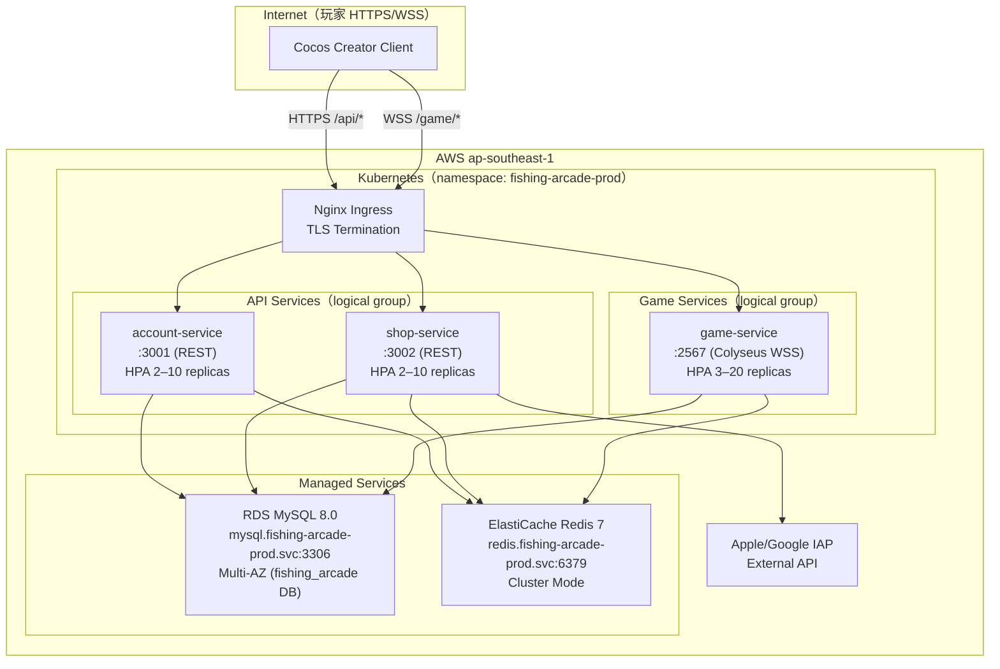
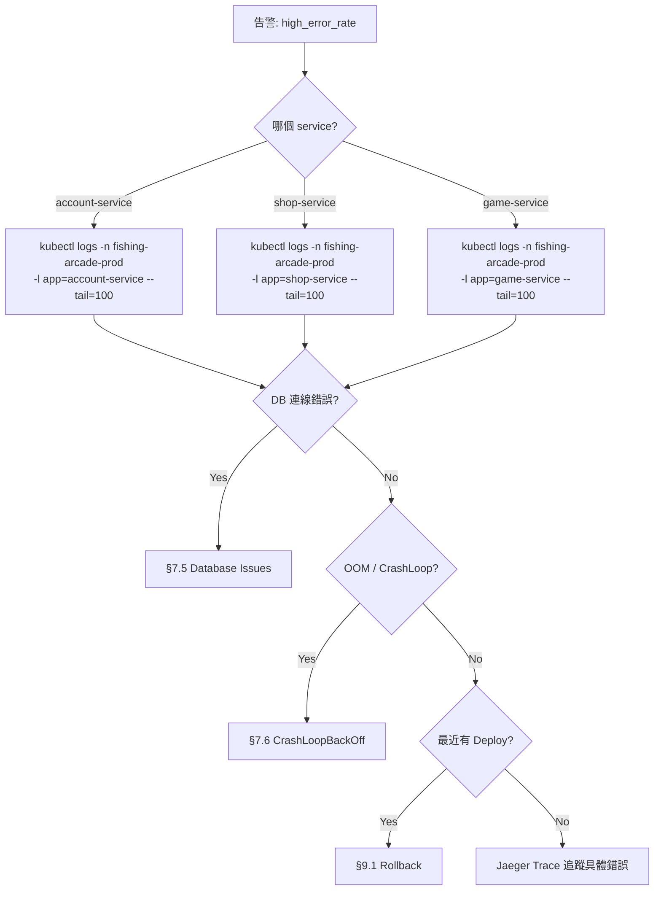

# Fishing Arcade Game — Operations Runbook

<!-- DOC-ID: RUNBOOK-FISHING-ARCADE-GAME-20260424 -->
<!-- Version: 0.1 | Date: 2026-04-24 | Status: DRAFT -->
<!-- Quality Bar: 凌晨 3 點被叫醒，零前情提要，能直接執行每一個步驟 -->
<!-- ⚠️  DRAFT WARNING: 此文件為 DRAFT 狀態。§12 聯絡資訊尚未填充，P1 升級路徑目前失效。
     請在轉為 READY 前完成「發布前佔位符填充清單」（見 §0）。-->

---

## §0 Document Control

| 欄位 | 值 |
|------|-----|
| DOC-ID | RUNBOOK-FISHING-ARCADE-GAME-20260424 |
| Version | 0.1 |
| Status | **DRAFT — 聯絡資訊待填充（§12 全部為佔位符，P1 升級路徑失效）** |
| 上游文件 | EDD, ARCH, API, SCHEMA, PRD, BRD, test-plan.md |
| 維護者 | SRE / Platform Eng |

### 發布前佔位符填充清單（DRAFT → READY 前必須完成）

在將 Status 改為 READY 之前，必須填充以下所有 `{{}}` 佔位符：

| 位置 | 佔位符 | 說明 |
|------|--------|------|
| §4.1 Pre-Deployment Checklist | `{{GH_OWNER}}` | GitHub 組織/使用者名稱 |
| §4.2 Standard Deployment | `{{GH_OWNER}}` | GitHub 組織/使用者名稱（映像路徑）|
| §5.1 Key Dashboards | `{{DOMAIN}}` | Grafana 內部域名 |
| §6.3 Communication Templates | `{{COMPANY_DOMAIN}}` | 公司 Status Page 域名 |
| §12 Contacts | `{{ON_CALL_NAME}}` | On-Call SRE 姓名 |
| §12 Contacts | `{{PAGERDUTY_SERVICE_URL}}` | PagerDuty Service URL |
| §12 Contacts | `{{ENG_LEAD_NAME}}` | Engineering Lead 姓名 |
| §12 Contacts | `{{ENG_LEAD_SLACK}}` | Engineering Lead Slack handle |
| §12 Contacts | `{{DBA_NAME}}` | DBA 姓名 |
| §12 Contacts | `{{DBA_SLACK}}` | DBA Slack handle |
| §12 Contacts | `{{SECURITY_NAME}}` | Security Lead 姓名 |
| §12 Contacts | `{{SECURITY_SLACK}}` | Security Lead Slack handle |
| §12 Contacts | `{{PM_NAME}}` | Product Head 姓名 |
| §12 Contacts | `{{PM_SLACK}}` | Product Head Slack handle |
| §12 Contacts | `{{ORG}}` | PagerDuty 組織名稱 |
| §12 Contacts | `{{SERVICE_ID}}` | PagerDuty Service ID |
| §12 Contacts | `{{COMPANY_DOMAIN}}` | 公司 Status Page 域名 |
| §14 On-Call Handoff | `{{DOMAIN}}` | Grafana 內部域名 |
| §14 On-Call Handoff | `{{ORG}}` | PagerDuty 組織名稱 |
| §14 On-Call Handoff | `{{SERVICE_ID}}` | PagerDuty Service ID |

---

## §1 System Overview

### §1.1 Business Function

Fishing Arcade Game 是一款以虛擬幣為媒介的多人即時捕魚競技遊戲平台。玩家透過 IAP（Apple/Google）購買鑽石，兌換成金幣後進入 4–6 人競技房間，即時射擊魚群賺取金幣獎勵，觸發 Jackpot 時一次性獲得累積獎池。系統對外依賴 Apple/Google IAP 收據驗證；對內提供 REST API（帳號/商城）和 Colyseus WebSocket（遊戲）服務。

**上游呼叫方**：玩家 Cocos Creator 遊戲用戶端（HTTPS + WSS）

**下游消費者**：RDS MySQL（持久化）、ElastiCache Redis（即時狀態 + Jackpot 原子鎖）、Apple/Google IAP 驗證 API

**系統下線時的 Blast Radius**：
- Account/Shop Service 下線 → 玩家無法登入、充值、查餘額；進行中遊戲房間可繼續（Colyseus 獨立運行）
- Game Service 下線 → 所有進行中遊戲房間中斷；已充值鑽石不受影響
- Redis 下線 → Jackpot 觸發停止；玩家即時金幣更新延遲；WebSocket 廣播降級
- MySQL 下線 → 所有服務不可用；金幣/鑽石餘額讀取失敗

### §1.2 Operational Constraints

| 限制項目 | 說明 |
|---------|------|
| 峰值流量窗口 | 平日 20:00–23:00 本地時間（玩家主要活躍時段）；週末全日 |
| 維護窗口 | 凌晨 02:00–04:00（peak 時段禁止 rolling restart）|
| 最大並發 | 1,000 名同時在線玩家（Colyseus HPA 3–20 replicas）|
| 真實金錢交易 | IAP 充值涉及真實貨幣，訂單 status 異常須立即處理（< 15 分鐘）|
| 年齡合規 | age_verified=false 用戶禁止付費操作；合規日誌必須保留 90 天 |
| Jackpot 唯一性 | Redis Lua Script 原子鎖確保每次 Jackpot 僅一名玩家得獎；Redis 故障不得觸發重複獎勵 |

---

## §2 Architecture

### §2.1 Runtime Topology

> **NOTE — Namespace 命名說明**：下圖中的 "Game Services" 和 "API Services" 為**邏輯分組**，僅用於說明服務職責。實際 Kubernetes namespace 均為 `fishing-arcade-prod`（見 §2.2）。圖中未使用 `game-ns` / `api-ns` 命名，以避免與實際 namespace 混淆。



### §2.2 Component Inventory

| Component | K8s Namespace | Deployment | Port | HPA | 說明 |
|-----------|--------------|-----------|------|-----|------|
| Account Service | `fishing-arcade-prod` | `account-service` | 3001 | 2–10 | 帳號/認證 REST API |
| Shop Service | `fishing-arcade-prod` | `shop-service` | 3002 | 2–10 | IAP 充值 / 鑽石兌換 REST API |
| Game Service | `fishing-arcade-prod` | `game-service` | 2567 | 3–20 | Colyseus WebSocket 遊戲伺服器 |
| MySQL（RDS）| managed | — | 3306 | — | 主資料庫 Multi-AZ |
| Redis（ElastiCache）| managed | — | 6379 | — | 即時狀態 + Jackpot 原子鎖 |
| Nginx Ingress | `ingress-nginx` | `ingress-nginx-controller` | 80/443 | — | TLS 終止 + 路由 |

### §2.3 Network and Port Reference

| 路由規則 | 目標 Service | Port |
|---------|-------------|------|
| `/api/v1/auth/*` | account-service | 3001 |
| `/api/v1/users/*` | account-service | 3001 |
| `/api/v1/shop/*` | shop-service | 3002 |
| `/api/v1/vip/*` | shop-service | 3002 |
| `/api/v1/game-configs/*` | game-service | 2567 |
| `wss://*.*/game` | game-service | 2567 |

---

## §3 SLI / SLO / SLA

### §3.1 SLO 定義（來自 EDD §10.5）

| SLO | 目標 | 量測窗口 | BRD 依據 |
|-----|------|---------|---------|
| API Availability | ≥ 99.5% | 30 天滾動 | BRD NFR-AVAIL-001 |
| WebSocket P99 Latency | ≤ 100ms | 7 天 | BRD NFR-PERF-001 |
| REST API P99 Latency | ≤ 500ms | 7 天 | BRD NFR-PERF-002 |
| Error Rate（5xx）| ≤ 0.1% | 1 小時 | BRD NFR-REL-001 |

### §3.2 Error Budget（月度）

```
Availability SLO = 99.5%
Error Budget = (1 - 0.995) × 30 × 24 × 60 = 216 分鐘 / 月

告警閾值：
  50% 消耗 = 108 分鐘 → 限制高風險 Deploy
  75% 消耗 = 162 分鐘 → 僅 Hotfix
 100% 消耗 = 216 分鐘 → 凍結所有非 SLO 相關部署
```

### §3.3 Customer SLA

| 嚴重度 | 首次回應時間 | 解決目標 |
|--------|------------|---------|
| P1（全服不可用 / 金融異常）| ≤ 15 分鐘 | ≤ 1 小時 |
| P2（核心功能降級）| ≤ 30 分鐘 | ≤ 4 小時 |
| P3（非核心功能 Bug）| ≤ 1 工作日 | ≤ 3 工作日 |

### §3.4 SLO Burn Rate PromQL（Google SRE Workbook 標準）

```yaml
# P1 Critical: 14.4x burn rate (1h + 5m multi-window)
# 靜態閾值：(1 - 0.995) × 14.4 = 0.07200
- alert: fishing_arcade_slo_burn_rate_critical
  expr: |
    (
      sum(rate(http_requests_total{status=~"5..",job="fishing-arcade"}[1h]))
      / sum(rate(http_requests_total{job="fishing-arcade"}[1h]))
    ) > 0.07200
    AND
    (
      sum(rate(http_requests_total{status=~"5..",job="fishing-arcade"}[5m]))
      / sum(rate(http_requests_total{job="fishing-arcade"}[5m]))
    ) > 0.07200
  for: 2m
  labels:
    severity: critical
  annotations:
    summary: "P1: SLO Burn Rate Critical (>14.4x) → fishing-arcade"
    runbook: "https://runbook.fishing-arcade.internal/docs/RUNBOOK.md#7-troubleshooting"

# P2 Warning: 6x burn rate (6h + 30m multi-window)
# 靜態閾值：(1 - 0.995) × 6 = 0.03000
- alert: fishing_arcade_slo_burn_rate_warning
  expr: |
    (
      sum(rate(http_requests_total{status=~"5..",job="fishing-arcade"}[6h]))
      / sum(rate(http_requests_total{job="fishing-arcade"}[6h]))
    ) > 0.03000
    AND
    (
      sum(rate(http_requests_total{status=~"5..",job="fishing-arcade"}[30m]))
      / sum(rate(http_requests_total{job="fishing-arcade"}[30m]))
    ) > 0.03000
  for: 5m
  labels:
    severity: warning
  annotations:
    summary: "P2: SLO Burn Rate Warning (>6x) → fishing-arcade"
```

> **NOTE — PromQL Label 規範**：上方 PromQL 使用 `job="fishing-arcade"` 作為聚合標籤（適用於 Prometheus scrape job 層級的聚合）。在 §5.2 及 §7.1 的逐服務查詢中，使用 `service="<service-name>"` 標籤（例如 `service="account-service"`）。兩者**不應混用**於同一 PromQL 表達式。如需按服務拆分 SLO Burn Rate，請使用以下範例：
>
> ```yaml
> # 按 service 拆分的 SLO Burn Rate（P1 Critical）
> - alert: fishing_arcade_slo_burn_rate_critical_by_service
>   expr: |
>     (
>       sum by(service) (rate(http_requests_total{status=~"5..",job="fishing-arcade"}[1h]))
>       / sum by(service) (rate(http_requests_total{job="fishing-arcade"}[1h]))
>     ) > 0.07200
>     AND
>     (
>       sum by(service) (rate(http_requests_total{status=~"5..",job="fishing-arcade"}[5m]))
>       / sum by(service) (rate(http_requests_total{job="fishing-arcade"}[5m]))
>     ) > 0.07200
>   for: 2m
>   labels:
>     severity: critical
> ```
>
> **統一標籤規範**：確認 Prometheus scrape config 中 `job` label 統一設定為 `fishing-arcade`，`service` label 由各服務 metrics endpoint 自行暴露（`account-service` / `shop-service` / `game-service`）。

---

## §4 Deployment Procedures

### §4.1 Pre-Deployment Checklist

```
□ CI pipeline green: https://github.com/{{GH_OWNER}}/fishing-arcade-game/actions  <!-- TODO: fill before READY -->
□ Staging smoke test 通過（scripts/smoke-test.sh staging）
□ DB migration reviewed（prisma migrate status）
□ 非維護窗口確認（避免 20:00–23:00 peak）
□ Error Budget 確認（< 75% 消耗）
□ Rollback plan ready（見 §9）
□ Grafana dashboard open: https://grafana.{{DOMAIN}}/d/fishing-arcade/service-health  <!-- TODO: fill before READY -->
```

### §4.2 Standard Deployment（Rolling Update）

```bash
# 1. 確認當前版本
kubectl rollout status deployment/account-service -n fishing-arcade-prod
kubectl rollout status deployment/shop-service    -n fishing-arcade-prod
kubectl rollout status deployment/game-service    -n fishing-arcade-prod

# 2. 更新映像（以 account-service 為例；shop/game 同理）
kubectl set image deployment/account-service \
  account-service=ghcr.io/{{GH_OWNER}}/fishing-arcade-account:${IMAGE_TAG} \
  -n fishing-arcade-prod
# Expected: deployment.apps/account-service image updated

# 3. 等待 rollout 完成
kubectl rollout status deployment/account-service -n fishing-arcade-prod
# Expected: "deployment "account-service" successfully rolled out"

# 4. Smoke Test
bash scripts/smoke-test.sh prod
# Expected: [OK] 7/7 checks passed in < 5 minutes

# 5. 確認 Pod 狀態
kubectl get pods -n fishing-arcade-prod -l app=account-service
# Expected: 所有 pod STATUS=Running，RESTARTS=0
```

#### §4.2.1 game-service 特殊部署步驟（WebSocket 玩家遷移）

> ⚠️ **WARNING**：game-service rolling update 會強制斷線活躍玩家（Colyseus room 連線中斷）。**必須**在 rolling update 前評估並執行玩家遷移流程。

```bash
# Step 1: 確認當前活躍房間數
kubectl exec -n fishing-arcade-prod deployment/game-service -- \
  node -e "
    const http = require('http');
    http.get('http://localhost:2567/colyseus', (res) => {
      let data = '';
      res.on('data', chunk => data += chunk);
      res.on('end', () => {
        const rooms = JSON.parse(data);
        console.log('Active rooms:', rooms.length);
        console.log('Total clients:', rooms.reduce((s,r) => s + r.clients, 0));
      });
    });
  "
# Expected: 顯示活躍房間數和連線玩家數
# If active rooms > 0: 執行 Step 2；若 rooms = 0: 可直接跳到 Step 4

# Step 2: 評估是否延遲部署
# 原則：活躍玩家 > 50 人 → 等待至維護窗口（凌晨 02:00–04:00）
# 活躍玩家 < 50 人 → 可在告知後立即執行

# Step 3: 廣播維護通知（讓玩家完成當前局）
kubectl exec -n fishing-arcade-prod deployment/game-service -- \
  node -e "
    const http = require('http');
    const data = JSON.stringify({ message: '系統維護升級將於 5 分鐘後開始，請完成當前遊戲。' });
    const req = http.request({
      hostname: 'localhost', port: 2567, path: '/broadcast', method: 'POST',
      headers: { 'Content-Type': 'application/json' }
    });
    req.write(data);
    req.end();
    console.log('Maintenance broadcast sent');
  "
# Expected: Maintenance broadcast sent
# 等待 5 分鐘，讓玩家完成當前局

# Step 4: 確認房間數降低後執行 rolling update
kubectl set image deployment/game-service \
  game-service=ghcr.io/{{GH_OWNER}}/fishing-arcade-game:${IMAGE_TAG} \
  -n fishing-arcade-prod
# Expected: deployment.apps/game-service image updated

# Step 5: 等待 rollout 完成
kubectl rollout status deployment/game-service -n fishing-arcade-prod
# Expected: "deployment "game-service" successfully rolled out"

# Step 6: Smoke Test
bash scripts/smoke-test.sh prod
# Expected: [OK] 7/7 checks passed
```

### §4.3 Database Migration（Prisma）

```bash
# 在 migration Job Pod 中執行（不在 app pod 中直接 exec）
kubectl apply -f infra/k8s/migration-job.yaml -n fishing-arcade-prod
kubectl wait --for=condition=complete job/db-migration -n fishing-arcade-prod --timeout=300s
# Expected: job.batch/db-migration condition met

kubectl logs job/db-migration -n fishing-arcade-prod
# Expected: "All migrations have been applied"
# If this fails: kubectl logs job/db-migration -n fishing-arcade-prod → 檢查 migration error，回滾見 §9.2
```

### §4.4 Feature Flag Rollout

```bash
# 開啟 feature flag（以 redis pub/sub v2 為例）
kubectl exec -n fishing-arcade-prod deployment/game-service -- \
  node -e "require('./flagClient').set('infra.game.use_redis_pub_sub_v2', true)"
# Expected: "Flag updated: infra.game.use_redis_pub_sub_v2 = true"
```

---

## §5 Monitoring and Alerting

### §5.1 Key Dashboards

| Dashboard | URL | 用途 |
|-----------|-----|------|
| Service Health Overview | `https://grafana.{{DOMAIN}}/d/fishing-arcade/service-health` | P99、Error Rate、QPS |
| WebSocket Connections | `https://grafana.{{DOMAIN}}/d/fishing-arcade/websocket` | 活躍連線數、Colyseus rooms |
| RTP / Jackpot | `https://grafana.{{DOMAIN}}/d/fishing-arcade/rtp-jackpot` | RTP 偏差告警、Jackpot 觸發率 |
| SLO Error Budget | `https://grafana.{{DOMAIN}}/d/fishing-arcade/slo` | Error Budget 消耗進度 |

### §5.2 Alert Reference Table

| Alert 名稱 | 嚴重度 | 觸發條件 | Runbook Section |
|-----------|--------|---------|----------------|
| `fishing_arcade_high_error_rate` | P1 | 5xx Error Rate > 1%（持續 5 分鐘）| §7.1 |
| `fishing_arcade_availability_breach` | P1 | Availability < 99.5%（30 分鐘窗口）| §7.2 |
| `fishing_arcade_slo_burn_rate_critical` | P1 | SLO Burn Rate > 14.4x | §7.1, §7.2 |
| `fishing_arcade_p99_latency_high` | P2 | REST P99 > 400ms（持續 5 分鐘）| §7.3 |
| `fishing_arcade_websocket_latency_high` | P1 | WS P99 > 80ms（持續 5 分鐘）| §7.3 |
| `fishing_arcade_db_connection_pool_exhausted` | P1 | DB active connections > 80% pool | §7.5.1 |
| `fishing_arcade_pod_crashloopbackoff` | P1 | Pod RESTARTS > 3 in 5 minutes | §7.6 |
| `fishing_arcade_slo_burn_rate_warning` | P2 | SLO Burn Rate > 6x | §7.1 |
| `fishing_arcade_rtp_deviation` | P2 | 短期 RTP 偏差 > ±5% | §7 (業務告警) |
| `fishing_arcade_queue_depth_high` | P2 | Redis Queue depth > 1000（若使用）| §7.4 |

> **Early-Warning 說明**：`fishing_arcade_p99_latency_high`（REST P99 > 400ms）和 `fishing_arcade_websocket_latency_high`（WS P99 > 80ms）為 Early-Warning 告警，觸發點設定在對應 SLO 目標的 80%（REST SLO ≤ 500ms × 80% = 400ms；WS SLO ≤ 100ms × 80% = 80ms）。這些告警旨在提前預警，尚未違反 SLO，但需立即調查以防止 SLO 突破。

---

## §6 Incident Response

### §6.1 Severity Classification

| 等級 | 定義 | 回應時間 | 解決目標 | 範例 |
|------|------|---------|---------|------|
| P1 | 全服不可用 / IAP 金融交易失敗 / 安全洩漏 | ≤ 15 分鐘 | ≤ 1 小時 | 全部 API 500、帳戶無法登入、鑽石未到帳 |
| P2 | 核心功能降級（部分用戶受影響）| ≤ 30 分鐘 | ≤ 4 小時 | WebSocket P99 > 200ms、特定武器無法使用 |
| P3 | 非核心功能 Bug | ≤ 1 工作日 | ≤ 3 工作日 | UI 顯示錯誤、非核心頁面 404 |

### §6.2 Incident Commander Checklist

```
T+0:  PagerDuty 告警觸發 → On-call 接收
T+5:  加入 #incidents-fishing-arcade；確認嚴重度
T+10: 建立 incident doc；通知相關人員
T+15: 開始 RCA（症狀 → 範圍 → 根因）
T+30: (P1) 客服通知；Status Page 更新
T+60: (P1) 解決 or 上報 Engineering Lead
```

### §6.3 Communication Templates

**Status Page（初始通知）**：
```
[INVESTIGATING] 我們正在調查影響 [受影響功能] 的問題。
已知影響：[具體描述，如「部分玩家無法登入」]
開始時間：[UTC timestamp]
下次更新：30 分鐘後
```

**Slack P1 通知（貼到 #incidents-fishing-arcade）**：
```
🔴 P1 INCIDENT — fishing-arcade
Alert: [alert 名稱]
影響：[受影響功能/用戶數]
開始：[UTC timestamp]
IC：@[值班工程師]
Bridge：[Zoom/Meet URL]
Status Page: https://status.{{COMPANY_DOMAIN}}
```

### §6.4 Escalation Path

```
On-Call SRE
  → (15 min no resolution) Engineering Lead
  → (30 min P1 no resolution) CTO + Product Head
  → (IAP financial issue) Finance + Legal
```

### §6.5 IAP Financial Incident（特殊流程）

```
觸發條件：鑽石未到帳 / 重複扣款 / 退款異常 / Jackpot 重複獎勵（見 §7.11）
1. 立即停止受影響的 IAP 收單（手動強制開啟 circuit breaker，見下方指令）
2. 查詢受影響 order_id：見 §7.5.2 DB 查詢
3. 通知 Finance（< 15 分鐘）
4. 記錄所有受影響 user_id / order_id（用於補償）
5. 修復後補償操作必須雙人確認
```

**Step 1 — 手動強制開啟 Circuit Breaker（停止收單）：**

```bash
# 停止 Apple IAP 收單（EX 3600 = 1 小時後自動過期，避免永久鎖死）
kubectl exec -n fishing-arcade-prod deployment/shop-service -- \
  redis-cli -h ${REDIS_HOST} SET circuit_breaker:apple_iap OPEN EX 3600
# Expected: OK

# 停止 Google IAP 收單
kubectl exec -n fishing-arcade-prod deployment/shop-service -- \
  redis-cli -h ${REDIS_HOST} SET circuit_breaker:google_iap OPEN EX 3600
# Expected: OK

# 確認狀態
kubectl exec -n fishing-arcade-prod deployment/shop-service -- \
  redis-cli -h ${REDIS_HOST} GET circuit_breaker:apple_iap
# Expected: "OPEN"
kubectl exec -n fishing-arcade-prod deployment/shop-service -- \
  redis-cli -h ${REDIS_HOST} GET circuit_breaker:google_iap
# Expected: "OPEN"
```

### §6.6 Rollback Decision Matrix

| 情況 | 決定 | 動作 |
|------|------|------|
| 新部署後 error rate > 2% | 立即 Rollback | §9.1 |
| 新部署後 P99 > 1s | 立即 Rollback | §9.1 |
| DB migration 失敗 | 立即回滾 migration | §9.2 |
| Feature flag 異常 | 關閉 flag | §4.4（設為 false）|

### §6.7 Post-Mortem Requirement

- 草稿截止：事故結束後 **2 個工作日內**
- 分發對象：所有事故參與者 + Engineering Lead + Product Head
- 格式：5-Why 根因分析 + Timeline + Action Items（每項有 DRI + 截止日）
- 30 天 Check-in：確認 Action Items 完成狀態

### §6.8 Non-Blame Culture

Post-Mortem 不以懲罰個人為目的。重點在系統和流程改善。

---

## §7 Troubleshooting

### §7.1 API 5xx 錯誤



```bash
# Step 1: 確認錯誤集中在哪個 Pod
kubectl get pods -n fishing-arcade-prod -l app=account-service
# Expected: STATUS=Running，RESTARTS=0
# If RESTARTS > 3: 見 §7.6

# Step 2: 查看最近錯誤日誌
kubectl logs -n fishing-arcade-prod -l app=account-service \
  --tail=200 --since=10m | grep -i "error\|5[0-9][0-9]"
# Expected: 應顯示具體錯誤訊息（DB 連線 / Auth 失敗 / 業務邏輯錯誤）
# If this fails: kubectl logs <pod-name> -n fishing-arcade-prod --previous （查崩潰前日誌）

# Step 3: 確認 DB 連線
kubectl exec -n fishing-arcade-prod deployment/account-service -- \
  wget -q -O- http://localhost:3001/health/ready
# Expected: {"status":"ok","checks":{"mysql":"ok","redis":"ok"}}
# If mysql:"error": 見 §7.5

# Step 4: 確認 Error Rate（Prometheus）
kubectl port-forward svc/prometheus 9090:9090 -n monitoring &
# 在 Prometheus 查詢：
# sum(rate(http_requests_total{status=~"5..",service="account-service"}[5m]))
#   / sum(rate(http_requests_total{service="account-service"}[5m])) * 100
```

### §7.2 服務完全不可用（502/503）

```bash
# Step 1: 確認 Ingress
kubectl get ingress -n fishing-arcade-prod
kubectl describe ingress fishing-arcade-ingress -n fishing-arcade-prod
# Expected: 所有後端 Endpoints 有 IP

# Step 2: 確認 Service Endpoints
kubectl get endpoints -n fishing-arcade-prod
# Expected: account-service / shop-service / game-service 有 Pod IP

# Step 3: 確認 Pod 數量
kubectl get pods -n fishing-arcade-prod
# Expected: account-service 至少 2 個 Running，game-service 至少 3 個 Running
# If 0 pods: HPA 問題 → 見下方

# Step 4: 檢查 HPA
kubectl get hpa -n fishing-arcade-prod
# Expected: MINPODS/MAXPODS 顯示，CURRENT >= MIN
# If CURRENT=0: kubectl describe hpa account-service -n fishing-arcade-prod → 查看 scaling event

# Step 5: 強制重啟（最後手段）
kubectl rollout restart deployment/account-service -n fishing-arcade-prod
# Expected: deployment.apps/account-service restarted
```

### §7.3 High Latency（P99 超標）

> **備用路徑**：§7.3 和 §7.5 中的 `node -e` 診斷指令依賴 app pod 健康且包含 node.js 環境。若 app pod 不健康或無法 exec，請使用以下備用方法：
>
> **方法 A — Debug Pod**（app pod 不健康時）：
> ```bash
> kubectl run debug-pod --image=node:20-alpine --restart=Never \
>   --env="DATABASE_URL=${DATABASE_URL}" \
>   -n fishing-arcade-prod -- sleep 3600
> kubectl exec -it debug-pod -n fishing-arcade-prod -- node -e "<診斷腳本>"
> kubectl delete pod debug-pod -n fishing-arcade-prod  # 診斷完成後清理
> ```
>
> **方法 B — AWS RDS Performance Insights**（DB 層問題診斷）：
> 前往 AWS Console → RDS → fishing-arcade-prod → Performance Insights
> 可直接查看 Top SQL、wait events、活躍連線，無需依賴 app pod。

```bash
# Step 1: 確認 REST P99
kubectl exec -n monitoring deployment/prometheus -- \
  promtool query instant \
  'histogram_quantile(0.99, sum(rate(http_request_duration_seconds_bucket{service="account-service"}[5m])) by (le)) * 1000'
# Expected: < 500ms
# If > 500ms: 繼續 Step 2

# Step 2: 確認 DB 慢查詢
kubectl exec -n fishing-arcade-prod deployment/account-service -- \
  node -e "
    const mysql = require('mysql2/promise');
    const c = await mysql.createConnection(process.env.DATABASE_URL);
    const [rows] = await c.execute('SELECT * FROM information_schema.processlist WHERE time > 1 ORDER BY time DESC LIMIT 10');
    console.log(JSON.stringify(rows));
    c.end();
  "
# Expected: 無長時間執行查詢
# If 有 time > 5 的查詢: 記錄 SQL，考慮 KILL <process_id>

# Step 3: 確認 Redis 延遲
kubectl exec -n fishing-arcade-prod deployment/game-service -- \
  redis-cli -h ${REDIS_HOST} --latency -i 1 -c 5
# Expected: avg latency < 1ms
# If > 5ms: ElastiCache 可能 CPU 高 → 查 AWS CloudWatch

# Step 4: 確認 Cache Miss Rate
kubectl exec -n fishing-arcade-prod deployment/account-service -- \
  redis-cli -h ${REDIS_HOST} INFO stats | grep -E "keyspace_hits|keyspace_misses"
# Expected: miss rate < 20%
```

### §7.4 Job Queue Backlog（Redis Queue）

```bash
# 確認 Queue 深度
kubectl exec -n fishing-arcade-prod deployment/shop-service -- \
  redis-cli -h ${REDIS_HOST} LLEN vip_daily_bonus_queue
# Expected: < 1000
# If > 1000: VIP 補貼 Job 處理速度跟不上 → 確認 CronJob 狀態

kubectl get cronjob -n fishing-arcade-prod
# Expected: vip-daily-bonus SCHEDULE 已設定，LAST SCHEDULE 正常
kubectl get jobs -n fishing-arcade-prod --sort-by='.metadata.creationTimestamp' | tail -5
# Expected: 最近 job COMPLETIONS=1
# If 0/1 incomplete: kubectl describe job <job-name> -n fishing-arcade-prod
```

### §7.5 Database Issues

#### §7.5.1 連線池耗盡

```bash
# Step 1: 確認 active connections
kubectl exec -n fishing-arcade-prod deployment/account-service -- \
  node -e "
    const mysql = require('mysql2/promise');
    const c = await mysql.createConnection(process.env.DATABASE_URL);
    const [[{Value}]] = await c.execute(\"SHOW STATUS LIKE 'Threads_connected'\");
    console.log('Active connections:', Value);
    c.end();
  "
# Expected: < 80（pool 預設 100）
# If >= 80: 連線池耗盡 → 繼續 Step 2

# Step 2: 找出持有連線最多的查詢
kubectl exec -n fishing-arcade-prod deployment/account-service -- \
  node -e "
    const c = await require('mysql2/promise').createConnection(process.env.DATABASE_URL);
    const [rows] = await c.execute('SELECT user, host, db, command, time, state, info FROM information_schema.processlist ORDER BY time DESC LIMIT 20');
    console.table(rows);
    c.end();
  "
# Expected: 顯示各查詢耗時，無長時間 SLEEP 連線
# If 大量 SLEEP 連線: 這些是洩漏連線 → 查最近部署是否引入連線洩漏

# Step 3: 緊急擴大連線池（臨時）
kubectl set env deployment/account-service \
  DATABASE_POOL_MAX=150 \
  -n fishing-arcade-prod
# Expected: deployment.apps/account-service env updated

# ⚠️ Step 4（事後恢復，24 小時內必須執行）：
# 原始值為 DATABASE_POOL_MAX=100。RDS max_connections 有限制，
# 長期保持 150 可能在高峰期導致 RDS 拒絕連線。
# 根因排查修復完成後，執行以下指令恢復：
kubectl set env deployment/account-service \
  DATABASE_POOL_MAX=100 \
  -n fishing-arcade-prod
# Expected: deployment.apps/account-service env updated
# ⚠️ 建立追蹤 ticket（Linear/Jira）記錄此次臨時擴池，
#    並設定 24 小時提醒確認是否已恢復
```

#### §7.5.2 查詢調試（常用指令）

```bash
# 查詢異常訂單（IAP 事故用）
kubectl exec -n fishing-arcade-prod deployment/shop-service -- \
  node -e "
    const c = await require('mysql2/promise').createConnection(process.env.DATABASE_URL);
    const [rows] = await c.execute(
      'SELECT id, user_id, status, created_at FROM orders WHERE status NOT IN (\"completed\",\"REFUNDED\",\"failed\") AND created_at > DATE_SUB(NOW(), INTERVAL 1 HOUR)'
    );
    console.table(rows);
    c.end();
  "
# Expected: 正常情況下無 hanging 訂單

# 查詢 VIP 到期需降級的用戶
kubectl exec -n fishing-arcade-prod deployment/shop-service -- \
  node -e "
    const c = await require('mysql2/promise').createConnection(process.env.DATABASE_URL);
    const [rows] = await c.execute(
      'SELECT id, vip_tier, vip_expires_at FROM users WHERE vip_tier > 0 AND vip_expires_at < NOW() LIMIT 20'
    );
    console.table(rows);
    c.end();
  "
```

### §7.6 Pod CrashLoopBackOff

```bash
# Step 1: 確認哪個 Pod crash
kubectl get pods -n fishing-arcade-prod | grep -v Running
# Expected: 所有 Running；若有 CrashLoopBackOff 繼續

# Step 2: 查崩潰前日誌
kubectl logs <pod-name> -n fishing-arcade-prod --previous
# Expected: 應顯示啟動失敗原因（DB 連線 / 環境變數缺失 / OOM）
# If "Error: MYSQL_HOST is required": k8s Secret 未掛載 → 見 §11

# Step 3: 確認 OOM
kubectl describe pod <pod-name> -n fishing-arcade-prod | grep -A5 "OOMKilled\|Last State"
# Expected: 無 OOMKilled
# If OOMKilled: 臨時增加 memory limit
kubectl patch deployment account-service -n fishing-arcade-prod \
  --type='json' \
  -p='[{"op":"replace","path":"/spec/template/spec/containers/0/resources/limits/memory","value":"1Gi"}]'

# Step 4: 強制刪除卡住的 Pod（最後手段）
kubectl delete pod <pod-name> -n fishing-arcade-prod
# Expected: Pod 自動重建
```

### §7.7 Disk Pressure

```bash
# 確認 Node 狀態
kubectl get nodes -o wide
kubectl describe node <node-name> | grep -A10 "Conditions:"
# Expected: DiskPressure=False

# 清理舊日誌（若需要）
kubectl exec -n fishing-arcade-prod deployment/game-service -- \
  find /app/logs -name "*.log" -mtime +7 -delete
# Expected: 舊日誌已刪除

# 確認 PVC 使用率
kubectl get pvc -n fishing-arcade-prod
kubectl exec -n fishing-arcade-prod <pod> -- df -h /data
```

### §7.8 External Dependency Failure（Apple/Google IAP）

```bash
# Step 1: 確認 Circuit Breaker 狀態
kubectl exec -n fishing-arcade-prod deployment/shop-service -- \
  redis-cli -h ${REDIS_HOST} GET circuit_breaker:apple_iap
# Expected: "CLOSED" 或 null
# If "OPEN": Circuit Breaker 已開啟 → 用戶 IAP 返回 503

# Step 2: 查看 IAP 連續失敗次數
kubectl exec -n fishing-arcade-prod deployment/shop-service -- \
  redis-cli -h ${REDIS_HOST} GET circuit_breaker:apple_iap:failures
# Expected: < 5

# Step 3: 手動重置 Circuit Breaker（IAP 恢復後）
kubectl exec -n fishing-arcade-prod deployment/shop-service -- \
  redis-cli -h ${REDIS_HOST} DEL circuit_breaker:apple_iap circuit_breaker:apple_iap:failures
# Expected: (integer) 2
# 確認 status page: https://www.apple.com/support/systemstatus/

# Step 4: 確認 retry_after 對用戶的影響
# 用戶 POST /v1/shop/purchases 此時返回 503 with retry_after=30
# → 屬預期行為，無需額外處理（IAP 恢復後自動恢復）
```

#### §7.8.1 手動強制開啟 Circuit Breaker（金融事故緊急停單）

> 此步驟用於金融事故（§6.5）中主動停止 IAP 收單，不等 circuit breaker 自動觸發。

```bash
# 強制開啟 Apple IAP Circuit Breaker（1 小時）
kubectl exec -n fishing-arcade-prod deployment/shop-service -- \
  redis-cli -h ${REDIS_HOST} SET circuit_breaker:apple_iap OPEN EX 3600
# Expected: OK

# 強制開啟 Google IAP Circuit Breaker（1 小時）
kubectl exec -n fishing-arcade-prod deployment/shop-service -- \
  redis-cli -h ${REDIS_HOST} SET circuit_breaker:google_iap OPEN EX 3600
# Expected: OK

# 延長鎖定時間（若調查超過 1 小時，重新設定 TTL）
kubectl exec -n fishing-arcade-prod deployment/shop-service -- \
  redis-cli -h ${REDIS_HOST} EXPIRE circuit_breaker:apple_iap 7200
kubectl exec -n fishing-arcade-prod deployment/shop-service -- \
  redis-cli -h ${REDIS_HOST} EXPIRE circuit_breaker:google_iap 7200
# Expected: (integer) 1

# 恢復收單（確認問題解決後執行）
kubectl exec -n fishing-arcade-prod deployment/shop-service -- \
  redis-cli -h ${REDIS_HOST} DEL circuit_breaker:apple_iap circuit_breaker:apple_iap:failures \
    circuit_breaker:google_iap circuit_breaker:google_iap:failures
# Expected: (integer) 4
```

### §7.9 Backup Failure

```bash
# 確認最近的備份 Job 狀態
kubectl get jobs -n fishing-arcade-prod -l app=db-backup --sort-by='.metadata.creationTimestamp' | tail -3
# Expected: COMPLETIONS=1

# 查看備份 Job 日誌
kubectl logs -n fishing-arcade-prod job/db-backup-<timestamp>
# Expected: "Backup completed successfully, uploaded to s3://fishing-arcade-backups/"
# If this fails: 確認 S3 credentials、網路連通性

# 手動觸發緊急備份（RDS Snapshot）
aws rds create-db-snapshot \
  --db-instance-identifier fishing-arcade-prod \
  --db-snapshot-identifier fishing-arcade-manual-$(date +%Y%m%d%H%M%S)
```

### §7.10 Cron Job 失敗（VIP 補貼 / VIP 到期降級）

```bash
# 確認 CronJob 狀態
kubectl get cronjob -n fishing-arcade-prod
# Expected: vip-daily-bonus, vip-expiry-checker — SUSPEND=False

# 查詢最近 Job 執行日誌
kubectl logs -n fishing-arcade-prod \
  job/$(kubectl get jobs -n fishing-arcade-prod -l app=vip-daily-bonus \
    --sort-by='.metadata.creationTimestamp' -o jsonpath='{.items[-1].metadata.name}')
# Expected: "VIP bonus job completed, processed N users"

# 手動觸發 VIP 補貼 Job（緊急補發）
kubectl create job vip-bonus-manual-$(date +%s) \
  --from=cronjob/vip-daily-bonus \
  -n fishing-arcade-prod
# Expected: job.batch/vip-bonus-manual-<ts> created
```

### §7.11 Jackpot 重複觸發緊急處置

> **P1 金融事故**：Redis Lua Script 原子鎖失效可能導致多名玩家同時獲得 Jackpot 獎勵。此為最高嚴重度事故，必須立即啟動 §6.5 IAP Financial Incident 流程並同時執行以下步驟。

> ⚠️ **Stop-First 原則**：偵測到疑似重複觸發後，**必須先執行 §7.11.2 暫停 Jackpot**，再進行 §7.11.3 MySQL 確認查詢。止損優先於確認，避免在調查期間持續產生新的重複獎勵。

#### §7.11.1 偵測

```bash
# Step 1: 確認 Jackpot 鎖狀態
kubectl exec -n fishing-arcade-prod deployment/game-service -- \
  redis-cli -h ${REDIS_HOST} GET jackpot_lock
# Expected: 正常情況為 null（無進行中 jackpot）或 "<player_id>:<timestamp>"（鎖定中）
# If 多個不同值或鎖異常：繼續調查

# Step 2: 查詢 Redis Jackpot 相關 Keys
# ⚠️ 警告：不可在生產環境使用 KEYS 命令（會阻塞 Redis），請使用 SCAN 替代
kubectl exec -n fishing-arcade-prod deployment/game-service -- \
  redis-cli -h ${REDIS_HOST} -c --scan --pattern "jackpot*"
# Expected: 列出所有 jackpot 相關 keys（jackpot_lock, jackpot_pool, jackpot_winner_* 等）

# Step 3: 查詢 Jackpot 觸發日誌（最近 30 分鐘）
kubectl logs -n fishing-arcade-prod -l app=game-service \
  --tail=500 --since=30m | grep -i "jackpot"
# Expected: 每次 jackpot 僅一條 "jackpot_awarded" 日誌
# If 多條 jackpot_awarded 日誌時間戳相近（< 5s）：確認為重複觸發
```

#### §7.11.2 暫停 Jackpot（Feature Flag）

```bash
# 立即關閉 Jackpot 功能，防止後續重複觸發
kubectl set env deployment/game-service \
  FEATURE_JACKPOT_ENABLED=false \
  -n fishing-arcade-prod
# Expected: deployment.apps/game-service env updated

# 確認所有 game-service pod 已更新環境變數
kubectl rollout status deployment/game-service -n fishing-arcade-prod
# Expected: "successfully rolled out"

# 驗證 feature flag 生效
kubectl exec -n fishing-arcade-prod deployment/game-service -- \
  node -e "console.log('JACKPOT_ENABLED:', process.env.FEATURE_JACKPOT_ENABLED)"
# Expected: JACKPOT_ENABLED: false
```

#### §7.11.3 確認（查詢 MySQL jackpot_winners 表）

```bash
kubectl exec -n fishing-arcade-prod deployment/game-service -- \
  node -e "
    const c = await require('mysql2/promise').createConnection(process.env.DATABASE_URL);
    const [rows] = await c.execute(
      'SELECT id, user_id, amount, created_at FROM jackpot_winners WHERE created_at > DATE_SUB(NOW(), INTERVAL 1 HOUR) ORDER BY created_at DESC'
    );
    console.table(rows);
    c.end();
  "
# Expected: 1 小時內最多 1 筆 jackpot_winners 記錄
# If 多筆記錄且 created_at 時間差 < 5s：確認為重複觸發事故
# 記錄所有受影響的 user_id 和 amount，用於後續補償
```

#### §7.11.4 補償（雙人確認原則）

> ⚠️ **強制雙人確認**：補償操作涉及真實金幣，必須由兩名工程師（1 執行 + 1 確認）共同完成，並在 Incident Doc 中記錄兩人姓名和操作時間。

```bash
# 1. 確認多餘獎勵的 user_id 和 amount（從 §7.11.3 查詢結果）
# 2. 由第二人確認金額和 user_id 正確
# 3. 執行扣除（需 DBA 協助操作，不在此自動化）
# 執行人：<ENGINEER_1_NAME>  確認人：<ENGINEER_2_NAME>
# 在 Incident Doc 記錄：操作時間、受影響 user_id、補償金額

# 通知 Finance（< 15 分鐘）—— 見 §6.5
```

#### §7.11.5 恢復

```bash
# Step 1: 清除 Jackpot 鎖（確保下次 Jackpot 可正常觸發）
kubectl exec -n fishing-arcade-prod deployment/game-service -- \
  redis-cli -h ${REDIS_HOST} DEL jackpot_lock
# Expected: (integer) 1

# Step 2: 驗證鎖已清除
kubectl exec -n fishing-arcade-prod deployment/game-service -- \
  redis-cli -h ${REDIS_HOST} GET jackpot_lock
# Expected: (nil)

# Step 3: 確認 Jackpot Pool 餘額正確
kubectl exec -n fishing-arcade-prod deployment/game-service -- \
  redis-cli -h ${REDIS_HOST} GET jackpot_pool
# Expected: 合理的金幣數值（對照 MySQL jackpot_pool 表確認）

# Step 4: 重新啟用 Jackpot（根因修復後）
kubectl set env deployment/game-service \
  FEATURE_JACKPOT_ENABLED=true \
  -n fishing-arcade-prod
# Expected: deployment.apps/game-service env updated

# Step 5: 監控 Jackpot 觸發（觀察 30 分鐘）
kubectl logs -n fishing-arcade-prod -l app=game-service \
  --follow --since=1m | grep -i "jackpot"
# 確認後續 jackpot_awarded 每次只出現一條記錄
```

---

## §8 Capacity Planning

### §8.1 Peak Load Parameters

| 指標 | 當前基準 | 峰值上限（HPA max）|
|------|---------|------------------|
| 並發玩家 | 1,000 | 20,000（HPA 上限）|
| REST QPS | 500 | 5,000 |
| WebSocket 事件/s | 6,000 | 60,000 |
| Colyseus 房間數 | 250 | 5,000 |

### §8.2 Scaling Triggers

#### Pre-Scale 決策表

| 觸發時機 | 目標 Replicas | 計算依據 | 執行者 | 恢復時機 |
|---------|-------------|---------|--------|---------|
| 預期活動 / 節日促銷（提前 2 小時）| game-service: 15, account/shop: 8 | 預估 CCU × 0.015 = replicas | On-Call SRE + Engineering Lead 確認 | 活動結束後 2 小時，HPA 自動縮容 |
| HPA 觸發但縮放滯後（CPU > 70%）| 當前 replicas + 3 | 立即追加緩衝 | On-Call SRE 獨立決策 | HPA 自動恢復（通常 10–15 分鐘後）|
| 監控到 WebSocket 連線數 > 800（接近 1000 上限）| game-service: 10 | 預防式擴容 | On-Call SRE 獨立決策 | 連線數回落至 < 400 後可縮容 |
| Error Budget 消耗 > 50%（月度）| 限制新部署，不擴容 | 風險管理 | Engineering Lead 決策 | Error Budget 回升後解除 |

```bash
# 查看 HPA 狀態
kubectl get hpa -n fishing-arcade-prod -w

# 確認 game-service 在峰值前手動 pre-scale（以促銷活動為例）
kubectl scale deployment/game-service --replicas=15 -n fishing-arcade-prod
kubectl scale deployment/account-service --replicas=8 -n fishing-arcade-prod
kubectl scale deployment/shop-service --replicas=8 -n fishing-arcade-prod
# Expected: deployment.apps/<service> scaled

# 確認 scale 生效
kubectl get pods -n fishing-arcade-prod
# Expected: game-service 15 個 Running，account/shop 各 8 個 Running
```

---

## §9 Rollback Procedures

### §9.1 Application Rollback（最近 1 次部署）

```bash
# account-service
kubectl rollout undo deployment/account-service -n fishing-arcade-prod
# Expected: deployment.apps/account-service rolled back
kubectl rollout status deployment/account-service -n fishing-arcade-prod
# Expected: "successfully rolled out"

# shop-service
kubectl rollout undo deployment/shop-service -n fishing-arcade-prod
# Expected: deployment.apps/shop-service rolled back
kubectl rollout status deployment/shop-service -n fishing-arcade-prod
# Expected: "successfully rolled out"

# game-service
kubectl rollout undo deployment/game-service -n fishing-arcade-prod
# Expected: deployment.apps/game-service rolled back
kubectl rollout status deployment/game-service -n fishing-arcade-prod
# Expected: "successfully rolled out"

# 回滾後立即執行 smoke test
bash scripts/smoke-test.sh prod
# Expected: [OK] 7/7 checks passed
```

### §9.2 Database Migration Rollback

> ⚠️ **重要說明**：Prisma **不支援自動 down migration**。`prisma migrate resolve --rolled-back` 只更新 `_prisma_migrations` 元數據表（將 migration 標記為 rolled back 狀態），**不執行任何 schema DDL**。必須手動執行 Step 3 的 down migration SQL 才能實際回復資料庫結構。

```bash
# Step 1: 確認當前 migration 狀態
kubectl exec -n fishing-arcade-prod deployment/account-service -- \
  npx prisma migrate status
# Expected: 顯示最後一次 applied migration 名稱（如 20260424120000_add_jackpot_winners）

# Step 2: 標記 migration 為 rolled back（僅更新元數據，不執行 DDL）
kubectl exec -n fishing-arcade-prod deployment/account-service -- \
  npx prisma migrate resolve --rolled-back <migration_name>
# Expected: "Migration <name> marked as rolled back"
# ⚠️ 此步驟僅更新 _prisma_migrations 表，資料庫 schema 尚未變更

# Step 3: 手動執行 Down Migration DDL（實際回復 schema）
# 從 Git 取得 down SQL：
#   git show HEAD:prisma/migrations/<migration_name>/migration.sql
# 根據 migration 內容，手動撰寫反向操作，例如：
#   - migration 新增了 column → DOWN = ALTER TABLE <table> DROP COLUMN <column>
#   - migration 新增了 table  → DOWN = DROP TABLE IF EXISTS <table>
#   - migration 新增了 index  → DOWN = DROP INDEX <index_name> ON <table>
#
# 在 account-service pod 中執行 down DDL：
kubectl exec -n fishing-arcade-prod deployment/account-service -- \
  node -e "
    const c = await require('mysql2/promise').createConnection(process.env.DATABASE_URL);
    // 貼上 down DDL SQL（由兩人確認後執行）
    await c.execute('ALTER TABLE <table> DROP COLUMN <column>');
    console.log('Down migration DDL executed successfully');
    c.end();
  "
# Expected: Down migration DDL executed successfully
# ⚠️ 此操作必須雙人確認（1 執行 + 1 確認 SQL 正確）

# Step 4: 回滾後驗證
kubectl exec -n fishing-arcade-prod deployment/account-service -- \
  npx prisma migrate status
# Expected: migration 狀態顯示為 "rolled back"，無 pending migration

# 確認應用能正常連線（驗證 schema 與程式碼相容）
kubectl exec -n fishing-arcade-prod deployment/account-service -- \
  wget -q -O- http://localhost:3001/health/ready
# Expected: {"status":"ok","checks":{"mysql":"ok","redis":"ok"}}

# 執行 Smoke Test
bash scripts/smoke-test.sh prod
# Expected: [OK] 7/7 checks passed
```

### §9.3 Regional Failover（RDS Multi-AZ）

```bash
# ⚠️ WARNING: 執行前確認 replication lag
aws rds describe-db-instances \
  --db-instance-identifier fishing-arcade-prod \
  --query 'DBInstances[0].{Status:DBInstanceStatus,MultiAZ:MultiAZ,Endpoint:Endpoint}'
# Expected: Status="available", MultiAZ=true

# 確認 Read Replica 延遲（若有）
aws rds describe-db-instances \
  --db-instance-identifier fishing-arcade-prod-replica \
  --query 'DBInstances[0].ReadReplicaDBInstanceIdentifiers'
# 若 replication lag > 60s: ⚠️ Failover 會導致最多 60s 資料丟失

# 手動觸發 Failover
aws rds reboot-db-instance \
  --db-instance-identifier fishing-arcade-prod \
  --force-failover
# Expected: DB 在 30–60 秒內切換到 Standby

# 確認應用重連
kubectl rollout restart deployment/account-service -n fishing-arcade-prod
kubectl rollout restart deployment/shop-service -n fishing-arcade-prod
kubectl rollout restart deployment/game-service -n fishing-arcade-prod
# Expected: 所有 Pod 重啟後恢復 Running，health check OK
```

---

## §10 Backup and Restore

### §10.1 Backup Strategy（來自 EDD §13.5）

| 備份類型 | 頻率 | 工具 | 保留期 |
|---------|------|------|--------|
| MySQL Full | 每日（凌晨 01:00）| RDS Automated Backup | 7 天 |
| MySQL Incremental（binlog）| 每小時 | RDS binlog | 7 天 |
| Redis Snapshot | 每 6 小時 | ElastiCache RDB | 3 天 |

**RTO ≤ 30 分鐘 / RPO ≤ 5 分鐘**（來自 EDD §13.5）

### §10.2 Database Restore

```bash
# Step 1: 確認可用的 RDS 快照
aws rds describe-db-snapshots \
  --db-instance-identifier fishing-arcade-prod \
  --query 'DBSnapshots[?Status==`available`].{ID:DBSnapshotIdentifier,Created:SnapshotCreateTime}' \
  --output table

# Step 2: 從快照還原（到新 instance）
aws rds restore-db-instance-from-db-snapshot \
  --db-instance-identifier fishing-arcade-restore-$(date +%Y%m%d) \
  --db-snapshot-identifier <snapshot-id> \
  --db-instance-class db.r6g.xlarge \
  --no-multi-az
# Expected: DB instance 在 15–20 分鐘內變為 available

# Step 3: 驗證資料完整性
kubectl exec -n fishing-arcade-prod deployment/account-service -- \
  node -e "
    // 使用還原後的連線字串（從 k8s Secret 讀取，不在此處硬編碼）
    const c = await require('mysql2/promise').createConnection(process.env.DATABASE_RESTORE_URL);
    const [[{cnt}]] = await c.execute('SELECT COUNT(*) cnt FROM users');
    console.log('User count:', cnt);
    c.end();
  "
# Expected: 顯示合理的 user count

# Step 4: 切換應用連線（更新 k8s Secret）
kubectl create secret generic mysql-credentials \
  --from-literal=host=<restore-endpoint> \
  --from-literal=port=3306 \
  --from-literal=database=fishing_arcade \
  --dry-run=client -o yaml | kubectl apply -f -
kubectl rollout restart deployment/account-service -n fishing-arcade-prod
```

### §10.3 Redis Restore

> ⚠️ **重要**：系統使用 ElastiCache **Cluster Mode**（見 §2.1）。不可使用 `create-cache-cluster`（單節點模式），必須使用 `create-replication-group` 並啟用 Cluster Mode。

```bash
# ElastiCache 無法直接 restore 到現有 cluster；需建新 replication group 並切換
# Step 1: 從 RDB snapshot 建新 ElastiCache Replication Group（Cluster Mode）
aws elasticache create-replication-group \
  --replication-group-id fishing-arcade-redis-restore \
  --replication-group-description "Restore from snapshot $(date +%Y%m%d)" \
  --snapshot-name <snapshot-name> \
  --cache-node-type cache.r6g.large \
  --num-node-groups 3 \
  --replicas-per-node-group 1 \
  --automatic-failover-enabled \
  --multi-az-enabled \
  --cluster-mode enabled \
  --cache-parameter-group default.redis7.cluster.on
# Expected: replication group 建立中（狀態 "creating"，約 10–15 分鐘）

# Step 2: 等待 Replication Group 可用
aws elasticache describe-replication-groups \
  --replication-group-id fishing-arcade-redis-restore \
  --query 'ReplicationGroups[0].{Status:Status,Endpoint:ConfigurationEndpoint}'
# Expected: Status="available"，記錄 ConfigurationEndpoint

# Step 3: 驗證新 cluster 資料（在更新連線前）
# ⚠️ 警告：不可使用 KEYS 命令（會阻塞 Redis），使用 SCAN 替代
redis-cli -h <new-config-endpoint> -p 6379 -c --scan --pattern "jackpot*"
# Expected: 列出 jackpot 相關 keys（確認 snapshot 資料完整性，非阻塞）

# Step 4: 更新應用連線（k8s Secret 更新）
kubectl patch secret redis-credentials -n fishing-arcade-prod \
  --type='json' \
  -p='[{"op":"replace","path":"/data/host","value":"'$(echo -n <new-config-endpoint> | base64)'"}]'
kubectl rollout restart deployment/game-service -n fishing-arcade-prod
kubectl rollout restart deployment/account-service -n fishing-arcade-prod
kubectl rollout restart deployment/shop-service -n fishing-arcade-prod
# Expected: 所有服務重啟完成

# Step 5: 驗證連線正常
kubectl exec -n fishing-arcade-prod deployment/game-service -- \
  redis-cli -h ${REDIS_HOST} PING
# Expected: PONG

kubectl exec -n fishing-arcade-prod deployment/account-service -- \
  wget -q -O- http://localhost:3001/health/ready
# Expected: {"status":"ok","checks":{"mysql":"ok","redis":"ok"}}
```

---

## §11 Security Procedures

### §11.1 Secret Rotation（正確順序，順序錯誤會導致服務中斷）

```bash
# ⚠️ 必須依序執行：先改 DB → 再改 K8s Secret → 最後 Rolling Restart

# Step 1: 先在 MySQL 更新密碼
kubectl exec -n fishing-arcade-prod deployment/account-service -- \
  node -e "
    const c = await require('mysql2/promise').createConnection(process.env.DATABASE_URL);
    await c.execute("ALTER USER 'app_user'@'%' IDENTIFIED BY ?", [process.env.NEW_DB_PASSWORD]);
    console.log('DB password updated');
    c.end();
  "
# Expected: DB password updated

# Step 2: 更新 K8s Secret（使用新密碼）
kubectl create secret generic mysql-credentials \
  --from-literal=password=${NEW_DB_PASSWORD} \
  --namespace=fishing-arcade-prod \
  --dry-run=client -o yaml | kubectl apply -f -
# Expected: secret/mysql-credentials configured

# Step 3: Rolling Restart（讓 Pod 讀取新 Secret）
kubectl rollout restart deployment/account-service -n fishing-arcade-prod
kubectl rollout restart deployment/shop-service -n fishing-arcade-prod
kubectl rollout restart deployment/game-service -n fishing-arcade-prod
# Expected: 所有 Pod 重啟完成，health check OK

# Step 4: 驗證所有 Pod 使用新密碼連線正常
kubectl rollout status deployment/account-service -n fishing-arcade-prod
kubectl rollout status deployment/shop-service -n fishing-arcade-prod
kubectl rollout status deployment/game-service -n fishing-arcade-prod
# Expected: 所有 deployment "successfully rolled out"

# 確認每個服務 health check 顯示 mysql: ok
kubectl exec -n fishing-arcade-prod deployment/account-service -- \
  wget -q -O- http://localhost:3001/health/ready
kubectl exec -n fishing-arcade-prod deployment/shop-service -- \
  wget -q -O- http://localhost:3002/health/ready
# Expected: {"status":"ok","checks":{"mysql":"ok","redis":"ok"}}
# ⚠️ 若任一 Pod 出現 CrashLoopBackOff（mysql 連線失敗）→ 立即執行緊急恢復（見下方）
```

#### §11.1.1 Secret Rotation 緊急恢復（CrashLoop 時）

> **競態條件風險**：ALTER USER（Step 1）到 Rolling Restart 完成（Step 3）之間存在混合密碼狀態（舊 Pod 用舊密碼、新 Pod 用新密碼）。若 Step 1 中 MySQL 密碼更新失敗但 K8s Secret 已更新，或密碼值不一致，新 Pod 會因 DB 連線失敗進入 CrashLoop。

```bash
# 緊急恢復：回滾到舊密碼
# Step 1: 在 MySQL 恢復舊密碼（若還有存活的舊 Pod 可 exec）
kubectl exec -n fishing-arcade-prod deployment/account-service -- \
  node -e "
    const c = await require('mysql2/promise').createConnection(process.env.DATABASE_URL);
    await c.execute("ALTER USER 'app_user'@'%' IDENTIFIED BY ?", [process.env.OLD_DB_PASSWORD]);
    console.log('Password rolled back to old');
    c.end();
  "
# ⚠️ 若所有 Pod 都已 CrashLoop，改用 DBA 直接連線 RDS 執行 ALTER USER

# Step 2: 恢復 K8s Secret 為舊密碼
kubectl create secret generic mysql-credentials \
  --from-literal=password=${OLD_DB_PASSWORD} \
  --namespace=fishing-arcade-prod \
  --dry-run=client -o yaml | kubectl apply -f -

# Step 3: Rolling Restart 讓 Pod 讀取舊 Secret
kubectl rollout restart deployment/account-service -n fishing-arcade-prod
kubectl rollout restart deployment/shop-service -n fishing-arcade-prod
kubectl rollout restart deployment/game-service -n fishing-arcade-prod
# Expected: 服務恢復正常後，建立 ticket 分析輪換失敗原因後再次執行輪換
```

### §11.2 JWT Secret Rotation

```bash
# Step 1: 確認當前 JWT_SECRET 版本
kubectl get secret jwt-credentials -n fishing-arcade-prod \
  -o jsonpath='{.metadata.annotations.rotation-date}'

# Step 2: 更新 K8s Secret（雙 Secret：舊的繼續驗證 30 分鐘）
kubectl create secret generic jwt-credentials \
  --from-literal=current_secret=${NEW_JWT_SECRET} \
  --from-literal=previous_secret=${OLD_JWT_SECRET} \
  --namespace=fishing-arcade-prod \
  --dry-run=client -o yaml | kubectl apply -f -

# Step 3: Rolling Restart
kubectl rollout restart deployment/account-service -n fishing-arcade-prod
# Expected: 新 Pod 使用新 secret 簽發 JWT；舊 JWT（30 分鐘內）仍可驗證

# Step 4: 30 分鐘後清除 previous_secret
kubectl patch secret jwt-credentials -n fishing-arcade-prod \
  --type='json' \
  -p='[{"op":"remove","path":"/data/previous_secret"}]'
```

### §11.3 Compromised Credentials（15 分鐘撤銷 SLA）

```
T+0:  發現 credentials 洩漏 → 立即通知 Security Lead
T+3:  kubectl delete secret <secret-name> -n fishing-arcade-prod
T+5:  重建 secret：kubectl create secret generic <name> --from-literal=... -n fishing-arcade-prod
T+8:  kubectl rollout restart deployment/account-service -n fishing-arcade-prod
T+10: kubectl rollout restart deployment/shop-service -n fishing-arcade-prod
T+12: kubectl rollout restart deployment/game-service -n fishing-arcade-prod
T+15: 確認所有 Pod 正常運行（smoke test）
T+20: 建立 Security Incident ticket（含洩漏時間窗口、可能受影響範圍）
```

---

## §12 Contacts and Escalation

> ⚠️ **DRAFT WARNING — 以下所有聯絡資訊均為佔位符，P1 升級路徑目前失效。**
> 在將文件狀態改為 READY 之前，必須填充所有 `{{}}` 佔位符（見 §0 發布前填充清單）。

| 角色 | 姓名 | 聯絡方式 | 可用時間 |
|------|------|---------|---------|
| On-Call SRE | {{ON_CALL_NAME}} <!-- TODO: fill before READY --> | PagerDuty: {{PAGERDUTY_SERVICE_URL}} <!-- TODO: fill before READY --> | 24/7 |
| Engineering Lead | {{ENG_LEAD_NAME}} <!-- TODO: fill before READY --> | Slack: @{{ENG_LEAD_SLACK}} <!-- TODO: fill before READY --> | 工作時間 / P1 24h |
| Database Admin | {{DBA_NAME}} <!-- TODO: fill before READY --> | Slack: @{{DBA_SLACK}} <!-- TODO: fill before READY --> | 工作時間 |
| Security Lead | {{SECURITY_NAME}} <!-- TODO: fill before READY --> | Slack: @{{SECURITY_SLACK}} <!-- TODO: fill before READY --> | 工作時間 / Breach 24h |
| Product Head | {{PM_NAME}} <!-- TODO: fill before READY --> | Slack: @{{PM_SLACK}} <!-- TODO: fill before READY --> | 工作時間 / P1 |

**Incident Slack Channel**: `#incidents-fishing-arcade`

**PagerDuty**: `https://{{ORG}}.pagerduty.com/services/{{SERVICE_ID}}` <!-- TODO: fill before READY -->

**Status Page**: `https://status.{{COMPANY_DOMAIN}}` <!-- TODO: fill before READY -->

---

## §13 Change Log

| Version | Date | Author | 說明 |
|---------|------|--------|------|
| 0.1 | 2026-04-24 | gendoc-auto | Initial DRAFT — generated from EDD/ARCH/PRD |

---

## §14 On-Call Handoff

**貼到 #incidents-fishing-arcade 的交班訊息範本：**

```
[ON-CALL HANDOFF] Fishing Arcade Game
日期：YYYY-MM-DD HH:00 UTC
值班接手：@<INCOMING_ENGINEER>
值班交班：@<OUTGOING_ENGINEER>

目前狀態：GREEN / DEGRADED / INCIDENT
Error Budget 本月消耗：___% ( ___ / 216 分鐘)

進行中事項：<DESCRIPTION or 無>
需注意：<DESCRIPTION or 無>
待處理 ticket：<Linear URL or 無>

Dashboards:
  Health: https://grafana.{{DOMAIN}}/d/fishing-arcade/service-health
  SLO:    https://grafana.{{DOMAIN}}/d/fishing-arcade/slo
  RTP:    https://grafana.{{DOMAIN}}/d/fishing-arcade/rtp-jackpot

Runbook: docs/RUNBOOK.md
PagerDuty: https://{{ORG}}.pagerduty.com/services/{{SERVICE_ID}}
```

---

## §15 Runbook Validation Procedure

### §15.1 Monthly Drill — DB Connection Pool Exhaustion

**場景**：模擬 §7.5.1 連線池耗盡

```
1. 在 Staging 環境，使用 k6 模擬 200 VU 並發請求
2. 確認告警 fishing_arcade_db_connection_pool_exhausted 在 2 分鐘內觸發
3. 執行 §7.5.1 Step 1–3 診斷流程
4. 確認 kubectl exec 命令正常執行（exit 0）
```

**通過標準**：
- 從接到告警到完成 §7.5.1 Step 3 臨時擴池，整體 ≤ 10 分鐘
- 所有 kubectl 命令執行成功（exit 0）

### §15.2 Quarterly DR Drill — Regional Failover

**場景**：在 Staging 執行 §9.3 Regional Failover

```
1. 確認 Staging RDS Multi-AZ 已啟用
2. 執行 §9.3 aws rds reboot-db-instance --force-failover
3. 記錄從 failover 觸發到應用完全恢復的時間
4. 對比 RTO 目標（≤ 30 分鐘）
```

**通過標準**：
- 實際 RTO ≤ 30 分鐘
- 實際 RPO ≤ 5 分鐘（最後一筆成功寫入 vs 恢復後資料）
- 輸出 DR 測試報告（含實測 RTO/RPO 數字）

### §15.3 New On-Call Onboarding — Standard Deployment

**場景**：新工程師獨立執行 §4.2 Standard Deployment

```
1. 新工程師在 Staging 獨立執行 §4.2 所有步驟（不求助）
2. 從 kubectl set image 到 smoke test 通過
3. 記錄耗時
```

**通過標準**：
- 從開始到 smoke test [OK] 7/7 ≤ 15 分鐘
- 無需任何口頭指導
- 所有 kubectl 命令執行成功（exit 0）

### §15.4 Semi-Annual IAP Financial Incident Tabletop Exercise（半年度桌面演練）

**頻率**：每半年一次（建議 1 月和 7 月）

**場景**：IAP 重複扣款事故（模擬 §6.5 IAP Financial Incident 流程）

```
情景描述：
  - 監控告警：orders 表在 5 分鐘內出現 20 筆 status="pending" 但未完成的訂單
  - Apple IAP 驗證 API 回傳異常（503 重試導致重複扣款）
  - 2 名玩家回報鑽石未到帳，3 名玩家回報被重複扣款

演練目標：
  1. 確認值班工程師能在 5 分鐘內識別事故等級（P1）
  2. 確認能正確執行 §7.8.1 手動強制開啟 Circuit Breaker
  3. 確認能在 15 分鐘內通知 Finance
  4. 確認補償操作雙人確認流程是否清晰
  5. 確認 §6.5 各步驟負責人是否明確
```

**演練步驟**：
```
1. IC 宣佈演練開始，提供情景描述（不提供任何提示）
2. 參與者翻閱 RUNBOOK，執行 §6.5 + §7.8.1 流程（Staging 環境）
3. 記錄每個步驟的實際耗時
4. 演練結束後復盤：哪些步驟不清晰？哪些指令執行失敗？
5. 更新 Runbook（若有任何步驟需修正）
```

**通過標準**：
- 從接到告警到完成停止收單（Circuit Breaker OPEN）≤ 10 分鐘
- Finance 通知時間 ≤ 15 分鐘
- 補償確認雙人簽名流程完整
- 演練後 2 個工作日內完成 Runbook 修正（若有）

### §15.5 Semi-Annual Compromised Credentials Drill（半年度憑證洩漏演練）

**頻率**：每半年一次（建議 3 月和 9 月，與 §15.4 錯開）

**場景**：生產環境 DB 密碼疑似洩漏

```
情景描述：
  - Security 工具告警：GitHub secret scanning 偵測到 mysql-credentials 疑似出現在 public repo
  - 需要在 15 分鐘 SLA 內完成撤銷並恢復服務
  - 同時需評估：洩漏時間窗口、可能受影響的資料範圍

演練目標：
  1. 確認值班工程師熟悉 §11.1 Secret Rotation 完整流程
  2. 確認了解競態條件風險（§11.1.1）
  3. 確認能在 CrashLoop 時執行緊急恢復
  4. 確認安全事故 ticket 格式正確（含洩漏時間窗口）
  5. 驗證 15 分鐘撤銷 SLA（§11.3）是否可達成
```

**演練步驟**：
```
1. Security Lead 宣佈演練開始，提供情景描述
2. 參與者在 Staging 執行 §11.3 Compromised Credentials 流程（T+0 到 T+20）
3. IC 在 T+8 注入故障：模擬新密碼與 MySQL 實際密碼不一致 → Pod CrashLoop
4. 參與者執行 §11.1.1 緊急恢復流程
5. 記錄實際耗時 vs SLA 目標
6. 復盤：哪個環節最容易出錯？是否需要增加自動化？
```

**通過標準**：
- T+15 內完成憑證撤銷並服務恢復正常
- CrashLoop 緊急恢復在 5 分鐘內完成
- Security Incident ticket 含完整資訊（洩漏時間窗口 + 受影響範圍評估）
- 演練後更新 Runbook 和 Incident Response Checklist（若有缺漏）
