# SCHEMA — 資料庫 Schema 設計文件

## Document Control

| 欄位 | 值 |
|------|-----|
| **DOC-ID** | SCHEMA-FISHGAME-20260424 |
| **版本** | v1.0 |
| **狀態** | DRAFT |
| **作者** | AI Generated (gendoc-gen-schema) |
| **日期** | 2026-04-24 |
| **資料庫** | MySQL 8.0.36（InnoDB）|
| **ORM** | Prisma 5.x（TypeScript）|
| **上游 EDD** | [EDD.md](EDD.md)（EDD-FISHGAME-20260424）§5.5 |
| **上游 ARCH** | [ARCH.md](ARCH.md) |
| **上游 API** | [API.md](API.md) |
| **Source of Truth** | 所有 Migration 必須對照本文件審查後才能合併 |

## Change Log

| 版本 | 日期 | 作者 | 變更摘要 |
|------|------|------|---------|
| v1.0 | 2026-04-24 | AI Generated | 初稿 — 11 張資料表設計（含 data_access_logs）|
| v1.1 | 2026-04-24 | Review R1 Fix | Fix F-01~F-08：ER Diagram、軟刪除例外文件化、session_players FK+audit、vip unique constraint、索引順序、CHECK 約束 DDL |

---

## 目錄

1. 概述
2. 通用欄位規範（命名規則 / ID 策略 / Soft Delete）
3. 資料表定義（11 張表）
4. 正規化規則
5. 索引策略
6. 稽核與合規資料表
7. 效能設計
8. Migration 策略
9. 資料完整性約束
10. 分區策略（`fish_kills`）
11. 備份與復原
12. 關聯圖（ER Diagram）
13. 資料量估算
14. 敏感資料清單
15. Multi-Tenancy 策略
16. Schema 審查檢查清單
17. Data Retention & GDPR Lifecycle Policy
18. Database Observability & Health Monitoring

---

## 1. 概述

| 項目 | 值 |
|------|-----|
| 資料庫引擎 | MySQL 8.0.36 InnoDB |
| 字元集 | `utf8mb4`（完整 Unicode 支援，含 emoji）|
| 排序規則 | `utf8mb4_unicode_ci` |
| 時區 | 所有 DATETIME 儲存 UTC；應用層負責顯示時區轉換 |
| Schema 命名空間 | `fishgame`（production）/ `fishgame_staging` |
| ORM | Prisma 5.x（TypeScript），生成 migration SQL |
| 最大連線數 | 依 §7.3 連線池公式計算（Production: ProxySQL 連線池管理）|

**主要 Entity 清單（依 EDD §5.5）**

| Entity | 預估峰值規模 | 說明 |
|--------|----------|------|
| `users` | 10 萬+ | 玩家帳號（含 PII）|
| `game_sessions` | 每日 1,000 局 | 遊戲局記錄 |
| `session_players` | 每日 5,000 行 | 局-玩家關聯表 |
| `fish_kills` | 每日 200 萬行 | 捕魚事件（高寫入，月分區）|
| `jackpot_events` | 極少（每日 < 10）| Jackpot 觸發記錄 |
| `orders` | 每日 1,000 筆 | IAP 充值訂單（冪等 UUID）|
| `vip_subscriptions` | 10 萬+ 行 | VIP 訂閱狀態 |
| `game_configs` | 1 行 | 遊戲設定（RTP/Jackpot）|
| `audit_logs` | 每日 1 萬+ 行 | 管理員操作稽核（Append-only）|
| `products` | ~20 行 | 商城商品目錄（讀多寫少）|
| `data_access_logs` | 每日 N 行 | 敏感欄位存取稽核（Append-only）|

---

## 2. 通用欄位規範

### 2.1 命名慣例

| 類別 | 規則 | 範例 |
|------|------|------|
| 資料表名稱 | `snake_case`，**複數**，小寫（Prisma 慣例）| `users`, `game_sessions` |
| 欄位名稱 | `snake_case`，小寫 | `display_name`, `created_at` |
| Boolean 欄位 | 以 `is_`、`has_`、`can_` 為前綴 | `is_mvp`, `is_active`（例外：`age_verified` 為 API 契約既有命名，不重命名）|
| Enum 欄位（MySQL）| ALL_CAPS 字串，`ENUM(...)` | `'active','suspended','banned'` |
| 外鍵欄位 | 參照表名稱單數 + `_id` | `user_id`, `session_id` |
| 索引名稱 | `idx_{table}_{columns}` | `idx_users_email` |
| 唯一索引 | `uq_{table}_{columns}` | `uq_users_email` |
| 外鍵約束 | `fk_{table}_{ref_table}_{col}` | `fk_orders_users_user_id` |

**禁止**：保留字作欄位名（`order`、`name`、`type`）；前綴 `tbl_`；縮寫不一致。

### 2.2 主鍵 ID 策略

| Entity | PK 類型 | 選擇理由 |
|--------|---------|---------|
| `users` | `CHAR(26)` CUID2 | 外部暴露（API），不可猜測；前綴 `usr_` |
| `game_sessions` | `BIGINT UNSIGNED AUTO_INCREMENT` | 高寫入，內部 JOIN，無需外部暴露 PK |
| `session_players` | `BIGINT UNSIGNED AUTO_INCREMENT` | 純內部關聯表 |
| `fish_kills` | `BIGINT UNSIGNED AUTO_INCREMENT` | 超高寫入（200 萬/日），順序插入性能最佳 |
| `jackpot_events` | `CHAR(36)` UUID v4 | 外部 Webhook 事件 ID |
| `orders` | `CHAR(36)` UUID v4 | EDD §5.5 明確要求冪等 UUID；外部暴露 |
| `vip_subscriptions` | `CHAR(36)` UUID v4 | 外部暴露（API response）|
| `game_configs` | `TINYINT UNSIGNED` 固定 = 1 | 單行配置表 |
| `audit_logs` | `BIGINT UNSIGNED AUTO_INCREMENT` | 高寫入 Append-only |
| `products` | `VARCHAR(50)` business key | `diamonds_330` 等業務 ID |

> **API ID 格式**：對外 API 回傳 `usr_01HX...` 格式，由應用層在 Prisma 查詢結果後補前綴，DB 儲存原始 CUID/UUID。

### 2.3 軟刪除模式（Soft Delete）

```sql
-- 所有業務資料表均加入軟刪除欄位
deleted_at  DATETIME(3) NULL DEFAULT NULL

-- 所有業務查詢必須加此條件（透過 Prisma 中間層自動注入）
WHERE deleted_at IS NULL

-- Soft Delete 時只設定 deleted_at，不物理刪除
UPDATE users SET deleted_at = NOW(3) WHERE id = ?

-- UNIQUE 約束必須排除已刪除記錄（使用 Partial Index）
-- MySQL 8.0 不支援 Partial Unique Index — 改用 Unique Composite Index + NULL 設計
-- 技巧：使用 UNIQUE(email, deleted_at) + deleted_at 設計為欄位預設 NULL
-- 補充：透過 Prisma softDeleteMiddleware 在應用層強制過濾
```

> **軟刪除例外表（不加 `deleted_at`）：**
> - `audit_logs`：Append-only 日誌，永久保留，不刪除
> - `game_configs`：單行設定，使用（管理員直接覆寫）
> - `products`：商品目錄，使用 `is_active` 標記上下架，保留歷史記錄
> - `game_sessions`、`session_players`：遊戲事件記錄，不可撤銷（發生即永久）；透過 `status` 欄位標記生命週期
> - `fish_kills`、`jackpot_events`：事件日誌（Append-only），不需要軟刪除
> - `data_access_logs`：Append-only 稽核日誌，永久保留

### 2.4 共用 Trigger Function（updated_at 自動更新）

```sql
-- 所有業務表的 updated_at 觸發器（每張表需個別建立）
-- 範例：users 表
CREATE TRIGGER trg_users_updated_at
  BEFORE UPDATE ON users
  FOR EACH ROW SET NEW.updated_at = NOW(3);
```

---

## 3. 資料表定義

### 3.1 `users`

**說明**：玩家帳號。儲存認證資訊、餘額、VIP 狀態。PII 欄位依 §14 保護。

```sql
-- ============================================================
-- Table: users
-- Purpose: 玩家帳號（含 PII 欄位）
-- ============================================================
CREATE TABLE users (
  id                   CHAR(26)         NOT NULL,
  email                VARCHAR(254)     NOT NULL                        COMMENT 'PII — RFC 5321 格式；lowercase 儲存',
  password_hash        VARCHAR(255)     NOT NULL                        COMMENT 'bcrypt cost=12；永不儲存明文',
  display_name         VARCHAR(30)      NOT NULL                        COMMENT '顯示名稱，2-30 字元',
  avatar_url           VARCHAR(512)     NULL     DEFAULT NULL           COMMENT 'S3 公開 URL',
  role                 ENUM(
                         'player',
                         'operator',
                         'superadmin'
                       )                NOT NULL DEFAULT 'player',
  age_verified         TINYINT(1)       NOT NULL DEFAULT 0              COMMENT '1=已驗證年齡 >= 18',
  status               ENUM(
                         'active',
                         'suspended',
                         'banned'
                       )                NOT NULL DEFAULT 'active',
  suspend_reason       VARCHAR(512)     NULL     DEFAULT NULL,
  vip_tier             TINYINT UNSIGNED NOT NULL DEFAULT 0              COMMENT '0=無 VIP，1=月費，2=季費，3=年費',
  vip_expires_at       DATETIME(3)      NULL     DEFAULT NULL,
  gold_balance         BIGINT UNSIGNED  NOT NULL DEFAULT 0              COMMENT '遊戲金幣；單位：coin',
  diamond_balance      INT UNSIGNED     NOT NULL DEFAULT 0              COMMENT '鑽石（充值貨幣）',
  failed_login_count   TINYINT UNSIGNED NOT NULL DEFAULT 0              COMMENT '連續登入失敗次數',
  locked_at            DATETIME(3)      NULL     DEFAULT NULL           COMMENT '帳號鎖定時間（失敗 10 次）',
  last_login_at        DATETIME(3)      NULL     DEFAULT NULL,
  created_at           DATETIME(3)      NOT NULL DEFAULT CURRENT_TIMESTAMP(3),
  updated_at           DATETIME(3)      NOT NULL DEFAULT CURRENT_TIMESTAMP(3) ON UPDATE CURRENT_TIMESTAMP(3),
  deleted_at           DATETIME(3)      NULL     DEFAULT NULL,

  CONSTRAINT pk_users PRIMARY KEY (id),
  CONSTRAINT chk_users_gold CHECK (gold_balance >= 0),
  CONSTRAINT chk_users_diamond CHECK (diamond_balance >= 0),
  CONSTRAINT chk_users_vip_tier CHECK (vip_tier BETWEEN 0 AND 3),
  CONSTRAINT chk_users_failed_login CHECK (failed_login_count BETWEEN 0 AND 255)
) ENGINE=InnoDB
  DEFAULT CHARSET=utf8mb4
  COLLATE=utf8mb4_unicode_ci
  COMMENT='玩家帳號表';

-- 索引
-- email 查詢（登入高頻）— LOWER() 確保大小寫不敏感唯一性
CREATE UNIQUE INDEX uq_users_email_lower
  ON users ((LOWER(email)));                   -- MySQL 8.0 函數型索引

-- active 玩家快速過濾
CREATE INDEX idx_users_status_created
  ON users (status, created_at)
  COMMENT '管理後台列表查詢';

-- 軟刪除過濾
CREATE INDEX idx_users_deleted_at
  ON users (deleted_at)
  COMMENT '活躍用戶過濾';

-- 管理後台排序（last_login_at / gold_balance）
CREATE INDEX idx_users_last_login
  ON users (last_login_at DESC);
CREATE INDEX idx_users_gold_balance
  ON users (gold_balance DESC);

-- Trigger
CREATE TRIGGER trg_users_updated_at
  BEFORE UPDATE ON users
  FOR EACH ROW SET NEW.updated_at = NOW(3);
```

**欄位說明：**

| 欄位 | 類型 | Nullable | 預設 | 說明 |
|------|------|----------|------|------|
| id | CHAR(26) | NO | — | CUID2 主鍵 |
| email | VARCHAR(254) | NO | — | **PII**；lowercase 儲存；函數型唯一索引 |
| password_hash | VARCHAR(255) | NO | — | bcrypt cost=12；**永不儲存明文** |
| display_name | VARCHAR(30) | NO | — | 2–30 字元，無特殊符號 |
| avatar_url | VARCHAR(512) | YES | NULL | S3 公開 URL；ClamAV 掃描後才設定 |
| role | ENUM | NO | 'player' | RBAC 角色 |
| age_verified | TINYINT(1) | NO | 0 | 是否通過年齡驗證（18+）|
| status | ENUM | NO | 'active' | 帳號狀態 |
| vip_tier | TINYINT | NO | 0 | VIP 等級 0–3 |
| vip_expires_at | DATETIME(3) | YES | NULL | VIP 到期時間 |
| gold_balance | BIGINT | NO | 0 | 遊戲金幣；非 DECIMAL（整數操作）|
| diamond_balance | INT | NO | 0 | 鑽石餘額 |
| failed_login_count | TINYINT | NO | 0 | 暴力破解防護 |
| locked_at | DATETIME(3) | YES | NULL | 鎖定時間；NULL=未鎖定 |

**安全注意**：
- `email` 屬 PII，依 §14 加密查詢保護
- `password_hash` 使用 bcrypt cost=12；永不在 Response 回傳此欄位

---

### 3.2 `game_sessions`

**說明**：遊戲局記錄。由 Colyseus Room 生命週期事件觸發寫入。

```sql
CREATE TABLE game_sessions (
  id               BIGINT UNSIGNED  NOT NULL AUTO_INCREMENT,
  room_id          VARCHAR(36)      NOT NULL                    COMMENT 'Colyseus Room ID',
  status           ENUM(
                     'WAITING',
                     'IN_PROGRESS',
                     'COMPLETED',
                     'ABANDONED'
                   )                NOT NULL DEFAULT 'WAITING',
  player_count     TINYINT UNSIGNED NOT NULL DEFAULT 0,
  jackpot_pool     BIGINT UNSIGNED  NOT NULL DEFAULT 0          COMMENT '當前 Jackpot 池金額（coin）',
  rtp_actual       DECIMAL(5,4)     NULL     DEFAULT NULL       COMMENT '結算後實際 RTP（0.0000–1.9999）',
  started_at       DATETIME(3)      NOT NULL DEFAULT CURRENT_TIMESTAMP(3),
  ended_at         DATETIME(3)      NULL     DEFAULT NULL,
  created_at       DATETIME(3)      NOT NULL DEFAULT CURRENT_TIMESTAMP(3),
  updated_at       DATETIME(3)      NOT NULL DEFAULT CURRENT_TIMESTAMP(3) ON UPDATE CURRENT_TIMESTAMP(3),

  CONSTRAINT pk_game_sessions PRIMARY KEY (id),
  CONSTRAINT uq_game_sessions_room_id UNIQUE (room_id)
) ENGINE=InnoDB DEFAULT CHARSET=utf8mb4 COMMENT='遊戲局記錄';

CREATE INDEX idx_game_sessions_status_started
  ON game_sessions (status, started_at DESC)
  COMMENT '房間列表查詢（待加入 / 進行中）';

CREATE TRIGGER trg_game_sessions_updated_at
  BEFORE UPDATE ON game_sessions
  FOR EACH ROW SET NEW.updated_at = NOW(3);
```

---

### 3.3 `session_players`

**說明**：遊戲局-玩家關聯表（1:N — 一局 4–6 個玩家）。

```sql
CREATE TABLE session_players (
  id            BIGINT UNSIGNED  NOT NULL AUTO_INCREMENT,
  session_id    BIGINT UNSIGNED  NOT NULL,
  user_id       CHAR(26)         NULL                   COMMENT 'NULL = GDPR 匿名化後（ON DELETE SET NULL）',
  final_gold    BIGINT           NOT NULL DEFAULT 0     COMMENT '結算後淨金幣（可為負）',
  gold_spent    BIGINT UNSIGNED  NOT NULL DEFAULT 0     COMMENT '本局消耗金幣',
  gold_earned   BIGINT UNSIGNED  NOT NULL DEFAULT 0     COMMENT '本局獲得金幣',
  is_mvp        TINYINT(1)       NOT NULL DEFAULT 0,
  joined_at     DATETIME(3)      NOT NULL DEFAULT CURRENT_TIMESTAMP(3),
  left_at       DATETIME(3)      NULL     DEFAULT NULL,
  updated_at    DATETIME(3)      NOT NULL DEFAULT CURRENT_TIMESTAMP(3) ON UPDATE CURRENT_TIMESTAMP(3),

  CONSTRAINT pk_session_players PRIMARY KEY (id),
  CONSTRAINT fk_sp_sessions FOREIGN KEY (session_id)
    REFERENCES game_sessions(id) ON DELETE CASCADE,
  CONSTRAINT fk_sp_users FOREIGN KEY (user_id)
    REFERENCES users(id) ON DELETE SET NULL,     -- GDPR 硬刪除時自動匿名化（user_id → NULL）
  CONSTRAINT uq_sp_session_user UNIQUE (session_id, user_id)
) ENGINE=InnoDB DEFAULT CHARSET=utf8mb4 COMMENT='遊戲局-玩家關聯表';

CREATE INDEX idx_sp_user_joined
  ON session_players (user_id, joined_at DESC)
  COMMENT '玩家遊戲歷史查詢（GET /game/history）';

CREATE INDEX idx_sp_session_id
  ON session_players (session_id)
  COMMENT '結算時批量查詢局內玩家';

CREATE TRIGGER trg_session_players_updated_at
  BEFORE UPDATE ON session_players
  FOR EACH ROW SET NEW.updated_at = NOW(3);
```

---

### 3.4 `fish_kills`

**說明**：捕魚事件日誌（超高寫入）。每日 ~200 萬行；按月 RANGE 分區。

```sql
-- 主表（分區表）
CREATE TABLE fish_kills (
  id            BIGINT UNSIGNED  NOT NULL AUTO_INCREMENT,
  session_id    BIGINT UNSIGNED  NOT NULL,
  killer_id     CHAR(26)         NOT NULL                 COMMENT 'users.id（冗餘儲存，避免 JOIN）',
  fish_type     VARCHAR(50)      NOT NULL                 COMMENT 'NORMAL / ELITE / BOSS / JACKPOT_FISH',
  coins_awarded BIGINT UNSIGNED  NOT NULL DEFAULT 0,
  rtp_snapshot  DECIMAL(5,4)     NULL     DEFAULT NULL   COMMENT '擊殺時的即時 RTP',
  killed_at     DATETIME(3)      NOT NULL DEFAULT CURRENT_TIMESTAMP(3),

  CONSTRAINT pk_fish_kills PRIMARY KEY (id, killed_at)   -- 分區鍵必須包含在 PK 中
) ENGINE=InnoDB DEFAULT CHARSET=utf8mb4 COMMENT='捕魚事件日誌（月分區）'
  PARTITION BY RANGE (TO_DAYS(killed_at)) (
    PARTITION p202604 VALUES LESS THAN (TO_DAYS('2026-05-01')),
    PARTITION p202605 VALUES LESS THAN (TO_DAYS('2026-06-01')),
    PARTITION p202606 VALUES LESS THAN (TO_DAYS('2026-07-01')),
    PARTITION p_future VALUES LESS THAN MAXVALUE
  );

-- 注意：MySQL 分區表上無法直接建 FK；killer_id 關聯在應用層保證
CREATE INDEX idx_fish_kills_session
  ON fish_kills (session_id, killed_at)
  COMMENT '結算計算：一局的所有擊殺記錄';

CREATE INDEX idx_fish_kills_killer
  ON fish_kills (killer_id, killed_at DESC)
  COMMENT '玩家個人捕魚統計';
```

**月分區管理 SQL：**

```sql
-- 每月初新增下月分區（定時任務）
ALTER TABLE fish_kills
  REORGANIZE PARTITION p_future INTO (
    PARTITION p202607 VALUES LESS THAN (TO_DAYS('2026-08-01')),
    PARTITION p_future VALUES LESS THAN MAXVALUE
  );

-- 刪除 6 個月前的分區（直接刪除，不鎖主表）
ALTER TABLE fish_kills DROP PARTITION p202601;
```

---

### 3.5 `jackpot_events`

**說明**：Jackpot 觸發事件（由 Redis Lua Script 原子操作確保唯一觸發 — EDD §10.8）。

```sql
CREATE TABLE jackpot_events (
  id              CHAR(36)        NOT NULL                   COMMENT 'UUID v4，Webhook event_id',
  session_id      BIGINT UNSIGNED NOT NULL,
  winner_user_id  CHAR(26)        NOT NULL,
  amount          BIGINT UNSIGNED NOT NULL                   COMMENT '中獎金額（coin）',
  room_id         VARCHAR(36)     NOT NULL,
  triggered_at    DATETIME(3)     NOT NULL DEFAULT CURRENT_TIMESTAMP(3),

  CONSTRAINT pk_jackpot_events PRIMARY KEY (id),
  CONSTRAINT fk_je_sessions FOREIGN KEY (session_id)
    REFERENCES game_sessions(id),
  CONSTRAINT fk_je_users FOREIGN KEY (winner_user_id)
    REFERENCES users(id)
) ENGINE=InnoDB DEFAULT CHARSET=utf8mb4 COMMENT='Jackpot 觸發記錄';

CREATE INDEX idx_jackpot_events_user
  ON jackpot_events (winner_user_id, triggered_at DESC);
CREATE INDEX idx_jackpot_events_session
  ON jackpot_events (session_id);
```

---

### 3.6 `orders`

**說明**：IAP 充值訂單。`id` 使用 UUID v4（冪等 idempotency_key — EDD §5.5）。

```sql
CREATE TABLE orders (
  id                CHAR(36)         NOT NULL                   COMMENT 'UUID v4 — 冪等主鍵（order_id）',
  user_id           CHAR(26)         NOT NULL,
  product_id        VARCHAR(50)      NOT NULL                   COMMENT 'diamonds_60 / diamonds_330 等',
  platform          ENUM('apple','google') NOT NULL,
  status            ENUM(
                      'pending',
                      'completed',
                      'failed',
                      'refunded'
                    )                NOT NULL DEFAULT 'pending',
  diamonds_credited INT UNSIGNED     NOT NULL DEFAULT 0,
  amount_usd        DECIMAL(10,2)    NOT NULL,
  transaction_id    VARCHAR(255)     NULL     DEFAULT NULL      COMMENT 'Apple/Google 交易 ID',
  receipt_hash      VARCHAR(64)      NULL     DEFAULT NULL      COMMENT 'SHA-256(receipt)，防 receipt 重用',
  idempotency_key   CHAR(36)         NOT NULL                   COMMENT 'Client 傳入的 UUID v4',
  created_at        DATETIME(3)      NOT NULL DEFAULT CURRENT_TIMESTAMP(3),
  completed_at      DATETIME(3)      NULL     DEFAULT NULL,
  updated_at        DATETIME(3)      NOT NULL DEFAULT CURRENT_TIMESTAMP(3) ON UPDATE CURRENT_TIMESTAMP(3),

  CONSTRAINT pk_orders PRIMARY KEY (id),
  CONSTRAINT fk_orders_users FOREIGN KEY (user_id)
    REFERENCES users(id),
  CONSTRAINT uq_orders_idempotency UNIQUE (idempotency_key),
  CONSTRAINT uq_orders_receipt_hash UNIQUE (receipt_hash),
  CONSTRAINT chk_orders_diamonds CHECK (diamonds_credited >= 0),
  CONSTRAINT chk_orders_amount CHECK (amount_usd >= 0)
) ENGINE=InnoDB DEFAULT CHARSET=utf8mb4 COMMENT='IAP 充值訂單（UUID 冪等）';

CREATE INDEX idx_orders_user_created
  ON orders (user_id, created_at DESC)
  COMMENT 'GET /shop/orders — 玩家訂單列表';

CREATE INDEX idx_orders_status_created
  ON orders (status, created_at)
  COMMENT '掃描 PENDING 訂單（異步重試任務）';

CREATE TRIGGER trg_orders_updated_at
  BEFORE UPDATE ON orders
  FOR EACH ROW SET NEW.updated_at = NOW(3);
```

---

### 3.7 `vip_subscriptions`

**說明**：VIP 訂閱狀態。每個玩家最多 1 筆活躍訂閱（user_id UNIQUE）。

```sql
CREATE TABLE vip_subscriptions (
  id                 CHAR(36)         NOT NULL              COMMENT 'UUID v4（subscription_id）',
  user_id            CHAR(26)         NOT NULL,
  plan_id            VARCHAR(50)      NOT NULL              COMMENT 'vip_monthly / vip_quarterly',
  vip_tier           TINYINT UNSIGNED NOT NULL,
  diamonds_deducted  INT UNSIGNED     NOT NULL DEFAULT 0,
  status             ENUM(
                       'active',
                       'expired',
                       'cancelled'
                     )                NOT NULL DEFAULT 'active',
  idempotency_key    CHAR(36)         NOT NULL              COMMENT 'Idempotency-Key Header 值',
  activated_at       DATETIME(3)      NOT NULL DEFAULT CURRENT_TIMESTAMP(3),
  expires_at         DATETIME(3)      NOT NULL,
  cancelled_at       DATETIME(3)      NULL     DEFAULT NULL,
  created_at         DATETIME(3)      NOT NULL DEFAULT CURRENT_TIMESTAMP(3),
  updated_at         DATETIME(3)      NOT NULL DEFAULT CURRENT_TIMESTAMP(3) ON UPDATE CURRENT_TIMESTAMP(3),

  CONSTRAINT pk_vip_subscriptions PRIMARY KEY (id),
  CONSTRAINT fk_vip_users FOREIGN KEY (user_id)
    REFERENCES users(id),
  CONSTRAINT uq_vip_idempotency UNIQUE (idempotency_key),
  CONSTRAINT chk_vip_diamonds CHECK (diamonds_deducted >= 0),
  CONSTRAINT chk_vip_tier CHECK (vip_tier BETWEEN 1 AND 3),
  CONSTRAINT chk_vip_expires CHECK (expires_at > activated_at)
) ENGINE=InnoDB DEFAULT CHARSET=utf8mb4 COMMENT='VIP 訂閱記錄';

-- 玩家 VIP 訂閱查詢（支援多筆歷史記錄，唯一活躍訂閱由 trg_vip_one_active 保障）
CREATE INDEX idx_vip_user_status
  ON vip_subscriptions (user_id, status)
  COMMENT '查詢用戶 VIP 狀態（WHERE user_id=? AND status=''active''）；唯一活躍限制由觸發器保障';

-- 到期掃描：等值條件 status 在前，範圍條件 expires_at 在後
CREATE INDEX idx_vip_expires_status
  ON vip_subscriptions (status, expires_at)
  COMMENT '掃描即將到期活躍訂閱（WHERE status=''active'' AND expires_at < ?）';

-- 確保每個用戶最多一個 active 訂閱（MySQL 不支援 Partial Unique Index）
DELIMITER $$
CREATE TRIGGER trg_vip_one_active
  BEFORE INSERT ON vip_subscriptions
  FOR EACH ROW
BEGIN
  IF NEW.status = 'active' THEN
    IF EXISTS (
      SELECT 1 FROM vip_subscriptions
      WHERE user_id = NEW.user_id AND status = 'active'
    ) THEN
      SIGNAL SQLSTATE '45000'
        SET MESSAGE_TEXT = 'User already has an active VIP subscription';
    END IF;
  END IF;
END$$
DELIMITER ;

CREATE TRIGGER trg_vip_updated_at
  BEFORE UPDATE ON vip_subscriptions
  FOR EACH ROW SET NEW.updated_at = NOW(3);
```

---

### 3.8 `game_configs`

**說明**：遊戲全局設定（單行設計）。RTP 目標、Jackpot 機率由此表控制，透過 Unleash Feature Flag 生效。

```sql
CREATE TABLE game_configs (
  id                           TINYINT UNSIGNED NOT NULL DEFAULT 1    COMMENT '固定 = 1（單行設計）',
  rtp_target_min               DECIMAL(5,4)     NOT NULL DEFAULT 0.8500,
  rtp_target_max               DECIMAL(5,4)     NOT NULL DEFAULT 0.9500,
  jackpot_trigger_probability  DECIMAL(8,6)     NOT NULL DEFAULT 0.000100,
  jackpot_min_pool             BIGINT UNSIGNED  NOT NULL DEFAULT 10000,
  fish_spawn_rate              DECIMAL(4,2)     NOT NULL DEFAULT 1.00   COMMENT '魚群生成倍率（0.5–2.0）',
  max_players_per_room         TINYINT UNSIGNED NOT NULL DEFAULT 6,
  session_timeout_seconds      INT UNSIGNED     NOT NULL DEFAULT 1800,
  updated_at                   DATETIME(3)      NOT NULL DEFAULT CURRENT_TIMESTAMP(3) ON UPDATE CURRENT_TIMESTAMP(3),
  updated_by                   CHAR(26)         NULL     DEFAULT NULL   COMMENT '最後更新的管理員 user_id',

  CONSTRAINT pk_game_configs PRIMARY KEY (id),
  CONSTRAINT chk_rtp_min CHECK (rtp_target_min BETWEEN 0.80 AND 0.95),
  CONSTRAINT chk_rtp_max CHECK (rtp_target_max BETWEEN rtp_target_min AND 0.98),
  CONSTRAINT chk_jackpot_prob CHECK (jackpot_trigger_probability BETWEEN 0.00001 AND 0.001),
  CONSTRAINT chk_spawn_rate CHECK (fish_spawn_rate BETWEEN 0.5 AND 2.0),
  CONSTRAINT chk_single_row CHECK (id = 1)
) ENGINE=InnoDB DEFAULT CHARSET=utf8mb4 COMMENT='遊戲全局設定（單行）';

-- 初始化記錄（部署時插入）
INSERT INTO game_configs (id) VALUES (1)
  ON DUPLICATE KEY UPDATE id = 1;
```

---

### 3.9 `audit_logs`

**說明**：管理員操作稽核日誌（Append-only，依 EDD §5.5）。不加 `updated_at`/`deleted_at`。

```sql
CREATE TABLE audit_logs (
  id              BIGINT UNSIGNED  NOT NULL AUTO_INCREMENT,
  event_type      VARCHAR(100)     NOT NULL             COMMENT 'USER_SUSPEND / BALANCE_ADJUST / CONFIG_UPDATE 等',
  actor_user_id   CHAR(26)         NULL                 COMMENT '操作者（NULL = 系統）',
  resource_type   VARCHAR(50)      NOT NULL             COMMENT '操作對象類型：users / orders / game_configs',
  resource_id     VARCHAR(36)      NOT NULL             COMMENT '操作對象 PK',
  before_json     JSON             NULL,
  after_json      JSON             NULL,
  outcome         ENUM(
                    'SUCCESS',
                    'FAILURE',
                    'PARTIAL'
                  )                NOT NULL DEFAULT 'SUCCESS',
  x_admin_reason  VARCHAR(256)     NULL                 COMMENT 'X-Admin-Reason Header 值（敏感操作）',
  ip_hash         VARCHAR(64)      NULL                 COMMENT 'SHA-256(IP)，GDPR 合規匿名化',
  request_id      VARCHAR(26)      NULL                 COMMENT '分散式追蹤 request_id',
  created_at      DATETIME(3)      NOT NULL DEFAULT CURRENT_TIMESTAMP(3),

  CONSTRAINT pk_audit_logs PRIMARY KEY (id)
) ENGINE=InnoDB DEFAULT CHARSET=utf8mb4 COMMENT='管理員操作稽核日誌（Append-only）';

CREATE INDEX idx_audit_actor_created
  ON audit_logs (actor_user_id, created_at DESC)
  COMMENT '查詢特定管理員操作記錄';

CREATE INDEX idx_audit_resource
  ON audit_logs (resource_type, resource_id, created_at DESC)
  COMMENT '查詢特定資源的操作歷史';

CREATE INDEX idx_audit_event_created
  ON audit_logs (event_type, created_at)
  COMMENT '稽核報表查詢';

-- BRIN 等效（MySQL）：按月分區（可選，若日誌量大）
-- 依業務需求決定是否分區
```

---

### 3.10 `products`

**說明**：商城商品目錄（讀多寫少）。商品上架/下架由 SuperAdmin 操作。

```sql
CREATE TABLE products (
  product_id        VARCHAR(50)      NOT NULL              COMMENT '業務 ID：diamonds_60 / diamonds_330',
  name              VARCHAR(100)     NOT NULL,
  diamonds          INT UNSIGNED     NOT NULL              COMMENT '基礎鑽石數量',
  bonus_diamonds    INT UNSIGNED     NOT NULL DEFAULT 0    COMMENT '贈品鑽石',
  price_usd         DECIMAL(10,2)    NOT NULL,
  apple_product_id  VARCHAR(100)     NULL     DEFAULT NULL,
  google_product_id VARCHAR(100)     NULL     DEFAULT NULL,
  is_active         TINYINT(1)       NOT NULL DEFAULT 1,
  badge             VARCHAR(50)      NULL     DEFAULT NULL COMMENT 'BEST_VALUE / HOT / NEW 等行銷標籤',
  sort_order        INT UNSIGNED     NOT NULL DEFAULT 0,
  created_at        DATETIME(3)      NOT NULL DEFAULT CURRENT_TIMESTAMP(3),
  updated_at        DATETIME(3)      NOT NULL DEFAULT CURRENT_TIMESTAMP(3) ON UPDATE CURRENT_TIMESTAMP(3),

  CONSTRAINT pk_products PRIMARY KEY (product_id)
) ENGINE=InnoDB DEFAULT CHARSET=utf8mb4 COMMENT='商城商品目錄';

CREATE INDEX idx_products_active_sort
  ON products (is_active, sort_order)
  COMMENT 'GET /shop/products 列表查詢';

CREATE TRIGGER trg_products_updated_at
  BEFORE UPDATE ON products
  FOR EACH ROW SET NEW.updated_at = NOW(3);
```

---

## 4. 正規化規則

### 4.1 正規化形式確認

| 資料表 | 正規化級別 | 說明 |
|--------|----------|------|
| `users` | 3NF | 所有欄位完全依賴主鍵；無遞移依賴 |
| `game_sessions` | 3NF | — |
| `session_players` | 3NF | `final_gold`/`gold_spent`/`gold_earned` 依賴 (session_id, user_id) 複合鍵 |
| `fish_kills` | 3NF | `killer_id` 冗餘儲存（反正規化，見 §4.2）|
| `orders` | 3NF | — |
| `vip_subscriptions` | 3NF | — |

### 4.2 刻意反正規化

| 表 | 欄位 | 反正規化理由 |
|---|------|------------|
| `fish_kills.killer_id` | 冗餘 user_id | 避免 JOIN `session_players` 計算捕魚統計；高頻查詢（200萬/日）|
| `fish_kills.killer_id` | 不設 FK 約束 | MySQL 分區表限制（分區鍵需包含在 PK 中，FK 不支援）|
| `session_players.gold_earned/gold_spent` | 冗餘計算 | 結算後快取，避免重複 SUM(fish_kills)；不影響資料一致性（一局結算後不再更新）|

> **規則**：以上反正規化均有量測依據（EDD §5.5b 高頻查詢說明），已文件化同步策略。

---

## 5. 索引策略

### 5.1 索引類型選用（MySQL 8.0）

| 索引類型 | 適用情境 | 本專案應用 |
|---------|---------|----------|
| B-tree（預設）| 等值、範圍、排序 | 所有索引預設類型 |
| FULLTEXT | 全文搜尋 | `GET /admin/users?search=` 若需精確搜尋可啟用 |
| HASH（Memory）| 純等值，Memory 引擎 | 不用（InnoDB 不支援 Hash 建立）|
| 函數型索引 | LOWER() 等表達式 | `uq_users_email_lower` |
| Prefix Index | TEXT 欄位 | 不適用（VARCHAR 欄位長度可控）|

### 5.2 高頻查詢索引覆蓋驗證

| 查詢 | 對應 API | 使用索引 | 預期 P95 |
|------|---------|---------|---------|
| `WHERE email=? AND deleted_at IS NULL` | POST /auth/login | `uq_users_email_lower` | < 2ms |
| `WHERE user_id=? ORDER BY created_at DESC LIMIT 20` | GET /shop/orders | `idx_orders_user_created` | < 5ms |
| `WHERE status='WAITING' ORDER BY started_at DESC LIMIT 20` | GET /game/rooms | `idx_game_sessions_status_started` | < 5ms |
| `WHERE user_id=? AND status='active'` | GET /users/me（VIP 狀態）| `idx_vip_user_status` | < 2ms |
| `WHERE killer_id=? ORDER BY killed_at DESC LIMIT 100` | GET /game/history（統計）| `idx_fish_kills_killer` | < 10ms（分區裁剪）|

### 5.3 複合索引欄位順序原則

```
(等值條件欄位) → (高選擇性欄位) → (範圍條件欄位) → (排序欄位)
```

範例：
```sql
-- 查詢：WHERE user_id=? ORDER BY created_at DESC → (user_id, created_at DESC)
-- 查詢：WHERE status=? AND created_at BETWEEN ? → (status, created_at)
```

---

## 6. 稽核與合規資料表

見 §3.9 `audit_logs`。

**Audit Log 事件類型標準值（event_type enum 慣例）：**

| event_type | 觸發時機 | 敏感程度 |
|-----------|---------|---------|
| `USER_SUSPEND` | PATCH /admin/users/:id — status=suspended | HIGH（需 X-Admin-Reason）|
| `USER_BAN` | PATCH /admin/users/:id — status=banned | HIGH |
| `USER_ACTIVATE` | PATCH /admin/users/:id — status=active | MEDIUM |
| `BALANCE_ADJUST` | PATCH /admin/users/:id — gold_adjustment | HIGH（需 X-Admin-Reason）|
| `CONFIG_UPDATE` | PATCH /admin/game-config | HIGH |
| `IAP_PURCHASE` | POST /shop/purchases — status=completed | MEDIUM |
| `VIP_SUBSCRIBE` | POST /vip/subscriptions | MEDIUM |
| `GDPR_ERASE` | 用戶被遺忘權請求 | HIGH |

---

## 7. 效能設計

### 7.1 查詢效能基準表

| 查詢描述 | 對應 API | 預期 P95 | 使用索引 |
|---------|---------|---------|---------|
| 登入查詢（email 查找）| POST /auth/login | < 2ms | `uq_users_email_lower` |
| 玩家資料查詢（PK）| GET /users/me | < 1ms | PRIMARY KEY |
| 訂單列表（20 筆）| GET /shop/orders | < 5ms | `idx_orders_user_created` |
| 房間列表（Cursor）| GET /game/rooms | < 5ms | `idx_game_sessions_status_started` |
| Jackpot 觸發 RTP 計算 | 結算批次 | < 50ms | `idx_fish_kills_session` |
| KPI 報表（當日 DAU）| GET /admin/stats/kpi | < 500ms（可接受）| 背景預計算/快取 |

### 7.2 N+1 查詢防護

**高風險場景**：`GET /game/history` 若後端逐筆查詢 fish_kills 統計。

```sql
-- 正確做法：JOIN session_players + 聚合 fish_kills
SELECT
  sp.session_id,
  gs.started_at,
  gs.ended_at,
  sp.gold_earned,
  sp.gold_spent,
  COUNT(fk.id) AS fish_killed,
  sp.gold_earned - sp.gold_spent AS net_gold
FROM session_players sp
JOIN game_sessions gs ON gs.id = sp.session_id
LEFT JOIN fish_kills fk ON fk.session_id = sp.session_id
  AND fk.killer_id = sp.user_id
WHERE sp.user_id = ?
  AND sp.joined_at >= ?
GROUP BY sp.session_id, gs.started_at, gs.ended_at, sp.gold_earned, sp.gold_spent
ORDER BY sp.joined_at DESC
LIMIT 20;
```

### 7.3 連線池設定（ProxySQL）

```
MySQL Production（16 核心 VM）：
  max_connections = 500（MySQL 設定）
  ProxySQL hostgroup_0 (read/write) pool = 50
  ProxySQL hostgroup_1 (read-only replica) pool = 100

建議：
  高峰期保留 20% buffer（不超過 400 active）
  Prisma connection_limit = 20（每個服務實例）
```

### 7.4 Redis 快取策略（補充）

| 資料 | TTL | 快取 Key | 更新觸發 |
|------|-----|---------|---------|
| `users.vip_tier` | 5min | `user:vip:{user_id}` | VIP 訂閱建立/到期 |
| `users.gold_balance` | 30s | `user:balance:{user_id}` | 任何金幣變動 |
| `game_configs` | 1min | `game:config` | PATCH /admin/game-config |
| Leaderboard（daily） | 10min | `leaderboard:daily` | 每 10 分鐘重算 |

---

## 8. Migration 策略

### 8.1 工具與命名規範

| 工具 | Prisma Migrate（`prisma migrate deploy`）|
|------|------|
| 底層 SQL | 自動生成 + 手動補充索引 |
| Migration 目錄 | `prisma/migrations/` |
| 命名格式 | `{timestamp}_{description}/migration.sql` |

**命名規則：**
- 描述使用 `snake_case`
- 動詞優先：`create_`, `add_`, `drop_`, `rename_`
- 每個 Migration 只做一件邏輯上的事

### 8.2 零停機 Migration（Expand-Contract Pattern）

```
Phase 1 (Expand)   → 新增欄位（NULL，無 DEFAULT）；部署舊應用繼續正常
Phase 2 (Migrate)  → 部署新應用，新舊欄位並寫
Phase 3 (Contract) → 舊欄位確認無流量後移除
```

**大表新增欄位（fish_kills — 7 億行）：**

```sql
-- Step 1：新增 NULL 欄位（瞬間完成，MySQL 8.0 即時 DDL）
ALTER TABLE fish_kills ADD COLUMN weapon_type VARCHAR(30) NULL;

-- Step 2：批次 backfill（分批，每批 10,000 — 避免長事務）
UPDATE fish_kills
SET weapon_type = 'CANNON'
WHERE weapon_type IS NULL AND killed_at >= '2026-04-01'
LIMIT 10000;
-- 重複執行直到 rows_updated = 0

-- Step 3：加約束（確認 backfill 完成後）
ALTER TABLE fish_kills MODIFY weapon_type VARCHAR(30) NOT NULL DEFAULT 'CANNON';
```

### 8.3 Migration 測試清單

- [ ] UP migration 在乾淨 DB 執行成功
- [ ] `prisma migrate status` 顯示 Applied
- [ ] Staging 環境含生產量級資料測試通過
- [ ] 不持有超過 3 秒 table lock（`SHOW PROCESSLIST` 觀察）
- [ ] EXPLAIN ANALYZE 新查詢確認使用正確索引

---

## 9. 資料完整性約束

### 9.1 外鍵 ON DELETE 行為

| 表 | FK | ON DELETE 行為 | 理由 |
|----|-----|--------------|------|
| `session_players.session_id` | game_sessions | CASCADE | 局刪除時同步清除玩家記錄 |
| `session_players.user_id` | users | SET NULL | GDPR 硬刪除時保留遊戲歷史，user_id 設為 NULL（匿名化）|
| `jackpot_events.session_id` | game_sessions | RESTRICT | 有 Jackpot 的局不可刪除 |
| `jackpot_events.winner_user_id` | users | RESTRICT | 中獎記錄保留（稅務合規）|
| `orders.user_id` | users | RESTRICT | 訂單需保留 7 年（稅務法規）|
| `vip_subscriptions.user_id` | users | RESTRICT | 訂閱記錄需保留 |

### 9.2 CHECK 約束

```sql
-- users
CHECK (gold_balance >= 0),
CHECK (diamond_balance >= 0),
CHECK (failed_login_count BETWEEN 0 AND 255),
CHECK (vip_tier BETWEEN 0 AND 3)

-- orders
CHECK (diamonds_credited >= 0),
CHECK (amount_usd >= 0)

-- game_configs（見 §3.8）
CHECK (rtp_target_min BETWEEN 0.80 AND 0.95),
CHECK (rtp_target_max >= rtp_target_min)

-- vip_subscriptions
CHECK (diamonds_deducted >= 0),
CHECK (expires_at > activated_at)
```

---

## 10. 分區策略（`fish_kills`）

依 EDD §5.5b：`fish_kills` 預計每日 200 萬行，1 年累積 7 億行。

**策略：MySQL RANGE 分區（按月 `killed_at`）**

| 優點 | 說明 |
|------|------|
| 清理效率 | 直接 `DROP PARTITION`，不掃描主表 |
| 查詢剪裁 | WHERE killed_at 範圍自動剪裁分區 |
| 寫入分散 | 當月數據集中在當月分區，Hot Spot 明確 |

**維護計劃：**
- 每月 1 日 00:00 UTC 自動新增下月分區（cron job）
- 保留最近 6 個月分區；超過 6 個月的分區歸檔至冷存儲後刪除
- 分區 DROP 操作前備份分區資料到 S3 Parquet（BI 分析用）

---

## 11. 備份與復原

### 11.1 備份策略

| 類型 | 頻率 | 保留 | 工具 | 位置 |
|------|------|------|------|------|
| Full Backup | 每日 02:00 UTC | 30 天 | `mysqldump` / Percona XtraBackup | S3 us-east-1 |
| Binlog 備份（PITR 基礎）| 持續（每 5 分鐘推送）| 7 天 | MySQL Binlog → S3 | S3 |
| 特定表邏輯備份（orders/audit_logs）| 每週 | 7 年 | `mysqldump --tables` | S3 Glacier |
| Read Replica（同步延遲 < 1s）| 持續 | — | MySQL Replication | 同 Region |

### 11.2 RTO / RPO 目標

| 指標 | 目標 | 說明 |
|------|------|------|
| RTO（Recovery Time）| < 4 小時 | Full restore from backup |
| RPO（Recovery Point）| < 5 分鐘 | Binlog PITR |

### 11.3 每月備份驗證

1. 從 S3 下載最新 Full Backup
2. 在隔離環境還原
3. 執行 `SELECT COUNT(*) FROM users` / `orders` 驗證數量合理
4. 執行 Prisma Schema Integrity Check
5. 記錄 RTO 實測值

---

## 12. 關聯圖（ER Diagram）

```mermaid
erDiagram
    users {
        char26 id PK
        varchar254 email UK "PII"
        varchar255 password_hash "NOT NULL"
        varchar30 display_name "NOT NULL"
        varchar512 avatar_url
        enum role "player/operator/superadmin"
        tinyint age_verified "NOT NULL"
        enum status "active/suspended/banned"
        tinyint_unsigned vip_tier "DEFAULT 0"
        datetime3 vip_expires_at
        bigint_unsigned gold_balance "DEFAULT 0"
        int_unsigned diamond_balance "DEFAULT 0"
        datetime3 last_login_at
        datetime3 created_at "NOT NULL"
        datetime3 deleted_at
    }

    game_sessions {
        bigint_unsigned id PK
        varchar36 room_id UK "Colyseus Room ID"
        enum status "WAITING/IN_PROGRESS/COMPLETED"
        tinyint_unsigned player_count
        bigint_unsigned jackpot_pool
        decimal5_4 rtp_actual
        datetime3 started_at "NOT NULL"
        datetime3 ended_at
    }

    session_players {
        bigint_unsigned id PK
        bigint_unsigned session_id FK "NOT NULL"
        char26 user_id FK "NOT NULL"
        bigint final_gold
        bigint_unsigned gold_earned
        bigint_unsigned gold_spent
        tinyint1 is_mvp
        datetime3 joined_at "NOT NULL"
    }

    fish_kills {
        bigint_unsigned id PK
        bigint_unsigned session_id FK "NOT NULL"
        char26 killer_id "NOT NULL (denorm)"
        varchar50 fish_type "NOT NULL"
        bigint_unsigned coins_awarded
        decimal5_4 rtp_snapshot
        datetime3 killed_at PK "NOT NULL (分區鍵)"
    }

    jackpot_events {
        char36 id PK "UUID v4"
        bigint_unsigned session_id FK "NOT NULL"
        char26 winner_user_id FK "NOT NULL"
        bigint_unsigned amount "NOT NULL"
        varchar36 room_id "NOT NULL"
        datetime3 triggered_at "NOT NULL"
    }

    orders {
        char36 id PK "UUID v4 (order_id)"
        char26 user_id FK "NOT NULL"
        varchar50 product_id "NOT NULL"
        enum platform "apple/google"
        enum status "pending/completed/failed"
        int_unsigned diamonds_credited
        decimal10_2 amount_usd "NOT NULL"
        varchar255 transaction_id
        varchar64 receipt_hash UK
        char36 idempotency_key UK "NOT NULL"
        datetime3 created_at "NOT NULL"
        datetime3 completed_at
    }

    vip_subscriptions {
        char36 id PK "UUID v4"
        char26 user_id FK "NOT NULL"
        varchar50 plan_id "NOT NULL"
        tinyint_unsigned vip_tier "NOT NULL"
        int_unsigned diamonds_deducted
        enum status "active/expired/cancelled"
        char36 idempotency_key UK "NOT NULL"
        datetime3 activated_at "NOT NULL"
        datetime3 expires_at "NOT NULL"
    }

    game_configs {
        tinyint_unsigned id PK "固定=1"
        decimal5_4 rtp_target_min "NOT NULL"
        decimal5_4 rtp_target_max "NOT NULL"
        decimal8_6 jackpot_trigger_probability "NOT NULL"
        char26 updated_by
        datetime3 updated_at "NOT NULL"
    }

    audit_logs {
        bigint_unsigned id PK
        varchar100 event_type "NOT NULL"
        char26 actor_user_id
        varchar50 resource_type "NOT NULL"
        varchar36 resource_id "NOT NULL"
        json before_json
        json after_json
        enum outcome "SUCCESS/FAILURE"
        varchar256 x_admin_reason
        datetime3 created_at "NOT NULL"
    }

    products {
        varchar50 product_id PK
        varchar100 name "NOT NULL"
        int_unsigned diamonds "NOT NULL"
        decimal10_2 price_usd "NOT NULL"
        tinyint1 is_active "DEFAULT 1"
        datetime3 updated_at "NOT NULL"
    }

    data_access_logs {
        bigint_unsigned id PK
        varchar100 table_name "NOT NULL"
        varchar36 record_id "NOT NULL"
        varchar100 field_name
        enum action "SELECT/UPDATE/DELETE"
        char26 actor_id
        varchar50 actor_type
        text reason
        varchar64 ip_hash "SHA-256(IP)"
        datetime3 accessed_at "NOT NULL"
    }

    users ||--o{ session_players : "參與"
    users ||--o{ orders : "產生"
    users ||--o{ vip_subscriptions : "擁有"
    users ||--o{ audit_logs : "觸發（actor）"
    users ||--o{ jackpot_events : "獲獎"
    game_sessions ||--o{ session_players : "包含"
    game_sessions ||--o{ fish_kills : "記錄"
    game_sessions ||--o{ jackpot_events : "觸發"
```



---

## 13. 資料量估算

| 資料表 | 初始量 | 年增量 | 5 年預估 | 分區/歸檔 |
|--------|-------|-------|---------|----------|
| `users` | 1,000 | +50,000 | 251,000 | 不需要 |
| `game_sessions` | 0 | +365,000 | 1,825,000 | 考慮按年歸檔 |
| `session_players` | 0 | +1,825,000 | 9,125,000 | 考慮按年歸檔 |
| `fish_kills` | 0 | **+730,000,000** | >30 億 | **月 RANGE 分區 + 6 個月滾動清理** |
| `jackpot_events` | 0 | +3,650 | 18,250 | 不需要 |
| `orders` | 0 | +365,000 | 1,825,000 | 考慮按年歸檔（稅務保留 7 年）|
| `vip_subscriptions` | 0 | +100,000 | 500,000 | 不需要 |
| `audit_logs` | 0 | +3,650,000 | >1,800 萬 | 考慮按月分區或歸檔至冷存儲 |

---

## 14. 敏感資料清單

| 資料表 | 欄位 | PII 分類 | 保護方式 | 保留期限 |
|--------|------|---------|---------|---------|
| `users` | `email` | 識別資料 | 應用層加密（AES-256-GCM）查詢 | 帳號刪除後 30 天 |
| `users` | `password_hash` | 認證憑證 | bcrypt cost=12；永不回傳 | 帳號刪除時立即清空 |
| `users` | `display_name` | 識別資料 | HTTPS only | 帳號刪除後 30 天 |
| `users` | `avatar_url` | 識別資料 | HTTPS + S3 private bucket | 帳號刪除後 30 天 |
| `audit_logs` | `ip_hash` | 網路識別 | SHA-256(IP)（GDPR 匿名化）| 90 天 |
| `orders` | `receipt_hash` | 交易資料 | SHA-256(receipt)；不儲存原始收據 | 7 年（稅務法規）|

---

## 15. Multi-Tenancy 策略

**本產品決策：不適用（Single-Tenant 架構）**

**決策依據：**
- 捕魚街機遊戲平台為單一運營商（B2C），非 SaaS 多租戶產品
- 所有玩家共享同一個 MySQL Schema（`fishgame`）
- 未來若擴展為白標授權給多個運營商，評估 Schema-per-Tenant 策略

**現行隔離保護（替代 Multi-Tenancy）：**
- RBAC 角色隔離（player / operator / superadmin — API §2.5）
- Row-Level Security 由應用層實作（Prisma WHERE user_id = current_user_id）
- Audit Log 記錄所有跨用戶操作

---

## 16. Schema 審查檢查清單

### 命名與結構
- [x] 所有資料表名稱為 `snake_case` 複數形式（MySQL 慣例）
- [x] Boolean 欄位有 `is_`、`has_` 前綴（`is_mvp`, `is_active`, `age_verified`）
- [x] Enum 欄位使用 MySQL ENUM 類型
- [x] 外鍵欄位命名為 `{referenced_table_singular}_id`
- [x] 索引、約束名稱遵循命名規範

### 正規化與完整性
- [x] 無重複欄位組（1NF）
- [x] 所有非主鍵欄位完全依賴主鍵（2NF）
- [x] 反正規化已文件化（`fish_kills.killer_id`）
- [x] CHECK 約束涵蓋主要業務規則（餘額 >= 0, RTP 範圍）
- [x] 外鍵 ON DELETE 行為已明確選擇並有理由

### 索引
- [x] 所有外鍵欄位有對應索引
- [x] 高頻查詢覆蓋索引已驗證（§5.2 基準表）
- [x] 複合索引欄位順序正確（等值在前，排序在後）
- [x] `fish_kills` 月分區 + 對應查詢使用分區裁剪

### 安全與合規
- [x] PII 欄位已列入 §14 敏感資料清單
- [x] `password_hash` 僅儲存 bcrypt hash，無明文
- [x] `audit_logs` 記錄所有 PATCH /admin/* 操作
- [x] GDPR 被遺忘權實作路徑已定義（§17.2）

### 效能
- [x] `fish_kills` 超過預估 7 億筆，已規劃月分區策略
- [x] 連線池設定依公式計算（§7.3）
- [x] N+1 查詢風險已識別並提供正確 JOIN SQL（§7.2）

### Migration
- [x] Prisma Migrate 作為主要工具
- [x] 大表零停機 Migration 步驟（Expand-Contract，§8.2）
- [x] `fish_kills` 分區管理 SQL 已提供（§3.4）

---

## 17. Data Retention & GDPR Lifecycle Policy

### 17.1 資料保留政策

| 資料類別 | 資料表 | 保留期限 | 法規依據 | 刪除方式 |
|---------|--------|---------|---------|---------|
| 玩家帳號 | `users` | 帳號刪除後 30 天 | 服務條款 §8 | 軟刪除 → 30 天後 GDPR 硬刪除 |
| 交易訂單 | `orders` | 7 年 | 稅務法規（ROC Business Tax Act）| 7 年後歸檔刪除 |
| 遊戲局記錄 | `game_sessions` / `session_players` | 3 年 | 遊戲營運 / 監管需求 | 3 年後歸檔至冷存儲 |
| 捕魚事件 | `fish_kills` | 6 個月（滾動）| 效能設計（分區清理）| DROP PARTITION 後 S3 Parquet 歸檔 |
| Jackpot 記錄 | `jackpot_events` | 7 年 | 稅務 + 監管 | 歸檔保留 |
| VIP 訂閱 | `vip_subscriptions` | 帳號存續期 + 3 年 | 商業記錄 | 軟刪除 + 歸檔 |
| 稽核日誌 | `audit_logs` | 2 年 | 合規稽核 | 2 年後歸檔至 S3 Glacier |
| 會話（Redis）| Redis sessions | 1 小時（JWT TTL）| 安全需求 | TTL 自動過期 |

### 17.2 GDPR Right to Erasure（被遺忘權）

```sql
-- ============================================================
-- GDPR Art.17 — 玩家資料刪除程序（fishgame）
-- 執行時機：玩家申請帳號刪除後立即執行
-- ============================================================

-- Step 1：立即軟刪除 + 匿名化 PII（在應用層 Transaction 中執行）
UPDATE users SET
  email         = CONCAT('deleted_', id, '@gdpr.invalid'),
  password_hash = '$2b$12$DELETED_ACCOUNT_HASH_PLACEHOLDER',
  display_name  = 'Deleted User',
  avatar_url    = NULL,
  status        = 'banned',
  deleted_at    = NOW(3)
WHERE id = ? AND deleted_at IS NULL;

-- Step 2：清除 Redis 中的 JWT Session（應用層）
-- KEYS session:{user_id}:* → DEL

-- Step 3：保留訂單（稅務）但移除用戶關聯（改為匿名 ID）
-- 注意：orders.user_id 設計為 RESTRICT，需確認法規義務後決定是否留存

-- Step 4：記錄刪除請求
INSERT INTO audit_logs (
  event_type, actor_user_id, resource_type, resource_id,
  outcome, after_json
) VALUES (
  'GDPR_ERASE', NULL, 'users', ?,
  'SUCCESS', JSON_OBJECT('erased_at', NOW(3))
);
```

**非同步硬刪除任務（30 天後）：**

```typescript
// tasks/gdprHardDelete.ts（Prisma）
async function runGdprHardDelete() {
  const cutoff = new Date(Date.now() - 30 * 24 * 60 * 60 * 1000);

  const deletedUsers = await prisma.users.findMany({
    where: {
      deletedAt: { lt: cutoff },
      status: 'banned',
      email: { endsWith: '@gdpr.invalid' },
    },
    select: { id: true },
  });

  for (const { id } of deletedUsers) {
    await prisma.$transaction([
      // 刪除有 RESTRICT FK 的子記錄
      prisma.vipSubscriptions.deleteMany({ where: { userId: id } }),
      // session_players.user_id ON DELETE SET NULL — FK 自動處理（保留遊戲歷史，匿名化）
      // 不需要手動 updateMany
      prisma.users.delete({ where: { id } }),
    ]);
  }

  logger.info(`GDPR hard delete: ${deletedUsers.length} users removed`);
}
```

### 17.3 Data Access Audit（`data_access_logs`）

```sql
-- 存取敏感欄位（email / diamond_balance）時記錄
CREATE TABLE data_access_logs (
  id          BIGINT UNSIGNED NOT NULL AUTO_INCREMENT,
  table_name  VARCHAR(100)    NOT NULL,
  record_id   VARCHAR(36)     NOT NULL,
  field_name  VARCHAR(100)    NULL,
  action      ENUM('SELECT','UPDATE','DELETE') NOT NULL,
  actor_id    CHAR(26)        NULL,
  actor_type  VARCHAR(50)     NULL,
  reason      TEXT            NULL,
  ip_hash     VARCHAR(64)     NULL,
  accessed_at DATETIME(3)     NOT NULL DEFAULT CURRENT_TIMESTAMP(3),

  CONSTRAINT pk_dal PRIMARY KEY (id)
) ENGINE=InnoDB DEFAULT CHARSET=utf8mb4 COMMENT='敏感資料存取稽核';

CREATE INDEX idx_dal_record ON data_access_logs (table_name, record_id);
CREATE INDEX idx_dal_actor  ON data_access_logs (actor_id, accessed_at);
```

---

## 18. Database Observability & Health Monitoring

### 18.1 關鍵監控 SQL

```sql
-- 連線數監控
SELECT
  COUNT(*)     AS total_connections,
  SUM(COMMAND = 'Query')  AS active_queries,
  SUM(COMMAND = 'Sleep')  AS idle_connections
FROM information_schema.PROCESSLIST;

-- 慢查詢識別（需啟用 slow_query_log）
SELECT
  start_time, query_time, rows_examined, sql_text
FROM mysql.slow_log
WHERE query_time > 1  -- 超過 1 秒
ORDER BY start_time DESC
LIMIT 20;

-- 表格行數 + 大小
SELECT
  TABLE_NAME,
  TABLE_ROWS,
  ROUND(DATA_LENGTH / 1024 / 1024, 2)  AS data_mb,
  ROUND(INDEX_LENGTH / 1024 / 1024, 2) AS index_mb
FROM information_schema.TABLES
WHERE TABLE_SCHEMA = 'fishgame'
ORDER BY DATA_LENGTH DESC;

-- Replication 延遲
SHOW SLAVE STATUS\G  -- Seconds_Behind_Master 欄位

-- 鎖等待
SELECT * FROM information_schema.INNODB_TRX
WHERE trx_wait_started IS NOT NULL;
```

### 18.2 Alerting 規則（Prometheus + Grafana）

| 指標 | 警告閾值 | 緊急閾值 | 通知方式 |
|------|---------|---------|---------|
| MySQL 連線數使用率 | > 70% max_connections | > 90% | Slack #sre-alerts / PagerDuty |
| Replication Lag | > 10s | > 60s | PagerDuty |
| 長事務（Seconds）| > 60s | > 300s | Slack #sre-alerts |
| 慢查詢 QPS | > 10/min | > 50/min | Slack #sre-alerts |
| Disk Usage | > 70% | > 85% | PagerDuty |
| fish_kills 分區計數 | > 7 個月 | > 8 個月 | Slack（提示刪除舊分區）|

### 18.3 例行維護排程

| 任務 | 頻率 | 工具 |
|------|------|------|
| ANALYZE TABLE（統計資訊更新）| 每週日 03:00 UTC | 定時任務 |
| 新增下月 fish_kills 分區 | 每月 1 日 00:00 UTC | 定時任務 |
| 刪除 6 個月前 fish_kills 分區 | 每月 1 日 01:00 UTC | 定時任務 |
| Full Backup | 每日 02:00 UTC | mysqldump / XtraBackup |
| GDPR Hard Delete | 每日 04:00 UTC | tasks/gdprHardDelete.ts |
| VIP 到期降級 | 每 10 分鐘 | tasks/vipExpiry.ts |

---

## 19. Approval Sign-off

| 角色 | 姓名 | 審核日期 | 狀態 |
|------|------|---------|------|
| Database Architect | TBD | — | ⬜ PENDING |
| Backend Lead | TBD | — | ⬜ PENDING |
| Security Engineer | TBD | — | ⬜ PENDING |
