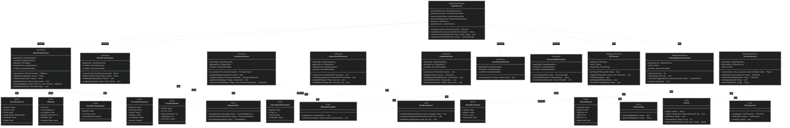

# Class Diagram — Application Layer（應用層）

> 來源：EDD.md §3.1 分層架構；ARCH.md §2.2 分層架構模式

```mermaid
%%{init: {"theme": "dark"}}%%
classDiagram
    direction TB

    %% ==================== COMMANDS (DTOs) ====================

    class ShootCommand {
        <<DTO>>
        + playerId: string
        + roomId: string
        + fishId: string
        + weaponType: WeaponType
        + sessionId: string
        + firedAt: Date
    }

    class EnterRoomCommand {
        <<DTO>>
        + playerId: string
        + roomType: string
        + preferredTableId: string?
    }

    class PurchaseCommand {
        <<DTO>>
        + playerId: string
        + productId: string
        + orderId: string
        + platform: string
        + receiptData: string
        + amount: number
    }

    class SubscribeVIPCommand {
        <<DTO>>
        + playerId: string
        + vipTier: int
        + orderId: string
        + receiptData: string
    }

    class RefundCommand {
        <<DTO>>
        + orderId: string
        + playerId: string
        + reason: string
        + requestedAt: Date
    }

    %% ==================== RESULTS (DTOs) ====================

    class HitResult {
        <<DTO>>
        + isHit: bool
        + coinsAwarded: int
        + rtpSnapshot: float
        + jackpotContributed: int
        + fishKilled: bool
        + animationType: string
    }

    class SessionResult {
        <<DTO>>
        + sessionId: string
        + playerId: string
        + finalCoins: int
        + isMVP: bool
        + killCount: int
        + rtpAchieved: float
    }

    class PurchaseResult {
        <<DTO>>
        + orderId: string
        + success: bool
        + diamondsGranted: int
        + newBalance: int
        + errorCode: string?
    }

    %% ==================== USE CASES ====================

    class ShootFishUseCase {
        <<UseCase>>
        - playerRepo: PlayerRepository
        - roomRepo: RoomRepository
        - rtpEngine: RTPEngine
        - jackpotService: JackpotService
        - eventBus: IDomainEventBus
        + execute(cmd: ShootCommand): HitResult
        - validatePlayer(playerId: string): Player
        - validateRoom(roomId: string): Room
        - validateFish(room: Room, fishId: string): Fish
        - calculateHit(player: Player, fish: Fish, room: Room): HitResult
        - publishEvents(events: DomainEvent[]): void
    }

    class EnterRoomUseCase {
        <<UseCase>>
        - playerRepo: PlayerRepository
        - roomRepo: RoomRepository
        - eventBus: IDomainEventBus
        + execute(cmd: EnterRoomCommand): Room
        - findOrCreateRoom(roomType: string): Room
        - validateAgeStatus(player: Player): void
        - assignPlayer(player: Player, room: Room): void
    }

    class PurchaseUseCase {
        <<UseCase>>
        - playerRepo: PlayerRepository
        - paymentPort: IPaymentPort
        - eventBus: IDomainEventBus
        + execute(cmd: PurchaseCommand): PurchaseResult
        - validateIdempotency(orderId: string): bool
        - verifyReceipt(cmd: PurchaseCommand): ReceiptVerifyResult
        - grantDiamonds(player: Player, amount: int): void
        - createTransaction(player: Player, cmd: PurchaseCommand): Transaction
    }

    class SubscribeVIPUseCase {
        <<UseCase>>
        - playerRepo: PlayerRepository
        - paymentPort: IPaymentPort
        - notificationPort: INotificationPort
        - eventBus: IDomainEventBus
        + execute(cmd: SubscribeVIPCommand): void
        - verifySubscription(cmd: SubscribeVIPCommand): bool
        - activateVIP(player: Player, tier: int): void
        - sendNotification(playerId: string, tier: int): void
    }

    class RefundUseCase {
        <<UseCase>>
        - playerRepo: PlayerRepository
        - paymentPort: IPaymentPort
        - eventBus: IDomainEventBus
        + execute(cmd: RefundCommand): void
        - findOrder(orderId: string): Transaction
        - validateRefundEligibility(order: Transaction): void
        - processRefund(order: Transaction): void
        - deductBalance(player: Player, amount: int): void
    }

    class LeaveRoomUseCase {
        <<UseCase>>
        - playerRepo: PlayerRepository
        - roomRepo: RoomRepository
        - eventBus: IDomainEventBus
        + execute(playerId: string, roomId: string): void
    }

    class SessionSettleUseCase {
        <<UseCase>>
        - playerRepo: PlayerRepository
        - roomRepo: RoomRepository
        - eventBus: IDomainEventBus
        + execute(sessionId: string): SessionResult[]
        - calculateMVP(session: GameSession): string
        - distributeRewards(results: SessionResult[]): void
    }

    %% ==================== APPLICATION SERVICES ====================

    class GameService {
        <<ApplicationService>>
        - shootFishUseCase: ShootFishUseCase
        - enterRoomUseCase: EnterRoomUseCase
        - leaveRoomUseCase: LeaveRoomUseCase
        - sessionSettleUseCase: SessionSettleUseCase
        - rtpService: RTPService
        - jackpotService: JackpotService
        + handleShoot(cmd: ShootCommand): HitResult
        + handleEnterRoom(cmd: EnterRoomCommand): Room
        + handleLeaveRoom(playerId: string, roomId: string): void
        + handleSessionEnd(sessionId: string): SessionResult[]
    }

    class RTPService {
        <<ApplicationService>>
        - rtpEngine: RTPEngine
        - cache: ICache
        - featureFlag: IFeatureFlag
        + getPlayerRTP(playerId: string): float
        + updateRTP(playerId: string, result: HitResult): void
        + isRTPDegraded(): bool
        + getDegradedFallbackRate(): float
        + overrideRTPTarget(target: float): void
    }

    class JackpotApplicationService {
        <<ApplicationService>>
        - jackpotService: JackpotService
        - cache: ICache
        - eventBus: IDomainEventBus
        + getPoolAmount(): int
        + contribute(amount: int): void
        + checkAndTrigger(playerId: string, sessionId: string): JackpotEvent?
        + emergencyDisable(): void
    }

    class AccountService {
        <<ApplicationService>>
        - playerRepo: PlayerRepository
        - tokenService: ITokenService
        - cache: ICache
        + register(email: string, password: string, birthdate: Date): Player
        + login(email: string, password: string): TokenPair
        + refreshToken(refreshToken: string): TokenPair
        + verifyAge(playerId: string): void
        + getProfile(playerId: string): Player
    }

    %% ==================== PORTS (Interfaces) ====================

    class IPaymentPort {
        <<Port>>
        + verifyAppleReceipt(receipt: string): ReceiptVerifyResult
        + verifyGoogleReceipt(receipt: string): ReceiptVerifyResult
        + processRefund(orderId: string): RefundResult
    }

    class INotificationPort {
        <<Port>>
        + sendPushNotification(userId: string, message: string): void
        + broadcastJackpot(winnerId: string, amount: int): void
        + sendVIPActivated(userId: string, tier: int): void
    }

    class IDomainEventBus {
        <<Port>>
        + publish(event: DomainEvent): void
        + subscribe(eventType: string, handler: EventHandler): void
    }

    class ICache {
        <<Port>>
        + get(key: string): string?
        + set(key: string, value: string, ttlSeconds: int): void
        + delete(key: string): void
        + increment(key: string, by: int): int
        + atomicGetAndSet(key: string, value: string): string?
    }

    class IFeatureFlag {
        <<Port>>
        + isEnabled(flagName: string): bool
        + getVariant(flagName: string): string
    }

    class ITokenService {
        <<Port>>
        + sign(payload: JWTPayload): TokenPair
        + verify(token: string): JWTPayload
        + revoke(jti: string): void
    }

    %% ==================== RELATIONSHIPS ====================

    ShootFishUseCase ..> ShootCommand : input
    ShootFishUseCase ..> HitResult : output
    EnterRoomUseCase ..> EnterRoomCommand : input
    PurchaseUseCase ..> PurchaseCommand : input
    PurchaseUseCase ..> PurchaseResult : output
    SubscribeVIPUseCase ..> SubscribeVIPCommand : input
    RefundUseCase ..> RefundCommand : input
    SessionSettleUseCase ..> SessionResult : output

    GameService --> ShootFishUseCase : delegates
    GameService --> EnterRoomUseCase : delegates
    GameService --> LeaveRoomUseCase : delegates
    GameService --> SessionSettleUseCase : delegates
    GameService --> RTPService : uses
    GameService --> JackpotApplicationService : uses

    ShootFishUseCase --> IPaymentPort : uses
    ShootFishUseCase --> IDomainEventBus : publishes
    PurchaseUseCase --> IPaymentPort : uses
    PurchaseUseCase --> IDomainEventBus : publishes
    SubscribeVIPUseCase --> IPaymentPort : uses
    SubscribeVIPUseCase --> INotificationPort : uses
    RefundUseCase --> IPaymentPort : uses

    AccountService --> ITokenService : uses
    AccountService --> ICache : uses
    RTPService --> ICache : uses
    RTPService --> IFeatureFlag : uses
    JackpotApplicationService --> ICache : uses
    JackpotApplicationService --> IDomainEventBus : publishes
```
