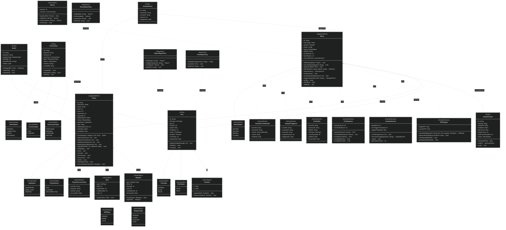

# Class Diagram — Domain Layer（領域層）

> 來源：EDD.md §5.5 資料模型；ARCH.md §4.1 Bounded Context；SCHEMA.md §3 資料表定義

```mermaid
%%{init: {"theme": "dark"}}%%
classDiagram
    direction TB

    %% ==================== ENUMS ====================

    class PlayerStatus {
        <<enumeration>>
        IDLE
        IN_ROOM
        DISCONNECTED
    }

    class FishStatus {
        <<enumeration>>
        ALIVE
        DEAD
    }

    class RoomStatus {
        <<enumeration>>
        WAITING
        PLAYING
        ENDING
        CLOSED
    }

    class WeaponType {
        <<enumeration>>
        NORMAL
        LASER
        SCATTER
        LOCK
    }

    class SkillType {
        <<enumeration>>
        FREEZE
        BOMB
        LOCK
    }

    class TransactionType {
        <<enumeration>>
        PURCHASE
        REWARD
        CONSUME
        REFUND
    }

    class CurrencyType {
        <<enumeration>>
        COIN
        DIAMOND
    }

    class FishType {
        <<enumeration>>
        NORMAL
        ELITE
        BOSS
    }

    class OrderStatus {
        <<enumeration>>
        PENDING
        COMPLETED
        FAILED
        REFUNDED
    }

    class AgeStatus {
        <<enumeration>>
        UNVERIFIED
        DEMO_ONLY
        VERIFIED
    }

    %% ==================== VALUE OBJECTS ====================

    class Weapon {
        <<ValueObject>>
        + type: WeaponType
        + level: int
        + damage: int
        + cost: int
        + cooldownMs: int
        + isUnlocked: bool
        + equals(other: Weapon): bool
        + upgrade(): Weapon
    }

    class Skill {
        <<ValueObject>>
        + type: SkillType
        + level: int
        + durationMs: int
        + cooldownMs: int
        + cost: int
        + equals(other: Skill): bool
    }

    class Money {
        <<ValueObject>>
        + amount: int
        + currency: CurrencyType
        + equals(other: Money): bool
        + add(other: Money): Money
        + subtract(other: Money): Money
        + isPositive(): bool
    }

    class Position {
        <<ValueObject>>
        + x: float
        + y: float
        + equals(other: Position): bool
        + distanceTo(other: Position): float
    }

    %% ==================== ENTITIES ====================

    class Fish {
        <<Entity>>
        + id: string
        + fishType: FishType
        + hp: int
        + maxHp: int
        + speed: float
        + multiplier: int
        + status: FishStatus
        + position: Position
        + coinValue: int
        + spawnedAt: Date
        + applyDamage(damage: int): void
        + isKilled(): bool
        + escape(): void
    }

    class Bullet {
        <<Entity>>
        + id: string
        + playerId: string
        + weaponType: WeaponType
        + damage: int
        + lockedFishId: string?
        + firedAt: Date
        + hitTarget(fish: Fish): HitResult
        + isMissed(): bool
        + isExpired(): bool
    }

    class GameSession {
        <<Entity>>
        + id: string
        + roomId: string
        + startedAt: Date
        + endedAt: Date?
        + rtpCurrent: float
        + playerCount: int
        + totalCoinsAwarded: int
        + status: RoomStatus
        + calculateRTP(): float
        + settle(): SessionResult
        + end(): void
    }

    class Transaction {
        <<Entity>>
        + id: string
        + playerId: string
        + amount: int
        + currency: CurrencyType
        + type: TransactionType
        + status: OrderStatus
        + orderId: string?
        + createdAt: Date
        + complete(): void
        + fail(reason: string): void
        + refund(): void
    }

    class JackpotEvent {
        <<Entity>>
        + id: string
        + sessionId: string
        + winnerId: string
        + amount: int
        + triggeredAt: Date
    }

    %% ==================== AGGREGATE ROOTS ====================

    class Player {
        <<AggregateRoot>>
        + id: string
        + nickname: string
        + email: string
        + level: int
        + coins: int
        + diamonds: int
        + vipLevel: int
        + vipExpiresAt: Date?
        + status: PlayerStatus
        + ageStatus: AgeStatus
        + role: string
        + failedLoginCount: int
        + lockedAt: Date?
        + createdAt: Date
        + shoot(weapon: Weapon, fish: Fish): Bullet
        + addCoins(amount: int): void
        + deductCoins(amount: int): void
        + addDiamonds(amount: int): void
        + deductDiamonds(amount: int): void
        + upgradeVIP(tier: int, expiresAt: Date): void
        + verifyAge(): void
        + lock(): void
        + unlock(): void
        + disconnect(): void
        + reconnect(): void
        + isVIP(): bool
        + canEnterRoom(): bool
        + canUseWeapon(weapon: Weapon): bool
    }

    class Room {
        <<AggregateRoot>>
        + id: string
        + roomType: string
        + players: Player[]
        + fishes: Fish[]
        + status: RoomStatus
        + tableId: string
        + jackpotPool: int
        + maxPlayers: int
        + currentSession: GameSession?
        + addPlayer(player: Player): void
        + removePlayer(playerId: string): void
        + spawnFish(fish: Fish): void
        + killFish(fishId: string, killerId: string): HitResult
        + startSession(): GameSession
        + endSession(): void
        + contributeJackpot(amount: int): void
        + triggerJackpot(winnerId: string): JackpotEvent?
        + isFull(): bool
        + isEmpty(): bool
        + addBot(): void
    }

    %% ==================== DOMAIN SERVICES ====================

    class RTPEngine {
        <<DomainService>>
        + targetRTP: float
        + currentRTP: float
        + calculateHit(playerId: string, fish: Fish, weapon: Weapon): HitResult
        + adjustHitProbability(currentRTP: float): float
        + isInDegradedMode(): bool
        + getDegradedHitRate(): float
    }

    class JackpotService {
        <<DomainService>>
        + globalPool: int
        + minTriggerThreshold: int
        + triggerProbability: float
        + contribute(amount: int): void
        + checkAndTrigger(playerId: string): JackpotEvent?
        + reset(): void
        + getPoolAmount(): int
    }

    class FishSpawner {
        <<DomainService>>
        + spawnInterval: int
        + maxFishInRoom: int
        + spawnFish(room: Room): Fish
        + scheduleWave(room: Room): void
        + createNormalFish(): Fish
        + createEliteFish(): Fish
        + createBossFish(): Fish
    }

    %% ==================== DOMAIN EVENTS ====================

    class FishKilled {
        <<DomainEvent>>
        + eventId: string
        + sessionId: string
        + killerId: string
        + fishType: FishType
        + coinsAwarded: int
        + rtpAtKill: float
        + occurredAt: Date
    }

    class JackpotTriggered {
        <<DomainEvent>>
        + eventId: string
        + sessionId: string
        + winnerId: string
        + jackpotAmount: int
        + triggeredAt: Date
    }

    class GameSessionEnded {
        <<DomainEvent>>
        + eventId: string
        + sessionId: string
        + results: SessionResult[]
        + mvpId: string
        + endedAt: Date
    }

    class PlayerDisconnected {
        <<DomainEvent>>
        + eventId: string
        + playerId: string
        + roomId: string
        + occurredAt: Date
    }

    %% ==================== INTERFACES ====================

    class PlayerRepository {
        <<Repository>>
        + findById(id: string): Player?
        + findByEmail(email: string): Player?
        + save(player: Player): void
        + delete(id: string): void
    }

    class RoomRepository {
        <<Repository>>
        + findById(id: string): Room?
        + findAvailable(): Room[]
        + save(room: Room): void
        + delete(id: string): void
    }

    class FishRepository {
        <<Repository>>
        + findByRoomId(roomId: string): Fish[]
        + save(fish: Fish): void
        + delete(id: string): void
    }

    %% ==================== RELATIONSHIPS ====================

    Room "1" *-- "4..6" Player : contains
    Room "1" *-- "0..*" Fish : contains
    Room "1" *-- "0..1" GameSession : currentSession
    Player "1" *-- "1" Weapon : equips
    Player "1" *-- "0..*" Skill : owns
    Fish "1" *-- "1" Position : at
    Bullet "1" --> "1" Fish : targets
    Bullet "1" --> "1" Player : firedBy
    Transaction "1" --> "1" Player : belongsTo
    JackpotEvent "1" --> "1" Room : triggeredIn
    JackpotEvent "1" --> "1" Player : winner

    Room ..> RTPEngine : uses
    Room ..> JackpotService : uses
    Room ..> FishSpawner : uses
    Room ..> FishKilled : emits
    Room ..> JackpotTriggered : emits
    Room ..> GameSessionEnded : emits
    Player ..> PlayerDisconnected : emits

    PlayerRepository ..> Player : manages
    RoomRepository ..> Room : manages
    FishRepository ..> Fish : manages

    Player -- PlayerStatus
    Fish -- FishStatus
    Room -- RoomStatus
    Weapon -- WeaponType
    Skill -- SkillType
    Transaction -- TransactionType
    Transaction -- CurrencyType
    Fish -- FishType
    Transaction -- OrderStatus
    Player -- AgeStatus
```
