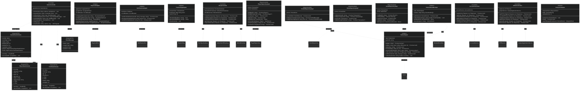

# Class Diagram — Infrastructure & Presentation Layer（基礎設施層 + 展示層）

> 來源：EDD.md §3.1 分層架構；ARCH.md §3.3 C4 Level 3；SCHEMA.md §3 資料表定義

```mermaid
%%{init: {"theme": "dark"}}%%
classDiagram
    direction TB

    %% ==================== PRESENTATION LAYER — CONTROLLERS ====================

    class GameController {
        <<Controller>>
        - gameService: GameService
        + onJoin(client: Client, options: JoinOptions): void
        + onLeave(client: Client, consented: bool): void
        + onShoot(client: Client, msg: ShootMessage): void
        + onSwitchWeapon(client: Client, msg: WeaponMessage): void
        + onUseSkill(client: Client, msg: SkillMessage): void
        + onCreate(options: RoomOptions): void
        + onDispose(): void
        + onAuth(token: string, options: any): JWTPayload
    }

    class ShopController {
        <<Controller>>
        - purchaseUseCase: PurchaseUseCase
        - subscribeVIPUseCase: SubscribeVIPUseCase
        - refundUseCase: RefundUseCase
        + createPurchase(req: Request, res: Response): Promise~void~
        + verifyReceipt(req: Request, res: Response): Promise~void~
        + subscribeVIP(req: Request, res: Response): Promise~void~
        + getOrders(req: Request, res: Response): Promise~void~
        + requestRefund(req: Request, res: Response): Promise~void~
    }

    class AccountController {
        <<Controller>>
        - accountService: AccountService
        + register(req: Request, res: Response): Promise~void~
        + login(req: Request, res: Response): Promise~void~
        + refreshToken(req: Request, res: Response): Promise~void~
        + getProfile(req: Request, res: Response): Promise~void~
        + updateProfile(req: Request, res: Response): Promise~void~
        + verifyAge(req: Request, res: Response): Promise~void~
    }

    class AdminController {
        <<Controller>>
        - rtpService: RTPService
        - jackpotService: JackpotApplicationService
        + getRTPConfig(req: Request, res: Response): Promise~void~
        + overrideRTP(req: Request, res: Response): Promise~void~
        + disableJackpot(req: Request, res: Response): Promise~void~
        + getKPI(req: Request, res: Response): Promise~void~
        + getAuditLogs(req: Request, res: Response): Promise~void~
        + banUser(req: Request, res: Response): Promise~void~
    }

    %% ==================== COLYSEUS SCHEMAS (RequestDTOs) ====================

    class GameRoomSchema {
        <<RequestDTO>>
        + roomId: string
        + roomType: string
        + status: string
        + playerCount: int
        + jackpotPool: int
        + startedAt: number
        + players: MapSchema~PlayerStateSchema~
        + fishes: MapSchema~FishStateSchema~
        + encode(): ArrayBuffer
        + decode(buffer: ArrayBuffer): void
    }

    class PlayerStateSchema {
        <<RequestDTO>>
        + id: string
        + nickname: string
        + coins: int
        + level: int
        + vipLevel: int
        + status: string
        + weaponType: string
        + x: float
        + y: float
        + encode(): ArrayBuffer
        + decode(buffer: ArrayBuffer): void
    }

    class FishStateSchema {
        <<RequestDTO>>
        + id: string
        + fishType: string
        + hp: int
        + maxHp: int
        + x: float
        + y: float
        + status: string
        + multiplier: int
        + encode(): ArrayBuffer
        + decode(buffer: ArrayBuffer): void
    }

    class ShootMessage {
        <<RequestDTO>>
        + fishId: string
        + weaponType: string
        + positionX: float
        + positionY: float
    }

    %% ==================== INFRASTRUCTURE — REPOSITORY IMPLEMENTATIONS ====================

    class PlayerRepositoryImpl {
        <<RepositoryImpl>>
        - prisma: PrismaClient
        - cache: RedisClient
        + findById(id: string): Promise~Player?~
        + findByEmail(email: string): Promise~Player?~
        + save(player: Player): Promise~void~
        + delete(id: string): Promise~void~
        - toEntity(record: UserRecord): Player
        - toPrismaModel(player: Player): UserRecord
        - cachePlayer(player: Player, ttl: int): Promise~void~
        - invalidateCache(playerId: string): Promise~void~
    }

    class RoomRepositoryImpl {
        <<RepositoryImpl>>
        - prisma: PrismaClient
        - cache: RedisClient
        + findById(id: string): Promise~Room?~
        + findAvailable(): Promise~Room[]~
        + save(room: Room): Promise~void~
        + delete(id: string): Promise~void~
        - toEntity(record: GameSessionRecord): Room
    }

    class FishKillRepositoryImpl {
        <<RepositoryImpl>>
        - prisma: PrismaClient
        + recordKill(kill: FishKillRecord): Promise~void~
        + findBySessionId(sessionId: string): Promise~FishKillRecord[]~
        + findByPlayerId(playerId: string, limit: int): Promise~FishKillRecord[]~
    }

    class OrderRepositoryImpl {
        <<RepositoryImpl>>
        - prisma: PrismaClient
        + findById(orderId: string): Promise~Transaction?~
        + findByUserId(userId: string): Promise~Transaction[]~
        + save(order: Transaction): Promise~void~
        + findByReceiptHash(hash: string): Promise~Transaction?~
    }

    %% ==================== INFRASTRUCTURE — ADAPTERS ====================

    class PaymentAdapter {
        <<Adapter>>
        - appleClient: AppleIAPClient
        - googleClient: GoogleIAPClient
        - circuitBreaker: CircuitBreaker
        + verifyAppleReceipt(receipt: string): ReceiptVerifyResult
        + verifyGoogleReceipt(receipt: string): ReceiptVerifyResult
        + processRefund(orderId: string): RefundResult
        - mapAppleResponse(raw: AppleResponse): ReceiptVerifyResult
        - mapGoogleResponse(raw: GoogleResponse): ReceiptVerifyResult
    }

    class RedisAdapter {
        <<Adapter>>
        - client: RedisClient
        - keyPrefix: string
        + get(key: string): Promise~string?~
        + set(key: string, value: string, ttlSeconds: int): Promise~void~
        + delete(key: string): Promise~void~
        + increment(key: string, by: int): Promise~int~
        + atomicGetAndSet(key: string, value: string): Promise~string?~
        + evalLua(script: string, keys: string[], args: string[]): Promise~any~
        + publish(channel: string, message: string): Promise~void~
        + subscribe(channel: string, handler: Function): void
    }

    class DomainEventBusImpl {
        <<Adapter>>
        - redis: RedisAdapter
        - handlers: Map~string, EventHandler[]~
        + publish(event: DomainEvent): Promise~void~
        + subscribe(eventType: string, handler: EventHandler): void
        - serialize(event: DomainEvent): string
        - deserialize(json: string): DomainEvent
    }

    class NotificationAdapter {
        <<Adapter>>
        - fcmClient: FCMClient
        - circuitBreaker: CircuitBreaker
        + sendPushNotification(userId: string, message: string): Promise~void~
        + broadcastJackpot(winnerId: string, amount: int): Promise~void~
        + sendVIPActivated(userId: string, tier: int): Promise~void~
    }

    class FeatureFlagAdapter {
        <<Adapter>>
        - unleashClient: UnleashClient
        - localCache: Map~string, bool~
        - cacheTTLMs: int
        + isEnabled(flagName: string): bool
        + getVariant(flagName: string): string
        - refreshCache(): void
    }

    class AnalyticsAdapter {
        <<Adapter>>
        - mixpanelClient: MixpanelClient
        - buffer: DomainEvent[]
        - maxBufferSize: int
        + track(event: DomainEvent): void
        + flush(): Promise~void~
        - mapToMixpanelEvent(event: DomainEvent): MixpanelEvent
    }

    %% ==================== RELATIONSHIPS ====================

    GameController --> GameRoomSchema : manages state
    GameController ..> PlayerStateSchema : sync
    GameController ..> FishStateSchema : sync
    GameController ..> ShootMessage : receives

    GameRoomSchema "1" *-- "0..*" PlayerStateSchema : players
    GameRoomSchema "1" *-- "0..*" FishStateSchema : fishes

    PlayerRepositoryImpl ..|> PlayerRepository : implements
    RoomRepositoryImpl ..|> RoomRepository : implements
    PaymentAdapter ..|> IPaymentPort : implements
    RedisAdapter ..|> ICache : implements
    DomainEventBusImpl ..|> IDomainEventBus : implements
    NotificationAdapter ..|> INotificationPort : implements
    FeatureFlagAdapter ..|> IFeatureFlag : implements

    DomainEventBusImpl --> RedisAdapter : uses
    PlayerRepositoryImpl --> RedisAdapter : caches
    RoomRepositoryImpl --> RedisAdapter : caches

    ShopController --> PurchaseUseCase : calls
    ShopController --> SubscribeVIPUseCase : calls
    ShopController --> RefundUseCase : calls
    AccountController --> AccountService : calls
    AdminController --> RTPService : calls
    AdminController --> JackpotApplicationService : calls
```
