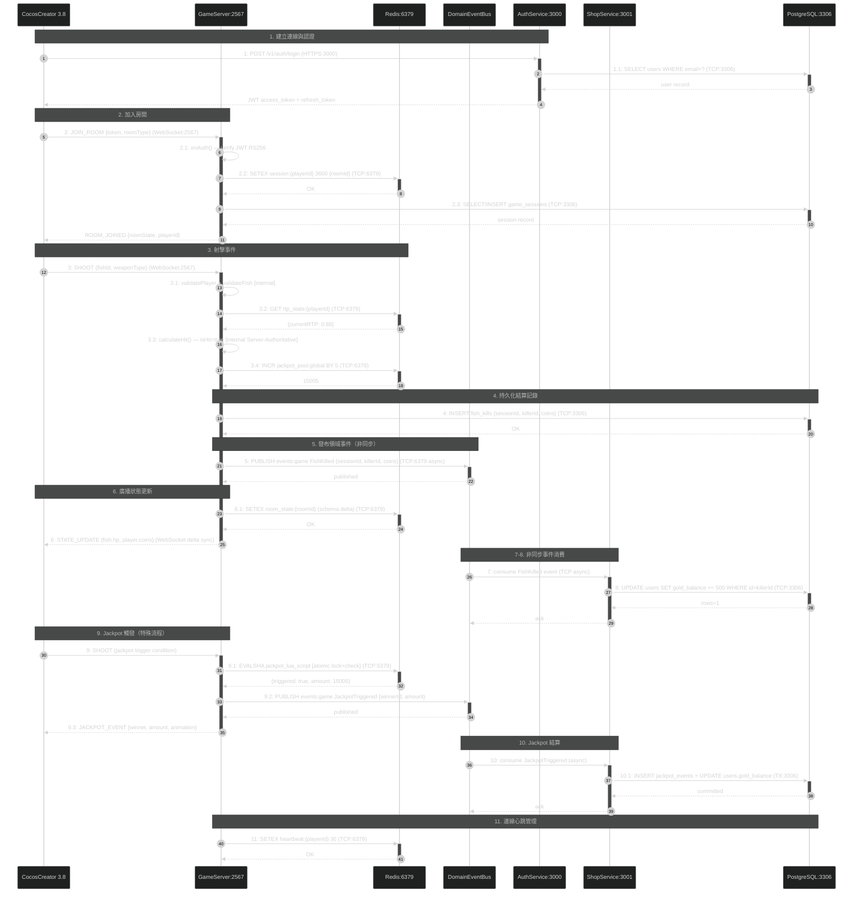

# Communication Diagram — 通訊圖（捕魚遊戲核心訊息流）

> 來源：ARCH.md §5.1 通訊模式；ARCH.md §5.2 Domain Event 清單；EDD.md §4.5 Domain Events

```mermaid
%%{init: {"theme": "dark"}}%%
sequenceDiagram
    autonumber
    participant Client as CocosCreator 3.8
    participant GS as GameServer:2567
    participant Redis as Redis:6379
    participant NATS as DomainEventBus
    participant Auth as AuthService:3000
    participant Shop as ShopService:3001
    participant PG as PostgreSQL:3306

    Note over Client,Auth: 1. 建立連線與認證
    Client->>+Auth: 1: POST /v1/auth/login (HTTPS:3000)
    Auth->>+PG: 1.1: SELECT users WHERE email=? (TCP:3306)
    PG-->>-Auth: user record
    Auth-->>-Client: JWT access_token + refresh_token

    Note over Client,GS: 2. 加入房間
    Client->>+GS: 2: JOIN_ROOM {token, roomType} (WebSocket:2567)
    GS->>GS: 2.1: onAuth() — verify JWT RS256
    GS->>+Redis: 2.2: SETEX session:{playerId} 3600 {roomId} (TCP:6379)
    Redis-->>-GS: OK
    GS->>+PG: 2.3: SELECT/INSERT game_sessions (TCP:3306)
    PG-->>-GS: session record
    GS-->>-Client: ROOM_JOINED {roomState, playerId}

    Note over Client,Redis: 3. 射擊事件
    Client->>+GS: 3: SHOOT {fishId, weaponType} (WebSocket:2567)
    GS->>GS: 3.1: validatePlayer + validateFish [internal]
    GS->>+Redis: 3.2: GET rtp_state:{playerId} (TCP:6379)
    Redis-->>-GS: {currentRTP: 0.88}
    GS->>GS: 3.3: calculateHit() — isHit=true [internal Server-Authoritative]
    GS->>+Redis: 3.4: INCR jackpot_pool:global BY 5 (TCP:6379)
    Redis-->>-GS: 15005

    Note over GS,PG: 4. 持久化結算記錄
    GS->>+PG: 4: INSERT fish_kills {sessionId, killerId, coins} (TCP:3306)
    PG-->>-GS: OK

    Note over GS,NATS: 5. 發布領域事件（非同步）
    GS->>+NATS: 5: PUBLISH events:game FishKilled {sessionId, killerId, coins} (TCP:6379 async)
    NATS-->>-GS: published

    Note over GS,Client: 6. 廣播狀態更新
    GS->>+Redis: 6.1: SETEX room_state:{roomId} (schema delta) (TCP:6379)
    Redis-->>-GS: OK
    GS-->>-Client: 6: STATE_UPDATE {fish.hp, player.coins} (WebSocket delta sync)

    Note over NATS,Shop: 7-8. 非同步事件消費
    NATS->>+Shop: 7: consume FishKilled event (TCP async)
    Shop->>+PG: 8: UPDATE users SET gold_balance += 500 WHERE id=killerId (TCP:3306)
    PG-->>-Shop: rows=1
    Shop-->>-NATS: ack

    Note over Client,GS: 9. Jackpot 觸發（特殊流程）
    Client->>+GS: 9: SHOOT (jackpot trigger condition)
    GS->>+Redis: 9.1: EVALSHA jackpot_lua_script [atomic lock+check] (TCP:6379)
    Redis-->>-GS: {triggered: true, amount: 15005}
    GS->>+NATS: 9.2: PUBLISH events:game JackpotTriggered {winnerId, amount}
    NATS-->>-GS: published
    GS-->>-Client: 9.3: JACKPOT_EVENT {winner, amount, animation}

    Note over NATS,Shop: 10. Jackpot 結算
    NATS->>+Shop: 10: consume JackpotTriggered (async)
    Shop->>+PG: 10.1: INSERT jackpot_events + UPDATE users.gold_balance (TX:3306)
    PG-->>-Shop: committed
    Shop-->>-NATS: ack

    Note over GS,PG: 11. 連線心跳管理
    GS->>+Redis: 11: SETEX heartbeat:{playerId} 30 (TCP:6379)
    Redis-->>-GS: OK
```
