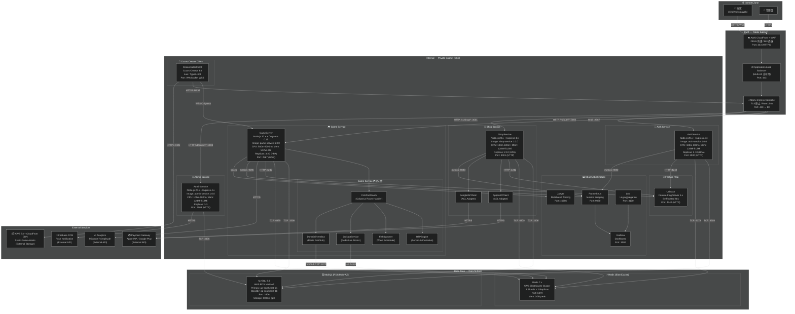

# Component Diagram — 系統元件圖

> 來源：ARCH.md §3.2 C4 Container；ARCH.md §11 技術棧；EDD.md §3.3 技術棧總覽

```mermaid
%%{init: {"theme": "dark"}}%%
graph TB
    subgraph Internet["🌐 Internet Zone"]
        Players["👥 玩家\n(iOS/Android/Web)"]
        Admin["👤 管理員"]
    end

    subgraph DMZ["DMZ — Public Subnet"]
        CloudFront["☁️ AWS CloudFront + WAF\nDDoS 防護 / Bot 過濾\nPort: 443 (HTTPS)"]
        ALB["⚖️ Application Load Balancer\n(Multi-AZ 高可用)\nPort: 443"]
        Ingress["🔀 Nginx Ingress Controller\nTLS 終止 / Rate Limit\nPort: 443 → 80"]
    end

    subgraph Internal["Internal — Private Subnet (EKS)"]
        direction TB

        subgraph ClientComponent["📱 Cocos Creator Client"]
            CocosClient["CocosCratorClient\nCocos Creator 3.8\nLua / TypeScript\nPort: WebSocket WSS"]
        end

        subgraph GameComponent["🎮 Game Service"]
            GameServer["GameServer\nNode.js 20.x + Colyseus 0.15\nImage: game-service:1.0.0\nCPU: 500m-2000m / Mem: 512Mi-2Gi\nReplicas: 3-20 (HPA)\nPort: 2567 (WSS)"]
            subgraph GameInternals["Game Service 內部元件"]
                FishPoolRoom["FishPoolRoom\n(Colyseus Room Handler)"]
                RTPEngineComp["RTPEngine\n(Server-Authoritative)"]
                FishSpawnerComp["FishSpawner\n(Wave Scheduler)"]
                JackpotServiceComp["JackpotService\n(Redis Lua Atomic)"]
                DomainEventBusComp["DomainEventBus\n(Redis Pub/Sub)"]
            end
        end

        subgraph AuthComponent["🔐 Auth Service"]
            AuthService["AuthService\nNode.js 20.x + Express 4.x\nImage: auth-service:1.0.0\nCPU: 100m-500m / Mem: 128Mi-512Mi\nReplicas: 2-10 (HPA)\nPort: 3000 (HTTP)"]
        end

        subgraph ShopComponent["🛒 Shop Service"]
            ShopService["ShopService\nNode.js 20.x + Express 4.x\nImage: shop-service:1.0.0\nCPU: 100m-500m / Mem: 128Mi-512Mi\nReplicas: 2-10 (HPA)\nPort: 3001 (HTTP)"]
            AppleIAPClient["AppleIAPClient\n(ACL Adapter)"]
            GoogleIAPClient["GoogleIAPClient\n(ACL Adapter)"]
        end

        subgraph AdminComponent["👑 Admin Service"]
            AdminService["AdminService\nNode.js 20.x + Express 4.x\nImage: admin-service:1.0.0\nCPU: 100m-500m / Mem: 128Mi-512Mi\nReplicas: 1-3\nPort: 3003 (HTTP)"]
        end

        subgraph FeatureFlag["🚩 Feature Flag"]
            Unleash["Unleash\nFeature Flag Server 5.x\nSelf-hosted k8s\nPort: 4242 (HTTP)"]
        end

        subgraph Observability["📊 Observability Stack"]
            Prometheus["Prometheus\nMetrics Scraping\nPort: 9090"]
            Grafana["Grafana\nDashboard\nPort: 3000"]
            Jaeger["Jaeger\nDistributed Tracing\nPort: 16686"]
            Loki["Loki\nLog Aggregation\nPort: 3100"]
        end
    end

    subgraph DataZone["Data Zone — Data Subnet"]
        subgraph DBComponent["🗄️ MySQL (RDS Multi-AZ)"]
            PostgreSQL["MySQL 8.0\nAWS RDS Multi-AZ\nPrimary: ap-southeast-1a\nStandby: ap-southeast-1b\nPort: 3306\nStorage: 500GB gp3"]
        end

        subgraph CacheComponent["⚡ Redis (ElastiCache)"]
            Redis["Redis 7.x\nAWS ElastiCache Cluster\n3 Shards × 2 Replicas\nPort: 6379\nMem: 2GB peak"]
        end
    end

    subgraph ExternalServices["External Services"]
        PaymentGateway["💳 Payment Gateway\nApple IAP / Google Play\n(External API)"]
        AnalyticsService["📈 Analytics\nMixpanel / Amplitude\n(External API)"]
        FCM["🔔 Firebase FCM\nPush Notification\n(External API)"]
        AWSS3["🗂️ AWS S3 + CloudFront CDN\nStatic Game Assets\n(External Storage)"]
    end

    %% ===== CONNECTION FLOWS =====

    Players -->|"HTTPS/WSS"| CloudFront
    Admin -->|"HTTPS"| CloudFront
    CloudFront --> ALB --> Ingress

    Ingress -->|"WSS :2567"| GameServer
    Ingress -->|"HTTP /v1/auth/* :3000"| AuthService
    Ingress -->|"HTTP /v1/shop/* :3001"| ShopService
    Ingress -->|"HTTP /v1/admin/* :3003"| AdminService

    CocosClient -->|"WSS Colyseus"| GameServer
    CocosClient -->|"HTTPS REST"| Ingress
    CocosClient -->|"HTTPS CDN"| AWSS3

    GameServer --> FishPoolRoom --> RTPEngineComp
    FishPoolRoom --> FishSpawnerComp
    FishPoolRoom --> JackpotServiceComp
    FishPoolRoom --> DomainEventBusComp

    GameServer -->|"TCP :3306"| PostgreSQL
    GameServer -->|"TCP :6379"| Redis
    AuthService -->|"TCP :3306"| PostgreSQL
    AuthService -->|"TCP :6379"| Redis
    ShopService -->|"TCP :3306"| PostgreSQL
    ShopService -->|"TCP :6379"| Redis
    AdminService -->|"TCP :3306"| PostgreSQL

    GameServer -->|"HTTP :4242"| Unleash
    AuthService -->|"HTTP :4242"| Unleash
    ShopService -->|"HTTP :4242"| Unleash

    JackpotServiceComp -->|"Lua Script"| Redis
    DomainEventBusComp -->|"Pub/Sub TCP :6379"| Redis

    ShopService --> AppleIAPClient -->|"HTTPS"| PaymentGateway
    ShopService --> GoogleIAPClient -->|"HTTPS"| PaymentGateway

    GameServer -->|"HTTPS"| AnalyticsService
    AdminService -->|"HTTPS"| FCM

    GameServer -->|"metrics :9090"| Prometheus
    AuthService -->|"metrics :9090"| Prometheus
    ShopService -->|"metrics :9090"| Prometheus
    Prometheus --> Grafana
    GameServer -->|"traces"| Jaeger
    Loki --> Grafana
```
