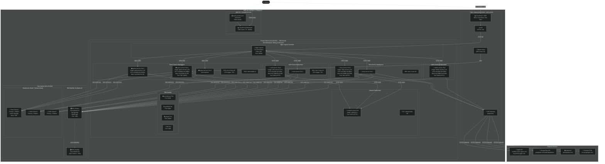

# Deployment Diagram — 部署架構圖

> 來源：ARCH.md §9.4 Network Architecture VPC 拓撲；EDD.md §7.3 k8s 資源規格；ARCH.md §7.1 HA 策略

```mermaid
%%{init: {"theme": "dark"}}%%
graph TB
    Internet(["🌐 Internet"])

    subgraph AWS["AWS ap-southeast-1 (Singapore)"]

        subgraph PublicSubnet["Public Subnet (10.0.0.0/24 + 10.0.1.0/24)"]
            direction LR
            CloudFrontWAF["☁️ CloudFront + WAF\nDDoS / Geo Block / Bot Filter"]
            ALB["⚖️ ALB\nHTTPS :443"]
            NAT["🔀 NAT Gateway\n(Outbound)"]
            Bastion["🔐 Bastion Host\n(SSH Jump :22)"]
        end

        subgraph PrivateSubnet["Private Subnet (10.0.10.0/23) — EKS Cluster"]
            direction TB

            subgraph Namespace["k8s Namespace: fishing-arcade-prod"]

                subgraph GameDeploy["Game Service Deployment"]
                    GamePod1["🎮 game-service Pod 1\nimage: game-service:1.0.0\nCPU req:500m lim:2000m\nMem req:512Mi lim:2Gi\nPort: 2567 (WSS)"]
                    GamePod2["🎮 game-service Pod 2\nimage: game-service:1.0.0\nCPU req:500m lim:2000m\nMem req:512Mi lim:2Gi"]
                    GamePod3["🎮 game-service Pod 3\n(min replicas)"]
                    GameHPA["HPA: min=3 max=20\nCPU trigger: 70%"]
                    GamePDB["PDB: minAvailable=2"]
                end

                subgraph AuthDeploy["Auth Service Deployment"]
                    AuthPod1["🔐 auth-service Pod 1\nimage: auth-service:1.0.0\nCPU req:100m lim:500m\nMem req:128Mi lim:512Mi\nPort: 3000 (HTTP)"]
                    AuthPod2["🔐 auth-service Pod 2"]
                    AuthHPA["HPA: min=2 max=10\nCPU trigger: 70%"]
                end

                subgraph ShopDeploy["Shop Service Deployment"]
                    ShopPod1["🛒 shop-service Pod 1\nimage: shop-service:1.0.0\nCPU req:100m lim:500m\nMem req:128Mi lim:512Mi\nPort: 3001 (HTTP)"]
                    ShopPod2["🛒 shop-service Pod 2"]
                    ShopHPA["HPA: min=2 max=10"]
                end

                subgraph AdminDeploy["Admin Service Deployment"]
                    AdminPod["👑 admin-service Pod\nimage: admin-service:1.0.0\nCPU req:100m lim:500m\nMem req:128Mi lim:512Mi\nPort: 3003 (HTTP)"]
                end

                subgraph IngressDeploy["Nginx Ingress Controller"]
                    NginxIngress["🔀 Nginx Ingress\nTLS Termination\nRate Limit\nPort: 443/80"]
                end

                subgraph UnleashDeploy["Unleash Deployment"]
                    UnleashPod["🚩 unleash-server Pod\nimage: unleash:5.x\nPort: 4242 (HTTP)"]
                    UnleashPVC["PVC: unleash-data\n1Gi"]
                end

                subgraph ObsDeploy["Observability"]
                    PromPod["📊 prometheus Pod\nPort: 9090"]
                    GrafanaPod["📈 grafana Pod\nPort: 3000"]
                    JaegerPod["🔍 jaeger Pod\nPort: 16686"]
                    LokiPod["📝 loki Pod\nPort: 3100"]
                end
            end
        end

        subgraph DataSubnet["Data Subnet (10.0.20.0/24)"]
            direction LR

            subgraph RDSCluster["RDS MySQL 8.0 (Multi-AZ)"]
                RDSPrimary["🗄️ RDS Primary\nap-southeast-1a\ndb.r6g.large\n500GB gp3\nPort: 3306"]
                RDSStandby["🗄️ RDS Standby\nap-southeast-1b\n(Auto Failover < 60s)"]
            end

            subgraph ElastiCacheCluster["ElastiCache Redis 7 (Cluster Mode)"]
                RedisShard1["⚡ Redis Shard 1\nPrimary + Replica\ncache.r6g.large\nMem: 2GB"]
                RedisShard2["⚡ Redis Shard 2\nPrimary + Replica"]
                RedisShard3["⚡ Redis Shard 3\nPrimary + Replica"]
            end
        end

        subgraph S3["AWS S3 + CloudFront CDN"]
            S3Bucket["🗂️ game-assets-prod\nS3 Bucket\nStatic Assets"]
            CDNDistrib["☁️ CloudFront Distribution\nCDN Cache TTL: 86400s"]
        end

    end

    subgraph External["External Services"]
        AppleIAP["🍎 Apple IAP\nsandbox.itunes.apple.com\nbuy.itunes.apple.com"]
        GoogleIAP["🤖 Google Play IAP\ngoogleapis.com/androidpublisher"]
        Mixpanel["📊 Mixpanel\napi.mixpanel.com"]
        FCMService["🔔 Firebase FCM\nfcm.googleapis.com"]
    end

    Internet -->|"HTTPS/WSS :443"| CloudFrontWAF
    CloudFrontWAF --> ALB
    ALB -->|"HTTP :80"| NginxIngress
    NginxIngress -->|"WSS :2567"| GamePod1
    NginxIngress -->|"WSS :2567"| GamePod2
    NginxIngress -->|"WSS :2567"| GamePod3
    NginxIngress -->|"HTTP :3000"| AuthPod1
    NginxIngress -->|"HTTP :3000"| AuthPod2
    NginxIngress -->|"HTTP :3001"| ShopPod1
    NginxIngress -->|"HTTP :3001"| ShopPod2
    NginxIngress -->|"HTTP :3003"| AdminPod

    GamePod1 & GamePod2 & GamePod3 -->|"TCP :3306 TLS"| RDSPrimary
    GamePod1 & GamePod2 & GamePod3 -->|"TCP :6379 TLS"| RedisShard1
    AuthPod1 & AuthPod2 -->|"TCP :3306 TLS"| RDSPrimary
    AuthPod1 & AuthPod2 -->|"TCP :6379 TLS"| RedisShard2
    ShopPod1 & ShopPod2 -->|"TCP :3306 TLS"| RDSPrimary
    ShopPod1 & ShopPod2 -->|"TCP :6379 TLS"| RedisShard3
    AdminPod -->|"TCP :3306 TLS"| RDSPrimary

    RDSPrimary -.->|"sync replication"| RDSStandby

    GamePod1 -->|"HTTP :4242"| UnleashPod
    AuthPod1 -->|"HTTP :4242"| UnleashPod
    ShopPod1 -->|"HTTP :4242"| UnleashPod

    NAT -->|"HTTPS outbound"| AppleIAP
    NAT -->|"HTTPS outbound"| GoogleIAP
    NAT -->|"HTTPS outbound"| Mixpanel
    NAT -->|"HTTPS outbound"| FCMService

    ShopPod1 & ShopPod2 --> NAT
    AdminPod --> NAT

    S3Bucket --> CDNDistrib
    Internet -->|"CDN Assets"| CDNDistrib
    Bastion -->|"SSH"| GamePod1
```
