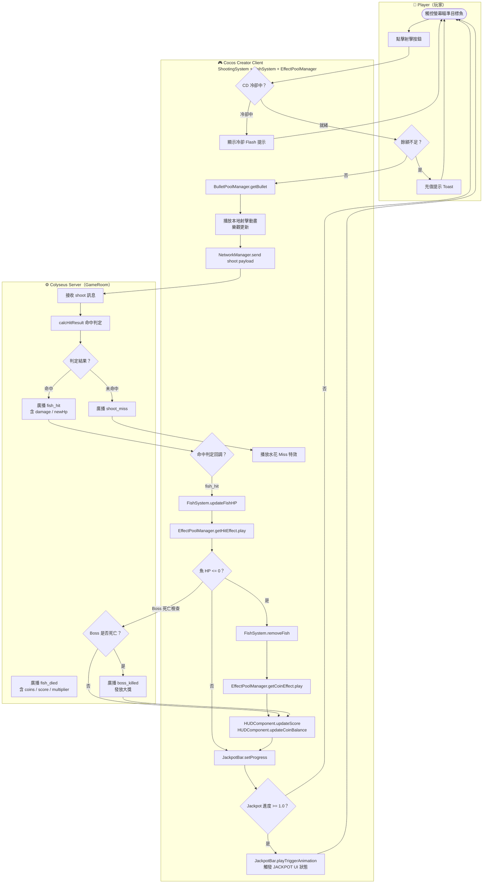

# 遊戲主流程活動圖（泳道）

> 來源：FRONTEND.md §game/systems / §game/managers

```mermaid
flowchart TD
    subgraph Player["👤 Player（玩家）"]
        A1([觸控螢幕瞄準目標魚])
        A2[點擊射擊按鈕]
        A7{餘額不足？}
        A8[充值提示 Toast]
    end

    subgraph Client["🎮 Cocos Creator Client\nShootingSystem + FishSystem + EffectPoolManager"]
        B1{CD 冷卻中？}
        B2[顯示冷卻 Flash 提示]
        B3[播放本地射擊動畫\n樂觀更新]
        B4[BulletPoolManager.getBullet]
        B5[NetworkManager.send shoot payload]
        B6{命中判定回調？}
        B7[FishSystem.updateFishHP]
        B8[EffectPoolManager.getHitEffect.play]
        B9{魚 HP <= 0？}
        B10[FishSystem.removeFish]
        B11[EffectPoolManager.getCoinEffect.play]
        B12[HUDComponent.updateScore\nHUDComponent.updateCoinBalance]
        B13[JackpotBar.setProgress]
        B14{Jackpot 進度 >= 1.0？}
        B15[JackpotBar.playTriggerAnimation\n觸發 JACKPOT UI 狀態]
        B16[播放水花 Miss 特效]
    end

    subgraph Server["⚙️ Colyseus Server（GameRoom）"]
        C1[接收 shoot 訊息]
        C2[calcHitResult 命中判定]
        C3{判定結果？}
        C4[廣播 fish_hit\n含 damage / newHp]
        C5[廣播 fish_died\n含 coins / score / multiplier]
        C6{Boss 是否死亡？}
        C7[廣播 boss_killed\n發放大獎]
        C8[廣播 shoot_miss]
    end

    A1 --> A2
    A2 --> B1
    B1 -- 冷卻中 --> B2
    B2 --> A1
    B1 -- 就緒 --> A7
    A7 -- 是 --> A8
    A8 --> A1
    A7 -- 否 --> B4
    B4 --> B3
    B3 --> B5
    B5 --> C1
    C1 --> C2
    C2 --> C3
    C3 -- 命中 --> C4
    C3 -- 未命中 --> C8
    C4 --> B6
    C8 --> B16
    B6 -- fish_hit --> B7
    B7 --> B8
    B8 --> B9
    B9 -- 否 --> B13
    B9 -- 是 --> B10
    B10 --> B11
    B11 --> B12
    B12 --> B13
    B13 --> B14
    B14 -- 否 --> A1
    B14 -- 是 --> B15
    B15 --> A1

    B9 -- Boss 死亡檢查 --> C6
    C6 -- 是 --> C7
    C6 -- 否 --> B12
    C7 --> B12
```
