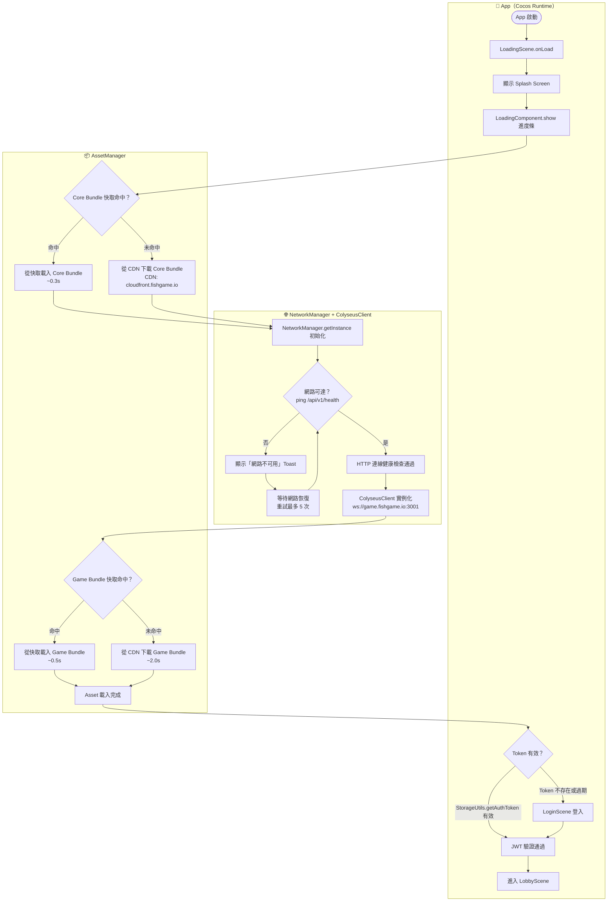

# 遊戲初始化流程活動圖（泳道）

> 來源：FRONTEND.md §常駐節點（PersistentCanvas）/ §network/NetworkManager

```mermaid
flowchart TD
    subgraph AppRuntime["📱 App（Cocos Runtime）"]
        A1([App 啟動])
        A2[LoadingScene.onLoad]
        A3[顯示 Splash Screen]
        A4[LoadingComponent.show 進度條]
        A16{Token 有效？}
        A17[LoginScene 登入]
        A18[JWT 驗證通過]
        A19[進入 LobbyScene]
    end

    subgraph NetworkLayer["🌐 NetworkManager + ColyseusClient"]
        B1[NetworkManager.getInstance 初始化]
        B2{網路可達？\nping /api/v1/health}
        B3[顯示「網路不可用」Toast]
        B4[等待網路恢復\n重試最多 5 次]
        B5[HTTP 連線健康檢查通過]
        B6[ColyseusClient 實例化\nws://game.fishgame.io:3001]
    end

    subgraph AssetMgr["📦 AssetManager"]
        C1{Core Bundle 快取命中？}
        C2[從快取載入 Core Bundle\n~0.3s]
        C3[從 CDN 下載 Core Bundle\nCDN: cloudfront.fishgame.io]
        C4{Game Bundle 快取命中？}
        C5[從快取載入 Game Bundle\n~0.5s]
        C6[從 CDN 下載 Game Bundle\n~2.0s]
        C7[Asset 載入完成]
    end

    A1 --> A2
    A2 --> A3
    A3 --> A4
    A4 --> C1
    C1 -- 命中 --> C2
    C1 -- 未命中 --> C3
    C2 --> B1
    C3 --> B1
    B1 --> B2
    B2 -- 否 --> B3
    B3 --> B4
    B4 --> B2
    B2 -- 是 --> B5
    B5 --> B6
    B6 --> C4
    C4 -- 命中 --> C5
    C4 -- 未命中 --> C6
    C5 --> C7
    C6 --> C7
    C7 --> A16
    A16 -- StorageUtils.getAuthToken 有效 --> A18
    A16 -- Token 不存在或過期 --> A17
    A17 --> A18
    A18 --> A19
```
