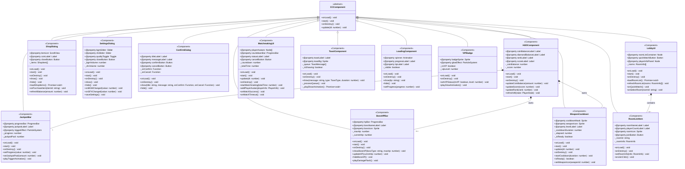

# 前端類別圖：UI 元件層

> 來源：FRONTEND.md §ui/hud / §ui/dialogs / §ui/lobby / §ui/common

```mermaid
classDiagram
    class CCComponent {
        <<abstract>>
        +onLoad() void
        +start() void
        +onDestroy() void
        +update(dt: number) void
    }

    class HUDComponent {
        <<Component>>
        +@property coinBalanceLabel: Label
        +@property diamondBalanceLabel: Label
        +@property rankLabel: Label
        +@property scoreLabel: Label
        -_coinBalance: number
        -_score: number
        +onLoad() void
        +start() void
        +onDestroy() void
        +updateCoinBalance(amount: number) void
        +updateScore(score: number) void
        +updateRank(rank: number) void
        +refreshAll(state: PlayerState) void
    }

    class JackpotBar {
        <<Component>>
        +@property progressBar: ProgressBar
        +@property jackpotLabel: Label
        +@property triggerEffect: ParticleSystem
        -_progress: number
        -_jackpotPool: number
        +onLoad() void
        +start() void
        +onDestroy() void
        +setProgress(value: number) void
        +setJackpotPool(amount: number) void
        +playTriggerAnimation() void
    }

    class BossHPBar {
        <<Component>>
        <<Component>>
        +@property hpBar: ProgressBar
        +@property bossNameLabel: Label
        +@property bossIcon: Sprite
        -_maxHp: number
        -_currentHp: number
        +onLoad() void
        +start() void
        +onDestroy() void
        +showBossHP(bossType: string, maxHp: number) void
        +updateHP(currentHp: number) void
        +hideBossHP() void
        +playDamageFlash() void
    }

    class WeaponCooldown {
        <<Component>>
        +@property cooldownMask: Sprite
        +@property weaponIcon: Sprite
        +@property levelLabel: Label
        -_cooldownDuration: number
        -_elapsed: number
        -_isReady: boolean
        +onLoad() void
        +start() void
        +update(dt: number) void
        +onDestroy() void
        +startCooldown(duration: number) void
        +isReady() boolean
        +setWeaponIcon(weaponId: number) void
    }

    class ShopDialog {
        <<Component>>
        +@property itemList: ScrollView
        +@property coinLabel: Label
        +@property closeButton: Button
        -_items: ShopItem[]
        +onLoad() void
        +start() void
        +onDestroy() void
        +show() void
        +hide() void
        +loadShopItems() Promise~void~
        +onPurchaseItem(itemId: string) void
        +refreshBalance(amount: number) void
    }

    class SettingsDialog {
        <<Component>>
        +@property bgmSlider: Slider
        +@property sfxSlider: Slider
        +@property qualityToggle: Toggle
        +@property closeButton: Button
        -_bgmVolume: number
        -_sfxVolume: number
        +onLoad() void
        +start() void
        +onDestroy() void
        +show() void
        +hide() void
        +onBGMChanged(value: number) void
        +onSFXChanged(value: number) void
        +saveSettings() void
    }

    class ConfirmDialog {
        <<Component>>
        +@property titleLabel: Label
        +@property messageLabel: Label
        +@property confirmButton: Button
        +@property cancelButton: Button
        -_onConfirm: Function
        -_onCancel: Function
        +onLoad() void
        +onDestroy() void
        +show(title: string, message: string, onConfirm: Function, onCancel: Function) void
        +hide() void
    }

    class LobbyUI {
        <<Component>>
        +@property roomListContainer: Node
        +@property quickMatchButton: Button
        +@property playerInfoPanel: Node
        -_rooms: RoomInfo[]
        +onLoad() void
        +start() void
        +onDestroy() void
        +loadRoomList() Promise~void~
        +refreshRoomList(rooms: RoomInfo[]) void
        +onQuickMatch() void
        +onSelectRoom(roomId: string) void
    }

    class RoomListItem {
        <<Component>>
        +@property roomNameLabel: Label
        +@property playerCountLabel: Label
        +@property roomIcon: Sprite
        +@property joinButton: Button
        -_roomId: string
        -_roomInfo: RoomInfo
        +onLoad() void
        +onDestroy() void
        +setRoomInfo(info: RoomInfo) void
        +onJoinClick() void
    }

    class MatchmakingUI {
        <<Component>>
        +@property playerAvatars: Node[]
        +@property countdownBar: ProgressBar
        +@property statusLabel: Label
        +@property cancelButton: Button
        -_countdown: number
        -_totalTime: number
        +onLoad() void
        +start() void
        +update(dt: number) void
        +onDestroy() void
        +startMatchmaking(totalTime: number) void
        +addPlayerAvatar(playerInfo: PlayerInfo) void
        +onMatchSuccess() void
        +onMatchTimeout() void
    }

    class ToastComponent {
        <<Component>>
        +@property toastLabel: Label
        +@property toastBg: Sprite
        -_queue: ToastMessage[]
        -_isShowing: boolean
        +onLoad() void
        +onDestroy() void
        +show(message: string, type: ToastType, duration: number) void
        -_processQueue() void
        -_playShowAnimation() Promise~void~
    }

    class LoadingComponent {
        <<Component>>
        +@property spinner: Animation
        +@property progressLabel: Label
        +@property tipLabel: Label
        -_visible: boolean
        +onLoad() void
        +onDestroy() void
        +show(tip: string) void
        +hide() void
        +setProgress(progress: number) void
    }

    class VIPBadge {
        <<Component>>
        +@property badgeSprite: Sprite
        +@property glowEffect: ParticleSystem
        -_isVIP: boolean
        -_vipLevel: number
        +onLoad() void
        +onDestroy() void
        +setVIPStatus(isVIP: boolean, level: number) void
        +playGlowAnimation() void
    }

    CCComponent <|-- HUDComponent
    CCComponent <|-- JackpotBar
    CCComponent <|-- BossHPBar
    CCComponent <|-- WeaponCooldown
    CCComponent <|-- ShopDialog
    CCComponent <|-- SettingsDialog
    CCComponent <|-- ConfirmDialog
    CCComponent <|-- LobbyUI
    CCComponent <|-- RoomListItem
    CCComponent <|-- MatchmakingUI
    CCComponent <|-- ToastComponent
    CCComponent <|-- LoadingComponent
    CCComponent <|-- VIPBadge

    LobbyUI "1" *-- "0..*" RoomListItem : contains
    HUDComponent "1" *-- "1" JackpotBar : owns
    HUDComponent "1" *-- "0..1" BossHPBar : owns
    HUDComponent "1" *-- "1" WeaponCooldown : owns
```
