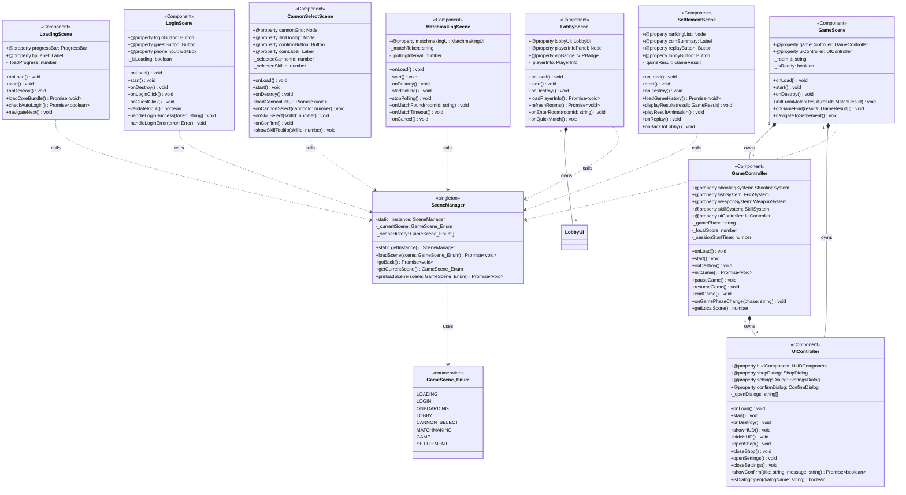

# 前端類別圖：Scene 腳本層

> 來源：FRONTEND.md §Scene 清單 / §game/controllers

```mermaid
classDiagram
    class GameScene_Enum {
        <<enumeration>>
        LOADING
        LOGIN
        ONBOARDING
        LOBBY
        CANNON_SELECT
        MATCHMAKING
        GAME
        SETTLEMENT
    }

    class SceneManager {
        <<singleton>>
        -static _instance: SceneManager
        -_currentScene: GameScene_Enum
        -_sceneHistory: GameScene_Enum[]
        +static getInstance() SceneManager
        +loadScene(scene: GameScene_Enum) Promise~void~
        +goBack() Promise~void~
        +getCurrentScene() GameScene_Enum
        +preloadScene(scene: GameScene_Enum) Promise~void~
    }

    class GameController {
        <<Component>>
        +@property shootingSystem: ShootingSystem
        +@property fishSystem: FishSystem
        +@property weaponSystem: WeaponSystem
        +@property skillSystem: SkillSystem
        +@property uiController: UIController
        -_gamePhase: string
        -_localScore: number
        -_sessionStartTime: number
        +onLoad() void
        +start() void
        +onDestroy() void
        +initGame() Promise~void~
        +pauseGame() void
        +resumeGame() void
        +endGame() void
        +onGamePhaseChange(phase: string) void
        +getLocalScore() number
    }

    class UIController {
        <<Component>>
        +@property hudComponent: HUDComponent
        +@property shopDialog: ShopDialog
        +@property settingsDialog: SettingsDialog
        +@property confirmDialog: ConfirmDialog
        -_openDialogs: string[]
        +onLoad() void
        +start() void
        +onDestroy() void
        +showHUD() void
        +hideHUD() void
        +openShop() void
        +closeShop() void
        +openSettings() void
        +closeSettings() void
        +showConfirm(title: string, message: string) Promise~boolean~
        +isDialogOpen(dialogName: string) boolean
    }

    class LoadingScene {
        <<Component>>
        +@property progressBar: ProgressBar
        +@property tipLabel: Label
        -_loadProgress: number
        +onLoad() void
        +start() void
        +onDestroy() void
        +loadCoreBundle() Promise~void~
        +checkAutoLogin() Promise~boolean~
        +navigateNext() void
    }

    class LoginScene {
        <<Component>>
        +@property loginButton: Button
        +@property guestButton: Button
        +@property phoneInput: EditBox
        -_isLoading: boolean
        +onLoad() void
        +start() void
        +onDestroy() void
        +onLoginClick() void
        +onGuestClick() void
        +validateInput() boolean
        +handleLoginSuccess(token: string) void
        +handleLoginError(error: Error) void
    }

    class LobbyScene {
        <<Component>>
        +@property lobbyUI: LobbyUI
        +@property playerInfoPanel: Node
        +@property vipBadge: VIPBadge
        -_playerInfo: PlayerInfo
        +onLoad() void
        +start() void
        +onDestroy() void
        +loadPlayerInfo() Promise~void~
        +refreshRooms() Promise~void~
        +onEnterRoom(roomId: string) void
        +onQuickMatch() void
    }

    class CannonSelectScene {
        <<Component>>
        +@property cannonGrid: Node
        +@property skillTooltip: Node
        +@property confirmButton: Button
        +@property coinLabel: Label
        -_selectedCannonId: number
        -_selectedSkillId: number
        +onLoad() void
        +start() void
        +onDestroy() void
        +loadCannonList() Promise~void~
        +onCannonSelect(cannonId: number) void
        +onSkillSelect(skillId: number) void
        +onConfirm() void
        +showSkillTooltip(skillId: number) void
    }

    class MatchmakingScene {
        <<Component>>
        +@property matchmakingUI: MatchmakingUI
        -_matchToken: string
        -_pollingInterval: number
        +onLoad() void
        +start() void
        +onDestroy() void
        +startPolling() void
        +stopPolling() void
        +onMatchFound(roomId: string) void
        +onMatchTimeout() void
        +onCancel() void
    }

    class GameScene {
        <<Component>>
        +@property gameController: GameController
        +@property uiController: UIController
        -_roomId: string
        -_isReady: boolean
        +onLoad() void
        +start() void
        +onDestroy() void
        +initFromMatchResult(result: MatchResult) void
        +onGameEnd(results: GameResult[]) void
        +navigateToSettlement() void
    }

    class SettlementScene {
        <<Component>>
        +@property rankingList: Node
        +@property coinSummary: Label
        +@property replayButton: Button
        +@property lobbyButton: Button
        -_gameResult: GameResult
        +onLoad() void
        +start() void
        +onDestroy() void
        +loadGameHistory() Promise~void~
        +displayResults(result: GameResult) void
        +playResultAnimation() void
        +onReplay() void
        +onBackToLobby() void
    }

    GameController "1" *-- "1" UIController : owns
    GameScene "1" *-- "1" GameController : owns
    GameScene "1" *-- "1" UIController : owns
    LobbyScene "1" *-- "1" LobbyUI : owns

    SceneManager ..> GameScene_Enum : uses
    LoadingScene ..> SceneManager : calls
    LoginScene ..> SceneManager : calls
    LobbyScene ..> SceneManager : calls
    CannonSelectScene ..> SceneManager : calls
    MatchmakingScene ..> SceneManager : calls
    GameScene ..> SceneManager : calls
    SettlementScene ..> SceneManager : calls
```
