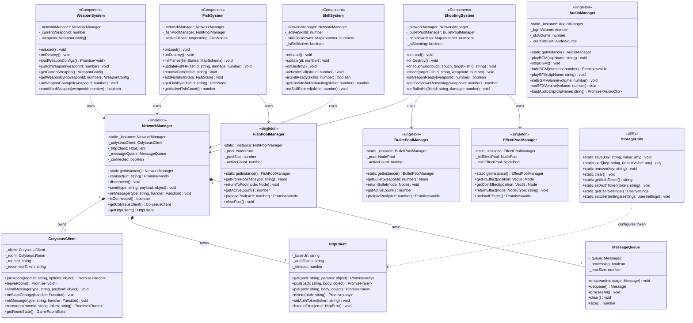

# 前端類別圖：Service/System 層

> 來源：FRONTEND.md §game/systems / §game/managers / §network

```mermaid
classDiagram
    class NetworkManager {
        <<singleton>>
        -static _instance: NetworkManager
        -_colyseusClient: ColyseusClient
        -_httpClient: HttpClient
        -_messageQueue: MessageQueue
        -_connected: boolean
        +static getInstance() NetworkManager
        +connect(url: string) Promise~void~
        +disconnect() void
        +send(type: string, payload: object) void
        +onMessage(type: string, handler: Function) void
        +isConnected() boolean
        +getColyseusClient() ColyseusClient
        +getHttpClient() HttpClient
    }

    class ColyseusClient {
        -_client: Colyseus.Client
        -_room: Colyseus.Room
        -_roomId: string
        -_reconnectToken: string
        +joinRoom(roomId: string, options: object) Promise~Room~
        +leaveRoom() Promise~void~
        +sendMessage(type: string, payload: object) void
        +onStateChange(handler: Function) void
        +onMessage(type: string, handler: Function) void
        +reconnect(roomId: string, token: string) Promise~Room~
        +getRoomState() GameRoomState
    }

    class HttpClient {
        -_baseUrl: string
        -_authToken: string
        -_timeout: number
        +get(path: string, params: object) Promise~any~
        +post(path: string, body: object) Promise~any~
        +put(path: string, body: object) Promise~any~
        +delete(path: string) Promise~any~
        +setAuthToken(token: string) void
        +handleError(error: HttpError) void
    }

    class MessageQueue {
        -_queue: Message[]
        -_processing: boolean
        -_maxSize: number
        +enqueue(message: Message) void
        +dequeue() Message
        +processAll() void
        +clear() void
        +size() number
    }

    class ShootingSystem {
        <<Component>>
        -_networkManager: NetworkManager
        -_bulletPoolManager: BulletPoolManager
        -_cooldownMap: Map~number_number~
        -_isShooting: boolean
        +onLoad() void
        +onDestroy() void
        +onTouchEnd(touch: Touch, targetFishId: string) void
        +shoot(targetFishId: string, weaponId: number) void
        +isWeaponReady(weaponId: number) boolean
        +getCooldownRemaining(weaponId: number) number
        +onBulletHit(fishId: string, damage: number) void
    }

    class FishSystem {
        <<Component>>
        -_networkManager: NetworkManager
        -_fishPoolManager: FishPoolManager
        -_activeFishes: Map~string_FishNode~
        +onLoad() void
        +onDestroy() void
        +initFishes(fishStates: MapSchema) void
        +updateFishHP(fishId: string, damage: number) void
        +removeFish(fishId: string) void
        +addFish(fishState: FishState) void
        +getFishById(fishId: string) FishNode
        +getActiveFishCount() number
    }

    class WeaponSystem {
        <<Component>>
        -_networkManager: NetworkManager
        -_currentWeaponId: number
        -_weapons: WeaponConfig[]
        +onLoad() void
        +onDestroy() void
        +loadWeaponConfigs() Promise~void~
        +switchWeapon(weaponId: number) void
        +getCurrentWeapon() WeaponConfig
        +getWeaponById(weaponId: number) WeaponConfig
        +onWeaponChanged(weaponId: number) void
        +canAffordWeapon(weaponId: number) boolean
    }

    class SkillSystem {
        <<Component>>
        -_networkManager: NetworkManager
        -_activeSkillId: number
        -_skillCooldowns: Map~number_number~
        -_isSkillActive: boolean
        +onLoad() void
        +update(dt: number) void
        +onDestroy() void
        +activateSkill(skillId: number) void
        +isSkillReady(skillId: number) boolean
        +getCooldownRemaining(skillId: number) number
        +onSkillExpired(skillId: number) void
    }

    class FishPoolManager {
        <<singleton>>
        -static _instance: FishPoolManager
        -_pool: NodePool
        -_poolSize: number
        -_activeCount: number
        +static getInstance() FishPoolManager
        +getFromPool(fishType: string) Node
        +returnToPool(node: Node) void
        +getActiveCount() number
        +preloadPool(size: number) Promise~void~
        +clearPool() void
    }

    class BulletPoolManager {
        <<singleton>>
        -static _instance: BulletPoolManager
        -_pool: NodePool
        -_activeCount: number
        +static getInstance() BulletPoolManager
        +getBullet(weaponId: number) Node
        +returnBullet(node: Node) void
        +getActiveCount() number
        +preloadPool(size: number) Promise~void~
    }

    class EffectPoolManager {
        <<singleton>>
        -static _instance: EffectPoolManager
        -_hitEffectPool: NodePool
        -_coinEffectPool: NodePool
        +static getInstance() EffectPoolManager
        +getHitEffect(position: Vec3) Node
        +getCoinEffect(position: Vec3) Node
        +returnEffect(node: Node, type: string) void
        +preloadEffects() Promise~void~
    }

    class AudioManager {
        <<singleton>>
        -static _instance: AudioManager
        -_bgmVolume: number
        -_sfxVolume: number
        -_currentBGM: AudioSource
        +static getInstance() AudioManager
        +playBGM(clipName: string) void
        +stopBGM() void
        +fadeBGM(duration: number) Promise~void~
        +playSFX(clipName: string) void
        +setBGMVolume(volume: number) void
        +setSFXVolume(volume: number) void
        +loadAudioClip(clipName: string) Promise~AudioClip~
    }

    class StorageUtils {
        <<utility>>
        +static save(key: string, value: any) void
        +static load(key: string, defaultValue: any) any
        +static remove(key: string) void
        +static clear() void
        +static getAuthToken() string
        +static setAuthToken(token: string) void
        +static getUserSettings() UserSettings
        +static setUserSettings(settings: UserSettings) void
    }

    NetworkManager "1" *-- "1" ColyseusClient : owns
    NetworkManager "1" *-- "1" HttpClient : owns
    NetworkManager "1" *-- "1" MessageQueue : owns

    ShootingSystem --> NetworkManager : uses
    FishSystem --> NetworkManager : uses
    WeaponSystem --> NetworkManager : uses
    SkillSystem --> NetworkManager : uses

    ShootingSystem --> BulletPoolManager : uses
    FishSystem --> FishPoolManager : uses
    ShootingSystem --> EffectPoolManager : uses

    StorageUtils ..> HttpClient : configures token
```
