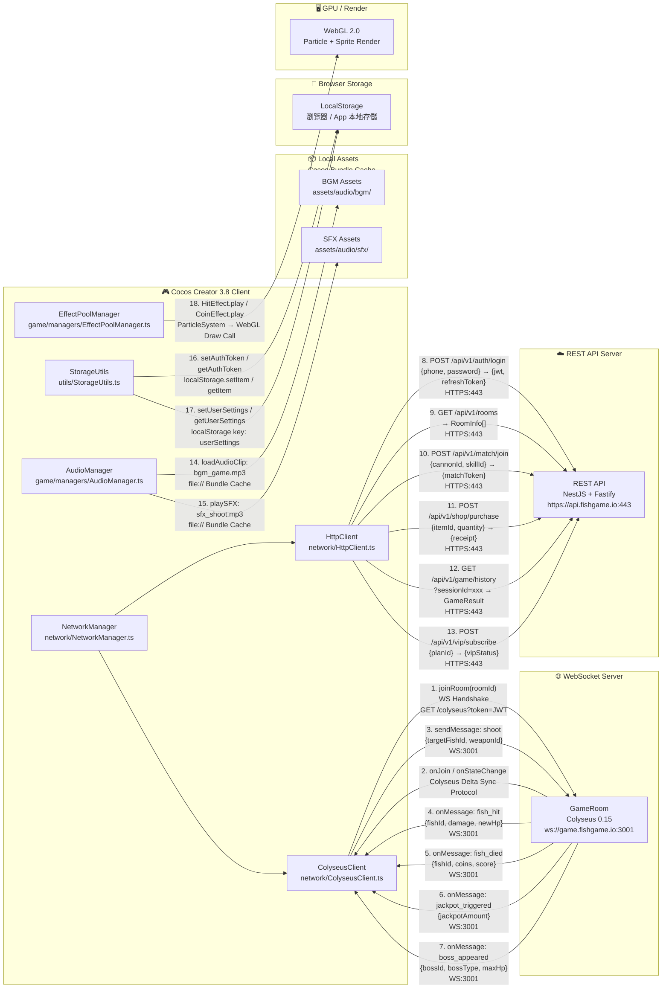

# 前端通訊圖：Cocos Creator 客戶端所有通訊流

> 來源：FRONTEND.md §network / §game/managers / §utils/StorageUtils

```mermaid
flowchart LR
    subgraph CocosClient["🎮 Cocos Creator 3.8 Client"]
        CC["ColyseusClient\nnetwork/ColyseusClient.ts"]
        HC["HttpClient\nnetwork/HttpClient.ts"]
        AM["AudioManager\ngame/managers/AudioManager.ts"]
        SU["StorageUtils\nutils/StorageUtils.ts"]
        EPM["EffectPoolManager\ngame/managers/EffectPoolManager.ts"]
        NM["NetworkManager\nnetwork/NetworkManager.ts"]
    end

    subgraph RemoteWS["🌐 WebSocket Server"]
        GR["GameRoom\nColyseus 0.15\nws://game.fishgame.io:3001"]
    end

    subgraph RemoteHTTP["☁️ REST API Server"]
        RAPI["REST API\nNestJS + Fastify\nhttps://api.fishgame.io:443"]
    end

    subgraph LocalAssets["📦 Local Assets\nCocos Bundle Cache"]
        BGM["BGM Assets\nassets/audio/bgm/"]
        SFX["SFX Assets\nassets/audio/sfx/"]
    end

    subgraph BrowserStorage["💾 Browser Storage"]
        LS["LocalStorage\n瀏覽器 / App 本地存儲"]
    end

    subgraph GPU["🖥️ GPU / Render"]
        WEBGL["WebGL 2.0\nParticle + Sprite Render"]
    end

    NM --> CC
    NM --> HC

    CC -->|"1. joinRoom(roomId)\nWS Handshake\nGET /colyseus?token=JWT"| GR
    GR -->|"2. onJoin / onStateChange\nColyseus Delta Sync Protocol"| CC
    CC -->|"3. sendMessage: shoot\n{targetFishId, weaponId}\nWS:3001"| GR
    GR -->|"4. onMessage: fish_hit\n{fishId, damage, newHp}\nWS:3001"| CC
    GR -->|"5. onMessage: fish_died\n{fishId, coins, score}\nWS:3001"| CC
    GR -->|"6. onMessage: jackpot_triggered\n{jackpotAmount}\nWS:3001"| CC
    GR -->|"7. onMessage: boss_appeared\n{bossId, bossType, maxHp}\nWS:3001"| CC

    HC -->|"8. POST /api/v1/auth/login\n{phone, password} → {jwt, refreshToken}\nHTTPS:443"| RAPI
    HC -->|"9. GET /api/v1/rooms\n→ RoomInfo[]\nHTTPS:443"| RAPI
    HC -->|"10. POST /api/v1/match/join\n{cannonId, skillId} → {matchToken}\nHTTPS:443"| RAPI
    HC -->|"11. POST /api/v1/shop/purchase\n{itemId, quantity} → {receipt}\nHTTPS:443"| RAPI
    HC -->|"12. GET /api/v1/game/history\n?sessionId=xxx → GameResult\nHTTPS:443"| RAPI
    HC -->|"13. POST /api/v1/vip/subscribe\n{planId} → {vipStatus}\nHTTPS:443"| RAPI

    AM -->|"14. loadAudioClip: bgm_game.mp3\nfile:// Bundle Cache"| BGM
    AM -->|"15. playSFX: sfx_shoot.mp3\nfile:// Bundle Cache"| SFX

    SU -->|"16. setAuthToken / getAuthToken\nlocalStorage.setItem / getItem"| LS
    SU -->|"17. setUserSettings / getUserSettings\nlocalStorage key: userSettings"| LS

    EPM -->|"18. HitEffect.play / CoinEffect.play\nParticleSystem → WebGL Draw Call"| WEBGL
```
