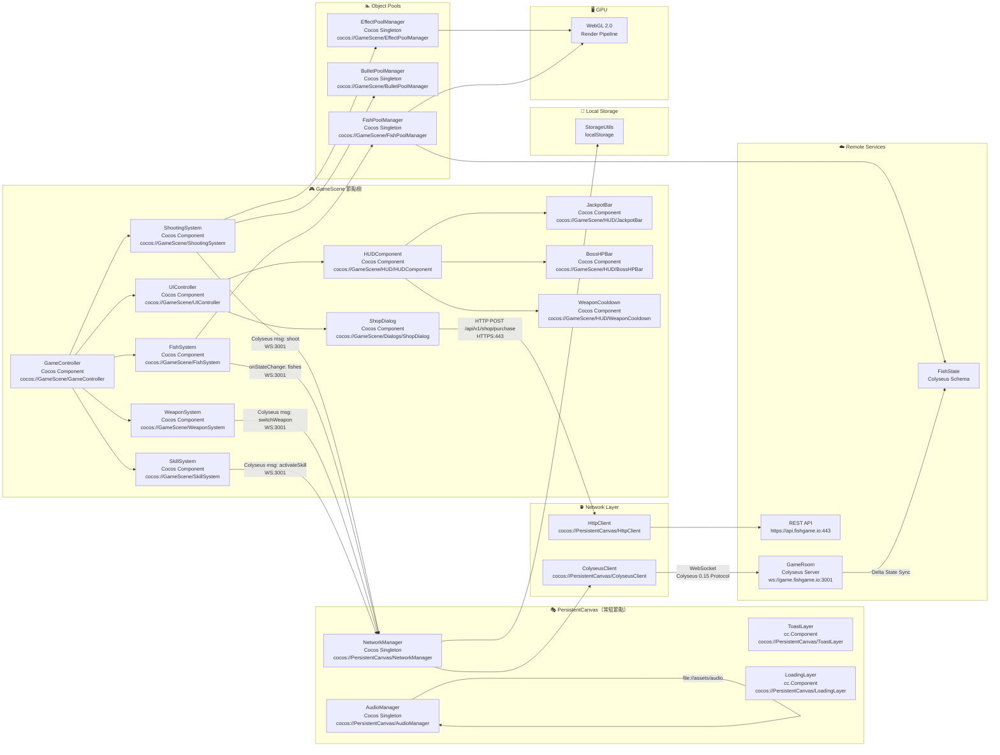

# 前端元件圖：Cocos Creator 客戶端 Component 連線關係

> 來源：FRONTEND.md §game/controllers / §game/systems / §network

```mermaid
flowchart LR
    subgraph PersistentCanvas["🎭 PersistentCanvas（常駐節點）"]
        NM["NetworkManager\nCocos Singleton\ncocos://PersistentCanvas/NetworkManager"]
        AM["AudioManager\nCocos Singleton\ncocos://PersistentCanvas/AudioManager"]
        TL["ToastLayer\ncc.Component\ncocos://PersistentCanvas/ToastLayer"]
        LL2["LoadingLayer\ncc.Component\ncocos://PersistentCanvas/LoadingLayer"]
    end

    subgraph GameSceneNode["🎮 GameScene 節點樹"]
        GC["GameController\nCocos Component\ncocos://GameScene/GameController"]
        UC["UIController\nCocos Component\ncocos://GameScene/UIController"]
        SS["ShootingSystem\nCocos Component\ncocos://GameScene/ShootingSystem"]
        FS["FishSystem\nCocos Component\ncocos://GameScene/FishSystem"]
        WS["WeaponSystem\nCocos Component\ncocos://GameScene/WeaponSystem"]
        SKS["SkillSystem\nCocos Component\ncocos://GameScene/SkillSystem"]
        HUD["HUDComponent\nCocos Component\ncocos://GameScene/HUD/HUDComponent"]
        JP["JackpotBar\nCocos Component\ncocos://GameScene/HUD/JackpotBar"]
        BHP["BossHPBar\nCocos Component\ncocos://GameScene/HUD/BossHPBar"]
        WC["WeaponCooldown\nCocos Component\ncocos://GameScene/HUD/WeaponCooldown"]
        SD["ShopDialog\nCocos Component\ncocos://GameScene/Dialogs/ShopDialog"]
    end

    subgraph Pools["🏊 Object Pools"]
        FPM["FishPoolManager\nCocos Singleton\ncocos://GameScene/FishPoolManager"]
        BPM["BulletPoolManager\nCocos Singleton\ncocos://GameScene/BulletPoolManager"]
        EPM["EffectPoolManager\nCocos Singleton\ncocos://GameScene/EffectPoolManager"]
    end

    subgraph NetworkLayer["🌐 Network Layer"]
        CC["ColyseusClient\ncocos://PersistentCanvas/ColyseusClient"]
        HC["HttpClient\ncocos://PersistentCanvas/HttpClient"]
    end

    subgraph Remotes["☁️ Remote Services"]
        GR["GameRoom\nColyseus Server\nws://game.fishgame.io:3001"]
        REST["REST API\nhttps://api.fishgame.io:443"]
        FS_Schema["FishState\nColyseus Schema"]
    end

    subgraph LocalStorage["💾 Local Storage"]
        SU["StorageUtils\nlocalStorage"]
    end

    subgraph GPU["🖥️ GPU"]
        WEBGL["WebGL 2.0\nRender Pipeline"]
    end

    GC --> SS
    GC --> FS
    GC --> WS
    GC --> SKS
    GC --> UC
    UC --> HUD
    UC --> SD

    HUD --> JP
    HUD --> BHP
    HUD --> WC

    SS -->|"Colyseus msg: shoot\nWS:3001"| NM
    FS -->|"onStateChange: fishes\nWS:3001"| NM
    WS -->|"Colyseus msg: switchWeapon\nWS:3001"| NM
    SKS -->|"Colyseus msg: activateSkill\nWS:3001"| NM

    NM --> CC
    CC -->|"WebSocket\nColyseus 0.15 Protocol"| GR

    SD -->|"HTTP POST /api/v1/shop/purchase\nHTTPS:443"| HC
    HC --> REST

    FPM --> FS_Schema
    GR -->|"Delta State Sync"| FS_Schema

    SS --> BPM
    SS --> EPM
    FS --> FPM
    EPM --> WEBGL
    FPM --> WEBGL

    AM -->|"file://assets/audio"| AM
    NM --> SU
```
