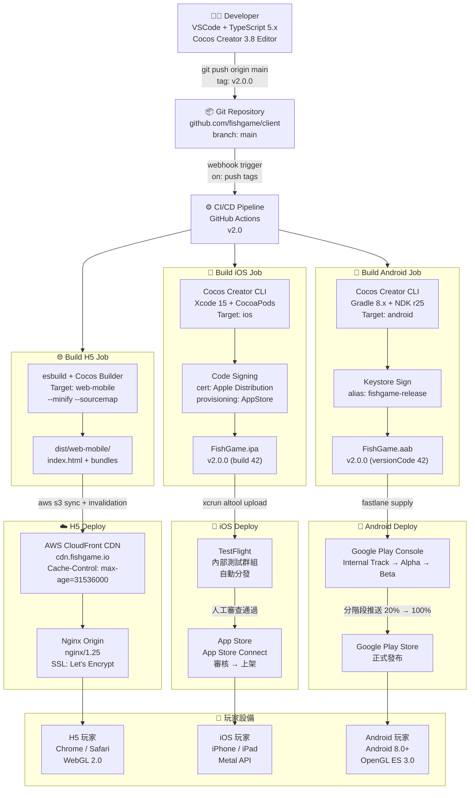

# 前端部署管道圖：Cocos Creator 多平台構建部署

> 來源：FRONTEND.md §引擎：Cocos Creator 3.8

```mermaid
flowchart TD
    DEV["👨‍💻 Developer\nVSCode + TypeScript 5.x\nCocos Creator 3.8 Editor"]

    GIT["📦 Git Repository\ngithub.com/fishgame/client\nbranch: main"]

    CI["⚙️ CI/CD Pipeline\nGitHub Actions\nv2.0"]

    subgraph BuildH5["🌐 Build H5 Job"]
        BH5["esbuild + Cocos Builder\nTarget: web-mobile\n--minify --sourcemap"]
        BH5_OUT["dist/web-mobile/\nindex.html + bundles"]
    end

    subgraph BuildiOS["🍎 Build iOS Job"]
        BIOS["Cocos Creator CLI\nXcode 15 + CocoaPods\nTarget: ios"]
        BIOS_SIGN["Code Signing\ncert: Apple Distribution\nprovisioning: AppStore"]
        BIOS_IPA["FishGame.ipa\nv2.0.0 (build 42)"]
    end

    subgraph BuildAndroid["🤖 Build Android Job"]
        BAND["Cocos Creator CLI\nGradle 8.x + NDK r25\nTarget: android"]
        BAND_SIGN["Keystore Sign\nalias: fishgame-release"]
        BAND_AAB["FishGame.aab\nv2.0.0 (versionCode 42)"]
    end

    subgraph DeployH5["☁️ H5 Deploy"]
        CDN["AWS CloudFront CDN\ncdn.fishgame.io\nCache-Control: max-age=31536000"]
        NGINX["Nginx Origin\nnginx/1.25\nSSL: Let's Encrypt"]
    end

    subgraph DeployiOS["📱 iOS Deploy"]
        TF["TestFlight\n內部測試群組\n自動分發"]
        AS["App Store\nApp Store Connect\n審核 → 上架"]
    end

    subgraph DeployAndroid["🤖 Android Deploy"]
        GPC["Google Play Console\nInternal Track → Alpha → Beta"]
        GP["Google Play Store\n正式發布"]
    end

    subgraph Players["👥 玩家設備"]
        H5_PLAYER["H5 玩家\nChrome / Safari\nWebGL 2.0"]
        IOS_PLAYER["iOS 玩家\niPhone / iPad\nMetal API"]
        ANDROID_PLAYER["Android 玩家\nAndroid 8.0+\nOpenGL ES 3.0"]
    end

    DEV -->|"git push origin main\ntag: v2.0.0"| GIT
    GIT -->|"webhook trigger\non: push tags"| CI

    CI --> BuildH5
    CI --> BuildiOS
    CI --> BuildAndroid

    BH5 --> BH5_OUT
    BIOS --> BIOS_SIGN --> BIOS_IPA
    BAND --> BAND_SIGN --> BAND_AAB

    BH5_OUT -->|"aws s3 sync + invalidation"| CDN
    CDN --> NGINX
    BIOS_IPA -->|"xcrun altool upload"| TF
    TF -->|"人工審查通過"| AS
    BAND_AAB -->|"fastlane supply"| GPC
    GPC -->|"分階段推送 20% → 100%"| GP

    NGINX --> H5_PLAYER
    AS --> IOS_PLAYER
    GP --> ANDROID_PLAYER
```
