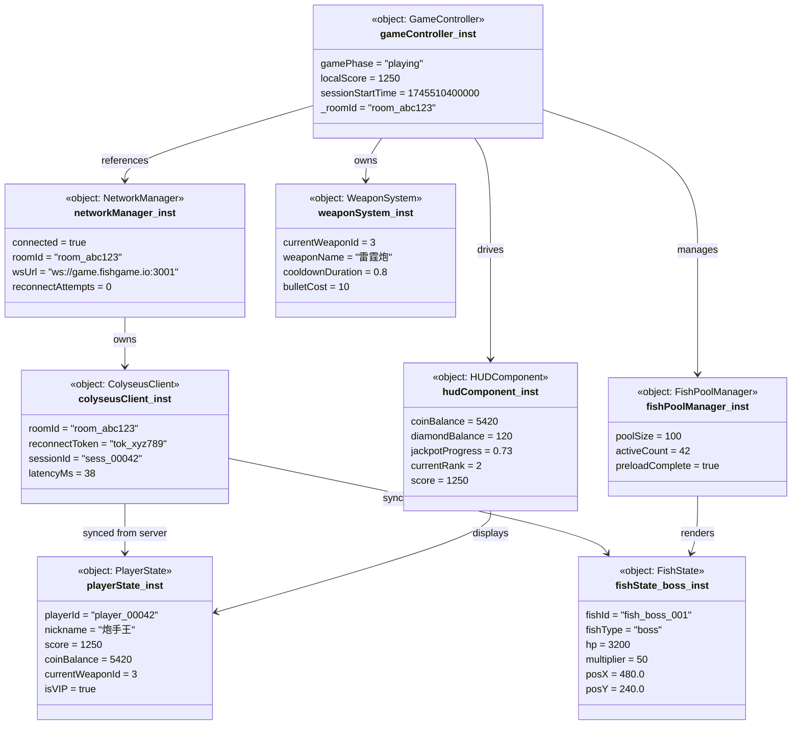

# 前端物件快照：GameScene 進行中

> 來源：FRONTEND.md §狀態分層 / §Colyseus Schemas

```mermaid
classDiagram
    class gameController_inst {
        <<object: GameController>>
        gamePhase = "playing"
        localScore = 1250
        sessionStartTime = 1745510400000
        _roomId = "room_abc123"
    }

    class networkManager_inst {
        <<object: NetworkManager>>
        connected = true
        roomId = "room_abc123"
        wsUrl = "ws://game.fishgame.io:3001"
        reconnectAttempts = 0
    }

    class colyseusClient_inst {
        <<object: ColyseusClient>>
        roomId = "room_abc123"
        reconnectToken = "tok_xyz789"
        sessionId = "sess_00042"
        latencyMs = 38
    }

    class hudComponent_inst {
        <<object: HUDComponent>>
        coinBalance = 5420
        diamondBalance = 120
        jackpotProgress = 0.73
        currentRank = 2
        score = 1250
    }

    class fishPoolManager_inst {
        <<object: FishPoolManager>>
        poolSize = 100
        activeCount = 42
        preloadComplete = true
    }

    class playerState_inst {
        <<object: PlayerState>>
        playerId = "player_00042"
        nickname = "炮手王"
        score = 1250
        coinBalance = 5420
        currentWeaponId = 3
        isVIP = true
    }

    class fishState_boss_inst {
        <<object: FishState>>
        fishId = "fish_boss_001"
        fishType = "boss"
        hp = 3200
        multiplier = 50
        posX = 480.0
        posY = 240.0
    }

    class weaponSystem_inst {
        <<object: WeaponSystem>>
        currentWeaponId = 3
        weaponName = "雷霆炮"
        cooldownDuration = 0.8
        bulletCost = 10
    }

    gameController_inst --> networkManager_inst : references
    gameController_inst --> hudComponent_inst : drives
    networkManager_inst --> colyseusClient_inst : owns
    colyseusClient_inst --> playerState_inst : synced from server
    colyseusClient_inst --> fishState_boss_inst : synced from server
    fishPoolManager_inst --> fishState_boss_inst : renders
    hudComponent_inst --> playerState_inst : displays
    gameController_inst --> weaponSystem_inst : owns
    gameController_inst --> fishPoolManager_inst : manages
```
