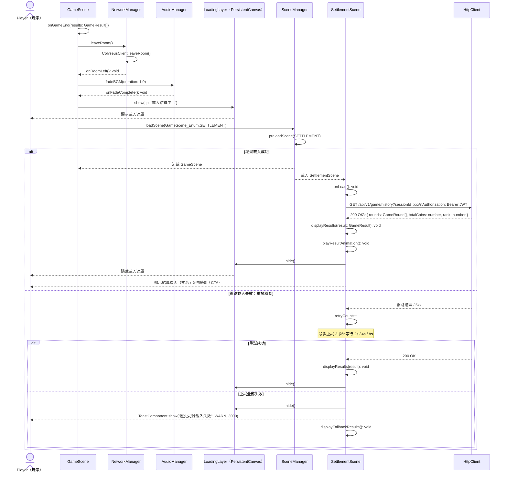

# Scene 切換序列圖：GameScene → SettlementScene

> 來源：FRONTEND.md §Scene 清單 / §常駐節點（PersistentCanvas）

```mermaid
sequenceDiagram
    actor Player as Player（玩家）
    participant GS as GameScene
    participant NM as NetworkManager
    participant AM as AudioManager
    participant LL as LoadingLayer（PersistentCanvas）
    participant SM as SceneManager
    participant SS as SettlementScene
    participant HC as HttpClient

    GS->>GS: onGameEnd(results: GameResult[])
    GS->>NM: leaveRoom()
    NM->>NM: ColyseusClient.leaveRoom()
    NM-->>GS: onRoomLeft(): void

    GS->>AM: fadeBGM(duration: 1.0)
    AM-->>GS: onFadeComplete(): void

    GS->>LL: show(tip: "載入結算中...")
    LL-->>Player: 顯示載入遮罩

    GS->>SM: loadScene(GameScene_Enum.SETTLEMENT)
    SM->>SM: preloadScene(SETTLEMENT)

    alt 場景載入成功
        SM-->>GS: 卸載 GameScene
        SM-->>SS: 載入 SettlementScene

        SS->>SS: onLoad(): void
        SS->>HC: GET /api/v1/game/history?sessionId=xxx\nAuthorization: Bearer JWT
        HC-->>SS: 200 OK\n{ rounds: GameRound[], totalCoins: number, rank: number }

        SS->>SS: displayResults(result: GameResult): void
        SS->>SS: playResultAnimation(): void
        SS->>LL: hide()
        LL-->>Player: 隱藏載入遮罩
        SS-->>Player: 顯示結算頁面（排名 / 金幣統計 / CTA）

    else 網路載入失敗：重試機制
        HC-->>SS: 網路錯誤 / 5xx
        SS->>SS: retryCount++
        note over SS: 最多重試 3 次\n等待 2s / 4s / 8s

        alt 重試成功
            HC-->>SS: 200 OK
            SS->>SS: displayResults(result): void
            SS->>LL: hide()
        else 重試全部失敗
            SS->>LL: hide()
            SS-->>Player: ToastComponent.show("歷史記錄載入失敗", WARN, 3000)
            SS->>SS: displayFallbackResults(): void
        end
    end
```
