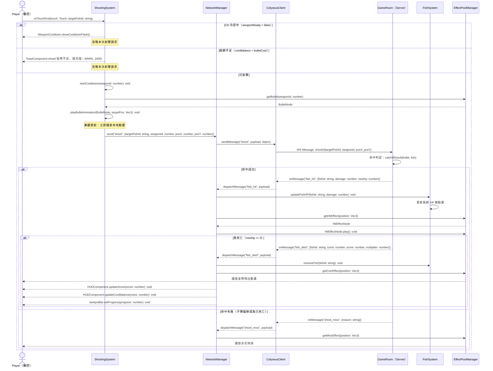

# 射擊動作序列圖

> 來源：FRONTEND.md §game/systems/ShootingSystem / §game/managers/EffectPoolManager

```mermaid
sequenceDiagram
    actor Player as Player（觸控）
    participant SS as ShootingSystem
    participant NM as NetworkManager
    participant CC as ColyseusClient
    participant GR as GameRoom（Server）
    participant FS as FishSystem
    participant EP as EffectPoolManager

    Player->>SS: onTouchEnd(touch: Touch, targetFishId: string)

    alt CD 冷卻中（weaponReady = false）
        SS-->>Player: WeaponCooldown.showCooldownFlash()
        note over SS: 忽略本次射擊請求
    else 餘額不足（coinBalance < bulletCost）
        SS-->>Player: ToastComponent.show("金幣不足，請充值", WARN, 2000)
        note over SS: 忽略本次射擊請求
    else 可射擊
        SS->>SS: startCooldown(weaponId: number): void
        SS->>EP: getBullet(weaponId: number)
        EP-->>SS: BulletNode
        SS->>SS: playBulletAnimation(BulletNode, targetPos: Vec3): void
        note over SS: 樂觀更新：立即播放本地動畫

        SS->>NM: send("shoot", {targetFishId: string, weaponId: number, posX: number, posY: number})
        NM->>CC: sendMessage("shoot", payload: object)
        CC->>GR: WS Message: shoot\n{targetFishId, weaponId, posX, posY}

        GR->>GR: 命中判定：calcHitResult(bullet, fish)

        alt 命中成功
            GR-->>CC: onMessage("fish_hit", {fishId: string, damage: number, newHp: number})
            CC-->>NM: dispatchMessage("fish_hit", payload)
            NM->>FS: updateFishHP(fishId: string, damage: number): void
            FS->>FS: 更新魚群 HP 條動畫
            NM->>EP: getHitEffect(position: Vec3)
            EP-->>NM: HitEffectNode
            NM->>EP: HitEffectNode.play(): void

            alt 魚死亡（newHp <= 0）
                GR-->>CC: onMessage("fish_died", {fishId: string, coins: number, score: number, multiplier: number})
                CC-->>NM: dispatchMessage("fish_died", payload)
                NM->>FS: removeFish(fishId: string): void
                NM->>EP: getCoinEffect(position: Vec3)
                EP-->>Player: 播放金幣飛出動畫
                NM-->>Player: HUDComponent.updateScore(score: number): void
                NM-->>Player: HUDComponent.updateCoinBalance(coins: number): void
                NM-->>Player: JackpotBar.setProgress(progress: number): void
            end

        else 命中失敗（子彈偏移或魚已死亡）
            GR-->>CC: onMessage("shoot_miss", {reason: string})
            CC-->>NM: dispatchMessage("shoot_miss", payload)
            NM->>EP: getMissEffect(position: Vec3)
            EP-->>Player: 播放水花特效
        end
    end
```
