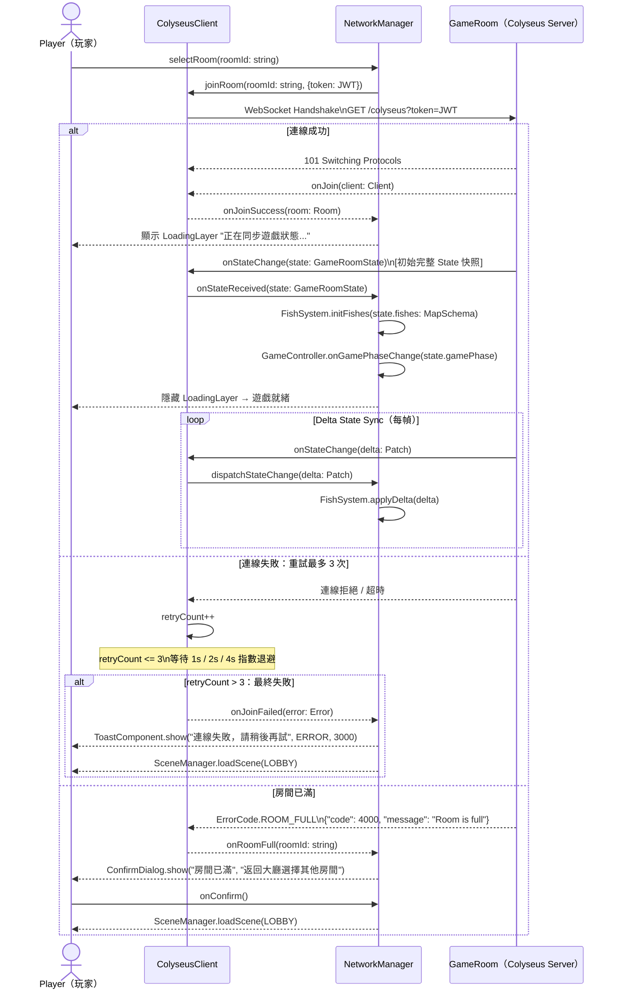

# WebSocket 連線與 Colyseus Room 加入序列圖

> 來源：FRONTEND.md §network / §Colyseus Schemas

```mermaid
sequenceDiagram
    actor Player as Player（玩家）
    participant CC as ColyseusClient
    participant NM as NetworkManager
    participant GR as GameRoom（Colyseus Server）

    Player->>NM: selectRoom(roomId: string)
    NM->>CC: joinRoom(roomId: string, {token: JWT})
    CC->>GR: WebSocket Handshake\nGET /colyseus?token=JWT

    alt 連線成功
        GR-->>CC: 101 Switching Protocols
        GR-->>CC: onJoin(client: Client)
        CC-->>NM: onJoinSuccess(room: Room)
        NM-->>Player: 顯示 LoadingLayer "正在同步遊戲狀態..."

        GR->>CC: onStateChange(state: GameRoomState)\n[初始完整 State 快照]
        CC->>NM: onStateReceived(state: GameRoomState)
        NM->>NM: FishSystem.initFishes(state.fishes: MapSchema)
        NM->>NM: GameController.onGamePhaseChange(state.gamePhase)
        NM-->>Player: 隱藏 LoadingLayer → 遊戲就緒

        loop Delta State Sync（每幀）
            GR->>CC: onStateChange(delta: Patch)
            CC->>NM: dispatchStateChange(delta: Patch)
            NM->>NM: FishSystem.applyDelta(delta)
        end

    else 連線失敗：重試最多 3 次
        GR-->>CC: 連線拒絕 / 超時
        CC->>CC: retryCount++
        note over CC: retryCount <= 3\n等待 1s / 2s / 4s 指數退避

        alt retryCount > 3：最終失敗
            CC-->>NM: onJoinFailed(error: Error)
            NM-->>Player: ToastComponent.show("連線失敗，請稍後再試", ERROR, 3000)
            NM-->>Player: SceneManager.loadScene(LOBBY)
        end

    else 房間已滿
        GR-->>CC: ErrorCode.ROOM_FULL\n{"code": 4000, "message": "Room is full"}
        CC-->>NM: onRoomFull(roomId: string)
        NM-->>Player: ConfirmDialog.show("房間已滿", "返回大廳選擇其他房間")
        Player->>NM: onConfirm()
        NM-->>Player: SceneManager.loadScene(LOBBY)
    end
```
