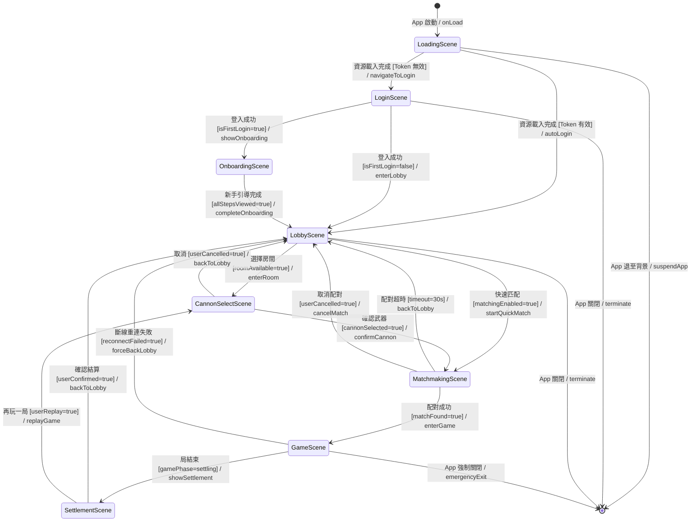

# Scene 狀態機

> 來源：FRONTEND.md §Scene 清單 / §SceneManager

```mermaid
stateDiagram-v2
    [*] --> LoadingScene : App 啟動 / onLoad

    LoadingScene --> LoginScene : 資源載入完成 [Token 無效] / navigateToLogin
    LoadingScene --> LobbyScene : 資源載入完成 [Token 有效] / autoLogin

    LoginScene --> OnboardingScene : 登入成功 [isFirstLogin=true] / showOnboarding
    LoginScene --> LobbyScene : 登入成功 [isFirstLogin=false] / enterLobby

    OnboardingScene --> LobbyScene : 新手引導完成 [allStepsViewed=true] / completeOnboarding

    LobbyScene --> CannonSelectScene : 選擇房間 [roomAvailable=true] / enterRoom
    LobbyScene --> MatchmakingScene : 快速匹配 [matchingEnabled=true] / startQuickMatch

    CannonSelectScene --> MatchmakingScene : 確認武器 [cannonSelected=true] / confirmCannon
    CannonSelectScene --> LobbyScene : 取消 [userCancelled=true] / backToLobby

    MatchmakingScene --> GameScene : 配對成功 [matchFound=true] / enterGame
    MatchmakingScene --> LobbyScene : 配對超時 [timeout=30s] / backToLobby
    MatchmakingScene --> LobbyScene : 取消配對 [userCancelled=true] / cancelMatch

    GameScene --> SettlementScene : 局結束 [gamePhase=settling] / showSettlement
    GameScene --> LobbyScene : 斷線重連失敗 [reconnectFailed=true] / forceBackLobby

    SettlementScene --> LobbyScene : 確認結算 [userConfirmed=true] / backToLobby
    SettlementScene --> CannonSelectScene : 再玩一局 [userReplay=true] / replayGame

    LoadingScene --> [*] : App 退至背景 / suspendApp
    LoginScene --> [*] : App 關閉 / terminate
    LobbyScene --> [*] : App 關閉 / terminate
    GameScene --> [*] : App 強制關閉 / emergencyExit
```
