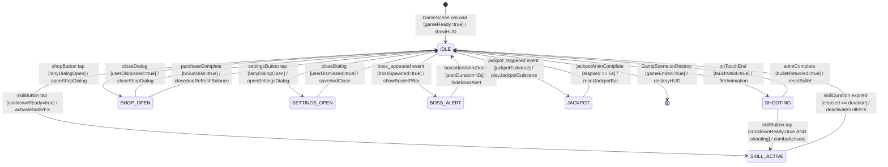

# 遊戲 UI 狀態機：GameScene HUD

> 來源：FRONTEND.md §ui/hud / §UIController

```mermaid
stateDiagram-v2
    [*] --> IDLE : GameScene.onLoad [gameReady=true] / showHUD

    IDLE --> SHOOTING : onTouchEnd [touchValid=true] / fireAnimation
    SHOOTING --> IDLE : animComplete [bulletReturned=true] / resetBullet

    IDLE --> SKILL_ACTIVE : skillButton tap [cooldownReady=true] / activateSkillVFX
    SKILL_ACTIVE --> IDLE : skillDuration expired [elapsed >= duration] / deactivateSkillVFX

    IDLE --> SHOP_OPEN : shopButton tap [!anyDialogOpen] / openShopDialog
    SHOP_OPEN --> IDLE : closeDialog [userDismissed=true] / closeShopDialog
    SHOP_OPEN --> IDLE : purchaseComplete [txSuccess=true] / closeAndRefreshBalance

    IDLE --> SETTINGS_OPEN : settingsButton tap [!anyDialogOpen] / openSettingsDialog
    SETTINGS_OPEN --> IDLE : closeDialog [userDismissed=true] / saveAndClose

    IDLE --> BOSS_ALERT : boss_appeared event [bossSpawned=true] / showBossHPBar
    BOSS_ALERT --> IDLE : bossAlertAnimDone [alertDuration=2s] / hideBossAlert

    IDLE --> JACKPOT : jackpot_triggered event [jackpotFull=true] / playJackpotCutscene
    JACKPOT --> IDLE : jackpotAnimComplete [elapsed >= 5s] / resetJackpotBar

    SHOOTING --> SKILL_ACTIVE : skillButton tap [cooldownReady=true AND shooting] / comboActivate

    IDLE --> [*] : GameScene.onDestroy [gameEnded=true] / destroyHUD
```
