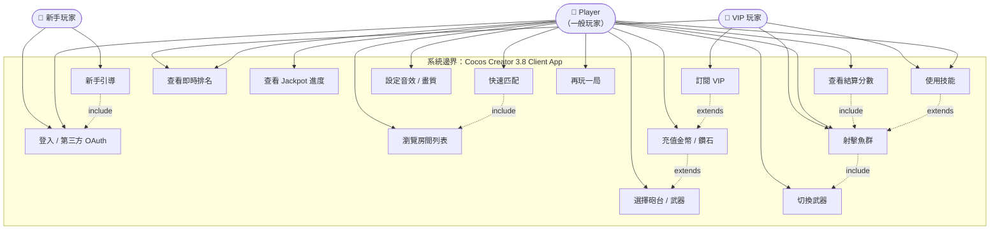

# 前端用例圖

> 來源：FRONTEND.md §Scene 清單 / §UI 組件架構

```mermaid
flowchart TD
    subgraph System["系統邊界：Cocos Creator 3.8 Client App"]
        UC1["登入 / 第三方 OAuth"]
        UC2["新手引導"]
        UC3["瀏覽房間列表"]
        UC4["快速匹配"]
        UC5["選擇砲台 / 武器"]
        UC6["射擊魚群"]
        UC7["切換武器"]
        UC8["使用技能"]
        UC9["查看即時排名"]
        UC10["查看 Jackpot 進度"]
        UC11["充值金幣 / 鑽石"]
        UC12["訂閱 VIP"]
        UC13["設定音效 / 畫質"]
        UC14["查看結算分數"]
        UC15["再玩一局"]

        UC2 -.->|include| UC1
        UC4 -.->|include| UC3
        UC6 -.->|include| UC7
        UC8 -.->|extends| UC6
        UC11 -.->|extends| UC5
        UC12 -.->|extends| UC11
        UC14 -.->|include| UC6
    end

    Player(["👤 Player\n（一般玩家）"])
    Newbie(["👶 新手玩家"])
    VIPPlayer(["💎 VIP 玩家"])

    Player --> UC1
    Player --> UC3
    Player --> UC4
    Player --> UC5
    Player --> UC6
    Player --> UC7
    Player --> UC8
    Player --> UC9
    Player --> UC10
    Player --> UC11
    Player --> UC13
    Player --> UC14
    Player --> UC15

    Newbie --> UC2
    Newbie --> UC1

    VIPPlayer --> UC12
    VIPPlayer --> UC6
    VIPPlayer --> UC8
    VIPPlayer --> UC9
```
