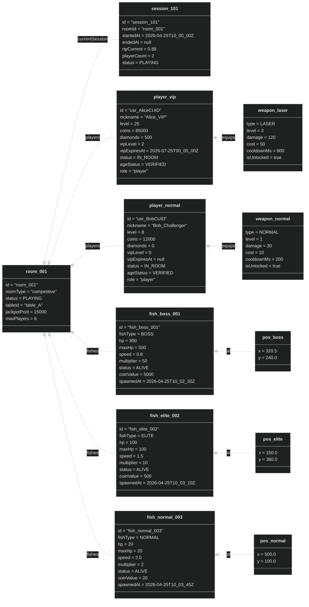
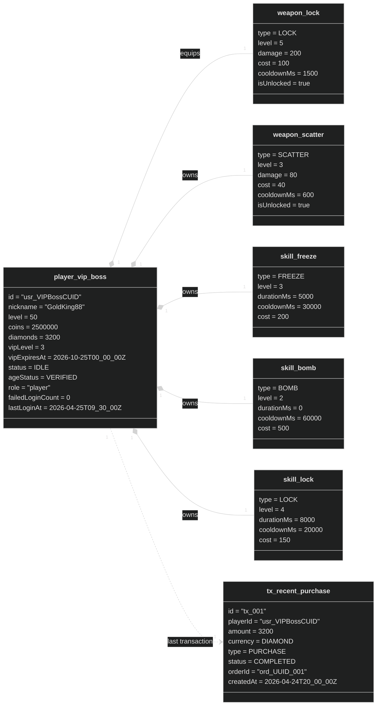

# Object Diagram — Runtime Snapshot（執行時快照）

> 來源：EDD.md §5.5 資料模型；class-domain.md 領域類別

## Snapshot 1：房間進行中狀態（PLAYING）

> 2 名玩家、3 條魚，其中 1 名玩家 VIP 狀態，1 條 Boss 魚血量受損

## Snapshot 2：VIP 高餘額玩家 Profile 快照

> 玩家 VIP2 狀態，持有多種技能，鑽石餘額高

