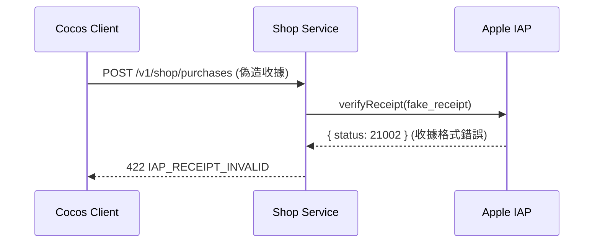
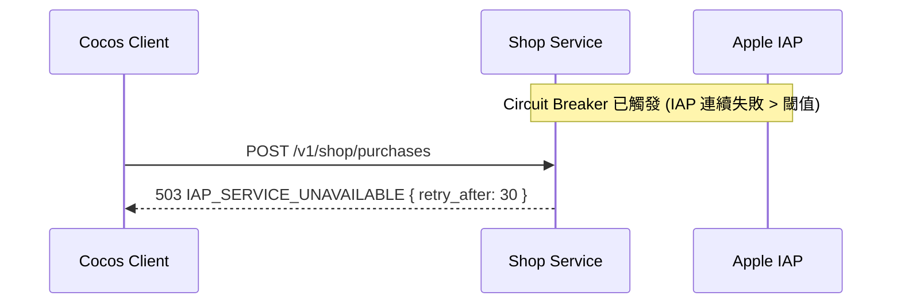

# Sequence Diagram: POST /shop/purchases (IAP 充值)

## Happy Path

```mermaid
sequenceDiagram
    participant Client as Cocos Client
    participant Nginx as Nginx Ingress
    participant Shop as Shop Service :3002
    participant IAP as Apple/Google IAP
    participant MySQL as MySQL :3306
    participant EventBus as Redis Pub/Sub
    participant Account as Account Service :3001

    Client->>Nginx: POST /v1/shop/purchases (Bearer JWT + {platform, product_id, receipt, idempotency_key})
    Note over Nginx: JWT 驗證 + Rate Limit (5 req/min/User)
    Nginx->>Shop: 路由
    Shop->>Shop: Zod 驗證 (platform enum, product_id, receipt, idempotency_key UUID)
    Shop->>MySQL: SELECT orders WHERE idempotency_key = ? (冪等性檢查)
    alt idempotency_key 未使用
        Shop->>IAP: HTTPS POST verifyReceipt(receipt)
        IAP-->>Shop: { status: 0, product_id: "diamonds_330", transaction_id: "1000000XXX" }
        Shop->>MySQL: BEGIN; INSERT orders (status=pending, idempotency_key)
        Shop->>MySQL: UPDATE orders SET status=completed; COMMIT
        Shop->>EventBus: PUBLISH events:commerce IAPPurchaseCompleted { user_id, diamonds: 330 }
        EventBus-->>Account: 非同步消費 → UPDATE users SET diamond_balance += 330
        Shop-->>Client: 201 { order_id, status: "completed", diamonds_credited: 330 }
    else idempotency_key 已使用 (重複請求)
        Shop-->>Client: 409 DUPLICATE_PURCHASE { original_order_id }
    end
```

## Error Path: IAP Receipt Invalid



## Error Path: IAP Circuit Breaker Open


