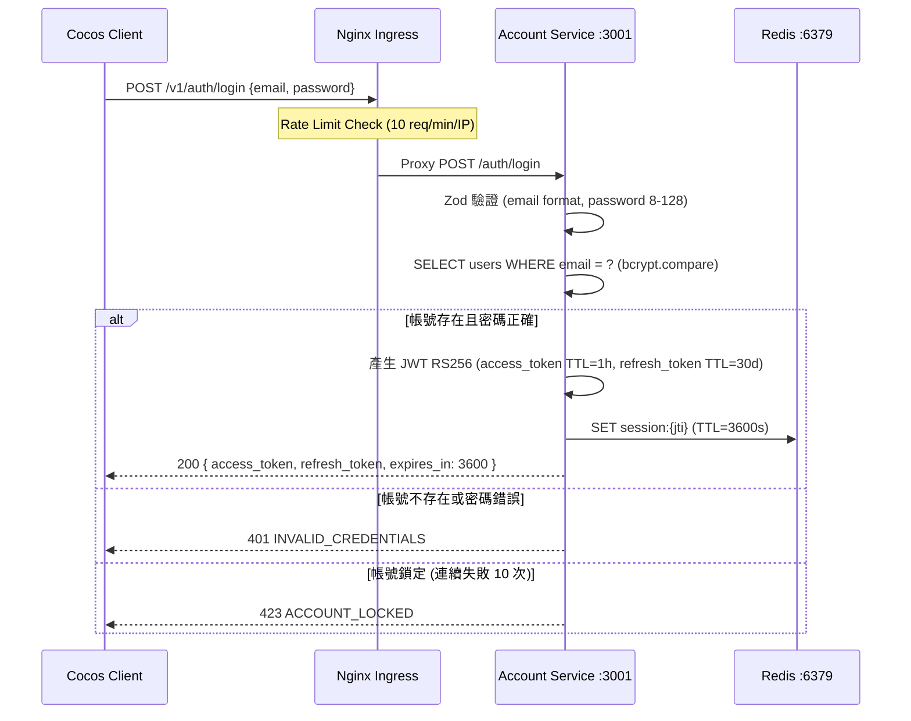
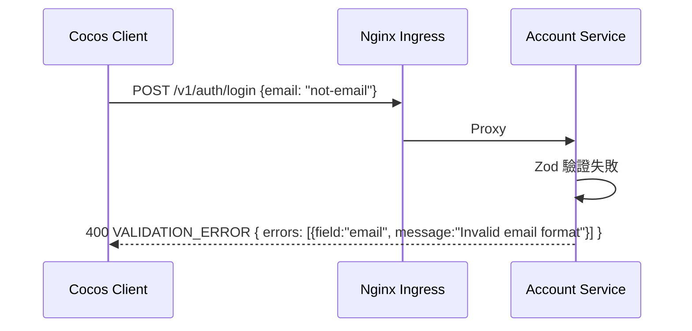
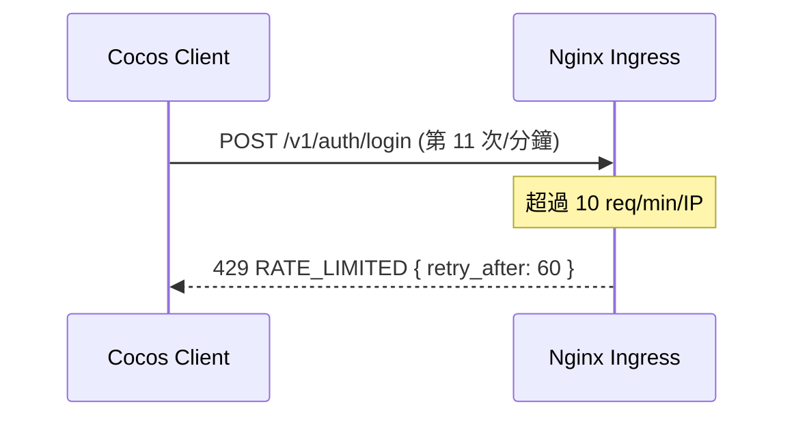

# Sequence Diagram: POST /auth/login

## Happy Path

```mermaid
sequenceDiagram
    participant Client as Cocos Client
    participant Nginx as Nginx Ingress
    participant Account as Account Service :3001
    participant Redis as Redis :6379

    Client->>Nginx: POST /v1/auth/login {email, password}
    Note over Nginx: Rate Limit Check (10 req/min/IP)
    Nginx->>Account: Proxy POST /auth/login
    Account->>Account: Zod 驗證 (email format, password 8-128)
    Account->>Account: SELECT users WHERE email = ? (bcrypt.compare)
    alt 帳號存在且密碼正確
        Account->>Account: 產生 JWT RS256 (access_token TTL=1h, refresh_token TTL=30d)
        Account->>Redis: SET session:{jti} (TTL=3600s)
        Account-->>Client: 200 { access_token, refresh_token, expires_in: 3600 }
    else 帳號不存在或密碼錯誤
        Account-->>Client: 401 INVALID_CREDENTIALS
    else 帳號鎖定 (連續失敗 10 次)
        Account-->>Client: 423 ACCOUNT_LOCKED
    end
```

## Error Path: Invalid Format

```mermaid
sequenceDiagram
    participant Client as Cocos Client
    participant Nginx as Nginx Ingress
    participant Account as Account Service

    Client->>Nginx: POST /v1/auth/login {email: "not-email"}
    Nginx->>Account: Proxy
    Account->>Account: Zod 驗證失敗
    Account-->>Client: 400 VALIDATION_ERROR { errors: [{field:"email", message:"Invalid email format"}] }
```

## Error Path: Rate Limited

```mermaid
sequenceDiagram
    participant Client as Cocos Client
    participant Nginx as Nginx Ingress

    Client->>Nginx: POST /v1/auth/login (第 11 次/分鐘)
    Note over Nginx: 超過 10 req/min/IP
    Nginx-->>Client: 429 RATE_LIMITED { retry_after: 60 }
```
