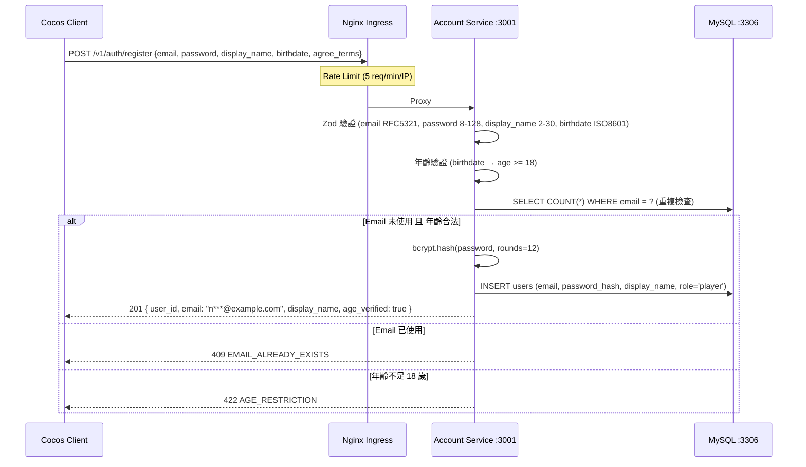
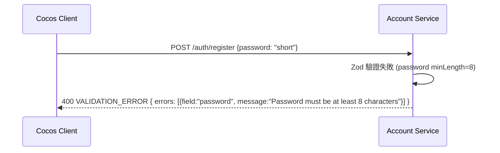

# Sequence Diagram: POST /auth/register

## Happy Path

```mermaid
sequenceDiagram
    participant Client as Cocos Client
    participant Nginx as Nginx Ingress
    participant Account as Account Service :3001
    participant MySQL as MySQL :3306

    Client->>Nginx: POST /v1/auth/register {email, password, display_name, birthdate, agree_terms}
    Note over Nginx: Rate Limit (5 req/min/IP)
    Nginx->>Account: Proxy
    Account->>Account: Zod 驗證 (email RFC5321, password 8-128, display_name 2-30, birthdate ISO8601)
    Account->>Account: 年齡驗證 (birthdate → age >= 18)
    Account->>MySQL: SELECT COUNT(*) WHERE email = ? (重複檢查)
    alt Email 未使用 且 年齡合法
        Account->>Account: bcrypt.hash(password, rounds=12)
        Account->>MySQL: INSERT users (email, password_hash, display_name, role='player')
        Account-->>Client: 201 { user_id, email: "n***@example.com", display_name, age_verified: true }
    else Email 已使用
        Account-->>Client: 409 EMAIL_ALREADY_EXISTS
    else 年齡不足 18 歲
        Account-->>Client: 422 AGE_RESTRICTION
    end
```

## Error Path: Validation Failed

```mermaid
sequenceDiagram
    participant Client as Cocos Client
    participant Account as Account Service

    Client->>Account: POST /auth/register {password: "short"}
    Account->>Account: Zod 驗證失敗 (password minLength=8)
    Account-->>Client: 400 VALIDATION_ERROR { errors: [{field:"password", message:"Password must be at least 8 characters"}] }
```
