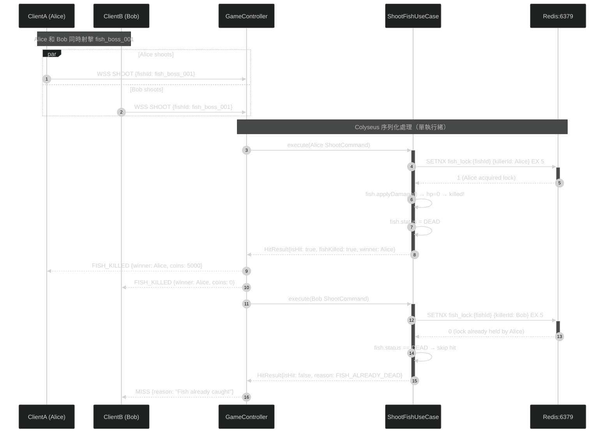
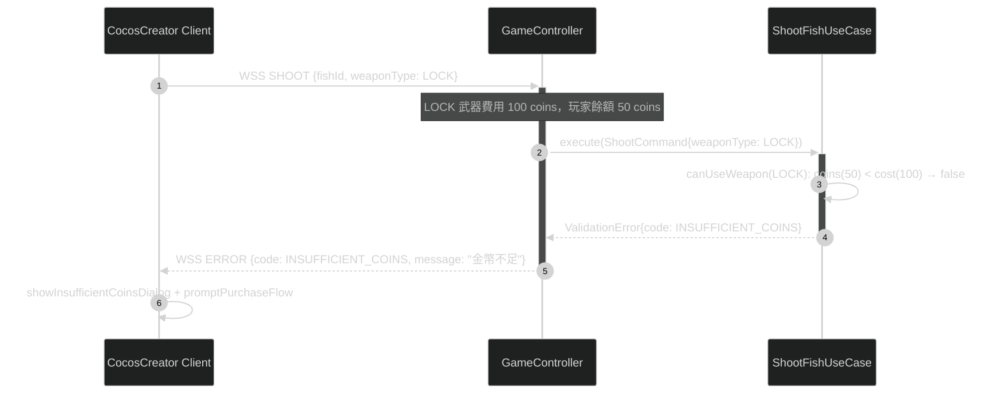
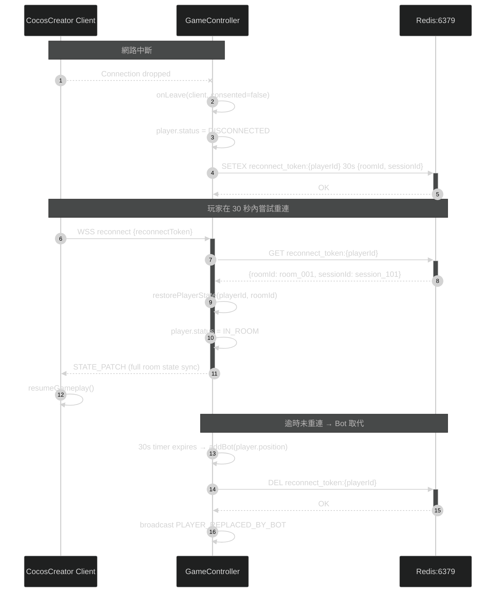

# Sequence Diagram — Shoot Fish Error Flows（射擊捕魚異常流程）

> 來源：EDD.md §8.5 Graceful Degradation；ARCH.md §17.2 Circuit Breaker 狀態機

## Error Flow 1：RTP 服務降級（Redis 故障）

```mermaid
%%{init: {"theme": "dark"}}%%
sequenceDiagram
    autonumber
    participant CC as CocosCreator Client
    participant CR as GameController
    participant SUC as ShootFishUseCase
    participant RTP as RTPService
    participant CB as CircuitBreaker
    participant Redis as Redis:6379
    participant MySQL as MySQL:3306
    participant Alert as AlertSystem

    CC->>+CR: WSS SHOOT {fishId, weaponType}
    CR->>+SUC: execute(ShootCommand)
    SUC->>+RTP: calculateHit(playerId, fish, weapon)
    RTP->>+CB: callWithBreaker(() => redis.get(rtp_state))
    CB->>+Redis: GET rtp_state:{playerId}
    Redis--xCB: CONNECTION TIMEOUT (>50ms)
    CB->>CB: recordFailure(): failureCount 3→4→5
    CB->>CB: errorRate > 50% → OPEN circuit

    Note over CB,RTP: Circuit Breaker 開路 → 降級模式
    CB-->>-RTP: CircuitBreakerOpenError
    RTP->>RTP: isRTPDegraded==true; fallback fixedHitRate=0.80
    RTP->>RTP: rollDice(0.80) → isHit=true (degraded)
    RTP-->>-SUC: HitResult{isHit: true, degraded: true, coinsAwarded: 300}
    SUC->>+MySQL: INSERT fish_kills {degraded: true}
    MySQL-->>-SUC: OK
    SUC-->>-CR: HitResult (degraded)
    CR-->>CC: STATE_UPDATE (normal, player unaware)

    Note over CR,Alert: 後台告警觸發
    CR->>+Alert: emit RTPServiceDegraded metric
    Alert-->>-Alert: PagerDuty P1 alert to on-call
```

## Error Flow 2：魚已被其他玩家擊殺（Race Condition）



## Error Flow 3：玩家金幣不足射擊被拒



## Error Flow 4：玩家斷線重連


