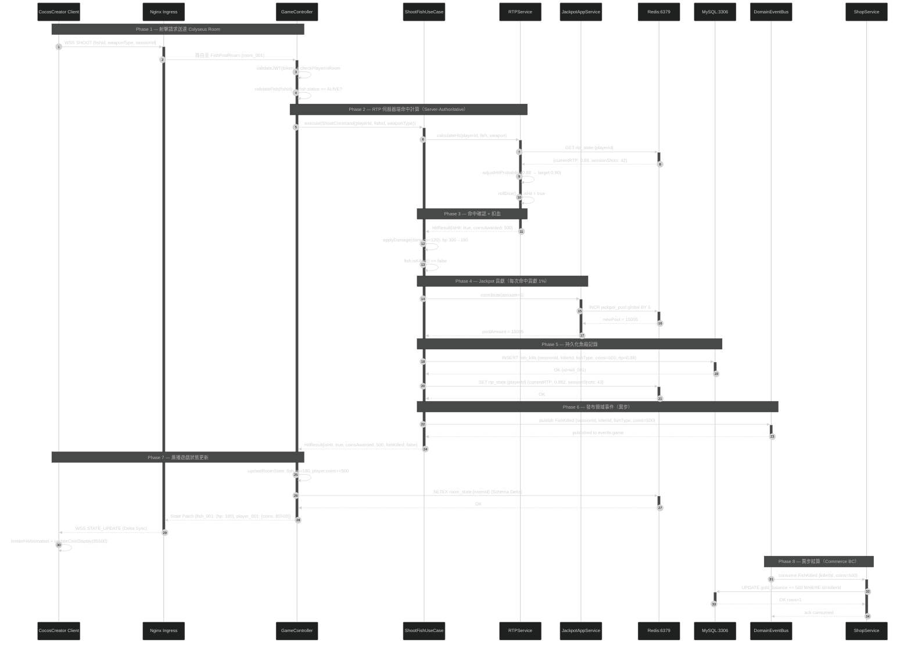

# Sequence Diagram — Shoot Fish（射擊捕魚核心流程）

> 來源：EDD.md §4.5 Domain Events；ARCH.md §3.4 Write Path 捕魚結算

```mermaid
%%{init: {"theme": "dark"}}%%
sequenceDiagram
    autonumber
    participant CC as CocosCreator Client
    participant Ingress as Nginx Ingress
    participant CR as GameController
    participant SUC as ShootFishUseCase
    participant RTP as RTPService
    participant JP as JackpotAppService
    participant Redis as Redis:6379
    participant MySQL as MySQL:3306
    participant EB as DomainEventBus
    participant Shop as ShopService

    Note over CC,CR: Phase 1 — 射擊請求送達 Colyseus Room
    CC->>+Ingress: WSS SHOOT {fishId, weaponType, sessionId}
    Ingress->>+CR: 路由至 FishPoolRoom (room_001)
    CR->>CR: validateJWT(token) + checkPlayerInRoom
    CR->>CR: validateFish(fishId) — fish.status == ALIVE?

    Note over CR,RTP: Phase 2 — RTP 伺服器端命中計算（Server-Authoritative）
    CR->>+SUC: execute(ShootCommand{playerId, fishId, weaponType})
    SUC->>+RTP: calculateHit(playerId, fish, weapon)
    RTP->>+Redis: GET rtp_state:{playerId}
    Redis-->>-RTP: {currentRTP: 0.88, sessionShots: 42}
    RTP->>RTP: adjustHitProbability(0.88 → target 0.90)
    RTP->>RTP: rollDice() — isHit = true

    Note over RTP,SUC: Phase 3 — 命中確認 + 扣血
    RTP-->>-SUC: HitResult{isHit: true, coinsAwarded: 500}
    SUC->>SUC: applyDamage(damage=120): hp 300→180
    SUC->>SUC: fish.isKilled() == false

    Note over SUC,JP: Phase 4 — Jackpot 貢獻（每次命中貢獻 1%）
    SUC->>+JP: contribute(amount=5)
    JP->>+Redis: INCR jackpot_pool:global BY 5
    Redis-->>-JP: newPool = 15005
    JP-->>-SUC: poolAmount = 15005

    Note over SUC,MySQL: Phase 5 — 持久化魚殺記錄
    SUC->>+MySQL: INSERT fish_kills {sessionId, killerId, fishType, coins=500, rtp=0.88}
    MySQL-->>-SUC: OK (id=kill_001)
    SUC->>+Redis: SET rtp_state:{playerId} {currentRTP: 0.882, sessionShots: 43}
    Redis-->>-SUC: OK

    Note over SUC,EB: Phase 6 — 發布領域事件（異步）
    SUC->>+EB: publish FishKilled {sessionId, killerId, fishType, coins=500}
    EB-->>-SUC: published to events:game
    SUC-->>-CR: HitResult{isHit: true, coinsAwarded: 500, fishKilled: false}

    Note over CR,CC: Phase 7 — 廣播遊戲狀態更新
    CR->>CR: updateRoomState: fish.hp=180, player.coins+=500
    CR->>+Redis: SETEX room_state:{roomId} (Schema Delta)
    Redis-->>-CR: OK
    CR-->>-Ingress: State Patch {fish_001: {hp: 180}, player_001: {coins: 85500}}
    Ingress-->>-CC: WSS STATE_UPDATE (Delta Sync)
    CC->>CC: renderHitAnimation + updateCoinDisplay(85500)

    Note over EB,Shop: Phase 8 — 異步結算（Commerce BC）
    EB->>+Shop: consume FishKilled {killerId, coins=500}
    Shop->>+MySQL: UPDATE gold_balance += 500 WHERE id=killerId
    MySQL-->>-Shop: OK rows=1
    Shop-->>-EB: ack consumed
```
