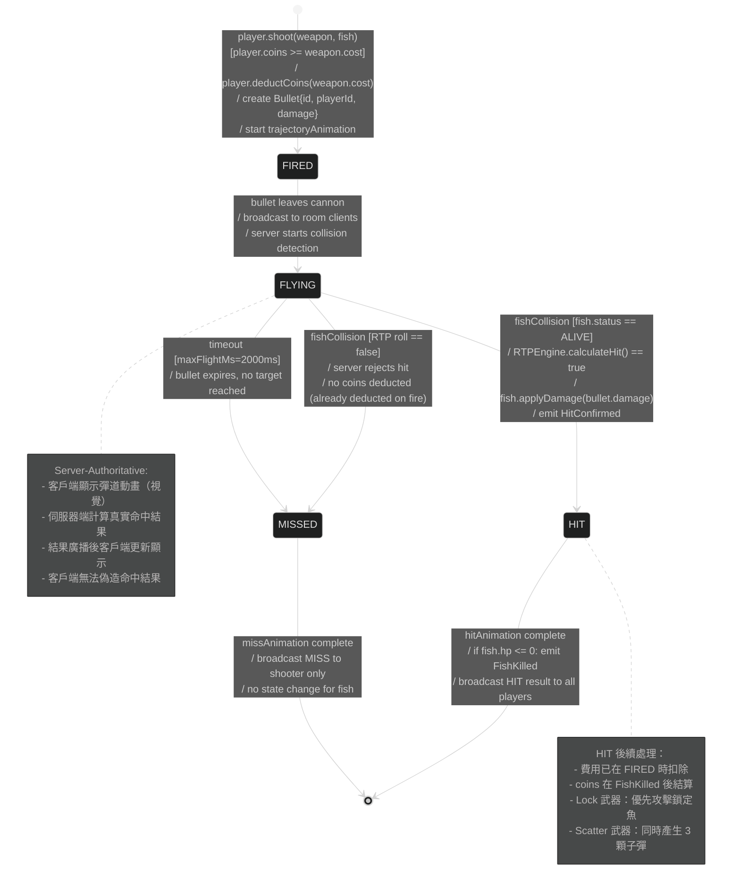
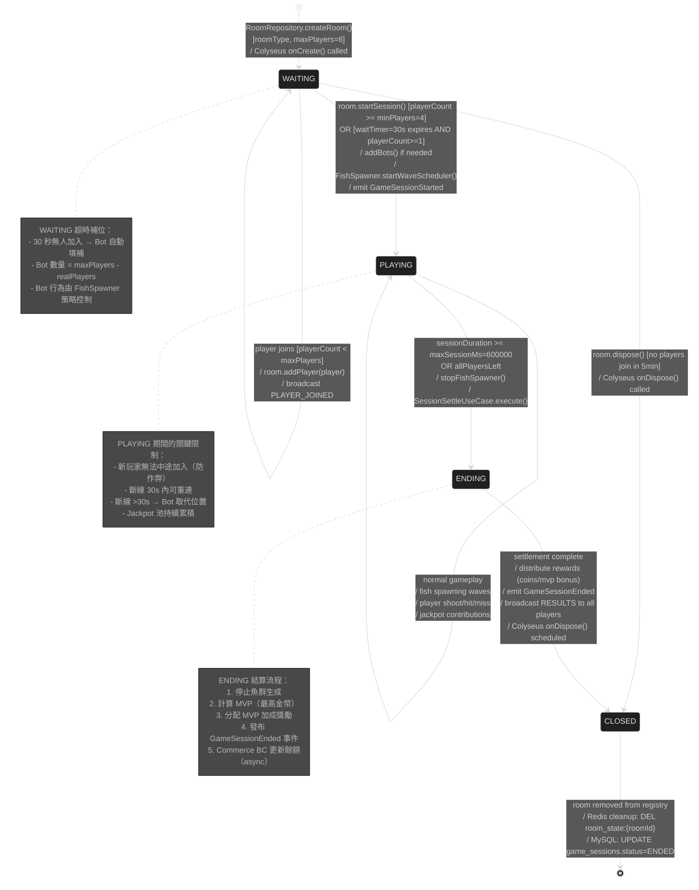
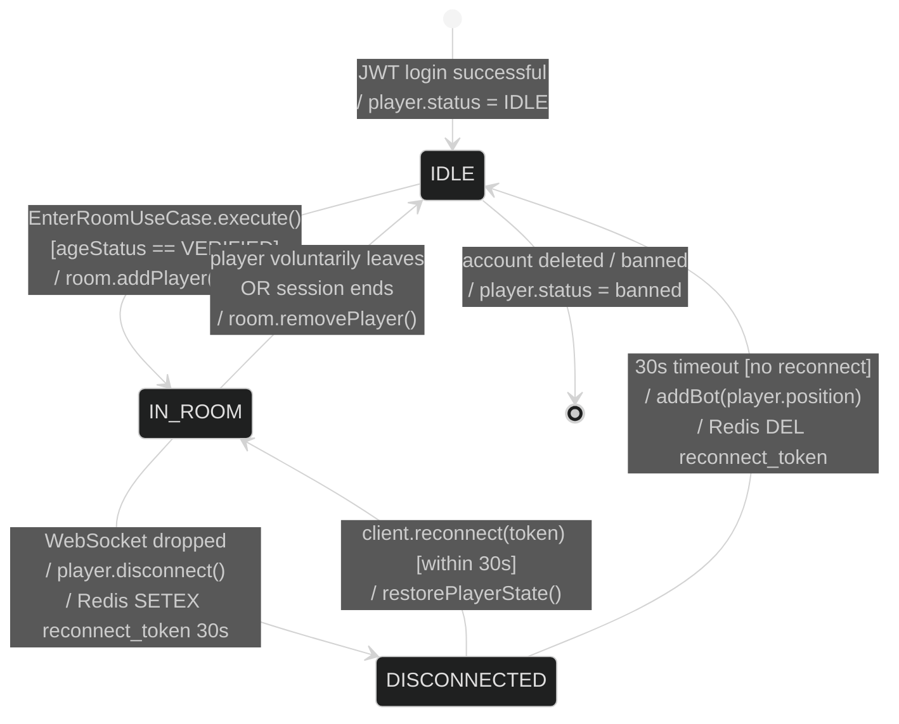

# State Machine — Bullet & Room Lifecycle（子彈與房間生命週期）

> 來源：EDD.md §4.5 Domain Events；PRD.md §4.1 US-WPSK-001；ARCH.md §17.2 Circuit Breaker

## Bullet State Machine（子彈生命週期）

## Room State Machine（房間生命週期）

## Player Connection State Machine（玩家連線狀態）

