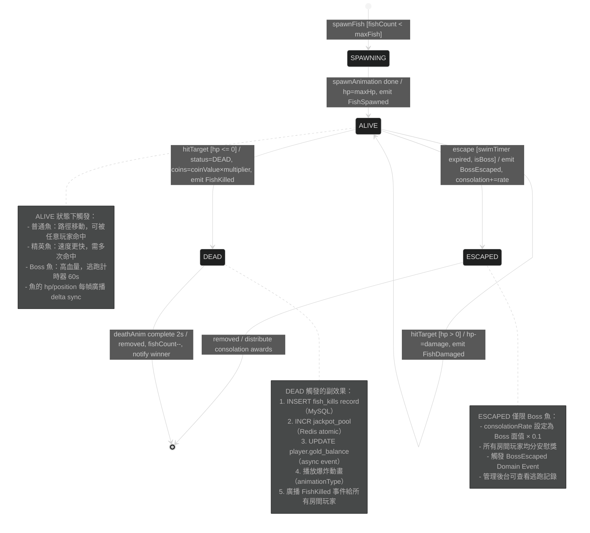
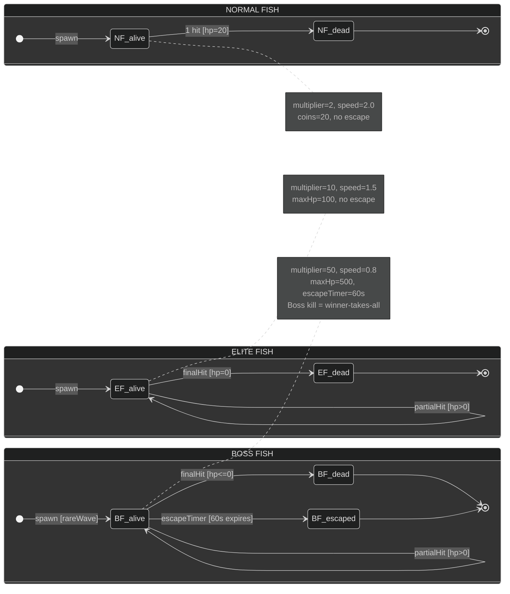

# State Machine — Fish Lifecycle（魚群生命週期狀態機）

> 來源：EDD.md §4.5 FishKilled Domain Event；PRD.md §4.1 US-FISH-001；EDD §1.3 US-FISH-001 AC-2

```mermaid
%%{init: {"theme": "dark"}}%%
stateDiagram-v2
    [*] --> SPAWNING : spawnFish [fishCount < maxFish]

    SPAWNING --> ALIVE : spawnAnimation done / hp=maxHp, emit FishSpawned

    ALIVE --> ALIVE : hitTarget [hp > 0] / hp-=damage, emit FishDamaged

    ALIVE --> DEAD : hitTarget [hp <= 0] / status=DEAD, coins=coinValue×multiplier, emit FishKilled

    ALIVE --> ESCAPED : escape [swimTimer expired, isBoss] / emit BossEscaped, consolation+=rate

    ESCAPED --> [*] : removed / distribute consolation awards

    DEAD --> [*] : deathAnim complete 2s / removed, fishCount--, notify winner

    note right of ALIVE
        ALIVE 狀態下觸發：
        - 普通魚：路徑移動，可被任意玩家命中
        - 精英魚：速度更快，需多次命中
        - Boss 魚：高血量，逃跑計時器 60s
        - 魚的 hp/position 每幀廣播 delta sync
    end note

    note right of DEAD
        DEAD 觸發的副效果：
        1. INSERT fish_kills record（MySQL）
        2. INCR jackpot_pool（Redis atomic）
        3. UPDATE player.gold_balance（async event）
        4. 播放爆炸動畫（animationType）
        5. 廣播 FishKilled 事件給所有房間玩家
    end note

    note right of ESCAPED
        ESCAPED 僅限 Boss 魚：
        - consolationRate 設定為 Boss 面值 × 0.1
        - 所有房間玩家均分安慰獎
        - 觸發 BossEscaped Domain Event
        - 管理後台可查看逃跑記錄
    end note
```

## Fish Type 特性對照

```mermaid
%%{init: {"theme": "dark"}}%%
stateDiagram-v2
    direction LR

    state "NORMAL FISH" as NF {
        [*] --> NF_alive : spawn
        NF_alive --> NF_dead : 1 hit [hp=20]
        NF_dead --> [*]
    }

    state "ELITE FISH" as EF {
        [*] --> EF_alive : spawn
        EF_alive --> EF_alive : partialHit [hp>0]
        EF_alive --> EF_dead : finalHit [hp=0]
        EF_dead --> [*]
    }

    state "BOSS FISH" as BF {
        [*] --> BF_alive : spawn [rareWave]
        BF_alive --> BF_alive : partialHit [hp>0]
        BF_alive --> BF_dead : finalHit [hp<=0]
        BF_alive --> BF_escaped : escapeTimer [60s expires]
        BF_dead --> [*]
        BF_escaped --> [*]
    }

    note right of NF_alive
        multiplier=2, speed=2.0
        coins=20, no escape
    end note

    note right of EF_alive
        multiplier=10, speed=1.5
        maxHp=100, no escape
    end note

    note right of BF_alive
        multiplier=50, speed=0.8
        maxHp=500, escapeTimer=60s
        Boss kill = winner-takes-all
    end note
```
