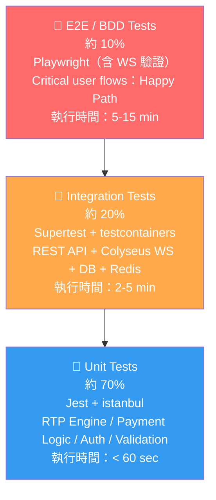

# Test Plan — 測試計畫
<!-- SDLC Quality Engineering — Layer 7：Test Strategy & Plan -->
<!-- 對應學術標準：IEEE 829 Test Plan；業界：Google Test Certified / ISTQB Test Plan -->
<!-- 回答：如何驗證產品符合 BRD/PRD/EDD 定義的需求？測試範圍、工具、責任、時程為何？ -->

---

## Document Control

| 欄位 | 內容 |
|------|------|
| **DOC-ID** | TP-FISHGAME-20260424 |
| **專案名稱** | fishing-arcade-game（捕魚街機遊戲平台）|
| **文件版本** | v1.0 |
| **狀態** | DRAFT |
| **作者（QA Lead）** | AI Generated (gendoc D11-test-plan) |
| **日期** | 2026-04-24 |
| **上游 ARCH** | [ARCH.md](ARCH.md) |
| **上游 API** | [API.md](API.md) |
| **上游 SCHEMA** | [SCHEMA.md](SCHEMA.md) |
| **上游 PRD** | [PRD.md](PRD.md) |
| **下游 BDD** | [features/*.feature](../features/)（D12-BDD-server）|
| **審閱者** | QA Lead, Engineering Lead, Product Manager |
| **核准者** | Executive Sponsor（投資方/創辦人代表）|

---

## Change Log

| 版本 | 日期 | 作者 | 變更摘要 |
|------|------|------|---------|
| v1.0 | 2026-04-24 | AI Generated (gendoc D11-test-plan) | 初稿（依 IEEE 829，21 節完整結構）|

---

## §1 Executive Summary（測試目標與原則）

### §1.1 測試目標

1. **功能驗證**：確認所有 PRD Must-have AC（共 36 條 P0）與 Should-have AC（共 3 條 P1，US-VIP-001）通過自動化測試，P0 通過率達 100%，P1 通過率達 95%+。
2. **覆蓋率保障**：所有服務（Account :3001 / Game :2567 / Shop :3002 / Admin :3003）Unit Test 行覆蓋率（Line Coverage）≥ 80%，RTP 引擎 / 支付邏輯 / 帳號認證等核心模組 ≥ 90%，於每次 PR merge 前由 CI gate 強制驗收。
3. **效能基準**：REST API 在正常負載（500 RPS）下 P99 延遲 ≤ 500ms，WebSocket（Colyseus）事件延遲 P99 ≤ 100ms，Error Rate ≤ 0.1%，1,000 並發峰值壓測通過。
4. **安全合規**：SAST（ESLint security plugin + Semgrep）、DAST（OWASP ZAP）掃描無 High/Critical 等級漏洞，OWASP Top 10 A01-A10 全數覆蓋，於進入 Staging 環境前完成；年齡驗證（US-AGE-001）合規測試通過 Legal 審查。
5. **使用者驗收**：QA Lead + Engineering Lead + Product Owner 於 Release Candidate 確認後 5 個工作天內完成 UAT sign-off，無 P0/P1 open defect。

### §1.2 測試原則

| 原則 | 說明 | 實踐方式 |
|------|------|---------|
| **Risk-Based Testing** | 優先測試高風險、高業務價值的功能 | 參照 §9 Risk Matrix，P0 功能（RTP 引擎 / IAP 支付 / 帳號認證）加強測試深度 |
| **Shift-Left** | 將測試活動盡量前移到開發早期 | Pre-commit hook 執行 Unit Tests；PR 觸發 Integration Tests；Feature Flag 隔離未完成功能 |
| **Fail-Fast** | 最快速找出最嚴重的問題 | CI pipeline 先跑 Unit → Integration → E2E，任一層失敗即中止後續 |
| **Test Isolation** | 每個測試獨立執行，不依賴外部狀態 | 每個 Integration Test 自帶 testcontainers MySQL 8.0 + Redis 7 實例；E2E AfterEach 清理測試資料 |
| **Automation First** | 可自動化的測試必須自動化 | 目標：自動化率 ≥ 90%（E2E smoke 100%，regression 80%）；UAT 為唯一手動環節 |
| **Living Documentation** | 測試即文件，BDD scenarios 直接反映業務需求 | Gherkin feature files 與 PRD AC 雙向追蹤（§15 RTM）|
| **WebSocket-First** | 核心遊戲路徑為 WebSocket，測試策略需覆蓋 WS 事件流 | Integration Test 覆蓋 Colyseus Room 狀態同步；k6 WebSocket 場景獨立定義 |

### §1.3 Test Pyramid



> **比例說明**：
> - **Unit (70%)**：覆蓋所有業務邏輯（RTP 計算、Jackpot 觸發、幂等邏輯、年齡驗證、貨幣扣減）。開發者本機秒級執行，無外部依賴。
> - **Integration (20%)**：覆蓋 REST API contract（Account :3001, Shop :3002, Admin :3003）+ Colyseus WebSocket Room 狀態同步 + MySQL 8.0 + Redis 7 邊界操作，以 testcontainers 隔離。
> - **E2E (10%)**：覆蓋 5 個 Critical User Flows（Happy Path）：帳號註冊/登入 → 快速匹配 → 遊戲局（射魚/競爭/結算）→ 充值鑽石 → VIP 訂閱，以 Playwright 驅動 Cocos Client 模擬頁面操作。

### §1.4 品質目標（Quality Gates）

| 指標 | 目標值 | 測量工具 | 頻率 |
|------|--------|---------|------|
| Unit Test Line Coverage | ≥ 80%（核心模組 ≥ 90%）| Jest + istanbul | 每次 PR |
| Unit Test Branch Coverage | ≥ 70% | Jest + istanbul | 每次 PR |
| Integration Test Pass Rate | 100%（PR merge 前）| Jest JUnit XML | 每次 PR |
| E2E Smoke Pass Rate | 100% | Playwright HTML Report | 每次 PR merge |
| E2E Regression Pass Rate | ≥ 95% | Playwright HTML Report | 每日 Nightly |
| Defect Escape Rate (to Prod) | ≤ 2 defects / sprint | Linear | 每 Sprint |
| REST API P99 Latency（Normal Load 500 RPS）| ≤ 500ms | k6 | 每週 |
| WebSocket P99 Latency（Colyseus Events）| ≤ 100ms | k6 | 每週 |
| Error Rate（Normal Load）| ≤ 0.1% | k6 | 每週 |
| Security High/Critical Issues | 0 | ESLint security + Semgrep + OWASP ZAP | 每次 PR |
| Flaky Test Rate | ≤ 2% | CI Dashboard | 每週 |
| RTP 準確率（10,000 場模擬）| 85%–95%，標準差 < 2% | Jest 數值模擬 | 每 Release |

---

## §2 Test Scope

### §2.1 In-Scope（測試範圍內）

**Must-have 功能（P0，來自 PRD §5 Functional Requirements）：**

| 功能模組 | PRD REQ-ID | AC 數量 | 測試類型 | 備註 |
|---------|-----------|---------|---------|------|
| 玩家帳號系統（註冊/登入/鎖定）| US-ACCT-001 | 5 ACs | Unit + Integration + E2E + Security | JWT 認證、bcrypt 雜湊、登入鎖定——安全敏感，全類型覆蓋 |
| 4–6 人即時多人競技房間 | US-ROOM-001 | 7 ACs | Integration + E2E + Performance | Colyseus WebSocket 房間；WS P99 < 100ms 硬性 SLO |
| 魚群系統（生成/競爭/Boss）| US-FISH-001 | 6 ACs | Unit + Integration + E2E | Redis 原子操作搶魚競爭；降級靜態魚群邏輯 |
| 武器系統＋技能系統 | US-WPSK-001 | 4 ACs | Unit + E2E | 冷卻邏輯、武器解鎖條件 |
| RTP 控制系統＋Jackpot 大獎池 | US-RTP-001 | 5 ACs | Unit（數值模擬）+ Integration | 核心博弈合規邏輯；10,000 場數值模擬 |
| 雙貨幣系統＋IAP 商城 | US-SHOP-001 | 6 ACs | Unit + Integration + E2E + Security | IAP 收據驗證、幂等防重複充值、退款處理 |
| 年齡限制合規（18 歲驗證）| US-AGE-001 | 3 ACs | Unit + Integration + E2E + Compliance | 台灣個資法 + 東南亞未成年保護法規 |

**Should-have 功能（P1）：**

| 功能模組 | PRD REQ-ID | AC 數量 | 測試類型 | 備註 |
|---------|-----------|---------|---------|------|
| VIP 訂閱系統（月費/每日補貼/到期降級）| US-VIP-001 | 3 ACs | Unit + Integration + E2E | 依賴 US-SHOP-001 IAP 基礎設施；Feature Flag `vip_subscription_enabled` 控制 |

**非功能性測試（NFR）：**

- **效能測試**：所有 public REST API endpoints + Colyseus WebSocket 事件流
- **安全測試**：所有 authenticated endpoints、JWT 認證流程、IAP 支付流程、用戶 PII 處理
- **UAT**：所有 P0 Critical User Flows

### §2.2 Out-of-Scope（排除項目）

| 排除項目 | 原因 | 替代方案 |
|---------|------|---------|
| Apple App Store / Google Play IAP 內部邏輯 | 第三方平台責任，非本系統控制範圍 | WireMock/MSW 模擬收據驗證端點；Integration Test 驗證 contract |
| Cocos Creator 引擎渲染核心 | 引擎層非業務程式碼，不可測試 | 測試遊戲邏輯（命中計算、狀態同步），而非渲染結果 |
| iOS/Android 原生 App 安裝包 | MVP 版本為 Web/H5，原生包在 Phase 2 | §19 Mobile Testing 規劃 |
| 超過 3,000 並發的極端壓力測試 | 超出 MVP 部署規模（目標 1,000 並發），成本效益不足 | Soak Test 覆蓋 1,000 並發 2 小時；Stress Test 至 1,500 VU（峰值 150%）|
| IE 11 / 舊版 Mobile Browser | 目標市場瀏覽器市占 < 1% | Chrome/Firefox/Safari 三大瀏覽器矩陣（§3.3）|
| 第三方 Analytics 平台（Mixpanel/Amplitude）內部邏輯 | 第三方服務，僅驗證事件觸發格式 | Integration Test 驗證 event payload 格式 |

### §2.3 Future Scope（後續版本規劃）

| 功能 | 目標版本 | 測試需求說明 |
|------|---------|------------|
| iOS/Android 原生包 | Phase 2（2026-Q4）| 需 §19 Mobile 裝置矩陣，Appium E2E，包體積 / 冷啟動效能預算 |
| 多語系（繁中/英/泰/越）| v1.5 | 需 locale-specific 測試資料、Visual Regression 多語言截圖 |
| 錦標賽模式（Tournament）| Phase 2 | 需新增房間排隊 + 多回合結算 E2E scenarios |
| 社群功能（好友系統）| Phase 3 | 需新增 Social graph Integration Test |

---

## §3 Test Types

### §3.1 Unit Tests

**工具**：Jest 29.x + istanbul（nyc）

**覆蓋率目標**：
- 全體服務 Line Coverage ≥ 80%，Branch Coverage ≥ 70%
- 核心業務邏輯模組 ≥ 90%：RTP 引擎（`src/game/rtp/`）、支付邏輯（`src/shop/payment/`）、帳號認證（`src/account/auth/`）

**主要測試模組**：

| 模組 | 路徑（推斷）| 測試重點 | PRD AC |
|------|-----------|---------|--------|
| RTP 計算引擎 | `services/game/src/rtp/` | 85–95% 區間驗證（10,000 次模擬）、補償邏輯觸發條件 | US-RTP-001/AC-1,AC-2 |
| Jackpot 觸發邏輯 | `services/game/src/jackpot/` | 觸發條件、獎池重置、邊界值 | US-RTP-001/AC-3 |
| 帳號認證（bcrypt/JWT）| `services/account/src/auth/` | bcrypt cost=12 雜湊、JWT 簽發/驗證、Token Rotation | US-ACCT-001/AC-2,AC-4 |
| 年齡驗證邏輯 | `services/account/src/compliance/` | 18 歲邊界、拒絕/允許路徑 | US-AGE-001/AC-1,AC-2 |
| 貨幣扣減（金幣/鑽石）| `services/shop/src/currency/` | 餘額不足、幂等扣減、倍率計算 | US-SHOP-001/AC-2,AC-4 |
| 武器/技能冷卻邏輯 | `services/game/src/weapon/` | 冷卻計時、解鎖條件邊界值 | US-WPSK-001/AC-3,AC-4 |
| 幂等訂單去重 | `services/shop/src/orders/` | 同一 order_id 多次提交 | US-SHOP-001/AC-3 |
| Input Validation（Zod）| 各 service `src/validators/` | Email RFC 5322、密碼強度規則邊界 | US-ACCT-001/AC-5 |

**執行策略**：
- Pre-commit hook（Husky）執行受影響模組的 Unit Tests
- PR CI 強制通過，coverage 低於閾值 block merge

**排除項目**：純 I/O 操作（Prisma ORM 查詢）、Colyseus Room lifecycle（改用 Integration Test 覆蓋）、第三方 SDK wrapper

**Jest 設定檔**：`jest.config.ts`（各 service 各自）；coverage threshold 設定於 `jest.config.ts`：

```typescript
// jest.config.ts（核心服務示例）
export default {
  preset: 'ts-jest',
  testEnvironment: 'node',
  collectCoverageFrom: ['src/**/*.ts', '!src/**/*.d.ts'],
  coverageThresholds: {
    global: { lines: 80, branches: 70 },
    './src/rtp/': { lines: 90, branches: 85 },
    './src/auth/': { lines: 90, branches: 85 },
    './src/payment/': { lines: 90, branches: 85 },
  },
};
```

---

### §3.2 Integration Tests

**工具**：Jest + Supertest 6.x + testcontainers-node（MySQL 8.0 + Redis 7 實際容器）

**Scope**：ARCH 定義的所有 service boundaries（REST API 層 + Colyseus WebSocket Room + DB 操作 + Redis 原子操作）

**API Endpoint 覆蓋清單（來自 API.md）：**

每個 endpoint 覆蓋：200/201 成功 ・ 400 輸入驗證失敗 ・ 401/403 授權失敗 ・ 404 資源不存在 ・ 409 幂等衝突 ・ 422 業務規則失敗 ・ 503 外部依賴不可用

| Service | Endpoint 群組 | 對應 PRD REQ-ID |
|---------|-------------|----------------|
| Account :3001 | `POST /v1/auth/register`、`POST /v1/auth/login`、`POST /v1/auth/logout`、`POST /v1/auth/refresh`、`GET /v1/users/:id` | US-ACCT-001, US-AGE-001 |
| Account :3001 | `POST /v1/age-verification/confirm` | US-AGE-001 |
| Game :2567 | Colyseus `matchmake/joinOrCreate` WebSocket 握手 | US-ROOM-001 |
| Game :2567 | WebSocket 事件流：`fire`、`skill_activate`、`fish_kill`、`jackpot_trigger` | US-FISH-001, US-WPSK-001, US-RTP-001 |
| Shop :3002 | `POST /v1/shop/purchases`（IAP 充值）| US-SHOP-001/AC-1,AC-3,AC-5,AC-6 |
| Shop :3002 | `POST /v1/vip/subscriptions`（VIP 訂閱）| US-VIP-001/AC-1,AC-3 |
| Shop :3002 | `GET /v1/shop/products`、`GET /v1/users/:id/balance` | US-SHOP-001/AC-2,AC-4 |
| Admin :3003 | `POST /v1/game-configs`（RTP/Jackpot 參數設定）| US-RTP-001/AC-5 |

**資料庫測試**：使用 testcontainers 啟動真實 MySQL 8.0 InnoDB，執行完整 11 張表 schema migration 後測試；Redis 7 同樣使用 testcontainers 實例。

**外部服務 Mock（WireMock/nock）**：
- Apple/Google IAP `verifyReceipt` → 成功/失敗/21002 偽造收據三種 stub
- Analytics 事件接收 → nock 攔截，驗證 event payload 格式

**Circuit Breaker 測試**：模擬 IAP 服務連續失敗 > 閾值，驗證 503 Circuit Open 回應（US-SHOP-001/AC-5）

**資料庫約束測試策略（DB Constraint Tests）：**

使用 testcontainers 啟動真實 MySQL 8.0 實例，執行 Prisma migration 後，驗證 SCHEMA.md 定義的所有 DB 層約束：

| 約束類型 | 測試場景 | 預期結果 | TC-ID |
|---------|---------|---------|-------|
| FK ON DELETE SET NULL | 刪除 `users` 記錄 → `session_players.user_id` 應自動設為 NULL（GDPR 用戶刪除不破壞遊戲歷史）| `session_players` 記錄保留，`user_id = NULL` | TC-INT-DB-001-S |
| VIP Trigger 唯一性 | 同一 `user_id` 插入第二筆 `status=active` 的 VIP 訂閱 → DB TRIGGER 應拋出 SQLSTATE 45000 | MySQL error 1644 / TRIGGER fires, INSERT rejected | TC-INT-DB-002-E |
| NOT NULL 邊界 | 插入 `orders` 記錄時 `idempotency_key = NULL` → DB 應拒絕 | MySQL error 1048（Column cannot be null）| TC-INT-DB-003-E |
| Migration 完整性 | 執行 `prisma migrate deploy` → 計算 schema hash，比對 SCHEMA.md §0 DOC-ID 版本 | `prisma migrate status` 顯示 "Database schema is up to date"，無 drift | TC-INT-DB-004-S |
| Migration 回滾 | 套用 migration 後執行 `prisma migrate reset --skip-seed` → 重新套用 → 驗證 11 張表結構完整 | 所有表存在，索引與 FK 如 SCHEMA.md 定義 | TC-INT-DB-005-S |

```typescript
// tests/integration/db-constraints.test.ts
describe('DB Constraint Tests', () => {
  it('TC-INT-DB-001-S: FK ON DELETE SET NULL preserves session_players history', async () => {
    // Arrange: create user, session, session_player
    // Act: DELETE FROM users WHERE id = userId
    // Assert: session_players row still exists with user_id = NULL
  });

  it('TC-INT-DB-002-E: VIP trigger rejects second active subscription', async () => {
    // Arrange: insert first active VIP subscription
    // Act: insert second active VIP subscription for same user
    // Assert: throws MySQL error SQLSTATE 45000
  });

  it('TC-INT-DB-003-E: orders.idempotency_key NOT NULL enforced', async () => {
    // Act: INSERT INTO orders (..., idempotency_key) VALUES (..., NULL)
    // Assert: MySQL error 1048
  });
});
```

---

### §3.3 E2E Tests

**工具**：Playwright 1.4x（TypeScript）

**Browser Matrix**：
- Chrome 120+（主要，自動化主力）
- Firefox 120+（次要）
- WebKit / Safari（MacOS，次要）

**Critical User Flows（每個 Flow = 獨立 Playwright spec 檔）：**

| Flow ID | 名稱 | PRD AC 覆蓋 | Spec 檔案 |
|---------|------|-----------|----------|
| E2E-F01 | 帳號註冊 → 登入 → 大廳 | US-ACCT-001/AC-1, AC-2; US-AGE-001/AC-1, AC-3 | `e2e/account-register-login.spec.ts` |
| E2E-F02 | 快速匹配 → 進入競技房間 → 遊戲開始 | US-ROOM-001/AC-1, AC-3 | `e2e/room-matchmaking.spec.ts` |
| E2E-F03 | 射魚 → 命中/未命中 → 金幣更新 → 結算 MVP 獎勵 | US-FISH-001/AC-2, AC-4; US-ROOM-001/AC-5 | `e2e/gameplay-core.spec.ts` |
| E2E-F04 | IAP 充值 USD 4.99 = 50 鑽石 → 餘額更新 | US-SHOP-001/AC-1; US-AGE-001/AC-1 | `e2e/iap-purchase.spec.ts` |
| E2E-F05 | 武器選擇（雷射炮）→ 冰凍技能觸發 → 冷卻計時 | US-WPSK-001/AC-1, AC-2 | `e2e/weapon-skill.spec.ts` |
| E2E-F06 | VIP 訂閱 USD 9.99 → VIP 光環顯示 → 次日補貼 | US-VIP-001/AC-1, AC-2 | `e2e/vip-subscribe.spec.ts` |

**測試資料策略**：
- **Fixture**：靜態測試帳號（`test-player-01@example.com`、`test-vip@example.com`）存於 Playwright `fixtures/` 目錄
- **Factory**：透過 API 動態建立遊戲房間、充值訂單（`e2e/helpers/factory.ts`）
- **AfterEach**：清理測試資料（DELETE 測試帳號、清空測試訂單），保證測試隔離

**Selector 策略**：優先使用 `data-testid` 屬性（如 `[data-testid="quick-match-btn"]`）；禁止依賴 CSS class 或 XPath

**不測試範圍**：Apple/Google 實際付款流程（mock IAP endpoint）；Email 寄送（nock 攔截）

---

### §3.4 Performance Tests

**工具**：k6 v0.50+（JavaScript）

**SLO Targets（來自 EDD §10.5）：**

| 端點類型 | P50 | P95 | P99 | Max Error Rate |
|---------|-----|-----|-----|----------------|
| REST 讀取（GET）| < 50ms | < 200ms | < 500ms | < 0.1% |
| REST 寫入（POST/PUT）| < 100ms | < 300ms | < 500ms | < 0.1% |
| WebSocket 事件往返（Colyseus）| < 30ms | < 80ms | < 100ms | < 0.1% |
| IAP 充值（含外部驗證）| < 500ms | < 2s | < 3s | < 0.1% |
| Jackpot 觸發（Redis 原子）| < 50ms | < 150ms | < 300ms | < 0.01% |

**k6 Load Targets（來自 EDD §7 Capacity）：**

| 場景 | 並發 VU | 持續時間 | 目標 RPS |
|------|---------|---------|---------|
| Smoke | 1 | 1 min | 1 |
| Normal Load | 1,000 VU（500 REST + 500 WS）| 30 min | 500 REST + 6,000 WS events/s |
| Peak Load（150%）| 1,500 VU | 10 min | 750 REST |
| Soak | 1,000 VU | 120 min | 500 REST |

---

#### §3.4.1 Smoke Test

```javascript
// tests/performance/smoke.k6.js
import http from 'k6/http';
import { check } from 'k6';

export const options = {
  vus: 1,
  duration: '1m',
  thresholds: {
    http_req_failed: ['rate<0.001'],
    http_req_duration: ['p(99)<500'],
  },
};

export default function () {
  const res = http.get(`${__ENV.API_URL}/v1/health`);
  check(res, { 'status 200': (r) => r.status === 200 });
}
```

**目的**：確認基本功能在生產配置下可運行。Pass Criteria：0 error，REST P99 < 500ms。

---

#### §3.4.2 Load Test

```javascript
// tests/performance/load.k6.js
import http from 'k6/http';
import ws from 'k6/ws';
import { check, sleep } from 'k6';

export const options = {
  stages: [
    { duration: '5m',  target: 1000 },  // ramp-up
    { duration: '20m', target: 1000 },  // steady-state
    { duration: '5m',  target: 0 },     // ramp-down
  ],
  thresholds: {
    http_req_failed: ['rate<0.001'],
    http_req_duration: ['p(50)<100', 'p(95)<300', 'p(99)<500'],
    ws_session_duration: ['p(99)<100'],
  },
};

export default function () {
  // REST path（50% VU）
  if (__VU % 2 === 0) {
    const loginRes = http.post(`${__ENV.API_URL}/v1/auth/login`, JSON.stringify({
      email: `testplayer${__VU}@example.com`, password: 'TestPass123!'
    }), { headers: { 'Content-Type': 'application/json' } });
    check(loginRes, { 'login 200': (r) => r.status === 200 });
    sleep(1);
  } else {
    // WebSocket path（50% VU）
    ws.connect(`${__ENV.WS_URL}`, {}, function (socket) {
      socket.on('open', () => { socket.send(JSON.stringify({ type: 'fire', x: 100, y: 200 })); });
      socket.on('message', (msg) => { check(msg, { 'event received': (m) => m.length > 0 }); });
      socket.setTimeout(() => socket.close(), 5000);
    });
  }
}
```

**Pass Criteria**：REST P99 < 500ms，WebSocket P99 < 100ms，Error Rate < 0.1%。

---

#### §3.4.3 Stress Test

```javascript
// tests/performance/stress.k6.js
export const options = {
  stages: [
    { duration: '5m',  target: 1000 },
    { duration: '5m',  target: 1500 },  // 超載 150%
    { duration: '10m', target: 1500 },  // 維持超載
    { duration: '5m',  target: 0 },     // 壓力釋放
  ],
  thresholds: {
    http_req_failed: ['rate<0.05'],     // 超載下允許 5% error
  },
};
```

**目的**：找出系統在超載下的崩潰點。Pass Criteria：壓力移除後 5 分鐘內 Error Rate 恢復至 < 0.1%，Memory 無 OOM，系統自動恢復正常運行。

---

#### §3.4.4 Soak Test

```javascript
// tests/performance/soak.k6.js
export const options = {
  stages: [
    { duration: '5m',  target: 1000 },   // ramp-up
    { duration: '110m', target: 1000 },  // 2h 持續
    { duration: '5m',   target: 0 },     // ramp-down
  ],
  thresholds: {
    http_req_failed: ['rate<0.001'],
    http_req_duration: ['p(99)<500'],
  },
};
```

**目的**：發現記憶體洩漏、連線池耗盡、資源累積問題（MySQL connection pool、Redis 連線數、Node.js V8 heap）。

**監測指標**：Prometheus metrics（Grafana Dashboard）：
- `process_heap_used_bytes`（Node.js V8 heap，不應線性增長）
- `mysql_pool_connections_active`（不應趨近上限 50）
- `redis_connections_active`（不應持續增長）
- `error_rate_5xx`（不應有上升趨勢）

**Pass Criteria**：2 小時內 Error Rate 無上升趨勢，Memory heap 無線性增長（允許 ± 10% 波動），CPU 平均 < 80%。

---

### §3.5 UAT（User Acceptance Testing）

**工具**：手動測試 + 測試紀錄表（Google Sheets / TestRail）

**參與者**：
- Product Owner（最終 sign-off 責任人）
- QA Lead（測試協調）
- 代表性終端用戶（1–2 名台灣/東南亞玩家，Beta 封測招募）

**驗收標準（直接來自 PRD §9.5 DoD）：**

**Product DoD（PM 確認）：**

| # | 驗收條件 | 驗證方式 |
|---|---------|---------|
| 1 | 所有 P0 AC（36 條）均已驗證通過，每條 AC 有對應測試記錄 | 審查 RTM §15 映射表，TC-001~TC-036 全部標記 PASS |
| 2 | Analytics Events（§7.8 所有事件）已在 Analytics Dashboard 確認觸發（每事件 ≥ 5 次觸發）| Mixpanel/Amplitude Dashboard 截圖 |
| 3 | 所有 Edge Case 和 Error State 已測試，UX 錯誤訊息文案已確認（繁中/英）| 對照 PRD §5 各 AC Error Path 逐一確認 |
| 4 | 年齡驗證機制通過 Legal 審查，虛擬幣不可兌現聲明已顯示 | Legal 書面核准文件 |
| 5 | RTP Sandbox 模擬 10,000 場局，RTP 落在 85–95% 區間，標準差 < 2% | Unit Test 數值模擬報告（US-RTP-001/AC-1）|
| 6 | 所有文案已提取為 i18n key，繁中/英文兩版文案審核通過 | i18n.json 審核記錄 |
| 7 | KPI Baseline 已記錄（Launch 前數據基準）| Analytics Dashboard 設定截圖 |

**Engineering DoD（Engineering Lead 確認）：**

| # | 驗收條件 | 驗證方式 |
|---|---------|---------|
| 1 | 單元測試覆蓋率 ≥ 80%，RTP/支付/帳號模組 100% | Istanbul coverage report（CI artifact）|
| 2 | 所有 API endpoint 有 Integration Test | Swagger 對照 Jest test suite 清單 |
| 3 | P0 Happy Path E2E 通過（帳號→匹配→遊戲→結算→充值完整流程）| Playwright HTML Report |
| 4 | PR 已通過 2 名 Reviewer 核准，無 CRITICAL 代碼問題 | GitHub PR review 記錄 |
| 5 | SAST 無 HIGH/CRITICAL 漏洞，dependencies 無 CVE > 7.0 | Semgrep report + `npm audit` |
| 6 | WebSocket P99 ≤ 100ms，API P99 ≤ 500ms（1,000 並發壓測驗證）| k6 Load Test HTML Report |
| 7 | Feature Flag 已設置，所有 P0 功能有 Kill Switch | Feature Flag 清單（PRD §10.2）確認 |
| 8 | Runbook（操作手冊）已加入 docs/runbook.md，包含常見故障處置步驟 | docs/runbook.md 存在且包含 § IAP 故障處置 |

**通過條件**：P0 功能 100% 通過，P1 功能 ≥ 95% 通過，無 Critical/High 嚴重度未解決缺陷。

---

### §3.6 Security Tests

**工具**：
- SAST：ESLint security plugin（`eslint-plugin-security`）+ Semgrep（OWASP ruleset）
- DAST：OWASP ZAP 2.14+（API Scan + Spider）
- Dependency：`npm audit` + Snyk
- WebSocket Security：k6 + 自定義 WS fuzz

**OWASP Top 10 評估矩陣（A01–A10 全覆蓋）：**

| OWASP ID | 名稱 | 適用性 | 測試方法 | 工具 | 負責人 |
|---------|------|--------|----------|------|--------|
| A01 | Broken Access Control | **高**（房間進入門檻、Admin API、玩家資料隔離）| 未授權 API 呼叫測試；Colyseus Room 越權加入測試 | OWASP ZAP + Supertest | QA Lead |
| A02 | Cryptographic Failures | **高**（密碼 bcrypt、PII AES-256-GCM、HTTPS TLS 1.3+）| 密碼以明文或弱雜湊存儲掃描；TLS 版本確認 | Semgrep + testssl.sh | Security |
| A03 | Injection | **高**（SQL Injection：Prisma 參數化；NoSQL：Redis 命令注入）| SAST 掃描 + OWASP ZAP Active Scan；手動 SQL/NoSQL Fuzz | Semgrep + ZAP | QA Lead |
| A04 | Insecure Design | **中**（RTP 伺服器端計算、Jackpot 觸發邏輯）| Threat Modeling Review（EDD §4 STRIDE 模型）| 架構審查 | Architect |
| A05 | Security Misconfiguration | **高**（k8s RBAC、環境變數洩露、CORS 設定）| CI config scan；Helm chart 安全掃描；CORS 白名單確認 | kubesec + Semgrep | DevOps |
| A06 | Vulnerable Components | **高**（npm dependencies CVE）| 每次 PR `npm audit`；每日 Snyk 掃描 | npm audit + Snyk | DevOps |
| A07 | Auth & Session Failures | **高**（JWT RS256、登入鎖定、WebSocket Auth）| 登入鎖定 5 次測試（US-ACCT-001/AC-4）；JWT 偽造測試；WS 未帶 JWT 連線 | Supertest + ZAP | Security |
| A08 | Software Integrity Failures | **低**（SBOM、npm package 完整性）| package-lock.json integrity hash 確認；CI 簽章驗證 | npm ci + Semgrep | DevOps |
| A09 | Logging Failures | **中**（audit_logs 合規記錄、data_access_logs 敏感資料存取）| 測試登入失敗/Jackpot 觸發後 audit_log 是否寫入；確認敏感資料不寫入應用程式 log | Integration Test + Log review | DevOps |
| A10 | SSRF | **中**（IAP verifyReceipt URL、Webhook callback）| DAST URL 注入測試；確認 IAP callback URL 白名單 | OWASP ZAP SSRF Scanner | QA Lead |

**執行策略**：
- SAST（ESLint security plugin + Semgrep）：整合 PR CI，PR 觸發自動掃描，High/Critical 阻斷 merge
- DAST（OWASP ZAP API Scan）：Staging 環境每週執行（Nightly Scheduler）
- Dependency audit（npm audit + Snyk）：每次 PR + 每日 Nightly
- WebSocket Security Fuzz：每週手動 + ZAP WebSocket Plugin

---

## §4 Test Environment

| 環境 | 用途 | 資料策略 | 存取控制 |
|------|------|----------|----------|
| **Local Dev** | 開發者本機 Unit Test + 快速 Integration Test | testcontainers（按需啟動 MySQL 8.0 + Redis 7 容器）；WireMock 模擬 IAP | 開發者本人 |
| **Staging** | E2E / Performance / Security DAST / UAT | 匿名化玩家資料 replica（PII 欄位 tokenization）；Sandbox IAP endpoint | QA Lead + Dev + PM |
| **Prod-like（Pre-Prod）** | Release Gate：Soak Test + Stress Test + 最終 UAT sign-off | 完整生產資料副本（anonymized clone）；與生產相同 k8s 規模配置 | QA Lead + DevOps Only |

**環境配置（對應 EDD §9 k8s 部署拓撲）：**

| Service | Local | Staging | Prod-like |
|---------|-------|---------|-----------|
| Account :3001 | 本機 Docker | k8s Deployment（1 replica）| k8s Deployment（2 replicas）|
| Game :2567（Colyseus）| 本機 Docker | k8s Deployment（2 replicas）| k8s Deployment（3 replicas）|
| Shop :3002 | 本機 Docker | k8s Deployment（1 replica）| k8s Deployment（2 replicas）|
| MySQL 8.0 | testcontainers | 專用 Staging DB（8GB RAM）| Prod-size DB（16GB RAM）|
| Redis 7 | testcontainers | 專用 Staging Redis（2GB）| Prod-size Redis（4GB）|

---

## §5 Test Data Management

**四種策略與適用場景：**

| 策略 | 適用測試類型 | 實施方式 | 清理機制 |
|------|------------|---------|---------|
| **Factory（動態生成）** | Unit + Integration | `factories/user.factory.ts`、`factories/order.factory.ts` — 每個 Test 獨立生成最小資料集 | afterEach 刪除（Prisma transaction rollback）|
| **Fixture（靜態預設）** | E2E | `fixtures/accounts.json`（固定測試帳號）、`fixtures/game-configs.json`（RTP 設定）| 環境重建時由 seed script 重設 |
| **Seed（DB 初始化）** | Staging 環境基礎資料 | `prisma/seed.ts`：game_configs（RTP 參數）/ products（商城商品）/ 10 個測試帳號 | Staging re-deploy 時執行 |
| **Mock（虛擬回應）** | Integration（外部 API）| `nock`/`WireMock` stub：IAP verifyReceipt 成功/失敗/偽造收據三種場景；Analytics event sink | 測試結束後 nock.cleanAll() |

**PII 處理原則（GDPR + 台灣個資法）：**
- 測試環境禁止使用真實玩家 PII（email / 出生日期 / IP）
- Staging 資料必須先 tokenization：`email` → `test-{hash}@example.com`，`birthdate` → 隨機 1980–2000 年合法日期
- 測試帳號統一使用 `@example.com` 或 `@test.internal` 網域
- Snapshot：生產資料副本匿名化流程由 `scripts/anonymize-db.sh` 執行，每次 Staging 刷新前運行

**測試帳號矩陣：**

| 帳號角色 | Email | 用途 |
|---------|-------|------|
| 一般玩家 | `player-01@example.com` | P0 功能測試 |
| 高金幣玩家 | `rich-player@example.com` | 高倍率房間進入測試 |
| 未成年（拒絕）| `minor-player@example.com` | US-AGE-001/AC-2 |
| 鎖定帳號 | `locked-player@example.com` | US-ACCT-001/AC-4 |
| VIP 訂閱玩家 | `vip-player@example.com` | US-VIP-001 |
| 管理員 | `admin@test.internal` | Admin :3003 API 測試 |

---

## §6 Entry & Exit Criteria

### 整體 Test Entry Criteria（開始測試的前提條件）

- [ ] 功能開發完成，PR 已通過 2 名 Reviewer 核准並 merge 至 `main`
- [ ] Unit Test 100% 通過（CI green），覆蓋率達標
- [ ] Build 成功，Docker image 已推送至 Container Registry
- [ ] Staging 環境部署成功，Health Check 通過（`/v1/health` 回傳 200）
- [ ] 測試資料 Seed 已執行，Fixture 帳號可正常登入
- [ ] Feature Flag 已正確設置（P0 功能 Flag 開啟）

### 各測試階段 Exit Criteria（含 Blocking Defect 定義）

| 測試階段 | 通過條件 | Blocking Defect 定義 | 非 Blocking（可帶 Ticket 上線）|
|---------|---------|---------------------|-----------------------------|
| Unit Test | Line Coverage ≥ 80%（核心模組 ≥ 90%），0 failure | 任何 failure；任何核心模組 Coverage < 90% | Coverage < 80% 但 > 75%（附修復計畫）|
| Integration Test | 所有 API endpoint 測試通過；WS 事件流驗證通過 | 任何 P0 功能 API failure；WS 斷線重連失敗 | P1 功能 timeout（有 retry 機制）|
| E2E Test | 5 個 Critical Flow 100% pass（Smoke）| 任何 Happy Path Flow failure；帳號/支付流程失敗 | 次要 UI 視覺差異（附截圖 Ticket）|
| Performance Test | REST P99 < 500ms，WS P99 < 100ms，Error Rate < 0.1% | SLO 超標 50%（P99 > 750ms 或 WS > 150ms）| P95 超標 10%（附優化計畫）|
| Security Test | OWASP High/Critical 全數修復；`npm audit` 無 CVE > 7.0 | 任何 Critical/High 漏洞未修復 | Medium severity（附修復日期）|
| UAT | P0 功能 100% pass，P1 功能 ≥ 95% pass，無 open Critical/High defect | 任何 Critical defect open；Product DoD 任一條未達標 | Low severity UI issue（附 Ticket）|

### Release Exit Criteria（上線決策閘門）

- [ ] 所有測試階段 Exit Criteria 均達標
- [ ] 所有 P0/P1 缺陷已修復並通過 Retest 驗證
- [ ] Soak Test（2 小時）結果確認無記憶體洩漏跡象
- [ ] RTP Sandbox 模擬 10,000 場局確認 RTP 在 85–95%（US-RTP-001/AC-1）
- [ ] QA Lead + Engineering Lead + Product Owner 三方書面核准（§18 Sign-off）

---

## §7 Defect Management

**嚴重度定義與 SLA：**

| Priority | 定義 | 典型案例 | 修復 SLA | 驗證 SLA |
|---------|------|---------|---------|---------|
| **P0 Critical** | 系統崩潰 / 資料遺失 / 安全漏洞 / 重複扣款 | IAP 雙重扣款；JWT 偽造可通過；MySQL 資料遺失 | 4 小時 | 2 小時 |
| **P1 High** | 核心功能無法使用（無 workaround）| 快速匹配失敗；充值成功但鑽石未到帳；WS P99 > 500ms | 24 小時 | 4 小時 |
| **P2 Medium** | 功能受損但有 workaround | 技能冷卻時間顯示錯誤；魚群偶發不同步 | 3 個工作天 | 1 個工作天 |
| **P3 Low** | UI 問題 / 次要功能異常 | 金幣動畫播放時機略晚；字型對齊偏移 | Next Sprint | Next Sprint |

**缺陷流程（Linear）：**

```
新發現 → Bug Created（含截圖/trace/HTTP log）
→ Triage（QA Lead + Engineering Lead，每日 10:00 am）
→ 指派開發（依優先度 SLA）
→ Fix Deployed（Staging）
→ Verified（QA Retest）
→ Closed / Reopen
```

**Root Cause 分類標籤**（Linear label）：logic-error / validation-gap / race-condition / environment / spec-ambiguity

---

## §8 Test Schedule

| 測試階段 | 觸發條件 | 預計週期 | 執行方式 | 環境 |
|---------|---------|---------|---------|------|
| Unit Test | 每次 commit（pre-commit hook）+ PR CI | 持續 < 60s | GitHub Actions 自動化 | Local / CI |
| Integration Test | PR created → CI pipeline | 持續 < 5 min | GitHub Actions 自動化 | CI（testcontainers）|
| E2E Smoke | PR merged to main → CD pipeline | 每次 merge < 15 min | GitHub Actions 自動化 | Staging |
| E2E Regression | Daily Nightly（凌晨 2:00 UTC+8）| 每日 < 30 min | GitHub Actions 排程 | Staging |
| Performance（Load）| Weekly（週三 Nightly）+ Release PR | 每週 1h | GitHub Actions 排程 | Staging |
| Performance（Stress）| Release Gate 前 | 每次 Release | 手動觸發 CI | Prod-like |
| Performance（Soak）| 每週末（週六 22:00）+ Release Gate 前 | 每週 2h | GitHub Actions 排程 | Prod-like |
| Security（SAST）| PR CI | 每次 PR < 3 min | GitHub Actions 自動化 | CI |
| Security（DAST + ZAP）| Weekly Nightly（週四 01:00）| 每週 2h | GitHub Actions 排程 | Staging |
| Dependency Audit | Daily Nightly（02:00）+ PR CI | 每日 | GitHub Actions 排程 | CI |
| UAT | Release Candidate 確認後 | 3–5 個工作天 | 手動（QA Lead 協調）| Staging |

---

## §9 Risk-Based Testing

**風險優先級對應矩陣（基於 BRD Must-have MoSCoW + 業務影響）：**

| 功能 | 業務優先級 | 風險等級 | 風險原因 | 測試深度 | 覆蓋率目標 |
|------|----------|---------|---------|---------|-----------|
| IAP 充值 + 退款（US-SHOP-001）| P0 Must-have | **Critical** | 雙重扣款 / 退款未扣 → 直接財務損失 | Unit + Integration + E2E + Security + Performance | ≥ 95% |
| RTP 引擎 + Jackpot（US-RTP-001）| P0 Must-have | **Critical** | RTP 超出 85–95% → 合規風險 / 玩家投訴 | Unit（10,000 場模擬）+ Integration | ≥ 95% |
| JWT 認證 + 登入鎖定（US-ACCT-001）| P0 Must-have | **High** | JWT 偽造 → 帳號劫持；登入鎖定失效 → 暴力破解 | Unit + Integration + E2E + Security | ≥ 90% |
| 多人搶魚競爭（Redis 原子，US-FISH-001/AC-6）| P0 Must-have | **High** | Redis 非原子操作 → 重複計算金幣 → 帳號餘額錯誤 | Integration（並發測試）| ≥ 90% |
| WebSocket Room 狀態同步（US-ROOM-001）| P0 Must-have | **High** | WS P99 > 100ms → 遊戲體驗崩壞；斷線補位失敗 | Integration + Performance（WS 負載）| ≥ 90% |
| 年齡驗證合規（US-AGE-001）| P0 Must-have | **High** | 未成年可進入付費功能 → 法律責任 | Unit + Integration + E2E + Compliance | ≥ 90% |
| 魚群系統降級（US-FISH-001/AC-5）| P0 Must-have | **Medium** | 魚群服務崩潰後遊戲中斷 → 玩家流失 | Integration（chaos 降級）| ≥ 80% |
| VIP 訂閱 + 每日補貼（US-VIP-001）| P1 Should-have | **Medium** | 補貼重複發放 → 金幣通膨 | Unit + Integration | ≥ 80% |
| 武器/技能 UI（US-WPSK-001）| P0 Must-have | **Low** | 視覺 Bug，不影響後端計算 | Unit（邏輯）+ E2E（Happy Path）| ≥ 80% |

**高風險功能詳細 AC 清單（P0 Critical / High 風險）：**

- **US-SHOP-001/AC-3**：幂等訂單去重（網路中斷重試場景）
- **US-SHOP-001/AC-6**：退款回調 → 鑽石扣除 / 負債標記
- **US-RTP-001/AC-1**：10,000 場統計 RTP 85–95%
- **US-FISH-001/AC-6**：6 玩家同時命中 → Redis SETNX 原子性
- **US-ACCT-001/AC-4**：連續 5 次登入失敗 → 15 分鐘鎖定

---

## §10 Performance Testing Spec

### §10.1 負載目標（Load Targets）

| 場景 | 並發 VU | 持續時間 | 目標 RPS | 資料來源 |
|------|---------|---------|---------|---------|
| Smoke | 1 | 1 min | 1 | EDD §7 |
| Normal Load | 1,000（REST 500 + WS 500）| 30 min | 500 REST / 6,000 WS events/s | EDD §7 Capacity |
| Peak Load（150%）| 1,500 | 10 min | 750 REST | EDD §11 Scaling |
| Soak | 1,000 | 120 min（2h）| 500 REST | EDD §12 Chaos |

### §10.2 SLO / SLI 矩陣（來自 EDD §10.5）

| Endpoint 類型 | SLI 指標 | P50 目標 | P95 目標 | P99 目標 | Max Error Rate |
|-------------|---------|---------|---------|---------|----------------|
| REST 讀取（GET /users, /products）| 回應時間 | < 50ms | < 200ms | < 500ms | < 0.1% |
| REST 寫入（POST /auth/login, /purchases）| 回應時間 | < 100ms | < 300ms | < 500ms | < 0.1% |
| Colyseus WebSocket 遊戲事件 | 事件往返延遲 | < 30ms | < 80ms | < 100ms | < 0.1% |
| Colyseus 快速匹配（matchmake）| 匹配完成時間 | < 5s | < 20s | < 30s | < 1% |
| IAP 充值（含外部驗證）| 端到端回應時間 | < 500ms | < 2s | < 3s | < 0.1% |
| Jackpot 觸發（Redis 原子）| 觸發計算時間 | < 30ms | < 80ms | < 200ms | < 0.01% |

### §10.3 k6 Thresholds 完整配置

```javascript
// tests/performance/thresholds.js（共用配置）
export const thresholds = {
  // REST API
  'http_req_duration{scenario:rest}': ['p(50)<100', 'p(95)<300', 'p(99)<500'],
  'http_req_failed{scenario:rest}': ['rate<0.001'],
  // WebSocket
  'ws_session_duration{scenario:ws}': ['p(99)<100'],
  'ws_msgs_received{scenario:ws}': ['rate>0'],
  // Colyseus matchmake
  'http_req_duration{name:matchmake}': ['p(99)<30000'],
  // IAP
  'http_req_duration{name:iap_purchase}': ['p(99)<3000'],
};
```

### §10.4 Performance Test 執行命令與環境規格

**k6 執行命令（Staging 環境）：**

```bash
# ① Smoke Test（1 VU × 1 min）— PR merge 後快速驗證
k6 run --vus 1 --duration 1m \
  -e API_URL=https://staging.fishgame.internal \
  -e WS_URL=wss://staging.fishgame.internal \
  --out json=k6-report/smoke.json \
  tests/performance/smoke.k6.js

# ② Normal Load Test（1,000 VU × 30 min）— 週三 Nightly
k6 run \
  -e API_URL=https://staging.fishgame.internal \
  -e WS_URL=wss://staging.fishgame.internal \
  --out json=k6-report/load.json \
  --out influxdb=http://influxdb:8086/k6 \
  tests/performance/load.k6.js
# options.stages 定義於 load.k6.js：5m ramp-up → 20m steady → 5m ramp-down

# ③ Stress Test（1,500 VU × 10 min）— Release Gate 前
k6 run --vus 1500 --duration 10m \
  -e API_URL=https://staging.fishgame.internal \
  -e WS_URL=wss://staging.fishgame.internal \
  --out json=k6-report/stress.json \
  tests/performance/stress.k6.js

# ④ Soak Test（1,000 VU × 2h）— 週六 22:00
k6 run --vus 1000 --duration 2h \
  -e API_URL=https://staging.fishgame.internal \
  -e WS_URL=wss://staging.fishgame.internal \
  --out json=k6-report/soak.json \
  --out influxdb=http://influxdb:8086/k6 \
  tests/performance/soak.k6.js
```

**Performance Test 環境規格（Staging 專用節點）：**

| 規格項目 | 最低需求 | 建議配置 | 備注 |
|---------|---------|---------|------|
| k6 執行機 vCPU | 2 vCPU | **4 vCPU** | 1,000 VU 約需 2.5 vCPU |
| k6 執行機 RAM | 4GB | **8GB** | 每 VU 約 2-4KB，1,000 VU ≈ 4MB；8GB 保留 headroom |
| 網路頻寬 | 100Mbps | **1Gbps** | WS 高並發下 TCP 不積壓 |
| 可用區（AZ）| — | **與 Staging 服務同 AZ** | 避免跨 AZ 網路抖動影響延遲測量 |
| OS | Ubuntu 22.04 LTS | Ubuntu 22.04 LTS | k6 Linux amd64 binary |
| k6 版本 | v0.50+ | v0.50+ | 支援 Scenarios API + Prometheus output |

**Prometheus Metrics 監測（Performance Test 期間）：**

```yaml
# prometheus/alerts.yml（Performance Test 期間啟用告警）
- alert: HighAPILatency
  expr: histogram_quantile(0.99, http_request_duration_seconds_bucket) > 0.5
  for: 2m

- alert: WSHighLatency
  expr: histogram_quantile(0.99, ws_event_duration_ms_bucket) > 100
  for: 1m

- alert: ErrorRateSpike
  expr: rate(http_requests_total{status=~"5.."}[5m]) / rate(http_requests_total[5m]) > 0.001
  for: 2m
```

---

## §11 CI/CD Integration

### §11.1 Pipeline 測試閘門架構

```
PR Created
  → ① Unit Test（Jest + istanbul）           < 60s  [parallel]
  → ② SAST（ESLint security + Semgrep）      < 180s [parallel with ①]
  → ③ Build（tsc + docker build）            < 120s [after ①② green]
  → ④ Integration Test（Supertest + tc）     < 300s [after ③]
  → ⑤ Dependency Audit（npm audit）         < 60s  [parallel with ④]
  → Status: ALL GREEN → PR Mergeable

PR Merged to main
  → ⑥ Build & Push Docker Image             < 180s
  → ⑦ Deploy to Staging                     < 120s
  → ⑧ E2E Smoke（Playwright）               < 600s
  → ⑨ Notify: Staging Ready

Daily Nightly（02:00 UTC+8）
  → E2E Regression（Playwright full suite）  < 1800s
  → Dependency Audit（Snyk）                < 300s
  → Notify: Slack #qa-status

Weekly（Wednesday 22:00 UTC+8）
  → Load Test（k6 Normal Load 30min）        < 2100s [Staging]
  → DAST OWASP ZAP API Scan                 < 3600s [Staging]
  → Report: Upload to CI artifact

Weekly（Saturday 22:00 UTC+8）
  → Soak Test（k6 2h）                       < 7800s [Prod-like]

Release Gate（手動觸發，Release RC 確認後）
  → Stress Test（k6 150% Peak）              < 1800s [Prod-like]
  → Soak Test（k6 2h）                       < 7800s [Prod-like]
  → Full Security Scan（ZAP + Semgrep）       < 3600s
  → Notify: QA Lead for UAT entry
```

### §11.2 Deployment Smoke Test Checklist

每次 PR merge 觸發 CD 部署 Staging 後，必須在 **5 分鐘內** 完成以下 P0 驗收項目；任一失敗即觸發 Slack 告警並暫停後續 Nightly 排程：

| # | 驗收項目 | 執行命令 / 檢查方式 | Pass 標準 | 執行時間估算 |
|---|---------|-----------------|---------|------------|
| 1 | 四服務健康檢查 | `curl -f https://staging.fishgame.internal/v1/health` × 4 services（Account :3001, Game :2567, Shop :3002, Admin :3003）| 每個 endpoint 回應 `{"status":"ok"}` HTTP 200 | < 10s |
| 2 | 帳號註冊 API | `POST /v1/auth/register`（測試帳號 `smoke-test-${timestamp}@example.com`）| HTTP 201，回應含 `user_id` | < 5s |
| 3 | JWT 登入取得 Token | `POST /v1/auth/login`（上步驟帳號）| HTTP 200，`access_token` 非空 | < 5s |
| 4 | Colyseus WebSocket 握手 | `ws://staging.fishgame.internal:2567` 執行 `matchmake/joinOrCreate fishingRoom` | WS 連線建立，收到 `onJoin` 事件，延遲 < 1s | < 15s |
| 5 | 商品清單查詢 | `GET /v1/shop/products`（Bearer Token）| HTTP 200，`products` 陣列含 ≥ 3 項（含 diamonds_50 / diamonds_330 / diamonds_1680）| < 5s |
| 6 | Redis 連線確認 | Admin :3003 `GET /v1/admin/health/redis`（内部 endpoint）| 回應 `{"redis":"PONG"}` | < 5s |
| 7 | 清理測試帳號 | `DELETE /v1/users/:id`（smoke-test 帳號）| HTTP 204，確保測試資料不汙染 Staging DB | < 5s |

**目標總執行時間**：≤ 5 分鐘（所有項目順序執行）

```bash
# scripts/smoke-test.sh（CD pipeline 步驟 ⑧ E2E Smoke 的前置 P0 快速驗收）
#!/bin/bash
set -euo pipefail
BASE="https://staging.fishgame.internal"
TS=$(date +%s)

echo "=== Deployment Smoke Test ==="
# 1. Health checks
for port in 3001 2567 3002 3003; do
  curl -sf "$BASE:$port/v1/health" | grep -q '"ok"' && echo "✅ :$port healthy" || { echo "❌ :$port FAIL"; exit 1; }
done
# 2-3. Register + Login
REGISTER=$(curl -sf -X POST "$BASE/v1/auth/register" -H "Content-Type: application/json" \
  -d "{\"email\":\"smoke-$TS@example.com\",\"password\":\"Test1234!\",\"display_name\":\"Smoke\",\"birthdate\":\"2000-01-01\",\"agree_terms\":true}")
USER_ID=$(echo "$REGISTER" | jq -r '.user_id')
TOKEN=$(curl -sf -X POST "$BASE/v1/auth/login" -H "Content-Type: application/json" \
  -d "{\"email\":\"smoke-$TS@example.com\",\"password\":\"Test1234!\"}" | jq -r '.access_token')
echo "✅ Auth OK (user_id=$USER_ID)"
# 4. Products
curl -sf "$BASE/v1/shop/products" -H "Authorization: Bearer $TOKEN" | jq -e '.products | length >= 3' > /dev/null && echo "✅ Products OK"
# 7. Cleanup
curl -sf -X DELETE "$BASE/v1/users/$USER_ID" -H "Authorization: Bearer $TOKEN" -w "%{http_code}" | grep -q "204" && echo "✅ Cleanup OK"
echo "=== Smoke Test PASSED ==="
```

### §11.3 GitHub Actions Workflow（關鍵步驟）

```yaml
# .github/workflows/pr-ci.yml
name: PR CI
on: [pull_request]

jobs:
  unit-and-sast:
    runs-on: ubuntu-latest
    strategy:
      matrix:
        service: [account, game, shop, admin]
    steps:
      - uses: actions/checkout@v4
      - uses: actions/setup-node@v4
        with: { node-version: '20' }
      - run: cd services/${{ matrix.service }} && npm ci
      - run: cd services/${{ matrix.service }} && npm test -- --coverage
      - run: npx eslint --plugin security src/
      - run: npx semgrep --config=p/owasp-top-ten src/

  integration:
    needs: unit-and-sast
    runs-on: ubuntu-latest
    steps:
      - uses: actions/checkout@v4
      - uses: actions/setup-node@v4
        with: { node-version: '20' }
      - run: npm ci
      - run: npm run test:integration  # 啟動 testcontainers
        env:
          DOCKER_HOST: unix:///var/run/docker.sock
```

### §11.3 PR CI 時間目標

| 步驟 | 目標時間 | 實際限制 |
|------|---------|---------|
| Unit Test（4 service 並行）| < 60s | 單 service < 15s |
| SAST Scan | < 180s | — |
| Build | < 120s | Docker layer cache |
| Integration Test | < 300s | testcontainers 啟動 < 30s |
| E2E Smoke（PR merged）| < 600s | Playwright headless Chrome |
| **PR CI 總時間**（Unit+SAST+Build+Integration）| **< 10 min** | 並行執行策略 |

---

## §12 Tooling Matrix

| 測試類型 | 工具 | 版本目標 | 設定檔位置 |
|---------|------|---------|-----------|
| Unit Test | Jest | 29.x | `services/*/jest.config.ts` |
| Coverage | istanbul（jest --coverage）| 含於 Jest | `jest.config.ts → coverageThresholds` |
| Integration | Supertest | 6.x | `tests/integration/*.test.ts` |
| DB 容器化 | testcontainers-node | 3.x | `tests/helpers/containers.ts` |
| E2E | Playwright | 1.4x | `playwright.config.ts` |
| E2E Test Data | 內建 Fixtures + Factory | — | `e2e/fixtures/`、`e2e/helpers/factory.ts` |
| Performance | k6 | 0.50+ | `tests/performance/*.k6.js` |
| SAST | ESLint security plugin | latest | `.eslintrc.js`（security rules）|
| SAST 規則集 | Semgrep（OWASP ruleset）| latest | `.semgrep.yml` |
| DAST | OWASP ZAP | 2.14+ | `zap/api-scan.yaml` |
| Dependency Audit | npm audit + Snyk | latest | CI workflow |
| Mock（外部 API）| nock / WireMock | 13.x / 3.x | `tests/mocks/` |
| ORM（測試 migration）| Prisma | 5.x | `prisma/schema.prisma` |
| Type Check（CI gate）| tsc --noEmit | 5.4 | `tsconfig.json` |
| Test Runner（CI）| GitHub Actions | — | `.github/workflows/` |

---

## §13 Reporting & Metrics

### §13.1 CI 報告輸出

| 報告類型 | 格式 | 輸出位置 | 保留期限 |
|---------|------|---------|---------|
| Unit Test Coverage | HTML + JSON badge + JUnit XML | CI Artifact `coverage/` | 30 天 |
| Integration Test Results | JUnit XML + Jest HTML | CI Artifact | 30 天 |
| E2E Results（Playwright）| HTML Report + 失敗截圖 + Playwright Trace | CI Artifact `playwright-report/` | 30 天 |
| Performance Test（k6）| HTML Report + JSON metrics（P50/P95/P99 圖表）| CI Artifact `k6-report/` | 60 天 |
| SAST / Semgrep | JSON + CI 失敗 log | CI Artifact + Linear bug | 永久（Linear Ticket）|
| OWASP ZAP DAST | HTML Report + XML | CI Artifact `zap-report/` | 60 天 |

### §13.2 品質 Dashboard 指標（每週更新，Grafana）

| 指標 | 計算方式 | 告警條件 |
|------|---------|---------|
| 測試覆蓋率趨勢（週對週）| Istanbul JSON badge | 下降 > 5% → Slack #qa-status 告警 |
| Defect Density（per feature）| Linear 缺陷數 / Feature AC 數 | P0 Feature > 1 defect/AC → QA Lead 立即介入 |
| MTTR（平均修復時間）| Linear 建立 → 關閉時間差 | P0 > 4h → Engineering Lead 升級 |
| Test Automation Rate | 自動化 TC 數 / 總 TC 數 | < 90% → Sprint Retrospective 討論 |
| Flaky Test Rate | 偶發失敗 TC / 總 TC | > 2% → @flaky 標記，1 週修復 SLA |
| Performance SLO 達標率 | k6 P99 達標次數 / 總次數 | 連續 2 週 SLO 未達標 → P1 Ticket |

---

## §14 RACI Matrix

| 活動 | QA Lead | Dev | DevOps | PM | Product Owner |
|------|:-------:|:---:|:------:|:--:|:-------------:|
| Unit Test 撰寫 | Consulted | **Responsible** | — | — | — |
| Integration Test 撰寫 | **Responsible** | Consulted | — | — | — |
| E2E Test 撰寫 | **Responsible** | Consulted | — | — | — |
| Performance Test 設計 + 執行 | **Responsible** | Consulted | Consulted | — | — |
| CI Pipeline 設定 + 維護 | Consulted | Consulted | **Responsible** | — | — |
| Security SAST/DAST 執行 + 報告 | **Responsible** | Informed | Consulted | — | — |
| OWASP ZAP 掃描 | **Responsible** | Informed | Consulted | — | — |
| Dependency Audit（Snyk/npm）| Informed | Informed | **Responsible** | — | — |
| UAT 協調 + 執行 | **Responsible** | Informed | — | Consulted | **Accountable** |
| 缺陷 Triage | **Responsible** | Consulted | — | Informed | **Accountable** |
| Release 核准（Go/No-Go）| Consulted | Informed | — | **Responsible** | **Accountable** |
| Test Plan 維護 | **Responsible** | — | — | Informed | — |
| RTP 數值模擬驗證 | Consulted | **Responsible** | — | Informed | — |
| Compliance（年齡驗證 Legal）| Informed | Informed | — | **Responsible** | **Accountable** |

---

## §15 Requirements Traceability Matrix（RTM）

> [WARNING] class-inventory.md 未找到，下方 Unit Test 路徑為從 EDD §4.5.2 classDiagram 推斷值。請執行 /gendoc-gen-diagrams 後更新 §15.2。

### §15.1 E2E / Integration RTM（PRD AC → TC-ID → BDD Scenario）

> **TC 數量說明（align-fix D1-G-1）：** 本表包含 43 個核心 TC（按 PRD AC 正式映射），為「實作啟動前最低覆蓋要求」。
> RTM §3/§4 另含 80+ 個 BDD 補充 Scenarios（含 Outline 展開後 ~138 個有效 test case），兩者不重複計算。
> 43 = 核心映射 TC；80+ = RTM 全量；~138 = 含 Outline 展開後 test case 總數。
>
> **feature 路徑說明：** 下表 BDD Scenario 欄位路徑為設計期原始命名（account_registration.feature 等），
> 實際 features/ 目錄已依模組分層（auth/user_registration.feature 等），請參考 RTM §4/§5 的實際路徑。

> TC-ID 命名格式：`TC-{TYPE}-{MODULE}-{SEQ}-{CASE}`
> TYPE: E2E / INT（Integration）/ UNIT
> MODULE: ACCT / ROOM / FISH / WPSK / RTP / SHOP / AGE / VIP
> CASE: S（Success/Happy Path）/ E（Error Path）/ B（Boundary）

| TC-ID | PRD REQ-ID | AC 描述摘要 | BDD Scenario（features/）| 測試類型 | 狀態 |
|-------|-----------|-----------|------------------------|---------|------|
| TC-E2E-ACCT-001-S | US-ACCT-001/AC-1 | 帳號註冊成功 → 自動登入 → 跳轉大廳 | `features/account_registration.feature`（S01）| E2E | 待執行 |
| TC-INT-ACCT-002-S | US-ACCT-001/AC-2 | 登入成功 → JWT + Refresh Token 簽發 | `features/account_registration.feature`（S02）| E2E + Integration | 待執行 |
| TC-INT-ACCT-003-E | US-ACCT-001/AC-3 | Email 已存在 → 409 EMAIL_ALREADY_EXISTS | `features/account_registration.feature`（S03）| Unit + Integration | 待執行 |
| TC-INT-ACCT-004-E | US-ACCT-001/AC-4 | 連續 5 次登入失敗 → 帳號鎖定 15 分鐘 | `features/account_registration.feature`（S04）| Unit + Integration | 待執行 |
| TC-UNIT-ACCT-005-B | US-ACCT-001/AC-5 | 密碼強度 onBlur 即時驗證 → bcrypt cost=12 | `features/account_registration.feature`（S05）| Unit | 待執行 |
| TC-INT-ACCT-006-E | — | `POST /v1/auth/login` 帶過期 JWT → 401 Unauthorized | 無（Integration 直接測試）| Integration | 待執行 |
| TC-INT-ACCT-007-E | — | `GET /v1/users/:id` 帶他人 user_id + 有效 JWT → 403 Forbidden | 無（Integration 直接測試）| Integration | 待執行 |
| TC-E2E-ROOM-001-S | US-ROOM-001/AC-1 | 快速匹配 30 秒內 → 4–6 人競技房間 → WS P99 < 200ms | `features/multiplayer_room.feature`（S01）| E2E + Performance | 待執行 |
| TC-INT-ROOM-002-S | US-ROOM-001/AC-2 | 玩家 A 捕魚 → 魚從公共池消失 → 同步 < 100ms | `features/multiplayer_room.feature`（S02）| Integration | 待執行 |
| TC-E2E-ROOM-003-S | US-ROOM-001/AC-3 | 等待 > 30s → Bot 補位 → 遊戲繼續 | `features/multiplayer_room.feature`（S03）| E2E | 待執行 |
| TC-INT-ROOM-004-E | US-ROOM-001/AC-4 | WS 中斷 → 5s 重連 → 失敗後 Bot 接替 | `features/multiplayer_room.feature`（S04）| Integration | 待執行 |
| TC-E2E-ROOM-005-S | US-ROOM-001/AC-5 | 結算 → MVP 獎勵 +10% → 3s 內顯示 | `features/multiplayer_room.feature`（S05）| E2E | 待執行 |
| TC-INT-ROOM-006-E | US-ROOM-001/AC-6 | Colyseus 503 → 提示重試 → 不建立空房間 | `features/multiplayer_room.feature`（S06）| Integration | 待執行 |
| TC-UNIT-ROOM-007-E | US-ROOM-001/AC-7 | 金幣不足 → 拒絕進入高倍率房間 → 引導 | `features/multiplayer_room.feature`（S07）| Unit | 待執行 |
| TC-INT-ROOM-008-E | — | Colyseus matchmake 帶無效 JWT → 401 拒絕連線 | 無（Integration 直接測試）| Integration | 待執行 |
| TC-INT-FISH-001-S | US-FISH-001/AC-1 | 魚群初始化 ≥ 3 種魚 ≥ 20 條 | `features/fish_system.feature`（S01）| Integration | 待執行 |
| TC-E2E-FISH-002-S | US-FISH-001/AC-2 | 命中普通魚 → RTP 動態計算 → 3s 內金幣更新 | `features/fish_system.feature`（S02）| Unit + E2E | 待執行 |
| TC-INT-FISH-003-B | US-FISH-001/AC-3 | Boss 贏者通吃 → 非擊殺 0% → 逃跑 5% 安慰 | `features/fish_system.feature`（S03）| Integration | 待執行 |
| TC-E2E-FISH-004-S | US-FISH-001/AC-4 | Boss 血量歸零 → 2s 動畫 → 即時金幣更新 | `features/fish_system.feature`（S04）| E2E | 待執行 |
| TC-INT-FISH-005-E | US-FISH-001/AC-5 | 魚群服務崩潰 → 降級靜態波次 → 不中斷 | `features/fish_system.feature`（S05）| Integration | 待執行 |
| TC-INT-FISH-006-B | US-FISH-001/AC-6 | 6 玩家同時命中 → Redis SETNX → 唯一計算 | `features/fish_system.feature`（S06）| Integration（並發）| 待執行 |
| TC-E2E-WPSK-001-S | US-WPSK-001/AC-1 | 選擇雷射炮 → 進房 → 直線穿透命中計算 | `features/weapon_skill.feature`（S01）| E2E | 待執行 |
| TC-E2E-WPSK-002-S | US-WPSK-001/AC-2 | 冷卻結束 → 冰凍技能觸發 → 全屏 3s 停頓 | `features/weapon_skill.feature`（S02）| E2E | 待執行 |
| TC-UNIT-WPSK-003-E | US-WPSK-001/AC-3 | 冷卻中點擊技能 → 按鈕置灰 → 無效點擊 | `features/weapon_skill.feature`（S03）| Unit | 待執行 |
| TC-UNIT-WPSK-004-E | US-WPSK-001/AC-4 | 未解鎖鎖定炮 → 提示等級要求 → 不允許使用 | `features/weapon_skill.feature`（S04）| Unit | 待執行 |
| TC-UNIT-RTP-001-S | US-RTP-001/AC-1 | 10,000 場模擬 → RTP 85–95%，標準差 < 2% | `features/rtp_jackpot.feature`（S01）| Unit（數值模擬）| 待執行 |
| TC-INT-RTP-002-S | US-RTP-001/AC-2 | 連敗 > 閾值 → 補償邏輯觸發 → 命中率動態提升 | `features/rtp_jackpot.feature`（S02）| Integration | 待執行 |
| TC-E2E-RTP-003-S | US-RTP-001/AC-3 | Jackpot 觸發 → 動畫 ≥ 3s → 獎池重置 | `features/rtp_jackpot.feature`（S03）| E2E | 待執行 |
| TC-INT-RTP-004-S | US-RTP-001/AC-4 | Jackpot 觸發 → 1s 內寫入後台審計日誌 | `features/rtp_jackpot.feature`（S04）| Integration | 待執行 |
| TC-INT-RTP-005-E | US-RTP-001/AC-5 | RTP 服務 Health Check 失敗 3 次 → 降級 80% 固定命中 | `features/rtp_jackpot.feature`（S05）| Integration | 待執行 |
| TC-INT-RTP-006-E | — | `POST /v1/game-configs` 帶非 Admin JWT → 403 Forbidden | 無（Integration 直接測試）| Integration | 待執行 |
| TC-E2E-SHOP-001-S | US-SHOP-001/AC-1 | USD 4.99 = 50 鑽石充值 → 5s 內餘額更新 | `features/iap_purchase.feature`（S01）| E2E | 待執行 |
| TC-UNIT-SHOP-002-E | US-SHOP-001/AC-2 | 鑽石不足 → 拒絕購買 → 餘額不變 → 引導充值 | `features/iap_purchase.feature`（S02）| Unit | 待執行 |
| TC-INT-SHOP-003-B | US-SHOP-001/AC-3 | 網路中斷重試 → 幂等 order_id → 不重複充值 | `features/iap_purchase.feature`（S03）| Integration | 待執行 |
| TC-UNIT-SHOP-004-B | US-SHOP-001/AC-4 | 金幣倍率扣減 → 即時更新 → 歸零自動降回 1x | `features/iap_purchase.feature`（S04）| Unit | 待執行 |
| TC-INT-SHOP-005-E | US-SHOP-001/AC-5 | IAP 平台不可用 → Circuit Breaker Open → 503 提示 | `features/iap_purchase.feature`（S05）| Integration | 待執行 |
| TC-INT-SHOP-006-E | US-SHOP-001/AC-6 | IAP 退款回調 → 5s 內扣鑽 / 負債標記 | `features/iap_purchase.feature`（S06）| Integration | 待執行 |
| TC-INT-SHOP-007-E | — | `POST /v1/shop/purchases` 無 JWT → 401 Unauthorized | 無（Integration 直接測試）| Integration | 待執行 |
| TC-E2E-AGE-001-S | US-AGE-001/AC-1 | 首次開啟 → 強制年齡確認彈窗 → 拒絕 → 演示模式 | `features/age_verification.feature`（S01）| E2E | 待執行 |
| TC-UNIT-AGE-002-E | US-AGE-001/AC-2 | 輸入未滿 18 歲 → 拒絕 → 付費功能鎖定 | `features/age_verification.feature`（S02）| Unit | 待執行 |
| TC-INT-AGE-003-S | US-AGE-001/AC-3 | ≥ 18 歲確認 → 記錄寫入 DB → 付費功能啟用 | `features/age_verification.feature`（S03）| Integration | 待執行 |
| TC-INT-AGE-004-E | — | 未通過年齡驗證用戶呼叫 `POST /v1/shop/purchases` → 403 AGE_RESTRICTED | 無（Integration 直接測試）| Integration | 待執行 |
| TC-E2E-VIP-001-S | US-VIP-001/AC-1 | VIP 月費訂閱 → VIP 等級即時顯示 → 首日 5 鑽石 | `features/vip_subscription.feature`（S01）| E2E | 待執行 |
| TC-INT-VIP-002-S | US-VIP-001/AC-2 | VIP 每日第一次登入 → 自動補貼 → 不重複 | `features/vip_subscription.feature`（S02）| Integration | 待執行 |
| TC-INT-VIP-003-E | US-VIP-001/AC-3 | VIP 到期 → 次日降 VIP 0 → 補貼停止 | `features/vip_subscription.feature`（S03）| Integration | 待執行 |

### §15.2 Unit Test RTM（核心模組 Class 覆蓋）

> [WARNING] class-inventory.md 未找到，Class 路徑為從 EDD §4.5.2 classDiagram 推斷值。請執行 /gendoc-gen-diagrams 後更新。

| TC-ID | Class / Module | Src 路徑（推斷）| Test File（推斷）| 測試場景 | PRD AC |
|-------|----------------|----------------|-----------------|---------|--------|
| TC-UNIT-RTP-001-S | RtpEngine | `services/game/src/rtp/RtpEngine.ts` | `tests/unit/rtp/RtpEngine.test.ts` | 10,000 次模擬 RTP 落在 85–95% | US-RTP-001/AC-1 |
| TC-UNIT-RTP-001-E | RtpEngine | 同上 | 同上 | 模擬統計異常（RTP < 80%）→ 觸發告警 | US-RTP-001/AC-5 |
| TC-UNIT-RTP-001-B | RtpEngine | 同上 | 同上 | 連敗閾值邊界（N-1 次不補償，第 N 次補償）| US-RTP-001/AC-2 |
| TC-UNIT-JACKPOT-001-S | JackpotService | `services/game/src/jackpot/JackpotService.ts` | `tests/unit/jackpot/JackpotService.test.ts` | Jackpot 觸發率符合設計規格 | US-RTP-001/AC-3 |
| TC-UNIT-JACKPOT-001-E | JackpotService | 同上 | 同上 | Redis 寫入失敗 → Jackpot 不觸發，狀態回滾 | US-RTP-001/AC-4 |
| TC-UNIT-JACKPOT-001-B | JackpotService | 同上 | 同上 | 觸發率邊界（剛好達到 / 差 1 未達）| US-RTP-001/AC-3 |
| TC-UNIT-AUTH-001-S | AuthService | `services/account/src/auth/AuthService.ts` | `tests/unit/auth/AuthService.test.ts` | 正確密碼 bcrypt compare → JWT 簽發 | US-ACCT-001/AC-2 |
| TC-UNIT-AUTH-001-E | AuthService | 同上 | 同上 | 第 5 次密碼錯誤 → lockAccount，Redis TTL 900s | US-ACCT-001/AC-4 |
| TC-UNIT-AUTH-001-B | AuthService | 同上 | 同上 | 第 4 次失敗不鎖 / 第 5 次鎖（邊界）| US-ACCT-001/AC-4 |
| TC-UNIT-AGE-001-S | AgeVerificationService | `services/account/src/compliance/AgeVerification.ts` | `tests/unit/compliance/AgeVerification.test.ts` | 出生 18 年前 → 通過驗證 → age_verified=true | US-AGE-001/AC-3 |
| TC-UNIT-AGE-001-E | AgeVerificationService | 同上 | 同上 | 出生 < 18 年 → 拒絕 → RESTRICTED 模式 | US-AGE-001/AC-2 |
| TC-UNIT-AGE-001-B | AgeVerificationService | 同上 | 同上 | 今日滿 18 歲（邊界日期）| US-AGE-001/AC-1 |
| TC-UNIT-FISH-001-S | FishKillResolver | `services/game/src/fish/FishKillResolver.ts` | `tests/unit/fish/FishKillResolver.test.ts` | 第一名命中者獲金幣，其餘 0% | US-FISH-001/AC-3 |
| TC-UNIT-FISH-001-E | FishKillResolver | 同上 | 同上 | Redis SETNX 失敗（競爭條件）→ 第二名不計算 | US-FISH-001/AC-6 |
| TC-UNIT-FISH-001-B | FishKillResolver | 同上 | 同上 | Boss 逃跑（血量未歸零）→ 全員 5% 安慰獎勵 | US-FISH-001/AC-3 |
| TC-UNIT-PAY-001-S | PaymentService | `services/shop/src/payment/PaymentService.ts` | `tests/unit/payment/PaymentService.test.ts` | 幂等 order_id → 第二次提交回傳原始訂單 | US-SHOP-001/AC-3 |
| TC-UNIT-PAY-001-E | PaymentService | 同上 | 同上 | IAP verifyReceipt 失敗 → 訂單 status=failed | US-SHOP-001/AC-5 |
| TC-UNIT-PAY-001-B | PaymentService | 同上 | 同上 | 退款回調 + 鑽石餘額剛好用完（負債標記邊界）| US-SHOP-001/AC-6 |
| TC-UNIT-CURR-001-S | CurrencyService | `services/shop/src/currency/CurrencyService.ts` | `tests/unit/currency/CurrencyService.test.ts` | 扣減 10 金幣倍率 → 餘額正確更新 | US-SHOP-001/AC-4 |
| TC-UNIT-CURR-001-E | CurrencyService | 同上 | 同上 | 鑽石餘額 0 → 購買失敗 → 餘額不變 | US-SHOP-001/AC-2 |
| TC-UNIT-CURR-001-B | CurrencyService | 同上 | 同上 | 金幣剛好足夠（餘額 = 消耗量）/ 差 1 不足 | US-SHOP-001/AC-4 |
| TC-UNIT-WPSK-001-S | SkillCooldownManager | `services/game/src/weapon/SkillCooldownManager.ts` | `tests/unit/weapon/SkillCooldownManager.test.ts` | 冷卻結束後可激活技能 | US-WPSK-001/AC-2 |
| TC-UNIT-WPSK-001-E | SkillCooldownManager | 同上 | 同上 | 冷卻中點擊 → 技能不觸發 | US-WPSK-001/AC-3 |
| TC-UNIT-WPSK-001-B | SkillCooldownManager | 同上 | 同上 | 冷卻計時器剛好到 0（邊界觸發）| US-WPSK-001/AC-2 |

---

## §16 Glossary

| 術語 | 定義 |
|------|------|
| **SLO** | Service Level Objective：對服務品質的目標承諾（如 REST P99 ≤ 500ms）|
| **SLI** | Service Level Indicator：衡量 SLO 達成度的指標（實際測量值）|
| **P99** | 第 99 百分位數回應時間（99% 的請求在此時間內完成）|
| **P50 / P95** | 第 50 / 第 95 百分位數回應時間 |
| **Soak Test** | 長時間低負載測試（2 小時），用於發現記憶體洩漏和資源累積問題 |
| **SAST** | Static Application Security Testing：靜態應用程式安全測試（分析原始碼）|
| **DAST** | Dynamic Application Security Testing：動態應用程式安全測試（攻擊執行中的應用）|
| **RTM** | Requirements Traceability Matrix：需求追蹤矩陣（AC → TC-ID → BDD Scenario）|
| **VU** | Virtual User：虛擬用戶，k6 效能測試的並發單位 |
| **DoD** | Definition of Done：功能完成的驗收標準 |
| **RTP** | Return To Player：回報率，實際金幣收益佔所有玩家投入金幣的比例（目標 85–95%）|
| **Jackpot** | 大獎池：累積獎池達到觸發條件時，全額發放給觸發玩家 |
| **testcontainers** | 按需啟動 Docker 容器的測試工具（MySQL 8.0、Redis 7）；Integration Test 使用真實 DB 而非 mock |
| **Colyseus Room** | Colyseus 框架的房間（Room）物件，管理多人 WebSocket 狀態同步和廣播 |
| **幂等（Idempotent）** | 同一操作多次執行結果相同（如同一 order_id 只扣款一次）|
| **IAP** | In-App Purchase：應用程式內購，透過 Apple App Store / Google Play 收取費用 |
| **Circuit Breaker** | 熔斷器：外部服務連續失敗超過閾值後自動開啟，停止發送請求（避免 cascade failure）|
| **GDPR** | General Data Protection Regulation：歐盟通用資料保護法規（台灣對應個人資料保護法）|
| **PII** | Personally Identifiable Information：個人可識別資訊（email、birthdate、IP）|
| **Semgrep** | 開源靜態分析工具，支援 OWASP ruleset 掃描 JavaScript/TypeScript 安全漏洞 |
| **Playwright** | Microsoft 開源 E2E 測試框架，支援 Chrome/Firefox/WebKit，API 測試 + UI 測試 |
| **k6** | Grafana Labs 開源負載測試工具，使用 JavaScript 撰寫測試腳本，支援 WebSocket |
| **Flaky Test** | 偶發性通過/失敗的不穩定測試，通常由時序、外部依賴或並發問題引起 |

---

## §17 References

| 文件 | 位置 | 用途 |
|------|------|------|
| PRD — Product Requirements Document | `docs/PRD.md` | AC 清單、DoD、Success Metrics 來源 |
| EDD — Engineering Design Document | `docs/EDD.md` | 技術棧選型、SLO/SLI、Capacity、STRIDE 威脅模型 |
| ARCH — Architecture Document | `docs/ARCH.md` | Service 邊界、k8s 部署拓撲、Integration Test 環境 |
| API — API Design Document | `docs/API.md` | REST API Endpoint 清單、Error Code 定義 |
| SCHEMA — Database Schema Document | `docs/SCHEMA.md` | 11 張資料表定義、索引策略、GDPR 設計 |
| BDD Feature Files | `features/*.feature` | TC-ID → BDD Scenario 雙向映射（D12-BDD-server）|
| Colyseus 官方文件 | `https://docs.colyseus.io` | WebSocket Room lifecycle、State Sync API |
| OWASP Top 10 2021 | `https://owasp.org/Top10/` | A01–A10 安全測試矩陣依據 |
| k6 文件 | `https://k6.io/docs/` | Load Test Script 語法、WebSocket API |
| Playwright 文件 | `https://playwright.dev/docs/intro` | E2E Test API、設定檔語法 |
| IEEE 829-2008 | 測試計畫標準 | 本文件結構依據 |
| EDD k6 thresholds | `docs/EDD.md §7` | `http_req_duration: ['p(99)<500']`、`ws_session_duration: ['p(99)<100']` |

---

## §18 Approval Sign-off

| 角色 | 姓名 | 簽核日期 | 版本 | 備註 |
|------|------|---------|------|------|
| **QA Lead** | （待填）| _______ | v1.0 | 測試計畫品質確認 |
| **Engineering Lead** | （待填）| _______ | v1.0 | 技術可行性確認 |
| **Product Manager** | （待填）| _______ | v1.0 | 業務範疇確認 |
| **Product Owner** | （待填）| _______ | v1.0 | 最終 UAT 授權 |

**Sign-off 條件**：本測試計畫需獲得以上四個角色書面（email 或線上工具）核准後，方可進入正式測試執行階段。UAT 開始前須再次確認 §6 Entry Criteria 均已滿足。

---

## §19 Mobile Testing Strategy

### §19.1 適用範圍

MVP 版本以 Web/H5（Cocos Creator Web export）為主要目標平台，iOS/Android 原生包列入 Phase 2 規劃。本章節定義 Web Mobile 瀏覽器測試策略，及 Phase 2 原生包測試準備。

### §19.2 Web Mobile 瀏覽器矩陣（MVP）

| 優先級 | 平台 | 瀏覽器 | 目標版本 | 測試重點 |
|--------|------|--------|---------|---------|
| **P0（主要）** | iOS 17+ | Safari / WebKit | latest | Cocos Canvas 渲染、WebSocket 連線穩定性 |
| **P0（主要）** | Android 12+ | Chrome Mobile | latest | Touch 事件精確度、炮台拖拉手勢 |
| **P1（次要）** | iOS 15–16 | Safari | latest-1 | 降級相容性確認 |
| **P1（次要）** | Android 10–11 | Chrome Mobile | latest-1 | WebGL 支援確認 |
| **P2（相容）** | iOS 14 | Safari | — | 最低相容基線，基本功能可用 |

### §19.3 弱網環境測試（Playwright CDP 節流）

```typescript
// e2e/helpers/network-throttle.ts
import { BrowserContext } from '@playwright/test';

export async function setSlowNetwork(context: BrowserContext): Promise<void> {
  const cdpSession = await context.newCDPSession(await context.pages()[0]);
  await cdpSession.send('Network.emulateNetworkConditions', {
    offline: false,
    downloadThroughput: (750 * 1024) / 8,  // 3G: 750 Kbps
    uploadThroughput: (250 * 1024) / 8,
    latency: 150,                           // 150ms RTT
  });
}

// 使用示例（E2E test）：
test('IAP 充值在 3G 環境完成', async ({ context, page }) => {
  await setSlowNetwork(context);
  await page.goto('/shop');
  await page.click('[data-testid="recharge-btn"]');
  await page.waitForSelector('[data-testid="diamond-balance"]', { timeout: 10000 });
});
```

**弱網測試場景**：
- 3G（150ms 延遲 + 10 秒載入超時）：IAP 充值流程、帳號登入
- 高延遲（500ms 延遲）：WebSocket 房間進入、魚群同步（驗證降級行為）

### §19.4 Phase 2 原生包效能預算（預先定義）

| 指標 | iOS 目標 | Android 目標 |
|------|---------|------------|
| 冷啟動（App Launch）| ≤ 2s | ≤ 2s |
| 熱啟動（Background Resume）| ≤ 0.5s | ≤ 0.5s |
| 包體積（安裝包）| ≤ 50MB | ≤ 30MB |
| 記憶體佔用（遊戲中）| ≤ 300MB | ≤ 250MB |

### §19.5 Phase 2 裝置矩陣（計畫）

| 優先級 | iOS 設備 | Android 設備 |
|--------|---------|------------|
| P0（主力）| iPhone 15 Pro（iOS 17）| Samsung Galaxy S24 / Pixel 8 |
| P1（次要）| iPhone 13（iOS 16）、iPhone SE 3（iOS 16）| Redmi Note 13 / OPPO A58 |
| P2（相容）| iPhone 11（iOS 14）| 低端機（Helio G85）|

---

## §20 Accessibility Testing Strategy

### §20.1 適用範圍

捕魚遊戲的 Web 端 UI（遊戲大廳、帳號設定、年齡確認、商城）需符合 WCAG 2.1 AA 標準。遊戲 Canvas 區域（Cocos 渲染）由於是即時互動繪圖，部分 WCAG 標準不適用（標注為 Exception）。

### §20.2 自動化掃描（axe-core + Playwright）

```typescript
// e2e/accessibility.spec.ts
import { test, expect } from '@playwright/test';
import AxeBuilder from '@axe-core/playwright';

test.describe('Accessibility — WCAG 2.1 AA', () => {
  test('帳號登入頁面無 critical/serious violations', async ({ page }) => {
    await page.goto('/login');
    const results = await new AxeBuilder({ page })
      .withTags(['wcag2a', 'wcag2aa', 'wcag21aa'])
      .analyze();
    expect(results.violations.filter(v =>
      ['critical', 'serious'].includes(v.impact ?? '')
    )).toHaveLength(0);
  });

  test('年齡確認彈窗無 critical violations', async ({ page }) => {
    await page.goto('/');
    await page.waitForSelector('[data-testid="age-modal"]');
    const results = await new AxeBuilder({ page })
      .include('[data-testid="age-modal"]')
      .withTags(['wcag2a', 'wcag2aa'])
      .analyze();
    expect(results.violations.filter(v => v.impact === 'critical')).toHaveLength(0);
  });

  test('商城頁面顏色對比度達標', async ({ page }) => {
    await page.goto('/shop');
    const results = await new AxeBuilder({ page })
      .withTags(['wcag2aa'])
      .analyze();
    const contrastViolations = results.violations.filter(v => v.id === 'color-contrast');
    expect(contrastViolations).toHaveLength(0);
  });
});
```

**CI Gate 設定**：

```yaml
# .github/workflows/accessibility.yml
name: Accessibility CI Gate
on: [pull_request]

jobs:
  a11y:
    runs-on: ubuntu-latest
    steps:
      - uses: actions/checkout@v4
      - name: Install Playwright
        run: npx playwright install chromium
      - name: Run Accessibility Tests
        run: npx playwright test e2e/accessibility.spec.ts
      - name: Upload A11y Report
        if: failure()
        uses: actions/upload-artifact@v4
        with:
          name: a11y-violations
          path: playwright-report/
```

**CI 規則**：critical/serious violations 零容忍，阻斷 PR 合併。

### §20.3 AT 手動測試矩陣（輔助技術）

| 組合 | 螢幕閱讀器 | 瀏覽器 | 測試頁面 | 頻率 |
|------|-----------|--------|---------|------|
| 組合 1 | NVDA（Windows）| Chrome 120+ | 帳號登入 / 年齡確認 / 商城 | 每次 Release |
| 組合 2 | VoiceOver（macOS）| Safari | 帳號登入 / 商城 / VIP 頁面 | 每次 Release |
| 組合 3 | TalkBack（Android）| Chrome Mobile | 帳號登入 / 手機端年齡確認彈窗 | 每次 Release |

**測試重點**：
- 年齡確認彈窗（US-AGE-001/AC-1）：鍵盤可聚焦，Tab 順序正確，aria-modal 屬性存在
- 帳號錯誤訊息（US-ACCT-001/AC-3）：aria-live region 正確播報 inline 錯誤
- 商城道具清單：img alt 文字描述正確
- Cocos Canvas 遊戲區域：標注為 Exception，canvas 元素有 aria-label 說明

### §20.4 WCAG Exception 登記

| 元素 | WCAG 條款 | Exception 原因 | 替代方案 |
|------|----------|--------------|---------|
| Cocos Canvas（遊戲主畫面）| 1.1.1 Non-text Content | 即時渲染 Canvas，無法提供靜態 alt text | canvas 元素有 aria-label="捕魚遊戲畫面"，遊戲事件透過 announcer div 播報 |
| 炮台射擊觸控區域 | 2.1.1 Keyboard | 遊戲核心互動需要觸控/滑鼠 | 提供鍵盤輔助模式（Phase 2 考慮）|

---

## §21 Test Debt Management

### §21.1 Flaky Test 管理流程

**Flaky Test 識別標準**：同一測試在 7 天內出現 ≥ 2 次偶發失敗（非代碼變更導致）。

**處置流程**：

```
① CI 偶發失敗被偵測
   → 開發者確認「非 code change 導致」
   → 在 Jest test 加上 @flaky tag（describe 區塊加入 '.flaky' 後綴）
   → 建立 Linear Ticket（P2 Medium：Flaky Test - {test name}）
   → 將該 test 移至 tests/flaky/ 目錄（從主要 CI pipeline 隔離）
   → 設定 1 週修復 SLA（Linear due date）

② 修復過程
   → 根因分析：時序問題（加 waitFor）/ 外部依賴（改用 mock）/ 並發問題（改加 lock）
   → 修復後移回正常目錄，標記 Ticket closed

③ 超時自動處理
   → 1 週 SLA 到期未修復 → 自動觸發 Slack 通知 QA Lead
   → 2 週未修復 → 刪除該測試，要求從頭重寫，Linear Ticket 升級 P1
```

**Flaky Test 追蹤（CI Dashboard）**：每週 Nightly 產出 `flaky-report.json`，追蹤 7 天滾動期偶發失敗率。

### §21.2 測試健康儀表板（6 項週度指標）

每週一 09:00 自動產出週報，發布至 Slack #qa-weekly：

| # | 指標 | 計算方式 | 健康閾值 | 告警條件 |
|---|------|---------|---------|---------|
| 1 | 測試覆蓋率（行 / 分支）| Istanbul JSON badge | Line ≥ 80%，Branch ≥ 70% | 下降 > 5% |
| 2 | Mutation Score | Stryker（可選引入，Phase 2）| ≥ 70% | < 60% 觸發告警 |
| 3 | Flaky Test 數量 | tests/flaky/ 目錄檔案數 | ≤ 3 個 | > 5 個 → P1 Sprint 目標 |
| 4 | CI 平均執行時間 | GitHub Actions run duration 7 日均值 | PR CI < 10 分鐘 | > 15 分鐘 → 優化 Action |
| 5 | 測試失敗率 | 週期內 CI run failed / total | < 5% | > 10% → QA Lead 介入 |
| 6 | Accessibility 違規數 | axe-core critical/serious violations | 0 | > 0 阻斷 Release |

### §21.3 測試技術債登記

| 技術債項目 | 優先級 | 說明 | 計畫解決版本 |
|-----------|--------|------|------------|
| class-inventory.md 未建立，§15.2 路徑為推斷值 | P2 | 執行 /gendoc-gen-diagrams 後更新 RTM Unit Test 路徑 | v1.1（D16-ALIGN 後）|
| Mutation Testing（Stryker）未引入 | P3 | 目前僅有 Line Coverage，Mutation Score 可提升測試品質 | Phase 2 |
| Cocos Canvas WebGL 渲染無法 E2E 截圖驗證 | P2 | Playwright 截圖在 Canvas 元素上為空，需評估 canvas 截圖方案 | Phase 2 |
| k6 WebSocket 腳本缺乏 Colyseus 協議封裝 | P2 | 目前 WS 腳本為通用格式，需適配 Colyseus msgpack schema | v1.1 |
| iOS/Android 原生包 E2E（Appium）尚未建立 | P2 | Phase 2 原生包上線前需完成 | Phase 2 |
